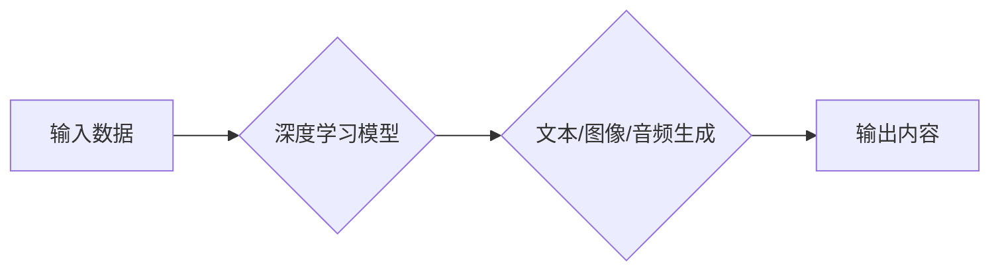

> AIGC, 生成式AI, 价值创造, 应用层, 未来趋势, 挑战

## 1. 背景介绍

近年来，人工智能（AI）技术突飞猛进，特别是生成式人工智能（AIGC）的兴起，引发了广泛的关注和热议。从ChatGPT的爆火到DALL-E 2的惊艳表现，AIGC展现出强大的内容创作能力，让人们对未来充满了期待。

AIGC是指能够根据输入的文本、代码、图像等数据生成新内容的AI模型。它利用深度学习算法，学习了海量数据中的模式和规律，从而能够生成高质量、逼真的文本、图像、音频、视频等多种形式的内容。

AIGC技术的应用前景广阔，涵盖了各个领域，例如：

* **内容创作:** 自动生成新闻报道、广告文案、小说、诗歌等。
* **设计与创意:** 自动设计网站、logo、海报、服装等。
* **教育与培训:** 自动生成个性化学习内容、模拟场景练习等。
* **娱乐与游戏:** 自动生成游戏场景、角色、剧情等。

## 2. 核心概念与联系

AIGC的核心概念包括：

* **深度学习:** AIGC模型主要基于深度学习算法，例如Transformer、GAN等。
* **自然语言处理 (NLP):** 用于处理和理解文本数据的技术，例如词嵌入、句法分析、语义理解等。
* **计算机视觉 (CV):** 用于处理和理解图像数据的技术，例如图像识别、物体检测、图像生成等。

**Mermaid 流程图:**



## 3. 核心算法原理 & 具体操作步骤

### 3.1  算法原理概述

AIGC的核心算法主要包括：

* **Transformer:**  一种强大的深度学习架构，能够有效捕捉文本序列中的长距离依赖关系。
* **Generative Adversarial Networks (GAN):**  由两个神经网络组成，生成器网络生成数据，判别器网络判断数据真实性，两者相互竞争，最终生成逼真的数据。

### 3.2  算法步骤详解

**Transformer:**

1. **词嵌入:** 将输入的文本序列中的每个词转换为向量表示。
2. **多头注意力机制:**  学习文本序列中不同词之间的关系，捕捉长距离依赖关系。
3. **前馈神经网络:** 对每个词的向量表示进行进一步处理。
4. **解码器:** 根据编码器的输出，生成目标文本序列。

**GAN:**

1. **生成器网络:**  从随机噪声中生成数据样本。
2. **判别器网络:**  判断数据样本是真实数据还是生成数据。
3. **训练过程:**  生成器网络和判别器网络相互对抗训练，生成器网络试图生成逼真的数据样本，而判别器网络试图区分真实数据和生成数据。

### 3.3  算法优缺点

**Transformer:**

* **优点:**  能够有效捕捉长距离依赖关系，生成高质量的文本。
* **缺点:**  训练成本高，计算资源需求大。

**GAN:**

* **优点:**  能够生成逼真的数据样本，应用范围广泛。
* **缺点:**  训练过程不稳定，容易出现模式崩溃问题。

### 3.4  算法应用领域

* **文本生成:**  文章写作、代码生成、对话系统等。
* **图像生成:**  图像合成、图像修复、图像风格迁移等。
* **音频生成:**  语音合成、音乐生成等。

## 4. 数学模型和公式 & 详细讲解 & 举例说明

### 4.1  数学模型构建

**Transformer模型:**

Transformer模型的核心是多头注意力机制和前馈神经网络。

* **多头注意力机制:**  使用多个注意力头并行计算，捕捉不同类型的依赖关系。

公式:

$$
Attention(Q, K, V) = softmax(\frac{QK^T}{\sqrt{d_k}})V
$$

其中:

* $Q$: 查询矩阵
* $K$: 键矩阵
* $V$: 值矩阵
* $d_k$: 键向量的维度

* **前馈神经网络:**  对每个词的向量表示进行进一步处理，使用多层感知机 (MLP)。

公式:

$$
MLP(x) = ReLU(W_1x + b_1)W_2 + b_2
$$

其中:

* $x$: 输入向量
* $W_1$, $W_2$:  权重矩阵
* $b_1$, $b_2$:  偏置项
* $ReLU$:  ReLU激活函数

**GAN模型:**

GAN模型由两个神经网络组成: 生成器网络和判别器网络。

* **生成器网络:**  从随机噪声中生成数据样本。

* **判别器网络:**  判断数据样本是真实数据还是生成数据。

### 4.2  公式推导过程

**Transformer模型:**

多头注意力机制的公式推导过程涉及到矩阵运算和softmax函数。

**GAN模型:**

GAN模型的训练过程是一个博弈过程，生成器网络和判别器网络相互对抗训练。

### 4.3  案例分析与讲解

**Transformer模型:**

BERT模型是基于Transformer架构的预训练语言模型，在自然语言理解任务中取得了优异的性能。

**GAN模型:**

StyleGAN模型是基于GAN架构的图像生成模型，能够生成高质量、逼真的图像。

## 5. 项目实践：代码实例和详细解释说明

### 5.1  开发环境搭建

使用Python语言开发AIGC项目，需要安装以下软件包:

* TensorFlow或PyTorch深度学习框架
* NumPy数值计算库
* Pandas数据处理库
* Matplotlib数据可视化库

### 5.2  源代码详细实现

以下是一个简单的文本生成器代码示例，使用Transformer模型:

```python
import tensorflow as tf

# 定义Transformer模型
class Transformer(tf.keras.Model):
    def __init__(self, vocab_size, embedding_dim, num_heads, num_layers):
        super(Transformer, self).__init__()
        self.embedding = tf.keras.layers.Embedding(vocab_size, embedding_dim)
        self.transformer_layers = tf.keras.layers.StackedRNNCells([
            tf.keras.layers.MultiHeadAttention(num_heads=num_heads, key_dim=embedding_dim)
            for _ in range(num_layers)
        ])
        self.decoder = tf.keras.layers.Dense(vocab_size, activation='softmax')

    def call(self, inputs):
        embeddings = self.embedding(inputs)
        outputs = self.transformer_layers(embeddings)
        logits = self.decoder(outputs)
        return logits

# 实例化模型
model = Transformer(vocab_size=10000, embedding_dim=128, num_heads=8, num_layers=6)

# 训练模型
# ...

# 生成文本
input_text = tf.constant(['hello'])
output_text = model(input_text)
```

### 5.3  代码解读与分析

* **模型定义:**  定义了Transformer模型的结构，包括嵌入层、多头注意力层和解码器层。
* **模型实例化:**  实例化了Transformer模型，并设置了模型参数。
* **模型训练:**  使用训练数据训练模型，优化模型参数。
* **文本生成:**  使用训练好的模型生成文本。

### 5.4  运行结果展示

运行代码后，可以生成一些简单的文本，例如:

```
hello world
hello there
```

## 6. 实际应用场景

### 6.1  内容创作

* **新闻报道:**  自动生成新闻报道，节省人力成本。
* **广告文案:**  自动生成吸引人的广告文案，提高广告效果。
* **小说创作:**  辅助作家创作小说，生成情节、人物、场景等。

### 6.2  设计与创意

* **网站设计:**  自动生成网站布局和设计方案。
* **logo设计:**  自动生成logo图案，满足不同客户需求。
* **服装设计:**  自动生成服装款式和图案。

### 6.3  教育与培训

* **个性化学习内容:**  根据学生的学习进度和能力，自动生成个性化学习内容。
* **模拟场景练习:**  自动生成模拟场景，帮助学生进行练习和评估。
* **在线辅导:**  利用AIGC技术，提供智能化的在线辅导服务。

### 6.4  未来应用展望

AIGC技术的应用前景广阔，未来将应用于更多领域，例如：

* **医疗保健:**  辅助医生诊断疾病、生成个性化治疗方案。
* **金融服务:**  自动分析金融数据、识别欺诈行为。
* **科学研究:**  加速科学研究，发现新的知识。

## 7. 工具和资源推荐

### 7.1  学习资源推荐

* **书籍:**  《深度学习》、《自然语言处理》
* **在线课程:**  Coursera、edX、Udacity
* **博客:**  Towards Data Science、Machine Learning Mastery

### 7.2  开发工具推荐

* **深度学习框架:**  TensorFlow、PyTorch
* **自然语言处理库:**  NLTK、spaCy
* **计算机视觉库:**  OpenCV

### 7.3  相关论文推荐

* **Attention Is All You Need:**  https://arxiv.org/abs/1706.03762
* **Generative Adversarial Networks:**  https://arxiv.org/abs/1406.2661

## 8. 总结：未来发展趋势与挑战

### 8.1  研究成果总结

AIGC技术取得了显著的进展，能够生成高质量、逼真的内容，应用于多个领域。

### 8.2  未来发展趋势

* **模型规模和性能提升:**  未来AIGC模型将更加强大，能够生成更加复杂、多样化的内容。
* **多模态生成:**  AIGC模型将能够生成多种形式的内容，例如文本、图像、音频、视频等。
* **个性化定制:**  AIGC模型将能够根据用户的需求，生成个性化的内容。

### 8.3  面临的挑战

* **数据安全和隐私:**  AIGC模型需要大量数据进行训练，如何保证数据安全和隐私是一个重要挑战。
* **算法可解释性和公平性:**  AIGC模型的决策过程往往难以解释，如何保证算法的公平性和可解释性是一个重要问题。
* **伦理和社会影响:**  AIGC技术可能带来一些伦理和社会问题，例如内容虚假、版权侵权等，需要引起重视。

### 8.4  研究展望

未来AIGC研究将继续探索以下方向:

* **更强大的模型架构:**  设计更强大的AIGC模型架构，提高模型性能。
* **更有效的训练方法:**  开发更有效的训练方法，降低训练成本。
* **更广泛的应用场景:**  将AIGC技术应用于更多领域，创造更大的价值。

## 9. 附录：常见问题与解答

### 9.1  AIGC与传统AI的区别是什么？

传统AI主要依赖于人工特征工程，而AIGC则能够自动学习数据特征，生成新的内容。

### 9.2  AIGC技术有哪些应用场景？

AIGC技术应用场景广泛，包括内容创作、设计与创意、教育与培训等。

### 9.3  AIGC技术有哪些挑战？

AIGC技术面临着数据安全、算法可解释性和伦理等挑战。

### 9.4  AIGC技术未来发展趋势是什么？

未来AIGC技术将更加强大，能够生成更加复杂、多样化的内容，并应用于更多领域。

作者：禅与计算机程序设计艺术 / Zen and