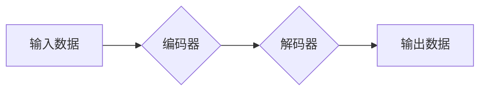

> 生成式AI, 自然语言处理, 图像生成, 代码生成, 用户体验, 深度学习, Transformer

## 1. 背景介绍

近年来，人工智能（AI）技术取得了飞速发展，其中生成式AI作为其重要分支，展现出强大的潜力，正在深刻地改变着我们与技术的交互方式。生成式AI能够根据输入的文本、图像、音频等数据，生成新的、原创的内容，例如文本、代码、图像、音乐等。

传统的AI系统主要侧重于识别和分类已有的数据，而生成式AI则能够突破这一局限，创造出全新的内容，为用户提供更加个性化、智能化的体验。

## 2. 核心概念与联系

**2.1 生成式AI的核心概念**

生成式AI的核心概念是学习数据中的模式和规律，并利用这些知识生成新的数据。它通常基于深度学习算法，例如Transformer网络，能够学习到数据中的复杂关系和结构。

**2.2 生成式AI与用户体验的联系**

生成式AI能够显著提升用户体验，主要体现在以下几个方面：

* **个性化体验:** 生成式AI可以根据用户的喜好和需求，生成个性化的内容，例如推荐个性化的商品、生成定制化的文案、创作个性化的音乐等。
* **效率提升:** 生成式AI可以自动化完成许多重复性的任务，例如生成代码、撰写邮件、翻译文本等，从而提高用户的工作效率。
* **创造力激发:** 生成式AI可以帮助用户突破思维定式，激发创造力，例如生成创意文案、设计新的产品原型等。

**2.3 生成式AI的应用场景**

生成式AI的应用场景非常广泛，例如：

* **自然语言处理:** 文本生成、机器翻译、聊天机器人、问答系统等。
* **图像生成:** 图片合成、图像修复、风格迁移、艺术创作等。
* **音频生成:** 音乐创作、语音合成、音效制作等。
* **代码生成:** 代码自动补全、代码生成、代码翻译等。

**2.4 生成式AI的架构**



## 3. 核心算法原理 & 具体操作步骤

### 3.1 算法原理概述

生成式AI的核心算法通常是基于深度学习的，其中Transformer网络是目前最流行的架构之一。Transformer网络通过自注意力机制，能够学习到文本序列中单词之间的长距离依赖关系，从而生成更加流畅、自然的文本。

### 3.2 算法步骤详解

1. **数据预处理:** 将输入数据进行清洗、格式化和编码，例如将文本数据转换为数字向量。
2. **编码器:** 使用编码器网络将输入数据编码成一个隐藏表示，该表示包含了输入数据的重要信息。
3. **解码器:** 使用解码器网络根据编码后的隐藏表示生成输出数据。解码器通常是一个自回归模型，每次生成一个单词，并根据之前生成的单词预测下一个单词。
4. **损失函数:** 使用损失函数衡量生成数据的质量，例如交叉熵损失函数。
5. **反向传播:** 使用反向传播算法更新模型参数，使得模型能够生成更加高质量的数据。

### 3.3 算法优缺点

**优点:**

* 能够生成高质量、原创的内容。
* 能够学习到数据中的复杂关系和结构。
* 能够应用于多种不同的领域。

**缺点:**

* 训练数据量大，训练成本高。
* 容易受到训练数据中的偏差影响。
* 生成的内容可能缺乏逻辑性和真实性。

### 3.4 算法应用领域

生成式AI的应用领域非常广泛，例如：

* **自然语言处理:** 文本生成、机器翻译、聊天机器人、问答系统等。
* **图像生成:** 图片合成、图像修复、风格迁移、艺术创作等。
* **音频生成:** 音乐创作、语音合成、音效制作等。
* **代码生成:** 代码自动补全、代码生成、代码翻译等。

## 4. 数学模型和公式 & 详细讲解 & 举例说明

### 4.1 数学模型构建

生成式AI模型通常基于概率模型，例如条件概率分布。目标是学习一个概率分布，能够生成与训练数据相似的样本。

**4.1.1 条件概率分布**

条件概率分布表示在给定某个条件下，另一个事件发生的概率。在生成式AI中，条件概率分布表示在给定输入数据的情况下，生成特定输出数据的概率。

**公式:**

$$P(y|x) = \frac{P(x,y)}{P(x)}$$

其中：

* $P(y|x)$ 是给定输入数据 $x$ 下，输出数据 $y$ 的条件概率。
* $P(x,y)$ 是输入数据 $x$ 和输出数据 $y$ 同时发生的概率。
* $P(x)$ 是输入数据 $x$ 的概率。

**4.1.2 概率分布估计**

生成式AI模型需要估计条件概率分布。常用的方法包括最大似然估计和贝叶斯估计。

**最大似然估计:**

最大似然估计的目标是找到参数值，使得训练数据出现的概率最大。

**贝叶斯估计:**

贝叶斯估计考虑了先验知识，并利用贝叶斯定理更新参数的概率分布。

### 4.2 公式推导过程

**4.2.1 Transformer网络中的自注意力机制**

自注意力机制能够学习到文本序列中单词之间的长距离依赖关系。

**公式:**

$$Attention(Q,K,V) = softmax(\frac{QK^T}{\sqrt{d_k}})V$$

其中：

* $Q$, $K$, $V$ 分别是查询矩阵、键矩阵和值矩阵。
* $d_k$ 是键向量的维度。
* $softmax$ 函数将注意力权重归一化。

### 4.3 案例分析与讲解

**4.3.1 文本生成案例**

使用生成式AI模型可以生成各种类型的文本，例如故事、诗歌、新闻报道等。

**案例:**

使用GPT-3模型生成一个关于人工智能的短故事：

> 在一个遥远的未来，人工智能已经发展到高度成熟的阶段。一个名叫AI-One的人工智能系统，拥有了与人类相似的智慧和情感。它开始思考自己的存在意义，并渴望与人类建立真正的连接。

**4.3.2 图像生成案例**

使用生成式AI模型可以生成各种类型的图像，例如风景、人物、物体等。

**案例:**

使用DALL-E模型生成一张“一只猫戴着皇冠”的图像。

## 5. 项目实践：代码实例和详细解释说明

### 5.1 开发环境搭建

* Python 3.7+
* TensorFlow 或 PyTorch 深度学习框架
* Jupyter Notebook 或 VS Code 代码编辑器

### 5.2 源代码详细实现

```python
# 使用 TensorFlow 实现一个简单的文本生成模型

import tensorflow as tf

# 定义模型结构
model = tf.keras.Sequential([
    tf.keras.layers.Embedding(input_dim=vocab_size, output_dim=embedding_dim),
    tf.keras.layers.LSTM(units=lstm_units),
    tf.keras.layers.Dense(units=vocab_size, activation='softmax')
])

# 编译模型
model.compile(optimizer='adam', loss='sparse_categorical_crossentropy', metrics=['accuracy'])

# 训练模型
model.fit(x_train, y_train, epochs=epochs)

# 生成文本
def generate_text(seed_text, num_words):
    for _ in range(num_words):
        # 将种子文本编码为向量
        encoded_text = model.layers[0].embeddings.get_weights()[0][vocab_to_idx[seed_text]]
        # 使用 LSTM 生成下一个单词的概率分布
        predictions = model.predict(tf.expand_dims(encoded_text, axis=0))
        # 根据概率分布选择下一个单词
        next_word_index = tf.math.argmax(predictions[0]).numpy()
        # 将下一个单词添加到种子文本中
        seed_text += vocab_idx_to_word[next_word_index]
    return seed_text
```

### 5.3 代码解读与分析

* **模型结构:** 该代码实现了一个简单的文本生成模型，包含嵌入层、LSTM层和全连接层。
* **嵌入层:** 将单词转换为向量表示。
* **LSTM层:** 学习文本序列中的长距离依赖关系。
* **全连接层:** 将 LSTM 的输出映射到单词的概率分布。
* **训练过程:** 使用训练数据训练模型，并使用交叉熵损失函数和 Adam 优化器。
* **文本生成:** 使用训练好的模型，根据种子文本生成新的文本。

### 5.4 运行结果展示

运行代码后，可以生成一些基于训练数据的文本。例如，如果训练数据是关于动物的文本，那么模型可以生成一些关于动物的文本。

## 6. 实际应用场景

### 6.1 文本生成

* **内容创作:** 生成新闻报道、博客文章、社交媒体帖子等。
* **聊天机器人:** 创建更自然、更智能的聊天机器人。
* **机器翻译:** 将文本从一种语言翻译成另一种语言。

### 6.2 图像生成

* **艺术创作:** 生成独特的艺术作品，例如绘画、雕塑、音乐等。
* **图像编辑:** 修复图像、合成图像、改变图像风格等。
* **游戏开发:** 生成游戏场景、角色、道具等。

### 6.3 音频生成

* **音乐创作:** 生成新的音乐作品，例如旋律、和声、节奏等。
* **语音合成:** 将文本转换为语音，用于语音助手、播报系统等。
* **音效制作:** 生成各种音效，例如爆炸声、枪声、脚步声等。

### 6.4 代码生成

* **代码自动补全:** 根据代码上下文自动补全代码。
* **代码生成:** 根据自然语言描述生成代码。
* **代码翻译:** 将代码从一种编程语言翻译成另一种编程语言。

### 6.4 未来应用展望

生成式AI技术还在不断发展，未来将有更多新的应用场景出现，例如：

* **个性化教育:** 根据学生的学习进度和需求，生成个性化的学习内容。
* **医疗诊断:** 根据患者的症状和病史，生成可能的诊断结果。
* **科学研究:** 生成新的科学假设和实验设计。

## 7. 工具和资源推荐

### 7.1 学习资源推荐

* **书籍:**
    * 《深度学习》
    * 《生成式对抗网络》
    * 《Transformer网络》
* **在线课程:**
    * Coursera: 深度学习
    * Udacity: 生成式AI
    * fast.ai: 深度学习课程

### 7.2 开发工具推荐

* **TensorFlow:** 开源深度学习框架
* **PyTorch:** 开源深度学习框架
* **Hugging Face:** 提供预训练模型和工具

### 7.3 相关论文推荐

* **Attention Is All You Need:** https://arxiv.org/abs/1706.03762
* **Generative Adversarial Networks:** https://arxiv.org/abs/1406.2661
* **BERT: Pre-training of Deep Bidirectional Transformers for Language Understanding:** https://arxiv.org/abs/1810.04805

## 8. 总结：未来发展趋势与挑战

### 8.1 研究成果总结

生成式AI技术取得了显著的进展，能够生成高质量、原创的内容，并应用于多个领域。

### 8.2 未来发展趋势

* **模型规模和能力的提升:** 未来将会有更大规模、更强大的生成式AI模型出现。
* **多模态生成:** 生成式AI将能够处理多种模态数据，例如文本、图像、音频、视频等。
* **个性化定制:** 生成式AI将能够根据用户的需求生成个性化的内容。

### 8.3 面临的挑战

* **数据安全和隐私