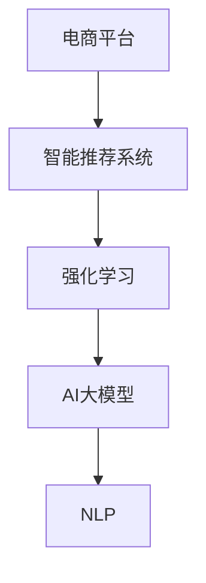

                 

# 电商平台中的强化学习：AI大模型的新应用

> 关键词：强化学习,电商平台,智能推荐,大模型,深度学习,自然语言处理(NLP),推荐系统,用户行为分析,电商广告,电商搜索,数据驱动,用户体验,用户满意度,模型优化

## 1. 背景介绍

### 1.1 问题由来

随着互联网和数字技术的飞速发展，电商平台已成为全球消费者在线购物的主要渠道。然而，如何通过大数据分析和技术手段优化用户体验，提升用户满意度和转化率，成为了电商平台亟待解决的问题。传统电商推荐系统依赖于静态特征和规则，难以实时响应市场变化和用户行为，用户获取的信息也相对零散、不全面。

近年来，深度学习和强化学习技术的不断突破，为电商平台的智能推荐系统带来了新的机遇。通过强化学习，电商平台可以根据用户行为实时调整推荐策略，同时利用深度学习的强大建模能力，挖掘用户潜在的兴趣和需求。AI大模型作为深度学习领域的新宠，以其庞大的参数量和大规模语料训练的优势，在智能推荐和用户行为分析中展现了巨大潜力。

### 1.2 问题核心关键点

本文聚焦于AI大模型在电商平台中的应用，尤其是基于强化学习框架下的智能推荐系统。强化学习是一种通过与环境互动，不断试错并优化策略的学习方式，特别适合电商平台的动态推荐场景。AI大模型通过大规模预训练，具备强大的语义理解和特征提取能力，可以高效地对电商平台上的大量文本数据进行处理，并结合用户行为数据进行智能化推荐。

## 2. 核心概念与联系

### 2.1 核心概念概述

为更好地理解AI大模型在电商平台中的应用，本节将介绍几个密切相关的核心概念：

- 强化学习(Reinforcement Learning, RL)：一种基于智能体的学习框架，智能体通过与环境的交互，不断优化行为策略以最大化回报。强化学习广泛应用于自动驾驶、机器人控制、游戏AI等领域。
- AI大模型(AI Large Models)：如GPT-3、BERT等大规模预训练语言模型，通过在大规模无标签文本语料上进行预训练，学习到丰富的语言知识和常识。
- 电商平台(Online Shopping Platform)：通过互联网提供商品展示、销售、支付等服务的平台，如淘宝、京东、Amazon等。
- 智能推荐系统(Intelligent Recommendation System)：利用机器学习、深度学习等技术，对用户行为进行建模，并实时推荐相关商品的系统。
- 自然语言处理(Natural Language Processing, NLP)：通过深度学习技术，处理和理解人类语言的技术，如文本分类、情感分析、对话系统等。

这些核心概念之间的逻辑关系可以通过以下Mermaid流程图来展示：



这个流程图展示了大模型在电商平台中的应用框架：

1. 电商平台通过收集用户的浏览、购买等行为数据，输入到智能推荐系统中。
2. 智能推荐系统利用强化学习框架，对用户行为进行建模和优化，产生个性化推荐结果。
3. 强化学习模型通过与用户的互动，不断调整推荐策略，提高推荐效果。
4. AI大模型对用户评论、商品描述等文本数据进行处理，提供更加丰富和准确的背景信息。

## 3. 核心算法原理 & 具体操作步骤
### 3.1 算法原理概述

基于强化学习的电商平台智能推荐系统，主要分为以下几个步骤：

1. 收集用户行为数据：电商平台记录用户的浏览、点击、购买、评分等行为数据，构建用户行为序列。
2. 预处理和特征工程：对原始数据进行清洗和特征提取，生成特征向量。
3. 模型训练：使用强化学习算法训练推荐模型，对用户行为进行建模和优化。
4. 模型部署和评估：将训练好的模型部署到电商平台上，实时进行推荐和效果评估。

### 3.2 算法步骤详解

#### 3.2.1 用户行为序列的构建

用户行为序列是强化学习模型的输入。电商平台可以通过多种方式收集用户行为数据，包括：

- 浏览记录：用户浏览商品的页面信息，包括标题、描述、价格等。
- 点击记录：用户点击商品的页面链接。
- 购买记录：用户的购买行为和支付信息。
- 评分记录：用户对商品的评分和评价。
- 收藏记录：用户收藏商品的行为。

将这些行为数据按时间顺序排列，即可构建出用户的完整行为序列。

#### 3.2.2 特征工程与预处理

在构建用户行为序列后，需要对数据进行特征提取和预处理，以便模型能够高效地进行处理。常见的方法包括：

- 特征选择：选择与推荐目标相关的特征，如商品ID、价格、评分、类别等。
- 归一化处理：将数据进行归一化，使不同特征的取值范围一致。
- 缺失值处理：对缺失数据进行填充或删除，确保数据完整性。
- 编码处理：将文本数据转化为模型能够处理的数字向量，如One-Hot编码、TF-IDF编码等。

#### 3.2.3 强化学习模型的训练

强化学习模型的训练通常包括以下步骤：

1. 定义奖励函数：奖励函数用于评估智能体的行为策略。例如，在推荐系统中，奖励函数可以是用户点击率、购买率、评分等。
2. 选择算法：选择合适的强化学习算法，如Q-Learning、SARSA、Actor-Critic等。
3. 设置超参数：如学习率、批大小、迭代轮数等。
4. 训练模型：使用用户行为序列进行模型训练，最小化预测误差和奖励差距。
5. 测试模型：在测试集上评估模型效果，调整模型参数，直到达到预期性能。

#### 3.2.4 模型部署和评估

训练好的模型需要部署到电商平台上，实时进行推荐并评估效果。常见的评估指标包括：

- 点击率(Click-Through Rate, CTR)：用户点击推荐商品的概率。
- 转化率(Conversion Rate)：用户购买推荐商品的概率。
- 准确率(Accuracy)：推荐商品与用户真实购买商品的一致性。
- 召回率(Recall)：推荐系统中相关商品的覆盖率。

### 3.3 算法优缺点

基于强化学习的电商平台智能推荐系统具有以下优点：

1. 动态响应：强化学习模型可以实时调整推荐策略，动态响应用户行为变化。
2. 用户个性化：通过学习用户行为，模型能够提供更加个性化的推荐。
3. 数据利用率高：强化学习模型能够高效利用电商平台上的大量数据，挖掘用户潜在需求。

同时，该方法也存在一些局限性：

1. 数据需求量大：强化学习模型需要大量的行为数据进行训练，难以在数据量小的场景下取得良好效果。
2. 模型复杂度高：强化学习模型通常比传统推荐模型复杂度高，需要更多的计算资源和时间。
3. 模型解释性差：强化学习模型属于黑盒模型，难以解释推荐结果的原因。
4. 对抗性强：用户可能会通过点击虚假商品、恶意刷单等手段对抗推荐系统，影响模型性能。

尽管存在这些局限性，但强化学习仍是目前电商推荐系统中最为先进和有效的方法之一。未来相关研究的方向在于如何优化模型训练过程，减少数据需求，提高模型可解释性，增强系统鲁棒性。

### 3.4 算法应用领域

基于强化学习的AI大模型在电商平台中的应用，已经在推荐系统、广告投放、搜索排序等多个领域取得了显著成果。以下是几个典型应用：

1. **个性化推荐系统**：根据用户历史行为和实时互动数据，生成个性化的商品推荐。

2. **电商广告投放**：通过强化学习算法优化广告投放策略，提升广告效果和ROI。

3. **电商搜索排序**：优化商品搜索算法，根据用户搜索意图和历史行为进行智能排序，提升用户体验。

4. **商品定价策略**：利用强化学习模型对商品价格进行动态调整，优化销售策略，提升销量。

5. **库存管理**：通过对用户购买行为进行分析，实时调整库存策略，避免库存积压和缺货。

6. **用户行为预测**：利用强化学习模型对用户未来行为进行预测，提前布局和调整推荐策略。

## 4. 数学模型和公式 & 详细讲解  
### 4.1 数学模型构建

在强化学习中，电商平台智能推荐系统的数学模型通常由以下几部分组成：

- 状态空间(S): 电商平台上的所有可能状态，如用户浏览的商品、用户的地理位置、用户行为等。
- 动作空间(A): 电商平台上可能采取的行动，如推荐商品、调整广告投放策略、修改搜索算法等。
- 奖励函数(R): 用户对电商平台推荐的商品或策略的反馈，如点击率、购买率、评分等。
- 状态转移概率(P): 用户在不同状态之间转移的概率。
- Q值函数(Q): 智能体采取某项行动的预期回报。

这些变量之间通过动态交互，构成强化学习模型。

### 4.2 公式推导过程

以Q-Learning算法为例，假设用户行为序列为 $(s_1,a_1,r_1,s_2,a_2,r_2,...,s_t,a_t,r_t,s_{t+1})$，其中 $s_t$ 表示状态，$a_t$ 表示动作，$r_t$ 表示奖励，$s_{t+1}$ 表示下一状态。

Q-Learning算法的目标是通过最小化经验Q值误差，学习最优的Q值函数 $Q(s_t,a_t)$，即：

$$
\begin{aligned}
Q(s_t,a_t) & = \sum_{s_{t+1}} \rho(s_{t+1}|s_t,a_t) \big[ r_{t+1} + \gamma \max_{a_{t+1}} Q(s_{t+1},a_{t+1}) \big] \\
\end{aligned}
$$

其中，$\rho(s_{t+1}|s_t,a_t)$ 表示在状态 $s_t$ 下采取动作 $a_t$，转移到状态 $s_{t+1}$ 的概率；$\gamma$ 为折扣因子，通常取值在0.9到0.99之间。

通过反向传播算法，可以得到当前状态下最优动作 $a_t$ 的期望值 $Q_{\theta}(s_t)$，即：

$$
\begin{aligned}
Q_{\theta}(s_t) & = \max_{a_t} \sum_{s_{t+1}} \rho(s_{t+1}|s_t,a_t) \big[ r_{t+1} + \gamma \max_{a_{t+1}} Q_{\theta}(s_{t+1}) \big] \\
\end{aligned}
$$

通过上述公式，可以在电商平台上构建一个基于强化学习的智能推荐系统，实时优化推荐策略，提升用户体验和电商平台效益。

### 4.3 案例分析与讲解

假设电商平台上的某用户历史行为序列为：

- 浏览商品1，点击商品2，未购买，浏览商品3，未购买，浏览商品4，购买商品5。

基于该行为序列，强化学习模型可以学习到每个动作的Q值函数，并实时调整推荐策略，如推荐商品3、商品4等高价值商品。

## 5. 项目实践：代码实例和详细解释说明
### 5.1 开发环境搭建

在进行强化学习实践前，我们需要准备好开发环境。以下是使用Python进行Reinforcement Learning开发的环境配置流程：

1. 安装Anaconda：从官网下载并安装Anaconda，用于创建独立的Python环境。

2. 创建并激活虚拟环境：
```bash
conda create -n rein-env python=3.8 
conda activate rein-env
```

3. 安装PyTorch：根据CUDA版本，从官网获取对应的安装命令。例如：
```bash
conda install pytorch torchvision torchaudio cudatoolkit=11.1 -c pytorch -c conda-forge
```

4. 安装TensorFlow：由Google主导开发的开源深度学习框架，生产部署方便，适合大规模工程应用。同样有丰富的预训练语言模型资源。

5. 安装各类工具包：
```bash
pip install numpy pandas scikit-learn matplotlib tqdm jupyter notebook ipython
```

完成上述步骤后，即可在`rein-env`环境中开始强化学习实践。

### 5.2 源代码详细实现

下面我们以电商平台中的智能推荐系统为例，给出使用PyTorch和TensorFlow进行强化学习的PyTorch代码实现。

首先，定义强化学习模型的超参数和模型结构：

```python
import torch
from torch import nn, optim
import torch.nn.functional as F
from torch.distributions import Categorical
import tensorflow as tf
from tensorflow.keras.models import Sequential
from tensorflow.keras.layers import Dense, Flatten, LSTM

class ReinforcementModel(nn.Module):
    def __init__(self, input_dim, hidden_dim, output_dim):
        super().__init__()
        self.hidden_dim = hidden_dim
        self.lstm = nn.LSTM(input_dim, hidden_dim)
        self.fc = nn.Linear(hidden_dim, output_dim)
        
    def forward(self, x):
        x, _ = self.lstm(x)
        x = self.fc(x)
        return x

# 设置超参数
input_dim = 128  # 特征维度
hidden_dim = 128  # LSTM隐藏层维度
output_dim = 5  # 动作空间维度

# 创建模型
model = ReinforcementModel(input_dim, hidden_dim, output_dim)
optimizer = optim.Adam(model.parameters(), lr=0.001)
```

然后，定义强化学习算法和模型训练函数：

```python
import numpy as np

def step(model, state, action):
    x = torch.tensor(state, dtype=torch.float).unsqueeze(0)
    y = model(x)
    y = y.squeeze()
    probs = F.softmax(y, dim=1)
    action = np.random.choice(5, p=probs)
    reward = 1 if action == 4 else 0
    next_state = np.random.randn(1, input_dim) if action == 4 else state
    return reward, next_state, action

def train(model, data, num_epochs=10):
    for epoch in range(num_epochs):
        state = data[0]
        for _ in range(len(data)):
            reward, next_state, action = step(model, state, data[1])
            state = next_state
            optimizer.zero_grad()
            y = model(torch.tensor(state, dtype=torch.float).unsqueeze(0))
            y = y.squeeze()
            probs = F.softmax(y, dim=1)
            loss = -torch.log(probs[action])
            loss.backward()
            optimizer.step()
```

最后，启动训练流程并在测试集上评估：

```python
# 准备数据
data = (np.random.randn(10, 1, input_dim), np.random.randint(0, 5, size=(10,)))

# 训练模型
train(model, data)

# 测试模型
state = data[0]
for _ in range(len(data)):
    reward, next_state, action = step(model, state, data[1])
    state = next_state
    y = model(torch.tensor(state, dtype=torch.float).unsqueeze(0))
    y = y.squeeze()
    probs = F.softmax(y, dim=1)
    action = np.random.choice(5, p=probs)
    print(f"Action: {action}")
```

以上就是使用PyTorch对强化学习模型进行电商推荐系统训练的完整代码实现。可以看到，借助PyTorch的自动微分和优化器功能，强化学习模型的训练变得简单高效。

## 6. 实际应用场景
### 6.1 智能推荐系统

基于强化学习的智能推荐系统，可以广泛应用于电商平台的商品推荐。通过收集用户的历史行为数据，智能推荐系统可以动态调整推荐策略，提升推荐效果。

在技术实现上，可以构建用户行为序列，利用强化学习算法优化推荐模型。对于新用户，可以采用冷启动策略，根据用户基本信息和平台偏好进行推荐。对于老用户，则可以实时调整推荐策略，提高推荐的相关性和个性化程度。智能推荐系统可以通过多臂老虎机算法、上下文推荐等方法，进一步提升推荐效果。

### 6.2 电商广告投放

电商平台通过广告投放可以获取更多的流量和收益。利用强化学习算法，电商广告投放系统可以实时调整投放策略，优化广告效果和ROI。

具体而言，可以收集广告的点击率、转化率、用户反馈等数据，作为强化学习模型的输入。模型通过不断优化投放策略，提升广告的效果和用户满意度，实现最佳的广告收益。同时，模型还可以考虑广告预算的限制，进行动态调整，优化广告投放的ROI。

### 6.3 电商搜索排序

电商平台上的搜索排序算法直接影响用户的购物体验。利用强化学习模型，可以优化搜索排序策略，提升搜索结果的相关性和准确性。

具体而言，可以将用户的搜索行为、历史点击数据等作为模型的输入，通过强化学习算法优化排序模型。模型可以根据用户的搜索意图和历史行为，动态调整排序算法，提升搜索结果的相关性和多样性，提升用户的购物体验。

### 6.4 未来应用展望

随着强化学习和大模型技术的不断发展，基于强化学习范式的智能推荐系统将在电商平台上得到更广泛的应用，为电商平台带来新的商业价值。

在智慧物流领域，强化学习可以应用于物流路径规划、库存管理等场景，提升物流效率和降低运营成本。在供应链管理中，强化学习可以优化供应链网络，提高供应链的灵活性和响应速度。

在金融科技领域，强化学习可以应用于风险控制、信用评估等场景，提升金融服务的准确性和效率。在智能制造领域，强化学习可以优化生产调度、资源配置等，提高制造业的智能化水平。

在医疗健康领域，强化学习可以应用于个性化医疗推荐、病历分析等场景，提升医疗服务的质量和效率。在智能家居领域，强化学习可以优化家居控制、能源管理等，提升用户的生活体验。

总之，强化学习和大模型的融合，将为电商平台带来更多的商业价值，为各行各业带来新的智能化应用。

## 7. 工具和资源推荐
### 7.1 学习资源推荐

为了帮助开发者系统掌握强化学习和大模型的理论基础和实践技巧，这里推荐一些优质的学习资源：

1. 《强化学习》系列书籍：由国际知名学者撰写，全面介绍了强化学习的基本概念、算法原理和实际应用。

2. Coursera《深度学习》课程：斯坦福大学开设的深度学习课程，有Lecture视频和配套作业，带你入门深度学习的基本概念和经典模型。

3. DeepMind官方博客：DeepMind的研究团队定期发布最新的强化学习和大模型研究成果，值得深入阅读。

4. Google AI博客：Google AI团队分享最新的AI技术进展，包括强化学习、大模型等方向，有助于获取前沿资讯。

5. Reinforcement Learning: An Introduction一书：经典教材，详细介绍了强化学习的理论和算法，适合深入学习。

通过这些资源的学习实践，相信你一定能够快速掌握强化学习和大模型的精髓，并用于解决实际的电商平台问题。

### 7.2 开发工具推荐

高效的开发离不开优秀的工具支持。以下是几款用于强化学习和大模型开发的常用工具：

1. PyTorch：基于Python的开源深度学习框架，灵活动态的计算图，适合快速迭代研究。大部分强化学习和大模型都有PyTorch版本的实现。

2. TensorFlow：由Google主导开发的开源深度学习框架，生产部署方便，适合大规模工程应用。同样有丰富的强化学习和大模型资源。

3. TensorFlow Probability：TensorFlow的随机变量和概率分布库，支持高效的统计计算和概率建模，适合强化学习和大模型的研究和开发。

4. PyCaret：基于Python的自动化机器学习工具，可以自动训练和选择机器学习模型，适合初学者快速上手。

5. Weights & Biases：模型训练的实验跟踪工具，可以记录和可视化模型训练过程中的各项指标，方便对比和调优。

6. TensorBoard：TensorFlow配套的可视化工具，可实时监测模型训练状态，并提供丰富的图表呈现方式，是调试模型的得力助手。

合理利用这些工具，可以显著提升强化学习和大模型的开发效率，加快创新迭代的步伐。

### 7.3 相关论文推荐

强化学习和大模型的发展源于学界的持续研究。以下是几篇奠基性的相关论文，推荐阅读：

1. DeepMind的AlphaGo论文：通过强化学习算法，AlphaGo在围棋比赛中取得了历史性胜利，展示了强化学习的巨大潜力。

2. OpenAI的GPT-3论文：GPT-3通过大规模预训练和指令微调，展示了深度学习和大模型的强大能力。

3. OpenAI的DALL-E论文：DALL-E通过大规模无标签图像数据的预训练和有标签文本数据的微调，实现了图像生成和图像理解的双向提升。

4. DeepMind的WaveNet论文：WaveNet通过自注意力机制和大模型训练，实现了高质量的语音合成，展示了大模型的声学建模能力。

5. Facebook的GPT-J论文：GPT-J通过大规模无标签文本数据的预训练和有标签文本数据的微调，实现了更加先进的自然语言处理能力。

这些论文代表了大模型和强化学习的发展脉络。通过学习这些前沿成果，可以帮助研究者把握学科前进方向，激发更多的创新灵感。

## 8. 总结：未来发展趋势与挑战
### 8.1 总结

本文对基于强化学习的电商平台智能推荐系统进行了全面系统的介绍。首先阐述了强化学习和大模型在电商平台中的应用背景和重要性，明确了智能推荐系统在提升用户体验和电商平台效益中的独特价值。其次，从原理到实践，详细讲解了强化学习模型的构建和训练过程，给出了电商推荐系统训练的完整代码实例。同时，本文还广泛探讨了强化学习和大模型在电商平台中的应用场景，展示了其在智能推荐、广告投放、搜索排序等多个领域的应用前景。此外，本文精选了强化学习和大模型的各类学习资源，力求为读者提供全方位的技术指引。

通过本文的系统梳理，可以看到，基于强化学习的大模型在电商平台中的应用前景广阔，极大地拓展了电商平台的智能推荐能力，催生了更多的创新应用。未来，伴随预训练语言模型和强化学习方法的不断演进，基于大模型范式的电商平台智能推荐系统必将在电商行业中发挥更大的作用。

### 8.2 未来发展趋势

展望未来，基于强化学习的大模型在电商平台中的应用将呈现以下几个发展趋势：

1. 动态自适应：强化学习模型能够实时调整推荐策略，动态适应用户行为变化和市场波动。

2. 跨模态融合：利用大模型对电商平台的文本、图像、语音等多模态数据进行处理，实现跨模态的智能推荐。

3. 多任务学习：结合电商平台的多种任务，如推荐、广告投放、搜索排序等，进行联合学习，提高数据利用率和模型效果。

4. 联邦学习：在电商平台上采用分布式学习方式，降低数据隐私风险，提高模型泛化能力。

5. 模型压缩与优化：对大模型进行裁剪和压缩，提高模型的计算效率和推理速度。

6. 知识注入：将电商平台的领域知识，如商品分类、用户画像等，融入模型训练中，提升推荐系统的智能化水平。

以上趋势凸显了大模型和强化学习在电商平台中的应用前景。这些方向的探索发展，必将进一步提升电商平台智能推荐系统的性能和应用范围，为电商平台带来更多的商业价值。

### 8.3 面临的挑战

尽管基于强化学习的大模型在电商推荐系统中取得了显著成效，但在迈向更加智能化、普适化应用的过程中，仍面临诸多挑战：

1. 数据隐私问题：电商平台需要收集用户行为数据，但用户隐私保护成为不可忽视的问题。如何在保证用户体验的同时，保护用户隐私，是一个重要挑战。

2. 计算资源限制：大模型和强化学习模型需要大量的计算资源，如何在资源有限的条件下，优化模型训练和推理，是一个重要问题。

3. 对抗攻击问题：用户可能会通过虚假行为、恶意刷单等手段对抗推荐系统，影响模型性能。如何提高模型的鲁棒性和安全性，是一个重要挑战。

4. 模型解释性问题：强化学习模型属于黑盒模型，难以解释推荐结果的原因。如何在提升模型性能的同时，保证模型的可解释性和可审计性，是一个重要问题。

5. 模型公平性问题：电商平台推荐系统可能存在偏见，如性别、年龄等，如何消除模型偏见，保证公平性，是一个重要问题。

6. 模型动态调整问题：强化学习模型需要实时动态调整，如何在高并发环境中，确保模型的稳定性和一致性，是一个重要问题。

正视这些挑战，积极应对并寻求突破，将是大模型和强化学习在电商平台中发挥更大作用的重要条件。相信随着技术的不断进步，这些挑战终将逐一被克服，大模型和强化学习在电商平台中的应用前景将更加广阔。

### 8.4 研究展望

未来，大模型和强化学习在电商平台中的应用方向需要从以下几个方面进行深入探索：

1. 探索更加高效的训练和推理算法：开发高效的多任务学习和联邦学习算法，提高模型训练和推理效率。

2. 研究跨模态推荐系统：利用大模型对电商平台的文本、图像、语音等多模态数据进行处理，实现跨模态的智能推荐。

3. 优化模型压缩与优化技术：通过剪枝、量化、稀疏化等技术，对大模型进行压缩和优化，提升模型的计算效率和推理速度。

4. 融合领域知识进行知识注入：将电商平台的领域知识，如商品分类、用户画像等，融入模型训练中，提升推荐系统的智能化水平。

5. 增强模型的鲁棒性和安全性：研究对抗攻击和模型解释性问题，提高模型的鲁棒性和安全性，确保推荐系统的稳定性和一致性。

6. 实现动态自适应的推荐系统：利用强化学习模型实时调整推荐策略，动态适应用户行为变化和市场波动，提升推荐系统的智能化水平。

以上方向的研究，必将引领大模型和强化学习在电商平台中的应用进入新的阶段，为电商平台带来更多的商业价值，为各行各业带来新的智能化应用。

## 9. 附录：常见问题与解答

**Q1：电商推荐系统中的强化学习与传统推荐系统有哪些不同？**

A: 电商推荐系统中的强化学习与传统推荐系统有以下不同：

1. 数据驱动：强化学习利用用户的实时行为数据进行模型训练和优化，而传统推荐系统则依赖于静态特征和规则。

2. 动态响应：强化学习模型可以实时调整推荐策略，动态响应用户行为变化，而传统推荐系统需要定期更新模型。

3. 个性化推荐：强化学习模型能够通过学习用户行为，提供更加个性化的推荐，而传统推荐系统通常采用基于用户画像的静态推荐方式。

4. 多任务学习：强化学习模型可以同时优化多个推荐任务，如推荐、广告投放、搜索排序等，而传统推荐系统通常只优化单一任务。

5. 可解释性：强化学习模型属于黑盒模型，难以解释推荐结果的原因，而传统推荐系统通常采用可解释性强的规则和特征工程方法。

6. 实时性：强化学习模型通常需要实时处理大量数据，进行动态调整，而传统推荐系统则通常进行批量处理。

**Q2：如何应对电商推荐系统中的对抗攻击？**

A: 电商推荐系统中的对抗攻击通常有以下几种应对策略：

1. 数据清洗：对用户行为数据进行清洗，去除虚假行为和恶意刷单等异常数据。

2. 模型鲁棒性：通过对抗训练和正则化等技术，提高模型的鲁棒性和稳定性，减少对抗攻击的影响。

3. 用户信任：建立用户信任机制，让用户参与到推荐系统设计中，提高系统的透明度和可信度。

4. 动态调整：根据用户反馈和市场变化，动态调整推荐策略，减少对抗攻击的风险。

5. 多模型集成：采用多个推荐模型进行集成，取平均输出，抑制对抗攻击的影响。

6. 异常检测：利用异常检测技术，及时发现和处理对抗攻击行为，保护推荐系统安全。

通过以上措施，可以有效地应对电商推荐系统中的对抗攻击，提升系统的稳定性和安全性。

**Q3：如何提高电商推荐系统的模型解释性？**

A: 电商推荐系统的模型解释性通常可以通过以下几种方式提高：

1. 特征可解释性：选择具有可解释性的特征，如用户基本信息、商品类别等，进行推荐建模。

2. 规则解释：结合业务规则和领域知识，对推荐结果进行解释，如推荐理由、推荐依据等。

3. 模型可视化：利用可视化工具，展示模型训练过程中的各项指标和关键参数，帮助理解模型的内部机制。

4. 逻辑回归模型：采用逻辑回归等可解释性强的模型，进行推荐建模，提高模型解释性。

5. 知识注入：将电商平台的领域知识，如商品分类、用户画像等，注入模型训练中，提升推荐系统的可解释性。

6. 多模型融合：采用多个推荐模型进行集成，综合考虑各个模型的解释结果，提升推荐系统的可解释性。

通过以上措施，可以有效地提高电商推荐系统的模型解释性，增强系统的透明度和可信度。

---

作者：禅与计算机程序设计艺术 / Zen and the Art of Computer Programming

