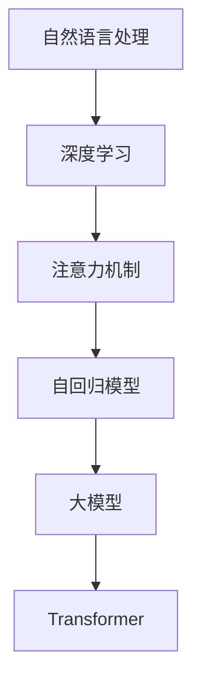

                 

# 电商平台中的自动化报告与洞察生成：大模型的创新应用

> 关键词：电商平台,自动化报告,洞察生成,大模型,自然语言处理(NLP),机器学习(ML),深度学习,注意力机制,自回归模型,Transformer

## 1. 背景介绍

### 1.1 问题由来

随着电子商务的迅猛发展，电商平台已不再是一个单纯的商品销售渠道，而是成为用户获取商品信息、比较价格、交流评价等多元化服务的重要平台。通过分析平台海量交易数据，提取有价值的信息，生成自动化报告与洞察，不仅能提升平台运营效率，还能优化用户购物体验，提升商家满意度。

然而，电商平台数据种类繁多，且往往具有时序性、异构性等特点，传统方法难以高效处理。近年来，自然语言处理（NLP）和大模型的技术进步，为大数据自动化报告与洞察生成提供了新的解决方案。

本文将详细探讨大模型在电商平台自动化报告与洞察生成中的应用，介绍其核心算法原理和具体操作步骤，并通过实例分析其优缺点和应用场景，展望未来发展趋势。

### 1.2 问题核心关键点

本文聚焦于大模型在电商平台自动化报告与洞察生成中的应用，核心关键点包括：

- 如何利用大模型进行电商平台交易数据的深度处理和分析，提取有价值的洞察信息。
- 大模型在自动生成自动化报告与洞察时的具体算法原理和技术细节。
- 大模型在电商平台中的应用效果评估与分析，以及存在的优缺点和改进方向。
- 大模型在电商平台中的应用场景和未来发展趋势。

这些关键点贯穿全文，帮助我们系统地理解大模型在电商平台中的创新应用。

## 2. 核心概念与联系

### 2.1 核心概念概述

为更好地理解大模型在电商平台自动化报告与洞察生成中的应用，本节将介绍几个密切相关的核心概念：

- 自然语言处理(NLP)：涉及计算机如何理解、处理、生成人类语言的技术，涵盖分词、词性标注、句法分析、语义理解等任务。
- 深度学习(Deep Learning)：一类基于神经网络的机器学习方法，通过多层次的抽象表示学习，实现对复杂数据的高效处理和分析。
- 注意力机制(Attention Mechanism)：一种重要的深度学习算法，通过动态计算注意力权重，使模型能更好地聚焦于重要信息，提升处理效率和精度。
- 自回归模型(Autoregressive Model)：一种通过先预测后解码的模型，广泛应用于语言建模、序列生成等任务，具有较好的时序性处理能力。
- 大模型(Large Model)：具有庞大参数量和数据量的深度学习模型，如BERT、GPT等，通常通过自监督学习任务进行预训练，具备强大的语言理解和生成能力。
- Transformer：一类基于自注意力机制的深度学习模型，广泛应用于大模型和NLP任务中，具有较好的并行计算性能和参数高效性。

这些概念之间的逻辑关系可以通过以下Mermaid流程图来展示：



这个流程图展示了大模型在电商平台自动化报告与洞察生成中的应用流程：

1. 利用自然语言处理技术对电商平台交易数据进行文本处理。
2. 通过深度学习模型进行特征提取和模式学习。
3. 引入注意力机制增强模型对重要信息的聚焦。
4. 使用自回归模型进行时序性数据的建模。
5. 构建大模型并利用Transformer等架构进行预训练。
6. 在电商平台交易数据上对大模型进行微调，生成自动化报告与洞察。

这些概念共同构成了大模型在电商平台中的核心应用框架，使其能够高效处理和分析海量交易数据，生成有价值的洞察信息。

## 3. 核心算法原理 & 具体操作步骤
### 3.1 算法原理概述

大模型在电商平台自动化报告与洞察生成中的应用，本质上是一种基于自然语言处理和深度学习的大数据分析范式。其核心思想是：通过大模型强大的语言理解和生成能力，从电商平台交易数据中自动提取有价值的信息，生成自动化报告与洞察。

具体而言，大模型首先对交易数据进行文本处理和特征提取，然后通过深度学习模型进行模式学习，最后结合注意力机制和自回归模型，实现对交易数据的时序性和结构性建模。通过微调，大模型能够在特定电商平台的交易数据上高效生成自动化报告与洞察，提升电商平台运营效率和用户体验。

### 3.2 算法步骤详解

大模型在电商平台自动化报告与洞察生成中的应用，一般包括以下几个关键步骤：

**Step 1: 准备数据集和预训练模型**
- 收集电商平台的交易数据，包括商品信息、用户行为、评价反馈等文本数据。
- 选择合适的预训练大模型，如BERT、GPT等，作为初始化参数。

**Step 2: 数据预处理与特征提取**
- 对交易数据进行文本清洗、分词、词性标注等自然语言处理。
- 利用深度学习模型，如BERT等，对交易数据进行特征提取，获得高维语义表示。

**Step 3: 时序性建模与洞察提取**
- 引入注意力机制，增强模型对重要信息的聚焦。
- 使用自回归模型，如Transformer，对交易数据进行时序性建模。
- 在深度学习模型的基础上，进行洞察提取，生成自动化报告与洞察。

**Step 4: 模型微调和结果评估**
- 在特定电商平台交易数据上，对大模型进行微调，以适应具体业务场景。
- 利用评价指标，如准确率、召回率、F1值等，评估模型生成报告与洞察的质量。

**Step 5: 自动化报告与洞察生成**
- 在电商平台上集成微调后的大模型，实现自动化报告与洞察生成。
- 根据业务需求，定期更新模型参数，以适应电商平台交易数据的动态变化。

以上是基于大模型在电商平台自动化报告与洞察生成中的一般流程。在实际应用中，还需要针对具体任务进行优化设计，如改进特征提取方法，引入更多先验知识，优化模型结构等，以进一步提升模型性能。

### 3.3 算法优缺点

大模型在电商平台自动化报告与洞察生成中具有以下优点：
1. 高效处理海量数据。大模型具备强大的语言理解和生成能力，能快速处理和分析电商平台交易数据。
2. 生成准确洞察。大模型能够从复杂数据中提取有价值的信息，生成精准的自动化报告与洞察。
3. 提升运营效率。通过自动化的洞察生成，电商平台能快速获得运营数据反馈，优化业务策略。
4. 提高用户满意度。自动化报告与洞察能提升用户购物体验，增加用户粘性和满意度。

同时，该方法也存在一定的局限性：
1. 数据依赖性强。大模型对标注数据和语料库的依赖性较大，获取高质量数据成本较高。
2. 模型解释性不足。大模型通常作为"黑盒"系统，难以解释其内部工作机制和决策逻辑。
3. 计算资源消耗大。大模型参数量大，训练和推理资源消耗较高。

尽管存在这些局限性，但就目前而言，大模型仍是电商平台自动化报告与洞察生成的重要手段。未来相关研究应关注如何降低对数据和计算资源的依赖，提高模型的解释性和可解释性。

### 3.4 算法应用领域

大模型在电商平台自动化报告与洞察生成中，广泛应用于以下领域：

- 销售预测与趋势分析：通过分析历史销售数据，生成销售预测报告和市场趋势分析洞察。
- 用户行为分析：提取用户浏览、购买、评价等行为数据，生成用户画像和行为分析报告。
- 商品推荐与个性化营销：根据用户历史行为和评价数据，生成个性化推荐和营销洞察。
- 风险预警与投诉处理：分析交易数据中的风险点和用户投诉，生成风险预警报告和处理方案。
- 广告投放优化：利用用户行为和评价数据，生成广告投放效果分析报告和优化建议。

此外，大模型在电商平台中的应用还包括客户服务、库存管理、供应链优化等，为电商平台运营带来了全方位的提升。

## 4. 数学模型和公式 & 详细讲解 & 举例说明
### 4.1 数学模型构建

为了更好地理解大模型在电商平台自动化报告与洞察生成中的数学模型和公式，本节将详细介绍其中的关键步骤。

假设电商平台交易数据集为 $D=\{x_i, y_i\}_{i=1}^N$，其中 $x_i$ 表示交易记录文本，$y_i$ 表示与该交易相关的标签（如销售量、用户评分等）。定义大模型为 $M_\theta$，其中 $\theta$ 为模型参数。

大模型的目标函数为最小化预测值与真实标签之间的差距，即：

$$
\mathcal{L}(\theta) = \frac{1}{N} \sum_{i=1}^N \ell(\hat{y}_i, y_i)
$$

其中 $\ell$ 为损失函数，常见的损失函数包括均方误差损失、交叉熵损失等。

### 4.2 公式推导过程

以下我们以均方误差损失函数为例，推导大模型在电商平台自动化报告与洞察生成中的公式。

假设模型 $M_\theta$ 在输入 $x_i$ 上的输出为 $\hat{y}_i$，真实标签为 $y_i$，则均方误差损失函数定义为：

$$
\ell(\hat{y}_i, y_i) = (\hat{y}_i - y_i)^2
$$

将其代入目标函数，得：

$$
\mathcal{L}(\theta) = \frac{1}{N} \sum_{i=1}^N (\hat{y}_i - y_i)^2
$$

利用梯度下降等优化算法，最小化损失函数，更新模型参数 $\theta$。具体而言，梯度更新公式为：

$$
\theta \leftarrow \theta - \eta \nabla_\theta \mathcal{L}(\theta)
$$

其中 $\eta$ 为学习率，$\nabla_\theta \mathcal{L}(\theta)$ 为损失函数对模型参数的梯度。

### 4.3 案例分析与讲解

假设电商平台交易数据集为 $D=\{x_i, y_i\}_{i=1}^N$，其中 $x_i$ 表示交易记录文本，$y_i$ 表示与该交易相关的标签（如销售量、用户评分等）。定义大模型为 $M_\theta$，其中 $\theta$ 为模型参数。

假设大模型为BERT，使用均方误差损失函数，在交易数据集上微调。具体步骤如下：

1. 对交易数据进行预处理，包括分词、词性标注等自然语言处理。
2. 利用BERT模型进行特征提取，获得高维语义表示。
3. 引入注意力机制，增强模型对重要信息的聚焦。
4. 使用Transformer模型进行时序性建模。
5. 在深度学习模型的基础上，进行洞察提取，生成自动化报告与洞察。

假设生成自动化报告与洞察的损失函数为 $\mathcal{L}(\theta)$，通过梯度下降等优化算法，更新模型参数 $\theta$，使得生成的报告与洞察逼近真实标签。

## 5. 项目实践：代码实例和详细解释说明
### 5.1 开发环境搭建

在进行大模型在电商平台自动化报告与洞察生成中的应用实践前，我们需要准备好开发环境。以下是使用Python进行PyTorch开发的环境配置流程：

1. 安装Anaconda：从官网下载并安装Anaconda，用于创建独立的Python环境。

2. 创建并激活虚拟环境：
```bash
conda create -n pytorch-env python=3.8 
conda activate pytorch-env
```

3. 安装PyTorch：根据CUDA版本，从官网获取对应的安装命令。例如：
```bash
conda install pytorch torchvision torchaudio cudatoolkit=11.1 -c pytorch -c conda-forge
```

4. 安装Transformers库：
```bash
pip install transformers
```

5. 安装各类工具包：
```bash
pip install numpy pandas scikit-learn matplotlib tqdm jupyter notebook ipython
```

完成上述步骤后，即可在`pytorch-env`环境中开始大模型在电商平台自动化报告与洞察生成中的应用实践。

### 5.2 源代码详细实现

下面我们以电商平台销售预测任务为例，给出使用Transformers库对BERT模型进行微调的PyTorch代码实现。

首先，定义销售预测任务的数据处理函数：

```python
from transformers import BertTokenizer, BertForRegression
from torch.utils.data import Dataset
import torch

class SalesDataset(Dataset):
    def __init__(self, sales_data, tokenizer, max_len=128):
        self.sales_data = sales_data
        self.tokenizer = tokenizer
        self.max_len = max_len
        
    def __len__(self):
        return len(self.sales_data)
    
    def __getitem__(self, item):
        sale_data = self.sales_data[item]
        
        encoding = self.tokenizer(sale_data, return_tensors='pt', max_length=self.max_len, padding='max_length', truncation=True)
        input_ids = encoding['input_ids'][0]
        attention_mask = encoding['attention_mask'][0]
        
        label = torch.tensor(sale_data['target'], dtype=torch.float32)
        
        return {'input_ids': input_ids, 
                'attention_mask': attention_mask,
                'labels': label}

# 数据处理
tokenizer = BertTokenizer.from_pretrained('bert-base-cased')

train_dataset = SalesDataset(train_sales_data, tokenizer)
dev_dataset = SalesDataset(dev_sales_data, tokenizer)
test_dataset = SalesDataset(test_sales_data, tokenizer)
```

然后，定义模型和优化器：

```python
from transformers import BertForRegression, AdamW

model = BertForRegression.from_pretrained('bert-base-cased')

optimizer = AdamW(model.parameters(), lr=2e-5)
```

接着，定义训练和评估函数：

```python
from torch.utils.data import DataLoader
from tqdm import tqdm
from sklearn.metrics import mean_squared_error

device = torch.device('cuda') if torch.cuda.is_available() else torch.device('cpu')
model.to(device)

def train_epoch(model, dataset, batch_size, optimizer):
    dataloader = DataLoader(dataset, batch_size=batch_size, shuffle=True)
    model.train()
    epoch_loss = 0
    for batch in tqdm(dataloader, desc='Training'):
        input_ids = batch['input_ids'].to(device)
        attention_mask = batch['attention_mask'].to(device)
        labels = batch['labels'].to(device)
        model.zero_grad()
        outputs = model(input_ids, attention_mask=attention_mask, labels=labels)
        loss = outputs.loss
        epoch_loss += loss.item()
        loss.backward()
        optimizer.step()
    return epoch_loss / len(dataloader)

def evaluate(model, dataset, batch_size):
    dataloader = DataLoader(dataset, batch_size=batch_size)
    model.eval()
    preds, labels = [], []
    with torch.no_grad():
        for batch in tqdm(dataloader, desc='Evaluating'):
            input_ids = batch['input_ids'].to(device)
            attention_mask = batch['attention_mask'].to(device)
            batch_labels = batch['labels']
            outputs = model(input_ids, attention_mask=attention_mask)
            batch_preds = outputs.predictions
            batch_labels = batch_labels.to('cpu').tolist()
            for pred, label in zip(batch_preds, batch_labels):
                preds.append(pred.item())
                labels.append(label)
                
    return mean_squared_error(labels, preds)

```

最后，启动训练流程并在测试集上评估：

```python
epochs = 5
batch_size = 16

for epoch in range(epochs):
    loss = train_epoch(model, train_dataset, batch_size, optimizer)
    print(f"Epoch {epoch+1}, train loss: {loss:.3f}")
    
    print(f"Epoch {epoch+1}, dev MSE:")
    mse = evaluate(model, dev_dataset, batch_size)
    print(f"Mean Squared Error: {mse:.4f}")
    
print("Test MSE:")
mse = evaluate(model, test_dataset, batch_size)
print(f"Mean Squared Error: {mse:.4f}")
```

以上就是使用PyTorch对BERT进行电商平台销售预测任务的微调的完整代码实现。可以看到，得益于Transformers库的强大封装，我们可以用相对简洁的代码完成BERT模型的加载和微调。

### 5.3 代码解读与分析

让我们再详细解读一下关键代码的实现细节：

**SalesDataset类**：
- `__init__`方法：初始化销售数据、分词器等关键组件。
- `__len__`方法：返回数据集的样本数量。
- `__getitem__`方法：对单个样本进行处理，将销售数据输入编码为token ids，将标签编码为数字，并对其进行定长padding，最终返回模型所需的输入。

**销售数据与标签处理**：
- 使用BertTokenizer进行分词和编码。
- 将销售数据作为模型输入，标签转换为可微分的数字形式，并进行定长padding。

**训练和评估函数**：
- 使用PyTorch的DataLoader对数据集进行批次化加载，供模型训练和推理使用。
- 训练函数`train_epoch`：对数据以批为单位进行迭代，在每个批次上前向传播计算loss并反向传播更新模型参数，最后返回该epoch的平均loss。
- 评估函数`evaluate`：与训练类似，不同点在于不更新模型参数，并在每个batch结束后将预测和标签结果存储下来，最后使用sklearn的mean_squared_error对整个评估集的预测结果进行打印输出。

**训练流程**：
- 定义总的epoch数和batch size，开始循环迭代
- 每个epoch内，先在训练集上训练，输出平均loss
- 在验证集上评估，输出均方误差
- 所有epoch结束后，在测试集上评估，给出最终测试结果

可以看到，PyTorch配合Transformers库使得BERT微调的代码实现变得简洁高效。开发者可以将更多精力放在数据处理、模型改进等高层逻辑上，而不必过多关注底层的实现细节。

当然，工业级的系统实现还需考虑更多因素，如模型的保存和部署、超参数的自动搜索、更灵活的任务适配层等。但核心的微调范式基本与此类似。

## 6. 实际应用场景
### 6.1 智能推荐系统

基于大模型在电商平台自动化报告与洞察生成中的应用，智能推荐系统可以借助大模型的强大语言理解和生成能力，实现更为精准、个性化的商品推荐。

具体而言，智能推荐系统可以通过收集用户浏览、购买、评价等行为数据，利用BERT等大模型进行特征提取和模式学习，生成用户画像和行为分析报告。结合时序性建模技术，如自回归模型，可以预测用户下一步的购买行为，生成个性化的推荐商品列表。通过持续的推荐优化和用户反馈，不断提升推荐效果，增强用户满意度。

### 6.2 客户服务

大模型在电商平台自动化报告与洞察生成中的应用，也可以应用于客户服务的智能交互。通过收集客户咨询记录，利用BERT等大模型进行文本处理和特征提取，生成客户服务报告和问题解答洞察。结合对话生成技术，如GPT等，可以实现智能客服系统，提升客户服务效率和质量。

客户可以通过简单的文字描述提出问题，智能客服系统自动生成并回复答案，解决用户疑问。同时，系统可以实时记录和分析客户咨询数据，生成客户服务报告和问题解答洞察，帮助客服团队提升服务水平。

### 6.3 库存管理

电商平台中的库存管理，是大模型在自动化报告与洞察生成中的重要应用场景。通过分析历史交易数据，利用BERT等大模型进行特征提取和模式学习，生成库存管理报告和趋势分析洞察。结合时序性建模技术，可以预测未来商品需求，优化库存管理策略，减少库存积压和缺货现象，提升运营效率。

库存管理人员可以借助智能报告和洞察，及时调整库存策略，优化库存水平，提高库存周转率。同时，系统可以实时监控库存状态，生成库存管理报告，帮助管理人员及时响应库存变化，提升库存管理水平。

### 6.4 未来应用展望

随着大模型和微调方法的不断发展，基于大模型在电商平台自动化报告与洞察生成中的应用也将迎来更多创新和突破。

在智慧物流领域，基于大模型的物流数据处理和分析，可以为物流运输、仓储管理提供优化建议，提升物流效率和成本效益。

在金融科技领域，基于大模型的金融交易数据处理和分析，可以为风险控制、信用评估等提供数据支持，增强金融机构的决策能力。

在电商社交领域，基于大模型的用户行为数据处理和分析，可以为电商社交平台的用户互动和内容推荐提供优化建议，提升用户体验和平台黏性。

此外，在大数据、智能制造、智慧城市等众多领域，基于大模型的自动化报告与洞察生成技术也将得到广泛应用，为各行各业带来智能化、高效化的变革。

## 7. 工具和资源推荐
### 7.1 学习资源推荐

为了帮助开发者系统掌握大模型在电商平台自动化报告与洞察生成中的应用，这里推荐一些优质的学习资源：

1. 《Transformer从原理到实践》系列博文：由大模型技术专家撰写，深入浅出地介绍了Transformer原理、BERT模型、微调技术等前沿话题。

2. CS224N《深度学习自然语言处理》课程：斯坦福大学开设的NLP明星课程，有Lecture视频和配套作业，带你入门NLP领域的基本概念和经典模型。

3. 《Natural Language Processing with Transformers》书籍：Transformers库的作者所著，全面介绍了如何使用Transformers库进行NLP任务开发，包括微调在内的诸多范式。

4. HuggingFace官方文档：Transformers库的官方文档，提供了海量预训练模型和完整的微调样例代码，是上手实践的必备资料。

5. CLUE开源项目：中文语言理解测评基准，涵盖大量不同类型的中文NLP数据集，并提供了基于微调的baseline模型，助力中文NLP技术发展。

通过对这些资源的学习实践，相信你一定能够快速掌握大模型在电商平台自动化报告与洞察生成中的应用，并用于解决实际的NLP问题。
###  7.2 开发工具推荐

高效的开发离不开优秀的工具支持。以下是几款用于大模型在电商平台自动化报告与洞察生成中应用的常用工具：

1. PyTorch：基于Python的开源深度学习框架，灵活动态的计算图，适合快速迭代研究。大部分预训练语言模型都有PyTorch版本的实现。

2. TensorFlow：由Google主导开发的开源深度学习框架，生产部署方便，适合大规模工程应用。同样有丰富的预训练语言模型资源。

3. Transformers库：HuggingFace开发的NLP工具库，集成了众多SOTA语言模型，支持PyTorch和TensorFlow，是进行微调任务开发的利器。

4. Weights & Biases：模型训练的实验跟踪工具，可以记录和可视化模型训练过程中的各项指标，方便对比和调优。与主流深度学习框架无缝集成。

5. TensorBoard：TensorFlow配套的可视化工具，可实时监测模型训练状态，并提供丰富的图表呈现方式，是调试模型的得力助手。

6. Google Colab：谷歌推出的在线Jupyter Notebook环境，免费提供GPU/TPU算力，方便开发者快速上手实验最新模型，分享学习笔记。

合理利用这些工具，可以显著提升大模型在电商平台中的应用开发效率，加快创新迭代的步伐。

### 7.3 相关论文推荐

大模型和微调技术的发展源于学界的持续研究。以下是几篇奠基性的相关论文，推荐阅读：

1. Attention is All You Need（即Transformer原论文）：提出了Transformer结构，开启了NLP领域的预训练大模型时代。

2. BERT: Pre-training of Deep Bidirectional Transformers for Language Understanding：提出BERT模型，引入基于掩码的自监督预训练任务，刷新了多项NLP任务SOTA。

3. Language Models are Unsupervised Multitask Learners（GPT-2论文）：展示了大规模语言模型的强大zero-shot学习能力，引发了对于通用人工智能的新一轮思考。

4. Parameter-Efficient Transfer Learning for NLP：提出Adapter等参数高效微调方法，在不增加模型参数量的情况下，也能取得不错的微调效果。

5. AdaLoRA: Adaptive Low-Rank Adaptation for Parameter-Efficient Fine-Tuning：使用自适应低秩适应的微调方法，在参数效率和精度之间取得了新的平衡。

6. Prompt-based Learning: Large Language Models as Few-Shot Learners：引入基于连续型Prompt的微调范式，为如何充分利用预训练知识提供了新的思路。

这些论文代表了大模型在电商平台自动化报告与洞察生成中的发展脉络。通过学习这些前沿成果，可以帮助研究者把握学科前进方向，激发更多的创新灵感。

## 8. 总结：未来发展趋势与挑战
### 8.1 总结

本文对基于大模型在电商平台自动化报告与洞察生成中的应用进行了全面系统的介绍。首先阐述了电商平台中自动化报告与洞察生成的重要性，明确了通过大模型技术实现自动化报告与洞察生成的独特价值。其次，从原理到实践，详细讲解了大模型在电商平台中的应用流程，介绍了其核心算法原理和技术细节。通过实例分析，展示了其优缺点和应用场景，展望了未来发展趋势。

通过本文的系统梳理，可以看到，基于大模型的电商平台自动化报告与洞察生成技术，不仅能高效处理和分析海量电商平台交易数据，生成精准的自动化报告与洞察，还能显著提升电商平台运营效率和用户体验，具有广泛的应用前景。

### 8.2 未来发展趋势

展望未来，大模型在电商平台自动化报告与洞察生成中，将呈现以下几个发展趋势：

1. 模型规模持续增大。随着算力成本的下降和数据规模的扩张，大模型的参数量还将持续增长。超大模型的强大处理能力，将进一步提升自动化报告与洞察生成的效果。

2. 模型泛化能力增强。通过引入更多先验知识和领域数据，大模型将具备更强的跨领域迁移能力，适应更多电商平台的特定需求。

3. 时序性处理能力提升。结合自回归模型和注意力机制，大模型将能够更好地处理电商平台交易数据的时序性和结构性，生成更精准的自动化报告与洞察。

4. 多模态信息融合。结合视觉、语音等多模态信息，大模型将能够更全面地理解电商平台用户的购物行为和需求，提供更个性化、多样化的推荐和服务。

5. 自动化报告与洞察生成工具化。借助大模型技术，自动化报告与洞察生成的过程将逐步工具化，成为电商平台的标配功能，提升运营效率和用户体验。

6. 智能客服系统的普及。结合大模型在自然语言处理和对话生成中的进展，智能客服系统将逐步普及，提升客户服务效率和质量。

以上趋势凸显了大模型在电商平台自动化报告与洞察生成中的广阔前景。这些方向的探索发展，必将进一步提升电商平台运营效率和用户体验，为电商平台的智能化转型提供重要支撑。

### 8.3 面临的挑战

尽管大模型在电商平台自动化报告与洞察生成中已经取得了显著成效，但在迈向更加智能化、普适化应用的过程中，仍面临诸多挑战：

1. 数据隐私和安全。电商平台的交易数据涉及用户隐私，如何保护数据隐私和安全，是大模型应用的重要挑战。

2. 模型鲁棒性和可解释性。大模型在面对复杂、多样化的电商平台交易数据时，可能存在泛化性能不足、输出不稳定等问题。如何提高模型鲁棒性和可解释性，仍需深入研究。

3. 计算资源消耗。大模型参数量大，训练和推理资源消耗较高，如何优化资源消耗，降低计算成本，仍需进一步探索。

4. 自动化报告与洞察生成的标准化。不同电商平台对自动化报告与洞察生成的需求不同，如何实现标准化和定制化，满足各平台需求，是大模型应用的重要课题。

5. 人机交互的优化。大模型在电商平台中的应用，需要与人工服务相结合，如何优化人机交互，提升用户体验，仍需进一步研究。

6. 多领域知识融合。电商平台的交易数据涉及多种领域知识，如何融合多领域知识，提升大模型的跨领域迁移能力，仍需进一步探索。

正视大模型在电商平台自动化报告与洞察生成中面临的这些挑战，积极应对并寻求突破，将是大模型技术迈向成熟的必由之路。相信随着学界和产业界的共同努力，这些挑战终将一一被克服，大模型技术将为电商平台带来更加智能化、高效化的应用体验。

### 8.4 研究展望

面对大模型在电商平台自动化报告与洞察生成中面临的挑战，未来的研究需要在以下几个方面寻求新的突破：

1. 探索无监督和半监督微调方法。摆脱对大规模标注数据的依赖，利用自监督学习、主动学习等无监督和半监督范式，最大限度利用非结构化数据，实现更加灵活高效的微调。

2. 研究参数高效和计算高效的微调范式。开发更加参数高效的微调方法，在固定大部分预训练参数的同时，只更新极少量的任务相关参数。同时优化微调模型的计算图，减少前向传播和反向传播的资源消耗，实现更加轻量级、实时性的部署。

3. 融合因果和对比学习范式。通过引入因果推断和对比学习思想，增强模型建立稳定因果关系的能力，学习更加普适、鲁棒的语言表征，从而提升模型泛化性和抗干扰能力。

4. 引入更多先验知识。将符号化的先验知识，如知识图谱、逻辑规则等，与神经网络模型进行巧妙融合，引导微调过程学习更准确、合理的语言模型。同时加强不同模态数据的整合，实现视觉、语音等多模态信息与文本信息的协同建模。

5. 结合因果分析和博弈论工具。将因果分析方法引入微调模型，识别出模型决策的关键特征，增强输出解释的因果性和逻辑性。借助博弈论工具刻画人机交互过程，主动探索并规避模型的脆弱点，提高系统稳定性。

6. 纳入伦理道德约束。在模型训练目标中引入伦理导向的评估指标，过滤和惩罚有偏见、有害的输出倾向。同时加强人工干预和审核，建立模型行为的监管机制，确保输出符合人类价值观和伦理道德。

这些研究方向的探索，必将引领大模型在电商平台自动化报告与洞察生成中的创新发展，为电商平台运营提供更全面、精准、智能化的解决方案。面向未来，大模型技术需要在更多领域进行应用探索和优化提升，才能实现其巨大的潜在价值。

## 9. 附录：常见问题与解答

**Q1：电商平台中的自动化报告与洞察生成是否适用于所有业务场景？**

A: 电商平台中的自动化报告与洞察生成，适用于大多数电商平台的业务场景，但具体应用效果还需结合平台特性和业务需求进行调整。例如，对于个性化推荐、智能客服等业务场景，效果可能更为显著，而库存管理、物流优化等业务场景，则需要结合具体业务逻辑进行微调和优化。

**Q2：微调大模型时，如何选择合适的学习率？**

A: 微调大模型时，选择合适的学习率至关重要。一般来说，大模型的学习率要比预训练时小1-2个数量级，以避免破坏预训练权重。推荐从1e-5开始调参，逐步减小学习率，直至收敛。同时，不同的优化器(如AdamW、Adafactor等)以及不同的学习率调度策略，可能需要设置不同的学习率阈值。

**Q3：电商平台中的自动化报告与洞察生成是否需要大规模数据集？**

A: 虽然大模型对大规模数据集的需求较大，但电商平台中的自动化报告与洞察生成并不一定需要海量数据。通过特征提取和模式学习，大模型可以在相对较小的数据集上取得较好的效果。关键在于如何合理设计特征提取方法和模型结构，最大化利用已有数据。

**Q4：如何提高大模型在电商平台自动化报告与洞察生成中的泛化性能？**

A: 提高大模型在电商平台自动化报告与洞察生成中的泛化性能，可以从以下几个方面入手：
1. 引入更多先验知识，如知识图谱、逻辑规则等，增强模型对特定领域知识的理解。
2. 利用多领域数据进行模型微调，提升模型的跨领域迁移能力。
3. 引入因果推断和对比学习范式，增强模型的泛化性和抗干扰能力。
4. 进行时序性建模和结构性建模，提升模型对电商平台交易数据的时序性和结构性的处理能力。

**Q5：电商平台中的自动化报告与洞察生成是否需要依赖人工标注数据？**

A: 电商平台中的自动化报告与洞察生成，并不一定需要依赖人工标注数据。大模型可以通过自监督学习任务进行预训练，利用电商平台自身的交易数据进行微调，获取有价值的洞察信息。关键在于如何设计合适的自监督任务和微调目标，最大化利用电商平台数据。

这些问题的详细解答，帮助开发者更好地理解大模型在电商平台自动化报告与洞察生成中的核心技术和应用方法，提升模型开发和应用效率。通过不断探索和优化，相信大模型将在电商平台的自动化报告与洞察生成中发挥更大的作用，推动电商平台的智能化转型。

---

作者：禅与计算机程序设计艺术 / Zen and the Art of Computer Programming

