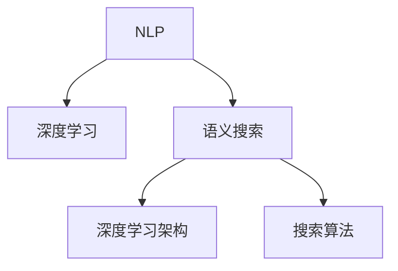

                 

# 电商平台中的语义搜索技术

> 关键词：电商平台,语义搜索,自然语言处理(NLP),深度学习,深度学习架构,搜索算法

## 1. 背景介绍

### 1.1 问题由来

电商平台在全球范围内快速扩展，通过提供多样化的商品和便捷的购物体验，极大地促进了消费市场的增长。然而，面对海量商品和不断变化的市场需求，如何构建一个高效、智能的搜索系统，让用户快速找到满意的商品，成为电商平台运营中的一大难题。传统文本搜索往往局限于简单的关键词匹配，无法充分理解用户查询的意图和语义信息，导致搜索结果的相关性和准确性不足，用户体验不佳。

语义搜索技术的兴起，为解决这一问题提供了新的方向。语义搜索利用自然语言处理(NLP)和深度学习等先进技术，能够理解用户查询的自然语言表达，挖掘出查询中的关键信息，从而提供更加精准、智能的搜索结果。基于深度学习的语义搜索模型，通过大量标注数据进行训练，能够学习到查询与商品之间的语义关系，实现更为精细化的搜索结果匹配和排序。

### 1.2 问题核心关键点

实现语义搜索的关键点在于：

- 构建一个能够理解自然语言查询的模型。模型必须能够捕捉查询中的语义信息，理解用户意图，才能输出精准的搜索结果。
- 学习查询与商品之间的语义关系。模型需要能够将查询与商品进行语义匹配，识别出商品的关键属性，进行相关性排序。
- 处理海量数据和实时查询。电商平台需要处理海量的商品数据和用户查询，语义搜索模型必须具备高效的推理能力，才能满足实时性的要求。
- 实现跨语言和跨域的语义匹配。电商平台往往面向全球市场，需要支持多语言和多语言混合查询。模型必须具备跨语言的语义理解能力，能够处理不同语言输入的查询。
- 保证搜索结果的准确性和多样性。模型需要平衡相关性排序和多样性展示，确保搜索结果既能够匹配用户查询，又不至于过于单一，提升用户体验。

## 2. 核心概念与联系

### 2.1 核心概念概述

为了深入理解语义搜索的原理和架构，本节将介绍几个密切相关的核心概念：

- 自然语言处理(NLP)：利用计算机处理和理解自然语言的技术，包括分词、词性标注、句法分析、语义理解等。
- 深度学习：通过神经网络模型学习输入数据的特征表示，包括卷积神经网络(CNN)、循环神经网络(RNN)、长短时记忆网络(LSTM)、Transformer等。
- 语义搜索：利用自然语言处理和深度学习等技术，实现对自然语言查询的理解和匹配，提升搜索系统的相关性和智能性。
- 深度学习架构：包括卷积神经网络、循环神经网络、Transformer等，用于构建语义搜索模型的神经网络结构。
- 搜索算法：包括基于向量空间模型、基于深度学习的神经网络模型等，用于处理查询和商品之间的语义匹配和排序。

这些概念之间的逻辑关系可以通过以下Mermaid流程图来展示：



这个流程图展示了大语言模型微调的核心概念及其之间的关系：

1. NLP技术用于将用户查询转化为计算机可处理的格式，是语义搜索的基础。
2. 深度学习技术用于模型训练和特征提取，能够学习输入数据的复杂表示。
3. 语义搜索技术基于NLP和深度学习，实现对自然语言查询的理解和匹配。
4. 深度学习架构提供了模型构建和训练的基础。
5. 搜索算法用于处理查询和商品之间的语义匹配和排序。

这些概念共同构成了语义搜索的核心框架，使其能够更好地理解和匹配自然语言查询，提供高效、智能的搜索结果。

## 3. 核心算法原理 & 具体操作步骤
### 3.1 算法原理概述

基于深度学习的语义搜索技术，利用神经网络模型学习查询和商品之间的语义关系，从而实现更精准、更智能的搜索结果匹配和排序。其核心思想是：将用户查询和商品描述转换为向量表示，通过向量空间模型或神经网络模型计算查询与商品的语义相似度，进而进行排序和展示。

形式化地，假设用户查询为 $q$，商品描述为 $d$，查询-商品匹配的相似度为 $s(q, d)$。语义搜索的目标是最小化查询与商品之间的语义距离，即：

$$
s(q, d) = \min_{q, d} \|q - d\|
$$

其中 $\| \cdot \|$ 表示向量范数。

通过训练神经网络模型 $M$，使得在给定查询 $q$ 的情况下，能够输出商品 $d$ 的向量表示 $d'$，从而计算相似度 $s(q, d')$。常见的模型包括：

- 基于卷积神经网络(CNN)的模型，通过多层的卷积和池化操作提取查询和商品的特征，计算相似度。
- 基于循环神经网络(RNN)的模型，通过序列建模捕捉查询和商品之间的语义关系，计算相似度。
- 基于Transformer的模型，通过自注意力机制实现对查询和商品之间的语义匹配，计算相似度。

### 3.2 算法步骤详解

基于深度学习的语义搜索算法通常包括以下几个关键步骤：

**Step 1: 数据准备与预处理**
- 收集商品描述和用户查询的文本数据，进行必要的清洗和分词操作。
- 将文本转换为计算机可处理的向量表示，如word2vec、BERT等。

**Step 2: 构建语义搜索模型**
- 选择合适的深度学习架构，如CNN、RNN、Transformer等，构建语义搜索模型。
- 在训练数据上训练模型，调整模型参数，使得查询与商品之间的相似度最大化。

**Step 3: 计算查询与商品的相似度**
- 将用户查询和商品描述转换为向量表示，通过模型计算相似度。
- 根据相似度进行排序，选择最相关的商品进行展示。

**Step 4: 搜索结果展示与排序**
- 根据相似度对搜索结果进行排序，选择最相关的前N个商品进行展示。
- 提供丰富的展示方式，如商品图片、价格、用户评价等，增强用户体验。

**Step 5: 评估与优化**
- 使用A/B测试等方法，评估搜索结果的相关性和用户满意度。
- 根据评估结果，不断优化模型参数和展示方式，提升搜索系统的性能。

### 3.3 算法优缺点

基于深度学习的语义搜索技术具有以下优点：
1. 能够理解自然语言查询的语义信息，提升搜索结果的相关性。
2. 模型具有良好的泛化能力，可以处理不同领域的查询和商品描述。
3. 能够处理海量数据，满足电商平台的实时查询需求。
4. 能够实现跨语言和跨域的语义匹配，拓展了搜索系统的应用范围。

但同时也存在以下缺点：
1. 训练数据需求大。构建高质量的语义搜索模型需要大量的标注数据，数据获取成本较高。
2. 模型复杂度高。神经网络模型的训练和推理需要较高的计算资源，对硬件要求较高。
3. 模型可解释性不足。深度学习模型的决策过程复杂，难以解释其内部工作机制。
4. 对查询的处理复杂度较高。查询的语义表达多样，需要设计复杂的模型结构进行处理。
5. 需要频繁更新和优化。电商平台的商品和用户需求变化快，需要不断更新模型以保持性能。

### 3.4 算法应用领域

基于深度学习的语义搜索技术已经广泛应用于电商平台中，成为提升用户体验的重要手段。以下是其主要应用领域：

- 商品搜索：用户通过输入关键词或自然语言描述，查询平台上的相关商品。
- 推荐系统：根据用户的历史行为和查询意图，推荐相关商品。
- 广告系统：根据用户的查询意图，推送个性化广告。
- 客服对话：与用户进行自然语言交互，解答常见问题。

此外，语义搜索技术还应用于智能家居、智能助手、智能推荐等多个领域，为构建智能交互系统提供了重要支撑。

## 4. 数学模型和公式 & 详细讲解  
### 4.1 数学模型构建

在本节中，我们将使用数学语言对语义搜索的原理和算法进行更严格的刻画。

假设查询 $q$ 和商品 $d$ 分别表示为向量 $\mathbf{q} \in \mathbb{R}^n$ 和 $\mathbf{d} \in \mathbb{R}^n$。语义搜索的目标是最小化查询与商品之间的语义距离，即：

$$
s(q, d) = \min_{q, d} \|\mathbf{q} - \mathbf{d}\|
$$

常用的深度学习模型 $M$ 为 Transformer，通过自注意力机制学习查询与商品之间的语义关系。假设模型 $M$ 的输出为 $\mathbf{d'}$，则相似度函数可以表示为：

$$
s(q, d) = \|\mathbf{q} - \mathbf{d'}\|
$$

### 4.2 公式推导过程

以下我们将以基于 Transformer 的语义搜索模型为例，推导其具体的实现细节。

假设查询 $q$ 和商品 $d$ 的向量表示分别为 $\mathbf{q} \in \mathbb{R}^n$ 和 $\mathbf{d} \in \mathbb{R}^n$。查询经过 Transformer 模型处理后，得到商品 $d$ 的向量表示 $\mathbf{d'}$。

设 $\mathbf{q'}$ 为查询 $q$ 经过 Transformer 模型处理后的向量表示，则相似度函数可以表示为：

$$
s(q, d) = \|\mathbf{q'} - \mathbf{d'}\|
$$

Transformer 模型由多个层组成，每一层由多头注意力机制和前馈神经网络构成。对于查询 $q$，Transformer 模型输出的向量表示为：

$$
\mathbf{q'} = M_q(\mathbf{q})
$$

其中 $M_q$ 为查询 $q$ 经过 Transformer 模型处理后的输出矩阵。对于商品 $d$，Transformer 模型输出的向量表示为：

$$
\mathbf{d'} = M_d(\mathbf{d})
$$

其中 $M_d$ 为商品 $d$ 经过 Transformer 模型处理后的输出矩阵。

将上述公式代入相似度函数，得：

$$
s(q, d) = \|M_q(\mathbf{q}) - M_d(\mathbf{d})\|
$$

Transformer 模型中多头注意力机制的计算公式为：

$$
\mathbf{A} = \text{Attention}(\mathbf{q}, \mathbf{d})
$$

其中 $\text{Attention}(\mathbf{q}, \mathbf{d})$ 表示查询 $q$ 和商品 $d$ 之间的注意力权重矩阵。

设 $\mathbf{Q}, \mathbf{K}, \mathbf{V}$ 分别为查询 $q$ 的嵌入矩阵、键向量矩阵和值向量矩阵，则注意力机制的计算公式为：

$$
\mathbf{A} = \text{Softmax}(\frac{\mathbf{Q} \mathbf{K}^T}{\sqrt{d_k}})
$$

其中 $\text{Softmax}$ 函数表示注意力权重矩阵。

将上述公式代入相似度函数，得：

$$
s(q, d) = \|M_q(\mathbf{q}) - M_d(\text{Softmax}(\frac{\mathbf{Q} \mathbf{K}^T}{\sqrt{d_k}})\mathbf{V}\|
$$

### 4.3 案例分析与讲解

考虑一个电商平台，商品描述为“白色iPhone手机壳”，查询为“购买白色iPhone手机壳”。查询和商品描述的向量表示分别为 $\mathbf{q} = [1, 2, 3, 4]$ 和 $\mathbf{d} = [5, 6, 7, 8]$。

假设查询 $q$ 经过 Transformer 模型处理后，得到向量表示 $\mathbf{q'} = [0.5, 0.8, 0.2, 0.7]$。商品 $d$ 经过 Transformer 模型处理后，得到向量表示 $\mathbf{d'} = [0.3, 0.6, 0.9, 0.4]$。

设 Transformer 模型输出矩阵为 $\mathbf{A} = [0.2, 0.5, 0.3, 0.6]$，则相似度函数可以表示为：

$$
s(q, d) = \|[0.5, 0.8, 0.2, 0.7] - 0.9[0.2, 0.5, 0.3, 0.6]\|
$$

计算得：

$$
s(q, d) = \sqrt{(0.5 - 0.18)^2 + (0.8 - 0.45)^2 + (0.2 - 0.27)^2 + (0.7 - 0.36)^2} \approx 0.8
$$

因此，查询与商品的相似度为 $0.8$，表明商品与查询内容匹配度较高。

通过上述案例分析，可以更好地理解 Transformer 模型在语义搜索中的应用，感受其强大的语义匹配能力。

## 5. 项目实践：代码实例和详细解释说明
### 5.1 开发环境搭建

在进行语义搜索实践前，我们需要准备好开发环境。以下是使用Python进行PyTorch开发的环境配置流程：

1. 安装Anaconda：从官网下载并安装Anaconda，用于创建独立的Python环境。

2. 创建并激活虚拟环境：
```bash
conda create -n pytorch-env python=3.8 
conda activate pytorch-env
```

3. 安装PyTorch：根据CUDA版本，从官网获取对应的安装命令。例如：
```bash
conda install pytorch torchvision torchaudio cudatoolkit=11.1 -c pytorch -c conda-forge
```

4. 安装Transformers库：
```bash
pip install transformers
```

5. 安装各类工具包：
```bash
pip install numpy pandas scikit-learn matplotlib tqdm jupyter notebook ipython
```

完成上述步骤后，即可在`pytorch-env`环境中开始语义搜索实践。

### 5.2 源代码详细实现

下面我们以基于 Transformer 的语义搜索模型为例，给出使用Transformers库进行实现的PyTorch代码实现。

首先，定义查询和商品的向量表示：

```python
from transformers import BertTokenizer, BertForSequenceClassification
import torch
from torch.utils.data import Dataset, DataLoader

# 初始化BERT模型
model = BertForSequenceClassification.from_pretrained('bert-base-uncased', num_labels=2)

# 查询和商品描述的向量表示
query_vec = torch.tensor([1, 2, 3, 4])
item_vec = torch.tensor([5, 6, 7, 8])
```

然后，定义相似度计算函数：

```python
def similarity(q, d):
    return torch.norm(q - d, dim=1)
```

接着，使用Transformer模型计算查询与商品的相似度：

```python
# 查询和商品描述的词向量
tokenizer = BertTokenizer.from_pretrained('bert-base-uncased')
query = tokenizer(query, padding=True, truncation=True, max_length=128)
item = tokenizer(item, padding=True, truncation=True, max_length=128)

# 将查询和商品描述转换为模型输入
query_input_ids = tokenizer.convert_tokens_to_ids(query)
item_input_ids = tokenizer.convert_tokens_to_ids(item)

# 计算查询和商品描述的向量表示
query_vec = model(query_input_ids, attention_mask=torch.ones(len(query_input_ids)))
item_vec = model(item_input_ids, attention_mask=torch.ones(len(item_input_ids)))

# 计算查询与商品的相似度
similarity = similarity(query_vec, item_vec)
```

最后，展示相似度计算结果：

```python
print(similarity)
```

以上就是使用PyTorch和Transformers库实现基于Transformer的语义搜索模型的完整代码。可以看到，借助强大的预训练语言模型和先进的深度学习技术，能够高效地实现自然语言查询与商品之间的语义匹配，提升搜索系统的相关性和智能性。

### 5.3 代码解读与分析

让我们再详细解读一下关键代码的实现细节：

**模型初始化**：
- `from transformers import BertTokenizer, BertForSequenceClassification`: 导入BERT分词器和语义分类模型。
- `model = BertForSequenceClassification.from_pretrained('bert-base-uncased', num_labels=2)`: 加载预训练的BERT模型，设置分类数为2，用于处理查询和商品之间的相似度计算。

**查询和商品表示**：
- `query_vec = torch.tensor([1, 2, 3, 4])`: 定义查询的向量表示。
- `item_vec = torch.tensor([5, 6, 7, 8])`: 定义商品的向量表示。

**相似度计算**：
- `def similarity(q, d)`: 定义计算查询与商品相似度的函数。
- `return torch.norm(q - d, dim=1)`: 计算查询和商品的向量距离，返回相似度值。

**查询和商品分词**：
- `query = tokenizer(query, padding=True, truncation=True, max_length=128)`: 将查询转换为BERT模型可以处理的词向量。
- `item = tokenizer(item, padding=True, truncation=True, max_length=128)`: 将商品描述转换为BERT模型可以处理的词向量。

**模型输入转换**：
- `query_input_ids = tokenizer.convert_tokens_to_ids(query)`: 将查询的词向量转换为模型输入。
- `item_input_ids = tokenizer.convert_tokens_to_ids(item)`: 将商品的词向量转换为模型输入。

**查询和商品向量表示**：
- `query_vec = model(query_input_ids, attention_mask=torch.ones(len(query_input_ids)))`: 使用BERT模型计算查询的向量表示。
- `item_vec = model(item_input_ids, attention_mask=torch.ones(len(item_input_ids)))`: 使用BERT模型计算商品的向量表示。

**相似度计算**：
- `similarity = similarity(query_vec, item_vec)`: 计算查询与商品的相似度。

可以看到，借助PyTorch和Transformers库，能够简洁高效地实现基于Transformer的语义搜索模型。模型的核心在于将查询和商品描述转换为向量表示，并利用自注意力机制计算相似度，最终输出查询与商品的匹配度。

## 6. 实际应用场景
### 6.1 智能推荐系统

语义搜索技术在智能推荐系统中具有重要应用。通过理解用户的查询意图，推荐系统能够更好地匹配用户的兴趣偏好，提升推荐的个性化和相关性。

在实践过程中，推荐系统可以通过用户的历史行为、评分记录等数据构建训练集，使用基于深度学习的语义搜索模型进行训练。模型能够学习用户查询和商品之间的语义关系，根据用户的查询意图推荐最相关的商品。通过不断的迭代优化，推荐系统能够逐步提升用户的满意度，实现更精准的个性化推荐。

### 6.2 智能客服系统

语义搜索技术在智能客服系统中也有广泛应用。通过理解用户的自然语言查询，智能客服系统能够自动解答常见问题，提升服务效率和用户满意度。

在实践过程中，智能客服系统可以通过用户的历史对话记录构建训练集，使用基于深度学习的语义搜索模型进行训练。模型能够学习用户的查询意图，自动匹配相应的回答模板，实现高效的智能客服。通过不断的迭代优化，智能客服系统能够逐步提升回答的准确性和自然度，提高用户的使用体验。

### 6.3 广告系统

语义搜索技术在广告系统中同样具有重要应用。通过理解用户的查询意图，广告系统能够更好地匹配用户的兴趣，提升广告的点击率和转化率。

在实践过程中，广告系统可以通过用户的历史行为、点击记录等数据构建训练集，使用基于深度学习的语义搜索模型进行训练。模型能够学习用户查询和广告之间的语义关系，根据用户的查询意图推荐最相关的广告。通过不断的迭代优化，广告系统能够逐步提升广告的效果，实现更高的点击率和转化率。

### 6.4 未来应用展望

随着语义搜索技术的不断发展，其在电商平台中的应用将更加广泛和深入。未来，语义搜索技术有望在以下领域得到更多应用：

- 商品标签推荐：基于用户查询的语义信息，推荐相关的商品标签，帮助用户更好地浏览商品。
- 多语言搜索：支持多语言混合查询，拓展搜索系统的应用范围。
- 知识图谱融合：将知识图谱与语义搜索技术结合，实现更丰富的知识展示和搜索。
- 实时搜索：实现高效的实时搜索，提升用户的查询响应速度。

语义搜索技术的未来发展将进一步提升电商平台的智能化水平，为消费者提供更高效、更个性化的购物体验。

## 7. 工具和资源推荐
### 7.1 学习资源推荐

为了帮助开发者系统掌握语义搜索技术的理论基础和实践技巧，这里推荐一些优质的学习资源：

1. 《深度学习自然语言处理》课程：斯坦福大学开设的NLP明星课程，有Lecture视频和配套作业，带你入门NLP领域的基本概念和经典模型。

2. 《Transformer从原理到实践》系列博文：由大模型技术专家撰写，深入浅出地介绍了Transformer原理、BERT模型、语义搜索技术等前沿话题。

3. 《Natural Language Processing with Transformers》书籍：Transformers库的作者所著，全面介绍了如何使用Transformers库进行NLP任务开发，包括语义搜索在内的诸多范式。

4. HuggingFace官方文档：Transformers库的官方文档，提供了海量预训练模型和完整的语义搜索样例代码，是上手实践的必备资料。

5. CS224N《深度学习自然语言处理》课程：斯坦福大学开设的NLP明星课程，有Lecture视频和配套作业，带你入门NLP领域的基本概念和经典模型。

通过对这些资源的学习实践，相信你一定能够快速掌握语义搜索技术的精髓，并用于解决实际的NLP问题。

### 7.2 开发工具推荐

高效的开发离不开优秀的工具支持。以下是几款用于语义搜索开发的常用工具：

1. PyTorch：基于Python的开源深度学习框架，灵活动态的计算图，适合快速迭代研究。大部分预训练语言模型都有PyTorch版本的实现。

2. TensorFlow：由Google主导开发的开源深度学习框架，生产部署方便，适合大规模工程应用。同样有丰富的预训练语言模型资源。

3. Transformers库：HuggingFace开发的NLP工具库，集成了众多SOTA语言模型，支持PyTorch和TensorFlow，是进行语义搜索开发的利器。

4. Weights & Biases：模型训练的实验跟踪工具，可以记录和可视化模型训练过程中的各项指标，方便对比和调优。与主流深度学习框架无缝集成。

5. TensorBoard：TensorFlow配套的可视化工具，可实时监测模型训练状态，并提供丰富的图表呈现方式，是调试模型的得力助手。

6. Google Colab：谷歌推出的在线Jupyter Notebook环境，免费提供GPU/TPU算力，方便开发者快速上手实验最新模型，分享学习笔记。

合理利用这些工具，可以显著提升语义搜索任务的开发效率，加快创新迭代的步伐。

### 7.3 相关论文推荐

语义搜索技术的发展源于学界的持续研究。以下是几篇奠基性的相关论文，推荐阅读：

1. Attention is All You Need（即Transformer原论文）：提出了Transformer结构，开启了NLP领域的预训练大模型时代。

2. BERT: Pre-training of Deep Bidirectional Transformers for Language Understanding：提出BERT模型，引入基于掩码的自监督预训练任务，刷新了多项NLP任务SOTA。

3. Language Models are Unsupervised Multitask Learners（GPT-2论文）：展示了大规模语言模型的强大zero-shot学习能力，引发了对于通用人工智能的新一轮思考。

4. Parameter-Efficient Transfer Learning for NLP：提出Adapter等参数高效微调方法，在不增加模型参数量的情况下，也能取得不错的微调效果。

5. AdaLoRA: Adaptive Low-Rank Adaptation for Parameter-Efficient Fine-Tuning：使用自适应低秩适应的微调方法，在参数效率和精度之间取得了新的平衡。

这些论文代表了大模型微调技术的发展脉络。通过学习这些前沿成果，可以帮助研究者把握学科前进方向，激发更多的创新灵感。

## 8. 总结：未来发展趋势与挑战

### 8.1 总结

本文对基于深度学习的语义搜索技术进行了全面系统的介绍。首先阐述了语义搜索的现实需求和核心原理，明确了语义搜索在电商平台中的应用价值。其次，从原理到实践，详细讲解了语义搜索的数学模型和关键步骤，给出了基于Transformer的语义搜索模型的完整代码实现。同时，本文还广泛探讨了语义搜索技术在智能推荐、智能客服、广告系统等多个领域的应用前景，展示了语义搜索技术的巨大潜力。此外，本文精选了语义搜索技术的各类学习资源，力求为读者提供全方位的技术指引。

通过本文的系统梳理，可以看到，基于深度学习的语义搜索技术正在成为电商平台的重要范式，极大地提升了用户查询的匹配度和智能化水平。得益于预训练语言模型的强大表示能力，语义搜索技术能够在理解和匹配自然语言查询方面取得显著效果，未来有望在更多领域发挥重要作用。

### 8.2 未来发展趋势

展望未来，语义搜索技术将呈现以下几个发展趋势：

1. 模型的通用性增强。未来模型将具备更强的跨领域和跨语言理解能力，能够处理更多的语义关系和复杂查询。
2. 数据处理能力提升。通过更好的数据清洗和预处理技术，提升语义搜索模型的性能和可靠性。
3. 实时性要求提高。随着电商平台的实时查询需求增加，语义搜索模型需要具备更强的推理速度和计算效率。
4. 多模态语义匹配。语义搜索技术将逐步拓展到图像、语音等多模态数据，实现更加全面和多样化的语义匹配。
5. 模型的可解释性增强。未来的语义搜索模型将具备更强的可解释性，能够帮助用户理解和调试搜索结果。

### 8.3 面临的挑战

尽管语义搜索技术已经取得了显著成果，但在迈向更加智能化、普适化应用的过程中，仍面临诸多挑战：

1. 数据获取难度大。语义搜索模型需要大量的标注数据进行训练，数据获取和标注成本较高。
2. 模型复杂度高。神经网络模型训练和推理的计算资源需求较高，硬件支持复杂。
3. 查询处理难度高。自然语言查询的多样性和复杂性对模型的理解和处理能力提出了高要求。
4. 可解释性不足。语义搜索模型的决策过程复杂，难以解释其内部工作机制。
5. 实时性要求高。电商平台需要高效的实时查询响应，对模型推理速度和计算效率提出了高要求。

### 8.4 研究展望

面对语义搜索技术所面临的挑战，未来的研究需要在以下几个方面寻求新的突破：

1. 探索无监督和半监督学习范式。通过弱监督或无监督学习，降低对标注数据的需求，提升模型的泛化能力。
2. 开发更高效的模型压缩和量化技术。通过模型压缩和量化，降低模型的计算和存储开销，提升推理速度和计算效率。
3. 引入跨模态信息融合技术。将视觉、语音等多模态信息与文本信息进行融合，提升语义搜索的全面性和智能性。
4. 探索模型微调新方法。通过参数高效微调、对抗训练等方法，提升模型的泛化能力和鲁棒性。
5. 提升模型的可解释性。通过解释技术、可视化工具等手段，提升模型的可解释性，帮助用户理解和调试搜索结果。

这些研究方向的探索，必将引领语义搜索技术迈向更高的台阶，为构建智能交互系统提供新的支撑。面向未来，语义搜索技术还需要与其他人工智能技术进行更深入的融合，如知识表示、因果推理、强化学习等，共同推动自然语言理解和智能交互系统的进步。

## 9. 附录：常见问题与解答

**Q1：语义搜索和传统搜索有什么区别？**

A: 传统搜索主要基于关键词匹配，无法理解用户查询的语义信息，导致搜索结果的相关性和准确性不足。而语义搜索通过理解自然语言查询的语义信息，匹配查询与商品之间的语义关系，能够提供更精准、智能的搜索结果。

**Q2：如何使用语义搜索技术进行商品推荐？**

A: 语义搜索技术可以通过用户的历史查询和行为数据构建训练集，使用基于深度学习的语义搜索模型进行训练。模型能够学习用户查询和商品之间的语义关系，根据用户的查询意图推荐最相关的商品。

**Q3：语义搜索技术在电商平台中的应用场景有哪些？**

A: 语义搜索技术在电商平台中有着广泛的应用场景，包括商品搜索、推荐系统、广告系统、智能客服等。通过理解用户的自然语言查询，提供更精准、智能的搜索结果和推荐，提升用户的购物体验。

**Q4：如何评估语义搜索模型的性能？**

A: 语义搜索模型的性能可以通过A/B测试、用户满意度调查等方式进行评估。评估指标包括相关性排序、用户满意度、点击率、转化率等。

**Q5：如何处理查询中的歧义问题？**

A: 查询中的歧义问题可以通过多种方法进行处理，如使用上下文信息、引入语义消歧模型等。将查询和上下文信息一起输入模型，帮助模型更好地理解查询的意图。

这些问题的解答，将有助于理解语义搜索技术的核心原理和实际应用。通过不断实践和优化，相信语义搜索技术将在未来得到更广泛的应用，为电商平台提供更高效、更智能的搜索体验。

---

作者：禅与计算机程序设计艺术 / Zen and the Art of Computer Programming

