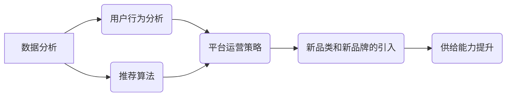

> 电商平台, 供给能力, 新品类, 新品牌, 引入策略, 数据分析, 推荐算法, 用户行为, 平台运营

## 1. 背景介绍

在当今激烈的电商市场竞争中，供给能力的提升至关重要。电商平台需要不断引入新品类和新品牌，以满足用户日益增长的需求，并保持平台的活力和竞争力。然而，新品类和新品牌的引入并非易事，需要平台进行精心策划和运营，才能有效提升供给能力，促进平台的健康发展。

传统电商平台的供给侧主要依靠人工筛选和运营，效率低下，难以满足快速变化的市场需求。随着人工智能、大数据等技术的快速发展，电商平台开始探索新的供给能力提升模式，例如利用数据分析和推荐算法，智能识别和推荐新品类和新品牌。

## 2. 核心概念与联系

**2.1  供给能力提升**

供给能力是指电商平台能够提供商品和服务的总量和质量。提升供给能力，意味着平台能够提供更多、更优质的商品和服务，满足用户需求，并提高平台的竞争力。

**2.2  新品类和新品牌的引入**

新品类是指平台上尚未存在的商品类别，例如虚拟现实设备、智能家居等。新品牌是指平台上尚未入驻的品牌，例如新兴的科技品牌、独立设计师品牌等。

**2.3  数据分析和推荐算法**

数据分析是指通过对海量数据进行挖掘和分析，发现其中的规律和趋势。推荐算法是指利用数据分析结果，预测用户对商品的兴趣，并推荐相关的商品。

**2.4  用户行为分析**

用户行为分析是指通过分析用户的浏览、购买、评价等行为，了解用户的需求和偏好。

**2.5  平台运营策略**

平台运营策略是指电商平台为了提升供给能力，吸引用户和商家，实现平台目标而制定的各种策略和措施。

**2.6  核心概念关系图**



## 3. 核心算法原理 & 具体操作步骤

### 3.1  算法原理概述

推荐算法的核心原理是基于用户的历史行为数据，预测用户对商品的兴趣。常用的推荐算法包括：

* **基于内容的推荐算法:** 根据商品的属性和用户喜欢的商品属性进行推荐。
* **基于协同过滤的推荐算法:** 根据用户的历史购买行为，推荐与相似用户购买过的商品。
* **混合推荐算法:** 将基于内容的推荐算法和基于协同过滤的推荐算法相结合，提高推荐效果。

### 3.2  算法步骤详解

**基于内容的推荐算法步骤:**

1. **数据收集:** 收集商品的属性信息和用户的历史购买行为数据。
2. **特征提取:** 对商品属性进行特征提取，例如商品类别、品牌、价格等。
3. **用户兴趣建模:** 根据用户的历史购买行为，构建用户的兴趣模型，例如用户喜欢的商品类别、品牌、价格等。
4. **推荐生成:** 根据用户的兴趣模型和商品的特征信息，计算商品的推荐得分，并推荐得分最高的商品。

**基于协同过滤的推荐算法步骤:**

1. **用户-商品矩阵构建:** 将用户的购买行为数据转换为用户-商品矩阵，其中每个元素表示用户对商品的购买行为。
2. **相似用户/商品计算:** 计算用户之间的相似度或商品之间的相似度。
3. **推荐生成:** 根据用户的相似用户或商品，推荐用户可能感兴趣的商品。

**混合推荐算法步骤:**

1. **基于内容的推荐:** 使用基于内容的推荐算法生成推荐结果。
2. **基于协同过滤的推荐:** 使用基于协同过滤的推荐算法生成推荐结果。
3. **融合推荐结果:** 将基于内容的推荐结果和基于协同过滤的推荐结果进行融合，生成最终的推荐结果。

### 3.3  算法优缺点

**基于内容的推荐算法:**

* **优点:** 可以推荐与用户兴趣相符的商品，推荐结果更精准。
* **缺点:** 需要大量的商品属性信息，且容易陷入“冷启动”问题，即对于新用户和新商品难以进行推荐。

**基于协同过滤的推荐算法:**

* **优点:** 可以推荐用户可能感兴趣但从未接触过的商品，避免“冷启动”问题。
* **缺点:** 需要大量的用户购买行为数据，且容易受到数据稀疏性的影响。

**混合推荐算法:**

* **优点:** 结合了基于内容和基于协同过滤的优点，可以提高推荐效果。
* **缺点:** 算法复杂度较高，需要更多的计算资源。

### 3.4  算法应用领域

推荐算法广泛应用于电商平台、社交媒体、音乐平台、视频平台等领域，例如：

* **电商平台:** 推荐商品、品牌、优惠券等。
* **社交媒体:** 推荐好友、群组、内容等。
* **音乐平台:** 推荐歌曲、专辑、歌手等。
* **视频平台:** 推荐视频、电视剧、电影等。

## 4. 数学模型和公式 & 详细讲解 & 举例说明

### 4.1  数学模型构建

**基于协同过滤的推荐算法**

假设用户集合为U，商品集合为I，用户-商品交互矩阵为R，其中R(u,i)表示用户u对商品i的评分。

**用户相似度计算:**

可以使用余弦相似度计算用户之间的相似度:

$$
sim(u_1, u_2) = \frac{u_1 \cdot u_2}{||u_1|| ||u_2||}
$$

其中，$u_1$ 和 $u_2$ 是用户 $u_1$ 和 $u_2$ 的评分向量，$ \cdot $ 表示点积，$||u_1||$ 和 $||u_2||$ 分别表示 $u_1$ 和 $u_2$ 的欧几里得范数。

**商品相似度计算:**

可以使用余弦相似度计算商品之间的相似度:

$$
sim(i_1, i_2) = \frac{i_1 \cdot i_2}{||i_1|| ||i_2||}
$$

其中，$i_1$ 和 $i_2$ 是商品 $i_1$ 和 $i_2$ 的评分向量，$ \cdot $ 表示点积，$||i_1||$ 和 $||i_2||$ 分别表示 $i_1$ 和 $i_2$ 的欧几里得范数。

### 4.2  公式推导过程

**基于协同过滤的推荐算法**

给定用户 $u$，需要推荐用户可能感兴趣的商品 $i$。

1. **找到与用户 $u$ 相似的用户 $u'$:**

$$
u' = argmax_{u'} sim(u, u')
$$

2. **找到用户 $u'$ 喜欢的商品 $i'$:**

$$
i' = argmax_{i'} R(u', i')
$$

3. **推荐用户 $u$ 可能喜欢的商品 $i$:**

$$
i = argmax_{i} sim(i', i)
$$

### 4.3  案例分析与讲解

假设有一个电商平台，用户集合为 U = {u1, u2, u3}, 商品集合为 I = {i1, i2, i3}, 用户-商品交互矩阵为:

```
R = [
    [5, 4, 3],
    [3, 5, 4],
    [4, 3, 5]
]
```

用户 u1 喜欢的商品是 i1 和 i2，用户 u2 喜欢的商品是 i2 和 i3，用户 u3 喜欢的商品是 i1 和 i3。

根据上述算法，可以计算出用户之间的相似度和商品之间的相似度，并推荐用户可能感兴趣的商品。例如，用户 u1 和 u3 的相似度最高，因此可以推荐用户 u1 喜欢的商品 i1 和 i3。

## 5. 项目实践：代码实例和详细解释说明

### 5.1  开发环境搭建

* **操作系统:** Linux/macOS/Windows
* **编程语言:** Python
* **库依赖:** pandas, numpy, scikit-learn

### 5.2  源代码详细实现

```python
import pandas as pd
from sklearn.metrics.pairwise import cosine_similarity

# 用户-商品交互矩阵
data = {
    'user': [1, 1, 2, 2, 3, 3],
    'item': [1, 2, 1, 3, 2, 3],
    'rating': [5, 4, 3, 5, 4, 5]
}
df = pd.DataFrame(data)

# 构建用户-商品矩阵
user_item_matrix = df.pivot_table(index='user', columns='item', values='rating').fillna(0)

# 计算用户相似度
user_similarity = cosine_similarity(user_item_matrix)

# 计算商品相似度
item_similarity = cosine_similarity(user_item_matrix.T)

# 推荐商品
def recommend_items(user_id, top_n=3):
    # 获取用户相似用户
    similar_users = user_similarity[user_id - 1].argsort()[:-top_n - 1:-1]

    # 获取相似用户喜欢的商品
    similar_items = user_item_matrix.loc[similar_users].mean().sort_values(ascending=False)

    # 获取用户未购买的商品
    unpurchased_items = set(range(1, len(user_item_matrix.columns) + 1)) - set(df[df['user'] == user_id]['item'])

    # 推荐商品
    recommendations = similar_items.loc[unpurchased_items].head(top_n)
    return recommendations.index.tolist()

# 示例推荐
user_id = 1
recommendations = recommend_items(user_id)
print(f"推荐给用户 {user_id} 的商品: {recommendations}")
```

### 5.3  代码解读与分析

* **数据准备:** 将用户-商品交互数据加载到 pandas DataFrame 中。
* **用户-商品矩阵构建:** 将数据转换为用户-商品矩阵，其中每个元素表示用户对商品的评分。
* **相似度计算:** 使用余弦相似度计算用户之间的相似度和商品之间的相似度。
* **推荐算法:** 基于协同过滤算法，推荐用户可能感兴趣的商品。
* **代码示例:** 展示了如何使用 Python 代码实现基于协同过滤的推荐算法。

### 5.4  运行结果展示

运行代码后，会输出推荐给用户 1 的商品列表。

## 6. 实际应用场景

### 6.1  电商平台新品类和新品牌引入

电商平台可以利用推荐算法，分析用户行为数据，识别潜在的新品类和新品牌需求，并推荐给平台运营人员，帮助平台引入更符合用户需求的商品和品牌。

### 6.2  新用户引导

电商平台可以利用推荐算法，根据新用户的兴趣和行为，推荐相关商品和品牌，帮助新用户快速熟悉平台，提高用户粘性。

### 6.3  个性化营销

电商平台可以利用推荐算法，为不同用户提供个性化的商品推荐和营销活动，提高营销效果。

### 6.4  未来应用展望

随着人工智能、大数据等技术的不断发展，推荐算法将会更加智能化、个性化，在电商平台的供给能力提升中发挥更加重要的作用。

## 7. 工具和资源推荐

### 7.1  学习资源推荐

* **书籍:**
    * 《推荐系统实践》
    * 《机器学习》
* **在线课程:**
    * Coursera: Recommender Systems
    * Udacity: Machine Learning Engineer Nanodegree

### 7.2  开发工具推荐

* **Python:** 
    * scikit-learn