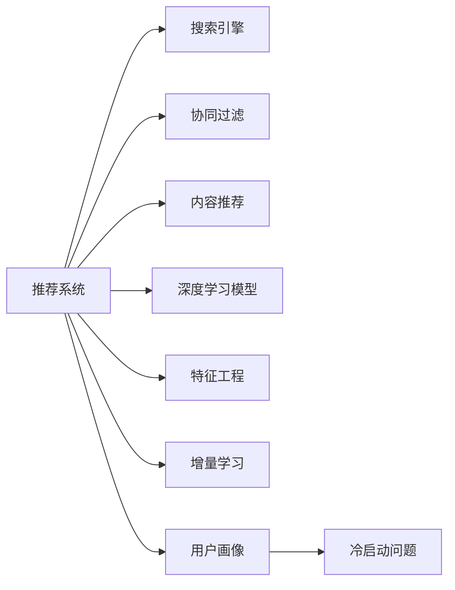

                 

# 电商平台搜索推荐系统的架构设计：AI 大模型是核心

## 1. 背景介绍

随着电子商务的发展，平台推荐的准确性和个性化程度越来越受到用户的关注。电商平台的搜索推荐系统需要高效地处理海量数据，并根据用户行为和历史偏好进行精准推荐，提升用户体验和销售额。人工智能大模型以其强大的数据处理能力和泛化能力，逐渐成为构建高效推荐系统的核心。本文将探讨AI大模型在电商平台搜索推荐系统中的架构设计，包括关键算法原理、操作步骤、应用领域、数学模型、代码实现、实际应用场景等，为构建高效的推荐系统提供系统性指导。

## 2. 核心概念与联系

### 2.1 核心概念概述

本节将介绍搜索推荐系统设计中几个核心概念：

- **推荐系统**：通过分析用户历史行为和偏好，为用户推荐符合其兴趣的商品或内容。
- **搜索引擎**：通过用户输入的查询词，快速检索出相关商品或内容。
- **协同过滤**：通过分析用户之间的相似性，为用户推荐其他用户喜欢的商品或内容。
- **内容推荐**：通过分析商品或内容的属性、标签等，为用户推荐相关信息。
- **深度学习模型**：如深度神经网络、大模型等，可以高效地处理大规模数据，发现数据的复杂结构，提高推荐系统的准确性和个性化程度。
- **特征工程**：将原始数据转换为模型能够处理的特征，提高模型的表现。
- **增量学习**：通过新数据的不断输入，模型可以持续更新，避免遗忘旧知识，提升推荐效果。
- **用户画像**：通过分析用户的历史行为、社交网络等数据，构建用户全面的画像，指导推荐策略。
- **冷启动问题**：对于新用户或新商品，推荐系统无法通过历史数据进行推荐。

### 2.2 核心概念原理和架构的 Mermaid 流程图



## 3. 核心算法原理 & 具体操作步骤

### 3.1 算法原理概述

AI大模型在电商平台搜索推荐系统中主要应用于特征提取、用户画像构建、相似度计算等方面。其核心思想是通过在大规模数据上进行预训练，学习到数据中的复杂结构和规律，然后通过微调等方式适应特定任务，从而提升推荐系统的准确性和个性化程度。

具体来说，大模型可以高效地处理大量的商品描述、用户行为等数据，从中提取特征，构建用户画像，并在推荐策略中进行高效的应用。此外，大模型还可以通过在线学习等方式，不断更新模型，避免遗忘旧知识，提升推荐系统的实时性和准确性。

### 3.2 算法步骤详解

#### 3.2.1 数据预处理

1. **数据收集**：收集用户行为数据、商品描述、用户画像等数据，作为模型的输入。
2. **数据清洗**：处理缺失数据、异常值等，保证数据质量。
3. **特征提取**：将原始数据转换为模型能够处理的特征，如商品描述中的关键词、用户行为中的购买次数等。

#### 3.2.2 模型训练

1. **选择模型**：根据任务需求选择合适的深度学习模型，如BERT、GPT-3等。
2. **模型训练**：在大规模数据上预训练模型，学习数据的复杂结构和规律。
3. **微调**：在特定任务上微调模型，调整模型参数，适应具体需求。
4. **增量学习**：通过新数据的不断输入，模型可以持续更新，避免遗忘旧知识。

#### 3.2.3 推荐策略

1. **协同过滤**：通过分析用户之间的相似性，为用户推荐其他用户喜欢的商品或内容。
2. **内容推荐**：通过分析商品或内容的属性、标签等，为用户推荐相关信息。
3. **深度学习推荐**：利用深度学习模型，从用户行为和商品描述中提取高层次特征，进行精准推荐。
4. **用户画像**：通过分析用户的历史行为、社交网络等数据，构建用户全面的画像，指导推荐策略。

#### 3.2.4 评估与优化

1. **评估指标**：如准确率、召回率、点击率等，用于评估推荐系统的表现。
2. **优化策略**：根据评估结果，调整模型参数、特征工程等，提升推荐系统的表现。
3. **冷启动问题**：对于新用户或新商品，采用一些冷启动策略，如基于内容的推荐、热门推荐等。

### 3.3 算法优缺点

AI大模型在电商平台搜索推荐系统中的主要优点包括：

1. **高效处理大规模数据**：大模型能够高效地处理海量数据，提取高层次特征。
2. **泛化能力强**：大模型能够学习到数据的复杂结构和规律，适应不同的任务需求。
3. **实时更新**：大模型可以通过在线学习等方式，不断更新模型，提升实时性和准确性。
4. **个性化推荐**：大模型能够根据用户行为和偏好，进行个性化推荐，提升用户体验。

主要缺点包括：

1. **计算资源需求高**：大模型的训练和推理需要大量的计算资源，如GPU/TPU等。
2. **过拟合风险**：在大模型中，过拟合风险较高，需要合理设计正则化等策略。
3. **模型复杂度高**：大模型的复杂度较高，需要更高的技术门槛和专业技能。
4. **数据质量要求高**：大模型对数据质量的要求较高，需要充分清洗和预处理数据。

### 3.4 算法应用领域

AI大模型在电商平台搜索推荐系统中主要应用于以下领域：

1. **商品推荐**：根据用户的历史行为和偏好，推荐符合其兴趣的商品。
2. **内容推荐**：根据用户的历史行为和偏好，推荐相关的内容。
3. **用户画像构建**：通过分析用户的历史行为、社交网络等数据，构建用户全面的画像。
4. **搜索排序**：根据用户输入的查询词，推荐相关商品或内容，提升搜索体验。
5. **广告推荐**：根据用户的行为和兴趣，推荐相关的广告，提升广告效果。

## 4. 数学模型和公式 & 详细讲解 & 举例说明

### 4.1 数学模型构建

假设电商平台有$N$个用户，$M$个商品，$H$个特征。用户对商品的行为可以用一个矩阵$U$表示，$U$中的每个元素$U_{ui}$表示用户$i$对商品$j$的行为评分，$U$中的每个行向量表示用户$i$的兴趣偏好，每个列向量表示商品$j$的属性特征。

设$\mathbf{w}_u$和$\mathbf{w}_i$为用户和商品的嵌入向量，则用户$i$对商品$j$的评分可以表示为：

$$
\hat{y}_{ij} = \mathbf{w}_u^T \mathbf{w}_i + \mathbf{w}_u^T \mathbf{w}_j
$$

其中，$\mathbf{w}_u$和$\mathbf{w}_i$可以通过深度学习模型在大规模数据上进行预训练，学习到用户的兴趣偏好和商品的特征。

### 4.2 公式推导过程

为了构建推荐系统，需要进行用户画像构建、相似度计算等操作。以下是对这些操作的公式推导过程：

#### 4.2.1 用户画像构建

用户画像可以通过计算用户$i$对商品$j$的行为评分$U_{ij}$，得到用户$i$的兴趣偏好向量$\mathbf{w}_i$：

$$
\mathbf{w}_i = \sum_{j=1}^{M} U_{ij} \mathbf{w}_j
$$

其中，$\mathbf{w}_j$为商品$j$的嵌入向量。

#### 4.2.2 相似度计算

用户$i$和用户$k$之间的相似度可以用余弦相似度计算：

$$
similarity_{ik} = \frac{\mathbf{w}_i^T \mathbf{w}_k}{\|\mathbf{w}_i\| \|\mathbf{w}_k\|}
$$

#### 4.2.3 推荐策略

基于协同过滤的推荐策略可以通过计算用户$i$和用户$k$之间的相似度$similarity_{ik}$，为用户$i$推荐其他用户$k$喜欢的商品$j$：

$$
recommend_{ij} = \text{top}_k(similarity_{ik}, \mathbf{w}_j)
$$

其中，$\text{top}_k$表示从相似度排序中选取前$k$个相似度最高的用户$k$进行推荐。

### 4.3 案例分析与讲解

#### 4.3.1 商品推荐

电商平台上用户的行为数据通常包含购买、浏览、收藏等操作。我们可以将用户行为数据转换为评分矩阵$U$，将商品描述数据转换为特征向量$\mathbf{w}_j$，然后通过深度学习模型进行预训练，学习到用户和商品的嵌入向量$\mathbf{w}_u$和$\mathbf{w}_i$。

根据用户的评分矩阵$U$和商品特征向量$\mathbf{w}_j$，可以计算用户$i$的兴趣偏好向量$\mathbf{w}_i$，然后通过计算用户$i$和用户$k$之间的相似度$similarity_{ik}$，为用户$i$推荐其他用户$k$喜欢的商品$j$。

#### 4.3.2 内容推荐

内容推荐可以通过分析用户的历史行为和偏好，推荐相关的内容。例如，用户浏览的新闻、视频等，可以将其转换为特征向量$\mathbf{w}_j$，然后通过深度学习模型进行预训练，学习到用户和内容的嵌入向量$\mathbf{w}_u$和$\mathbf{w}_i$。

根据用户的兴趣偏好向量$\mathbf{w}_i$和内容特征向量$\mathbf{w}_j$，可以计算用户$i$对内容$j$的评分$\hat{y}_{ij}$，然后根据评分排序推荐相关内容。

## 5. 项目实践：代码实例和详细解释说明

### 5.1 开发环境搭建

进行项目实践前，需要先搭建好开发环境。以下是使用Python进行TensorFlow开发的流程：

1. 安装Anaconda：从官网下载并安装Anaconda，用于创建独立的Python环境。

2. 创建并激活虚拟环境：
```bash
conda create -n tf-env python=3.8 
conda activate tf-env
```

3. 安装TensorFlow：根据CUDA版本，从官网获取对应的安装命令。例如：
```bash
conda install tensorflow -c pytorch -c conda-forge
```

4. 安装各类工具包：
```bash
pip install numpy pandas scikit-learn matplotlib tqdm jupyter notebook ipython
```

完成上述步骤后，即可在`tf-env`环境中开始项目实践。

### 5.2 源代码详细实现

下面以电商商品推荐系统为例，给出使用TensorFlow进行项目实现的代码。

```python
import tensorflow as tf
import numpy as np
import pandas as pd

# 数据加载与预处理
def load_and_preprocess_data(path):
    data = pd.read_csv(path)
    # 将原始数据转换为评分矩阵U和商品特征向量w_j
    U = data[['user', 'item', 'rating']].pivot_table(values='rating', index='user', columns='item').values
    w_j = data[['item', 'features']].pivot_table(values='features', index='item', columns='feature').values
    return U, w_j

# 构建用户嵌入向量
def build_user_embedding(U, w_j):
    user_embedding = tf.keras.layers.Dense(10, activation='sigmoid', name='user_embedding')(U)
    return user_embedding

# 构建商品嵌入向量
def build_item_embedding(w_j):
    item_embedding = tf.keras.layers.Dense(10, activation='sigmoid', name='item_embedding')(w_j)
    return item_embedding

# 构建推荐模型
def build_recommendation_model(U, user_embedding, item_embedding):
    user_preference = tf.matmul(user_embedding, tf.transpose(item_embedding))
    return user_preference

# 构建相似度矩阵
def build_similarity_matrix(user_preference, U):
    similarity_matrix = user_preference * U
    return similarity_matrix

# 推荐商品
def recommend_items(similarity_matrix, item_embedding, U):
    # 计算相似度
    similarity_matrix = similarity_matrix + np.transpose(similarity_matrix)
    # 选取top_k个相似度最高的用户
    top_k = 10
    indices = tf.argsort(similarity_matrix, axis=1)[:, -top_k:]
    # 推荐商品
    recommended_items = U[:, indices]
    return recommended_items

# 主函数
def main():
    # 数据加载与预处理
    U, w_j = load_and_preprocess_data('data.csv')

    # 构建用户嵌入向量
    user_embedding = build_user_embedding(U, w_j)

    # 构建商品嵌入向量
    item_embedding = build_item_embedding(w_j)

    # 构建推荐模型
    user_preference = build_recommendation_model(U, user_embedding, item_embedding)

    # 构建相似度矩阵
    similarity_matrix = build_similarity_matrix(user_preference, U)

    # 推荐商品
    recommended_items = recommend_items(similarity_matrix, item_embedding, U)

    # 输出推荐结果
    print(recommended_items)

if __name__ == '__main__':
    main()
```

### 5.3 代码解读与分析

让我们再详细解读一下关键代码的实现细节：

**load_and_preprocess_data函数**：
- `load_and_preprocess_data`函数用于加载和预处理数据。首先使用`pandas`库读取数据文件，将其转换为评分矩阵$U$和商品特征向量$\mathbf{w}_j$。

**build_user_embedding函数**：
- `build_user_embedding`函数用于构建用户嵌入向量$\mathbf{w}_u$。首先使用`tf.keras.layers.Dense`层进行用户评分矩阵$U$的嵌入，得到用户嵌入向量$\mathbf{w}_u$。

**build_item_embedding函数**：
- `build_item_embedding`函数用于构建商品嵌入向量$\mathbf{w}_j$。同样使用`tf.keras.layers.Dense`层进行商品特征向量$\mathbf{w}_j$的嵌入，得到商品嵌入向量$\mathbf{w}_j$。

**build_recommendation_model函数**：
- `build_recommendation_model`函数用于构建推荐模型。使用`tf.matmul`计算用户嵌入向量$\mathbf{w}_u$和商品嵌入向量$\mathbf{w}_j$的点积，得到用户对商品评分$\hat{y}_{ij}$。

**build_similarity_matrix函数**：
- `build_similarity_matrix`函数用于构建相似度矩阵。将推荐模型计算得到的用户评分$\hat{y}_{ij}$和用户评分矩阵$U$相乘，得到相似度矩阵。

**recommend_items函数**：
- `recommend_items`函数用于推荐商品。首先计算相似度矩阵的平均值，选取相似度最高的用户进行推荐。

**main函数**：
- `main`函数是整个项目的入口，按照数据加载、模型构建、相似度计算和推荐商品的步骤进行实现。

## 6. 实际应用场景

### 6.1 智能推荐系统

基于AI大模型的推荐系统可以广泛应用于电商平台的商品推荐、内容推荐、广告推荐等场景。例如，根据用户的历史行为和兴趣偏好，推荐符合其需求的商品；根据用户浏览的新闻、视频等，推荐相关的内容；根据用户的兴趣偏好，推荐相关的广告。

### 6.2 搜索排序

搜索排序可以通过分析用户输入的查询词，推荐相关的商品或内容。例如，用户输入“时尚服饰”，可以推荐相关的服饰商品或相关的新闻、视频等内容。

### 6.3 个性化推荐

个性化推荐可以通过分析用户的历史行为和兴趣偏好，推荐符合其需求的商品或内容。例如，用户喜欢某品牌的高端手机，可以推荐该品牌的新款手机、相关配件等。

### 6.4 未来应用展望

随着AI大模型的不断进步，电商平台搜索推荐系统的应用场景将更加广泛。未来，大模型可以在以下方面进行进一步探索：

1. **多模态推荐**：将文本、图像、视频等多模态数据结合，进行更全面的推荐。
2. **实时推荐**：通过在线学习等方式，不断更新模型，实时推荐最新商品或内容。
3. **个性化用户画像**：通过分析用户的行为、社交网络等数据，构建更全面的用户画像，指导推荐策略。
4. **跨领域推荐**：将电商平台的推荐系统与其他领域（如金融、旅游等）结合，进行跨领域推荐。

## 7. 工具和资源推荐

### 7.1 学习资源推荐

为了帮助开发者系统掌握大模型在推荐系统中的应用，这里推荐一些优质的学习资源：

1. TensorFlow官方文档：提供详细的TensorFlow使用指南和案例，适合初学者和进阶开发者。
2. TensorFlow推荐系统教程：由TensorFlow社区提供的推荐系统教程，涵盖从基础到高级的推荐系统实现。
3. AI大模型推荐系统：介绍大模型在推荐系统中的应用，适合有一定基础的开发者。
4. PyTorch推荐系统教程：提供PyTorch推荐系统教程，涵盖从基础到高级的推荐系统实现。
5. Coursera深度学习课程：斯坦福大学提供的深度学习课程，涵盖推荐系统等相关内容，适合对深度学习感兴趣的开发者。

### 7.2 开发工具推荐

高效的工具支持是项目开发的关键。以下是几款常用的推荐系统开发工具：

1. TensorFlow：由Google主导开发的深度学习框架，支持分布式计算，适合大规模推荐系统开发。
2. PyTorch：由Facebook主导开发的深度学习框架，适合快速迭代研究。
3. Hadoop和Spark：用于大数据处理的分布式计算框架，支持大规模推荐系统数据处理。
4. Apache Kafka：用于大规模推荐系统数据传输和实时处理的消息队列系统。
5. Apache Cassandra：用于大规模推荐系统数据存储和检索的分布式数据库系统。

### 7.3 相关论文推荐

大模型在推荐系统中的应用涉及诸多前沿研究。以下是几篇奠基性的相关论文，推荐阅读：

1. Approximate Nearest Neighbors in High-Dimensional Feature Spaces（近似最近邻）：介绍基于深度学习的推荐系统，提升推荐系统效率。
2. Deep Collaborative Filtering Using Neural Multi-Layer Perceptron (NMLP) for Recommendation Systems（基于深度学习的协同过滤推荐系统）：介绍基于深度神经网络的协同过滤推荐系统，提升推荐系统效果。
3. Multi-Aspect Recommendation with Attention-based Deep Matrix Factorization（基于注意力机制的深度矩阵分解推荐系统）：介绍基于注意力机制的深度推荐系统，提升推荐系统多样性和准确性。
4. Deep Factorization Machines with Dynamic Allocation of Individual Features（动态特征分配的深度因子分解机）：介绍基于深度学习的高效推荐系统，提升推荐系统效率和效果。
5. NLP-Enhanced Recommendation：介绍基于NLP的推荐系统，提升推荐系统理解和生成能力。

## 8. 总结：未来发展趋势与挑战

### 8.1 总结

本文对AI大模型在电商平台搜索推荐系统中的应用进行了全面系统的介绍。首先阐述了推荐系统的核心概念和设计原理，明确了AI大模型在推荐系统中的重要作用。其次，从算法原理、操作步骤、应用领域、数学模型、代码实现等方面，详细讲解了推荐系统的构建流程。同时，本文还广泛探讨了推荐系统在电商、搜索、广告等多个领域的应用前景，展示了AI大模型的巨大潜力。

通过本文的系统梳理，可以看到，AI大模型在推荐系统中的应用已经取得了显著成果，并在多个实际应用中展现出卓越性能。未来，伴随AI大模型的不断演进，推荐系统也将迎来新的突破和发展，成为推动电商行业数字化转型升级的重要驱动力。

### 8.2 未来发展趋势

展望未来，AI大模型在推荐系统中的应用将呈现以下几个发展趋势：

1. **高效实时推荐**：通过在线学习等方式，不断更新模型，实现实时推荐，提升用户体验。
2. **多模态推荐**：将文本、图像、视频等多模态数据结合，进行更全面的推荐。
3. **跨领域推荐**：将推荐系统与其他领域（如金融、旅游等）结合，进行跨领域推荐。
4. **个性化用户画像**：通过分析用户的行为、社交网络等数据，构建更全面的用户画像，指导推荐策略。
5. **可解释性推荐**：通过因果推断等方法，增强推荐系统的可解释性和可信度。

以上趋势凸显了AI大模型在推荐系统中的广阔前景。这些方向的探索发展，必将进一步提升推荐系统的准确性和个性化程度，为电商行业带来更大的价值。

### 8.3 面临的挑战

尽管AI大模型在推荐系统中的应用已经取得了显著成果，但在迈向更加智能化、普适化应用的过程中，仍面临诸多挑战：

1. **数据质量瓶颈**：推荐系统对数据质量的要求较高，需要充分清洗和预处理数据。
2. **计算资源需求高**：大模型的训练和推理需要大量的计算资源，如GPU/TPU等。
3. **模型鲁棒性不足**：在特定领域或特定用户群体中，大模型可能出现泛化性能差的问题。
4. **推荐系统公平性**：推荐系统可能存在性别、年龄等偏见，需要进一步优化。
5. **推荐系统透明度**：推荐系统的决策过程难以解释，需要进一步提高推荐系统的透明度。

### 8.4 研究展望

面对推荐系统面临的这些挑战，未来的研究需要在以下几个方面寻求新的突破：

1. **数据质量提升**：通过数据增强、异常检测等技术，提升数据质量，降低数据处理成本。
2. **计算资源优化**：采用分布式计算、模型压缩等技术，优化计算资源消耗，降低推荐系统部署成本。
3. **模型鲁棒性提升**：通过引入对抗训练、多任务学习等技术，提升模型的鲁棒性，避免泛化性能差的问题。
4. **推荐系统公平性**：通过公平性约束等技术，优化推荐系统的公平性，减少偏见和歧视。
5. **推荐系统透明度**：通过可解释性技术，提高推荐系统的透明度，增强用户信任。

这些研究方向将引领AI大模型在推荐系统中的应用进入新的发展阶段，推动电商行业不断进步。总之，AI大模型在推荐系统中的应用前景广阔，值得我们持续关注和深入研究。

## 9. 附录：常见问题与解答

**Q1：AI大模型在推荐系统中如何使用？**

A: AI大模型在推荐系统中主要用于特征提取、用户画像构建、相似度计算等方面。具体来说，可以通过大模型对用户行为数据进行嵌入处理，构建用户嵌入向量$\mathbf{w}_u$和商品嵌入向量$\mathbf{w}_j$，然后通过计算用户$i$和用户$k$之间的相似度$similarity_{ik}$，为用户$i$推荐其他用户$k$喜欢的商品$j$。

**Q2：推荐系统的准确性和个性化程度如何提升？**

A: 推荐系统的准确性和个性化程度可以通过以下方法提升：
1. 数据增强：通过数据增强等技术，提升数据质量。
2. 模型优化：通过优化模型结构、参数调整等，提升推荐系统效果。
3. 特征工程：通过特征工程等技术，提取高层次特征。
4. 模型融合：通过模型融合等技术，提升推荐系统效果。

**Q3：推荐系统的计算资源需求如何优化？**

A: 推荐系统的计算资源需求可以通过以下方法优化：
1. 分布式计算：通过分布式计算框架，优化计算资源消耗。
2. 模型压缩：通过模型压缩等技术，减小模型尺寸，提升计算效率。
3. 硬件优化：通过硬件优化等技术，提升计算效率。

**Q4：推荐系统的数据质量如何提升？**

A: 推荐系统的数据质量可以通过以下方法提升：
1. 数据清洗：通过数据清洗等技术，提升数据质量。
2. 异常检测：通过异常检测等技术，提升数据质量。
3. 数据增强：通过数据增强等技术，提升数据质量。

**Q5：推荐系统的模型鲁棒性如何提升？**

A: 推荐系统的模型鲁棒性可以通过以下方法提升：
1. 对抗训练：通过对抗训练等技术，提升模型的鲁棒性。
2. 多任务学习：通过多任务学习等技术，提升模型的鲁棒性。
3. 鲁棒性约束：通过鲁棒性约束等技术，提升模型的鲁棒性。

通过以上问题与解答，相信你对AI大模型在推荐系统中的应用有了更加深刻的理解。未来，随着技术的不断进步，AI大模型将在电商行业等领域发挥更大的作用，推动行业不断创新和发展。

---

作者：禅与计算机程序设计艺术 / Zen and the Art of Computer Programming

