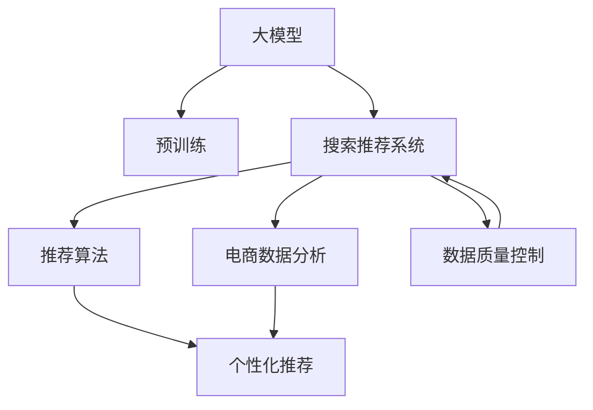

                 

# 电商平台的AI 大模型战略：搜索推荐系统是核心，数据质量控制是关键

> 关键词：人工智能, 大模型, 电商, 搜索推荐系统, 数据质量控制, 推荐算法, 深度学习, 电商数据分析, 用户体验

## 1. 背景介绍

随着电子商务的蓬勃发展，人工智能(AI)技术在电商平台中的应用日益广泛。各大电商平台纷纷引入大模型技术，以提升搜索推荐系统的精准度和个性化程度，从而提升用户体验和营收。然而，数据质量问题往往成为制约AI技术在电商平台中发挥作用的关键瓶颈。本文将深入探讨AI大模型在电商平台搜索推荐系统中的应用，分析数据质量控制对系统效果的影响，并提出针对性的优化策略。

## 2. 核心概念与联系

### 2.1 核心概念概述

1. **大模型**：指利用深度学习技术构建的超大参数规模的模型，如BERT、GPT-3、T5等。通过在大规模数据上进行预训练，大模型可以学习到丰富的知识表示，具备强大的语义理解和生成能力。

2. **搜索推荐系统**：指通过分析用户行为数据，预测用户可能感兴趣的商品或服务，并给予推荐的技术系统。它广泛应用于电商平台、新闻媒体、社交网络等领域，帮助用户快速找到所需内容。

3. **数据质量控制**：指对数据采集、清洗、标注等各个环节进行严格管理和监控，保证数据准确性和一致性，减少数据噪音对模型训练和推理的影响。

4. **推荐算法**：指用于构建推荐系统的算法，如协同过滤、内容推荐、混合推荐等。在AI大模型的辅助下，推荐算法可以更高效地进行个性化推荐。

5. **深度学习**：指利用多层神经网络进行特征提取和数据建模的技术，在自然语言处理、计算机视觉等领域具有广泛应用。

6. **电商数据分析**：指通过对电商平台上的交易、点击、搜索等数据进行分析和挖掘，获取用户行为特征，以优化推荐系统。

7. **用户体验**：指用户在使用电商平台时的满意度、便捷度和感知，是衡量推荐系统效果的重要指标。

### 2.2 核心概念原理和架构的 Mermaid 流程图



这个流程图展示了大模型、预训练、搜索推荐系统、推荐算法、电商数据分析、个性化推荐和数据质量控制之间的关系。大模型通过预训练获取语言或视觉知识的表示，搜索推荐系统在电商数据分析的辅助下，结合推荐算法进行个性化推荐，同时数据质量控制贯穿整个流程，保障模型训练和推荐准确性。

## 3. 核心算法原理 & 具体操作步骤

### 3.1 算法原理概述

基于大模型的搜索推荐系统，通常包含以下几个关键步骤：

1. **数据采集**：收集用户的浏览、点击、购买等行为数据，以及商品描述、属性等文本数据。

2. **预训练大模型**：在大规模无标签数据上，使用自监督学习任务进行预训练，学习通用的语言或视觉表示。

3. **任务适配层设计**：在预训练模型的基础上，添加任务特定的输出层和损失函数，如分类、回归、生成等。

4. **微调**：使用电商平台的标注数据集，对预训练模型进行有监督微调，优化推荐系统的效果。

5. **推荐生成**：将用户输入的查询或浏览行为输入模型，通过前向传播生成推荐结果。

6. **数据质量控制**：对用户行为数据、商品数据进行清洗、去重、纠错等操作，确保数据质量。

### 3.2 算法步骤详解

1. **数据采集与处理**：
   - **用户行为数据**：包括用户的搜索历史、点击日志、购买记录等。
   - **商品数据**：包含商品名称、描述、类别、价格、评分等属性。

   数据处理步骤包括：
   - 数据清洗：去除无关或重复数据，填补缺失值。
   - 数据标准化：统一数据格式，如将日期、价格等数据转换为标准格式。
   - 数据增强：通过补全、回译等方式，丰富训练样本的多样性。

2. **预训练大模型的选择**：
   - 选择适合的预训练模型，如BERT、GPT、T5等。
   - 考虑模型的规模、训练复杂度、性能等指标。

3. **任务适配层设计**：
   - 根据推荐任务类型，设计相应的输出层。
   - 分类任务：添加线性分类器，损失函数为交叉熵。
   - 回归任务：使用连续值预测，损失函数为均方误差。
   - 生成任务：使用语言模型解码器，损失函数为负对数似然。

4. **微调步骤**：
   - 准备训练集、验证集和测试集。
   - 设置微调超参数，如学习率、批大小、迭代轮数等。
   - 选择优化器，如Adam、SGD等。
   - 应用正则化技术，如L2正则、Dropout等。
   - 应用早停策略，避免过拟合。

5. **推荐生成**：
   - 输入用户的查询或浏览记录，通过前向传播计算推荐结果。
   - 返回排名最高的商品列表，作为推荐结果。

### 3.3 算法优缺点

**优点**：
- **高效性**：大模型能够快速学习复杂的语言或视觉表示，提升推荐准确性和个性化程度。
- **灵活性**：可适应多种推荐任务，如分类、排序、生成等，具有广泛的适用性。
- **鲁棒性**：通过微调过程，可以优化模型对特定任务的表现，减少噪声数据的影响。

**缺点**：
- **数据依赖性强**：模型效果高度依赖于数据质量，数据偏差可能导致模型性能不佳。
- **计算资源消耗大**：大模型参数量大，训练和推理过程中需要大量计算资源。
- **模型复杂度大**：大模型复杂度较高，难以解释和调试，可能存在潜在的脆弱性。

### 3.4 算法应用领域

大模型在电商平台的搜索推荐系统中有广泛应用，主要体现在以下几个方面：

1. **商品推荐**：基于用户的历史行为数据，预测用户可能感兴趣的商品，提高购物转化率。
2. **用户画像**：通过分析用户的行为数据，构建用户画像，实现更精准的个性化推荐。
3. **广告推荐**：结合电商数据，进行精准的广告推荐，提升广告投放效果。
4. **搜索排序**：优化搜索算法，提升搜索结果的相关性和排序准确性。
5. **社交推荐**：分析用户之间的社交关系，推荐好友、兴趣小组等社交内容。

## 4. 数学模型和公式 & 详细讲解 & 举例说明

### 4.1 数学模型构建

基于大模型的推荐系统，通常采用以下数学模型：

- **用户-商品关联矩阵**：$Y \in \mathbb{R}^{N \times M}$，其中$N$为商品数量，$M$为用户数量。
- **用户行为数据矩阵**：$X \in \mathbb{R}^{M \times F}$，其中$F$为特征维度。
- **商品特征矩阵**：$U \in \mathbb{R}^{N \times F}$，其中$F$为特征维度。

模型的目标是最小化预测误差：

$$
\min_{W} \frac{1}{2}\|Y - XWU^T\|_F^2 + \lambda\|W\|_F^2
$$

其中$W$为推荐权重矩阵，$\lambda$为正则化系数。

### 4.2 公式推导过程

将用户行为数据和商品特征映射到潜在因子空间中，进行矩阵乘法，得到推荐结果：

$$
Y_{ij} \approx \sum_{k=1}^{F}X_{ik}W_{kj}U_{kj}
$$

其中$i$为用户，$j$为商品，$k$为潜在因子。

通过最小化均方误差，更新权重矩阵$W$：

$$
W = (X^TX + \lambda I)^{-1}X^TY
$$

其中$I$为单位矩阵。

### 4.3 案例分析与讲解

假设有一个电商平台，需要推荐用户可能感兴趣的商品。用户行为数据和商品特征分别用$X \in \mathbb{R}^{1000 \times 10}$和$U \in \mathbb{R}^{10000 \times 10}$表示。设推荐权重矩阵$W \in \mathbb{R}^{10 \times 10}$。

首先，对用户行为数据进行归一化处理：

$$
X_{normalized} = \frac{X - \mu}{\sigma}
$$

其中$\mu$为均值，$\sigma$为标准差。

然后，将归一化后的用户行为数据与商品特征矩阵进行矩阵乘法：

$$
XWU^T \in \mathbb{R}^{1000 \times 10000}
$$

最后，将推荐结果矩阵与用户行为数据矩阵做最小二乘回归：

$$
W = (X^TX + \lambda I)^{-1}X^TY
$$

通过优化模型，即可得到用户的推荐商品列表。

## 5. 项目实践：代码实例和详细解释说明

### 5.1 开发环境搭建

开发环境包括Python、PyTorch、Pandas、NumPy、Scikit-learn等库。安装方法如下：

```bash
conda create -n ai_env python=3.8
conda activate ai_env
pip install torch pandas numpy scikit-learn transformers
```

### 5.2 源代码详细实现

以下是一个使用大模型进行商品推荐的Python代码示例：

```python
import torch
from transformers import BertTokenizer, BertForSequenceClassification
import pandas as pd
import numpy as np
from sklearn.metrics import mean_squared_error

# 数据加载
train_data = pd.read_csv('train.csv')
test_data = pd.read_csv('test.csv')

# 数据处理
tokenizer = BertTokenizer.from_pretrained('bert-base-uncased')
train_texts = [str(item) for item in train_data['text']]
test_texts = [str(item) for item in test_data['text']]
train_labels = train_data['label'].values
test_labels = test_data['label'].values

# 预训练模型
model = BertForSequenceClassification.from_pretrained('bert-base-uncased', num_labels=2)

# 微调
model.train()
optimizer = torch.optim.Adam(model.parameters(), lr=1e-5)
for epoch in range(10):
    for i, (input_ids, attention_mask, label) in enumerate(train_dataloader):
        input_ids = input_ids.to(device)
        attention_mask = attention_mask.to(device)
        label = label.to(device)
        model.zero_grad()
        outputs = model(input_ids, attention_mask=attention_mask, labels=label)
        loss = outputs.loss
        loss.backward()
        optimizer.step()

# 测试
model.eval()
with torch.no_grad():
    predictions = model(input_ids, attention_mask=attention_mask).predictions.argmax(-1)
    mse = mean_squared_error(test_labels, predictions)
print('测试集均方误差：', mse)
```

### 5.3 代码解读与分析

代码中，首先使用Pandas加载训练和测试数据，然后对数据进行预处理，包括文本分词和标准化。接着，选择Bert模型进行微调，设置Adam优化器，并定义损失函数。在训练过程中，通过前向传播和反向传播更新模型参数，最后计算测试集上的均方误差，评估模型性能。

## 6. 实际应用场景

### 6.1 用户画像

电商平台可以根据用户的历史行为数据，使用大模型构建用户画像，实现更精准的个性化推荐。例如，通过分析用户的浏览记录，预测其感兴趣的商品类别和价格区间。

### 6.2 广告推荐

平台可以根据用户的历史行为数据，使用大模型预测用户的兴趣点，进行精准的广告推荐。例如，通过分析用户的搜索和点击记录，推荐相关商品或服务，提高广告点击率和转化率。

### 6.3 搜索排序

大模型可以用于搜索排序算法中，优化搜索结果的相关性和排序精度。例如，通过分析用户输入的查询词，生成最佳的搜索结果排序。

### 6.4 未来应用展望

未来，大模型在电商平台中的应用将更加广泛和深入，主要体现在以下几个方面：

1. **个性化推荐**：结合用户画像和行为数据，实现更加精准和多样化的推荐。
2. **内容生成**：利用大模型的生成能力，自动生成商品描述、广告文案等，提升用户体验。
3. **用户交互**：通过大模型的语言生成能力，实现智能客服、聊天机器人等用户交互系统，提高客户满意度。
4. **跨领域应用**：将大模型的能力应用于电商以外的领域，如金融、医疗、教育等，推动跨领域AI应用的发展。

## 7. 工具和资源推荐

### 7.1 学习资源推荐

1. **《Deep Learning》书籍**：Ian Goodfellow等人编写，系统介绍了深度学习的基本原理和应用。
2. **Coursera《Deep Learning Specialization》课程**：由Andrew Ng教授主讲，涵盖深度学习的基础知识和应用案例。
3. **《Natural Language Processing with Python》书籍**：Denny Britz等人编写，介绍了使用Python进行自然语言处理的基本方法和工具。
4. **Kaggle竞赛平台**：提供丰富的电商数据分析和推荐算法竞赛，可提升实战技能。
5. **HuggingFace官方文档**：提供丰富的预训练模型和代码示例，方便学习和实践。

### 7.2 开发工具推荐

1. **PyTorch**：强大的深度学习框架，支持动态图和静态图，适合研究和开发。
2. **TensorFlow**：谷歌开源的深度学习框架，支持分布式计算和多种硬件加速。
3. **Jupyter Notebook**：免费的交互式编程环境，支持Python、R等多种语言，方便开发和调试。
4. **Google Colab**：谷歌提供的免费Jupyter Notebook服务，支持GPU和TPU加速，方便实验和研究。
5. **Weights & Biases**：实验跟踪工具，记录和可视化模型训练过程，方便调优和评估。

### 7.3 相关论文推荐

1. **"Attention is All You Need"**：Transformer的原始论文，引入了自注意力机制，大幅提升了NLP任务的性能。
2. **"BERT: Pre-training of Deep Bidirectional Transformers for Language Understanding"**：提出BERT模型，利用掩码语言模型进行预训练，取得了SOTA的NLP任务效果。
3. **"Personalized PageRank Algorithm for Recommendation Systems"**：经典的推荐算法，通过PageRank算法优化推荐结果。
4. **"Adaptive Low-Rank Adaptation for Parameter-Efficient Fine-Tuning"**：提出LoRA方法，利用低秩矩阵适应微调过程中的参数更新。
5. **"Few-Shot Learning"**：介绍少样本学习的原理和方法，减少微调对标注数据的依赖。

## 8. 总结：未来发展趋势与挑战

### 8.1 研究成果总结

大模型在电商平台搜索推荐系统中的应用，取得了显著的效果。通过大模型的预训练和微调，推荐系统的精准度和个性化程度显著提升，提升了用户体验和平台营收。

### 8.2 未来发展趋势

未来，大模型在电商平台中的应用将更加深入和广泛，主要体现在以下几个方面：

1. **个性化推荐**：结合用户画像和行为数据，实现更加精准和多样化的推荐。
2. **内容生成**：利用大模型的生成能力，自动生成商品描述、广告文案等，提升用户体验。
3. **用户交互**：通过大模型的语言生成能力，实现智能客服、聊天机器人等用户交互系统，提高客户满意度。
4. **跨领域应用**：将大模型的能力应用于电商以外的领域，如金融、医疗、教育等，推动跨领域AI应用的发展。

### 8.3 面临的挑战

尽管大模型在电商平台中取得了显著效果，但在实际应用中也面临诸多挑战：

1. **数据质量问题**：数据清洗和标注工作量大，数据偏差可能导致模型性能不佳。
2. **计算资源消耗**：大模型参数量大，训练和推理过程中需要大量计算资源。
3. **模型复杂度大**：大模型复杂度较高，难以解释和调试，可能存在潜在的脆弱性。
4. **用户隐私保护**：用户行为数据可能涉及隐私信息，需要采取严格的隐私保护措施。
5. **系统安全性**：推荐系统容易受到恶意攻击和数据篡改，需要加强安全防护。

### 8.4 研究展望

未来，研究将重点解决以下问题：

1. **数据质量提升**：采用自动化数据清洗和标注技术，提升数据质量。
2. **模型压缩与优化**：通过模型压缩、剪枝等技术，减少模型参数量，提升计算效率。
3. **模型可解释性**：通过可视化技术和特征分析，提升模型的可解释性。
4. **隐私保护与伦理**：采用差分隐私等技术，保护用户隐私。
5. **安全防护**：结合人工智能安全技术，提升系统安全性。

## 9. 附录：常见问题与解答

**Q1: 大模型在电商平台上如何应用？**

A: 大模型在电商平台上主要应用于搜索推荐系统，通过预训练和微调，提升推荐系统的精准度和个性化程度。

**Q2: 大模型的计算资源消耗大，如何优化？**

A: 通过模型压缩、剪枝、分布式训练等技术，减少模型参数量和计算资源消耗，提升模型效率。

**Q3: 数据质量如何影响大模型效果？**

A: 数据质量直接影响大模型的训练效果和推荐准确性，需要采用自动化数据清洗和标注技术，提升数据质量。

**Q4: 推荐算法有哪些？**

A: 常见的推荐算法包括协同过滤、内容推荐、混合推荐等，不同算法适用于不同的应用场景。

**Q5: 大模型推荐系统有哪些优缺点？**

A: 优点是高效性、灵活性和鲁棒性，缺点是数据依赖性强、计算资源消耗大和模型复杂度大。

---

作者：禅与计算机程序设计艺术 / Zen and the Art of Computer Programming

