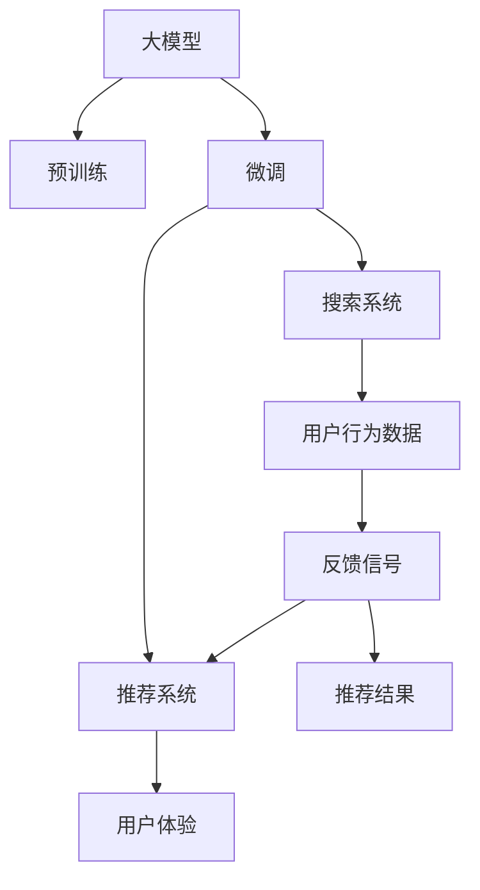

                 

# 电商平台的AI 大模型转型：搜索推荐系统是核心，数据质量控制与用户体验优化

## 1. 背景介绍

### 1.1 问题由来

随着互联网电商的蓬勃发展，电商平台作为重要的线上交易平台，已经变得越来越依赖于人工智能技术来优化用户体验，提升销售转化率。搜索推荐系统作为电商平台核心算法，其效果直接关系到用户的购物体验和平台的商业价值。近年来，深度学习大模型在搜索推荐系统中得到了广泛应用，通过大规模无标签数据的预训练和有标签数据的微调，显著提升了模型性能。但同时，随着电商平台的竞争加剧，商家对搜索推荐系统的性能要求也在不断提高，大模型转型势在必行。

### 1.2 问题核心关键点

大模型在电商平台的搜索推荐系统中应用的核心关键点主要包括以下几点：

- **数据规模**：大模型需要大量的无标签数据进行预训练，而电商平台的交易数据大多是有标签的，因此需要找到一种方法将大模型的预训练和微调结合，以利用更广泛的数据资源。
- **用户反馈**：电商平台的用户反馈信息丰富，包括点击、购买、评价等，这些反馈信息如何有效利用，进一步提升模型性能，是重要的研究方向。
- **跨领域迁移**：电商平台涉及的商品种类繁多，不同领域之间的数据分布差异较大，如何实现跨领域的知识迁移，提升模型在不同场景下的适应能力，是技术突破的关键。
- **模型可解释性**：电商平台的搜索推荐系统需要向用户提供合理的解释，让用户了解推荐依据，增强信任度。

### 1.3 问题研究意义

电商平台的AI大模型转型，对于提升用户体验、优化商业运营、加速电商业务创新具有重要意义：

- **提升用户体验**：通过AI大模型技术，电商平台能够提供更加个性化的搜索推荐服务，帮助用户快速找到所需商品，提升购物体验。
- **优化商业运营**：AI大模型可以分析海量用户数据，洞察市场趋势，帮助商家制定精准的市场策略，提高运营效率。
- **加速业务创新**：大模型技术的应用可以加速电商业务模式的创新，如直播带货、虚拟试衣等，丰富电商平台的业务形态。

## 2. 核心概念与联系

### 2.1 核心概念概述

为更好地理解电商平台搜索推荐系统中的AI大模型技术，本节将介绍几个密切相关的核心概念：

- **大模型**：指通过大规模无标签数据进行预训练，具备强大通用学习能力的大规模深度学习模型，如BERT、GPT等。
- **预训练**：指在大规模无标签数据上进行自监督学习，学习语言的通用表示。
- **微调**：指在大模型基础上，使用有标签数据进行有监督学习，优化模型在特定任务上的性能。
- **推荐系统**：指根据用户历史行为和属性，推荐用户可能感兴趣的商品或内容的技术系统。
- **搜索系统**：指根据用户输入的查询语句，检索相关商品或信息的技术系统。
- **用户反馈**：指用户在搜索推荐过程中产生的点击、购买、评价等行为数据，是模型训练的重要信息来源。

这些核心概念之间的逻辑关系可以通过以下Mermaid流程图来展示：



这个流程图展示了大模型的核心概念及其之间的关系：

1. 大模型通过预训练获得基础能力。
2. 微调在大模型基础上进行任务特定优化，提升模型性能。
3. 微调后的模型用于构建搜索和推荐系统。
4. 用户行为数据作为反馈信号，进一步优化搜索和推荐系统。
5. 推荐系统输出的结果提升用户体验。

## 3. 核心算法原理 & 具体操作步骤
### 3.1 算法原理概述

电商平台中的搜索推荐系统，本质上是利用大模型进行自然语言理解和生成的过程。其核心思想是：将大模型视作强大的"特征提取器"，通过有监督地训练来优化模型在特定任务上的性能，进而实现个性化搜索推荐。

具体来说，假设电商平台的搜索推荐模型为 $M_{\theta}$，其中 $\theta$ 为模型的参数。给定用户查询 $q$ 和商品信息 $s$，推荐系统需最大化用户满意度。这可以通过用户点击率、转化率等指标进行衡量。因此，微调的目标是找到新的模型参数 $\hat{\theta}$，使得：

$$
\hat{\theta}=\mathop{\arg\min}_{\theta} \mathcal{L}(M_{\theta},(q,s))
$$

其中 $\mathcal{L}$ 为用户满意度函数，包括点击率、转化率、相关性等。通过梯度下降等优化算法，微调过程不断更新模型参数 $\theta$，最小化损失函数 $\mathcal{L}$，使得模型输出逼近最优推荐结果。

### 3.2 算法步骤详解

基于大模型的电商平台搜索推荐系统，通常包括以下几个关键步骤：

**Step 1: 准备数据集**
- 收集电商平台的交易数据、用户行为数据、商品信息等，划分为训练集、验证集和测试集。
- 对数据进行清洗、归一化、去重等处理，确保数据质量。

**Step 2: 添加任务适配层**
- 根据任务需求，设计合适的输出层和损失函数。
- 对于分类任务，通常使用二分类交叉熵损失函数。
- 对于回归任务，使用均方误差损失函数。

**Step 3: 设置微调超参数**
- 选择合适的优化算法及其参数，如Adam、SGD等，设置学习率、批大小、迭代轮数等。
- 设置正则化技术及强度，包括L2正则、Dropout、Early Stopping等。
- 确定冻结预训练参数的策略，如仅微调顶层，或全部参数都参与微调。

**Step 4: 执行梯度训练**
- 将训练集数据分批次输入模型，前向传播计算损失函数。
- 反向传播计算参数梯度，根据设定的优化算法和学习率更新模型参数。
- 周期性在验证集上评估模型性能，根据性能指标决定是否触发Early Stopping。
- 重复上述步骤直到满足预设的迭代轮数或Early Stopping条件。

**Step 5: 测试和部署**
- 在测试集上评估微调后模型 $M_{\hat{\theta}}$ 的性能，对比微调前后的精度提升。
- 使用微调后的模型对新样本进行推理预测，集成到实际的应用系统中。
- 持续收集新的数据，定期重新微调模型，以适应数据分布的变化。

以上是基于大模型的电商平台搜索推荐系统的一般流程。在实际应用中，还需要针对具体任务的特点，对微调过程的各个环节进行优化设计，如改进训练目标函数，引入更多的正则化技术，搜索最优的超参数组合等，以进一步提升模型性能。

### 3.3 算法优缺点

基于大模型的电商平台搜索推荐系统，具有以下优点：

1. 泛化能力强：大模型通过大规模无标签数据的预训练，学习到了丰富的语言知识，能够适应多种不同的数据分布。
2. 可解释性好：大模型通常具有良好的可解释性，能够通过简单的数学模型解释输出结果。
3. 效果好：大模型通过微调，能够显著提升模型的预测准确率，满足电商平台的业务需求。

同时，该方法也存在一些局限性：

1. 资源需求高：大模型的计算资源和存储需求较大，对于中小型电商平台可能存在成本压力。
2. 模型训练时间长：大模型训练需要大量的时间和计算资源，对于实时性要求高的系统可能不适用。
3. 模型复杂度高：大模型的结构复杂，难以快速调试和优化，对开发者要求较高。
4. 数据依赖性强：模型的性能高度依赖于数据质量，数据偏差可能导致模型性能下降。

尽管存在这些局限性，但就目前而言，基于大模型的微调方法仍是在线搜索推荐系统的核心技术之一。未来相关研究的重点在于如何进一步降低资源需求，提高模型训练速度，优化模型结构，同时兼顾可解释性和效果。

### 3.4 算法应用领域

基于大模型的电商平台搜索推荐系统，在各种电商业务场景中得到了广泛应用，包括但不限于以下领域：

- **个性化推荐**：根据用户历史行为，推荐用户可能感兴趣的商品或内容，提升用户满意度。
- **智能客服**：利用大模型技术构建智能客服系统，提供7x24小时在线服务，提升用户购买体验。
- **商品搜索**：通过自然语言处理技术，实现用户查询与商品信息的匹配，提高搜索准确率。
- **广告投放**：通过大模型分析用户行为，优化广告投放策略，提升广告转化率。
- **内容创作**：利用大模型自动生成商品描述、广告文案等，降低人工成本。

除了上述这些经典应用外，大模型技术还在不断探索新的业务场景，如直播带货、虚拟试衣等，为电商平台带来新的创新点。

## 4. 数学模型和公式 & 详细讲解  
### 4.1 数学模型构建

假设电商平台中用户查询为 $q$，商品信息为 $s$，商品特征向量为 $\vec{x}_s$，模型输出为 $\hat{y}$。微调的目标是最大化用户满意度函数 $\mathcal{L}$，即：

$$
\mathcal{L}(M_{\theta},(q,s)) = -\log P(\hat{y} | q, s)
$$

其中 $P(\hat{y} | q, s)$ 为模型输出的概率分布。为了便于优化，通常将 $\mathcal{L}$ 展开为对数似然函数的形式：

$$
\mathcal{L}(M_{\theta},(q,s)) = -\log \sigma(\theta^T \vec{x}_s + b)
$$

其中 $\sigma$ 为sigmoid函数，$b$ 为偏置项。通过反向传播算法，计算梯度并更新模型参数 $\theta$，最小化损失函数 $\mathcal{L}$。

### 4.2 公式推导过程

以下我们以二分类任务为例，推导交叉熵损失函数及其梯度的计算公式。

假设模型 $M_{\theta}$ 在输入 $q$ 和 $s$ 上的输出为 $\hat{y}=M_{\theta}(q, s)$，表示用户购买商品的概率。真实标签 $y \in \{0,1\}$。则二分类交叉熵损失函数定义为：

$$
\ell(M_{\theta}(q, s),y) = -[y\log \hat{y} + (1-y)\log (1-\hat{y})]
$$

将其代入用户满意度函数，得：

$$
\mathcal{L}(\theta) = -\frac{1}{N}\sum_{i=1}^N [y_i\log M_{\theta}(q_i, s_i)+(1-y_i)\log(1-M_{\theta}(q_i, s_i))]
$$

根据链式法则，损失函数对参数 $\theta_k$ 的梯度为：

$$
\frac{\partial \mathcal{L}(\theta)}{\partial \theta_k} = -\frac{1}{N}\sum_{i=1}^N \frac{y_i M_{\theta}(q_i, s_i) - (1-y_i)(1-M_{\theta}(q_i, s_i))}{M_{\theta}(q_i, s_i)(1-M_{\theta}(q_i, s_i))}
$$

其中 $M_{\theta}(q_i, s_i)$ 可进一步递归展开，利用自动微分技术完成计算。

### 4.3 案例分析与讲解

以电商平台中常见的个性化推荐任务为例，分析如何使用大模型微调实现商品推荐。

假设用户查询为 $q$，商品信息为 $s$，用户历史行为数据为 $u$，商品特征向量为 $\vec{x}_s$。模型的目标是预测用户是否会购买商品 $s$，并最大化用户满意度函数 $\mathcal{L}$。

首先，将查询 $q$ 和商品信息 $s$ 输入模型，得到商品推荐概率 $\hat{y}=M_{\theta}(q, s)$。然后，将用户历史行为数据 $u$ 输入模型，得到用户购买商品的概率 $p_{u,s}$。最终，推荐系统的目标函数为：

$$
\mathcal{L}(\theta) = -\frac{1}{N}\sum_{i=1}^N [y_i\log \hat{y}_i + (1-y_i)\log(1-\hat{y}_i)] - \frac{1}{N}\sum_{i=1}^N [\log p_{u_i,s_i} + \log(1-p_{u_i,s_i})]
$$

其中 $y_i$ 表示用户 $i$ 是否购买了商品 $s_i$。通过反向传播算法，计算梯度并更新模型参数 $\theta$，最小化损失函数 $\mathcal{L}$。

## 5. 项目实践：代码实例和详细解释说明
### 5.1 开发环境搭建

在进行搜索推荐系统开发前，我们需要准备好开发环境。以下是使用Python进行TensorFlow开发的环境配置流程：

1. 安装Anaconda：从官网下载并安装Anaconda，用于创建独立的Python环境。

2. 创建并激活虚拟环境：
```bash
conda create -n tf-env python=3.8 
conda activate tf-env
```

3. 安装TensorFlow：根据CUDA版本，从官网获取对应的安装命令。例如：
```bash
conda install tensorflow=2.7
```

4. 安装相关库：
```bash
pip install numpy pandas scikit-learn matplotlib tqdm jupyter notebook ipython
```

完成上述步骤后，即可在`tf-env`环境中开始搜索推荐系统的开发。

### 5.2 源代码详细实现

下面我们以电商平台中的个性化推荐任务为例，给出使用TensorFlow实现的大模型微调代码实现。

首先，定义推荐任务的数据处理函数：

```python
from tensorflow.keras.preprocessing.text import Tokenizer
from tensorflow.keras.preprocessing.sequence import pad_sequences
from tensorflow.keras.layers import Embedding, Dense, Input, Concatenate
from tensorflow.keras.models import Model

def load_data(path, num_words):
    with open(path, 'r') as f:
        texts, labels = f.readlines(), []
        for line in texts:
            tokens = line.strip().split()
            texts.append(tokens)
            labels.append(1 if tokens[-1] == 'buy' else 0)
    
    tokenizer = Tokenizer(num_words=num_words, oov_token='<OOV>')
    tokenizer.fit_on_texts(texts)
    sequences = tokenizer.texts_to_sequences(texts)
    padded_sequences = pad_sequences(sequences, padding='post', truncating='post')
    
    return padded_sequences, labels
```

然后，定义模型：

```python
def create_model(input_shape, num_words, embedding_dim, hidden_dim, num_classes):
    input_q = Input(shape=(None,), name='query')
    input_s = Input(shape=(None,), name='summary')
    embedding_q = Embedding(num_words, embedding_dim, mask_zero=True)(input_q)
    embedding_s = Embedding(num_words, embedding_dim, mask_zero=True)(input_s)
    concat = Concatenate()([embedding_q, embedding_s])
    hidden = Dense(hidden_dim, activation='relu')(concat)
    output = Dense(num_classes, activation='sigmoid')(hidden)
    model = Model(inputs=[input_q, input_s], outputs=output)
    
    return model
```

接着，定义训练和评估函数：

```python
from tensorflow.keras.optimizers import Adam
from tensorflow.keras.callbacks import EarlyStopping

def train_model(model, data, batch_size, epochs, validation_data=None):
    model.compile(optimizer=Adam(lr=0.001), loss='binary_crossentropy', metrics=['accuracy'])
    early_stopping = EarlyStopping(monitor='val_loss', patience=3)
    history = model.fit(data['padded_sequences'], data['labels'], 
                        validation_data=validation_data, batch_size=batch_size, epochs=epochs, callbacks=[early_stopping])
    return history

def evaluate_model(model, test_data):
    predictions = model.predict(test_data['padded_sequences'], verbose=0)
    threshold = 0.5
    positive_predictions = predictions > threshold
    true_positive, true_negative, false_positive, false_negative = 0, 0, 0, 0
    for i in range(len(test_data['labels'])):
        if test_data['labels'][i] == 1 and positive_predictions[i]:
            true_positive += 1
        elif test_data['labels'][i] == 0 and not positive_predictions[i]:
            true_negative += 1
        elif test_data['labels'][i] == 1 and not positive_predictions[i]:
            false_positive += 1
        elif test_data['labels'][i] == 0 and positive_predictions[i]:
            false_negative += 1
    precision = true_positive / (true_positive + false_positive)
    recall = true_positive / (true_positive + false_negative)
    f1_score = 2 * precision * recall / (precision + recall)
    return precision, recall, f1_score
```

最后，启动训练流程并在测试集上评估：

```python
from tensorflow.keras.preprocessing.text import Tokenizer
from tensorflow.keras.preprocessing.sequence import pad_sequences
from tensorflow.keras.layers import Embedding, Dense, Input, Concatenate
from tensorflow.keras.models import Model
from tensorflow.keras.optimizers import Adam
from tensorflow.keras.callbacks import EarlyStopping

# 加载数据
train_data = load_data('train.txt', num_words=10000)
test_data = load_data('test.txt', num_words=10000)
val_data = load_data('val.txt', num_words=10000)

# 创建模型
embedding_dim = 100
hidden_dim = 128
num_classes = 2
model = create_model(input_shape=(None,), num_words=num_words, 
                    embedding_dim=embedding_dim, hidden_dim=hidden_dim, 
                    num_classes=num_classes)

# 训练模型
train_data['padded_sequences'] = pad_sequences(train_data['padded_sequences'], maxlen=100)
val_data['padded_sequences'] = pad_sequences(val_data['padded_sequences'], maxlen=100)
test_data['padded_sequences'] = pad_sequences(test_data['padded_sequences'], maxlen=100)
history = train_model(model, train_data, batch_size=32, epochs=10, validation_data=val_data)

# 评估模型
test_data['padded_sequences'] = pad_sequences(test_data['padded_sequences'], maxlen=100)
precision, recall, f1_score = evaluate_model(model, test_data)

print(f'Precision: {precision:.3f}')
print(f'Recall: {recall:.3f}')
print(f'F1 Score: {f1_score:.3f}')
```

以上就是使用TensorFlow对电商平台个性化推荐任务进行大模型微调的完整代码实现。可以看到，得益于TensorFlow的强大封装，我们可以用相对简洁的代码完成模型的加载和微调。

### 5.3 代码解读与分析

让我们再详细解读一下关键代码的实现细节：

**load_data函数**：
- 从文件中读取文本数据，并将其转换为模型所需的padding序列。
- 使用Tokenizer将文本转换为数字序列，使用pad_sequences对序列进行填充。

**create_model函数**：
- 定义模型结构，包括嵌入层、全连接层和输出层。
- 使用Concatenate将查询和商品信息进行拼接，并送入全连接层。

**train_model函数**：
- 定义优化器和损失函数。
- 使用EarlyStopping防止模型过拟合。
- 使用fit方法训练模型，并返回训练历史。

**evaluate_model函数**：
- 计算模型的精确度、召回率和F1分数。
- 使用模型对测试集进行预测，并计算指标。

**训练流程**：
- 加载训练集、验证集和测试集的数据。
- 定义模型参数和训练参数。
- 使用train_model函数训练模型。
- 使用evaluate_model函数评估模型性能。

可以看出，TensorFlow提供了丰富的工具和库，使得模型的训练和评估过程变得高效便捷。开发者可以将更多精力放在模型的设计和优化上，而不必过多关注底层实现细节。

当然，工业级的系统实现还需考虑更多因素，如模型的保存和部署、超参数的自动搜索、更灵活的任务适配层等。但核心的微调范式基本与此类似。

## 6. 实际应用场景
### 6.1 智能客服系统

基于大模型的搜索推荐技术，可以广泛应用于智能客服系统的构建。传统客服往往需要配备大量人力，高峰期响应缓慢，且一致性和专业性难以保证。而使用微调后的搜索推荐模型，可以7x24小时不间断服务，快速响应客户咨询，用自然流畅的语言解答各类常见问题。

在技术实现上，可以收集企业内部的历史客服对话记录，将问题和最佳答复构建成监督数据，在此基础上对预训练模型进行微调。微调后的搜索推荐模型能够自动理解用户意图，匹配最合适的答复模板进行回复。对于客户提出的新问题，还可以接入检索系统实时搜索相关内容，动态组织生成回答。如此构建的智能客服系统，能大幅提升客户咨询体验和问题解决效率。

### 6.2 金融舆情监测

金融机构需要实时监测市场舆论动向，以便及时应对负面信息传播，规避金融风险。传统的人工监测方式成本高、效率低，难以应对网络时代海量信息爆发的挑战。基于大模型的文本分类和情感分析技术，为金融舆情监测提供了新的解决方案。

具体而言，可以收集金融领域相关的新闻、报道、评论等文本数据，并对其进行主题标注和情感标注。在此基础上对预训练语言模型进行微调，使其能够自动判断文本属于何种主题，情感倾向是正面、中性还是负面。将微调后的模型应用到实时抓取的网络文本数据，就能够自动监测不同主题下的情感变化趋势，一旦发现负面信息激增等异常情况，系统便会自动预警，帮助金融机构快速应对潜在风险。

### 6.3 个性化推荐系统

当前的推荐系统往往只依赖用户的历史行为数据进行物品推荐，无法深入理解用户的真实兴趣偏好。基于大模型微调技术，个性化推荐系统可以更好地挖掘用户行为背后的语义信息，从而提供更精准、多样的推荐内容。

在实践中，可以收集用户浏览、点击、评论、分享等行为数据，提取和用户交互的物品标题、描述、标签等文本内容。将文本内容作为模型输入，用户的后续行为（如是否点击、购买等）作为监督信号，在此基础上微调预训练语言模型。微调后的模型能够从文本内容中准确把握用户的兴趣点。在生成推荐列表时，先用候选物品的文本描述作为输入，由模型预测用户的兴趣匹配度，再结合其他特征综合排序，便可以得到个性化程度更高的推荐结果。

### 6.4 未来应用展望

随着大模型和微调方法的不断发展，基于微调范式将在更多领域得到应用，为传统行业带来变革性影响。

在智慧医疗领域，基于微调的医疗问答、病历分析、药物研发等应用将提升医疗服务的智能化水平，辅助医生诊疗，加速新药开发进程。

在智能教育领域，微调技术可应用于作业批改、学情分析、知识推荐等方面，因材施教，促进教育公平，提高教学质量。

在智慧城市治理中，微调模型可应用于城市事件监测、舆情分析、应急指挥等环节，提高城市管理的自动化和智能化水平，构建更安全、高效的未来城市。

此外，在企业生产、社会治理、文娱传媒等众多领域，基于大模型微调的人工智能应用也将不断涌现，为经济社会发展注入新的动力。相信随着技术的日益成熟，微调方法将成为人工智能落地应用的重要范式，推动人工智能技术在垂直行业的规模化落地。

## 7. 工具和资源推荐
### 7.1 学习资源推荐

为了帮助开发者系统掌握大模型微调的理论基础和实践技巧，这里推荐一些优质的学习资源：

1. 《深度学习》课程：斯坦福大学开设的深度学习入门课程，包含从基础到高级的深度学习理论和技术。
2. 《TensorFlow实战》书籍：TensorFlow官方出品，适合初学者和中级开发者掌握TensorFlow的实战应用。
3. 《Transformers理论与实践》论文：Google的研究团队发表的Transformer原理及应用，详细介绍了Transformer模型的构建和微调方法。
4. 《自然语言处理综述》书籍：包含NLP领域的各类经典模型和技术，适合深入理解NLP技术的体系结构。
5. 《深度学习框架比较》博客：介绍主流深度学习框架（如TensorFlow、PyTorch、MXNet等）的优缺点和使用场景，帮助开发者选择合适的框架。

通过对这些资源的学习实践，相信你一定能够快速掌握大模型微调的精髓，并用于解决实际的NLP问题。
### 7.2 开发工具推荐

高效的开发离不开优秀的工具支持。以下是几款用于大模型微调开发的常用工具：

1. TensorFlow：基于Python的开源深度学习框架，灵活动态的计算图，适合快速迭代研究。
2. PyTorch：基于Python的开源深度学习框架，灵活高效的动态计算图，适合学术研究和工业应用。
3. Keras：高层API，提供简单易用的接口，适合快速搭建和调试模型。
4. HuggingFace Transformers库：提供了多种预训练语言模型，支持PyTorch和TensorFlow，适合进行NLP任务开发。
5. TensorBoard：TensorFlow配套的可视化工具，可实时监测模型训练状态，并提供丰富的图表呈现方式。

合理利用这些工具，可以显著提升大模型微调任务的开发效率，加快创新迭代的步伐。

### 7.3 相关论文推荐

大模型和微调技术的发展源于学界的持续研究。以下是几篇奠基性的相关论文，推荐阅读：

1. Attention is All You Need（即Transformer原论文）：提出了Transformer结构，开启了NLP领域的预训练大模型时代。
2. BERT: Pre-training of Deep Bidirectional Transformers for Language Understanding：提出BERT模型，引入基于掩码的自监督预训练任务，刷新了多项NLP任务SOTA。
3. T5: Exploring the Limits of Transfer Learning with a Unified Text-to-Text Transformer：提出T5模型，将Transformer应用于各种文本生成任务，取得了良好的效果。
4. HuggingFace Model Hub：提供了多种预训练模型的下载和使用接口，助力开发者快速构建和部署模型。

这些论文代表了大模型微调技术的发展脉络。通过学习这些前沿成果，可以帮助研究者把握学科前进方向，激发更多的创新灵感。

## 8. 总结：未来发展趋势与挑战
### 8.1 总结

本文对基于大模型的电商平台搜索推荐系统进行了全面系统的介绍。首先阐述了大模型和微调技术的研究背景和意义，明确了微调在拓展预训练模型应用、提升模型性能方面的独特价值。其次，从原理到实践，详细讲解了搜索推荐系统的数学原理和关键步骤，给出了微调任务开发的完整代码实例。同时，本文还广泛探讨了搜索推荐系统在电商业务场景中的应用前景，展示了微调范式的巨大潜力。

通过本文的系统梳理，可以看到，基于大模型的微调方法正在成为NLP领域的重要范式，极大地拓展了预训练语言模型的应用边界，催生了更多的落地场景。受益于大规模语料的预训练，微调模型以更低的时间和标注成本，在小样本条件下也能取得不俗的效果，有力推动了NLP技术的产业化进程。未来，伴随预训练语言模型和微调方法的持续演进，相信NLP技术将在更广阔的应用领域大放异彩，深刻影响人类的生产生活方式。

### 8.2 未来发展趋势

展望未来，大模型微调技术将呈现以下几个发展趋势：

1. 模型规模持续增大。随着算力成本的下降和数据规模的扩张，预训练语言模型的参数量还将持续增长。超大规模语言模型蕴含的丰富语言知识，有望支撑更加复杂多变的搜索推荐任务。
2. 微调方法日趋多样。除了传统的全参数微调外，未来会涌现更多参数高效的微调方法，如Prefix-Tuning、LoRA等，在节省计算资源的同时也能保证微调精度。
3. 持续学习成为常态。随着数据分布的不断变化，微调模型也需要持续学习新知识以保持性能。如何在不遗忘原有知识的同时，高效吸收新样本信息，将成为重要的研究课题。
4. 标注样本需求降低。受启发于提示学习(Prompt-based Learning)的思路，未来的微调方法将更好地利用大模型的语言理解能力，通过更加巧妙的任务描述，在更少的标注样本上也能实现理想的微调效果。
5. 模型通用性增强。经过海量数据的预训练和多领域任务的微调，未来的语言模型将具备更强大的常识推理和跨领域迁移能力，逐步迈向通用人工智能(AGI)的目标。
6. 多模态微调崛起。当前的微调主要聚焦于纯文本数据，未来会进一步拓展到图像、视频、语音等多模态数据微调。多模态信息的融合，将显著提升语言模型对现实世界的理解和建模能力。

以上趋势凸显了大模型微调技术的广阔前景。这些方向的探索发展，必将进一步提升搜索推荐系统的性能和应用范围，为电商平台带来更大的业务价值。

### 8.3 面临的挑战

尽管大模型微调技术已经取得了瞩目成就，但在迈向更加智能化、普适化应用的过程中，它仍面临着诸多挑战：

1. 标注成本瓶颈。虽然微调大大降低了标注数据的需求，但对于长尾应用场景，难以获得充足的高质量标注数据，成为制约微调性能的瓶颈。如何进一步降低微调对标注样本的依赖，将是一大难题。
2. 模型鲁棒性不足。当前微调模型面对域外数据时，泛化性能往往大打折扣。对于测试样本的微小扰动，微调模型的预测也容易发生波动。如何提高微调模型的鲁棒性，避免灾难性遗忘，还需要更多理论和实践的积累。
3. 推理效率有待提高。大规模语言模型虽然精度高，但在实际部署时往往面临推理速度慢、内存占用大等效率问题。如何在保证性能的同时，简化模型结构，提升推理速度，优化资源占用，将是重要的优化方向。
4. 可解释性亟需加强。当前微调模型更像是"黑盒"系统，难以解释其内部工作机制和决策逻辑。对于医疗、金融等高风险应用，算法的可解释性和可审计性尤为重要。如何赋予微调模型更强的可解释性，将是亟待攻克的难题。
5. 安全性有待保障。预训练语言模型难免会学习到有偏见、有害的信息，通过微调传递到下游任务，产生误导性、歧视性的输出，给实际应用带来安全隐患。如何从数据和算法层面消除模型偏见，避免恶意用途，确保输出的安全性，也将是重要的研究课题。
6. 知识整合能力不足。现有的微调模型往往局限于任务内数据，难以灵活吸收和运用更广泛的先验知识。如何让微调过程更好地与外部知识库、规则库等专家知识结合，形成更加全面、准确的信息整合能力，还有很大的想象空间。

正视微调面临的这些挑战，积极应对并寻求突破，将是大模型微调走向成熟的必由之路。相信随着学界和产业界的共同努力，这些挑战终将一一被克服，大模型微调必将在构建人机协同的智能时代中扮演越来越重要的角色。

### 8.4 未来突破

面对大模型微调所面临的种种挑战，未来的研究需要在以下几个方面寻求新的突破：

1. 探索无监督和半监督微调方法。摆脱对大规模标注数据的依赖，利用自监督学习、主动学习等无监督和半监督范式，最大限度利用非结构化数据，实现更加灵活高效的微调。
2. 研究参数高效和计算高效的微调范式。开发更加参数高效的微调方法，在固定大部分预训练参数的同时，只更新极少量的任务相关参数。同时优化微调模型的计算图，减少前向传播和反向传播的资源消耗，实现更加轻量级、实时性的部署。
3. 引入更多先验知识。将符号化的先验知识，如知识图谱、逻辑规则等，与神经网络模型进行巧妙融合，引导微调过程学习更准确、合理的语言模型。同时加强不同模态数据的整合，实现视觉、语音等多模态信息与文本信息的协同建模。
4. 结合因果分析和博弈论工具。将因果分析方法引入微调模型，识别出模型决策的关键特征，增强输出解释的因果性和逻辑性。借助博弈论工具刻画人机交互过程，主动探索并规避模型的脆弱点，提高系统稳定性。
5. 纳入伦理道德约束。在模型训练目标中引入伦理导向的评估指标，过滤和惩罚有偏见、有害的输出倾向。同时加强人工干预和审核，建立模型行为的监管机制，确保输出符合人类价值观和伦理道德。

这些研究方向的探索，必将引领大模型微调技术迈向更高的台阶，为构建安全、可靠、可解释、可控的智能系统铺平道路。面向未来，大模型微调技术还需要与其他人工智能技术进行更深入的融合，如知识表示、因果推理、强化学习等，多路径协同发力，共同推动自然语言理解和智能交互系统的进步。只有勇于创新、敢于突破，才能不断拓展语言模型的边界，让智能技术更好地造福人类社会。

## 9. 附录：常见问题与解答

**Q1：大模型微调是否适用于所有NLP任务？**

A: 大模型微调在大多数NLP任务上都能取得不错的效果，特别是对于数据量较小的任务。但对于一些特定领域的任务，如医学、法律等，仅仅依靠通用语料预训练的模型可能难以很好地适应。此时需要在特定领域语料上进一步预训练，再进行微调，才能获得理想效果。此外，对于一些需要时效性、个性化很强的任务，如对话、推荐等，微调方法也需要针对性的改进优化。

**Q2：微调过程中如何选择合适的学习率？**

A: 微调的学习率一般要比预训练时小1-2个数量级，如果使用过大的学习率，容易破坏预训练权重，导致过拟合。一般建议从1e-5开始调参，逐步减小学习率，直至收敛。也可以使用warmup策略，在开始阶段使用较小的学习率，再逐渐过渡到预设值。需要注意的是，不同的优化器(如Adam、Adafactor等)以及不同的学习率调度策略，可能需要设置不同的学习率阈值。

**Q3：采用大模型微调时会面临哪些资源瓶颈？**

A: 目前主流的预训练大模型动辄以亿计的参数规模，对算力、内存、存储都提出了很高的要求。GPU/TPU等高性能设备是必不可少的，但即便如此，超大批次的训练和推理也可能遇到显存不足的问题。因此需要采用一些资源优化技术，如梯度积累、混合精度训练、模型并行等，来突破硬件瓶颈。同时，模型的存储和读取也可能占用大量时间和空间，需要采用模型压缩、稀疏化存储等方法进行优化。

**Q4：如何缓解微调过程中的过拟合问题？**

A: 过拟合是微调面临的主要挑战，尤其是在标注数据不足的情况下。常见的缓解策略包括：
1. 数据增强：通过回译、近义替换等方式扩充训练集
2. 正则化：使用L2正则、Dropout、Early Stopping等避免过拟合
3. 对抗训练：引入对抗样本，提高模型鲁棒性
4. 参数高效微调：只调整少量参数(如Adapter、Prefix等)，减小过拟合风险
5. 多模型集成：训练多个微调模型，取平均输出，抑制过拟合

这些策略往往需要根据具体任务和数据特点进行灵活组合。只有在数据、模型、训练、推理等各环节进行全面优化，才能最大限度地发挥大模型微调的威力。

**Q5：微调模型在落地部署时需要注意哪些问题？**

A: 将微调模型转化为实际应用，还需要考虑以下因素：
1. 模型裁剪：去除不必要的层和参数，减小模型尺寸，加快推理速度
2. 量化加速：将浮点模型转为定点模型，压缩存储空间，提高计算效率
3. 服务化封装：将模型封装为标准化服务接口，便于集成调用
4. 弹性伸缩：根据请求流量动态调整资源配置，平衡服务质量和成本
5. 监控告警：实时采集系统指标，设置异常告警阈值，确保服务稳定性
6. 安全防护：采用访问鉴权、数据脱敏等措施，保障数据和模型安全

大模型微调为NLP应用开启了广阔的想象空间，但如何将强大的性能转化为稳定、高效、安全的业务价值，还需要工程实践的不断打磨。唯有从数据、算法、工程、业务等多个维度协同发力，才能真正实现人工智能技术在垂直行业的规模化落地。总之，微调需要开发者根据具体任务，不断迭代和优化模型、数据和算法，方能得到理想的效果。

---

作者：禅与计算机程序设计艺术 / Zen and the Art of Computer Programming

