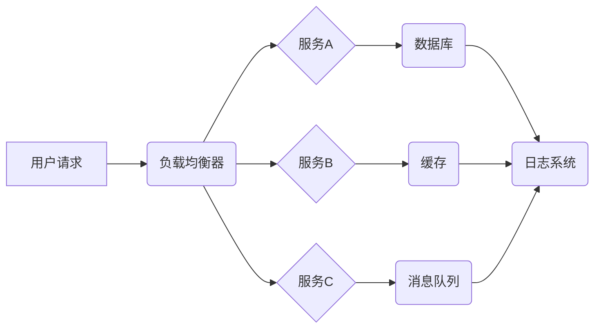

> 电商系统、高可用、稳定性、安全性、高性能、分布式系统、容错机制、负载均衡、数据安全、性能优化

## 1. 背景介绍

随着电子商务的蓬勃发展，电商平台面临着日益增长的用户流量和业务需求。为了满足用户对快速、可靠、安全的购物体验的期望，电商系统必须具备高可用性、稳定性、安全性以及高性能等关键能力。

传统的单体架构电商系统难以应对海量用户和业务场景的挑战，容易出现单点故障、性能瓶颈等问题。分布式架构的出现为电商系统提供了新的解决方案，通过将系统分解成多个独立的服务，可以提高系统的容错能力、扩展性以及性能。

然而，构建一个高可用、稳定、安全、高性能的分布式电商系统并非易事，需要在系统设计、架构、开发、部署等各个环节进行精心设计和优化。

## 2. 核心概念与联系

### 2.1 高可用性

高可用性是指系统能够在发生故障或异常情况时，能够持续提供服务，并保证服务质量。

### 2.2 稳定性

稳定性是指系统能够在正常运行状态下，持续稳定地提供服务，不会出现意外崩溃或数据丢失等问题。

### 2.3 安全性

安全性是指系统能够保护用户数据和系统资源免受恶意攻击和 unauthorized access 的威胁。

### 2.4 高性能

高性能是指系统能够高效地处理用户请求，并提供快速的响应时间和低延迟。

**电商系统架构关系图**



## 3. 核心算法原理 & 具体操作步骤

### 3.1 算法原理概述

**负载均衡算法**

负载均衡算法用于将用户请求分配到不同的服务器上，以避免单个服务器过载，提高系统的整体性能和可用性。常见的负载均衡算法包括：

* **轮询算法:** 轮流将请求分配到不同的服务器。
* **加权轮询算法:** 根据服务器的性能或负载情况，赋予不同的服务器不同的权重，然后按照权重进行请求分配。
* **最小连接数算法:** 将请求分配到连接数最少的服务器。
* **IP哈希算法:** 根据用户的IP地址将请求分配到特定的服务器。

### 3.2 算法步骤详解

**轮询算法步骤:**

1. 创建一个服务器列表。
2. 定义一个轮询索引，初始值为0。
3. 当收到用户请求时，使用轮询索引获取对应的服务器地址。
4. 将请求发送到获取到的服务器地址。
5. 轮询索引加1，循环到服务器列表的末尾后，从头开始。

### 3.3 算法优缺点

**轮询算法优点:**

* 简单易实现。
* 性能相对较好。

**轮询算法缺点:**

* 无法根据服务器负载情况进行动态调整。
* 如果服务器出现故障，请求可能会被分配到故障服务器，导致系统不可用。

### 3.4 算法应用领域

负载均衡算法广泛应用于各种分布式系统，例如电商平台、社交网络、云计算平台等。

## 4. 数学模型和公式 & 详细讲解 & 举例说明

### 4.1 数学模型构建

**系统可用性模型:**

系统可用性可以表示为以下公式:

$$
Availability = 1 - (Downtime / Total Time)
$$

其中:

* Availability: 系统可用性
* Downtime: 系统故障时间
* Total Time: 系统运行时间

### 4.2 公式推导过程

系统可用性模型的推导过程如下:

1. 假设系统运行时间为T，故障时间为D。
2. 系统可用时间为T-D。
3. 系统可用性等于可用时间与总时间之比: (T-D)/T。
4. 化简得到公式: Availability = 1 - (Downtime / Total Time)。

### 4.3 案例分析与讲解

假设一个电商系统运行时间为24小时，故障时间为1小时，则其可用性为:

$$
Availability = 1 - (1 / 24) = 0.9583
$$

这意味着该电商系统在24小时内有95.83%的时间处于可用状态。

## 5. 项目实践：代码实例和详细解释说明

### 5.1 开发环境搭建

* 操作系统: Ubuntu 20.04
* 编程语言: Python 3.8
* 框架: Flask
* 数据库: MySQL
* 缓存: Redis
* 消息队列: RabbitMQ

### 5.2 源代码详细实现

```python
from flask import Flask, request
from redis import Redis
from pika import BlockingConnection, ConnectionParameters

app = Flask(__name__)
redis_client = Redis(host='localhost', port=6379)
connection_params = ConnectionParameters('localhost', 5672)
connection = BlockingConnection(connection_params)
channel = connection.channel()

@app.route('/api/product', methods=['GET'])
def get_product():
    product_id = request.args.get('id')
    # 从缓存中获取产品信息
    product = redis_client.get(product_id)
    if product:
        return product.decode('utf-8')
    # 从数据库中获取产品信息
    # ...
    # 将产品信息缓存到Redis中
    # ...
    return product

if __name__ == '__main__':
    app.run(debug=True)
```

### 5.3 代码解读与分析

* 该代码示例展示了如何使用Flask框架构建一个简单的API接口，用于获取产品信息。
* 为了提高性能，该接口使用了Redis缓存机制，将产品信息缓存到Redis中，减少数据库访问次数。
* 当用户请求产品信息时，首先从Redis缓存中获取，如果缓存中没有，则从数据库中获取，并将获取到的产品信息缓存到Redis中。

### 5.4 运行结果展示

* 当用户访问`/api/product?id=123`时，如果产品信息存在于Redis缓存中，则会快速返回产品信息。
* 如果产品信息不存在于Redis缓存中，则会从数据库中获取产品信息，并将获取到的产品信息缓存到Redis中，然后返回产品信息。

## 6. 实际应用场景

### 6.1 电商平台商品详情页

电商平台商品详情页需要快速加载商品信息，例如商品名称、价格、图片、描述等。可以使用缓存机制将商品信息缓存到Redis中，提高页面加载速度。

### 6.2 电商平台购物车功能

电商平台购物车功能需要实时更新商品数量和总价。可以使用消息队列将购物车操作消息发送到消息队列中，例如添加商品、删除商品、修改数量等。其他服务可以订阅这些消息，并更新购物车信息。

### 6.3 电商平台订单处理

电商平台订单处理需要处理大量的订单数据，例如订单创建、订单支付、订单发货等。可以使用分布式数据库和消息队列来处理订单数据，提高订单处理效率。

### 6.4 未来应用展望

随着云计算、大数据、人工智能等技术的不断发展，电商系统将更加智能化、个性化和服务化。未来，电商系统将更加注重用户体验、数据分析和个性化推荐。

## 7. 工具和资源推荐

### 7.1 学习资源推荐

* **书籍:**
    * 《分布式系统的设计与实现》
    * 《高可用系统设计》
    * 《云计算架构设计》
* **在线课程:**
    * Coursera: Distributed Systems
    * Udemy: Building Scalable Systems
    * Alibaba Cloud Academy: Cloud Computing Fundamentals

### 7.2 开发工具推荐

* **容器化平台:** Docker, Kubernetes
* **消息队列:** RabbitMQ, Kafka
* **分布式数据库:** MySQL, MongoDB, Cassandra
* **缓存系统:** Redis, Memcached

### 7.3 相关论文推荐

* **论文:**
    * The CAP Theorem
    * Paxos Made Simple
    * Consistency and Availability Trade-offs in Distributed Systems

## 8. 总结：未来发展趋势与挑战

### 8.1 研究成果总结

本文介绍了电商系统高可用、稳定性、安全性、高性能的构建方法，并探讨了相关算法、数学模型、代码实现以及实际应用场景。

### 8.2 未来发展趋势

* **微服务架构:** 将电商系统分解成更小的独立服务，提高系统的可扩展性和容错能力。
* **Serverless 架构:** 使用无服务器计算平台，简化系统部署和管理，提高资源利用率。
* **人工智能技术:** 利用人工智能技术进行商品推荐、用户画像、欺诈检测等，提升用户体验和业务效率。

### 8.3 面临的挑战

* **数据安全:** 保护用户数据免受恶意攻击和泄露。
* **系统可靠性:** 确保系统在各种故障情况下能够持续稳定运行。
* **性能优化:** 提高系统处理能力和响应速度，满足用户对快速体验的需求。

### 8.4 研究展望

未来，电商系统将更加智能化、个性化和服务化，需要不断探索新的技术和架构，以应对不断变化的市场需求和用户期望。

## 9. 附录：常见问题与解答

### 9.1 如何提高电商系统的可用性？

* 使用冗余硬件和负载均衡器，提高系统的容错能力。
* 使用缓存机制，减少数据库访问次数。
* 定期进行系统监控和故障演练，及时发现和解决问题。

### 9.2 如何保障电商系统的安全性？

* 使用HTTPS协议加密用户数据传输。
* 使用强密码和多因素认证，保护用户账户安全。
* 定期进行安全漏洞扫描和补丁更新。

### 9.3 如何优化电商系统的性能？

* 使用分布式数据库和缓存系统，提高数据处理能力。
* 使用异步处理机制，减少阻塞操作。
* 使用代码优化和性能测试工具，提高代码效率。


作者：禅与计算机程序设计艺术 / Zen and the Art of Computer Programming 
<end_of_turn>