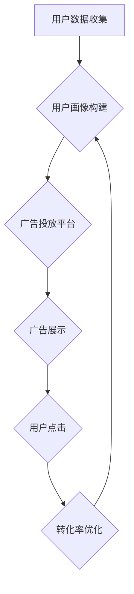

> 目标广告，电商营销，机器学习，深度学习，用户画像，推荐系统，转化率优化

## 1. 背景介绍

在当今数字经济时代，电商市场竞争日益激烈。商家需要精准地触达目标用户，提高广告投放效率，最终实现销售目标。目标广告作为一种精准营销手段，凭借其强大的数据分析能力和个性化推荐功能，在电商市场营销中扮演着越来越重要的角色。

目标广告是指根据用户画像、行为数据等信息，精准投放广告，以达到特定营销目标的广告形式。与传统的广告投放方式相比，目标广告具有以下优势：

* **精准触达：** 通过用户画像和行为数据分析，精准识别目标用户群体，避免资源浪费。
* **个性化推荐：** 根据用户的兴趣爱好、购买历史等信息，提供个性化的广告推荐，提升用户点击率和转化率。
* **成本效益高：** 精准投放广告，降低广告成本，提高广告投资回报率。

## 2. 核心概念与联系

目标广告投放的核心概念包括：

* **用户画像：** 通过收集用户数据，构建用户画像，包括用户基本信息、兴趣爱好、购买行为等。
* **广告投放平台：** 提供广告投放服务的平台，例如 Google Ads、Facebook Ads 等。
* **机器学习算法：** 用于分析用户数据，预测用户行为，优化广告投放策略。
* **转化率优化：** 通过不断调整广告投放策略，提高用户转化率，最终实现营销目标。

目标广告投放的流程可以概括为以下步骤：



## 3. 核心算法原理 & 具体操作步骤

### 3.1  算法原理概述

目标广告投放的核心算法主要包括：

* **协同过滤算法：** 基于用户行为数据，推荐与用户兴趣相似的商品或广告。
* **深度学习算法：** 利用深度神经网络，从海量用户数据中学习用户特征，进行精准用户画像构建和广告推荐。
* **梯度下降算法：** 用于优化广告投放策略，降低广告成本，提高转化率。

### 3.2  算法步骤详解

**协同过滤算法：**

1. 收集用户行为数据，例如用户对商品的评分、购买记录等。
2. 计算用户之间的相似度，例如基于物品相似度或基于用户相似度。
3. 根据用户相似度，推荐与相似用户喜欢的商品或广告。

**深度学习算法：**

1. 构建深度神经网络模型，例如卷积神经网络（CNN）或循环神经网络（RNN）。
2. 将用户数据作为输入，训练深度神经网络模型，学习用户特征。
3. 根据训练好的模型，预测用户对广告的点击率或转化率。

**梯度下降算法：**

1. 定义目标函数，例如广告成本或转化率。
2. 使用梯度下降算法，不断调整广告投放参数，例如广告预算、目标用户群体等。
3. 寻找使目标函数最小化的参数组合，优化广告投放策略。

### 3.3  算法优缺点

**协同过滤算法：**

* **优点：** 简单易实现，效果较好。
* **缺点：** 数据稀疏性问题，新用户冷启动问题。

**深度学习算法：**

* **优点：** 能够学习更复杂的特征，效果更优。
* **缺点：** 需要大量数据训练，计算资源消耗大。

**梯度下降算法：**

* **优点：** 能够有效地优化目标函数，找到最优解。
* **缺点：** 容易陷入局部最优解，需要谨慎选择初始参数。

### 3.4  算法应用领域

目标广告投放算法广泛应用于电商市场营销、社交媒体广告、搜索引擎广告等领域。

## 4. 数学模型和公式 & 详细讲解 & 举例说明

### 4.1  数学模型构建

目标广告投放的数学模型可以概括为以下公式：

$$
CTR = f(User, Ad, Context)
$$

其中：

* CTR：点击率
* User：用户特征
* Ad：广告特征
* Context：上下文特征

### 4.2  公式推导过程

点击率CTR是衡量广告效果的重要指标，其值通常在0到1之间。

$$
CTR = \frac{ClickCount}{ImpressionCount}
$$

其中：

* ClickCount：用户点击广告的次数
* ImpressionCount：广告展示的次数

### 4.3  案例分析与讲解

假设我们有一个电商平台，想要推广一款新发布的手机。我们可以通过收集用户数据，构建用户画像，例如用户年龄、性别、兴趣爱好、购买历史等。

然后，我们可以根据用户画像，选择合适的广告投放平台和广告创意。例如，我们可以选择在年轻人喜欢的社交媒体平台投放广告，并使用与手机相关的图片和文字进行广告创意设计。

通过不断调整广告投放策略，例如广告预算、目标用户群体等，我们可以优化广告效果，提高点击率和转化率。

## 5. 项目实践：代码实例和详细解释说明

### 5.1  开发环境搭建

目标广告投放项目可以使用Python语言进行开发。

需要安装以下软件包：

* TensorFlow
* PyTorch
* Scikit-learn
* Pandas
* NumPy

### 5.2  源代码详细实现

以下是一个简单的目标广告投放代码示例，使用协同过滤算法进行商品推荐：

```python
import pandas as pd
from sklearn.metrics.pairwise import cosine_similarity

# 加载用户行为数据
data = pd.read_csv('user_behavior.csv')

# 计算用户之间的相似度
user_similarity = cosine_similarity(data.pivot_table(index='user_id', columns='product_id', values='rating').fillna(0))

# 获取用户ID
user_id = 1

# 获取与用户相似度最高的N个用户
similar_users = user_similarity[user_id].argsort()[:-6:-1]

# 获取相似用户喜欢的商品
recommended_products = data[data['user_id'].isin(similar_users)].groupby('product_id').mean().sort_values('rating', ascending=False)

# 打印推荐商品
print(recommended_products)
```

### 5.3  代码解读与分析

该代码首先加载用户行为数据，然后使用协同过滤算法计算用户之间的相似度。

接着，根据用户ID获取与用户相似度最高的N个用户，并获取相似用户喜欢的商品。

最后，打印推荐商品。

### 5.4  运行结果展示

运行该代码后，会输出一个包含推荐商品的DataFrame。

## 6. 实际应用场景

目标广告投放在电商市场营销中应用广泛，例如：

* **商品推荐：** 根据用户的浏览历史、购买记录等信息，推荐与用户兴趣相似的商品。
* **广告投放：** 根据用户的兴趣爱好、购买行为等信息，精准投放与用户相关的广告。
* **用户画像构建：** 通过收集用户数据，构建用户画像，了解用户的需求和偏好。
* **转化率优化：** 通过分析用户行为数据，优化广告投放策略，提高用户转化率。

### 6.4  未来应用展望

目标广告投放技术未来将朝着以下方向发展：

* **更精准的用户画像：** 利用人工智能技术，构建更精准的用户画像，更好地理解用户的需求和偏好。
* **更个性化的广告推荐：** 利用深度学习算法，提供更个性化的广告推荐，提升用户体验。
* **更有效的转化率优化：** 利用机器学习算法，优化广告投放策略，提高用户转化率。
* **跨平台广告投放：** 实现跨平台的广告投放，提供更全面的用户体验。

## 7. 工具和资源推荐

### 7.1  学习资源推荐

* **书籍：**
    * 《深度学习》
    * 《机器学习实战》
    * 《广告投放优化》
* **在线课程：**
    * Coursera
    * edX
    * Udacity

### 7.2  开发工具推荐

* **Python：** 
* **TensorFlow：** 深度学习框架
* **PyTorch：** 深度学习框架
* **Scikit-learn：** 机器学习库
* **Pandas：** 数据分析库
* **NumPy：** 数值计算库

### 7.3  相关论文推荐

* **目标广告投放的深度学习方法**
* **基于协同过滤的商品推荐算法**
* **广告投放优化算法研究**

## 8. 总结：未来发展趋势与挑战

### 8.1  研究成果总结

目标广告投放技术在电商市场营销中取得了显著的成果，提高了广告投放效率，提升了用户体验。

### 8.2  未来发展趋势

目标广告投放技术未来将朝着更精准、更个性化、更有效的方向发展。

### 8.3  面临的挑战

目标广告投放技术也面临着一些挑战，例如：

* **数据隐私保护：** 如何保护用户数据隐私，是目标广告投放技术面临的重要挑战。
* **算法公平性：** 目标广告投放算法需要保证公平性，避免歧视或偏见。
* **用户体验：** 目标广告投放需要注重用户体验，避免过度广告轰炸。

### 8.4  研究展望

未来，目标广告投放技术将继续发展，并与其他技术融合，例如：

* **人工智能：** 利用人工智能技术，构建更精准的用户画像，提供更个性化的广告推荐。
* **大数据：** 利用大数据技术，分析海量用户数据，发现更深层的用户需求。
* **物联网：** 利用物联网技术，收集更多用户行为数据，提供更精准的广告投放。

## 9. 附录：常见问题与解答

### 9.1  常见问题

* **目标广告投放的成本如何？**

目标广告投放的成本取决于多种因素，例如广告平台、广告创意、目标用户群体等。

* **目标广告投放的效果如何？**

目标广告投放的效果取决于多种因素，例如广告创意、目标用户群体、广告投放策略等。

* **如何评估目标广告投放的效果？**

可以通过点击率、转化率、成本效益等指标评估目标广告投放的效果。

### 9.2  解答

* 目标广告投放的成本可以根据实际情况进行调整，例如可以设置每日预算、每次点击付费等。
* 目标广告投放的效果可以通过不断优化广告投放策略来提高。
* 目标广告投放的效果可以通过多种指标进行评估，例如点击率、转化率、成本效益等。

作者：禅与计算机程序设计艺术 / Zen and the Art of Computer Programming


<end_of_turn>