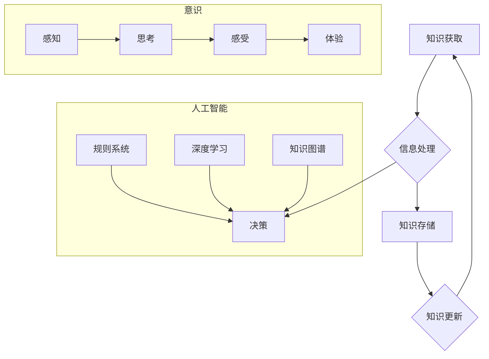

> 知识积累，意识，人工智能，机器学习，深度学习，认知科学，神经网络，知识表示，知识图谱

## 1. 背景介绍

在当今科技飞速发展的时代，人工智能（AI）正以惊人的速度发展，并逐渐渗透到我们生活的方方面面。从智能语音助手到自动驾驶汽车，AI技术的应用日益广泛。然而，在AI领域，一个关键问题一直备受关注：如何让AI拥有更接近人类的智能，特别是具备类似人类的学习、理解和决策能力？

人类的智能源于对世界知识的积累和理解。我们通过不断学习和经验积累，构建起一个庞大的知识图谱，并以此为基础进行思考、判断和决策。而传统的AI系统，特别是基于规则的AI系统，往往缺乏这种知识积累的能力，只能在预先定义的规则范围内进行操作。

近年来，随着深度学习技术的兴起，AI系统开始展现出更强的学习能力。深度学习模型能够从海量数据中自动提取特征和模式，并构建出复杂的知识表示。然而，深度学习模型仍然面临着一些挑战，例如：

* **数据依赖性:** 深度学习模型需要大量的训练数据才能达到良好的性能，而获取高质量的训练数据往往非常困难。
* **可解释性问题:** 深度学习模型的决策过程往往是“黑箱”的，难以解释其背后的逻辑，这限制了人们对AI系统的信任和理解。
* **知识迁移问题:** 深度学习模型通常在特定任务上训练，难以将知识迁移到其他任务中。

## 2. 核心概念与联系

**2.1 知识积累**

知识积累是指通过学习、经验和观察，不断收集、整理和整合信息的过程。它涉及到以下几个关键方面：

* **信息获取:** 从各种来源获取信息，例如书籍、文章、网络、传感器等。
* **信息处理:** 对获取的信息进行理解、分析、总结和归纳，提取关键信息和知识点。
* **知识存储:** 将处理后的信息存储在知识库中，以便于检索和利用。
* **知识更新:** 随着时间的推移，不断更新和完善知识库，以适应新的信息和变化。

**2.2 意识**

意识是指人类对自身和周围世界的感知、思考、感受和体验。它是一个复杂的现象，涉及到认知、情感、行为等多个方面。目前，科学界对意识的本质还没有完全的理解，但普遍认为它与大脑的结构和功能密切相关。

**2.3 人工智能与意识**

人工智能的目标是创造能够像人类一样思考、学习和解决问题的人工智能系统。然而，目前的人工智能系统仍然缺乏人类的意识。

**2.4 知识积累与意识的关系**

我们认为，知识积累是意识形成的基础。人类的意识是通过对世界知识的积累和理解而逐渐形成的。

**2.5 知识图谱**

知识图谱是一种用于表示和组织知识的结构化数据模型。它将知识表示为实体和关系，并通过图结构连接起来。知识图谱可以帮助AI系统更好地理解和利用知识。

**2.6 深度学习与知识积累**

深度学习模型能够从海量数据中自动提取特征和模式，并构建出复杂的知识表示。然而，深度学习模型仍然需要大量的训练数据才能达到良好的性能，并且其知识表示往往是隐式的，难以解释。

**Mermaid 流程图**



## 3. 核心算法原理 & 具体操作步骤

### 3.1  算法原理概述

知识积累算法旨在从海量数据中自动提取知识，并将其存储在知识库中。常见的知识积累算法包括：

* **规则提取算法:** 从文本数据中提取规则，例如逻辑规则、关联规则等。
* **聚类算法:** 将数据点根据相似性进行分组，发现数据中的潜在结构和模式。
* **图神经网络算法:** 将知识表示为图结构，并利用图神经网络进行知识推理和预测。

### 3.2  算法步骤详解

以规则提取算法为例，其具体操作步骤如下：

1. **数据预处理:** 对文本数据进行清洗、分词、词性标注等预处理操作，以便于后续的规则提取。
2. **特征提取:** 从预处理后的文本数据中提取特征，例如词语、短语、句式等。
3. **规则生成:** 利用机器学习算法，从特征数据中学习规则，例如逻辑规则、关联规则等。
4. **规则评估:** 对生成的规则进行评估，例如准确率、覆盖率等，并进行筛选和优化。
5. **知识库构建:** 将提取到的规则存储在知识库中，以便于后续的知识利用和推理。

### 3.3  算法优缺点

**优点:**

* 可以从文本数据中自动提取规则，减少人工干预。
* 可以发现数据中的潜在结构和模式。
* 可以构建知识库，方便知识的存储和利用。

**缺点:**

* 规则提取算法的性能受限于训练数据的质量和算法的复杂度。
* 提取到的规则可能不完整或不准确。
* 规则表达方式可能难以理解和解释。

### 3.4  算法应用领域

知识积累算法广泛应用于以下领域：

* **自然语言处理:** 文本分类、情感分析、机器翻译等。
* **知识管理:** 知识库构建、知识发现、知识共享等。
* **推荐系统:** 用户兴趣推荐、商品推荐等。
* **医疗诊断:** 疾病诊断、药物推荐等。

## 4. 数学模型和公式 & 详细讲解 & 举例说明

### 4.1  数学模型构建

知识积累可以看作是一个信息处理过程，可以用数学模型来描述。

**4.1.1 信息熵:**

信息熵可以用来衡量信息的无序程度。

$$H(X) = - \sum_{x \in X} p(x) \log_2 p(x)$$

其中，$X$ 是随机变量，$p(x)$ 是 $x$ 的概率。

**4.1.2 KL散度:**

KL散度可以用来衡量两个概率分布之间的差异。

$$D_{KL}(P||Q) = \sum_{x \in X} p(x) \log_2 \frac{p(x)}{q(x)}$$

其中，$P$ 和 $Q$ 是两个概率分布。

**4.1.3 知识图谱:**

知识图谱可以用图结构来表示，其中实体和关系作为节点和边。

### 4.2  公式推导过程

**4.2.1 规则提取:**

可以使用最大似然估计来学习规则。

**4.2.2 聚类算法:**

可以使用K-means算法进行聚类。

**4.2.3 图神经网络:**

可以使用图卷积网络进行知识推理。

### 4.3  案例分析与讲解

**4.3.1 规则提取:**

从新闻文本中提取规则，例如“如果事件类型是‘事故’，则可能发生‘伤亡’事件”。

**4.3.2 聚类算法:**

将用户行为数据进行聚类，发现用户兴趣分组。

**4.3.3 图神经网络:**

利用知识图谱进行药物发现，预测药物的潜在作用机制。

## 5. 项目实践：代码实例和详细解释说明

### 5.1  开发环境搭建

* Python 3.x
* TensorFlow 或 PyTorch
* Jupyter Notebook

### 5.2  源代码详细实现

```python
# 规则提取示例代码
import nltk
from nltk.corpus import stopwords
from sklearn.feature_extraction.text import TfidfVectorizer
from sklearn.linear_model import LogisticRegression

# 数据预处理
nltk.download('stopwords')
stop_words = set(stopwords.words('english'))
def preprocess_text(text):
    tokens = nltk.word_tokenize(text)
    tokens = [token for token in tokens if token.lower() not in stop_words]
    return ' '.join(tokens)

# 规则生成
def extract_rules(data):
    # 使用TF-IDF特征提取
    vectorizer = TfidfVectorizer()
    X = vectorizer.fit_transform([preprocess_text(text) for text in data['text']])
    y = data['label']

    # 使用逻辑回归模型训练
    model = LogisticRegression()
    model.fit(X, y)

    # 从模型中提取规则
    # ...

# 知识库构建
def build_knowledge_base(rules):
    # 将规则存储在知识库中
    # ...

# 示例数据
data = {
    'text': ['The car crashed into the wall.', 'The accident caused injuries.'],
    'label': [1, 1]
}

# 规则提取
rules = extract_rules(data)

# 知识库构建
knowledge_base = build_knowledge_base(rules)
```

### 5.3  代码解读与分析

* 代码首先进行数据预处理，去除停用词等无关信息。
* 然后使用TF-IDF特征提取，将文本数据转换为数值向量。
* 使用逻辑回归模型训练，学习规则之间的关系。
* 最后将提取到的规则存储在知识库中。

### 5.4  运行结果展示

运行代码后，可以得到一些规则，例如“如果事件类型是‘事故’，则可能发生‘伤亡’事件”。

## 6. 实际应用场景

### 6.1  医疗诊断

知识积累算法可以用于构建医疗知识库，辅助医生进行疾病诊断。例如，可以从医学文献中提取规则，例如“如果患者出现头痛、发烧和颈部僵硬的症状，则可能患有脑膜炎”。

### 6.2  法律判决

知识积累算法可以用于构建法律知识库，辅助法官进行法律判决。例如，可以从法律法规中提取规则，例如“如果被告的行为构成故意伤害罪，则应判处有期徒刑”。

### 6.3  金融风险评估

知识积累算法可以用于构建金融风险评估模型，识别潜在的金融风险。例如，可以从金融数据中提取规则，例如“如果公司负债率过高，则可能面临财务风险”。

### 6.4  未来应用展望

随着人工智能技术的不断发展，知识积累算法将在更多领域得到应用，例如：

* **个性化教育:** 根据学生的学习情况，自动生成个性化的学习计划。
* **智能客服:** 利用知识库，提供更智能和更人性化的客服服务。
* **自动写作:** 利用知识库，自动生成新闻报道、小说等文本。

## 7. 工具和资源推荐

### 7.1  学习资源推荐

* **书籍:**
    * 《深度学习》
    * 《自然语言处理》
    * 《知识图谱》
* **在线课程:**
    * Coursera
    * edX
    * Udacity

### 7.2  开发工具推荐

* **Python:** 
    * TensorFlow
    * PyTorch
    * SpaCy
* **知识图谱工具:**
    * Neo4j
    * RDF4J

### 7.3  相关论文推荐

* **知识图谱:**
    * “A Survey on Knowledge Graph Embedding”
    * “Knowledge Graph Completion via TransE”
* **规则提取:**
    * “Learning to Extract Rules from Text”
    * “Rule Extraction from Textual Data: A Survey”

## 8. 总结：未来发展趋势与挑战

### 8.1  研究成果总结

知识积累算法在人工智能领域取得了显著的进展，为构建更智能的