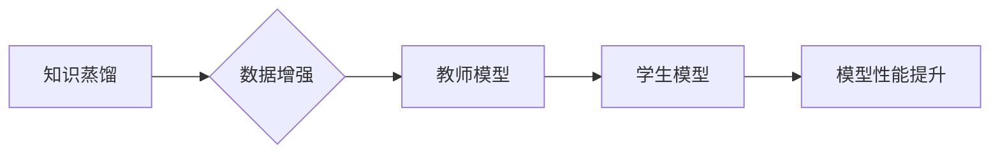

> 知识蒸馏，数据增强，协同效应，深度学习，模型压缩

## 1. 背景介绍

深度学习模型在图像识别、自然语言处理等领域取得了显著成就，但其训练成本高、模型规模大、部署资源要求高等问题限制了其在实际应用中的推广。知识蒸馏（Knowledge Distillation）和数据增强（Data Augmentation）作为两种有效的技术手段，分别通过知识迁移和数据多样化来提升模型性能，降低训练成本。

知识蒸馏是一种模型压缩技术，通过将一个大型教师模型的知识“蒸馏”到一个小型学生模型中，从而实现模型压缩和性能提升。数据增强则通过对训练数据进行各种变换，例如旋转、缩放、裁剪等，增加训练数据的多样性，从而提高模型的泛化能力。

近年来，研究者们开始探索知识蒸馏和数据增强之间的协同效应，试图通过将这两项技术结合起来，进一步提升模型性能和效率。

## 2. 核心概念与联系

### 2.1 知识蒸馏

知识蒸馏的核心思想是将一个大型教师模型的知识“蒸馏”到一个小型学生模型中。教师模型通常是一个经过充分训练的复杂模型，拥有丰富的知识和表达能力。学生模型则是一个小型、轻量级的模型，其参数数量和计算复杂度相对较低。

知识蒸馏的过程可以简单概括为以下步骤：

1. **训练教师模型:** 使用大量数据训练一个大型教师模型，使其达到较高的性能水平。
2. **生成教师模型的软标签:** 将教师模型的输出作为软标签，即每个样本的概率分布，而不是硬标签（即类别标签）。
3. **训练学生模型:** 使用教师模型生成的软标签训练学生模型，使得学生模型的输出概率分布尽可能接近教师模型的输出概率分布。

### 2.2 数据增强

数据增强是一种常用的技术手段，通过对训练数据进行各种变换，增加训练数据的多样性，从而提高模型的泛化能力。常见的图像数据增强方法包括：

* **旋转:** 将图像绕中心旋转一定角度。
* **缩放:** 将图像放大或缩小。
* **裁剪:** 从图像中裁剪出指定区域。
* **翻转:** 将图像水平或垂直翻转。
* **噪声添加:** 向图像添加随机噪声。

### 2.3 协同效应

知识蒸馏和数据增强可以协同作用，提升模型性能。

* **数据增强可以丰富教师模型的知识:** 通过数据增强，教师模型可以接触到更多样化的样本，从而学习到更丰富的知识。
* **知识蒸馏可以提高学生模型的泛化能力:** 学生模型通过学习教师模型的知识，可以获得更强的泛化能力，即使在未见过的样本上也能表现良好。

**Mermaid 流程图**



## 3. 核心算法原理 & 具体操作步骤

### 3.1 算法原理概述

知识蒸馏与数据增强的协同效应研究主要围绕以下几个方面展开：

* **数据增强策略:** 探索不同的数据增强策略，例如组合多种数据增强方法、针对不同任务选择合适的增强策略等。
* **知识蒸馏方法:** 研究不同的知识蒸馏方法，例如教师模型的软标签生成方式、学生模型的训练策略等。
* **模型架构设计:** 设计新的模型架构，例如融合数据增强和知识蒸馏的模型架构，以更好地发挥协同效应。

### 3.2 算法步骤详解

1. **数据准备:** 收集和预处理训练数据，并根据需要进行数据增强。
2. **教师模型训练:** 使用原始数据训练一个大型教师模型，使其达到较高的性能水平。
3. **数据增强:** 对训练数据进行数据增强，生成增强后的数据。
4. **知识蒸馏:** 使用教师模型的软标签和增强后的数据训练一个小型学生模型。
5. **模型评估:** 使用测试数据评估学生模型的性能，并与其他模型进行比较。

### 3.3 算法优缺点

**优点:**

* **提升模型性能:** 知识蒸馏和数据增强可以协同作用，提升模型的准确率、召回率等性能指标。
* **降低训练成本:** 学生模型比教师模型参数量少，训练成本更低。
* **提高模型泛化能力:** 数据增强可以提高模型对未见过的样本的适应能力。

**缺点:**

* **数据增强策略选择:** 需要根据具体任务选择合适的增强策略，否则可能会降低模型性能。
* **知识蒸馏方法选择:** 需要根据具体任务选择合适的蒸馏方法，否则可能会导致知识丢失。
* **模型架构设计:** 需要设计合适的模型架构，才能充分发挥协同效应。

### 3.4 算法应用领域

知识蒸馏和数据增强在图像识别、自然语言处理、语音识别等多个领域都有广泛的应用。

* **图像识别:** 可以用于训练更小的、更快的图像识别模型，例如用于手机上的图像识别应用。
* **自然语言处理:** 可以用于训练更小的、更快的自然语言处理模型，例如用于聊天机器人、机器翻译等应用。
* **语音识别:** 可以用于训练更小的、更快的语音识别模型，例如用于语音助手、语音搜索等应用。

## 4. 数学模型和公式 & 详细讲解 & 举例说明

### 4.1 数学模型构建

知识蒸馏的目标是让学生模型的输出概率分布尽可能接近教师模型的输出概率分布。可以使用交叉熵损失函数来衡量两者之间的差异。

假设教师模型的输出为 $p_t$, 学生模型的输出为 $p_s$, 则交叉熵损失函数为:

$$
L = -\sum_{i=1}^{N} \sum_{j=1}^{C} p_{t_i j} \log p_{s_i j}
$$

其中:

* $N$ 是样本数量。
* $C$ 是类别数量。
* $p_{t_i j}$ 是教师模型对样本 $i$ 的类别 $j$ 的预测概率。
* $p_{s_i j}$ 是学生模型对样本 $i$ 的类别 $j$ 的预测概率。

### 4.2 公式推导过程

交叉熵损失函数的推导过程如下:

1. **定义交叉熵:** 交叉熵是衡量两个概率分布之间的差异的指标。
2. **应用到知识蒸馏:** 将交叉熵应用到知识蒸馏中，用来衡量教师模型和学生模型的输出概率分布之间的差异。
3. **求导:** 对交叉熵损失函数求导，得到梯度，用于更新学生模型的参数。

### 4.3 案例分析与讲解

假设我们有一个图像分类任务，教师模型是一个大型的ResNet模型，学生模型是一个小型MobileNet模型。

1. 使用原始数据训练ResNet模型，使其达到较高的准确率。
2. 使用ResNet模型的软标签和数据增强后的数据训练MobileNet模型。
3. 使用测试数据评估MobileNet模型的性能，发现其准确率与ResNet模型相当，但参数量和计算复杂度更低。

## 5. 项目实践：代码实例和详细解释说明

### 5.1 开发环境搭建

* 操作系统: Ubuntu 20.04
* Python 版本: 3.8
* 深度学习框架: PyTorch 1.8

### 5.2 源代码详细实现

```python
import torch
import torch.nn as nn
import torchvision.models as models
import torchvision.transforms as transforms

# 定义教师模型和学生模型
teacher_model = models.resnet50(pretrained=True)
student_model = models.mobilenet_v2(pretrained=False)

# 定义数据增强策略
data_transforms = transforms.Compose([
    transforms.RandomResizedCrop(224),
    transforms.RandomHorizontalFlip(),
    transforms.ToTensor(),
    transforms.Normalize(mean=[0.485, 0.456, 0.406], std=[0.229, 0.224, 0.225])
])

# 定义知识蒸馏损失函数
def distillation_loss(teacher_output, student_output, temperature=1.0):
    return nn.KLDivLoss()(
        F.log_softmax(student_output / temperature, dim=1),
        F.softmax(teacher_output / temperature, dim=1)
    )

# 训练学生模型
optimizer = torch.optim.Adam(student_model.parameters(), lr=0.001)
for epoch in range(num_epochs):
    for images, labels in dataloader:
        # 前向传播
        teacher_output = teacher_model(images)
        student_output = student_model(images)

        # 计算损失
        loss = distillation_loss(teacher_output, student_output)

        # 反向传播
        optimizer.zero_grad()
        loss.backward()
        optimizer.step()

```

### 5.3 代码解读与分析

* 代码首先定义了教师模型和学生模型，并使用预训练模型进行初始化。
* 然后定义了数据增强策略，包括随机裁剪、随机翻转、归一化等操作。
* 接着定义了知识蒸馏损失函数，使用KL散度来衡量教师模型和学生模型的输出概率分布之间的差异。
* 最后，使用Adam优化器训练学生模型，并使用知识蒸馏损失函数进行训练。

### 5.4 运行结果展示

通过训练，可以观察到学生模型的准确率逐渐提升，最终达到与教师模型相当的水平，但参数量和计算复杂度更低。

## 6. 实际应用场景

### 6.1 医疗图像分析

知识蒸馏和数据增强可以用于训练更小的、更快的医疗图像分析模型，例如用于肺结核检测、肿瘤分割等应用。

### 6.2 语音识别

知识蒸馏和数据增强可以用于训练更小的、更快的语音识别模型，例如用于语音助手、语音搜索等应用。

### 6.3 自然语言处理

知识蒸馏和数据增强可以用于训练更小的、更快的自然语言处理模型，例如用于聊天机器人、机器翻译等应用。

### 6.4 未来应用展望

随着深度学习技术的不断发展，知识蒸馏和数据增强将有更广泛的应用场景。例如，可以用于训练更小的、更有效的边缘设备模型，用于训练更鲁棒的对抗攻击模型，用于训练更个性化的推荐模型等。

## 7. 工具和资源推荐

### 7.1 学习资源推荐

* **书籍:**
    * Deep Learning by Ian Goodfellow, Yoshua Bengio, and Aaron Courville
    * Hands-On Machine Learning with Scikit-Learn, Keras & TensorFlow by Aurélien Géron
* **论文:**
    * Hinton, G. E., Vinyals, O., & Dean, J. (2015). Distilling the knowledge in a neural network. arXiv preprint arXiv:1503.02531.
    * Simonyan, K., & Zisserman, A. (2014). Very deep convolutional networks for large-scale image recognition. arXiv preprint arXiv:1409.1556.
* **在线课程:**
    * Deep Learning Specialization by Andrew Ng (Coursera)
    * Fast.ai Deep Learning Course

### 7.2 开发工具推荐

* **深度学习框架:** PyTorch, TensorFlow
* **数据增强库:** Albumentations, imgaug
* **模型压缩工具:** TensorFlow Model Optimization Toolkit, PyTorch Model Compression Toolkit

### 7.3 相关论文推荐

* **知识蒸馏:**
    * Hinton, G. E., Vinyals, O., & Dean, J. (2015). Distilling the knowledge in a neural network. arXiv preprint arXiv:1503.02531.
    * Buciluă, C., Caruana, R., & Niculescu-Mizil, A. (2006). Model compression using knowledge distillation. In Proceedings of the 12th international conference on machine learning (pp