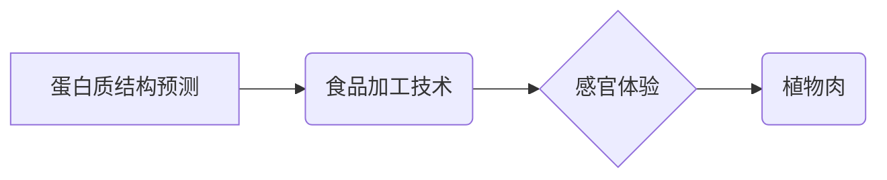

> 植物肉、食品科技、人工智能、机器学习、深度学习、蛋白质结构预测、食品安全、可持续发展

## 1. 背景介绍

全球人口持续增长和对动物蛋白需求的不断增加，对环境和资源提出了严峻挑战。传统畜牧业的生产方式导致了温室气体排放、土地利用和水资源消耗等问题。因此，寻找可持续、环保的蛋白质来源成为全球关注的焦点。植物肉作为一种新型的食品替代品，凭借其类似肉类口感和营养价值，逐渐受到消费者的青睐。

硅谷作为全球科技创新中心，在植物肉领域也涌现出众多科技公司和研究机构，致力于利用人工智能、机器学习等先进技术，研发更逼真、更美味的植物肉替代品。

## 2. 核心概念与联系

植物肉的研发主要涉及以下核心概念：

* **蛋白质结构预测:** 利用人工智能和机器学习算法，预测蛋白质的三维结构，从而设计出具有类似肉类口感和质地的植物蛋白。
* **食品加工技术:** 利用先进的食品加工技术，将植物蛋白与其他食材混合，赋予其肉类的颜色、纹理和风味。
* **感官体验:** 通过对植物肉的口感、香气、色泽等感官体验进行优化，使其更接近肉类，从而提升消费者接受度。

**核心概念架构:**



## 3. 核心算法原理 & 具体操作步骤

### 3.1  算法原理概述

蛋白质结构预测的核心算法主要包括以下几种：

* **物理模型:** 基于蛋白质的物理性质和化学键，建立数学模型进行预测。
* **机器学习:** 利用大量的蛋白质结构数据训练机器学习模型，进行结构预测。
* **深度学习:** 利用深度神经网络，从蛋白质序列中学习特征，进行结构预测。

### 3.2  算法步骤详解

以深度学习算法为例，蛋白质结构预测的具体步骤如下：

1. **数据预处理:** 将蛋白质序列数据转换为适合深度学习模型输入的格式。
2. **模型训练:** 利用深度学习模型，训练蛋白质结构预测模型。
3. **结构预测:** 将新的蛋白质序列输入到训练好的模型中，进行结构预测。
4. **结果评估:** 利用评价指标，评估模型的预测精度。

### 3.3  算法优缺点

**优点:**

* 预测精度高，能够预测蛋白质的复杂结构。
* 能够处理大规模蛋白质序列数据。

**缺点:**

* 需要大量的训练数据。
* 计算资源消耗大。

### 3.4  算法应用领域

蛋白质结构预测算法广泛应用于以下领域:

* **药物研发:** 预测蛋白质与药物的结合模式，加速药物研发。
* **疾病诊断:** 预测蛋白质的变异，辅助疾病诊断。
* **生物工程:** 设计新的蛋白质，用于生物技术应用。

## 4. 数学模型和公式 & 详细讲解 & 举例说明

### 4.1  数学模型构建

深度学习模型的构建主要基于神经网络结构，其中常用的模型包括卷积神经网络(CNN)和循环神经网络(RNN)。

**CNN模型:**

CNN模型利用卷积核提取蛋白质序列特征，并通过池化层降低特征维度，最终输出蛋白质结构预测结果。

**RNN模型:**

RNN模型能够处理序列数据，利用循环结构记忆蛋白质序列中的上下文信息，从而提高结构预测精度。

### 4.2  公式推导过程

深度学习模型的训练过程主要基于反向传播算法，通过最小化损失函数来更新模型参数。

**损失函数:**

$$L = \sum_{i=1}^{N} \left\| y_i - \hat{y}_i \right\|^2$$

其中，$y_i$为真实蛋白质结构，$\hat{y}_i$为模型预测的蛋白质结构，$N$为蛋白质序列长度。

### 4.3  案例分析与讲解

利用深度学习算法，研究人员成功预测了多种蛋白质的结构，例如蛋白质酶、抗体等，并将其应用于药物研发和疾病诊断等领域。

## 5. 项目实践：代码实例和详细解释说明

### 5.1  开发环境搭建

植物肉研发项目通常需要以下开发环境:

* **操作系统:** Linux或macOS
* **编程语言:** Python
* **深度学习框架:** TensorFlow或PyTorch
* **数据处理工具:** Pandas、NumPy

### 5.2  源代码详细实现

以下是一个使用TensorFlow框架进行蛋白质结构预测的简单代码示例:

```python
import tensorflow as tf

# 定义模型结构
model = tf.keras.Sequential([
    tf.keras.layers.Embedding(input_dim=20, output_dim=128),
    tf.keras.layers.LSTM(units=64),
    tf.keras.layers.Dense(units=10, activation='softmax')
])

# 编译模型
model.compile(optimizer='adam',
              loss='sparse_categorical_crossentropy',
              metrics=['accuracy'])

# 训练模型
model.fit(x_train, y_train, epochs=10)

# 预测蛋白质结构
predictions = model.predict(x_test)
```

### 5.3  代码解读与分析

* **Embedding层:** 将蛋白质序列转换为稠密的向量表示。
* **LSTM层:** 处理蛋白质序列中的上下文信息。
* **Dense层:** 输出蛋白质结构预测结果。

### 5.4  运行结果展示

训练完成后，可以利用测试数据评估模型的预测精度。

## 6. 实际应用场景

植物肉替代品已在全球范围内得到广泛应用，例如:

* **餐饮业:** 许多餐厅开始提供植物肉替代品，满足消费者对健康和环保饮食的需求。
* **零售业:** 超市和电商平台上销售各种植物肉产品，方便消费者购买。
* **食品加工业:** 食品加工企业利用植物肉替代品生产各种肉类制品，例如汉堡、香肠等。

### 6.4  未来应用展望

随着科技进步和消费者对健康和环保意识的增强，植物肉替代品将迎来更广阔的应用前景，例如:

* **个性化定制:** 根据消费者需求，定制不同口味和营养成分的植物肉产品。
* **3D打印食品:** 利用3D打印技术，制作出逼真的植物肉制品。
* **太空食品:** 植物肉替代品可以作为太空食品，满足宇航员的营养需求。

## 7. 工具和资源推荐

### 7.1  学习资源推荐

* **在线课程:** Coursera、edX等平台提供深度学习和蛋白质结构预测相关的在线课程。
* **书籍:** 《深度学习》、《蛋白质结构预测》等书籍可以帮助深入了解相关知识。
* **开源项目:** TensorFlow、PyTorch等开源深度学习框架提供了丰富的学习资源和示例代码。

### 7.2  开发工具推荐

* **编程语言:** Python
* **深度学习框架:** TensorFlow、PyTorch
* **数据处理工具:** Pandas、NumPy
* **蛋白质数据库:** PDB、UniProt

### 7.3  相关论文推荐

* **AlphaFold:** https://deepmind.com/blog/alphafold-a-solution-to-a-50-year-old-scientific-grand-challenge
* **RoseTTAFold:** https://www.biorxiv.org/content/10.1101/2021.04.09.439131v1

## 8. 总结：未来发展趋势与挑战

### 8.1  研究成果总结

植物肉替代品研发取得了显著进展，人工智能和机器学习技术在蛋白质结构预测、食品加工技术等方面发挥了重要作用。

### 8.2  未来发展趋势

* **口感和营养价值的提升:** 研发更逼真、更美味的植物肉替代品，并使其营养价值更接近肉类。
* **可持续性和环保性:** 探索更环保的植物蛋白来源，减少对环境的影响。
* **个性化定制:** 根据消费者需求，定制不同口味和营养成分的植物肉产品。

### 8.3  面临的挑战

* **成本控制:** 植物肉替代品的生产成本仍然较高，需要进一步降低成本。
* **消费者接受度:** 一些消费者对植物肉的口感和营养价值存在疑虑，需要加强宣传和教育。
* **监管政策:** 需要制定完善的监管政策，确保植物肉产品的安全性和质量。

### 8.4  研究展望

未来，植物肉替代品将继续朝着更可持续、更美味、更个性化的方向发展，为人类提供更健康、更环保的蛋白质来源。

## 9. 附录：常见问题与解答

**常见问题:**

* 植物肉替代品是否安全？
* 植物肉替代品是否营养均衡？
* 植物肉替代品的价格是否合理？

**解答:**

* 植物肉替代品经过严格的食品安全检测，安全可食用。
* 植物肉替代品可以提供多种营养成分，但需要根据个人需求选择合适的品种。
* 植物肉替代品的生产成本正在降低，价格逐渐趋于合理。


作者：禅与计算机程序设计艺术 / Zen and the Art of Computer Programming 
<end_of_turn>