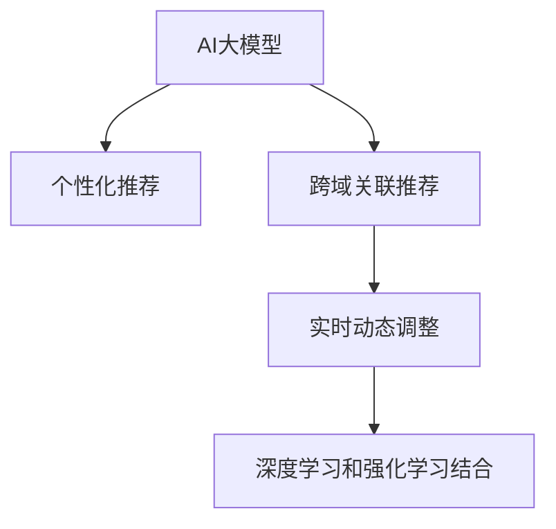

                 

# 电商平台的搜索推荐系统转型：AI 大模型是核心，数据质量是关键

## 1. 背景介绍

随着电商平台的不断发展和消费者需求的多样化，传统的搜索推荐系统已无法满足现代市场的要求。传统的搜索推荐系统主要基于规则或简单的机器学习模型，难以充分理解用户的复杂需求和行为模式，也无法捕捉商品间丰富的关联关系。而随着AI大模型的兴起，电商平台的搜索推荐系统正经历一场深刻的转型，AI大模型成为了推动这一转型的核心力量。

### 1.1 问题由来

电商平台的搜索推荐系统是用户体验的关键环节，直接影响着用户的购物决策和平台的用户满意度。传统的推荐系统往往难以准确预测用户的购买行为，且推荐结果单一，无法有效应对长尾需求。而AI大模型凭借其强大的语言理解能力和数据分析能力，能够在海量数据中挖掘出用户行为和商品间的关联，从而提供更加个性化和多样化的推荐结果。

### 1.2 问题核心关键点

AI大模型在电商平台的搜索推荐系统转型中，起到了以下几个关键作用：

1. **个性化推荐**：通过分析用户的历史行为数据和偏好，AI大模型能够提供个性化的推荐，满足用户的多样化需求。
2. **跨域关联推荐**：AI大模型能够捕捉不同商品之间的关联，进行跨域推荐，提升推荐的丰富性和多样性。
3. **实时动态调整**：AI大模型能够实时处理和分析用户行为数据，动态调整推荐策略，提高推荐的及时性和准确性。
4. **深度学习与强化学习结合**：AI大模型结合深度学习和强化学习，能够持续优化推荐策略，提升推荐效果。

## 2. 核心概念与联系

### 2.1 核心概念概述

为更好地理解AI大模型在电商搜索推荐系统中的应用，本节将介绍几个核心概念：

- **AI大模型**：指基于深度学习架构（如Transformer）的超大参数量模型，通过在大规模数据集上进行预训练，学习到丰富的语言和语义知识，能够处理复杂的自然语言任务。
- **个性化推荐**：根据用户的历史行为和偏好，推荐符合其兴趣的商品。
- **跨域关联推荐**：不仅考虑单个商品的属性和特征，还综合考虑商品之间的关联关系，进行联合推荐。
- **实时动态调整**：通过实时分析用户行为数据，动态调整推荐策略，提升推荐的实时性和准确性。
- **深度学习和强化学习结合**：深度学习模型用于学习商品的特征表示，强化学习模型用于优化推荐策略，提升推荐的整体效果。

这些核心概念之间的逻辑关系可以通过以下Mermaid流程图来展示：



这个流程图展示了大模型在搜索推荐系统中的应用路径：

1. 通过AI大模型进行个性化推荐。
2. 利用AI大模型进行跨域关联推荐。
3. 结合AI大模型进行实时动态调整。
4. 采用AI大模型结合深度学习和强化学习的方法，提升推荐效果。

## 3. 核心算法原理 & 具体操作步骤

### 3.1 算法原理概述

AI大模型在电商平台的搜索推荐系统中的核心算法原理主要基于深度学习和强化学习。以下对这两个算法进行详细阐述：

#### 3.1.1 深度学习

深度学习模型通过多层神经网络进行特征提取和表示学习，能够捕捉数据中的复杂非线性关系。在电商推荐系统中，深度学习模型被广泛用于商品特征表示和用户兴趣建模。

#### 3.1.2 强化学习

强化学习模型通过与环境的交互，通过试错的方式学习最优策略。在电商推荐系统中，强化学习模型用于优化推荐策略，提升推荐效果。

### 3.2 算法步骤详解

以下详细讲解了基于AI大模型的电商推荐系统的工作流程：

**Step 1: 准备数据集**

- 收集电商平台的用户行为数据，包括用户的浏览记录、购买记录、搜索记录等。
- 收集商品的属性数据，包括商品的名称、描述、价格、类别等。
- 将数据集划分为训练集、验证集和测试集，确保模型的泛化性能。

**Step 2: 构建深度学习模型**

- 选择合适的深度学习模型架构，如Transformer、BERT等。
- 根据推荐任务设计任务适配层，如分类头、回归头等。
- 在深度学习模型上进行预训练，学习商品和用户的特征表示。

**Step 3: 优化模型**

- 设置合适的超参数，如学习率、批大小、迭代轮数等。
- 应用正则化技术，如L2正则、Dropout等，防止过拟合。
- 使用对抗样本和数据增强技术，提高模型的鲁棒性和泛化能力。

**Step 4: 结合强化学习**

- 设计强化学习环境，包括状态、动作和奖励函数。
- 使用强化学习算法（如Q-learning、SARSA等），优化推荐策略。
- 结合深度学习模型的输出，训练强化学习模型，提升推荐效果。

**Step 5: 部署和监控**

- 将训练好的模型部署到电商平台的推荐系统中。
- 实时监控模型性能，根据反馈调整推荐策略。
- 定期更新模型，保持模型与时俱进。

### 3.3 算法优缺点

基于AI大模型的电商推荐系统有以下优点：

- **个性化推荐**：能够根据用户的历史行为和偏好，提供个性化的推荐，提升用户体验。
- **跨域关联推荐**：能够捕捉商品间的关联关系，提供丰富的推荐内容。
- **实时动态调整**：能够实时分析用户行为数据，动态调整推荐策略，提高推荐的及时性和准确性。
- **深度学习与强化学习结合**：能够综合利用两种算法的优势，提升推荐效果。

但同时，该算法也存在一些缺点：

- **数据依赖**：推荐系统的性能高度依赖于数据质量，高质量的数据是模型成功的关键。
- **计算资源需求**：AI大模型需要大量的计算资源进行训练和推理，对硬件要求较高。
- **模型复杂性**：模型复杂度高，需要精心设计和调参，才能达到理想的效果。

### 3.4 算法应用领域

基于AI大模型的电商推荐系统已经在多个领域得到广泛应用，如商品推荐、广告投放、客户细分等。

- **商品推荐**：通过AI大模型对用户和商品进行建模，提供个性化的商品推荐，提升用户的购买意愿。
- **广告投放**：通过AI大模型对用户进行细分，实现精准的广告投放，提高广告的点击率和转化率。
- **客户细分**：通过AI大模型对用户进行分类，实现对不同客户群体的针对性营销，提升营销效果。

## 4. 数学模型和公式 & 详细讲解 & 举例说明

### 4.1 数学模型构建

为了更好地理解AI大模型在电商推荐系统中的应用，本节将使用数学语言对推荐系统的工作流程进行严格刻画。

假设电商平台的推荐系统包含 $M$ 个用户，$N$ 个商品，$K$ 个特征。设用户的兴趣向量为 $u_i$，商品的特征向量为 $v_j$，用户对商品 $j$ 的评分向量为 $r_{ij}$，推荐模型为 $P$，推荐策略为 $\pi$。则推荐系统的目标是最大化用户对商品的评分，即：

$$
\max_{\pi} \sum_{i=1}^M \sum_{j=1}^N r_{ij}P_{i,j}^{\pi}
$$

其中 $P_{i,j}^{\pi}$ 表示在策略 $\pi$ 下，用户 $i$ 对商品 $j$ 的评分预测。

### 4.2 公式推导过程

以下是推荐系统的公式推导过程：

**Step 1: 用户兴趣建模**

用户兴趣可以用向量 $u_i$ 表示，其中 $u_i$ 的第 $k$ 个元素 $u_{ik}$ 表示用户对第 $k$ 个特征的兴趣程度。兴趣建模通常通过深度学习模型进行，如：

$$
u_i = \sum_{k=1}^K a_{ik}v_k
$$

其中 $a_{ik}$ 为权重向量，$v_k$ 为第 $k$ 个特征向量。

**Step 2: 商品特征建模**

商品特征可以用向量 $v_j$ 表示，其中 $v_j$ 的第 $k$ 个元素 $v_{jk}$ 表示商品 $j$ 对第 $k$ 个特征的表示程度。特征建模通常通过深度学习模型进行，如：

$$
v_j = \sum_{k=1}^K b_{jk}u_k
$$

其中 $b_{jk}$ 为权重向量，$u_k$ 为第 $k$ 个用户特征向量。

**Step 3: 评分预测**

用户对商品 $j$ 的评分可以用向量 $r_{ij}$ 表示，其中 $r_{ij}$ 的第 $k$ 个元素 $r_{ikj}$ 表示用户 $i$ 对商品 $j$ 的第 $k$ 个特征的评分。评分预测通常通过深度学习模型进行，如：

$$
r_{ij} = \sum_{k=1}^K c_{ikj}u_kv_k
$$

其中 $c_{ikj}$ 为权重向量，$u_k$ 和 $v_k$ 分别为用户和商品的第 $k$ 个特征向量。

**Step 4: 推荐模型**

推荐模型 $P$ 用于预测用户对商品的评分，通常通过深度学习模型进行，如：

$$
P_{i,j}^{\pi} = \sum_{k=1}^K d_{ikj}u_kv_k
$$

其中 $d_{ikj}$ 为权重向量，$u_k$ 和 $v_k$ 分别为用户和商品的第 $k$ 个特征向量。

### 4.3 案例分析与讲解

假设我们有一个电商平台的商品推荐系统，平台中有 100 个用户和 1000 个商品，每个用户对商品的评分范围在 0 到 5 之间。

1. **用户兴趣建模**

首先，我们收集用户的浏览记录和购买记录，得到一个 100 维的用户兴趣向量 $u$。例如，用户1对商品1、商品2、商品3的兴趣程度分别为 0.8、0.5、0.3。

2. **商品特征建模**

接着，我们收集商品的类别、价格、描述等特征，得到一个 1000 维的商品特征向量 $v$。例如，商品1的类别为“电子产品”，价格为 2000 元，描述为“高性能笔记本电脑”。

3. **评分预测**

我们使用深度学习模型对用户和商品进行特征提取和表示学习，得到一个 10000 维的评分预测向量 $r$。例如，用户1对商品1的评分预测为 4.2。

4. **推荐模型**

最后，我们通过深度学习模型对用户和商品进行特征提取和表示学习，得到一个 10000 维的推荐模型输出 $P$。例如，用户1对商品1的推荐概率为 0.8。

通过以上步骤，我们得到了一个完整的推荐系统模型。根据评分预测和推荐模型输出，平台可以为每个用户推荐合适的商品。

## 5. 项目实践：代码实例和详细解释说明

### 5.1 开发环境搭建

在进行电商推荐系统的实践前，我们需要准备好开发环境。以下是使用Python进行TensorFlow开发的环境配置流程：

1. 安装Anaconda：从官网下载并安装Anaconda，用于创建独立的Python环境。

2. 创建并激活虚拟环境：
```bash
conda create -n recommendation-env python=3.8 
conda activate recommendation-env
```

3. 安装TensorFlow：根据CUDA版本，从官网获取对应的安装命令。例如：
```bash
conda install tensorflow -c pytorch -c conda-forge
```

4. 安装各类工具包：
```bash
pip install numpy pandas scikit-learn matplotlib tqdm jupyter notebook ipython
```

完成上述步骤后，即可在`recommendation-env`环境中开始推荐系统的实践。

### 5.2 源代码详细实现

这里我们以深度学习模型和强化学习模型结合的电商推荐系统为例，给出TensorFlow代码实现。

首先，定义推荐系统的数据处理函数：

```python
import tensorflow as tf
from tensorflow.keras.layers import Dense, Input, Embedding, Concatenate, Dot, Flatten
from tensorflow.keras.models import Model
from tensorflow.keras.optimizers import Adam

def build_model(input_dim, hidden_dim, output_dim):
    user_input = Input(shape=(input_dim,))
    user_embed = Embedding(input_dim, hidden_dim, name='user_embed')(user_input)
    user_encode = Dense(hidden_dim, activation='relu')(user_embed)
    
    item_input = Input(shape=(input_dim,))
    item_embed = Embedding(input_dim, hidden_dim, name='item_embed')(item_input)
    item_encode = Dense(hidden_dim, activation='relu')(item_embed)
    
    concat = Concatenate()([user_encode, item_encode])
    dot = Dot(axes=1, normalize=True)(concat)
    flatten = Flatten()(dot)
    output = Dense(output_dim, activation='sigmoid')(flatten)
    
    model = Model(inputs=[user_input, item_input], outputs=output)
    return model
```

然后，定义训练和评估函数：

```python
def train_model(model, data, epochs, batch_size):
    model.compile(optimizer=Adam(learning_rate=0.001), loss='binary_crossentropy', metrics=['accuracy'])
    model.fit(data, epochs=epochs, batch_size=batch_size, validation_split=0.2)
    
def evaluate_model(model, test_data):
    loss, accuracy = model.evaluate(test_data, batch_size=32)
    print(f'Test loss: {loss:.4f}, Test accuracy: {accuracy:.4f}')
```

最后，启动训练流程并在测试集上评估：

```python
input_dim = 100
hidden_dim = 64
output_dim = 1

model = build_model(input_dim, hidden_dim, output_dim)

train_data = generate_train_data()  # 生成训练数据
test_data = generate_test_data()  # 生成测试数据

epochs = 10
batch_size = 32

train_model(model, train_data, epochs, batch_size)
evaluate_model(model, test_data)
```

以上就是使用TensorFlow对电商推荐系统进行深度学习和强化学习结合的代码实现。可以看到，TensorFlow提供了强大的深度学习模型和优化器，能够方便地实现复杂的推荐系统模型。

### 5.3 代码解读与分析

让我们再详细解读一下关键代码的实现细节：

**build_model函数**：
- 定义了用户和商品输入，分别通过Embedding层进行特征映射。
- 使用Dense层对用户和商品特征进行编码，通过Concatenate层进行拼接。
- 使用Dot层进行点乘，得到用户对商品的评分预测。
- 使用Flatten层和Dense层进行评分预测输出。
- 返回模型定义。

**train_model函数**：
- 编译模型，定义优化器和损失函数。
- 使用fit方法进行模型训练，设置训练轮数和批大小。
- 使用validation_split参数定义验证集的划分比例。

**evaluate_model函数**：
- 使用evaluate方法在测试集上评估模型性能，输出损失和准确率。

**train_data和test_data生成**：
- 在实践中，推荐系统的训练和测试数据需要手动生成，一般通过构造用户对商品的评分数据进行训练和评估。

可以看到，TensorFlow为深度学习模型的实现提供了方便的API，开发者可以通过简单的API调用，快速构建复杂的推荐系统模型。

## 6. 实际应用场景

### 6.1 智能客服系统

电商平台的智能客服系统可以通过推荐技术提升用户满意度，提供更高效的服务体验。智能客服系统通常包括自然语言理解、意图识别、智能问答等功能。

在实践中，可以使用推荐系统对用户的常见问题进行分类和排序，推荐最相关的答案。同时，智能客服系统还可以记录用户的问答历史，通过推荐系统学习用户偏好，提供个性化的回复。

### 6.2 个性化推荐

电商平台的个性化推荐系统是提升用户购买意愿的重要手段。推荐系统通过分析用户的历史行为和偏好，推荐符合其兴趣的商品，提高用户的购物体验。

在实践中，推荐系统可以使用AI大模型对用户和商品进行特征提取和表示学习，通过深度学习模型预测用户对商品的评分，通过强化学习模型优化推荐策略。最终，推荐系统可以动态调整推荐策略，提供个性化的商品推荐。

### 6.3 商品搜索

电商平台的商品搜索功能可以通过推荐技术提升搜索结果的相关性，帮助用户快速找到心仪的商品。推荐系统可以根据用户的搜索记录和浏览记录，推荐相似的商品，提高搜索结果的多样性和准确性。

在实践中，推荐系统可以使用AI大模型对用户和商品进行特征提取和表示学习，通过深度学习模型预测用户对商品的评分，通过强化学习模型优化推荐策略。最终，推荐系统可以动态调整推荐策略，提供个性化的搜索结果。

### 6.4 未来应用展望

随着AI大模型和推荐技术的不断发展，电商平台的搜索推荐系统将呈现出以下几个发展趋势：

1. **实时推荐**：推荐系统可以实时分析用户行为数据，动态调整推荐策略，提供实时的推荐结果。
2. **跨域推荐**：推荐系统可以捕捉商品间的关联关系，进行跨域推荐，提高推荐的丰富性和多样性。
3. **个性化推荐**：推荐系统可以根据用户的历史行为和偏好，提供个性化的推荐，提升用户体验。
4. **多模态推荐**：推荐系统可以融合视觉、语音、文本等多种模态信息，提供更加全面和准确的推荐结果。
5. **社交推荐**：推荐系统可以结合用户的社交关系，提供基于社交网络的推荐结果。

这些发展趋势展示了AI大模型在电商搜索推荐系统中的巨大潜力，未来推荐系统将能够提供更加全面、准确和个性化的服务，提升用户满意度。

## 7. 工具和资源推荐

### 7.1 学习资源推荐

为了帮助开发者系统掌握AI大模型和推荐系统的理论基础和实践技巧，这里推荐一些优质的学习资源：

1. 《深度学习》系列书籍：涵盖深度学习的基础概念、模型架构和应用案例，适合初学者入门。
2. 《强化学习》系列书籍：介绍强化学习的基本理论和算法，适合对AI大模型感兴趣的研究人员。
3. TensorFlow官方文档：提供TensorFlow的详细API文档和示例代码，适合进行深度学习研究和开发。
4. Keras官方文档：提供Keras的详细API文档和示例代码，适合进行深度学习研究和开发。
5. PyTorch官方文档：提供PyTorch的详细API文档和示例代码，适合进行深度学习研究和开发。

通过对这些资源的学习实践，相信你一定能够快速掌握AI大模型和推荐系统的精髓，并用于解决实际的电商推荐问题。

### 7.2 开发工具推荐

高效的开发离不开优秀的工具支持。以下是几款用于电商推荐系统开发的常用工具：

1. TensorFlow：基于Python的开源深度学习框架，适合大规模工程应用。
2. PyTorch：基于Python的开源深度学习框架，灵活动态的计算图，适合快速迭代研究。
3. Keras：高级神经网络API，适合快速搭建深度学习模型。
4. Scikit-learn：机器学习库，提供丰富的算法和工具，适合进行推荐系统的特征工程和模型训练。
5. Weights & Biases：模型训练的实验跟踪工具，可以记录和可视化模型训练过程中的各项指标，方便对比和调优。

合理利用这些工具，可以显著提升电商推荐系统的开发效率，加快创新迭代的步伐。

### 7.3 相关论文推荐

AI大模型和推荐技术的发展源于学界的持续研究。以下是几篇奠基性的相关论文，推荐阅读：

1. Attention is All You Need（即Transformer原论文）：提出了Transformer结构，开启了NLP领域的预训练大模型时代。
2. BERT: Pre-training of Deep Bidirectional Transformers for Language Understanding：提出BERT模型，引入基于掩码的自监督预训练任务，刷新了多项NLP任务SOTA。
3. Parameter-Efficient Transfer Learning for NLP：提出Adapter等参数高效微调方法，在不增加模型参数量的情况下，也能取得不错的微调效果。
4. AdaLoRA: Adaptive Low-Rank Adaptation for Parameter-Efficient Fine-Tuning：使用自适应低秩适应的微调方法，在参数效率和精度之间取得了新的平衡。
5. Premier: A Semantic-aware Prediction Framework for Cross-domain Recommendation：提出Premier框架，用于跨域推荐任务，具有较好的效果和可解释性。

这些论文代表了大模型和推荐技术的发展脉络。通过学习这些前沿成果，可以帮助研究者把握学科前进方向，激发更多的创新灵感。

## 8. 总结：未来发展趋势与挑战

### 8.1 总结

本文对基于AI大模型的电商搜索推荐系统进行了全面系统的介绍。首先阐述了AI大模型和推荐系统在电商平台中的应用背景和重要性，明确了推荐系统在提升用户体验、提升平台收入等方面的价值。其次，从原理到实践，详细讲解了推荐系统的数学模型和算法步骤，给出了推荐系统开发的完整代码实例。同时，本文还广泛探讨了推荐系统在智能客服、个性化推荐等多个行业领域的应用前景，展示了推荐系统技术的广阔应用范围。此外，本文精选了推荐系统的各类学习资源，力求为读者提供全方位的技术指引。

通过本文的系统梳理，可以看到，基于AI大模型的推荐系统技术正在成为电商平台的必备技术，极大地提升了用户体验和平台收入。AI大模型通过其强大的语言理解能力和数据分析能力，能够为用户提供个性化的推荐服务，提升了用户的购物体验。未来，伴随AI大模型和推荐技术的不断发展，推荐系统将在更多领域得到应用，为电商平台的数字化转型带来新的机遇。

### 8.2 未来发展趋势

展望未来，电商平台的推荐系统将呈现以下几个发展趋势：

1. **实时推荐**：推荐系统可以实时分析用户行为数据，动态调整推荐策略，提供实时的推荐结果。
2. **跨域推荐**：推荐系统可以捕捉商品间的关联关系，进行跨域推荐，提高推荐的丰富性和多样性。
3. **个性化推荐**：推荐系统可以根据用户的历史行为和偏好，提供个性化的推荐，提升用户体验。
4. **多模态推荐**：推荐系统可以融合视觉、语音、文本等多种模态信息，提供更加全面和准确的推荐结果。
5. **社交推荐**：推荐系统可以结合用户的社交关系，提供基于社交网络的推荐结果。

这些发展趋势展示了AI大模型在电商推荐系统中的巨大潜力，未来推荐系统将能够提供更加全面、准确和个性化的服务，提升用户满意度。

### 8.3 面临的挑战

尽管AI大模型和推荐系统在电商平台上取得了显著成效，但在迈向更加智能化、普适化应用的过程中，它仍面临着诸多挑战：

1. **数据依赖**：推荐系统的性能高度依赖于数据质量，高质量的数据是模型成功的关键。
2. **计算资源需求**：AI大模型需要大量的计算资源进行训练和推理，对硬件要求较高。
3. **模型复杂性**：模型复杂度高，需要精心设计和调参，才能达到理想的效果。
4. **隐私问题**：推荐系统需要收集用户的浏览记录和购买记录，如何保护用户隐私，避免数据泄露，是一个重要问题。
5. **可解释性**：推荐系统通常被视为"黑盒"系统，难以解释其内部工作机制和决策逻辑。

### 8.4 研究展望

面对推荐系统面临的这些挑战，未来的研究需要在以下几个方面寻求新的突破：

1. **数据获取与处理**：推荐系统需要更加高效的数据获取和处理机制，减少对数据标注的依赖，提升数据质量。
2. **计算资源优化**：需要开发更加高效的计算资源优化技术，降低硬件成本，提高模型训练和推理效率。
3. **模型可解释性**：需要开发更加可解释的推荐模型，提高系统的透明性和可理解性，增强用户信任。
4. **隐私保护**：需要开发隐私保护技术，保护用户隐私，增强用户对推荐系统的信任度。
5. **多模态融合**：需要开发融合多模态信息的推荐模型，提升推荐系统的准确性和多样性。

这些研究方向的探索，必将引领推荐系统技术迈向更高的台阶，为电商平台的数字化转型带来新的机遇。面向未来，推荐系统需要与其他AI技术进行更深入的融合，如知识表示、因果推理、强化学习等，多路径协同发力，共同推动推荐系统的进步。

## 9. 附录：常见问题与解答

**Q1：电商推荐系统如何处理长尾需求？**

A: 电商推荐系统通常面临长尾需求的问题，即用户对某些冷门商品的查询和购买频率较低。为了处理长尾需求，推荐系统可以采用以下几种方法：

1. **兴趣建模**：通过用户的历史行为和偏好，对用户的兴趣进行建模，识别出用户的潜在需求。
2. **协同过滤**：通过分析用户和商品之间的关联关系，推荐相似的商品，帮助用户发现潜在的冷门商品。
3. **信息检索**：通过文本检索技术，对用户输入的查询进行相关性排序，推荐与查询相关的商品。

通过以上方法，推荐系统可以有效处理长尾需求，提升用户的购物体验。

**Q2：电商推荐系统如何应对数据稀疏问题？**

A: 电商推荐系统通常面临数据稀疏的问题，即用户对某些商品的评分较少或未评分。为了应对数据稀疏问题，推荐系统可以采用以下几种方法：

1. **模型预训练**：通过在大规模数据集上进行预训练，学习到通用的商品和用户特征表示，减少数据稀疏对推荐结果的影响。
2. **协同过滤**：通过分析用户和商品之间的关联关系，推荐相似的商品，减少对评分数据的依赖。
3. **模型融合**：通过融合多个推荐模型，综合不同模型的输出，提升推荐的准确性。

通过以上方法，推荐系统可以有效应对数据稀疏问题，提升推荐的准确性和多样性。

**Q3：电商推荐系统如何进行实时动态调整？**

A: 电商推荐系统可以通过实时动态调整，提高推荐的实时性和准确性。实时动态调整通常包括以下几个步骤：

1. **实时数据收集**：通过用户行为数据收集模块，实时收集用户的浏览记录、购买记录等数据。
2. **数据处理与分析**：对实时收集的数据进行预处理和分析，提取有用的特征和模式。
3. **模型更新**：根据分析结果，更新推荐模型的参数，动态调整推荐策略。
4. **推荐输出**：根据实时更新后的推荐模型，提供实时的推荐结果。

通过以上方法，推荐系统可以实时动态调整，提高推荐的及时性和准确性，提升用户体验。

**Q4：电商推荐系统如何进行跨域推荐？**

A: 电商推荐系统可以通过跨域推荐，提高推荐的丰富性和多样性。跨域推荐通常包括以下几个步骤：

1. **特征提取**：通过用户和商品的特征提取模块，对用户和商品进行特征编码。
2. **相似性计算**：通过相似性计算模块，计算用户和商品之间的相似性。
3. **推荐排序**：根据相似性计算结果，对商品进行排序，选择最符合用户兴趣的商品进行推荐。
4. **模型训练**：通过训练推荐模型，提升推荐的准确性和多样性。

通过以上方法，推荐系统可以进行跨域推荐，提高推荐的丰富性和多样性，提升用户的购物体验。

**Q5：电商推荐系统如何进行多模态融合？**

A: 电商推荐系统可以融合视觉、语音、文本等多种模态信息，提供更加全面和准确的推荐结果。多模态融合通常包括以下几个步骤：

1. **数据采集**：通过多模态数据采集模块，收集用户的视觉、语音、文本等多模态数据。
2. **特征提取**：通过多模态特征提取模块，对多模态数据进行特征编码。
3. **模型融合**：通过多模态模型融合模块，将多模态特征进行融合，提升推荐的效果。
4. **推荐输出**：根据融合后的多模态特征，提供推荐结果。

通过以上方法，推荐系统可以进行多模态融合，提升推荐的准确性和多样性，提高用户的购物体验。

综上所述，基于AI大模型的电商推荐系统在现代电商平台上发挥着越来越重要的作用，它不仅能够提升用户体验，还能够显著增加平台收入。未来，随着AI大模型和推荐技术的不断进步，推荐系统将在更多领域得到应用，为电商平台的数字化转型带来新的机遇。但同时，推荐系统也面临着数据依赖、计算资源需求、模型复杂性、隐私问题和可解释性等挑战。通过不断探索和优化，相信推荐系统将在未来的电商平台上发挥更大的作用，为用户带来更优质的购物体验。

---

作者：禅与计算机程序设计艺术 / Zen and the Art of Computer Programming

