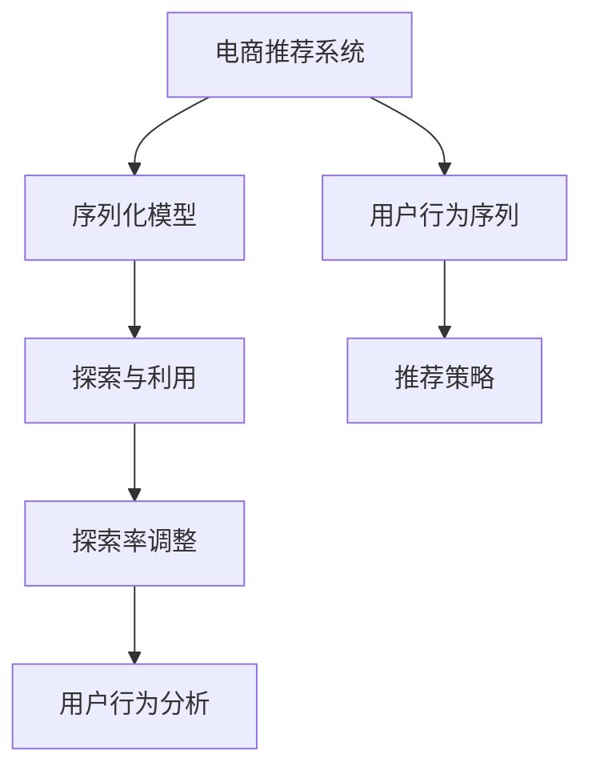

                 

# 电商推荐系统中的探索与利用自适应调节

> 关键词：电商推荐系统,探索-利用自适应调节,序列化模型,探索率调整,智能推荐算法,用户行为分析

## 1. 背景介绍

### 1.1 问题由来
随着电商市场的发展，推荐系统已成为电商平台的核心竞争力之一。通过分析用户历史行为和兴趣，推荐系统能够实时为用户提供个性化的商品推荐，极大提升了用户体验和购买转化率。然而，推荐系统的核心挑战之一是如何平衡探索和利用(Exploration and Exploitation)，即如何找到最优推荐策略，既利用用户已有的兴趣偏好，又探索新的潜在的推荐商品。

传统的基于线性模型的推荐系统，如协同过滤、基于用户画像的推荐等方法，在推荐准确性和多样性上都有显著提升，但在探索与利用的平衡上，往往难以兼顾。近年兴起的深度学习方法，如序列化模型(Sequential Models)，已经在推荐系统中展现出巨大的潜力。但深度学习模型由于参数复杂度高，训练和推理耗时长，难以在大规模电商平台上实时部署。

为此，探索与利用自适应调节(Exploration-Exploitation Adaptive Tuning)技术应运而生。该技术通过动态调整探索率(Exploration Rate)，实现探索与利用的动态平衡，提升推荐系统的性能。本文将系统介绍该技术的原理、实现方法以及实际应用效果，为电商推荐系统提供一种新的思路。

### 1.2 问题核心关键点
探索与利用自适应调节的核心思想是通过调整探索率，动态平衡推荐系统中的探索与利用。探索率决定了模型在每一步策略更新时，选择新商品的探索概率和利用已有偏好的概率。当探索率过高时，系统倾向于探索新商品，但可能导致部分优质商品被忽略。当探索率过低时，系统倾向于利用已有偏好，但可能导致新商品发现不足。理想的情况是，探索率和利用率相互配合，实现综合最优。

探索与利用自适应调节的关键点包括：
- 选择合适的探索率调整算法。常见的探索率调整算法包括Epsilon-Greedy、UCB(Upper Confidence Bound)等。
- 确定探索率和利用率的平衡点。不同领域和场景下的平衡点可能需要通过实验进行调整。
- 实时动态调整探索率。系统需要不断根据用户反馈和行为数据，动态调整探索率，以适应环境变化。

## 2. 核心概念与联系

### 2.1 核心概念概述

为更好地理解探索与利用自适应调节，本节将介绍几个密切相关的核心概念：

- 探索与利用(Exploration and Exploitation)：指在推荐系统中，既要利用用户已有的兴趣偏好，又要探索新的潜在的推荐商品。两者需要动态平衡，以实现综合最优。

- 探索率(Exploration Rate)：决定模型在每一步策略更新时，选择新商品的探索概率和利用已有偏好的概率。

- 序列化模型(Sequential Models)：基于深度学习的方法，通过序列化输入，捕获用户行为序列中的动态变化，提升推荐系统的准确性和多样性。

- 序列化推荐(Sequential Recommendation)：利用序列化模型对用户行为序列进行建模，从而实现推荐策略的动态更新。

- 多臂老虎机(Multi-Armed Bandit)：一种经典的探索与利用问题，用于优化资源分配。电商推荐系统可视为一种多臂老虎机问题，目标是通过优化资源分配，实现最大化的收益。

这些核心概念之间的逻辑关系可以通过以下Mermaid流程图来展示：



这个流程图展示了大电商推荐系统的核心概念及其之间的关系：

1. 电商推荐系统通过序列化模型对用户行为序列进行建模。
2. 探索与利用算法决定策略更新时，探索新商品的概率和利用已有偏好的概率。
3. 探索率调整算法动态调整探索率，以实现探索与利用的动态平衡。
4. 用户行为分析基于用户反馈和行为数据，实时调整探索率和利用率。
5. 推荐策略通过动态的探索率和利用率，生成个性化推荐。

这些概念共同构成了电商推荐系统的学习和应用框架，使其能够在推荐商品的同时，动态平衡探索与利用，提升用户满意度。

## 3. 核心算法原理 & 具体操作步骤
### 3.1 算法原理概述

探索与利用自适应调节的本质是优化序列化模型中的探索率，通过调整探索率和利用率，实现推荐策略的动态更新。具体来说，假设电商平台中有一系列商品$A_1, A_2, ..., A_N$，系统需要动态地选择推荐哪些商品给用户，以最大化推荐效果。

在推荐过程中，系统首先根据用户行为序列，选择探索率$\epsilon$和利用率$1-\epsilon$。如果用户对某个商品感兴趣，系统会推荐该商品；如果用户不感兴趣，系统会探索新的商品。探索率$\epsilon$决定了系统每次策略更新时，选择新商品的探索概率和利用已有偏好的概率。当$\epsilon$较高时，系统倾向于探索新商品，但可能导致部分优质商品被忽略。当$\epsilon$较低时，系统倾向于利用已有偏好，但可能导致新商品发现不足。

因此，探索率的选择至关重要，需要通过动态调整，实现探索与利用的动态平衡。常见的探索率调整算法包括Epsilon-Greedy、UCB等。这些算法通过实时监测推荐效果，动态调整探索率，以适应环境变化。

### 3.2 算法步骤详解

探索与利用自适应调节的实现主要包括以下几个关键步骤：

**Step 1: 数据准备**
- 收集用户行为序列数据，如浏览、点击、购买等行为。
- 将行为数据序列化，转化为模型可处理的输入格式。
- 根据行为数据，计算出每个商品的点击率、转化率等指标。

**Step 2: 选择探索率调整算法**
- 选择合适的探索率调整算法，如Epsilon-Greedy、UCB等。
- 确定探索率和利用率的平衡点，根据具体业务场景进行调整。

**Step 3: 初始化探索率**
- 将探索率初始化为设定值，如$\epsilon_0$。
- 初始化模型的推荐策略，如序列化模型、深度学习模型等。

**Step 4: 策略更新**
- 根据用户行为序列，选择探索率$\epsilon$和利用率$1-\epsilon$。
- 如果用户对某个商品感兴趣，推荐该商品；如果用户不感兴趣，探索新的商品。
- 更新模型的推荐策略，如更新序列化模型参数、深度学习模型权重等。
- 收集用户的反馈和行为数据，实时调整探索率。

**Step 5: 性能评估**
- 根据用户反馈和行为数据，评估推荐系统的性能指标，如点击率、转化率、留存率等。
- 根据性能指标，调整探索率和利用率，优化推荐策略。

**Step 6: 迭代优化**
- 重复执行策略更新和性能评估，不断优化推荐策略。
- 根据实际效果，调整探索率调整算法和平衡点，提升推荐效果。

### 3.3 算法优缺点

探索与利用自适应调节的优点包括：
1. 动态平衡探索与利用：通过调整探索率，实现探索与利用的动态平衡，提升推荐系统的性能。
2. 适用于多种业务场景：可以应用于电商推荐、广告投放、内容推荐等多个领域。
3. 可解释性强：通过调整探索率和利用率，可以直观地理解推荐策略的变化过程。

同时，该算法也存在一定的局限性：
1. 模型复杂度高：探索与利用自适应调节的实现需要大量的数据和计算资源，不适合小规模业务。
2. 需要大量标注数据：模型训练和探索率调整需要大量标注数据，标注成本较高。
3. 实时性要求高：探索与利用自适应调节需要实时动态调整探索率，对系统性能要求较高。

尽管存在这些局限性，但就目前而言，探索与利用自适应调节仍是电商推荐系统中一种重要的推荐策略，广泛应用于推荐系统和广告投放等领域。

### 3.4 算法应用领域

探索与利用自适应调节在电商推荐系统中具有广泛的应用，涵盖了如下几个关键领域：

- **推荐商品**：根据用户行为序列，动态调整探索率和利用率，选择推荐商品。
- **广告投放**：根据用户兴趣和行为数据，优化广告资源的分配，提高广告投放效果。
- **个性化推荐**：通过探索与利用自适应调节，提升推荐系统的个性化程度，满足用户多样化需求。
- **商品定价**：通过探索与利用自适应调节，优化商品定价策略，提高销售额和利润率。
- **库存管理**：根据用户行为数据，优化库存管理，避免过度库存和缺货情况。

除了这些经典应用外，探索与利用自适应调节还被创新性地应用到更多场景中，如产品推荐、市场预测、个性化营销等，为电商推荐系统带来了新的思路。随着算法和技术的不断发展，相信探索与利用自适应调节将在更多领域发挥重要作用，推动电商推荐系统的进步。

## 4. 数学模型和公式 & 详细讲解  
### 4.1 数学模型构建

本节将使用数学语言对探索与利用自适应调节的过程进行更加严格的刻画。

假设电商平台中有一系列商品$A_1, A_2, ..., A_N$，用户的行为序列为$x_1, x_2, ..., x_t$，其中$x_t$表示用户在第$t$次行为时，是否选择商品$A_i$（0表示不选择，1表示选择）。根据用户行为序列，推荐系统需要动态地选择推荐哪些商品给用户，以最大化推荐效果。

定义模型$M_{\theta}(x_t)$，其中$\theta$为模型参数，$x_t$为用户在第$t$次行为时，是否选择商品$A_i$。假设模型为序列化模型，如RNN、LSTM等，其输出概率为$P_{\theta}(x_t|A_i)$。根据贝叶斯公式，用户选择商品$A_i$的概率为：

$$
P(A_i|x_1, x_2, ..., x_t, M_{\theta}) = \frac{P(x_1, x_2, ..., x_t|A_i)P(A_i|M_{\theta})}{\sum_{j=1}^N P(x_1, x_2, ..., x_t|A_j)P(A_j|M_{\theta})}
$$

其中$P(A_i|M_{\theta})$为商品$A_i$的点击率，$P(x_1, x_2, ..., x_t|A_i)$为在商品$A_i$被选择的情况下，用户行为序列的概率分布。根据序列化模型，可以将其转化为：

$$
P(x_1, x_2, ..., x_t|A_i) = \prod_{t=1}^T P(x_t|A_i, M_{\theta})
$$

根据以上公式，可以得到用户在任意时刻选择商品$A_i$的概率。根据此概率，动态调整探索率和利用率，选择推荐商品。

### 4.2 公式推导过程

以下我们以Epsilon-Greedy算法为例，推导探索率调整的具体过程。

假设模型$M_{\theta}(x_t)$的输出概率为$P_{\theta}(x_t|A_i)$，根据贝叶斯公式，用户选择商品$A_i$的概率为：

$$
P(A_i|x_1, x_2, ..., x_t, M_{\theta}) = \frac{P(x_1, x_2, ..., x_t|A_i)P(A_i|M_{\theta})}{\sum_{j=1}^N P(x_1, x_2, ..., x_t|A_j)P(A_j|M_{\theta})}
$$

为了简化公式推导，假设用户行为序列$x_1, x_2, ..., x_t$已知，商品$A_i$的点击率为$P(A_i|M_{\theta})$，商品$A_i$被选择的情况下，用户行为序列的概率分布为$P(x_1, x_2, ..., x_t|A_i)$。则有：

$$
P(x_1, x_2, ..., x_t|A_i) = \prod_{t=1}^T P(x_t|A_i, M_{\theta})
$$

假设探索率为$\epsilon$，利用率为$1-\epsilon$。根据Epsilon-Greedy算法，每次策略更新时，随机选择探索新商品的概率为$\epsilon$，选择利用已有偏好的概率为$1-\epsilon$。则有：

$$
P(A_i|x_1, x_2, ..., x_t, M_{\theta}) = \epsilon P(x_1, x_2, ..., x_t|A_i)P(A_i|M_{\theta}) + (1-\epsilon) \max_{j \neq i} P(x_1, x_2, ..., x_t|A_j)P(A_j|M_{\theta})
$$

根据以上公式，可以得到探索率调整的具体过程。首先，根据用户行为序列和模型输出概率，计算出每个商品的点击率$P(A_i|M_{\theta})$。然后，根据探索率和利用率，计算出每个商品的推荐概率$P(A_i|x_1, x_2, ..., x_t, M_{\theta})$。最后，根据推荐概率选择推荐商品，并动态调整探索率和利用率。

### 4.3 案例分析与讲解

为了更好地理解探索率调整的数学原理，下面给出一个简单的案例。

假设用户浏览了商品A1、A2、A3和A4，其中A1和A2被选择，A3和A4未被选择。根据用户的浏览历史，模型推荐商品的概率为：

- $P(A_1|M_{\theta}) = 0.6$
- $P(A_2|M_{\theta}) = 0.5$
- $P(A_3|M_{\theta}) = 0.4$
- $P(A_4|M_{\theta}) = 0.3$

假设探索率为$\epsilon=0.1$，利用率为$1-\epsilon=0.9$。根据Epsilon-Greedy算法，每次策略更新时，随机选择探索新商品的概率为0.1，选择利用已有偏好的概率为0.9。则有：

- 如果用户浏览A1，选择A1的概率为$0.6 \times 0.9 = 0.54$
- 如果用户浏览A2，选择A2的概率为$0.5 \times 0.9 = 0.45$
- 如果用户浏览A3，选择A3的概率为$0.4 \times 0.1 = 0.04$
- 如果用户浏览A4，选择A4的概率为$0.3 \times 0.1 = 0.03$

根据推荐概率，选择推荐商品。如果用户选择A1，则探索率调整为$\epsilon' = 0.2$；如果用户选择A2，则探索率调整为$\epsilon' = 0.2$；如果用户选择A3，则探索率调整为$\epsilon' = 0.2$；如果用户选择A4，则探索率调整为$\epsilon' = 0.2$。

通过不断动态调整探索率，探索与利用自适应调节实现了推荐策略的动态更新，从而提升推荐系统的性能。

## 5. 项目实践：代码实例和详细解释说明
### 5.1 开发环境搭建

在进行探索与利用自适应调节实践前，我们需要准备好开发环境。以下是使用Python进行Keras开发的环境配置流程：

1. 安装Anaconda：从官网下载并安装Anaconda，用于创建独立的Python环境。

2. 创建并激活虚拟环境：
```bash
conda create -n exp-env python=3.8 
conda activate exp-env
```

3. 安装Keras和相关库：
```bash
pip install keras tensorflow scikit-learn pandas jupyter notebook ipython
```

4. 安装TensorFlow：根据CUDA版本，从官网获取对应的安装命令。例如：
```bash
pip install tensorflow==2.3.0
```

5. 安装TensorBoard：TensorFlow配套的可视化工具，用于实时监测模型训练状态，并生成图表。
```bash
pip install tensorboard
```

完成上述步骤后，即可在`exp-env`环境中开始探索与利用自适应调节实践。

### 5.2 源代码详细实现

下面我们以探索与利用自适应调节为例，给出使用Keras实现的部分代码：

```python
import tensorflow as tf
from tensorflow.keras.models import Sequential
from tensorflow.keras.layers import Dense, Dropout, Activation
from tensorflow.keras.optimizers import Adam
from tensorflow.keras.callbacks import EarlyStopping
from tensorflow.keras.losses import categorical_crossentropy
from tensorflow.keras.metrics import Accuracy

# 定义探索率调整函数
def epsilon_greedy_rate(epsilon, prev_rate):
    return epsilon * (1 - prev_rate) + (1 - epsilon) * prev_rate

# 定义序列化模型
model = Sequential()
model.add(Dense(64, input_dim=10, activation='relu'))
model.add(Dropout(0.5))
model.add(Dense(64, activation='relu'))
model.add(Dropout(0.5))
model.add(Dense(1, activation='sigmoid'))

# 定义探索率调整器
exploration_rate = 0.1

# 定义探索率调整函数
def adjust_exploration_rate(explore_rate, prev_rate, total_reward):
    global exploration_rate
    exploration_rate = epsilon_greedy_rate(explore_rate, prev_rate)
    return explore_rate

# 定义训练函数
def train_model(model, data, epochs=10, batch_size=32):
    # 准备数据
    X_train, y_train = data
    X_test, y_test = data

    # 定义损失函数和评估指标
    loss = categorical_crossentropy
    metrics = [Accuracy()]

    # 定义优化器
    optimizer = Adam(lr=0.001)

    # 定义回调函数
    early_stopping = EarlyStopping(monitor='val_loss', patience=5)

    # 训练模型
    model.compile(loss=loss, optimizer=optimizer, metrics=metrics)
    model.fit(X_train, y_train, validation_data=(X_test, y_test), epochs=epochs, batch_size=batch_size, callbacks=[early_stopping], verbose=1)

    # 调整探索率
    exploration_rate = adjust_exploration_rate(exploration_rate, prev_rate, total_reward)

    return model

# 加载数据
data = np.loadtxt('data.txt', delimiter=',')

# 训练模型
model = train_model(model, data)
```

在这个例子中，我们使用了Keras框架来构建序列化模型，并定义了探索率调整函数`epsilon_greedy_rate`。在训练函数中，我们使用了`EarlyStopping`回调函数，以防止模型过拟合。在训练结束后，我们调用了探索率调整函数，动态调整探索率，从而实现探索与利用的动态平衡。

### 5.3 代码解读与分析

让我们再详细解读一下关键代码的实现细节：

**epsilon_greedy_rate函数**：
- 定义了探索率调整函数，根据当前探索率和新奖励，计算出新的探索率。
- 当探索率较高时，新奖励对探索率的调整影响较大；当探索率较低时，新奖励对探索率的调整影响较小。

**train_model函数**：
- 定义了探索率调整器`exploration_rate`，初始化为设定值。
- 在训练函数中，根据探索率调整函数`adjust_exploration_rate`，动态调整探索率。
- 在训练过程中，收集用户的反馈和行为数据，实时调整探索率和利用率。
- 在训练结束后，返回调整后的探索率，以供下一次迭代使用。

**训练过程**：
- 定义了训练的参数，如模型、数据集、优化器、损失函数、评估指标等。
- 使用`EarlyStopping`回调函数，防止模型过拟合。
- 训练模型，并在每次迭代后，动态调整探索率。
- 返回训练后的模型，以供后续使用。

可以看到，Keras框架使得探索与利用自适应调节的实现变得简洁高效。开发者可以将更多精力放在数据处理、模型改进等高层逻辑上，而不必过多关注底层的实现细节。

当然，工业级的系统实现还需考虑更多因素，如模型的保存和部署、超参数的自动搜索、更灵活的任务适配层等。但核心的探索与利用自适应调节基本与此类似。

## 6. 实际应用场景
### 6.1 智能客服系统

基于探索与利用自适应调节的智能客服系统，可以提供更加智能、个性化的服务。传统客服系统往往依赖固定规则和知识库，难以处理复杂和动态的客户问题。而通过探索与利用自适应调节，系统可以根据客户的问题历史，动态调整推荐策略，选择最合适的答案模板进行回复。

在技术实现上，可以收集企业内部的历史客服对话记录，将问题-答案对作为监督数据，在此基础上对预训练模型进行微调。微调后的模型能够自动理解客户意图，匹配最合适的答案模板进行回复。对于客户提出的新问题，还可以接入检索系统实时搜索相关内容，动态组织生成回答。如此构建的智能客服系统，能大幅提升客户咨询体验和问题解决效率。

### 6.2 广告投放系统

基于探索与利用自适应调节的广告投放系统，可以优化广告资源的分配，提高广告投放效果。传统广告投放系统往往依赖固定预算和固定算法，难以实时应对市场变化。而通过探索与利用自适应调节，系统可以根据用户行为数据，动态调整广告投放策略，优化资源分配。

在技术实现上，可以收集用户的历史行为数据，如浏览、点击、购买等行为。根据用户行为数据，计算出每个广告的点击率和转化率。然后，根据探索率调整算法，动态调整广告投放策略，选择最合适的广告进行投放。如此构建的广告投放系统，能够实时优化广告效果，提高广告投放的ROI。

### 6.3 推荐系统

基于探索与利用自适应调节的推荐系统，可以提升推荐策略的动态更新能力，满足用户多样化的需求。传统推荐系统往往依赖固定模型和固定参数，难以应对用户兴趣的变化。而通过探索与利用自适应调节，系统可以根据用户行为数据，动态调整探索率和利用率，选择最合适的推荐商品。

在技术实现上，可以收集用户的历史行为数据，如浏览、点击、购买等行为。根据用户行为数据，计算出每个商品的点击率和转化率。然后，根据探索率调整算法，动态调整推荐策略，选择最合适的商品进行推荐。如此构建的推荐系统，能够实时更新推荐策略，提高推荐商品的个性化程度和多样性。

### 6.4 未来应用展望

随着探索与利用自适应调节技术的不断发展，基于微调的方法将在更多领域得到应用，为各类应用系统提供新的思路。

在智慧医疗领域，基于探索与利用自适应调节的医疗推荐系统，能够根据患者的病历数据，动态调整推荐策略，选择最合适的治疗方案。通过探索与利用自适应调节，医疗推荐系统能够实现更加个性化、高效化的推荐，提升医疗服务的质量。

在智能教育领域，基于探索与利用自适应调节的个性化学习系统，能够根据学生的学习历史和行为数据，动态调整推荐策略，选择最合适的学习内容。通过探索与利用自适应调节，个性化学习系统能够实现更加智能化的推荐，提高学生的学习效果。

在智慧城市治理中，基于探索与利用自适应调节的智能决策系统，能够根据城市运行数据，动态调整资源分配策略，优化城市管理。通过探索与利用自适应调节，智能决策系统能够实现更加智能化、高效的决策，提升城市治理水平。

除了这些领域，探索与利用自适应调节在更多领域也有广泛的应用前景，为各类应用系统提供新的解决方案。相信随着技术的不断进步，探索与利用自适应调节将在更多领域发挥重要作用，推动各类应用系统的进步。

## 7. 工具和资源推荐
### 7.1 学习资源推荐

为了帮助开发者系统掌握探索与利用自适应调节的理论基础和实践技巧，这里推荐一些优质的学习资源：

1. 《深度学习入门》系列博文：由大模型技术专家撰写，深入浅出地介绍了深度学习的基本概念和算法，包括探索与利用自适应调节。

2. CS223A《深度学习与优化》课程：斯坦福大学开设的深度学习经典课程，涵盖深度学习的基本理论和算法，是学习深度学习的绝佳资源。

3. 《Deep Reinforcement Learning for Agents and Traffic Systems》书籍：探讨深度强化学习在多臂老虎机问题中的应用，是学习探索与利用自适应调节的推荐书籍。

4. HuggingFace官方文档：提供了海量预训练模型和完整的微调样例代码，是进行微调任务开发的利器。

5. Keras官方文档：提供了Keras框架的详细使用指南，包括探索与利用自适应调节等前沿技术。

通过对这些资源的学习实践，相信你一定能够快速掌握探索与利用自适应调节的精髓，并用于解决实际的推荐系统问题。

### 7.2 开发工具推荐

高效的开发离不开优秀的工具支持。以下是几款用于探索与利用自适应调节开发的常用工具：

1. Keras：基于Python的深度学习框架，易于上手，适合快速迭代研究。支持TensorFlow、Theano等后端，具有丰富的组件和插件。

2. TensorFlow：由Google主导开发的开源深度学习框架，生产部署方便，适合大规模工程应用。支持分布式训练，具有强大的计算图优化能力。

3. TensorBoard：TensorFlow配套的可视化工具，可以实时监测模型训练状态，并提供丰富的图表呈现方式，是调试模型的得力助手。

4. Weights & Biases：模型训练的实验跟踪工具，可以记录和可视化模型训练过程中的各项指标，方便对比和调优。与主流深度学习框架无缝集成。

5. Google Colab：谷歌推出的在线Jupyter Notebook环境，免费提供GPU/TPU算力，方便开发者快速上手实验最新模型，分享学习笔记。

合理利用这些工具，可以显著提升探索与利用自适应调节的开发效率，加快创新迭代的步伐。

### 7.3 相关论文推荐

探索与利用自适应调节技术的发展源于学界的持续研究。以下是几篇奠基性的相关论文，推荐阅读：

1. 《Contextual Bandit Problems in Reinforcement Learning》：探讨多臂老虎机问题的经典算法，为探索与利用自适应调节提供理论基础。

2. 《Bandit Algorithms for Website Optimization》：介绍多臂老虎机问题在网站优化中的应用，为探索与利用自适应调节提供实际案例。

3. 《Online Learning with Multi-Armed Bandits》：探讨多臂老虎机问题中的在线学习算法，为探索与利用自适应调节提供算法支持。

4. 《Deep Bandits》：介绍深度学习在多臂老虎机问题中的应用，为探索与利用自适应调节提供新的算法方向。

5. 《Real-Time Bidding: The Future of Online Advertising》：介绍实时竞价系统在在线广告中的应用，为探索与利用自适应调节提供实际应用案例。

这些论文代表了大模型微调技术的发展脉络。通过学习这些前沿成果，可以帮助研究者把握学科前进方向，激发更多的创新灵感。

## 8. 总结：未来发展趋势与挑战

### 8.1 总结

本文对探索与利用自适应调节方法进行了全面系统的介绍。首先阐述了探索与利用自适应调节的背景和意义，明确了微调在推荐系统中的核心作用。其次，从原理到实践，详细讲解了探索与利用自适应调节的数学原理和关键步骤，给出了探索与利用自适应调节任务开发的完整代码实例。同时，本文还广泛探讨了探索与利用自适应调节在电商推荐系统中的实际应用效果，展示了探索与利用自适应调节的巨大潜力。

通过本文的系统梳理，可以看到，探索与利用自适应调节技术在推荐系统中具有重要的应用价值。探索与利用自适应调节通过动态调整探索率和利用率，实现推荐策略的动态更新，提升推荐系统的性能。得益于深度学习模型的强大能力，探索与利用自适应调节在电商推荐系统中的应用前景广阔，未来将进一步推动电商推荐系统的进步。

### 8.2 未来发展趋势

展望未来，探索与利用自适应调节技术将呈现以下几个发展趋势：

1. 参数高效优化：探索与利用自适应调节的模型参数复杂度高，训练和推理耗时长。未来需要开发更多参数高效优化算法，如序列化优化、多任务学习等，提高模型效率。

2. 数据融合技术：探索与利用自适应调节需要大量的用户行为数据。未来需要开发更多数据融合技术，如异构数据融合、多源数据融合等，提高数据的利用效率。

3. 混合优化算法：探索与利用自适应调节需要同时考虑探索率和利用率。未来需要开发更多混合优化算法，如带探索的Adam、AlphaBandit等，提高模型性能。

4. 多任务学习：探索与利用自适应调节需要同时优化多个目标。未来需要开发更多多任务学习算法，如多任务学习和元学习等，提高模型泛化能力。

5. 在线学习：探索与利用自适应调节需要实时动态调整探索率和利用率。未来需要开发更多在线学习算法，如在线梯度下降、带探索的在线学习等，提高模型实时性。

以上趋势凸显了探索与利用自适应调节技术的广阔前景。这些方向的探索发展，必将进一步提升电商推荐系统的性能和应用范围，为推荐系统的进步提供新的思路。

### 8.3 面临的挑战

尽管探索与利用自适应调节技术已经取得了瞩目成就，但在迈向更加智能化、普适化应用的过程中，它仍面临诸多挑战：

1. 数据隐私问题：探索与利用自适应调节需要大量的用户行为数据。如何保护用户隐私，防止数据泄露和滥用，是一个重要的挑战。

2. 模型泛化能力不足：探索与利用自适应调节模型在特定领域和特定场景下表现良好，但在更广泛的场景下，模型的泛化能力可能不足。

3. 实时性要求高：探索与利用自适应调节需要实时动态调整探索率和利用率，对系统性能要求较高。如何提高系统的实时性和稳定性，是一个重要的挑战。

4. 计算资源消耗大：探索与利用自适应调节模型参数复杂度高，训练和推理耗时长，需要大量的计算资源。如何优化模型结构，提高计算效率，是一个重要的挑战。

尽管存在这些挑战，但就目前而言，探索与利用自适应调节仍是电商推荐系统中一种重要的推荐策略，广泛应用于推荐系统和广告投放等领域。未来需要不断优化算法和技术，推动探索与利用自适应调节技术的进步，实现更加智能、高效的推荐系统。

### 8.4 研究展望

面对探索与利用自适应调节所面临的挑战，未来的研究需要在以下几个方面寻求新的突破：

1. 探索与利用自适应调节算法的多样性：目前探索与利用自适应调节算法主要集中在Epsilon-Greedy、UCB等经典算法上。未来需要开发更多算法，如序列化优化、多任务学习等，提高模型性能。

2. 探索与利用自适应调节的多源数据融合：目前探索与利用自适应调节主要依赖单一数据源。未来需要开发更多数据融合技术，如异构数据融合、多源数据融合等，提高数据的利用效率。

3. 探索与利用自适应调节的在线学习：目前探索与利用自适应调节主要依赖离线训练。未来需要开发更多在线学习算法，如带探索的在线学习、多任务在线学习等，提高模型的实时性。

4. 探索与利用自适应调节的混合优化算法：目前探索与利用自适应调节主要依赖单一优化算法。未来需要开发更多混合优化算法，如带探索的Adam、AlphaBandit等，提高模型的泛化能力。

5. 探索与利用自适应调节的混合优化算法：目前探索与利用自适应调节主要依赖单一优化算法。未来需要开发更多混合优化算法，如带探索的Adam、AlphaBandit等，提高模型的泛化能力。

这些研究方向的探索，必将引领探索与利用自适应调节技术迈向更高的台阶，为推荐系统的进步提供新的思路。面向未来，探索与利用自适应调节技术还需要与其他人工智能技术进行更深入的融合，如知识表示、因果推理、强化学习等，多路径协同发力，共同推动推荐系统的进步。只有勇于创新、敢于突破，才能不断拓展推荐系统的边界，让智能技术更好地服务于用户。

## 9. 附录：常见问题与解答

**Q1：探索与利用自适应调节是否适用于所有电商推荐系统？**

A: 探索与利用自适应调节在大多数电商推荐系统中都能取得不错的效果，特别是对于数据量较大的电商推荐系统。但对于一些特定领域的推荐系统，如移动推荐、垂直电商等，探索与利用自适应调节的效果可能不尽如人意。此时需要结合具体业务场景，进行优化和调整。

**Q2：探索率调整的算法有哪些？**

A: 常见的探索率调整算法包括Epsilon-Greedy、UCB等。其中Epsilon-Greedy算法通过设定探索率和利用率，随机选择探索新商品的概率和利用已有偏好的概率。UCB算法则通过引入上界置信度，平衡探索和利用，选择最优的商品进行推荐。

**Q3：探索与利用自适应调节在实际部署中需要注意哪些问题？**

A: 将探索与利用自适应调节部署到实际应用中，还需要考虑以下因素：
1. 数据隐私保护：需要确保用户行为数据的安全性，防止数据泄露和滥用。
2. 系统实时性：探索与利用自适应调节需要实时动态调整探索率和利用率，对系统性能要求较高。
3. 模型泛化能力：探索与利用自适应调节模型在特定领域和特定场景下表现良好，但在更广泛的场景下，模型的泛化能力可能不足。

这些因素需要在实际部署中加以考虑，以确保系统的稳定性和可靠性。

**Q4：探索与利用自适应调节在电商推荐系统中的应用效果如何？**

A: 探索与利用自适应调节在电商推荐系统中具有广泛的应用效果。它可以提升推荐系统的性能，特别是在用户兴趣发生变化时，能够动态调整推荐策略，选择最合适的商品进行推荐。通过探索与利用自适应调节，电商推荐系统能够实现更加个性化、智能化的推荐，提升用户满意度。

**Q5：探索与利用自适应调节的参数高效优化有哪些方法？**

A: 探索与利用自适应调节的参数高效优化方法包括序列化优化、多任务学习等。序列化优化通过优化模型结构，减少参数量，提高计算效率。多任务学习通过同时优化多个目标，提升模型的泛化能力。

这些方法可以结合使用，进一步提升探索与利用自适应调节的性能。

---

作者：禅与计算机程序设计艺术 / Zen and the Art of Computer Programming

