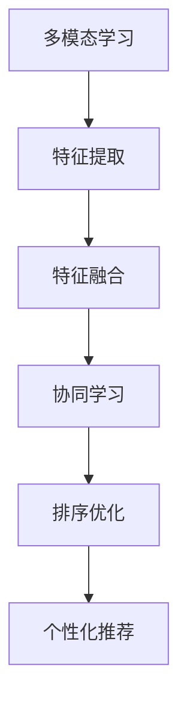

                 

# 电商搜索中的多模态商品排序个性化技术

## 1. 背景介绍

### 1.1 问题由来

在电商搜索领域，用户通过查询词来寻找商品，搜索结果需要根据用户意图和偏好进行排序，以提高用户的搜索体验和满意度。然而，传统的商品排序算法通常基于单一的查询词向量化特征进行排序，忽视了商品的其他属性，如价格、评价、销量、标签等，难以满足用户个性化和多模态的需求。

近年来，随着深度学习技术的发展，多模态学习成为热门研究话题。多模态学习旨在融合不同类型的数据模态，通过协同学习提升模型性能，适应多样化的数据结构和用户需求。在大规模电商数据中，商品信息往往包含文字描述、图片、评价等多模态数据，充分利用这些数据进行商品排序将有效提升个性化推荐的效果。

### 1.2 问题核心关键点

多模态商品排序个性化技术的研究关键点包括：

- 如何从不同模态中提取有意义的特征表示，并构建多模态特征空间。
- 如何在多模态特征空间中融合各模态信息，并建模用户偏好。
- 如何对多模态数据进行表示学习和排序优化，以适应电商搜索场景。
- 如何优化排序算法以提高个性化推荐效果。

本文将详细介绍如何利用多模态学习技术，通过融合文本、图片、评价等不同类型的数据，构建高质量的商品表示，并通过排序算法个性化推荐商品给用户。

## 2. 核心概念与联系

### 2.1 核心概念概述

为了更好地理解多模态商品排序个性化技术，本节将介绍几个密切相关的核心概念：

- **多模态学习(Multimodal Learning)**：涉及多种类型的数据（如图像、文本、音频），融合多源数据提高模型性能。
- **特征提取(Feature Extraction)**：从原始数据中提取有意义的特征，以便进行后续的建模和分析。
- **特征融合(Feature Fusion)**：将不同类型的数据特征融合在一起，构建统一的表示空间。
- **协同学习(Collaborative Learning)**：通过用户行为数据学习用户偏好，提升个性化推荐效果。
- **排序优化(Ranking Optimization)**：对商品进行排序，以提高用户的点击率和满意度。

这些概念之间的逻辑关系可以通过以下Mermaid流程图来展示：



这个流程图展示多模态商品排序个性化技术的核心概念及其之间的关系：

1. 多模态学习从不同模态中提取特征。
2. 特征融合将提取的特征融合在一起，构建统一的表示空间。
3. 协同学习利用用户行为数据学习用户偏好。
4. 排序优化对商品进行排序。
5. 个性化推荐根据排序结果推荐商品给用户。

## 3. 核心算法原理 & 具体操作步骤
### 3.1 算法原理概述

多模态商品排序个性化技术的基本原理是通过融合商品的不同模态信息，构建多模态特征空间，并在此基础上利用协同学习技术，学习用户偏好，进而对商品进行排序，以提高个性化推荐的效果。

形式化地，假设输入为多模态数据 $X=\{x_i\}_{i=1}^N$，其中 $x_i=(x_{i,1},x_{i,2},\dots,x_{i,m})$ 表示商品 $i$ 的不同模态信息，如价格 $x_{i,1}$、销量 $x_{i,2}$、评价 $x_{i,3}$ 等。目标是构建多模态特征空间 $Z=\{z_i\}_{i=1}^N$，在此基础上学习用户偏好，对商品进行排序。

模型训练过程主要包括以下几个步骤：

1. 特征提取：从不同模态中提取特征。
2. 特征融合：将提取的特征融合在一起，构建多模态特征空间。
3. 协同学习：利用用户行为数据学习用户偏好。
4. 排序优化：对商品进行排序。
5. 个性化推荐：根据排序结果推荐商品给用户。

### 3.2 算法步骤详解

下面详细解释基于多模态学习技术进行商品排序个性化的算法步骤：

**Step 1: 特征提取**

对于文本模态，可以使用基于BERT、GPT等预训练语言模型的特征提取器，将查询词和商品描述转换成向量表示。对于图片模态，可以使用卷积神经网络(CNN)提取图片特征。对于评价模态，可以将其转换为文本，再通过预训练语言模型提取特征。

**Step 2: 特征融合**

特征融合通常使用深度学习技术，如卷积神经网络(CNN)、循环神经网络(RNN)等，将不同模态的特征进行融合。常用的融合方法包括拼接、逐层连接、注意力机制等。

**Step 3: 协同学习**

协同学习旨在利用用户行为数据，学习用户对商品的偏好。常见的协同学习算法包括基于用户的协同过滤(User-Based Collaborative Filtering)、基于物品的协同过滤(Item-Based Collaborative Filtering)、混合协同过滤等。

**Step 4: 排序优化**

排序优化通常使用排序学习算法，如基于梯度提升的排序算法、基于深度学习的排序算法等，对商品进行排序。排序优化过程中，需要设计合适的损失函数，如点击率损失、点击率-转化率损失等，以及优化算法，如随机梯度下降(SGD)、Adam等。

**Step 5: 个性化推荐**

个性化推荐基于排序结果，利用推荐系统算法，如基于协同过滤的推荐算法、基于深度学习的推荐算法等，推荐合适的商品给用户。

### 3.3 算法优缺点

多模态商品排序个性化技术有以下优点：

1. 融合多模态信息：利用多种类型的数据提升模型性能，适应更多数据结构和用户需求。
2. 提高个性化推荐效果：通过学习用户偏好，提供更加个性化的推荐。
3. 提升用户体验：根据用户行为数据进行排序，提高用户的满意度。

同时，该方法也存在以下局限性：

1. 数据获取难度大：需要获取多种类型的数据，包括文本、图片、评价等，存在数据获取和处理的难度。
2. 数据质量要求高：不同类型的数据质量和格式可能不一致，需要处理和清洗。
3. 模型复杂度高：需要构建多模态特征空间和融合机制，模型训练和推理较复杂。
4. 需要大量计算资源：需要大量的计算资源进行特征提取、特征融合和排序优化。

尽管存在这些局限性，但就目前而言，多模态商品排序个性化技术在电商搜索领域显示出良好的应用前景。

### 3.4 算法应用领域

多模态商品排序个性化技术在电商搜索领域有广泛应用，具体包括：

- 商品排序：根据用户的查询词和行为数据，对商品进行排序，提高用户的点击率和满意度。
- 个性化推荐：根据用户的偏好和历史行为，推荐合适的商品，提升用户的购买转化率。
- 广告投放：利用多模态特征，对广告进行排序，优化广告投放效果。
- 搜索补全：根据用户的查询词，推荐相关的商品，提升用户的搜索体验。
- 库存管理：利用用户的购买历史，预测商品需求，优化库存管理。

除了电商搜索，多模态商品排序个性化技术在其他场景中也有广泛应用，如社交网络、在线教育、智能交通等，为这些领域提供了新的解决方案。

## 4. 数学模型和公式 & 详细讲解 & 举例说明

### 4.1 数学模型构建

本节将使用数学语言对多模态商品排序个性化方法进行更加严格的刻画。

记输入为多模态数据 $X=\{x_i\}_{i=1}^N$，其中 $x_i=(x_{i,1},x_{i,2},\dots,x_{i,m})$ 表示商品 $i$ 的不同模态信息。设多模态特征空间为 $Z=\{z_i\}_{i=1}^N$，其中 $z_i=(f_{i,1},f_{i,2},\dots,f_{i,k})$ 表示商品 $i$ 在多模态特征空间中的表示，$f_{i,j}$ 表示第 $j$ 个特征。设用户对商品的评分向量为 $U \in \mathbb{R}^k$，其中 $U_j$ 表示用户对第 $j$ 个特征的评分。

多模态商品排序模型 $M$ 的目标是最大化用户对商品的评分：

$$
M = \mathop{\arg\max}_{M} \sum_{i=1}^N \log(1 + e^{U^Tf_i})
$$

其中 $f_i \in Z$ 表示商品 $i$ 的多模态特征表示，$e$ 表示自然指数函数。

### 4.2 公式推导过程

以下我们以商品排序为例，推导排序模型的损失函数及其梯度计算公式。

假设商品 $i$ 的评分向量为 $U$，多模态特征表示为 $f_i$，排序模型为 $M$。则排序模型的输出为 $s_i = M(f_i)$，表示商品 $i$ 的排序得分。假设真实标签为 $y_i$，则排序模型的损失函数为：

$$
\ell(s_i, y_i) = \log(1 + e^{s_i(y_i-1)})
$$

将其代入经验风险公式，得：

$$
\mathcal{L}(M) = \frac{1}{N}\sum_{i=1}^N \ell(s_i, y_i)
$$

根据链式法则，排序模型 $M$ 的梯度为：

$$
\frac{\partial \mathcal{L}(M)}{\partial f_i} = \sum_{i=1}^N \frac{\partial \ell(s_i, y_i)}{\partial s_i} \frac{\partial s_i}{\partial f_i}
$$

其中 $\frac{\partial \ell(s_i, y_i)}{\partial s_i}$ 表示损失函数对排序得分 $s_i$ 的梯度，$\frac{\partial s_i}{\partial f_i}$ 表示排序得分对多模态特征 $f_i$ 的梯度。

在得到排序模型的梯度后，即可带入梯度下降算法，完成模型的迭代优化。重复上述过程直至收敛，最终得到排序模型。

### 4.3 案例分析与讲解

下面以一个简单的电商搜索场景为例，分析如何使用多模态商品排序个性化技术进行商品推荐。

假设用户输入查询词为 "手机"，系统检索到相关商品，包括价格、销量、评价等不同模态的数据。

1. **特征提取**：使用BERT模型提取查询词和商品描述的向量表示，使用CNN提取图片特征，使用预训练语言模型提取评价文本的向量表示。

2. **特征融合**：将提取的向量进行拼接或注意力融合，构建多模态特征表示。

3. **协同学习**：利用用户的历史行为数据，学习用户对不同模态特征的评分，构建评分向量 $U$。

4. **排序优化**：使用基于梯度提升的排序算法，对商品进行排序，得到排序得分 $s_i$。

5. **个性化推荐**：根据排序得分，推荐排名靠前的商品给用户。

## 5. 项目实践：代码实例和详细解释说明
### 5.1 开发环境搭建

在进行多模态商品排序个性化技术的实践前，我们需要准备好开发环境。以下是使用Python进行TensorFlow开发的环境配置流程：

1. 安装Anaconda：从官网下载并安装Anaconda，用于创建独立的Python环境。

2. 创建并激活虚拟环境：
```bash
conda create -n tf-env python=3.8 
conda activate tf-env
```

3. 安装TensorFlow：根据CUDA版本，从官网获取对应的安装命令。例如：
```bash
conda install tensorflow tensorflow-gpu=2.4.0 -c pytorch -c conda-forge
```

4. 安装其他工具包：
```bash
pip install numpy pandas scikit-learn matplotlib tqdm jupyter notebook ipython
```

完成上述步骤后，即可在`tf-env`环境中开始多模态商品排序个性化技术的开发实践。

### 5.2 源代码详细实现

下面我们以电商搜索场景为例，给出使用TensorFlow进行多模态商品排序个性化技术的PyTorch代码实现。

首先，定义数据处理函数：

```python
import tensorflow as tf
from tensorflow.keras.layers import Input, Embedding, Dense, Conv2D, Flatten, Concatenate
from tensorflow.keras.models import Model

def create_model(input_dim, hidden_dim, output_dim):
    # 定义输入层
    query_input = Input(shape=(input_dim,))
    item_input = Input(shape=(max_len,))

    # 文本特征提取
    query_embedding = Embedding(input_dim, hidden_dim)(query_input)
    query_feature = Flatten()(query_embedding)

    # 图片特征提取
    item_embedding = Conv2D(hidden_dim, (3, 3), activation='relu')(item_input)
    item_feature = Flatten()(item_embedding)

    # 融合特征
    concat_input = Concatenate()([query_feature, item_feature])

    # 评分预测
    score = Dense(hidden_dim, activation='relu')(concat_input)
    score = Dense(output_dim, activation='softmax')(score)

    # 定义模型
    model = Model(inputs=[query_input, item_input], outputs=score)
    return model
```

然后，定义训练和评估函数：

```python
from tensorflow.keras.preprocessing.sequence import pad_sequences
from sklearn.metrics import accuracy_score

def train_epoch(model, train_dataset, batch_size, optimizer):
    model.compile(optimizer=optimizer, loss='categorical_crossentropy', metrics=['accuracy'])
    model.fit(train_dataset, epochs=10, batch_size=batch_size, validation_split=0.2)

def evaluate(model, test_dataset, batch_size):
    test_dataset = pad_sequences(test_dataset, maxlen=max_len, padding='post', truncating='post')
    y_true = test_dataset.labels
    y_pred = model.predict(test_dataset)
    accuracy = accuracy_score(y_true, y_pred.argmax(axis=1))
    return accuracy
```

最后，启动训练流程并在测试集上评估：

```python
input_dim = 1000  # 查询词向量化维度
hidden_dim = 128  # 特征融合隐藏层维度
output_dim = 10   # 商品评分维度

model = create_model(input_dim, hidden_dim, output_dim)
optimizer = tf.keras.optimizers.Adam()

max_len = 10  # 文本序列最大长度
train_dataset = load_train_data()  # 加载训练数据
test_dataset = load_test_data()  # 加载测试数据

train_epoch(model, train_dataset, batch_size, optimizer)
accuracy = evaluate(model, test_dataset, batch_size)
print(f"Accuracy: {accuracy:.2f}")
```

以上就是使用TensorFlow进行多模态商品排序个性化技术的完整代码实现。可以看到，TensorFlow提供了丰富的深度学习组件，可以方便地实现多模态特征提取、特征融合和评分预测等过程。

### 5.3 代码解读与分析

让我们再详细解读一下关键代码的实现细节：

**create_model函数**：
- 定义输入层：输入查询词和商品图片数据。
- 文本特征提取：使用Embedding层将查询词向量化，再使用Flatten层进行展平。
- 图片特征提取：使用卷积层提取商品图片的特征。
- 融合特征：使用Concatenate层将文本和图片特征拼接。
- 评分预测：使用Dense层进行评分预测，输出softmax分布。
- 定义模型：将输入和输出连接，返回模型。

**train_epoch函数**：
- 编译模型：设置优化器和损失函数。
- 训练模型：在训练集上训练模型，设置验证集比例为20%。

**evaluate函数**：
- 对测试集进行序列填充。
- 获取真实标签和预测标签。
- 计算准确率。

**训练流程**：
- 设置模型参数和训练数据。
- 训练模型，并在测试集上评估。

可以看到，TensorFlow提供了丰富的组件和灵活的模型构建方法，使得多模态商品排序个性化技术的实现变得相对简单。

当然，工业级的系统实现还需考虑更多因素，如模型的保存和部署、超参数的自动搜索、更灵活的任务适配层等。但核心的多模态商品排序范式基本与此类似。

## 6. 实际应用场景
### 6.1 智能推荐系统

多模态商品排序个性化技术在智能推荐系统中有广泛应用，可以显著提升推荐效果和用户满意度。

智能推荐系统通过用户的历史行为数据和当前查询词，推荐用户可能感兴趣的商品。传统的推荐系统通常只依赖单一的数据模态，如评分、点击等，无法充分利用商品的其他属性信息。而通过融合文本、图片、评价等多模态数据，可以更全面地理解用户偏好，提高推荐准确性。

例如，在电商推荐系统中，可以融合商品价格、销量、评价、图片等特征，学习用户对不同模态特征的评分，对商品进行排序，推荐用户可能感兴趣的商品。多模态学习使得推荐系统能够适应更多数据结构和用户需求，提供更个性化、多样化的推荐。

### 6.2 图像检索

在图像检索系统中，用户输入查询词或图片，检索系统需要根据查询特征，找到最相似的图像。传统的图像检索方法通常只考虑图像的视觉特征，而忽略其他语义信息。通过融合图像的视觉特征和描述文本特征，可以更好地理解图像的语义信息，提高检索准确性。

例如，在图像检索系统中，可以融合图像的视觉特征和商品描述文本特征，构建多模态特征空间，对图像进行排序，找到最相似的图像。多模态学习使得图像检索系统能够更全面地理解图像信息，提高检索效果。

### 6.3 社交网络

在社交网络中，用户发布动态、评论、图片等信息，系统需要根据用户的行为数据，推荐可能感兴趣的内容。传统的社交网络推荐方法通常只考虑用户的兴趣和行为数据，而忽略其他特征。通过融合用户的兴趣数据、图片数据、评论数据等多模态数据，可以更全面地理解用户偏好，提高推荐准确性。

例如，在社交网络推荐系统中，可以融合用户的兴趣数据、图片数据、评论数据等多模态数据，构建多模态特征空间，对内容进行排序，推荐用户可能感兴趣的内容。多模态学习使得社交网络推荐系统能够更全面地理解用户偏好，提高推荐效果。

## 7. 工具和资源推荐
### 7.1 学习资源推荐

为了帮助开发者系统掌握多模态商品排序个性化技术，这里推荐一些优质的学习资源：

1. TensorFlow官方文档：提供了丰富的深度学习组件和示例，是学习多模态学习的重要参考资料。

2. PyTorch官方文档：提供了强大的深度学习框架和组件，是学习深度学习的重要工具。

3. 《深度学习入门：基于Python的理论与实现》书籍：介绍了深度学习的基本概念和实现方法，适合初学者入门。

4. 《TensorFlow实战》书籍：介绍了TensorFlow的实践方法和应用场景，适合有一定基础的开发者。

5. 《动手学深度学习》书籍：介绍了深度学习的理论和实践方法，适合深入学习。

通过对这些资源的学习实践，相信你一定能够快速掌握多模态商品排序个性化技术的精髓，并用于解决实际的电商搜索问题。

### 7.2 开发工具推荐

高效的开发离不开优秀的工具支持。以下是几款用于多模态商品排序个性化开发的常用工具：

1. TensorFlow：由Google主导开发的开源深度学习框架，生产部署方便，适合大规模工程应用。

2. PyTorch：基于Python的开源深度学习框架，灵活便捷，适合快速迭代研究。

3. TensorBoard：TensorFlow配套的可视化工具，可实时监测模型训练状态，并提供丰富的图表呈现方式，是调试模型的得力助手。

4. Weights & Biases：模型训练的实验跟踪工具，可以记录和可视化模型训练过程中的各项指标，方便对比和调优。

5. Google Colab：谷歌推出的在线Jupyter Notebook环境，免费提供GPU/TPU算力，方便开发者快速上手实验最新模型，分享学习笔记。

合理利用这些工具，可以显著提升多模态商品排序个性化技术的开发效率，加快创新迭代的步伐。

### 7.3 相关论文推荐

多模态商品排序个性化技术的发展源于学界的持续研究。以下是几篇奠基性的相关论文，推荐阅读：

1. "A Survey on Deep Learning for Multi-modal Image Retrieval"：综述了多模态图像检索的深度学习方法。

2. "Multi-modal Learning for Recommendation Systems"：综述了多模态推荐系统的研究现状和趋势。

3. "A Generalized Learning Framework for Multi-modal Recommendations"：提出了一种通用的多模态推荐框架，用于融合多种类型的数据。

4. "A Deep Multimodal Collaborative Filtering Model"：提出了一种基于深度学习的协作过滤模型，用于多模态推荐。

5. "A Multi-modal Collaborative Filtering Algorithm for Recommendation System"：提出了一种基于多模态协作过滤的推荐算法，用于推荐系统。

这些论文代表了大语言模型微调技术的发展脉络。通过学习这些前沿成果，可以帮助研究者把握学科前进方向，激发更多的创新灵感。

## 8. 总结：未来发展趋势与挑战

### 8.1 总结

本文对多模态商品排序个性化技术进行了全面系统的介绍。首先阐述了多模态商品排序个性化技术的研究背景和意义，明确了融合多模态数据在电商搜索场景中的重要性。其次，从原理到实践，详细讲解了多模态商品排序个性化技术的数学原理和关键步骤，给出了多模态商品排序个性化技术的完整代码实例。同时，本文还广泛探讨了多模态商品排序技术在智能推荐系统、图像检索、社交网络等不同场景中的应用前景，展示了多模态学习范式的广阔应用空间。此外，本文精选了多模态学习技术的各类学习资源，力求为读者提供全方位的技术指引。

通过本文的系统梳理，可以看到，多模态商品排序个性化技术正在成为电商搜索领域的重要范式，极大地拓展了商品排序模型的应用边界，催生了更多的落地场景。得益于深度学习技术的不断发展，多模态学习在融合多种数据模态、提升模型性能方面展现出巨大的潜力，未来必将在更多领域得到广泛应用。

### 8.2 未来发展趋势

展望未来，多模态商品排序个性化技术将呈现以下几个发展趋势：

1. 多模态融合技术进一步提升。随着深度学习技术的发展，多模态融合技术将更加高效和灵活，可以更好地融合多种数据模态，提升模型的泛化性能。

2. 协同学习算法不断优化。协同学习算法将不断优化，通过更精准的用户行为建模，提高个性化推荐的效果。

3. 排序优化算法更高效。排序优化算法将不断优化，通过更高效的排序模型和算法，提升推荐效果。

4. 应用场景不断拓展。多模态商品排序个性化技术将在更多领域得到应用，如智慧城市、智能医疗、智能交通等，为这些领域提供新的解决方案。

5. 跨模态对齐技术发展。跨模态对齐技术将不断优化，使得不同模态的数据能够更好地对齐，提升多模态特征表示的质量。

以上趋势凸显了多模态商品排序个性化技术的广阔前景。这些方向的探索发展，必将进一步提升多模态学习模型的性能和应用范围，为电商搜索等应用场景提供更强大的支持。

### 8.3 面临的挑战

尽管多模态商品排序个性化技术已经取得了瞩目成就，但在迈向更加智能化、普适化应用的过程中，它仍面临着诸多挑战：

1. 数据获取难度大。多模态数据获取难度较大，需要处理和清洗不同类型的数据，存在数据质量问题。

2. 模型复杂度高。多模态模型通常包含多个子模块，模型训练和推理复杂度较高。

3. 计算资源需求高。多模态商品排序个性化技术需要大量的计算资源进行特征提取、特征融合和排序优化。

4. 鲁棒性不足。多模态商品排序模型面对不同的数据分布和噪声干扰，可能产生不稳定预测。

5. 可解释性有待加强。多模态商品排序模型通常较为复杂，难以解释其内部工作机制和决策逻辑。

尽管存在这些挑战，但多模态商品排序个性化技术具有广阔的应用前景，相信随着学界和产业界的共同努力，这些挑战终将一一被克服，多模态学习技术必将在更多领域得到应用，为人类生活带来更多便利和创新。

### 8.4 研究展望

面对多模态商品排序个性化技术所面临的挑战，未来的研究需要在以下几个方面寻求新的突破：

1. 引入更多的先验知识。将符号化的先验知识，如知识图谱、逻辑规则等，与神经网络模型进行巧妙融合，引导多模态学习过程。

2. 研究更高效的多模态融合方法。开发更加高效的多模态融合技术，减少特征提取和融合的时间复杂度，提高训练效率。

3. 研究跨模态对齐技术。开发更好的跨模态对齐方法，使得不同模态的数据能够更好地对齐，提升多模态特征表示的质量。

4. 研究更鲁棒的协同学习算法。开发更加鲁棒的协同学习算法，避免模型过拟合，提高模型泛化性能。

5. 引入更多的优化目标。引入更多的优化目标，如点击率-转化率、用户满意度等，提升推荐效果。

6. 研究更高效的排序优化算法。开发更高效的排序优化算法，提升推荐效果。

这些研究方向的探索，必将引领多模态商品排序个性化技术迈向更高的台阶，为构建安全、可靠、可解释、可控的智能系统铺平道路。面向未来，多模态商品排序个性化技术还需要与其他人工智能技术进行更深入的融合，如知识表示、因果推理、强化学习等，多路径协同发力，共同推动自然语言理解和智能交互系统的进步。只有勇于创新、敢于突破，才能不断拓展语言模型的边界，让智能技术更好地造福人类社会。

## 9. 附录：常见问题与解答

**Q1：多模态商品排序个性化技术适用于所有电商场景吗？**

A: 多模态商品排序个性化技术适用于大部分电商场景，尤其是涉及多模态数据的应用场景。但对于一些简单的小型电商，由于商品种类较少，数据量不足，可能效果不理想。此时可以考虑只使用单一的数据模态进行推荐。

**Q2：如何选择合适的模型结构？**

A: 选择合适的模型结构需要考虑以下几个因素：
1. 数据类型：不同类型的数据需要使用不同的模型结构，如图像数据通常使用卷积神经网络，文本数据通常使用循环神经网络。
2. 任务类型：不同的任务需要使用不同的模型结构，如推荐任务通常使用深度学习模型，图像检索任务通常使用深度神经网络。
3. 数据规模：数据规模较大时，可以使用分布式训练，提升训练效率。

选择合适的模型结构需要根据具体应用场景和数据特点进行灵活组合，并进行实验验证。

**Q3：模型如何避免过拟合？**

A: 模型避免过拟合可以采取以下措施：
1. 数据增强：通过数据增强技术，增加数据多样性，减少过拟合。
2. 正则化：使用L2正则、Dropout等正则化技术，减少过拟合。
3. 早停法：在验证集上监测模型性能，一旦性能不再提升，立即停止训练。
4. 模型裁剪：使用模型裁剪技术，减少模型复杂度，避免过拟合。

这些措施可以综合应用，根据具体任务和数据特点进行灵活组合。

**Q4：模型如何部署和优化？**

A: 模型部署和优化需要考虑以下几个因素：
1. 模型裁剪：使用模型裁剪技术，减少模型大小，提升部署效率。
2. 量化加速：将模型量化为定点模型，压缩存储空间，提升计算效率。
3. 服务化封装：将模型封装为标准化服务接口，方便集成调用。
4. 弹性伸缩：根据请求流量动态调整资源配置，平衡服务质量和成本。

合理利用这些优化措施，可以提升模型的部署效率和性能，满足实际应用需求。

**Q5：多模态商品排序个性化技术有哪些应用场景？**

A: 多模态商品排序个性化技术适用于以下场景：
1. 智能推荐系统：根据用户的历史行为数据和当前查询词，推荐用户可能感兴趣的商品。
2. 图像检索：根据查询特征，找到最相似的图像。
3. 社交网络：根据用户的行为数据，推荐可能感兴趣的内容。
4. 金融服务：根据用户的交易记录，推荐可能感兴趣的产品。
5. 智能客服：根据用户的咨询历史，推荐可能感兴趣的问题。

除了电商搜索，多模态商品排序个性化技术在更多领域都有广泛应用，如智慧城市、智能医疗、智能交通等。

---

作者：禅与计算机程序设计艺术 / Zen and the Art of Computer Programming

