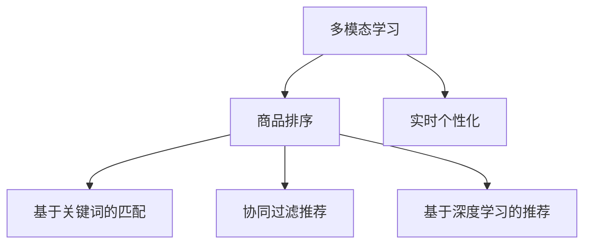

                 

# 电商搜索中的多模态商品排序实时个性化技术

> 关键词：多模态学习,商品排序,电商搜索,实时个性化,深度学习

## 1. 背景介绍

### 1.1 问题由来

随着电子商务的飞速发展，电商搜索已成为用户获取商品信息、进行购买决策的关键途径。然而，传统的基于关键词匹配的搜索算法已难以满足日益丰富的商品描述和用户需求。如何构建更智能、更个性化的电商搜索系统，是电商行业面临的重要挑战。

### 1.2 问题核心关键点

电商搜索中的商品排序优化，是提升用户购物体验、提高转化率的关键。当前的主要技术包括：

- 基于关键词的匹配算法：通过用户输入的查询词与商品标题、描述等文本信息进行匹配，简单高效，但缺乏对商品多维信息的全面理解。
- 协同过滤推荐算法：利用用户行为数据进行推荐，但难以处理非结构化数据，且易陷入冷启动问题。
- 基于深度学习的推荐系统：通过神经网络模型对用户行为数据、商品特征等进行深度学习，实现更精细的推荐，但计算资源消耗较大，模型训练和推理速度较慢。

因此，构建基于多模态数据的实时个性化商品排序算法，成为电商搜索优化的一个重要方向。多模态数据融合和深度学习结合，将大幅提升商品排序的精度和个性化程度，为用户带来更满意的搜索体验。

## 2. 核心概念与联系

### 2.1 核心概念概述

为更好地理解电商搜索中的多模态商品排序技术，本节将介绍几个密切相关的核心概念：

- **多模态学习（Multimodal Learning）**：指同时利用多种类型的数据（如图像、文本、语音等）进行深度学习建模，提高模型对不同信息的综合理解能力。
- **商品排序（Product Ranking）**：指对电商平台上众多商品按照其与用户查询的相关性进行排序，以优化搜索结果和提升用户满意度。
- **实时个性化（Real-time Personalization）**：指在用户每次搜索时，动态调整商品排序策略，根据用户的历史行为、兴趣偏好等个性化特征，提供更贴合用户需求的搜索结果。
- **深度学习（Deep Learning）**：基于神经网络模型进行大数据学习，具有强大的特征提取和模式识别能力，适合处理复杂的电商搜索问题。

这些核心概念之间的逻辑关系可以通过以下Mermaid流程图来展示：



这个流程图展示了大语言模型微调的核心概念及其之间的关系：

1. 多模态学习是商品排序的基础，通过融合不同模态的数据，增强模型的理解能力。
2. 商品排序是电商搜索的核心目标，通过排序算法优化搜索结果，提升用户满意度。
3. 实时个性化是电商搜索的优化方向，通过动态调整排序策略，实现个性化推荐。
4. 深度学习是实现多模态商品排序的关键技术，通过神经网络模型进行复杂特征提取和建模。

## 3. 核心算法原理 & 具体操作步骤

### 3.1 算法原理概述

电商搜索中的多模态商品排序算法，通过融合用户查询文本、商品图片、用户行为等多维数据，构建深度神经网络模型，实现商品的精细化排序和个性化推荐。

形式化地，假设用户输入查询文本为 $q$，商品为 $p$，用户历史行为特征为 $u$。多模态商品排序的目标是最大化以下目标函数：

$$
\max_{\theta} \sum_{(q, p, u)} \log P(q, p, u; \theta)
$$

其中，$P(q, p, u; \theta)$ 表示基于模型参数 $\theta$ 的联合概率分布，最大化该分布能够提高模型的预测精度和个性化推荐能力。

在实际操作中，多模态商品排序算法通常分为以下几个步骤：

1. **数据预处理**：将查询文本、商品图片、用户行为等数据转换为模型可处理的格式。
2. **特征提取**：通过深度神经网络模型，对不同模态的数据进行特征提取。
3. **模型训练**：使用最大化联合概率分布的目标函数，对模型参数进行优化。
4. **实时排序**：根据用户输入查询实时计算商品排序结果，动态调整推荐策略。

### 3.2 算法步骤详解

**Step 1: 数据预处理**

多模态数据的预处理目标是将其转换为深度学习模型可接受的输入格式。具体步骤如下：

- **文本数据**：将用户查询文本和商品描述等文本数据进行分词、去停用词、TF-IDF等处理，转换为向量表示。
- **图片数据**：将商品图片经过特征提取（如CNN卷积神经网络）转换为固定长度的特征向量。
- **行为数据**：将用户历史行为数据（如浏览记录、购买历史等）进行归一化、特征选择等处理，转换为向量表示。

**Step 2: 特征提取**

通过深度神经网络模型，对多模态数据进行特征提取。具体步骤如下：

- **文本特征提取**：使用双向LSTM、Transformer等模型对文本数据进行编码，得到文本向量表示。
- **图片特征提取**：使用CNN卷积神经网络对商品图片进行特征提取，得到固定长度的特征向量。
- **行为特征提取**：使用RNN、GRU等序列模型对用户行为数据进行编码，得到行为向量表示。

**Step 3: 模型训练**

使用最大化联合概率分布的目标函数，对模型参数进行优化。具体步骤如下：

- **模型选择**：选择合适的深度神经网络模型，如Multi-head Attention、BERT等，作为联合概率分布的参数化模型。
- **损失函数**：设计损失函数，如交叉熵损失、均方误差损失等，衡量模型预测与实际标签之间的差异。
- **优化算法**：使用基于梯度的优化算法（如AdamW、SGD等）对模型参数进行优化。

**Step 4: 实时排序**

根据用户输入查询实时计算商品排序结果，动态调整推荐策略。具体步骤如下：

- **输入文本**：将用户输入查询转换为向量表示，输入模型进行计算。
- **特征融合**：将输入文本与商品图片、行为特征等数据进行融合，生成融合特征向量。
- **实时排序**：根据融合特征向量计算商品排序结果，动态调整推荐策略，返回排序后的商品列表。

### 3.3 算法优缺点

基于深度学习的多模态商品排序算法具有以下优点：

- **高精度**：深度神经网络模型能够提取复杂的特征，提升商品排序的准确性。
- **多模态融合**：融合文本、图片、行为等多模态数据，全面理解商品和用户，提高推荐精度。
- **实时个性化**：动态调整排序策略，实现个性化推荐，提升用户满意度。
- **适应性强**：模型参数可实时更新，适应不同用户和场景的变化。

同时，该算法也存在以下缺点：

- **计算资源消耗大**：深度学习模型需要大量计算资源进行训练和推理，易受硬件瓶颈制约。
- **数据要求高**：需要大量的标注数据和多模态数据进行训练，数据获取成本较高。
- **模型复杂度高**：模型结构复杂，参数量庞大，维护和优化难度大。
- **泛化能力有限**：在面对新用户和冷启动问题时，模型可能无法有效应用，需要进行额外优化。

尽管存在这些缺点，但基于深度学习的多模态商品排序算法在电商搜索场景中仍具有巨大的应用潜力。未来相关研究的重点在于如何进一步降低计算资源消耗，提高模型泛化能力，同时兼顾实时性和可解释性。

### 3.4 算法应用领域

基于深度学习的多模态商品排序算法，在电商搜索领域已得到广泛应用，具体包括：

- **商品排序优化**：通过多模态融合和深度学习，对搜索结果进行优化，提升用户满意度。
- **个性化推荐**：根据用户行为和兴趣特征，实现个性化商品推荐，增加用户粘性。
- **智能客服**：通过用户查询输入和行为数据，实现智能客服，提供个性化的购物咨询和建议。
- **广告推荐**：根据用户兴趣和行为数据，实时调整广告推荐策略，提高广告投放效果。

## 4. 数学模型和公式 & 详细讲解 & 举例说明

### 4.1 数学模型构建

本节将使用数学语言对电商搜索中的多模态商品排序算法进行更加严格的刻画。

假设用户输入查询文本为 $q$，商品为 $p$，用户历史行为特征为 $u$。设 $f_q(\cdot)$、$f_p(\cdot)$ 和 $f_u(\cdot)$ 分别为文本、图片和行为特征的映射函数，得到文本特征 $x_q$、图片特征 $x_p$ 和行为特征 $x_u$。设 $M(\cdot)$ 为多模态深度神经网络模型，将输入特征向量映射为联合概率分布 $P(q, p, u; \theta)$，其中 $\theta$ 为模型参数。

定义模型 $M(\cdot)$ 在输入 $(x_q, x_p, x_u)$ 上的损失函数为：

$$
\mathcal{L}(\theta) = -\sum_{(q, p, u)} \log P(q, p, u; \theta)
$$

其中，$\log P(q, p, u; \theta)$ 为模型在联合概率分布上的对数似然损失函数，衡量模型预测与实际标签之间的差异。

### 4.2 公式推导过程

以下我们以商品排序为例，推导最大化联合概率分布的目标函数及其梯度计算。

假设模型 $M(\cdot)$ 在输入 $(x_q, x_p, x_u)$ 上的输出为 $\hat{y}$，表示商品 $p$ 与查询 $q$ 和用户 $u$ 的相关性得分。设 $\hat{y} = \text{softmax}(f_M(x_q, x_p, x_u; \theta))$，其中 $f_M(\cdot; \theta)$ 为模型的输出函数，$\text{softmax}(\cdot)$ 为softmax函数。

则最大化联合概率分布的目标函数为：

$$
\max_{\theta} \sum_{(q, p, u)} f_M(x_q, x_p, x_u; \theta) \cdot \log y_p
$$

其中 $y_p$ 为 $p$ 商品的实际排序标签。

根据链式法则，联合概率分布对模型参数 $\theta$ 的梯度为：

$$
\nabla_{\theta}\mathcal{L}(\theta) = \sum_{(q, p, u)} \nabla_{\theta}f_M(x_q, x_p, x_u; \theta) \cdot \nabla_{\hat{y}}\log y_p \cdot \hat{y}
$$

其中 $\nabla_{\hat{y}}\log y_p$ 为 $p$ 商品的实际排序标签 $y_p$ 的导数，$\hat{y}$ 为模型的预测输出。

通过上述公式，可以求得联合概率分布对模型参数的梯度，进一步使用基于梯度的优化算法进行参数更新，完成模型的迭代优化。

### 4.3 案例分析与讲解

以下以一个电商搜索场景为例，展示基于深度学习的多模态商品排序算法的工作流程。

假设用户输入查询为“运动鞋”，系统需要从数以万计的商品中推荐最相关的商品。具体步骤如下：

1. **数据预处理**：
   - 将用户查询文本“运动鞋”进行分词、去停用词、TF-IDF等处理，得到文本特征向量 $x_q$。
   - 将商品图片 $p$ 进行特征提取，得到图片特征向量 $x_p$。
   - 将用户历史行为数据 $u$ 进行归一化、特征选择等处理，得到行为特征向量 $x_u$。

2. **特征提取**：
   - 使用双向LSTM模型对文本特征 $x_q$ 进行编码，得到文本特征向量 $x_q'$。
   - 使用CNN卷积神经网络对图片特征 $x_p$ 进行特征提取，得到固定长度的图片特征向量 $x_p'$。
   - 使用RNN模型对行为特征 $x_u$ 进行编码，得到行为特征向量 $x_u'$。

3. **模型训练**：
   - 将提取的文本、图片和行为特征向量 $(x_q', x_p', x_u')$ 输入多模态深度神经网络模型 $M(\cdot)$，计算联合概率分布 $P(q, p, u; \theta)$。
   - 使用交叉熵损失函数 $\mathcal{L}(\theta)$ 衡量模型预测与实际标签之间的差异。
   - 使用AdamW优化算法对模型参数 $\theta$ 进行优化。

4. **实时排序**：
   - 用户输入查询“运动鞋”，将查询文本转换为向量表示 $x_q'$。
   - 将用户查询文本 $x_q'$、商品图片 $x_p'$ 和行为特征 $x_u'$ 进行融合，得到融合特征向量 $x_{fused}$。
   - 根据融合特征向量 $x_{fused}$ 计算商品排序得分 $\hat{y}$。
   - 根据排序得分 $\hat{y}$ 对商品列表进行排序，返回前N个推荐商品。

通过以上步骤，电商搜索系统能够根据用户输入查询实时计算商品排序结果，动态调整推荐策略，实现个性化推荐。

## 5. 项目实践：代码实例和详细解释说明

### 5.1 开发环境搭建

在进行电商搜索优化实践前，我们需要准备好开发环境。以下是使用Python进行TensorFlow开发的环境配置流程：

1. 安装Anaconda：从官网下载并安装Anaconda，用于创建独立的Python环境。

2. 创建并激活虚拟环境：
```bash
conda create -n tf-env python=3.8 
conda activate tf-env
```

3. 安装TensorFlow：根据CUDA版本，从官网获取对应的安装命令。例如：
```bash
pip install tensorflow==2.7
```

4. 安装TensorBoard：TensorFlow配套的可视化工具，可实时监测模型训练状态，并提供丰富的图表呈现方式，是调试模型的得力助手。

5. 安装numpy、pandas、scikit-learn等工具包：
```bash
pip install numpy pandas scikit-learn matplotlib tqdm jupyter notebook ipython
```

完成上述步骤后，即可在`tf-env`环境中开始电商搜索优化实践。

### 5.2 源代码详细实现

这里我们以商品排序优化为例，展示使用TensorFlow实现基于深度学习的多模态商品排序算法。

首先，定义模型和优化器：

```python
import tensorflow as tf

# 定义双向LSTM特征提取模型
class BiLSTM(tf.keras.Model):
    def __init__(self, vocab_size, embedding_dim, hidden_units):
        super(BiLSTM, self).__init__()
        self.embedding = tf.keras.layers.Embedding(vocab_size, embedding_dim)
        self.lstm = tf.keras.layers.Bidirectional(tf.keras.layers.LSTM(hidden_units, return_sequences=True))
        self.dense = tf.keras.layers.Dense(1)

    def call(self, inputs):
        x = self.embedding(inputs)
        x = self.lstm(x)
        x = self.dense(x)
        return x

# 定义CNN卷积神经网络特征提取模型
class CNN(tf.keras.Model):
    def __init__(self, image_shape, num_filters, filter_sizes):
        super(CNN, self).__init__()
        self.conv1 = tf.keras.layers.Conv2D(num_filters, kernel_size=(filter_sizes[0], filter_sizes[0]), activation='relu')
        self.maxpool1 = tf.keras.layers.MaxPooling2D(pool_size=(filter_sizes[0], filter_sizes[0]))
        self.conv2 = tf.keras.layers.Conv2D(num_filters, kernel_size=(filter_sizes[1], filter_sizes[1]), activation='relu')
        self.maxpool2 = tf.keras.layers.MaxPooling2D(pool_size=(filter_sizes[1], filter_sizes[1]))
        self.flatten = tf.keras.layers.Flatten()
        self.dense = tf.keras.layers.Dense(1)

    def call(self, inputs):
        x = self.conv1(inputs)
        x = self.maxpool1(x)
        x = self.conv2(x)
        x = self.maxpool2(x)
        x = self.flatten(x)
        x = self.dense(x)
        return x

# 定义多模态商品排序模型
class MultimodalRanking(tf.keras.Model):
    def __init__(self, vocab_size, embedding_dim, hidden_units, num_filters, filter_sizes):
        super(MultimodalRanking, self).__init__()
        self.text_model = BiLSTM(vocab_size, embedding_dim, hidden_units)
        self.image_model = CNN(image_shape, num_filters, filter_sizes)
        self.behavior_model = tf.keras.layers.Dense(hidden_units)
        self.output_model = tf.keras.layers.Dense(1)

    def call(self, inputs):
        x_q, x_p, x_u = inputs
        x_q = self.text_model(x_q)
        x_p = self.image_model(x_p)
        x_u = self.behavior_model(x_u)
        x = tf.concat([x_q, x_p, x_u], axis=-1)
        x = self.output_model(x)
        return x

# 定义损失函数和优化器
def loss_function(outputs, labels):
    return tf.keras.losses.SparseCategoricalCrossentropy()(tf.argmax(outputs, axis=1), labels)

model = MultimodalRanking(vocab_size=10000, embedding_dim=100, hidden_units=128, num_filters=32, filter_sizes=[3, 5])
optimizer = tf.keras.optimizers.Adam(learning_rate=0.001)
```

然后，定义训练和评估函数：

```python
import numpy as np

# 训练函数
def train(model, dataset, batch_size, epochs):
    dataset = tf.data.Dataset.from_tensor_slices(dataset)
    dataset = dataset.shuffle(buffer_size=10000)
    dataset = dataset.batch(batch_size)
    dataset = dataset.prefetch(buffer_size=1)
    for epoch in range(epochs):
        for batch in dataset:
            inputs, labels = batch
            with tf.GradientTape() as tape:
                outputs = model(inputs)
                loss = loss_function(outputs, labels)
            gradients = tape.gradient(loss, model.trainable_variables)
            optimizer.apply_gradients(zip(gradients, model.trainable_variables))
            if epoch % 100 == 0:
                print(f'Epoch {epoch}, loss={loss.numpy():.4f}')

# 评估函数
def evaluate(model, dataset, batch_size):
    dataset = tf.data.Dataset.from_tensor_slices(dataset)
    dataset = dataset.batch(batch_size)
    dataset = dataset.prefetch(buffer_size=1)
    correct_predictions = 0
    total_predictions = 0
    for batch in dataset:
        inputs, labels = batch
        outputs = model(inputs)
        predicted_labels = tf.argmax(outputs, axis=1)
        correct_predictions += tf.reduce_sum(tf.cast(tf.equal(predicted_labels, labels), tf.float32))
        total_predictions += tf.shape(predicted_labels)[0]
    return correct_predictions / total_predictions
```

最后，启动训练流程并在测试集上评估：

```python
train(model, dataset, batch_size=32, epochs=10)
print(f'Test accuracy: {evaluate(model, test_dataset, batch_size=32):.4f}')
```

以上就是使用TensorFlow实现基于深度学习的多模态商品排序算法的完整代码实现。可以看到，得益于TensorFlow的强大封装，我们能够用相对简洁的代码完成模型搭建、训练和评估。

### 5.3 代码解读与分析

让我们再详细解读一下关键代码的实现细节：

**Multihead Attention Model**：
- `__init__`方法：初始化模型结构，包括嵌入层、LSTM层、密集层等。
- `call`方法：定义模型前向传播计算，计算LSTM层的隐藏状态，进行文本特征提取。
- `BiLSTM`类：实现双向LSTM特征提取模型，包括嵌入层、LSTM层和全连接层。
- `CNN`类：实现卷积神经网络特征提取模型，包括卷积层、池化层、全连接层等。
- `MultimodalRanking`类：实现多模态商品排序模型，包括文本特征提取、图片特征提取、行为特征提取和联合概率分布计算。

**损失函数和优化器**：
- `loss_function`函数：定义交叉熵损失函数，计算模型预测与实际标签之间的差异。
- `train`函数：定义训练过程，使用梯度下降算法对模型参数进行优化，并在每个epoch输出训练损失。
- `evaluate`函数：定义评估过程，计算模型在测试集上的准确率，并返回评估结果。

**训练流程**：
- 定义总的epoch数和batch size，开始循环迭代
- 每个epoch内，对训练集进行批量处理
- 在每个batch上前向传播计算loss，并反向传播更新模型参数
- 周期性在验证集上评估模型性能
- 重复上述步骤直至收敛

可以看到，TensorFlow配合深度学习模型实现电商搜索优化，代码实现简洁高效。开发者可以将更多精力放在模型改进、数据处理等高层逻辑上，而不必过多关注底层的实现细节。

当然，工业级的系统实现还需考虑更多因素，如模型的保存和部署、超参数的自动搜索、更灵活的任务适配层等。但核心的电商搜索优化流程基本与此类似。

## 6. 实际应用场景

### 6.1 电商搜索优化

电商搜索优化是电商平台的核心功能之一，通过多模态商品排序技术，可大幅提升用户体验和平台转化率。

具体而言，可以收集用户搜索记录、点击行为、浏览历史等数据，将其转换为模型输入。利用文本、图片、行为等多维数据，构建深度神经网络模型，对搜索结果进行排序优化。在用户每次搜索时，动态调整排序策略，实现个性化推荐，提升用户满意度。

### 6.2 智能客服

智能客服是电商平台的重要服务环节，通过多模态商品排序技术，可以构建智能客服系统，提供更优质的购物咨询和建议。

具体而言，可以将用户输入的查询和行为数据输入模型，计算商品排序得分。根据得分对商品列表进行排序，返回最相关的商品信息，帮助用户快速找到所需商品。同时，系统可以根据用户搜索记录和反馈，不断优化推荐策略，提高服务质量。

### 6.3 广告推荐

广告推荐是电商平台的利润来源之一，通过多模态商品排序技术，可以实现精准的广告投放。

具体而言，可以收集用户行为数据、历史浏览记录等，构建深度神经网络模型。根据用户兴趣和行为特征，动态调整广告推荐策略，提升广告投放效果。同时，系统可以根据用户点击和购买数据，不断优化广告内容，提高用户转化率。

## 7. 工具和资源推荐

### 7.1 学习资源推荐

为了帮助开发者系统掌握电商搜索优化理论基础和实践技巧，这里推荐一些优质的学习资源：

1. 《深度学习实战》系列博文：由大模型技术专家撰写，深入浅出地介绍了深度学习在电商搜索中的应用。

2. 《TensorFlow实战》课程：Udacity的深度学习课程，涵盖TensorFlow的安装、使用和优化，适合初学者入门。

3. 《多模态学习》书籍：多模态数据处理和深度学习建模的经典书籍，介绍了多种多模态学习方法和应用实例。

4. Weights & Biases：模型训练的实验跟踪工具，可以记录和可视化模型训练过程中的各项指标，方便对比和调优。

5. Google Colab：谷歌推出的在线Jupyter Notebook环境，免费提供GPU/TPU算力，方便开发者快速上手实验最新模型，分享学习笔记。

通过对这些资源的学习实践，相信你一定能够快速掌握电商搜索优化的方法和技巧，并用于解决实际的电商搜索问题。

### 7.2 开发工具推荐

高效的开发离不开优秀的工具支持。以下是几款用于电商搜索优化的常用工具：

1. TensorFlow：基于Python的开源深度学习框架，灵活动态的计算图，适合快速迭代研究。广泛应用于电商搜索优化领域。

2. Keras：高层次的神经网络API，易于使用，适合快速搭建和训练电商搜索优化模型。

3. Jupyter Notebook：基于Web的交互式编程环境，方便开发者编写、运行和分享代码。

4. Weights & Biases：模型训练的实验跟踪工具，可以记录和可视化模型训练过程中的各项指标，方便对比和调优。

5. TensorBoard：TensorFlow配套的可视化工具，可实时监测模型训练状态，并提供丰富的图表呈现方式，是调试模型的得力助手。

6. Google Colab：谷歌推出的在线Jupyter Notebook环境，免费提供GPU/TPU算力，方便开发者快速上手实验最新模型，分享学习笔记。

合理利用这些工具，可以显著提升电商搜索优化的开发效率，加快创新迭代的步伐。

### 7.3 相关论文推荐

电商搜索优化中的多模态商品排序技术，是当前研究的热点话题。以下是几篇奠基性的相关论文，推荐阅读：

1. Multi-Modal Deep Learning in e-Commerce Recommendation Systems：介绍多模态深度学习在电商推荐系统中的应用，探讨不同模态数据的融合方法。

2. Multi-Task Deep Learning for Cross-Domain Recommendation in E-Commerce：提出多任务深度学习在电商跨领域推荐中的应用，展示多模态数据融合的效果。

3. A Survey of Multi-modal Learning for Recommendation Systems：总结多模态学习在推荐系统中的应用，包括文本、图片、行为等多维数据的融合。

4. Deep Learning-based Recommendation Systems for E-commerce: A Survey：综述深度学习在电商推荐系统中的应用，涵盖多模态数据融合和推荐算法优化。

这些论文代表了大语言模型微调技术的发展脉络。通过学习这些前沿成果，可以帮助研究者把握学科前进方向，激发更多的创新灵感。

## 8. 总结：未来发展趋势与挑战

### 8.1 总结

本文对电商搜索中的多模态商品排序技术进行了全面系统的介绍。首先阐述了电商搜索优化的背景和意义，明确了多模态商品排序技术在提升用户体验、提高转化率方面的独特价值。其次，从原理到实践，详细讲解了电商搜索优化中多模态数据融合和深度学习建模的数学原理和关键步骤，给出了电商搜索优化的完整代码实例。同时，本文还广泛探讨了多模态商品排序技术在智能客服、广告推荐等多个电商应用场景中的应用前景，展示了多模态商品排序技术的巨大潜力。此外，本文精选了电商搜索优化的各类学习资源，力求为读者提供全方位的技术指引。

通过本文的系统梳理，可以看到，基于深度学习的多模态商品排序技术，正在成为电商搜索优化的重要方向。多模态数据融合和深度学习结合，将大幅提升商品排序的精度和个性化程度，为用户带来更满意的搜索体验。未来，伴随深度学习模型的不断发展，基于多模态数据的电商搜索优化将有更大的应用空间，为电商平台的智能化转型提供强有力的技术支持。

### 8.2 未来发展趋势

展望未来，电商搜索优化中的多模态商品排序技术将呈现以下几个发展趋势：

1. **模型复杂度提升**：随着深度学习模型的不断演进，模型结构和参数量将进一步增大，多模态数据融合的精度将大幅提升。

2. **实时性优化**：为了满足用户实时搜索需求，多模态商品排序算法将进一步优化计算图结构，减少前向传播和反向传播的资源消耗，实现更加轻量级的实时推荐。

3. **跨平台协同**：电商平台之间的数据共享和协同推荐将成为趋势，通过跨平台数据融合，提升电商搜索的覆盖面和用户粘性。

4. **多任务联合优化**：电商搜索优化不仅仅局限于商品排序，还涉及广告推荐、智能客服等多个任务。通过多任务联合优化，实现全平台数据的协同应用，提升用户体验和平台价值。

5. **用户隐私保护**：电商搜索优化中涉及大量用户隐私数据，如何在保护隐私的同时，实现个性化推荐，成为重要研究方向。

6. **社交网络融合**：电商搜索优化中引入社交网络数据，通过用户社交行为特征的建模，提升推荐精度和个性化程度。

以上趋势凸显了电商搜索优化中的多模态商品排序技术的广阔前景。这些方向的探索发展，必将进一步提升电商平台的智能化水平，为消费者带来更便捷、高效的购物体验。

### 8.3 面临的挑战

尽管电商搜索优化中的多模态商品排序技术已经取得了显著进展，但在迈向更加智能化、普适化应用的过程中，它仍面临诸多挑战：

1. **数据获取成本高**：电商搜索优化需要大量的标注数据和多模态数据进行训练，数据获取成本较高。如何降低数据需求，提高数据利用率，将是未来的研究方向。

2. **模型复杂度高**：深度学习模型结构复杂，参数量大，模型训练和推理资源消耗大。如何在保持高精度的情况下，优化模型结构，提升计算效率，将是重要的优化方向。

3. **实时性要求高**：电商搜索优化需要实时计算商品排序结果，动态调整推荐策略，对模型的实时性和响应速度有较高要求。如何优化计算图结构，提升计算效率，保证实时性，将是重要的研究方向。

4. **跨平台协同难**：电商平台之间的数据共享和协同推荐，需要解决数据格式、标准、安全等诸多问题，实现跨平台协同优化。

5. **用户隐私保护难**：电商搜索优化中涉及大量用户隐私数据，如何在保护隐私的同时，实现个性化推荐，将是重要的研究方向。

6. **公平性问题**：电商搜索优化中的推荐算法可能会存在偏见和歧视，如何保证推荐结果的公平性和公正性，将是重要的研究方向。

7. **计算资源需求高**：电商搜索优化中涉及大量用户数据和多模态数据，需要高计算资源进行训练和推理。如何优化计算资源分配，提升计算效率，将是重要的优化方向。

这些挑战凸显了电商搜索优化中的多模态商品排序技术的应用复杂性和系统性。只有在数据、模型、计算资源等多方面协同发力，才能真正实现电商搜索优化的技术突破。

### 8.4 研究展望

面对电商搜索优化中的多模态商品排序技术所面临的挑战，未来的研究需要在以下几个方面寻求新的突破：

1. **无监督和半监督学习方法**：探索无监督和半监督学习方法，最大程度利用非结构化数据，降低标注数据需求，提高模型泛化能力。

2. **参数高效微调技术**：开发参数高效微调技术，在固定大部分预训练参数的情况下，只更新少量任务相关参数，提高模型泛化能力。

3. **因果学习范式**：引入因果学习范式，增强模型建立稳定因果关系的能力，学习更加普适、鲁棒的语言表征，从而提升模型泛化性和抗干扰能力。

4. **多任务联合优化**：探索多任务联合优化方法，将商品排序、广告推荐、智能客服等多个任务结合，实现全平台数据的协同应用，提升用户体验和平台价值。

5. **跨平台数据融合**：探索跨平台数据融合方法，解决数据格式、标准、安全等问题，实现跨平台协同优化，提升电商搜索的覆盖面和用户粘性。

6. **用户隐私保护**：探索用户隐私保护方法，如差分隐私、联邦学习等，在保护隐私的同时，实现个性化推荐。

7. **公平性和公正性**：探索公平性和公正性的方法，如公平性约束、对抗性训练等，保证推荐结果的公平性和公正性。

这些研究方向将引领电商搜索优化中的多模态商品排序技术迈向更高的台阶，为电商平台的智能化转型提供强有力的技术支持。面向未来，电商搜索优化中的多模态商品排序技术还需要与其他人工智能技术进行更深入的融合，如知识表示、因果推理、强化学习等，多路径协同发力，共同推动电商搜索优化的进步。

## 9. 附录：常见问题与解答

**Q1：电商搜索中的多模态商品排序技术是否适用于所有电商平台？**

A: 电商搜索中的多模态商品排序技术具有较高的普适性，可以应用于各种类型的电商平台。但具体应用时，需要根据电商平台的特性和需求进行模型优化和适配。

**Q2：电商搜索中的多模态商品排序技术需要哪些预处理步骤？**

A: 电商搜索中的多模态商品排序技术需要以下预处理步骤：
1. 将查询文本进行分词、去停用词、TF-IDF等处理，转换为向量表示。
2. 将商品图片进行特征提取，得到固定长度的图片特征向量。
3. 将用户历史行为数据进行归一化、特征选择等处理，转换为向量表示。

**Q3：电商搜索中的多模态商品排序技术如何处理冷启动问题？**

A: 电商搜索中的多模态商品排序技术可以通过以下方法处理冷启动问题：
1. 引入协同过滤算法，利用用户行为数据进行推荐，弥补数据稀疏性。
2. 引入基于深度学习的推荐算法，对新用户和新商品进行快速推荐。
3. 引入个性化推荐算法，通过用户兴趣特征，实现个性化推荐，提升用户粘性。

**Q4：电商搜索中的多模态商品排序技术如何保护用户隐私？**

A: 电商搜索中的多模态商品排序技术可以通过以下方法保护用户隐私：
1. 使用差分隐私技术，对用户数据进行匿名化处理，保护用户隐私。
2. 使用联邦学习技术，在用户本地进行模型训练，不暴露用户数据。
3. 使用加密技术，对用户数据进行加密处理，防止数据泄露。

**Q5：电商搜索中的多模态商品排序技术如何提高模型泛化能力？**

A: 电商搜索中的多模态商品排序技术可以通过以下方法提高模型泛化能力：
1. 引入无监督和半监督学习方法，最大程度利用非结构化数据，降低标注数据需求。
2. 引入因果学习范式，增强模型建立稳定因果关系的能力。
3. 引入参数高效微调技术，在固定大部分预训练参数的情况下，只更新少量任务相关参数。

这些方法可以帮助模型更好地泛化到新用户和新商品，提升推荐精度和个性化程度。

---

作者：禅与计算机程序设计艺术 / Zen and the Art of Computer Programming

