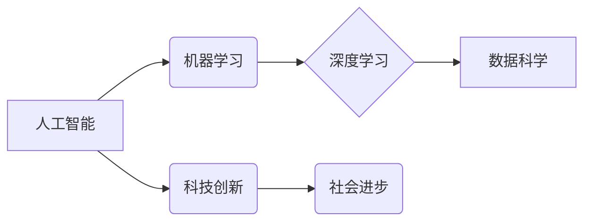

>人工智能、科技创新、社会进步、算法、机器学习、深度学习、数据科学、未来趋势

## 1. 背景介绍

科技创新是人类社会进步的引擎，推动着社会经济发展和人类文明的进步。从蒸汽机到互联网，从计算机到人工智能，每一次科技革命都深刻地改变着人类的生活方式、生产方式和社会结构。

当前，人工智能（AI）作为第四次工业革命的核心技术，正在以惊人的速度发展，并对各个领域产生深远的影响。AI技术在医疗、教育、金融、交通等领域展现出巨大的应用潜力，为解决人类面临的各种挑战提供了新的思路和方法。

然而，AI技术的发展也面临着诸多挑战，例如数据安全、算法偏见、伦理道德等问题。如何确保AI技术安全、可控、普惠地发展，是摆在我们面前的重要课题。

## 2. 核心概念与联系

**2.1  人工智能（AI）**

人工智能是指模拟人类智能行为的计算机系统。AI系统能够通过学习、推理、决策等方式，解决复杂问题，并完成人类难以完成的任务。

**2.2  机器学习（ML）**

机器学习是人工智能的一个重要分支，它使计算机能够从数据中学习，并根据学习到的知识进行预测或决策。机器学习算法可以分为监督学习、无监督学习和强化学习三大类。

**2.3  深度学习（DL）**

深度学习是机器学习的一个子领域，它利用多层神经网络来模拟人类大脑的学习过程。深度学习算法能够处理海量数据，并提取出隐藏的特征，从而实现更准确的预测和决策。

**2.4  数据科学**

数据科学是一门跨学科的领域，它利用统计学、计算机科学、领域知识等方法，从数据中提取有价值的信息，并将其应用于解决实际问题。

**2.5  科技创新**

科技创新是指利用科学技术知识和成果，创造出新的产品、服务或生产方式的过程。科技创新是推动社会进步的动力，也是人类文明发展的基石。

**2.6  社会进步**

社会进步是指社会经济发展水平、人民生活水平、文化素质等方面的提升。科技创新是社会进步的重要推动力。

**核心概念与联系流程图**



## 3. 核心算法原理 & 具体操作步骤

### 3.1  算法原理概述

深度学习算法的核心是多层神经网络。神经网络由多个层级的神经元组成，每个神经元接收来自上一层的输入信号，并对其进行处理，然后将处理后的信号传递到下一层。

深度学习算法通过训练神经网络，使网络能够学习数据中的特征和模式。训练过程 involves 使用大量的训练数据，并通过调整神经网络的权重和偏差，使网络的输出与实际目标值尽可能接近。

### 3.2  算法步骤详解

1. **数据预处理:** 将原始数据进行清洗、转换和特征工程，使其适合深度学习算法的训练。

2. **网络结构设计:** 根据任务需求，设计神经网络的结构，包括神经元的数量、连接方式和激活函数等。

3. **参数初始化:** 为神经网络的参数（权重和偏差）进行随机初始化。

4. **前向传播:** 将输入数据通过神经网络进行前向传播，计算网络的输出。

5. **损失函数计算:** 计算网络输出与实际目标值之间的差异，即损失函数的值。

6. **反向传播:** 根据损失函数的梯度，反向传播误差信号，更新神经网络的参数。

7. **迭代训练:** 重复步骤4-6，直到网络的损失函数达到预设的阈值。

8. **模型评估:** 使用测试数据评估模型的性能，例如准确率、召回率、F1-score等。

### 3.3  算法优缺点

**优点:**

* 能够处理海量数据，并提取出隐藏的特征。
* 能够实现高准确率的预测和决策。
* 能够应用于各种领域，例如图像识别、自然语言处理、语音识别等。

**缺点:**

* 训练深度学习模型需要大量的计算资源和时间。
* 深度学习模型的解释性较差，难以理解模型的决策过程。
* 深度学习模型容易受到数据偏差的影响。

### 3.4  算法应用领域

深度学习算法已广泛应用于各个领域，例如：

* **计算机视觉:** 图像识别、物体检测、图像分割、人脸识别等。
* **自然语言处理:** 文本分类、情感分析、机器翻译、对话系统等。
* **语音识别:** 语音转文本、语音助手等。
* **医疗诊断:** 疾病诊断、影像分析、药物研发等。
* **金融预测:** 股票预测、风险评估、欺诈检测等。

## 4. 数学模型和公式 & 详细讲解 & 举例说明

### 4.1  数学模型构建

深度学习模型的数学基础是神经网络。神经网络由多个层级的神经元组成，每个神经元接收来自上一层的输入信号，并对其进行处理，然后将处理后的信号传递到下一层。

**神经元模型:**

一个神经元的输出可以表示为：

$$
y = f(z)
$$

其中：

* $y$ 是神经元的输出值。
* $z$ 是神经元的输入信号的线性组合。
* $f$ 是激活函数。

**激活函数:**

激活函数的作用是将神经元的输入信号转换为输出信号，并引入非线性特性。常见的激活函数包括 sigmoid 函数、ReLU 函数、tanh 函数等。

### 4.2  公式推导过程

深度学习模型的训练过程是通过优化神经网络的参数来最小化损失函数的过程。损失函数衡量模型的预测结果与实际目标值之间的差异。

**损失函数:**

常用的损失函数包括均方误差（MSE）、交叉熵损失（Cross-Entropy Loss）等。

**梯度下降:**

梯度下降算法是一种常用的优化算法，它通过计算损失函数的梯度，逐步调整神经网络的参数，使损失函数的值不断减小。

### 4.3  案例分析与讲解

**图像分类:**

假设我们有一个图像分类任务，目标是将图像分类为不同的类别，例如猫、狗、鸟等。

我们可以使用卷积神经网络（CNN）来解决这个问题。CNN是一种专门用于处理图像数据的深度学习模型。

CNN的结构包括卷积层、池化层和全连接层。卷积层用于提取图像特征，池化层用于降低特征维度，全连接层用于分类。

训练CNN模型时，我们会使用大量的图像数据，并通过梯度下降算法优化模型的参数。

## 5. 项目实践：代码实例和详细解释说明

### 5.1  开发环境搭建

为了实现深度学习项目，我们需要搭建一个合适的开发环境。常用的开发环境包括：

* **Python:** Python 是深度学习领域最常用的编程语言。
* **深度学习框架:** TensorFlow、PyTorch、Keras 等深度学习框架提供了丰富的工具和库，可以简化深度学习模型的开发和训练过程。
* **GPU:** GPU（图形处理单元）具有强大的并行计算能力，可以加速深度学习模型的训练过程。

### 5.2  源代码详细实现

以下是一个使用 TensorFlow 实现图像分类的简单代码示例：

```python
import tensorflow as tf

# 定义模型结构
model = tf.keras.models.Sequential([
    tf.keras.layers.Conv2D(32, (3, 3), activation='relu', input_shape=(28, 28, 1)),
    tf.keras.layers.MaxPooling2D((2, 2)),
    tf.keras.layers.Conv2D(64, (3, 3), activation='relu'),
    tf.keras.layers.MaxPooling2D((2, 2)),
    tf.keras.layers.Flatten(),
    tf.keras.layers.Dense(10, activation='softmax')
])

# 编译模型
model.compile(optimizer='adam',
              loss='sparse_categorical_crossentropy',
              metrics=['accuracy'])

# 训练模型
model.fit(x_train, y_train, epochs=5)

# 评估模型
loss, accuracy = model.evaluate(x_test, y_test)
print('Test loss:', loss)
print('Test accuracy:', accuracy)
```

### 5.3  代码解读与分析

这段代码定义了一个简单的卷积神经网络模型，用于图像分类任务。

* `tf.keras.models.Sequential` 创建了一个顺序模型，即层级结构。
* `tf.keras.layers.Conv2D` 定义了一个卷积层，用于提取图像特征。
* `tf.keras.layers.MaxPooling2D` 定义了一个池化层，用于降低特征维度。
* `tf.keras.layers.Flatten` 将多维特征转换为一维向量。
* `tf.keras.layers.Dense` 定义了一个全连接层，用于分类。
* `model.compile` 编译模型，指定优化器、损失函数和评价指标。
* `model.fit` 训练模型，使用训练数据进行训练。
* `model.evaluate` 评估模型，使用测试数据评估模型的性能。

### 5.4  运行结果展示

训练完成后，我们可以使用测试数据评估模型的性能。

输出结果会显示测试集上的损失值和准确率。

## 6. 实际应用场景

### 6.1  医疗诊断

深度学习算法可以用于辅助医生进行疾病诊断，例如：

* **图像分析:** 使用深度学习算法分析医学影像，例如 X 光片、CT 扫描、MRI 扫描等，识别肿瘤、骨折等异常情况。
* **病历分析:** 使用深度学习算法分析患者病历，识别疾病风险、预测疾病发展趋势。

### 6.2  金融预测

深度学习算法可以用于金融预测，例如：

* **股票预测:** 使用深度学习算法分析股票市场数据，预测股票价格走势。
* **风险评估:** 使用深度学习算法评估贷款风险、识别欺诈交易。

### 6.3  自动驾驶

深度学习算法是自动驾驶的关键技术，例如：

* **目标检测:** 使用深度学习算法识别道路上的车辆、行人、交通信号灯等目标。
* **路径规划:** 使用深度学习算法规划自动驾驶车辆的路径。

### 6.4  未来应用展望

随着人工智能技术的不断发展，深度学习算法将在更多领域得到应用，例如：

* **个性化教育:** 使用深度学习算法为学生提供个性化的学习方案。
* **智能客服:** 使用深度学习算法开发智能客服系统，自动回答用户问题。
* **科学研究:** 使用深度学习算法加速科学研究，例如药物研发、材料科学等。

## 7. 工具和资源推荐

### 7.1  学习资源推荐

* **在线课程:** Coursera、edX、Udacity 等平台提供深度学习相关的在线课程。
* **书籍:** 《深度学习》、《动手学深度学习》等书籍是深度学习学习的经典教材。
* **博客:** TensorFlow、PyTorch 等深度学习框架的官方博客提供最新的技术资讯和教程。

### 7.2  开发工具推荐

* **TensorFlow:** Google 开发的开源深度学习框架。
* **PyTorch:** Facebook 开发的开源深度学习框架。
* **Keras:** 构建和训练深度学习模型的简洁而高层次的 API。

### 7.3  相关论文推荐

* **《ImageNet Classification with Deep Convolutional Neural Networks》:** AlexNet 模型的论文，标志着深度学习在图像识别领域的突破。
* **《Deep Residual Learning for Image Recognition》:** ResNet 模型的论文，解决了深度网络训练的梯度消失问题。
* **《Attention Is All You Need》:** Transformer 模型的论文，在自然语言处理领域取得了突破性进展。

## 8. 总结：未来发展趋势与挑战

### 8.1  研究成果总结

近年来，深度学习算法取得了显著的成果，在图像识别、自然语言处理、语音识别等领域取得了突破性进展。

### 8.2  未来发展