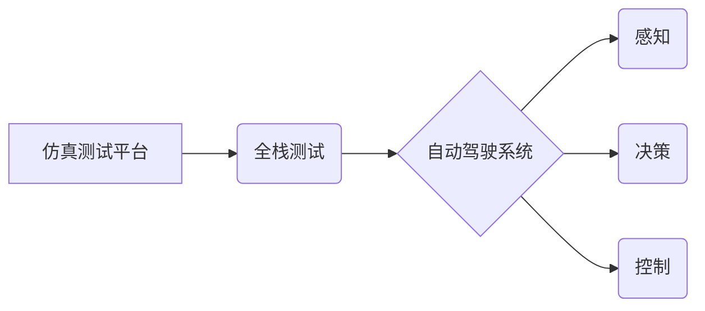

> 自动驾驶, 仿真测试, 全栈, 深度学习, 计算机视觉, 机器学习, 

## 1. 背景介绍

自动驾驶技术作为未来交通运输的重要发展方向，近年来取得了显著进展。从早期感知、决策、控制的模块化设计，到如今追求端到端学习的整体解决方案，自动驾驶技术不断朝着更智能、更安全的方向发展。然而，在实际应用之前，安全可靠的测试和验证是至关重要的。传统的测试方法，例如在封闭场地或模拟环境下的测试，存在局限性，难以全面模拟复杂的路况和各种突发事件。

仿真测试作为一种虚拟化的测试方法，能够提供一个安全、可控、成本效益高的测试环境，有效弥补传统测试方法的不足。全栈仿真测试平台则将仿真技术应用于自动驾驶系统的各个层级，从感知、决策、控制到车辆动力学，构建一个完整的虚拟测试环境，能够模拟真实世界的复杂路况和各种场景，为自动驾驶系统的开发和测试提供更全面的支持。

## 2. 核心概念与联系

**2.1 仿真测试平台**

仿真测试平台是指利用计算机模拟真实世界环境和场景，进行软件或硬件系统的测试和验证的平台。

**2.2 全栈测试**

全栈测试是指对软件系统进行从前端界面到后端数据库的全面测试，覆盖系统所有层级和功能模块。

**2.3 自动驾驶系统**

自动驾驶系统是指能够感知周围环境、做出决策并控制车辆行驶的智能系统。

**2.4 核心概念关系图**



## 3. 核心算法原理 & 具体操作步骤

**3.1 算法原理概述**

全栈仿真测试平台的核心算法原理是基于物理仿真和机器学习的结合。物理仿真模块模拟车辆动力学、环境物理特性等，提供真实世界的物理环境。机器学习模块则用于训练感知、决策、控制等算法，使其能够在虚拟环境中学习和优化。

**3.2 算法步骤详解**

1. **环境建模:** 利用3D建模软件构建虚拟道路环境，包括道路几何信息、交通标志、车辆模型等。
2. **物理仿真:** 利用车辆动力学模型和环境物理模型，模拟车辆在虚拟环境中的运动轨迹和物理交互。
3. **传感器模拟:** 模拟各种传感器，例如摄像头、雷达、激光雷达等，获取虚拟环境中的感知数据。
4. **感知算法训练:** 利用训练数据，训练感知算法，例如目标检测、物体识别、场景理解等。
5. **决策算法训练:** 利用感知数据，训练决策算法，例如路径规划、避障决策、速度控制等。
6. **控制算法训练:** 利用决策结果，训练控制算法，例如转向控制、加减速控制等。
7. **系统集成:** 将感知、决策、控制算法集成到仿真平台中，形成完整的自动驾驶系统仿真模型。
8. **测试和验证:** 在虚拟环境中进行各种测试，例如道路测试、复杂场景测试、紧急情况测试等，评估自动驾驶系统的性能和安全性。

**3.3 算法优缺点**

**优点:**

* 安全可靠：在虚拟环境中进行测试，避免了实际道路上的安全风险。
* 可控性强：可以模拟各种复杂的路况和场景，进行针对性的测试。
* 成本效益高：相比于实际道路测试，仿真测试成本更低。
* 测试效率高：可以快速迭代测试，缩短开发周期。

**缺点:**

* 虚拟环境与真实环境存在差异：仿真平台无法完全模拟真实世界的复杂性和随机性。
* 算法训练数据质量：算法训练数据质量直接影响测试结果的准确性。
* 平台搭建成本：搭建全栈仿真测试平台需要投入大量人力、物力和财力。

**3.4 算法应用领域**

全栈仿真测试平台广泛应用于自动驾驶系统的开发和测试，例如：

* 自动驾驶汽车
* 自动驾驶无人机
* 自动驾驶机器人
* 智能交通系统

## 4. 数学模型和公式 & 详细讲解 & 举例说明

**4.1 数学模型构建**

全栈仿真测试平台的数学模型主要包括车辆动力学模型、环境物理模型和传感器模型。

* **车辆动力学模型:** 描述车辆在不同路况下的运动状态，包括速度、加速度、转向角等。常用的车辆动力学模型有自行车模型、卡尔曼滤波模型等。
* **环境物理模型:** 描述虚拟环境中的物理特性，例如道路摩擦系数、空气阻力、重力等。
* **传感器模型:** 描述传感器获取数据的物理特性，例如摄像头视角、雷达探测距离、激光雷达扫描范围等。

**4.2 公式推导过程**

车辆动力学模型的推导过程较为复杂，涉及到牛顿第二定律、车辆几何参数、轮胎特性等多个因素。

**牛顿第二定律:**

$$F = ma$$

其中，F为车辆受力，m为车辆质量，a为车辆加速度。

**车辆动力学方程:**

$$
\begin{aligned}
m \dot{v} &= F_t - F_d - F_g \\
I \dot{\omega} &= T_w - T_d
\end{aligned}
$$

其中，v为车辆速度，ω为车辆转角速度，$F_t$为轮胎产生的牵引力，$F_d$为空气阻力，$F_g$为重力，$T_w$为轮胎转矩，$T_d$为阻尼转矩。

**4.3 案例分析与讲解**

假设一辆汽车在平直道路上行驶，速度为20m/s，空气阻力系数为0.3，重力加速度为9.8m/s^2，汽车质量为1500kg。

根据车辆动力学方程，可以计算出汽车的加速度：

$$
\begin{aligned}
a &= \frac{F_t - F_d - F_g}{m} \\
&= \frac{F_t - 0.5 \rho v^2 C_d A - mg}{m}
\end{aligned}
$$

其中，ρ为空气密度，$C_d$为空气阻力系数，A为汽车迎风面积，g为重力加速度。

通过计算，可以得到汽车的加速度值，进而可以预测汽车的未来运动轨迹。

## 5. 项目实践：代码实例和详细解释说明

**5.1 开发环境搭建**

* 操作系统：Ubuntu 20.04
* 编程语言：Python 3.8
* 仿真引擎：Gazebo 11
* 机器学习框架：TensorFlow 2.0

**5.2 源代码详细实现**

```python
# 导入必要的库
import rospy
from gazebo_msgs.msg import ModelStates
from sensor_msgs.msg import Image
from std_msgs.msg import String

# 定义节点
class AutoDrivingNode:
    def __init__(self):
        # 初始化ROS节点
        rospy.init_node('auto_driving_node')

        # 订阅模型状态信息
        self.model_states_sub = rospy.Subscriber('/gazebo/model_states', ModelStates, self.model_states_callback)

        # 订阅摄像头图像信息
        self.camera_image_sub = rospy.Subscriber('/camera/image_raw', Image, self.camera_image_callback)

        # 发布控制指令
        self.control_pub = rospy.Publisher('/vehicle/control', String, queue_size=10)

    # 处理模型状态信息
    def model_states_callback(self, msg):
        # 获取车辆状态信息
        vehicle_state = msg.pose[0]

        # ...

    # 处理摄像头图像信息
    def camera_image_callback(self, msg):
        # 获取摄像头图像数据
        image_data = msg.data

        # ...

    # 发布控制指令
    def publish_control(self, control_command):
        self.control_pub.publish(control_command)

# 创建节点实例
if __name__ == '__main__':
    auto_driving_node = AutoDrivingNode()
    rospy.spin()
```

**5.3 代码解读与分析**

* 该代码定义了一个ROS节点，用于控制自动驾驶车辆在Gazebo仿真环境中的运动。
* 节点订阅了模型状态信息和摄像头图像信息，并发布控制指令。
* 在代码中，需要根据实际情况实现模型状态信息处理和摄像头图像信息处理逻辑。

**5.4 运行结果展示**

在Gazebo仿真环境中运行该代码，可以观察到自动驾驶车辆根据传感器信息和环境状态做出相应的控制动作，例如转向、加速、减速等。

## 6. 实际应用场景

全栈仿真测试平台在自动驾驶系统的开发和测试中具有广泛的应用场景，例如：

* **道路测试:** 模拟各种道路场景，例如高速公路、城市道路、乡村道路等，测试车辆在不同路况下的行驶性能。
* **复杂场景测试:** 模拟复杂场景，例如拥堵路段、交叉路口、施工区域等，测试车辆在复杂环境下的应对能力。
* **紧急情况测试:** 模拟紧急情况，例如突然变道、紧急刹车、碰撞等，测试车辆在紧急情况下是否能够安全行驶。
* **法规测试:** 模拟不同国家和地区的交通法规，测试车辆是否能够遵守相关法规。

**6.4 未来应用展望**

随着自动驾驶技术的不断发展，全栈仿真测试平台将发挥越来越重要的作用。未来，全栈仿真测试平台将朝着以下方向发展：

* **更逼真的虚拟环境:** 利用更先进的3D建模技术和物理引擎，构建更逼真的虚拟环境，更加接近真实世界。
* **更智能的算法训练:** 利用更先进的机器学习算法和训练方法，训练更智能的感知、决策、控制算法。
* **更全面的测试覆盖:** 覆盖更广泛的测试场景和测试用例，更加全面地评估自动驾驶系统的性能和安全性。
* **更强的可扩展性:** 支持多种传感器、多种车辆模型、多种仿真引擎，更加灵活地满足不同用户的需求。

## 7. 工具和资源推荐

**7.1 学习资源推荐**

* **书籍:**
    * 《自动驾驶汽车》
    * 《机器人操作系统》
    * 《深度学习》
* **在线课程:**
    * Coursera: 自动驾驶汽车
    * Udacity: 自动驾驶工程师
* **开源项目:**
    * Autoware
    * Apollo

**7.2 开发工具推荐**

* **仿真引擎:** Gazebo, CARLA
* **机器学习框架:** TensorFlow, PyTorch
* **ROS工具:** rviz, rosbag

**7.3 相关论文推荐**

* **自动驾驶感知:**
    * "Deep Learning for Autonomous Driving"
    * "End-to-End Learning for Self-Driving Cars"
* **自动驾驶决策:**
    * "A Deep Reinforcement Learning Approach for Autonomous Driving"
    * "Learning to Drive in a Simulator"
* **自动驾驶控制:**
    * "Model Predictive Control for Autonomous Driving"
    * "Adaptive Cruise Control for Autonomous Vehicles"

## 8. 总结：未来发展趋势与挑战

**8.1 研究成果总结**

全栈仿真测试平台在自动驾驶系统的开发和测试中取得了显著成果，为自动驾驶技术的进步提供了重要的技术支撑。

**8.2 未来发展趋势**

未来，全栈仿真测试平台将朝着更逼真、更智能、更全面的方向发展，并与其他技术，例如云计算、大数据、人工智能等深度融合，形成更加强大的技术生态系统。

**8.3 面临的挑战**

全栈仿真测试平台的发展也面临着一些挑战，例如：

* **虚拟环境与真实环境的差异:** 虚拟环境无法完全模拟真实世界的复杂性和随机性，需要不断改进仿真模型和算法，提高仿真平台的真实性。
* **算法训练数据质量:** 算法训练数据质量直接影响测试结果