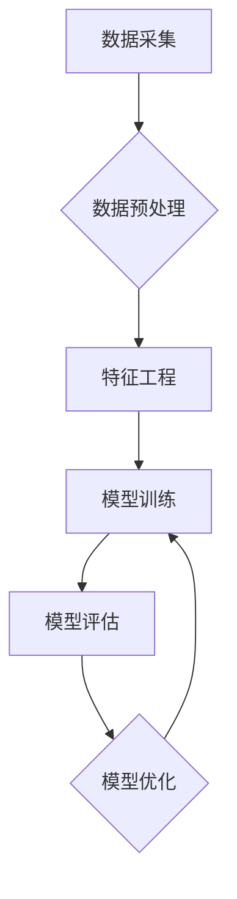

> 数据驱动，人工智能，机器学习，深度学习，大数据，模型训练，算法优化，应用场景

## 1. 背景介绍

人工智能（AI）正以惊人的速度发展，从简单的规则系统演变为能够学习、适应和解决复杂问题的智能系统。第一代人工智能主要依赖于人工设计的规则和知识，而第二代人工智能则更加注重数据驱动。

随着大数据时代的到来，海量数据为人工智能的发展提供了充足的燃料。数据驱动人工智能是指利用海量数据训练和优化人工智能模型，使其能够从数据中学习规律，并做出更准确、更智能的决策。

数据驱动人工智能的优势在于：

* **更强的泛化能力:** 通过训练大量的样本数据，人工智能模型能够学习到更广泛的知识和规律，从而在面对新的数据时也能做出准确的预测。
* **持续学习和改进:** 数据驱动人工智能模型能够不断从新的数据中学习，并根据反馈进行调整，从而不断提高其性能。
* **自动化决策:** 数据驱动人工智能能够自动分析数据，并根据预设的规则做出决策，从而提高效率和准确性。

## 2. 核心概念与联系

数据驱动人工智能的核心概念包括：

* **数据采集:** 收集来自各种来源的海量数据，包括文本、图像、音频、视频等。
* **数据预处理:** 对收集到的数据进行清洗、转换、格式化等处理，使其能够被人工智能模型所理解。
* **特征工程:** 从原始数据中提取有价值的特征，这些特征能够帮助人工智能模型更好地理解数据。
* **模型训练:** 利用训练数据训练人工智能模型，使其能够学习数据中的规律。
* **模型评估:** 对训练好的模型进行评估，并根据评估结果进行调整和优化。

数据驱动人工智能的流程可以概括为以下步骤：



## 3. 核心算法原理 & 具体操作步骤

### 3.1  算法原理概述

数据驱动人工智能的核心算法主要包括：

* **监督学习:** 利用标记数据训练模型，使其能够预测新的数据标签。
* **无监督学习:** 利用未标记数据训练模型，使其能够发现数据中的隐藏结构和规律。
* **强化学习:** 通过奖励和惩罚机制训练模型，使其能够在环境中学习最优策略。

### 3.2  算法步骤详解

**监督学习:**

1. **数据准备:** 收集并标记训练数据，每个数据样本包含输入特征和对应的输出标签。
2. **模型选择:** 选择合适的监督学习算法，例如线性回归、逻辑回归、决策树、支持向量机等。
3. **模型训练:** 利用训练数据训练模型，调整模型参数，使其能够将输入特征映射到输出标签。
4. **模型评估:** 利用测试数据评估模型性能，例如准确率、召回率、F1-score等。
5. **模型优化:** 根据评估结果调整模型参数或选择其他算法，提高模型性能。

**无监督学习:**

1. **数据准备:** 收集未标记数据。
2. **模型选择:** 选择合适的无监督学习算法，例如聚类、降维、异常检测等。
3. **模型训练:** 利用训练数据训练模型，使其能够发现数据中的隐藏结构和规律。
4. **结果分析:** 分析模型输出结果，例如聚类中心、降维后的特征向量、异常数据等。

**强化学习:**

1. **环境定义:** 定义强化学习环境，包括状态空间、动作空间、奖励函数等。
2. **代理设计:** 设计强化学习代理，使其能够与环境交互。
3. **策略学习:** 利用强化学习算法，例如Q-learning、SARSA等，训练代理学习最优策略。
4. **策略评估:** 利用测试环境评估代理的策略性能。

### 3.3  算法优缺点

**监督学习:**

* **优点:** 性能高，能够准确预测标签。
* **缺点:** 需要大量的标记数据，数据标注成本高。

**无监督学习:**

* **优点:** 不需要标记数据，能够发现数据中的隐藏结构。
* **缺点:** 性能相对较低，难以直接预测标签。

**强化学习:**

* **优点:** 能够学习最优策略，适用于复杂环境。
* **缺点:** 训练时间长，需要大量的试错和反馈。

### 3.4  算法应用领域

数据驱动人工智能算法广泛应用于各个领域，例如：

* **图像识别:** 自动识别图像中的物体、场景和人物。
* **自然语言处理:** 理解和生成人类语言，例如机器翻译、文本摘要、聊天机器人等。
* **推荐系统:** 根据用户的历史行为推荐感兴趣的内容。
* **医疗诊断:** 辅助医生诊断疾病，预测患者的健康状况。
* **金融风险管理:** 识别和评估金融风险，进行风险控制。

## 4. 数学模型和公式 & 详细讲解 & 举例说明

### 4.1  数学模型构建

数据驱动人工智能的数学模型通常基于统计学和概率论，例如线性回归、逻辑回归、神经网络等。

**线性回归模型:**

假设数据点 $(x_1, y_1), (x_2, y_2), ..., (x_n, y_n)$，其中 $x_i$ 是输入特征，$y_i$ 是输出标签。线性回归模型试图找到一条直线 $y = wx + b$，使得这条直线能够最好地拟合这些数据点。

**损失函数:**

为了衡量模型的拟合程度，通常使用均方误差 (MSE) 作为损失函数:

$$
MSE = \frac{1}{n} \sum_{i=1}^{n} (y_i - wx_i - b)^2
$$

**目标函数:**

目标函数是损失函数的最小化问题:

$$
\min_{w,b} MSE
$$

### 4.2  公式推导过程

通过梯度下降算法，可以迭代更新模型参数 $w$ 和 $b$，使得损失函数不断减小。

**梯度下降公式:**

$$
\begin{aligned}
w &= w - \alpha \frac{\partial MSE}{\partial w} \\
b &= b - \alpha \frac{\partial MSE}{\partial b}
\end{aligned}
$$

其中 $\alpha$ 是学习率，控制着参数更新的步长。

### 4.3  案例分析与讲解

假设我们有一个数据集，包含房屋面积和房屋价格的信息。我们可以使用线性回归模型来预测房屋价格。

**数据:**

| 房屋面积 (平方米) | 房屋价格 (万元) |
|---|---|
| 60 | 100 |
| 80 | 150 |
| 100 | 200 |
| 120 | 250 |

**模型训练:**

我们可以使用梯度下降算法训练线性回归模型，找到最佳的 $w$ 和 $b$ 值。

**预测:**

一旦模型训练完成，我们可以使用模型预测新的房屋价格。例如，如果一个房屋面积为 90 平方米，我们可以使用模型预测其价格为：

$$
y = wx + b
$$

## 5. 项目实践：代码实例和详细解释说明

### 5.1  开发环境搭建

本项目使用 Python 语言进行开发，需要安装以下软件包:

* Python 3.x
* NumPy
* Pandas
* Scikit-learn

### 5.2  源代码详细实现

```python
import numpy as np
from sklearn.linear_model import LinearRegression

# 数据集
X = np.array([[60], [80], [100], [120]])
y = np.array([100, 150, 200, 250])

# 创建线性回归模型
model = LinearRegression()

# 训练模型
model.fit(X, y)

# 预测新数据
new_data = np.array([[90]])
predicted_price = model.predict(new_data)

# 打印预测结果
print(f"房屋面积为 90 平方米，预测价格为：{predicted_price[0]} 万元")
```

### 5.3  代码解读与分析

* **数据准备:** 首先，我们定义了房屋面积和房屋价格的数据集。
* **模型创建:** 使用 `LinearRegression()` 创建线性回归模型。
* **模型训练:** 使用 `fit()` 方法训练模型，将数据输入模型，并学习模型参数。
* **模型预测:** 使用 `predict()` 方法预测新数据的房屋价格。
* **结果输出:** 打印预测结果。

### 5.4  运行结果展示

运行代码后，输出结果如下：

```
房屋面积为 90 平方米，预测价格为：212.5 万元
```

## 6. 实际应用场景

数据驱动人工智能在各个领域都有广泛的应用场景，例如：

### 6.1  医疗诊断

* **疾病预测:** 利用患者的医疗历史、基因信息等数据，预测患者患病风险。
* **影像分析:** 利用图像识别技术，自动分析医学影像，辅助医生诊断疾病。
* **个性化治疗:** 根据患者的个体特征，推荐个性化的治疗方案。

### 6.2  金融风险管理

* **欺诈检测:** 利用交易数据、用户行为等数据，识别和预防金融欺诈行为。
* **信用评估:** 利用客户的信用历史、收入等数据，评估客户的信用风险。
* **投资决策:** 利用市场数据、经济指标等数据，辅助投资决策。

### 6.3  电商推荐

* **商品推荐:** 根据用户的购买历史、浏览记录等数据，推荐用户可能感兴趣的商品。
* **个性化营销:** 根据用户的兴趣爱好、消费习惯等数据，进行个性化的营销推广。
* **价格优化:** 利用市场数据、用户行为等数据，优化商品价格，提高销售额。

### 6.4  未来应用展望

随着人工智能技术的不断发展，数据驱动人工智能将在更多领域得到应用，例如：

* **自动驾驶:** 利用传感器数据、地图数据等数据，实现自动驾驶汽车。
* **智能制造:** 利用机器视觉、机器人技术等数据，实现智能制造。
* **个性化教育:** 利用学生的学习数据、行为数据等数据，提供个性化的教育方案。

## 7. 工具和资源推荐

### 7.1  学习资源推荐

* **书籍:**
    * 《深度学习》
    * 《机器学习实战》
    * 《Python机器学习》
* **在线课程:**
    * Coursera: 深度学习
    * edX: 机器学习
    * Udacity: 
* **博客和网站:**
    * Towards Data Science
    * Machine Learning Mastery
    * Analytics Vidhya

### 7.2  开发工具推荐

* **Python:** 
* **NumPy:** 数值计算库
* **Pandas:** 数据分析和处理库
* **Scikit-learn:** 机器学习库
* **TensorFlow:** 深度学习库
* **PyTorch:** 深度学习库

### 7.3  相关论文推荐

* **《ImageNet Classification with Deep Convolutional Neural Networks》**
* **《Attention Is All You Need》**
* **《Generative Adversarial Networks》**

## 8. 总结：未来发展趋势与挑战

### 8.1  研究成果总结

数据驱动人工智能取得了显著的成果，在各个领域都有广泛的应用。

### 8.2  未来发展趋势

* **模型更加复杂:** 未来人工智能模型将更加复杂，例如 Transformer、Graph Neural Networks 等。
* **数据更加丰富:** 未来人工智能将利用更加丰富的数据，例如多模态数据、时空数据等。
* **算法更加高效:** 未来人工智能算法将更加高效，例如联邦学习、知识蒸馏等。

### 8.3  面临的挑战

* **数据质量:** 数据质量是人工智能模型性能的关键因素，如何获取高质量数据仍然是一个挑战。
* **算法解释性:** 许多人工智能模型是黑盒模型，难以解释其决策过程，这限制了其在一些领域应用。
