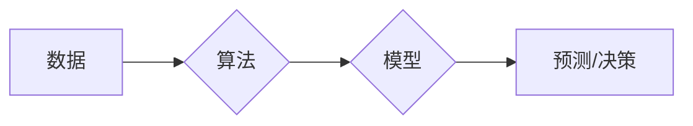

> 算法，人工智能，机器学习，深度学习，数据结构，时间复杂度，空间复杂度，编程，软件架构

## 1. 背景介绍

人工智能（AI）近年来发展迅速，已渗透到生活的方方面面，从智能语音助手到自动驾驶汽车，无处不在。然而，支撑AI发展的核心驱动力是什么？答案是算法。算法是人工智能的核心，是实现AI智能化的关键。

算法可以简单理解为解决特定问题的一系列步骤或规则。在AI领域，算法被用来处理海量数据，识别模式，做出预测和决策。不同的算法适用于不同的任务，例如，用于图像识别的卷积神经网络算法，用于自然语言处理的循环神经网络算法，等等。

## 2. 核心概念与联系

**2.1 算法与人工智能的关系**

人工智能的目标是让机器能够像人类一样思考和学习。而算法是实现这一目标的关键工具。通过设计和训练合适的算法，我们可以让机器学习从数据中提取知识，识别模式，做出决策。

**2.2 算法与数据的关系**

数据是人工智能的燃料。算法需要大量的数据进行训练，才能学习到有效的知识和规律。数据越多，算法训练的效果越好。

**2.3 算法与模型的关系**

算法是构建人工智能模型的基础。模型可以看作是算法的具体实现，它包含了算法的结构和参数。通过训练模型，我们可以让算法学习到数据的规律，并能够应用于实际问题。

**2.4 算法的分类**

算法可以根据不同的分类标准进行分类，例如：

* **根据算法的用途:** 
    * **监督学习算法:** 需要 labeled 数据进行训练，例如分类、回归等。
    * **无监督学习算法:** 不需要 labeled 数据进行训练，例如聚类、降维等。
    * **强化学习算法:** 通过与环境交互学习，例如游戏AI、机器人控制等。
* **根据算法的复杂度:** 
    * **线性算法:** 时间复杂度为线性，例如线性回归。
    * **非线性算法:** 时间复杂度不为线性，例如神经网络。

**Mermaid 流程图**



## 3. 核心算法原理 & 具体操作步骤

**3.1 算法原理概述**

选择一个具体的算法进行详细讲解，例如线性回归算法。

* **线性回归算法**是一种监督学习算法，用于预测连续值。它假设数据之间存在线性关系，并通过最小化误差来找到最佳的回归线。

**3.2 算法步骤详解**

1. **数据准备:** 收集和预处理数据，例如特征选择、数据清洗等。
2. **模型构建:** 定义线性回归模型，例如 y = mx + b，其中y是预测值，x是输入特征，m和b是模型参数。
3. **参数估计:** 使用最小二乘法等方法估计模型参数m和b，使得模型拟合数据误差最小。
4. **模型评估:** 使用测试数据评估模型的性能，例如计算均方误差（MSE）等。
5. **模型优化:** 根据评估结果，调整模型参数或算法结构，提高模型性能。

**3.3 算法优缺点**

* **优点:** 
    * 算法简单易懂，易于实现。
    * 计算效率高，适合处理大规模数据。
* **缺点:** 
    * 只能处理线性关系的数据。
    * 对异常值敏感。

**3.4 算法应用领域**

* **预测分析:** 预测销售额、股票价格等。
* **风险评估:** 评估贷款风险、信用风险等。
* **图像识别:** 识别图像中的物体、场景等。

## 4. 数学模型和公式 & 详细讲解 & 举例说明

**4.1 数学模型构建**

线性回归模型的数学表达式为：

$$y = mx + b$$

其中：

* y 是预测值
* x 是输入特征
* m 是斜率参数
* b 是截距参数

**4.2 公式推导过程**

最小二乘法是估计线性回归模型参数m和b的常用方法。其目标是找到使得模型预测值与真实值误差平方和最小的参数值。

误差平方和为：

$$SSE = \sum_{i=1}^{n}(y_i - \hat{y}_i)^2$$

其中：

* $y_i$ 是第i个样本的真实值
* $\hat{y}_i$ 是第i个样本的预测值

通过对SSE求导，并令其等于零，可以得到m和b的估计值。

**4.3 案例分析与讲解**

假设我们有一组数据，包含房屋面积和房屋价格的信息。我们可以使用线性回归算法来预测房屋价格。

* 数据集：
    * 房屋面积 (x): 100, 150, 200, 250, 300
    * 房屋价格 (y): 150000, 200000, 250000, 300000, 350000

* 使用线性回归算法训练模型，得到模型参数m和b。
* 使用训练好的模型预测新房屋价格。

## 5. 项目实践：代码实例和详细解释说明

**5.1 开发环境搭建**

使用Python语言和Scikit-learn库进行项目实践。

**5.2 源代码详细实现**

```python
import numpy as np
from sklearn.linear_model import LinearRegression

# 数据集
X = np.array([[100], [150], [200], [250], [300]])
y = np.array([150000, 200000, 250000, 300000, 350000])

# 创建线性回归模型
model = LinearRegression()

# 训练模型
model.fit(X, y)

# 获取模型参数
m = model.coef_[0]
b = model.intercept_

# 预测新房屋价格
new_house_area = 280
predicted_price = m * new_house_area + b

# 打印结果
print(f"预测价格: {predicted_price}")
```

**5.3 代码解读与分析**

* 首先，我们导入必要的库，并定义数据集。
* 然后，我们创建线性回归模型，并使用训练数据训练模型。
* 训练完成后，我们可以获取模型参数m和b。
* 最后，我们可以使用训练好的模型预测新房屋价格。

**5.4 运行结果展示**

运行代码后，会输出预测价格。

## 6. 实际应用场景

**6.1 房屋价格预测**

使用线性回归算法可以预测房屋价格，帮助房地产经纪人评估房屋价值，帮助购房者做出更明智的决策。

**6.2 股票价格预测**

使用线性回归算法可以预测股票价格，帮助投资者做出投资决策。

**6.3 销售额预测**

使用线性回归算法可以预测销售额，帮助企业制定营销策略，优化资源配置。

**6.4 未来应用展望**

随着人工智能技术的不断发展，线性回归算法将在更多领域得到应用，例如医疗诊断、金融风险评估、交通流量预测等。

## 7. 工具和资源推荐

**7.1 学习资源推荐**

* **书籍:**
    * 《Python机器学习》
    * 《机器学习实战》
* **在线课程:**
    * Coursera上的机器学习课程
    * edX上的机器学习课程

**7.2 开发工具推荐**

* **Python:** 
    * Scikit-learn
    * TensorFlow
    * PyTorch

**7.3 相关论文推荐**

* **The Elements of Statistical Learning**
* **Pattern Recognition and Machine Learning**

## 8. 总结：未来发展趋势与挑战

**8.1 研究成果总结**

线性回归算法是一种简单易懂、高效的算法，在许多领域都有广泛的应用。

**8.2 未来发展趋势**

* **深度学习:** 深度学习算法能够处理更复杂的数据，并取得更好的性能。
* **强化学习:** 强化学习算法能够让机器通过与环境交互学习，并解决更复杂的决策问题。
* **迁移学习:** 迁移学习算法能够将已有的知识迁移到新的任务中，提高学习效率。

**8.3 面临的挑战**

* **数据质量:** 算法的性能取决于数据的质量。
* **算法解释性:** 许多深度学习算法难以解释，其决策过程难以理解。
* **伦理问题:** 人工智能的应用可能带来伦理问题，例如算法偏见、隐私泄露等。

**8.4 研究展望**

未来，人工智能研究将继续朝着更智能、更安全、更可解释的方向发展。


## 9. 附录：常见问题与解答

**9.1 什么是算法的复杂度？**

算法的复杂度是指算法运行时间或空间资源消耗的量级，通常用大O符号表示。

**9.2 如何选择合适的算法？**

选择合适的算法取决于具体的应用场景和数据特点。

**9.3 如何评估算法的性能？**

可以使用准确率、召回率、F1-score等指标评估算法的性能。


作者：禅与计算机程序设计艺术 / Zen and the Art of Computer Programming 
<end_of_turn>