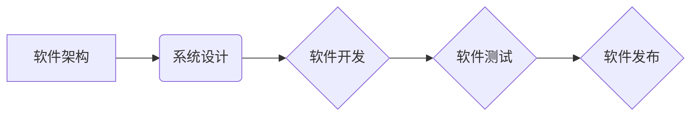
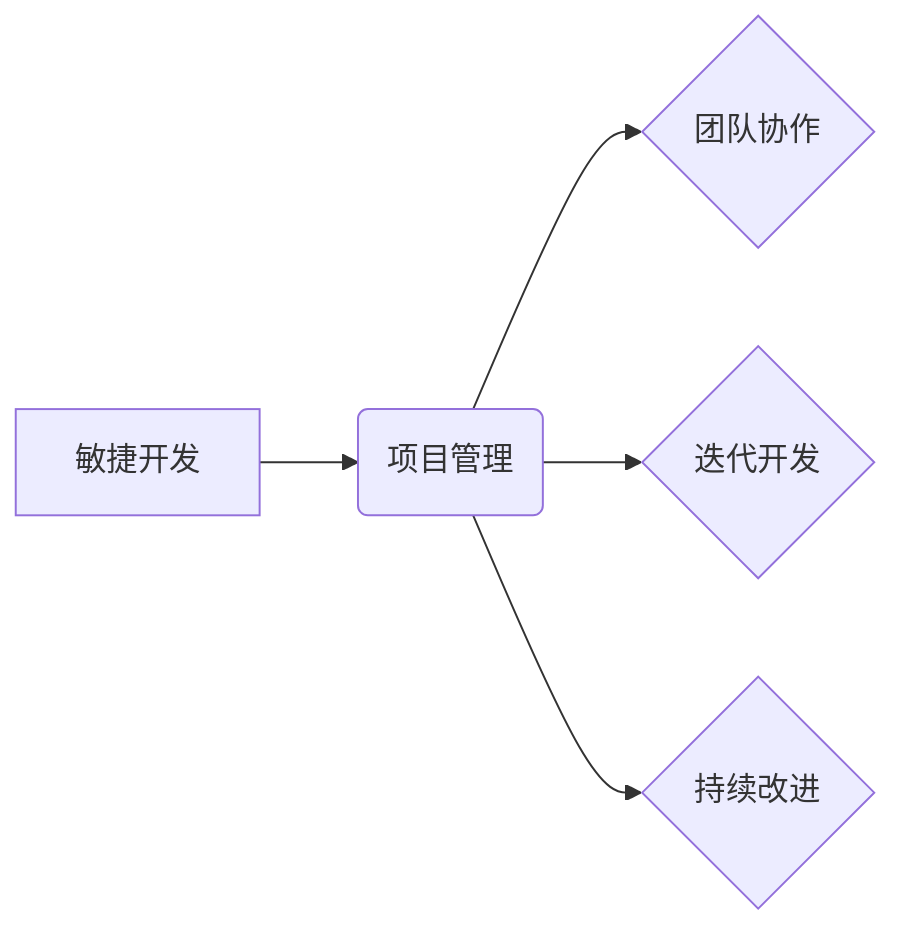

> 软件架构、系统设计、敏捷开发、团队协作、项目管理、技术决策、执行力

## 1. 背景介绍

在当今科技日新月异的时代，软件开发已经成为推动社会进步的重要引擎。然而，仅仅拥有顶尖的技术人才和先进的工具并不能保证项目的成功。如何有效地管理软件开发项目，将策略转化为实际成果，成为了摆在每个技术团队面前的重大挑战。

传统的管理模式往往过于僵化，难以适应软件开发的快速迭代和不断变化的需求。而敏捷开发理念的兴起，为软件开发管理带来了新的思路和方法。敏捷开发强调团队协作、迭代开发和持续改进，旨在提高开发效率和项目质量。

然而，敏捷开发并非一蹴而就，它需要团队成员对理念的深刻理解和实践，以及有效的沟通和协作机制。

## 2. 核心概念与联系

### 2.1 软件架构与系统设计

软件架构是软件系统的蓝图，它定义了软件系统的整体结构、组件之间的关系以及数据流向。系统设计则是根据软件架构，对软件系统进行详细的规划和实现。

**软件架构与系统设计的关系**



### 2.2 敏捷开发与项目管理

敏捷开发是一种迭代开发方法，它强调团队协作、快速反馈和持续改进。项目管理则是指规划、组织、协调和控制项目资源，以实现项目目标。

**敏捷开发与项目管理的关系**



## 3. 核心算法原理 & 具体操作步骤

### 3.1 算法原理概述

在软件开发过程中，算法设计和优化是至关重要的环节。高效的算法可以显著提高软件的性能和效率。

### 3.2 算法步骤详解

**举例说明：快速排序算法**

快速排序是一种高效的排序算法，其基本思想是选择一个元素作为“枢轴”，将小于枢轴的元素放在其左边，大于枢轴的元素放在其右边，然后递归地对左右子数组进行排序。

**具体步骤：**

1. 选择一个元素作为枢轴。
2. 将小于枢轴的元素放在其左边，大于枢轴的元素放在其右边。
3. 对左右子数组分别进行快速排序。

### 3.3 算法优缺点

**优点：**

* 平均时间复杂度为 O(n log n)，效率较高。
* 原地排序，空间复杂度较低。

**缺点：**

* 最坏时间复杂度为 O(n^2)，当数据已经排序时，效率较低。
* 不稳定排序，相等元素的相对顺序可能改变。

### 3.4 算法应用领域

快速排序算法广泛应用于各种排序场景，例如：

* 数据结构排序
* 数据库索引
* 搜索引擎排名

## 4. 数学模型和公式 & 详细讲解 & 举例说明

### 4.1 数学模型构建

在软件开发中，数学模型可以用来描述软件系统的行为和性能。例如，我们可以使用概率论来分析软件系统的可靠性，使用图论来分析软件系统的复杂度。

### 4.2 公式推导过程

**举例说明：软件可靠性模型**

软件可靠性是指软件系统在特定时间内正常运行的概率。我们可以使用以下公式来计算软件系统的可靠性：

$$R(t) = e^{-\lambda t}$$

其中：

* R(t) 是软件系统在时间 t 内的可靠性
* λ 是软件系统的故障率

### 4.3 案例分析与讲解

**举例说明：软件复杂度分析**

我们可以使用软件复杂度度量指标来评估软件系统的复杂度。例如，代码行数、函数数量、代码嵌套深度等都是常用的复杂度度量指标。

## 5. 项目实践：代码实例和详细解释说明

### 5.1 开发环境搭建

**举例说明：使用 Java 开发 Web 应用**

1. 安装 Java 开发环境
2. 安装 Web 服务器 (例如 Tomcat)
3. 配置开发工具 (例如 Eclipse)

### 5.2 源代码详细实现

**举例说明：实现一个简单的 Web 应用程序**

```java
public class HelloWorld {

    public static void main(String[] args) {
        System.out.println("Hello, World!");
    }
}
```

### 5.3 代码解读与分析

**代码解读：**

* `public class HelloWorld`：定义了一个名为 HelloWorld 的类。
* `public static void main(String[] args)`：定义了程序的入口方法。
* `System.out.println("Hello, World!");`：打印 "Hello, World!" 到控制台。

### 5.4 运行结果展示

运行上述代码，将会在控制台输出 "Hello, World!"。

## 6. 实际应用场景

### 6.1 软件架构设计

软件架构设计是软件开发的重要环节，它决定了软件系统的整体结构和组件之间的关系。

### 6.2 项目管理实践

敏捷开发理念在软件开发项目管理中得到了广泛应用，它强调团队协作、迭代开发和持续改进。

### 6.3 团队协作与沟通

有效的团队协作和沟通是软件开发成功的关键因素。

### 6.4 未来应用展望

随着科技的不断发展，软件开发管理将面临新的挑战和机遇。例如，人工智能、云计算等新技术将对软件开发管理产生深远的影响。

## 7. 工具和资源推荐

### 7.1 学习资源推荐

* 书籍：《软件工程导论》、《敏捷软件开发》
* 网站：https://www.agilealliance.org/

### 7.2 开发工具推荐

* 编程语言：Java、Python、C++
* 开发环境：Eclipse、IntelliJ IDEA
* 版本控制系统：Git

### 7.3 相关论文推荐

* 《敏捷软件开发：原则、实践和经验》
* 《软件架构：实践指南》

## 8. 总结：未来发展趋势与挑战

### 8.1 研究成果总结

软件开发管理领域取得了显著的进展，敏捷开发理念、软件架构设计、项目管理实践等方面都取得了新的成果。

### 8.2 未来发展趋势

未来软件开发管理将更加注重自动化、智能化和协作性。人工智能、云计算等新技术将被广泛应用于软件开发管理领域。

### 8.3 面临的挑战

软件开发管理面临着新的挑战，例如：

* 如何应对快速变化的技术环境
* 如何提高团队协作和沟通效率
* 如何保证软件系统的安全性和可靠性

### 8.4 研究展望

未来软件开发管理研究将更加注重以下方面：

* 人工智能在软件开发管理中的应用
* 云计算对软件开发管理的影响
* 软件开发管理的自动化和智能化

## 9. 附录：常见问题与解答

**常见问题：**

* 什么是敏捷开发？
* 如何进行软件架构设计？
* 如何提高团队协作效率？

**解答：**

* 敏捷开发是一种迭代开发方法，它强调团队协作、快速反馈和持续改进。
* 软件架构设计是软件开发的重要环节，它决定了软件系统的整体结构和组件之间的关系。
* 提高团队协作效率需要建立有效的沟通机制、明确团队角色和职责、鼓励团队成员之间的交流和合作。


作者：禅与计算机程序设计艺术 / Zen and the Art of Computer Programming 
<end_of_turn>