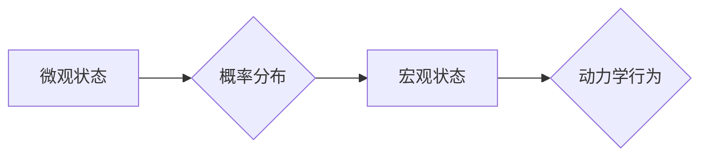

> 统计力学，相互作用粒子系统，蒙特卡罗方法，马尔可夫链，粒子系统模拟，复杂系统

## 1. 背景介绍

在现代科学和工程领域，复杂系统研究日益受到关注。这些系统由大量相互作用的个体组成，其整体行为往往难以通过传统方法预测和理解。统计力学作为一种研究宏观系统行为的理论框架，为理解复杂系统提供了强大的工具。

统计力学的核心思想是通过对微观状态的统计分析来预测宏观性质。它将复杂系统视为由大量相互作用的粒子组成，并利用概率论和统计学方法来描述粒子的运动和相互作用。通过对粒子分布、能量和动量等微观变量的统计分析，可以推导出系统的宏观性质，如温度、压力、熵等。

相互作用粒子系统是统计力学研究的重要对象。这类系统广泛存在于自然界和社会系统中，例如气体、液体、固体、生物群体、金融市场等。理解相互作用粒子系统的行为对于预测和控制这些系统的演化至关重要。

## 2. 核心概念与联系

### 2.1 统计力学基本概念

* **微观状态:** 描述系统中所有粒子的位置、动量和能量等微观变量的完整描述。
* **宏观状态:** 描述系统整体的性质，例如温度、压力、体积等。
* **概率分布:** 描述系统处于不同微观状态的概率。
* **热力学势:** 描述系统在特定宏观状态下的能量和熵。
* **微观可逆性:** 系统的微观演化满足可逆性原理。

### 2.2 相互作用粒子系统

* **粒子:** 系统的基本组成单元，具有质量、位置和动量等属性。
* **相互作用:** 粒子之间通过相互作用力进行能量和动量交换。
* **粒子系统:** 由大量相互作用的粒子组成。
* **动力学方程:** 描述粒子运动和相互作用的数学方程。

### 2.3 统计力学与相互作用粒子系统

统计力学为研究相互作用粒子系统提供了理论框架。通过对粒子分布、能量和动量等微观变量的统计分析，可以推导出系统的宏观性质，并理解其动力学行为。

**Mermaid 流程图**



## 3. 核心算法原理 & 具体操作步骤

### 3.1 算法原理概述

蒙特卡罗方法是一种基于随机抽样的数值计算方法，广泛应用于统计力学和相互作用粒子系统模拟。其核心思想是通过生成大量随机样本，并对这些样本进行统计分析，来逼近系统的宏观性质和动力学行为。

### 3.2 算法步骤详解

1. **定义系统模型:** 首先需要建立系统的数学模型，包括粒子的类型、相互作用规则和动力学方程。
2. **生成初始状态:** 随机生成系统的初始微观状态，例如粒子位置和动量。
3. **模拟粒子运动:** 根据动力学方程，模拟粒子的运动，并更新其位置和动量。
4. **统计微观变量:** 在每个时间步长，记录粒子的位置、动量、能量等微观变量。
5. **计算宏观性质:** 对记录的微观变量进行统计分析，计算系统的宏观性质，例如温度、压力、熵等。
6. **重复步骤3-5:** 重复步骤3-5多次，并对多个模拟结果进行平均，以提高计算精度。

### 3.3 算法优缺点

**优点:**

* 适用于复杂系统，可以模拟大量相互作用的粒子。
* 可以处理非线性系统和多维问题。
* 算法原理简单易懂，易于实现。

**缺点:**

* 计算精度依赖于样本数量，需要大量的计算资源。
* 难以处理长程相互作用和强相互作用系统。

### 3.4 算法应用领域

蒙特卡罗方法广泛应用于统计力学、物理学、化学、生物学、金融学等领域，例如：

* **分子动力学模拟:** 模拟分子运动和相互作用，研究物质的性质和反应机理。
* **凝聚态物理:** 研究固体、液体和气体的性质，例如相变、输运和磁性。
* **金融建模:** 模拟金融市场波动，预测资产价格和风险。

## 4. 数学模型和公式 & 详细讲解 & 举例说明

### 4.1 数学模型构建

对于相互作用粒子系统，我们可以用以下数学模型来描述其状态和演化：

* **粒子位置:**  $r_i(t)$，其中 $i$ 为粒子序号， $t$ 为时间。
* **粒子动量:** $p_i(t)$。
* **相互作用势能:** $V(r_i, r_j)$，描述粒子 $i$ 和 $j$ 之间的相互作用势能。

系统总能量可以表示为：

$$E = \sum_{i=1}^{N} \frac{p_i^2}{2m} + \sum_{i<j} V(r_i, r_j)$$

其中 $N$ 为粒子总数， $m$ 为粒子的质量。

### 4.2 公式推导过程

利用哈密顿方程，可以推导出粒子的运动方程：

$$\frac{dr_i}{dt} = \frac{p_i}{m}$$

$$\frac{dp_i}{dt} = -\frac{\partial V}{\partial r_i}$$

通过数值积分方法，可以求解这些运动方程，得到粒子的轨迹和动量随时间的变化。

### 4.3 案例分析与讲解

例如，考虑一个由 $N$ 个相互作用的粒子组成的理想气体。我们可以使用蒙特卡罗方法来模拟气体的宏观性质，例如温度和压力。

通过生成大量随机样本，模拟粒子的运动和相互作用，我们可以计算气体的平均能量和粒子密度。根据这些统计数据，可以推导出气体的温度和压力。

## 5. 项目实践：代码实例和详细解释说明

### 5.1 开发环境搭建

本项目使用 Python 语言进行开发，并利用 NumPy 和 Matplotlib 库进行数值计算和数据可视化。

### 5.2 源代码详细实现

```python
import numpy as np
import matplotlib.pyplot as plt

# 粒子数量
N = 100

# 粒子质量
m = 1.0

# 时间步长
dt = 0.01

# 模拟时间
t_max = 10.0

# 初始化粒子位置和动量
r = np.random.rand(N, 2)
p = np.random.rand(N, 2)

# 计算粒子之间的相互作用势能
def potential(r1, r2):
    # 使用 Lennard-Jones 势能
    r = np.linalg.norm(r1 - r2)
    return 4 * ((r**-12) - (r**-6))

# 模拟粒子运动
for t in np.arange(0, t_max, dt):
    # 计算粒子之间的相互作用力
    forces = np.zeros((N, 2))
    for i in range(N):
        for j in range(i + 1, N):
            force = potential(r[i], r[j]) * (r[i] - r[j]) / np.linalg.norm(r[i] - r[j])
            forces[i] += force
            forces[j] -= force

    # 更新粒子动量和位置
    p += forces * dt / m
    r += p * dt / m

# 计算粒子密度
density = np.zeros((10, 10))
for i in range(N):
    x = int(r[i, 0] * 10)
    y = int(r[i, 1] * 10)
    density[x, y] += 1

# 绘制粒子密度图
plt.imshow(density, cmap='viridis')
plt.colorbar()
plt.title('Particle Density')
plt.show()
```

### 5.3 代码解读与分析

这段代码实现了简单的相互作用粒子系统模拟。首先，定义了粒子数量、质量、时间步长和模拟时间等参数。然后，随机生成粒子位置和动量。

接下来，定义了一个计算粒子之间相互作用势能的函数，并使用它来计算粒子之间的相互作用力。最后，使用数值积分方法更新粒子动量和位置，并绘制粒子密度图。

### 5.4 运行结果展示

运行代码后，会生成一个粒子密度图，显示粒子在空间中的分布情况。

## 6. 实际应用场景

### 6.1 物理学

* **凝聚态物理:** 模拟固体、液体和气体的性质，例如相变、输运和磁性。
* **原子和分子物理:** 研究原子和分子的结构、性质和反应机理。

### 6.2 化学

* **分子动力学模拟:** 研究化学反应的机理和动力学。
* **药物设计:** 模拟药物与受体相互作用，预测药物的活性。

### 6.3 生物学

* **蛋白质折叠:** 模拟蛋白质的折叠过程，研究蛋白质结构和功能。
* **细胞模拟:** 模拟细胞内的分子运动和相互作用，研究细胞的生物学过程。

### 6.4 其他领域

* **金融建模:** 模拟金融市场波动，预测资产价格和风险。
* **材料科学:** 研究新材料的性能和应用。

### 6.5 未来应用展望

随着计算能力的不断提升，蒙特卡罗方法将在更多领域得到应用，例如：

* **人工智能:** 用于训练机器学习模型，例如生成对抗网络 (GAN)。
* **量子计算:** 用于模拟量子系统，研究量子现象和量子算法。

## 7. 工具和资源推荐

### 7.1 学习资源推荐

* **书籍:**
    * 《统计力学》 -  Reichl
    * 《蒙特卡罗方法》 -  Robert & Casella
* **在线课程:**
    * Coursera: Statistical Mechanics
    * edX: Introduction to Monte Carlo Methods

### 7.2 开发工具推荐

* **Python:** 广泛用于科学计算和数据分析。
* **NumPy:** 用于数值计算和数组操作。
* **Matplotlib:** 用于数据可视化。
* **SciPy:** 用于科学计算和工程应用。

### 7.3 相关论文推荐

* Metropolis, N., Rosenbluth, A. W., Rosenbluth, M. N., Teller, A., & Teller, E. (1953). Equation of state calculations by fast computing machines. The Journal of Chemical Physics, 21(6), 1087-1092.
* Frenkel, D., & Smit, B. (2002). Understanding molecular simulation: From algorithms to applications. Academic press.

## 8. 总结：未来发展趋势与挑战

### 8.1 研究成果总结

统计力学和蒙特卡罗方法为理解复杂系统提供了强大的理论框架和计算工具。这些方法已在物理学、化学、生物学和其它领域取得了显著成果，并推动了科学和技术的进步。

### 8.2 未来发展趋势

未来，统计力学和蒙特卡罗方法的研究将朝着以下方向发展：

* **多尺度模拟:** 将不同尺度的物理模型和计算方法结合起来，模拟复杂系统的宏观和微观行为。
* **机器学习:** 利用机器学习算法来加速蒙特卡罗模拟，提高计算效率。
* **量子模拟:** 利用量子计算技术来模拟量子系统，研究量子现象和量子算法。

### 8.3 面临的挑战

尽管取得了显著进展，统计力学和蒙特卡罗方法仍然面临一些挑战：

* **计算复杂度:** 模拟复杂系统需要大量的计算资源，特别是对于长程相互作用和强相互作用系统。
* **模型精度:** 统计力学模型的精度