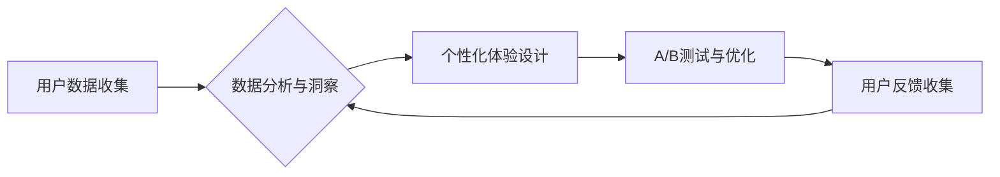

> 自动化创业，用户体验，优化策略，人工智能，机器学习，数据分析，A/B测试，用户反馈

## 1. 背景介绍

在当今数字化时代，创业者面临着激烈的市场竞争。为了在红海中脱颖而出，提升用户体验已成为至关重要的战略目标。然而，传统的用户体验优化方法往往耗时费力，难以满足快速迭代的需求。随着人工智能（AI）和机器学习（ML）技术的快速发展，自动化创业模式应运而生，为用户体验优化提供了全新的可能性。

自动化创业的核心在于利用技术手段，构建高效、智能的运营体系，实现业务流程的自动化和智能化。在用户体验优化方面，自动化创业可以帮助创业者：

* **收集和分析用户数据：** 通过埋点、日志分析等技术，收集用户行为数据，并利用机器学习算法进行分析，洞察用户需求和痛点。
* **个性化用户体验：** 基于用户数据分析，为每个用户提供个性化的产品推荐、内容推送和服务体验。
* **实时优化用户界面：** 利用A/B测试等方法，实时测试不同版本的界面设计，并根据用户反馈进行优化。
* **自动化用户支持：** 利用聊天机器人等技术，提供24小时不间断的用户支持服务，提高用户满意度。

## 2. 核心概念与联系

**2.1 用户体验优化 (UX Optimization)**

用户体验优化是指通过一系列设计和技术手段，提升用户在使用产品或服务时的满意度、效率和愉悦感。

**2.2 自动化创业 (Automated Entrepreneurship)**

自动化创业是指利用技术手段，构建高效、智能的运营体系，实现业务流程的自动化和智能化。

**2.3 人工智能 (AI)**

人工智能是指模拟人类智能的计算机系统，能够学习、推理、决策和解决问题。

**2.4 机器学习 (ML)**

机器学习是人工智能的一个子领域，是指通过算法训练模型，使模型能够从数据中学习并进行预测或分类。

**2.5 数据分析 (Data Analysis)**

数据分析是指通过收集、清洗、分析和挖掘数据，发现数据背后的规律和趋势。

**2.6 A/B测试 (A/B Testing)**

A/B测试是一种实验方法，用于比较两个或多个版本之间的效果，以确定哪种版本更优。

**2.7 用户反馈 (User Feedback)**

用户反馈是指用户对产品或服务的评价和建议。

**2.8 流程图**



## 3. 核心算法原理 & 具体操作步骤

### 3.1 算法原理概述

用户体验优化算法通常基于机器学习和数据分析技术，其核心原理是通过分析用户行为数据，识别用户需求和痛点，并根据这些 insights 进行产品设计和优化。常见的算法包括：

* **推荐算法：** 基于用户历史行为、偏好和兴趣，推荐相关产品或内容。
* **分类算法：** 将用户行为数据进行分类，识别用户类型和行为模式。
* **聚类算法：** 将用户数据进行聚类，发现用户群体之间的相似性。
* **预测算法：** 基于历史数据预测用户未来的行为，例如用户流失率、购买概率等。

### 3.2 算法步骤详解

1. **数据收集：** 收集用户行为数据，例如用户访问页面、点击链接、浏览商品、购买记录等。
2. **数据清洗：** 对收集到的数据进行清洗，去除无效数据、重复数据和错误数据。
3. **数据分析：** 利用机器学习算法对数据进行分析，识别用户需求和痛点。
4. **模型训练：** 根据分析结果，训练机器学习模型，例如推荐模型、分类模型等。
5. **模型评估：** 对训练好的模型进行评估，验证模型的准确性和有效性。
6. **模型部署：** 将训练好的模型部署到生产环境，用于实时优化用户体验。

### 3.3 算法优缺点

**优点：**

* **自动化：** 可以自动收集、分析和优化用户体验数据，提高效率。
* **个性化：** 可以根据用户数据提供个性化的产品推荐、内容推送和服务体验。
* **数据驱动：** 基于数据分析，优化方案更科学、更有效。

**缺点：**

* **数据依赖：** 算法效果依赖于数据质量，数据不足或不准确会导致算法效果下降。
* **算法复杂：** 训练和部署机器学习模型需要一定的技术门槛。
* **隐私问题：** 用户数据收集和分析需要考虑用户隐私保护问题。

### 3.4 算法应用领域

* **电商平台：** 产品推荐、个性化营销、用户画像分析。
* **社交媒体：** 内容推荐、用户匹配、广告投放。
* **在线教育：** 个性化学习路径、知识点推荐、学习效果评估。
* **金融服务：** 风险评估、欺诈检测、客户服务自动化。

## 4. 数学模型和公式 & 详细讲解 & 举例说明

### 4.1 数学模型构建

用户体验优化算法通常基于以下数学模型：

* **推荐算法：** 基于协同过滤、内容过滤或混合推荐算法，预测用户对特定产品的评分或购买概率。
* **分类算法：** 使用逻辑回归、支持向量机或决策树等算法，将用户行为数据分类为不同的类别。
* **聚类算法：** 使用K-means、层次聚类或DBSCAN等算法，将用户数据聚类为不同的用户群体。

### 4.2 公式推导过程

推荐算法的协同过滤算法中，可以使用以下公式计算用户对物品的评分预测：

$$
\hat{r}_{u,i} = \bar{r}_u + \frac{\sum_{v \in N(u)} (r_{v,i} - \bar{r}_v) \cdot sim(u,v)}{\sum_{v \in N(u)} sim(u,v)}
$$

其中：

* $\hat{r}_{u,i}$：用户 $u$ 对物品 $i$ 的评分预测
* $\bar{r}_u$：用户 $u$ 的平均评分
* $r_{v,i}$：用户 $v$ 对物品 $i$ 的真实评分
* $\bar{r}_v$：用户 $v$ 的平均评分
* $sim(u,v)$：用户 $u$ 和用户 $v$ 之间的相似度

### 4.3 案例分析与讲解

假设有一个电商平台，想要推荐用户喜欢的商品。可以使用协同过滤算法，根据用户的购买历史和商品的相似度，预测用户对特定商品的评分。

例如，用户 A 购买了商品 X 和商品 Y，商品 X 和商品 Z 的相似度较高。根据协同过滤算法，可以预测用户 A 对商品 Z 的评分较高。

## 5. 项目实践：代码实例和详细解释说明

### 5.1 开发环境搭建

* 操作系统：Windows/macOS/Linux
* Python 版本：3.6+
* 必要的库：pandas, numpy, scikit-learn, matplotlib

### 5.2 源代码详细实现

```python
import pandas as pd
from sklearn.metrics.pairwise import cosine_similarity

# 加载用户购买数据
data = pd.read_csv('user_purchase_data.csv')

# 计算商品之间的相似度
item_similarity = cosine_similarity(data.pivot_table(index='item_id', columns='user_id', values='purchase_count').fillna(0))

# 预测用户对特定商品的评分
def predict_rating(user_id, item_id):
    user_purchase_history = data[data['user_id'] == user_id]['item_id'].tolist()
    similar_items = item_similarity[data.index.get_loc(item_id)]
    predicted_rating = 0
    for similar_item in similar_items:
        if similar_item > 0 and data[data['item_id'] == similar_item]['user_id'].isin([user_id]).any():
            predicted_rating += similar_item
    return predicted_rating

# 示例
user_id = 1
item_id = 10
predicted_rating = predict_rating(user_id, item_id)
print(f'用户 {user_id} 对商品 {item_id} 的预测评分: {predicted_rating}')
```

### 5.3 代码解读与分析

* 代码首先加载用户购买数据，并使用 cosine_similarity 函数计算商品之间的相似度。
* 然后，定义一个 predict_rating 函数，用于预测用户对特定商品的评分。
* 该函数根据用户的购买历史和商品之间的相似度，计算预测评分。
* 最后，示例代码演示了如何使用 predict_rating 函数预测用户对特定商品的评分。

### 5.4 运行结果展示

运行代码后，会输出用户对特定商品的预测评分。

## 6. 实际应用场景

### 6.1 电商平台

* **个性化推荐：** 根据用户的购买历史和浏览记录，推荐用户可能感兴趣的商品。
* **商品分类优化：** 分析用户搜索和浏览行为，优化商品分类结构，提高用户搜索效率。
* **促销活动优化：** 根据用户行为数据，制定个性化的促销活动，提高转化率。

### 6.2 社交媒体平台

* **内容推荐：** 根据用户的兴趣爱好和行为数据，推荐用户可能感兴趣的内容。
* **用户匹配：** 根据用户的兴趣爱好和社交关系，匹配用户之间的潜在联系。
* **广告投放：** 根据用户的兴趣爱好和行为数据，精准投放广告，提高广告效果。

### 6.3 在线教育平台

* **个性化学习路径：** 根据用户的学习进度和知识掌握情况，推荐个性化的学习路径。
* **知识点推荐：** 根据用户的学习内容和学习目标，推荐相关的知识点。
* **学习效果评估：** 分析用户的学习行为数据，评估用户的学习效果，并提供个性化的学习建议。

### 6.4 未来应用展望

随着人工智能和机器学习技术的不断发展，用户体验优化将更加智能化、个性化和自动化。未来，我们可以期待：

* **更精准的个性化推荐：** 利用更先进的算法和数据分析技术，提供更精准的个性化推荐。
* **更智能的交互体验：** 利用自然语言处理和语音识别技术，实现更智能的交互体验。
* **更主动的个性化服务：** 利用机器学习算法，主动预测用户需求，提供更主动的个性化服务。

## 7. 工具和资源推荐

### 7.1 学习资源推荐

* **书籍：**
    * 《机器学习》 - 周志华
    * 《深度学习》 - Ian Goodfellow
* **在线课程：**
    * Coursera: Machine Learning
    * edX: Artificial Intelligence
* **博客和网站：**
    * Towards Data Science
    * Machine Learning Mastery

### 7.2 开发工具推荐

* **Python:** 
    * pandas: 数据分析和处理
    * numpy: 数值计算
    * scikit-learn: 机器学习库
    * TensorFlow: 深度学习框架
    * PyTorch: 深度学习框架
* **数据可视化工具:**
    * matplotlib
    * seaborn

### 7.3 相关论文推荐

* **推荐算法：**
    * Collaborative Filtering for Implicit Feedback Datasets
    * Matrix Factorization Techniques for Recommender Systems
* **分类算法：**
    * Support Vector Machines
    * Decision Trees
* **聚类算法：**
    * K-Means Clustering
    * DBSCAN

## 8. 总结：未来发展趋势与挑战

### 8.1 研究成果总结

自动化创业为用户体验优化提供了全新的可能性，通过数据分析和机器学习算法，可以实现更精准的个性化推荐、更智能的交互体验和更主动的个性化服务。

### 8.2 未来发展趋势

* **更深度的个性化：** 利用更先进的算法