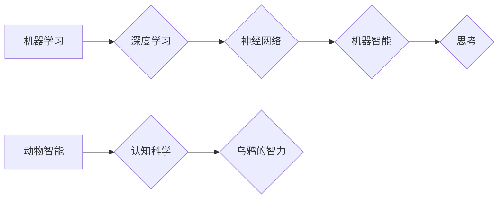

> 
> 机器学习,深度学习,人工智能,认知科学,动物智能,乌鸦,计算模型,算法,神经网络

## 1. 背景介绍

自人类开始思考机器智能的可能性以来，关于机器是否能够真正“思考”的争论从未停止。从图灵测试到现代深度学习，我们不断探索着机器认知的边界。而乌鸦，作为一种拥有高度智力的动物，其复杂的行为和学习能力，为我们理解机器智能提供了独特的视角。

近年来，人工智能领域取得了令人瞩目的进展，特别是深度学习技术的突破，使得机器在图像识别、自然语言处理等领域展现出惊人的能力。然而，这些成就仍然局限于特定的任务和数据范围，而真正的“思考”能力，例如创造性、推理和理解复杂情境，仍然是人工智能领域面临的重大挑战。

## 2. 核心概念与联系

**2.1  机器学习与深度学习**

机器学习是人工智能的一个重要分支，它通过算法学习数据中的模式，从而进行预测或决策。深度学习是机器学习的一种更高级形式，它利用多层神经网络来模拟人类大脑的结构和功能，从而能够处理更复杂的数据和任务。

**2.2  动物智能与认知科学**

动物智能研究着动物的行为、认知能力和学习方式，而认知科学则试图理解人类和动物的思维过程。研究动物智能，特别是乌鸦等具有高度智力的动物，可以为我们理解机器智能的本质提供启示。

**2.3  乌鸦的智力与行为**

乌鸦是一种拥有高度智力的鸟类，其表现出复杂的社会行为、工具使用能力和解决问题的能力。例如，乌鸦能够使用工具获取食物，识别人类的面部并记住它们，甚至能够进行简单的计划和推理。

**Mermaid 流程图**



## 3. 核心算法原理 & 具体操作步骤

**3.1  算法原理概述**

深度学习算法的核心是多层神经网络，它由多个神经元组成的层级结构组成。每个神经元接收来自上一层的输入信号，并对其进行处理，然后将处理后的信号传递到下一层。通过训练神经网络，使其能够学习数据中的模式，从而实现预测或决策。

**3.2  算法步骤详解**

1. **数据预处理:** 将原始数据转换为深度学习算法可以理解的格式，例如归一化、编码等。
2. **网络结构设计:** 根据任务需求设计神经网络的层数、神经元数量等结构参数。
3. **权值初始化:** 为神经网络中的连接权值赋予初始值。
4. **前向传播:** 将输入数据通过神经网络传递，计算输出结果。
5. **反向传播:** 计算输出结果与真实值的误差，并根据误差调整神经网络的权值。
6. **迭代训练:** 重复前向传播和反向传播的过程，直到模型达到预设的精度。

**3.3  算法优缺点**

**优点:**

* 能够处理复杂的数据和任务。
* 学习能力强，能够自动提取数据中的特征。
* 在图像识别、自然语言处理等领域取得了突破性进展。

**缺点:**

* 训练数据量大，需要大量的计算资源。
* 训练过程复杂，需要专业的知识和技术。
* 模型解释性差，难以理解模型的决策过程。

**3.4  算法应用领域**

* **图像识别:** 人脸识别、物体检测、图像分类等。
* **自然语言处理:** 机器翻译、文本摘要、情感分析等。
* **语音识别:** 语音转文本、语音助手等。
* **推荐系统:** 商品推荐、内容推荐等。
* **医疗诊断:** 病情预测、疾病诊断等。

## 4. 数学模型和公式 & 详细讲解 & 举例说明

**4.1  数学模型构建**

深度学习算法的核心是神经网络，其数学模型可以表示为一系列的线性变换和非线性激活函数。

**4.2  公式推导过程**

* **线性变换:** 每个神经元接收来自上一层的输入信号，并将其线性组合，得到一个新的信号。
* **激活函数:** 激活函数将线性变换后的信号进行非线性变换，从而引入非线性特征，使神经网络能够学习更复杂的模式。

**4.3  案例分析与讲解**

例如，一个简单的感知器神经网络可以表示为：

$$
y = f(w^T x + b)
$$

其中：

* $y$ 是神经网络的输出。
* $x$ 是输入向量。
* $w$ 是权重向量。
* $b$ 是偏置项。
* $f$ 是激活函数。

**举例说明:**

假设我们有一个二分类问题，需要判断图像是否包含猫。我们可以使用一个感知器神经网络，将图像特征作为输入，输出猫的概率。

## 5. 项目实践：代码实例和详细解释说明

**5.1  开发环境搭建**

* Python 3.x
* TensorFlow 或 PyTorch 等深度学习框架

**5.2  源代码详细实现**

```python
import tensorflow as tf

# 定义神经网络模型
model = tf.keras.models.Sequential([
    tf.keras.layers.Dense(128, activation='relu', input_shape=(784,)),
    tf.keras.layers.Dense(10, activation='softmax')
])

# 编译模型
model.compile(optimizer='adam',
              loss='sparse_categorical_crossentropy',
              metrics=['accuracy'])

# 训练模型
model.fit(x_train, y_train, epochs=10)

# 评估模型
loss, accuracy = model.evaluate(x_test, y_test)
print('Test loss:', loss)
print('Test accuracy:', accuracy)
```

**5.3  代码解读与分析**

* 代码首先定义了一个简单的深度学习模型，包含两层全连接神经网络。
* 然后，模型被编译，指定了优化器、损失函数和评估指标。
* 接着，模型被训练，使用训练数据进行迭代训练。
* 最后，模型被评估，使用测试数据计算损失和准确率。

**5.4  运行结果展示**

训练完成后，可以查看模型的损失和准确率，评估模型的性能。

## 6. 实际应用场景

**6.1  乌鸦行为模拟**

利用深度学习算法，可以模拟乌鸦的工具使用能力和解决问题的能力。例如，可以训练一个神经网络，使其能够识别不同的工具，并根据不同的场景选择合适的工具。

**6.2  动物行为研究**

深度学习算法可以用于分析动物行为数据，例如视频或传感器数据，从而更好地理解动物的认知能力和行为模式。

**6.3  人工智能伦理**

研究乌鸦的智力和行为，可以为我们理解人工智能的伦理问题提供启示。例如，当机器拥有类似于乌鸦的智力和行为能力时，我们应该如何对待它们？

**6.4  未来应用展望**

随着深度学习技术的不断发展，未来将有更多应用场景出现，例如：

* 更智能的机器人
* 更人性化的虚拟助手
* 更精准的医疗诊断

## 7. 工具和资源推荐

**7.1  学习资源推荐**

* 深度学习入门书籍：
    * 《深度学习》
    * 《动手学深度学习》
* 在线课程：
    * Coursera 深度学习课程
    * Udacity 深度学习工程师 Nanodegree

**7.2  开发工具推荐**

* TensorFlow
* PyTorch
* Keras

**7.3  相关论文推荐**

* 《ImageNet Classification with Deep Convolutional Neural Networks》
* 《Attention Is All You Need》

## 8. 总结：未来发展趋势与挑战

**8.1  研究成果总结**

近年来，深度学习算法取得了令人瞩目的进展，在图像识别、自然语言处理等领域取得了突破性成果。研究乌鸦的智力和行为，为我们理解机器智能的本质提供了新的视角。

**8.2  未来发展趋势**

* 更强大的计算能力
* 更大规模的数据集
* 更复杂的模型架构
* 更强的解释性和可解释性

**8.3  面临的挑战**

* 数据获取和标注的成本
* 模型训练的效率和资源消耗
* 模型的解释性和可信度
* 人工智能的伦理问题

**8.4  研究展望**

未来，人工智能研究将继续朝着更智能、更安全、更可解释的方向发展。研究乌鸦的智力和行为，将为我们提供宝贵的启示，帮助我们更好地理解和构建人工智能。

## 9. 附录：常见问题与解答

**9.1  深度学习算法真的能像人类一样思考吗？**

目前，深度学习算法仍然无法像人类一样思考。它们只能学习数据中的模式，并根据这些模式进行预测或决策。

**9.2  乌鸦的智力与机器智能有什么关系？**

研究乌鸦的智力和行为，可以为我们理解机器智能的本质提供启示。例如，乌鸦的工具使用能力和解决问题的能力，可以启发我们设计更智能的机器人。

**9.3  人工智能的伦理问题有哪些？**

人工智能的伦理问题包括：

* 机器人的权利和责任
* 人工智能的透明度和可解释性
* 人工智能的偏见和歧视
* 人工智能对人类就业的影响


作者：禅与计算机程序设计艺术 / Zen and the Art of Computer Programming 
<end_of_turn>