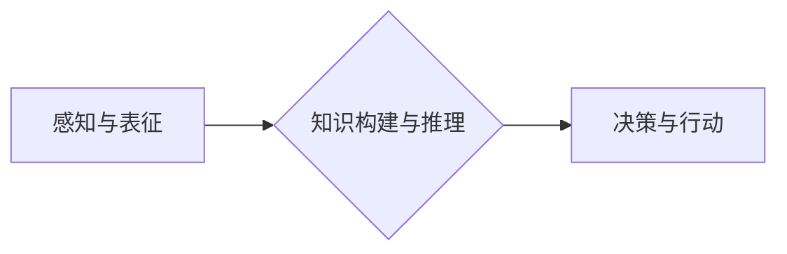

> 认知、渐进发展、三步模型、人工智能、机器学习、深度学习、知识图谱、推理、决策

## 1. 背景介绍

在人工智能领域，构建能够像人类一样思考、学习和解决问题的智能系统一直是终极目标。然而，人类的认知能力是复杂而多层次的，它并非一蹴而就，而是通过不断的学习和经验积累逐步发展完善的。因此，为了更好地理解和模拟人类认知，我们需要探索认知的渐进发展过程，并将其应用于人工智能的开发。

认知渐进发展模型试图描述认知能力从简单到复杂演进的路径，并为人工智能系统的设计提供参考。近年来，随着深度学习技术的突破，人工智能在许多领域取得了显著进展，但其认知能力仍然远逊于人类。因此，探索更有效的认知发展模型，推动人工智能朝着更智能的方向发展，显得尤为重要。

## 2. 核心概念与联系

认知渐进发展的三步模型主要包含三个阶段：

1. **感知与表征:** 这是认知发展的第一步，人工智能系统需要通过传感器获取外部信息，并将其转换为可理解的内部表征。例如，计算机视觉系统需要将图像转换为像素点、特征向量等形式，自然语言处理系统需要将文本转换为词向量、句向量等形式。

2. **知识构建与推理:** 在感知与表征的基础上，人工智能系统需要构建知识库，并利用推理机制进行知识整合和推导。例如，知识图谱可以存储各种实体和关系，并通过规则引擎进行推理，回答用户的问题或进行预测。

3. **决策与行动:** 这是认知发展最后一步，人工智能系统需要根据构建的知识和推理结果，做出决策并执行相应的行动。例如，自动驾驶系统需要根据路况、交通规则等信息，做出转向、加速、刹车等决策。

**Mermaid 流程图:**



## 3. 核心算法原理 & 具体操作步骤

### 3.1  算法原理概述

认知渐进发展的三步模型涉及多种算法和技术，包括机器学习、深度学习、知识图谱、推理引擎等。

* **机器学习:** 用于从数据中学习模式和规律，例如监督学习、无监督学习、强化学习等。
* **深度学习:** 基于多层神经网络，能够学习更复杂的特征表示，例如卷积神经网络、循环神经网络等。
* **知识图谱:** 用于存储和组织知识，并支持推理和查询，例如RDF、OWL等。
* **推理引擎:** 用于根据知识库中的规则进行推理和推导，例如Datalog、Prolog等。

### 3.2  算法步骤详解

1. **感知与表征:** 使用传感器获取数据，并将其转换为可理解的内部表征。例如，使用卷积神经网络对图像进行特征提取，使用词嵌入模型对文本进行词向量化。
2. **知识构建与推理:** 将感知到的信息存储到知识库中，并使用推理引擎进行知识整合和推导。例如，使用规则引擎根据知识图谱中的规则回答用户问题，使用逻辑推理引擎进行逻辑推导。
3. **决策与行动:** 根据构建的知识和推理结果，做出决策并执行相应的行动。例如，使用强化学习算法训练自动驾驶系统，根据路况和交通规则做出转向、加速、刹车等决策。

### 3.3  算法优缺点

* **优点:** 能够模拟人类认知过程，学习和适应复杂环境，具有较强的泛化能力。
* **缺点:** 需要大量的训练数据，训练过程复杂，计算资源消耗大，解释性较差。

### 3.4  算法应用领域

* **人工智能助手:** 例如，Siri、Alexa、Google Assistant等。
* **自动驾驶:** 例如，Tesla Autopilot、Waymo等。
* **医疗诊断:** 例如，辅助医生诊断疾病、预测患者风险等。
* **金融分析:** 例如，识别欺诈交易、预测股票价格等。

## 4. 数学模型和公式 & 详细讲解 & 举例说明

### 4.1  数学模型构建

认知渐进发展的三步模型可以抽象为一个数学模型，其中每个阶段可以用不同的数学公式来描述。例如，感知与表征阶段可以用信息论中的熵来衡量信息量，知识构建与推理阶段可以用图论中的路径长度来衡量知识的复杂度，决策与行动阶段可以用博弈论中的策略来描述决策过程。

### 4.2  公式推导过程

例如，我们可以用贝叶斯公式来描述感知与表征阶段的知识更新过程：

$$P(C|D) = \frac{P(D|C)P(C)}{P(D)}$$

其中：

* $P(C|D)$ 是给定证据 $D$ 下类别 $C$ 的后验概率。
* $P(D|C)$ 是类别 $C$ 下证据 $D$ 的似然概率。
* $P(C)$ 是类别 $C$ 的先验概率。
* $P(D)$ 是证据 $D$ 的先验概率。

### 4.3  案例分析与讲解

例如，假设我们有一个自动驾驶系统，需要识别红绿灯。我们可以使用卷积神经网络来提取图像特征，并将其转换为概率分布，表示识别红绿灯的置信度。

$$P(Red|Image) = 0.8$$

$$P(Green|Image) = 0.2$$

根据贝叶斯公式，我们可以更新红绿灯的识别概率，并做出相应的决策。

## 5. 项目实践：代码实例和详细解释说明

### 5.1  开发环境搭建

* 操作系统：Ubuntu 20.04
* Python 版本：3.8
* 必要的库：TensorFlow、PyTorch、NLTK、spaCy等

### 5.2  源代码详细实现

```python
# 这是一个简单的感知与表征的代码示例，使用卷积神经网络对图像进行特征提取

import tensorflow as tf

# 定义卷积神经网络模型
model = tf.keras.models.Sequential([
    tf.keras.layers.Conv2D(32, (3, 3), activation='relu', input_shape=(28, 28, 1)),
    tf.keras.layers.MaxPooling2D((2, 2)),
    tf.keras.layers.Conv2D(64, (3, 3), activation='relu'),
    tf.keras.layers.MaxPooling2D((2, 2)),
    tf.keras.layers.Flatten(),
    tf.keras.layers.Dense(10, activation='softmax')
])

# 编译模型
model.compile(optimizer='adam',
              loss='sparse_categorical_crossentropy',
              metrics=['accuracy'])

# 训练模型
model.fit(x_train, y_train, epochs=5)

# 评估模型
loss, accuracy = model.evaluate(x_test, y_test)
print('Test loss:', loss)
print('Test accuracy:', accuracy)
```

### 5.3  代码解读与分析

这段代码定义了一个简单的卷积神经网络模型，用于识别手写数字。模型包含两层卷积层、两层最大池化层、一层全连接层和一层输出层。

* 卷积层用于提取图像特征。
* 最大池化层用于降低特征维度。
* 全连接层用于将特征映射到输出类别。
* 输出层使用softmax激活函数，将输出概率分布到各个类别。

### 5.4  运行结果展示

训练完成后，我们可以使用模型对测试数据进行预测，并评估模型的准确率。

## 6. 实际应用场景

### 6.1  人工智能助手

认知渐进发展的三步模型可以用于构建更智能的人工智能助手，例如：

* 能够理解自然语言的对话系统。
* 能够根据用户需求提供个性化的服务。
* 能够学习用户的习惯和偏好，提供更精准的建议。

### 6.2  自动驾驶

认知渐进发展的三步模型可以用于构建更安全的自动驾驶系统，例如：

* 能够识别道路上的各种障碍物。
* 能够预测其他车辆的运动轨迹。
* 能够做出更合理的决策，避免事故发生。

### 6.3  医疗诊断

认知渐进发展的三步模型可以用于辅助医生进行医疗诊断，例如：

* 能够识别病人的症状和体征。
* 能够分析病人的病历和影像资料。
* 能够提供诊断建议和治疗方案。

### 6.4  未来应用展望

认知渐进发展的三步模型在未来将有更广泛的应用场景，例如：

* 教育领域：个性化学习系统、智能辅导系统。
* 金融领域：欺诈检测系统、风险评估系统。
* 娱乐领域：虚拟现实、增强现实。

## 7. 工具和资源推荐

### 7.1  学习资源推荐

* **书籍:**
    * 《深度学习》
    * 《人工智能：现代方法》
    * 《认知科学导论》
* **在线课程:**
    * Coursera: 深度学习
    * edX: 人工智能
    * Udacity: 自动驾驶

### 7.2  开发工具推荐

* **Python:** 广泛用于人工智能开发。
* **TensorFlow:** 开源深度学习框架。
* **PyTorch:** 开源深度学习框架。
* **Keras:** 高级深度学习API。

### 7.3  相关论文推荐

* **《ImageNet Classification with Deep Convolutional Neural Networks》**
* **《Attention Is All You Need》**
* **《BERT: Pre-training of Deep Bidirectional Transformers for Language Understanding》**

## 8. 总结：未来发展趋势与挑战

### 8.1  研究成果总结

认知渐进发展的三步模型为人工智能的发展提供了新的思路和方向。近年来，深度学习技术的突破使得人工智能在许多领域取得了显著进展，但其认知能力仍然远逊于人类。

### 8.2  未来发展趋势

未来，认知渐进发展模型将继续朝着更智能、更通用、更安全的方向发展，例如：

* **增强推理能力:** 发展更强大的推理引擎，使人工智能能够更好地理解和处理复杂信息。
* **提升知识表示能力:** 构建更丰富的知识图谱，并发展更有效的知识表示和推理方法。
* **加强解释性:** 使人工智能的决策过程更加透明和可解释，增强用户对人工智能的信任。

### 8.3  面临的挑战

认知渐进发展模型还面临着许多挑战，例如：

* **数据获取和标注:** 训练人工智能系统需要大量的训练数据，而获取和标注高质量数据是一个巨大的挑战。
* **计算资源:** 训练大型人工智能模型需要大量的计算资源，这对于资源有限的机构来说是一个瓶颈。
* **伦理问题:** 人工智能的快速发展也带来了伦理问题，例如算法偏见、数据隐私等，需要引起足够的重视。

### 8.4  研究展望

未来，我们将继续致力于探索认知渐进发展模型，并将其应用于更广泛的领域，为人类社会创造更多价值。


## 9. 附录：常见问题与解答

**Q1: 认知渐进发展模型与其他人工智能模型有什么区别？**

**A1:** 认知渐进发展模型强调模拟人类认知过程，并将其分为感知、知识构建和决策三个阶段。而其他人工智能模型，例如深度学习模型，往往侧重于学习数据模式，并直接进行预测或分类。

**Q2: 认知渐进发展模型的应用场景有哪些？**

**A2:** 认知渐进发展模型可以应用于各种领域，例如人工智能助手、自动驾驶、医疗诊断、教育、金融等。

**Q3: 认知渐进发展模型面临哪些挑战？**

**A3:** 认知渐进发展模型面临的数据获取、计算资源、伦理问题等挑战。


作者：禅与计算机程序设计艺术 / Zen and the Art of Computer Programming 
<end_of_turn>