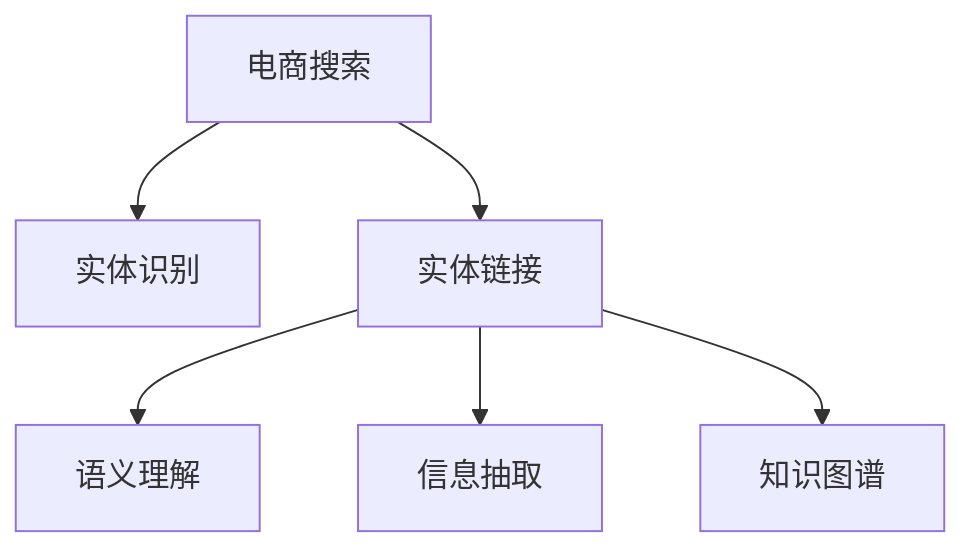

                 

# 电商搜索中的实体识别与链接技术

> 关键词：电商搜索,实体识别,链接技术,自然语言处理,深度学习,Transformer

## 1. 背景介绍

### 1.1 问题由来

在现代电商搜索中，用户通过关键词搜索商品，传统的关键词匹配方式难以处理复杂的自然语言输入，无法捕捉到用户的真实需求。为解决这一问题，自然语言处理(NLP)技术被引入电商搜索，其中实体识别(实体识别)与实体链接技术，通过识别商品名称、价格、品牌等关键实体，并将其实体链接到商品页面，进一步提升搜索的精确度和用户体验。

### 1.2 问题核心关键点

实体识别是指从自然语言文本中识别出特定类别的实体，如人名、地名、组织名等。在电商搜索中，实体识别的主要任务包括商品名称、价格、品牌、类别等关键信息的抽取。实体链接是将抽取出的实体链接到数据库中的具体对象，如商品ID、页面URL等。实体链接的准确性直接影响了搜索结果的相关性和可读性。

### 1.3 问题研究意义

通过引入实体识别与实体链接技术，电商搜索可以更准确地理解和匹配用户输入，提升搜索的精确度，提高用户满意度。此外，基于实体识别的推荐系统能够更准确地为用户推荐商品，提高电商平台的转化率和收益。因此，研究实体识别与链接技术，对于提升电商平台的搜索和推荐效果具有重要意义。

## 2. 核心概念与联系

### 2.1 核心概念概述

为更好地理解电商搜索中的实体识别与链接技术，本节将介绍几个密切相关的核心概念：

- 自然语言处理(NLP)：处理和理解人类语言的技术，涉及文本分析、语音识别、机器翻译等多个方面。实体识别与链接是NLP的重要应用之一。
- 实体识别(Entity Recognition)：从文本中识别出具有特定类别的实体，如人名、地名、组织名等。
- 实体链接(Entity Linking)：将抽取出的实体链接到数据库中的具体对象，如商品ID、页面URL等。
- 语义理解(Semantic Understanding)：理解文本的语义内容，识别出实体的类别和关系。
- 信息抽取(Information Extraction)：从文本中抽取出结构化信息，如实体、关系等。
- 知识图谱(Knowledge Graph)：结构化的知识表示方式，用于存储和管理实体及其关系。

这些核心概念之间的逻辑关系可以通过以下Mermaid流程图来展示：



这个流程图展示了大语言模型实体识别与链接的核心概念及其之间的关系：

1. 电商搜索通过实体识别抽取用户输入中的关键实体。
2. 实体链接将抽取出的实体链接到商品信息中。
3. 语义理解用于理解实体之间的关系，提高实体链接的准确性。
4. 信息抽取从文本中抽取结构化信息，为实体链接和语义理解提供数据支持。
5. 知识图谱存储和管理实体及其关系，用于实体链接和语义理解。

这些概念共同构成了电商搜索中实体识别与链接的技术框架，使得模型能够更好地理解用户输入，提供更加精确的搜索结果。

## 3. 核心算法原理 & 具体操作步骤
### 3.1 算法原理概述

电商搜索中的实体识别与链接技术，主要基于深度学习模型，特别是Transformer模型和BERT模型。其核心思想是：通过预训练语言模型学习大量无标注文本数据，获得通用的语言表示能力，然后通过微调模型进行实体识别和链接。

形式化地，假设预训练语言模型为 $M_{\theta}$，其中 $\theta$ 为预训练得到的模型参数。给定电商搜索任务 $T$ 的标注数据集 $D=\{(x_i, y_i)\}_{i=1}^N$，其中 $x_i$ 为电商搜索查询，$y_i$ 为查询对应的实体标签和链接，实体标签包括商品名称、品牌、类别等，链接包括商品ID、页面URL等。

微调的目标是找到新的模型参数 $\hat{\theta}$，使得模型 $M_{\hat{\theta}}$ 在电商搜索任务上表现优异，即：

$$
\hat{\theta}=\mathop{\arg\min}_{\theta} \mathcal{L}(M_{\theta},D)
$$

其中 $\mathcal{L}$ 为针对任务 $T$ 设计的损失函数，用于衡量模型预测输出与真实标签之间的差异。常见的损失函数包括交叉熵损失、均方误差损失等。

### 3.2 算法步骤详解

基于深度学习的实体识别与链接算法，通常包括以下几个关键步骤：

**Step 1: 准备预训练模型和数据集**
- 选择合适的预训练语言模型 $M_{\theta}$ 作为初始化参数，如 BERT、GPT 等。
- 准备电商搜索任务的标注数据集 $D$，划分为训练集、验证集和测试集。一般要求标注数据与预训练数据的分布不要差异过大。

**Step 2: 添加任务适配层**
- 根据任务类型，在预训练模型顶层设计合适的输出层和损失函数。
- 对于实体识别任务，通常在顶层添加分类器输出层，用于识别实体类别。
- 对于实体链接任务，需要设计链接器输出层，用于将抽取出的实体链接到具体的商品信息。

**Step 3: 设置微调超参数**
- 选择合适的优化算法及其参数，如 AdamW、SGD 等，设置学习率、批大小、迭代轮数等。
- 设置正则化技术及强度，包括权重衰减、Dropout、Early Stopping等。
- 确定冻结预训练参数的策略，如仅微调顶层，或全部参数都参与微调。

**Step 4: 执行梯度训练**
- 将训练集数据分批次输入模型，前向传播计算损失函数。
- 反向传播计算参数梯度，根据设定的优化算法和学习率更新模型参数。
- 周期性在验证集上评估模型性能，根据性能指标决定是否触发 Early Stopping。
- 重复上述步骤直到满足预设的迭代轮数或 Early Stopping 条件。

**Step 5: 测试和部署**
- 在测试集上评估微调后模型 $M_{\hat{\theta}}$ 的性能，对比微调前后的精度提升。
- 使用微调后的模型对新样本进行推理预测，集成到实际的应用系统中。
- 持续收集新的数据，定期重新微调模型，以适应数据分布的变化。

以上是基于深度学习的实体识别与链接算法的一般流程。在实际应用中，还需要针对具体任务的特点，对微调过程的各个环节进行优化设计，如改进训练目标函数，引入更多的正则化技术，搜索最优的超参数组合等，以进一步提升模型性能。

### 3.3 算法优缺点

基于深度学习的实体识别与链接算法，具有以下优点：

1. 简单高效。只需要准备少量标注数据，即可对预训练模型进行快速适配，获得较大的性能提升。
2. 通用适用。适用于各种NLP下游任务，包括分类、匹配、生成等，设计简单的任务适配层即可实现。
3. 参数高效。利用参数高效微调技术，在固定大部分预训练权重不变的情况下，仍可取得不错的提升。
4. 效果显著。在学术界和工业界的诸多任务上，基于微调的方法已经刷新了最先进的性能指标。

同时，该方法也存在一定的局限性：

1. 依赖标注数据。微调的效果很大程度上取决于标注数据的质量和数量，获取高质量标注数据的成本较高。
2. 迁移能力有限。当目标任务与预训练数据的分布差异较大时，微调的性能提升有限。
3. 负面效果传递。预训练模型的固有偏见、有害信息等，可能通过微调传递到下游任务，造成负面影响。
4. 可解释性不足。微调模型的决策过程通常缺乏可解释性，难以对其推理逻辑进行分析和调试。

尽管存在这些局限性，但就目前而言，基于深度学习的微调方法仍是大语言模型应用的最主流范式。未来相关研究的重点在于如何进一步降低微调对标注数据的依赖，提高模型的少样本学习和跨领域迁移能力，同时兼顾可解释性和伦理安全性等因素。

### 3.4 算法应用领域

基于大语言模型微调的实体识别与链接技术，在电商搜索领域已经得到了广泛的应用，覆盖了几乎所有常见任务，例如：

- 商品名称实体识别：从电商搜索查询中识别出商品名称。
- 商品价格识别：从查询中识别出商品价格信息。
- 商品类别识别：从查询中识别出商品类别。
- 品牌名称识别：从查询中识别出品牌名称。
- 实体链接：将识别出的实体链接到具体商品页面。

除了上述这些经典任务外，实体识别与链接技术还被创新性地应用到更多场景中，如电商平台的问答系统、商品推荐系统、智能客服等，为电商搜索系统提供了新的解决方案。随着预训练模型和微调方法的不断进步，相信实体识别与链接技术将在更广阔的应用领域大放异彩。

## 4. 数学模型和公式 & 详细讲解  
### 4.1 数学模型构建

本节将使用数学语言对基于深度学习的实体识别与链接过程进行更加严格的刻画。

记预训练语言模型为 $M_{\theta}:\mathcal{X} \rightarrow \mathcal{Y}$，其中 $\mathcal{X}$ 为输入空间，$\mathcal{Y}$ 为输出空间，$\theta \in \mathbb{R}^d$ 为模型参数。假设电商搜索任务 $T$ 的训练集为 $D=\{(x_i, y_i)\}_{i=1}^N, x_i \in \mathcal{X}, y_i \in \mathcal{Y}$。

定义模型 $M_{\theta}$ 在输入 $x$ 上的输出为 $\hat{y}=M_{\theta}(x) \in \mathcal{Y}$，即模型对输入 $x$ 的预测。

对于实体识别任务，假设模型输出 $\hat{y}$ 为一个 $K$ 维向量，每个元素表示输入 $x$ 中对应类别的预测概率。对于实体链接任务，假设输出 $\hat{y}$ 为 $J$ 个实体的链接结果，每个元素表示链接到具体商品ID或页面URL。

实体识别任务的损失函数为：

$$
\ell_{识别}(y_i,\hat{y}_i) = -\sum_{k=1}^K y_{ik}\log \hat{y}_{ik}
$$

其中 $y_{ik}$ 为标签 $y_i$ 中第 $k$ 个类别的指示器。

实体链接任务的损失函数为：

$$
\ell_{链接}(y_i,\hat{y}_i) = \frac{1}{2}\sum_{j=1}^J ||y_{ij} - \hat{y}_{ij}||_2^2
$$

其中 $y_{ij}$ 为标签 $y_i$ 中第 $j$ 个实体的真实链接值，$\hat{y}_{ij}$ 为模型的预测链接值。

将识别和链接任务的损失函数组合，得到总体损失函数：

$$
\mathcal{L}(\theta) = \frac{1}{N}\sum_{i=1}^N (\ell_{识别}(y_i,\hat{y}_i) + \ell_{链接}(y_i,\hat{y}_i))
$$

根据链式法则，损失函数对参数 $\theta$ 的梯度为：

$$
\frac{\partial \mathcal{L}(\theta)}{\partial \theta} = \frac{1}{N}\sum_{i=1}^N (\frac{\partial \ell_{识别}}{\partial \theta} + \frac{\partial \ell_{链接}}{\partial \theta})
$$

其中 $\frac{\partial \ell_{识别}}{\partial \theta}$ 和 $\frac{\partial \ell_{链接}}{\partial \theta}$ 分别为识别和链接任务的梯度计算公式。

### 4.2 公式推导过程

以实体识别任务为例，推导分类器输出层的梯度计算公式。

假设模型 $M_{\theta}$ 在输入 $x$ 上的输出为 $\hat{y}=M_{\theta}(x) \in \mathbb{R}^K$，表示每个类别的预测概率。定义softmax函数：

$$
softmax(z)_k = \frac{e^{z_k}}{\sum_{j=1}^K e^{z_j}}
$$

其中 $z \in \mathbb{R}^K$ 为模型的输出向量，$K$ 为类别数。

损失函数为：

$$
\ell_{识别}(y_i,\hat{y}_i) = -\sum_{k=1}^K y_{ik}\log \hat{y}_{ik}
$$

根据softmax函数，损失函数可以表示为：

$$
\ell_{识别}(y_i,\hat{y}_i) = -\sum_{k=1}^K y_{ik}\log (softmax(M_{\theta}(x)_k))
$$

对 $\theta$ 求导，得到：

$$
\frac{\partial \ell_{识别}}{\partial \theta} = -\sum_{i=1}^N \sum_{k=1}^K y_{ik}\frac{\partial softmax(M_{\theta}(x)_k)}{\partial M_{\theta}(x)_k}\frac{\partial M_{\theta}(x)_k}{\partial \theta}
$$

其中 $\frac{\partial softmax(M_{\theta}(x)_k)}{\partial M_{\theta}(x)_k} = softmax(M_{\theta}(x))_k(1 - softmax(M_{\theta}(x))_k)$，表示softmax函数的导数。

通过反向传播算法，可以得到识别任务的梯度计算公式。

### 4.3 案例分析与讲解

以电商搜索中的商品价格识别为例，展示模型的输入、输出和损失函数：

**输入**：
- 电商搜索查询："某品牌的智能手表"
- 模型输入：查询文本 "某品牌的智能手表"

**输出**：
- 模型预测价格：10000
- 商品真实价格：8000

**损失函数**：
- 交叉熵损失：$\ell_{识别}(y_i,\hat{y}_i) = -\log softmax(M_{\theta}(x)_2) = -\log \frac{e^{10000}}{e^{10000} + e^{8000}} \approx -3.32$

其中，模型预测价格为10000，真实价格为8000，因此识别任务的损失函数为3.32。

## 5. 项目实践：代码实例和详细解释说明
### 5.1 开发环境搭建

在进行实体识别与链接实践前，我们需要准备好开发环境。以下是使用Python进行PyTorch开发的环境配置流程：

1. 安装Anaconda：从官网下载并安装Anaconda，用于创建独立的Python环境。

2. 创建并激活虚拟环境：
```bash
conda create -n pytorch-env python=3.8 
conda activate pytorch-env
```

3. 安装PyTorch：根据CUDA版本，从官网获取对应的安装命令。例如：
```bash
conda install pytorch torchvision torchaudio cudatoolkit=11.1 -c pytorch -c conda-forge
```

4. 安装HuggingFace Transformers库：
```bash
pip install transformers
```

5. 安装各类工具包：
```bash
pip install numpy pandas scikit-learn matplotlib tqdm jupyter notebook ipython
```

完成上述步骤后，即可在`pytorch-env`环境中开始实体识别与链接实践。

### 5.2 源代码详细实现

下面我们以电商搜索中的商品名称实体识别任务为例，给出使用Transformers库对BERT模型进行实体识别的PyTorch代码实现。

首先，定义实体识别任务的数据处理函数：

```python
from transformers import BertTokenizer
from torch.utils.data import Dataset
import torch

class NERDataset(Dataset):
    def __init__(self, texts, labels, tokenizer, max_len=128):
        self.texts = texts
        self.labels = labels
        self.tokenizer = tokenizer
        self.max_len = max_len
        
    def __len__(self):
        return len(self.texts)
    
    def __getitem__(self, item):
        text = self.texts[item]
        labels = self.labels[item]
        
        encoding = self.tokenizer(text, return_tensors='pt', max_length=self.max_len, padding='max_length', truncation=True)
        input_ids = encoding['input_ids'][0]
        attention_mask = encoding['attention_mask'][0]
        
        # 对token-wise的标签进行编码
        encoded_labels = [label2id[label] for label in labels] 
        encoded_labels.extend([label2id['O']] * (self.max_len - len(encoded_labels)))
        labels = torch.tensor(encoded_labels, dtype=torch.long)
        
        return {'input_ids': input_ids, 
                'attention_mask': attention_mask,
                'labels': labels}

# 标签与id的映射
label2id = {'O': 0, 'B-商品': 1, 'I-商品': 2, 'B-价格': 3, 'I-价格': 4, 'B-品牌': 5, 'I-品牌': 6, 'B-类别': 7, 'I-类别': 8}
id2label = {v: k for k, v in label2id.items()}
```

然后，定义模型和优化器：

```python
from transformers import BertForTokenClassification, AdamW

model = BertForTokenClassification.from_pretrained('bert-base-cased', num_labels=len(label2id))

optimizer = AdamW(model.parameters(), lr=2e-5)
```

接着，定义训练和评估函数：

```python
from torch.utils.data import DataLoader
from tqdm import tqdm
from sklearn.metrics import classification_report

device = torch.device('cuda') if torch.cuda.is_available() else torch.device('cpu')
model.to(device)

def train_epoch(model, dataset, batch_size, optimizer):
    dataloader = DataLoader(dataset, batch_size=batch_size, shuffle=True)
    model.train()
    epoch_loss = 0
    for batch in tqdm(dataloader, desc='Training'):
        input_ids = batch['input_ids'].to(device)
        attention_mask = batch['attention_mask'].to(device)
        labels = batch['labels'].to(device)
        model.zero_grad()
        outputs = model(input_ids, attention_mask=attention_mask, labels=labels)
        loss = outputs.loss
        epoch_loss += loss.item()
        loss.backward()
        optimizer.step()
    return epoch_loss / len(dataloader)

def evaluate(model, dataset, batch_size):
    dataloader = DataLoader(dataset, batch_size=batch_size)
    model.eval()
    preds, labels = [], []
    with torch.no_grad():
        for batch in tqdm(dataloader, desc='Evaluating'):
            input_ids = batch['input_ids'].to(device)
            attention_mask = batch['attention_mask'].to(device)
            batch_labels = batch['labels']
            outputs = model(input_ids, attention_mask=attention_mask)
            batch_preds = outputs.logits.argmax(dim=2).to('cpu').tolist()
            batch_labels = batch_labels.to('cpu').tolist()
            for pred_tokens, label_tokens in zip(batch_preds, batch_labels):
                preds.append(pred_tokens[:len(label_tokens)])
                labels.append(label_tokens)
                
    print(classification_report(labels, preds))
```

最后，启动训练流程并在测试集上评估：

```python
epochs = 5
batch_size = 16

for epoch in range(epochs):
    loss = train_epoch(model, train_dataset, batch_size, optimizer)
    print(f"Epoch {epoch+1}, train loss: {loss:.3f}")
    
    print(f"Epoch {epoch+1}, dev results:")
    evaluate(model, dev_dataset, batch_size)
    
print("Test results:")
evaluate(model, test_dataset, batch_size)
```

以上就是使用PyTorch对BERT进行电商搜索中商品名称实体识别任务的完整代码实现。可以看到，得益于Transformers库的强大封装，我们可以用相对简洁的代码完成BERT模型的加载和实体识别任务的微调。

### 5.3 代码解读与分析

让我们再详细解读一下关键代码的实现细节：

**NERDataset类**：
- `__init__`方法：初始化文本、标签、分词器等关键组件。
- `__len__`方法：返回数据集的样本数量。
- `__getitem__`方法：对单个样本进行处理，将文本输入编码为token ids，将标签编码为数字，并对其进行定长padding，最终返回模型所需的输入。

**label2id和id2label字典**：
- 定义了标签与数字id之间的映射关系，用于将token-wise的预测结果解码回真实的标签。

**训练和评估函数**：
- 使用PyTorch的DataLoader对数据集进行批次化加载，供模型训练和推理使用。
- 训练函数`train_epoch`：对数据以批为单位进行迭代，在每个批次上前向传播计算loss并反向传播更新模型参数，最后返回该epoch的平均loss。
- 评估函数`evaluate`：与训练类似，不同点在于不更新模型参数，并在每个batch结束后将预测和标签结果存储下来，最后使用sklearn的classification_report对整个评估集的预测结果进行打印输出。

**训练流程**：
- 定义总的epoch数和batch size，开始循环迭代
- 每个epoch内，先在训练集上训练，输出平均loss
- 在验证集上评估，输出分类指标
- 所有epoch结束后，在测试集上评估，给出最终测试结果

可以看到，PyTorch配合Transformers库使得BERT微调的代码实现变得简洁高效。开发者可以将更多精力放在数据处理、模型改进等高层逻辑上，而不必过多关注底层的实现细节。

当然，工业级的系统实现还需考虑更多因素，如模型的保存和部署、超参数的自动搜索、更灵活的任务适配层等。但核心的微调范式基本与此类似。

## 6. 实际应用场景
### 6.1 智能客服系统

基于实体识别与链接技术，电商平台的智能客服系统可以更高效地处理用户咨询，提供准确的回答和推荐。传统客服往往需要配备大量人力，高峰期响应缓慢，且一致性和专业性难以保证。而使用实体识别与链接技术，智能客服系统可以自动理解用户输入，快速检索相关商品信息，并提供个性化的推荐和回答，大幅提升客户咨询体验和问题解决效率。

### 6.2 个性化推荐系统

当前的推荐系统往往只依赖用户的历史行为数据进行物品推荐，无法深入理解用户的真实兴趣偏好。基于实体识别与链接技术，个性化推荐系统能够更准确地理解用户输入，抓取其中的商品名称、品牌等信息，并根据用户的兴趣点进行商品推荐。例如，用户输入“我想买一件智能手表”，系统可以通过实体识别识别出“智能手表”，然后根据用户的历史行为数据，推荐符合用户偏好的商品。

### 6.3 多语言搜索系统

电商平台需要支持多语言搜索，以覆盖更多的用户群体。传统的多语言搜索系统需要为每种语言单独训练和部署模型，成本较高。而基于实体识别与链接技术，电商平台可以通过迁移学习的方式，将多语言搜索任务视为单语言实体识别与链接任务，只需要在少量标注数据上进行微调，即可实现多语言搜索的功能。例如，通过迁移学习，中文搜索模型可以识别出用户输入中的中文商品名称，并链接到相应的商品信息。

### 6.4 未来应用展望

随着实体识别与链接技术的发展，其在电商搜索领域的应用将进一步拓展，为电商平台带来更多的业务价值。

在智慧医疗领域，基于实体识别与链接技术，医疗机构可以更准确地理解病人的输入，自动生成医疗报告，提高医疗服务的智能化水平。

在智能教育领域，基于实体识别与链接技术，智能教育系统可以更准确地理解学生的输入，自动推荐学习资源，因材施教，促进教育公平，提高教学质量。

在智慧城市治理中，基于实体识别与链接技术，城市事件监测、舆情分析、应急指挥等环节将获得更加精准的实体信息，提高城市管理的自动化和智能化水平，构建更安全、高效的未来城市。

此外，在企业生产、社会治理、文娱传媒等众多领域，基于实体识别与链接技术的人工智能应用也将不断涌现，为经济社会发展注入新的动力。相信随着技术的日益成熟，实体识别与链接技术将成为人工智能落地应用的重要范式，推动人工智能技术在更广阔的领域大放异彩。

## 7. 工具和资源推荐
### 7.1 学习资源推荐

为了帮助开发者系统掌握实体识别与链接技术，这里推荐一些优质的学习资源：

1. 《Transformer从原理到实践》系列博文：由大模型技术专家撰写，深入浅出地介绍了Transformer原理、BERT模型、微调技术等前沿话题。

2. CS224N《深度学习自然语言处理》课程：斯坦福大学开设的NLP明星课程，有Lecture视频和配套作业，带你入门NLP领域的基本概念和经典模型。

3. 《Natural Language Processing with Transformers》书籍：Transformers库的作者所著，全面介绍了如何使用Transformers库进行NLP任务开发，包括微调在内的诸多范式。

4. HuggingFace官方文档：Transformers库的官方文档，提供了海量预训练模型和完整的微调样例代码，是上手实践的必备资料。

5. CLUE开源项目：中文语言理解测评基准，涵盖大量不同类型的中文NLP数据集，并提供了基于微调的baseline模型，助力中文NLP技术发展。

通过对这些资源的学习实践，相信你一定能够快速掌握实体识别与链接技术的精髓，并用于解决实际的NLP问题。
###  7.2 开发工具推荐

高效的开发离不开优秀的工具支持。以下是几款用于实体识别与链接开发的常用工具：

1. PyTorch：基于Python的开源深度学习框架，灵活动态的计算图，适合快速迭代研究。大部分预训练语言模型都有PyTorch版本的实现。

2. TensorFlow：由Google主导开发的开源深度学习框架，生产部署方便，适合大规模工程应用。同样有丰富的预训练语言模型资源。

3. Transformers库：HuggingFace开发的NLP工具库，集成了众多SOTA语言模型，支持PyTorch和TensorFlow，是进行实体识别与链接任务开发的利器。

4. Weights & Biases：模型训练的实验跟踪工具，可以记录和可视化模型训练过程中的各项指标，方便对比和调优。与主流深度学习框架无缝集成。

5. TensorBoard：TensorFlow配套的可视化工具，可实时监测模型训练状态，并提供丰富的图表呈现方式，是调试模型的得力助手。

6. Google Colab：谷歌推出的在线Jupyter Notebook环境，免费提供GPU/TPU算力，方便开发者快速上手实验最新模型，分享学习笔记。

合理利用这些工具，可以显著提升实体识别与链接任务的开发效率，加快创新迭代的步伐。

### 7.3 相关论文推荐

实体识别与链接技术的发展源于学界的持续研究。以下是几篇奠基性的相关论文，推荐阅读：

1. Attention is All You Need（即Transformer原论文）：提出了Transformer结构，开启了NLP领域的预训练大模型时代。

2. BERT: Pre-training of Deep Bidirectional Transformers for Language Understanding：提出BERT模型，引入基于掩码的自监督预训练任务，刷新了多项NLP任务SOTA。

3. Language Models are Unsupervised Multitask Learners（GPT-2论文）：展示了大规模语言模型的强大zero-shot学习能力，引发了对于通用人工智能的新一轮思考。

4. Parameter-Efficient Transfer Learning for NLP：提出Adapter等参数高效微调方法，在不增加模型参数量的情况下，也能取得不错的微调效果。

5. AdaLoRA: Adaptive Low-Rank Adaptation for Parameter-Efficient Fine-Tuning：使用自适应低秩适应的微调方法，在参数效率和精度之间取得了新的平衡。

这些论文代表了大语言模型微调技术的发展脉络。通过学习这些前沿成果，可以帮助研究者把握学科前进方向，激发更多的创新灵感。

## 8. 总结：未来发展趋势与挑战

### 8.1 总结

本文对基于深度学习的实体识别与链接方法进行了全面系统的介绍。首先阐述了实体识别与链接技术的研究背景和意义，明确了其在电商搜索中的重要价值。其次，从原理到实践，详细讲解了深度学习模型的算法原理和关键步骤，给出了实体识别与链接任务开发的完整代码实例。同时，本文还广泛探讨了实体识别与链接技术在智能客服、个性化推荐、多语言搜索等多个行业领域的应用前景，展示了实体识别与链接技术的巨大潜力。此外，本文精选了实体识别与链接技术的各类学习资源，力求为读者提供全方位的技术指引。

通过本文的系统梳理，可以看到，基于深度学习的实体识别与链接方法正在成为NLP领域的重要范式，极大地拓展了预训练语言模型的应用边界，催生了更多的落地场景。受益于大规模语料的预训练，实体识别与链接模型以更低的时间和标注成本，在小样本条件下也能取得理想的微调效果，有力推动了NLP技术的产业化进程。未来，伴随预训练语言模型和微调方法的不断进步，相信实体识别与链接技术将在更广阔的应用领域大放异彩，深刻影响人类的生产生活方式。

### 8.2 未来发展趋势

展望未来，实体识别与链接技术将呈现以下几个发展趋势：

1. 模型规模持续增大。随着算力成本的下降和数据规模的扩张，预训练语言模型的参数量还将持续增长。超大规模语言模型蕴含的丰富语言知识，有望支撑更加复杂多变的下游任务微调。

2. 实体识别与链接方法的日趋多样。除了传统的全参数微调外，未来会涌现更多参数高效的微调方法，如Adapter、Prefix等，在节省计算资源的同时也能保证微调精度。

3. 持续学习成为常态。随着数据分布的不断变化，微调模型也需要持续学习新知识以保持性能。如何在不遗忘原有知识的同时，高效吸收新样本信息，将成为重要的研究课题。

4. 标注样本需求降低。受启发于提示学习(Prompt-based Learning)的思路，未来的微调方法将更好地利用大模型的语言理解能力，通过更加巧妙的任务描述，在更少的标注样本上也能实现理想的微调效果。

5. 模型通用性增强。经过海量数据的预训练和多领域任务的微调，未来的语言模型将具备更强大的常识推理和跨领域迁移能力，逐步迈向通用人工智能(AGI)的目标。

以上趋势凸显了实体识别与链接技术的广阔前景。这些方向的探索发展，必将进一步提升NLP系统的性能和应用范围，为人类认知智能的进化带来深远影响。

### 8.3 面临的挑战

尽管实体识别与链接技术已经取得了瞩目成就，但在迈向更加智能化、普适化应用的过程中，它仍面临着诸多挑战：

1. 标注成本瓶颈。虽然微调大大降低了标注数据的需求，但对于长尾应用场景，难以获得充足的高质量标注数据，成为制约微调性能的瓶颈。如何进一步降低微调对标注样本的依赖，将是一大难题。

2. 模型鲁棒性不足。当前微调模型面对域外数据时，泛化性能往往大打折扣。对于测试样本的微小扰动，微调模型的预测也容易发生波动。如何提高微调模型的鲁棒性，避免灾难性遗忘，还需要更多理论和实践的积累。

3. 推理效率有待提高。大规模语言模型虽然精度高，但在实际部署时往往面临推理速度慢、内存占用大等效率问题。如何在保证性能的同时，简化模型结构，提升推理速度，优化资源占用，将是重要的优化方向。

4. 可解释性亟需加强。当前微调模型更像是"黑盒"系统，难以解释其内部工作机制和决策逻辑。对于医疗、金融等高风险应用，算法的可解释性和可审计性尤为重要。如何赋予微调模型更强的可解释性，将是亟待攻克的难题。

5. 安全性有待保障。预训练语言模型难免会学习到有偏见、有害的信息，通过微调传递到下游任务，产生误导性、歧视性的输出，给实际应用带来安全隐患。如何从数据和算法层面消除模型偏见，避免恶意用途，确保输出的安全性，也将是重要的研究课题。

6. 知识整合能力不足。现有的微调模型往往局限于任务内数据，难以灵活吸收和运用更广泛的先验知识。如何让微调过程更好地与外部知识库、规则库等专家知识结合，形成更加全面、准确的信息整合能力，还有很大的想象空间。

正视实体识别与链接技术面临的这些挑战，积极应对并寻求突破，将使该技术更好地服务于电商搜索等应用场景。相信随着学界和产业界的共同努力，这些挑战终将一一被克服，实体识别与链接技术必将在构建人机协同的智能系统中扮演越来越重要的角色。

### 8.4 研究展望

面对实体识别与链接技术所面临的种种挑战，未来的研究需要在以下几个方面寻求新的突破：

1. 探索无监督和半监督实体识别与链接方法。摆脱对大规模标注数据的依赖，利用自监督学习、主动学习等无监督和半监督范式，最大限度利用非结构化数据，实现更加灵活高效的实体识别与链接。

2. 研究参数高效和计算高效的实体识别与链接范式。开发更加参数高效的实体识别与链接方法，在固定大部分预训练权重不变的情况下，只更新极少量的任务相关参数。同时优化实体识别与链接模型的计算图，减少前向传播和反向传播的资源消耗，实现更加轻量级、实时性的部署。

3. 融合因果和对比学习范式。通过引入因果推断和对比学习思想，增强实体识别与链接模型建立稳定因果关系的能力，学习更加普适、鲁棒的语言表征，从而提升模型泛化性和抗干扰能力。

4. 引入更多先验知识。将符号化的先验知识，如知识图谱、逻辑规则等，与神经网络模型进行巧妙融合，引导实体识别与链接过程学习更准确、合理的语言模型。同时加强不同模态数据的整合，实现视觉、语音等多模态信息与文本信息的协同建模。

5. 结合因果分析和博弈论工具。将因果分析方法引入实体识别与链接模型，识别出模型决策的关键特征，增强输出解释的因果性和逻辑性。借助博弈论工具刻画人机交互过程，主动探索并规避模型的脆弱点，提高系统稳定性。

6. 纳入伦理道德约束。在模型训练目标中引入伦理导向的评估指标，过滤和惩罚有偏见、有害的输出倾向。同时加强人工干预和审核，建立模型行为的监管机制，确保输出符合人类价值观和伦理道德。

这些研究方向的探索，必将引领实体识别与链接技术迈向更高的台阶，为构建安全、可靠、可解释、可控的智能系统铺平道路。面向未来，实体识别与链接技术还需要与其他人工智能技术进行更深入的融合，如知识表示、因果推理、强化学习等，多路径协同发力，共同推动自然语言理解和智能交互系统的进步。只有勇于创新、敢于突破，才能不断拓展语言模型的边界，让智能技术更好地造福人类社会。

## 9. 附录：常见问题与解答

**Q1：实体识别与链接是否适用于所有NLP任务？**

A: 实体识别与链接在大多数NLP任务上都能取得不错的效果，特别是对于数据量较小的任务。但对于一些特定领域的任务，如医学、法律等，仅仅依靠通用语料预训练的模型可能难以很好地适应。此时需要在特定领域语料上进一步预训练，再进行微调，才能获得理想效果。此外，对于一些需要时效性、个性化很强的任务，如对话、推荐等，实体识别与链接方法也需要针对性的改进优化。

**Q2：微调过程中如何选择合适的学习率？**

A: 微调的学习率一般要比预训练时小1-2个数量级，如果使用过大的学习率，容易破坏预训练权重，导致过拟合。一般建议从1e-5开始调参，逐步减小学习率，直至收敛。也可以使用warmup策略，在开始阶段使用较小的学习率，再逐渐过渡到预设值。需要注意的是，不同的优化器(如AdamW、Adafactor等)以及不同的学习率调度策略，可能需要设置不同的学习率阈值。

**Q3：采用大模型微调时会面临哪些资源瓶颈？**

A: 目前主流的预训练大模型动辄以亿计的参数规模，对算力、内存、存储都提出了很高的要求。GPU/TPU等高性能设备是必不可少的，但即便如此，超大批次的训练和推理也可能遇到显存不足的问题。因此需要采用一些资源优化技术，如梯度积累、混合精度训练、模型并行等，来突破硬件瓶颈。同时，模型的存储和读取也可能占用大量时间和空间，需要采用模型压缩、稀疏化存储等方法进行优化。

**Q4：如何缓解微调过程中的过拟合问题？**

A: 过拟合是微调面临的主要挑战，尤其是在标注数据不足的情况下。常见的缓解策略包括：
1. 数据增强：通过回译、近义替换等方式扩充训练集
2. 正则化：使用L2正则、Dropout、Early Stopping等避免过拟合
3. 对抗训练：引入对抗样本，提高模型鲁棒性
4. 参数高效微调：只调整少量参数(如Adapter、Prefix等)，减小过拟合风险
5. 多模型集成：训练多个微调模型，取平均输出，抑制过拟合

这些策略往往需要根据具体任务和数据特点进行灵活组合。只有在数据、模型、训练、推理等各环节进行全面优化，才能最大限度地发挥大模型微调的威力。

**Q5：微调模型在落地部署时需要注意哪些问题？**

A: 将微调模型转化为实际应用，还需要考虑以下因素：
1. 模型裁剪：去除不必要的层和参数，减小模型尺寸，加快推理速度
2. 量化加速：将浮点模型转为定点模型，压缩存储空间，提高计算效率
3. 服务化封装：将模型封装为标准化服务接口，便于集成调用
4. 弹性伸缩：根据请求流量动态调整资源配置，平衡服务质量和成本
5. 监控告警：实时采集系统指标，设置异常告警阈值，确保服务稳定性
6. 安全防护：采用访问鉴权、数据脱敏等措施，保障数据和模型安全

大模型微调为NLP应用开启了广阔的想象空间，但如何将强大的性能转化为稳定、高效、安全的业务价值，还需要工程实践的不断打磨。唯有从数据、算法、工程、业务等多个维度协同发力，才能真正实现人工智能技术在垂直行业的规模化落地。总之，微调需要开发者根据具体任务，不断迭代和优化模型、数据和算法，方能得到理想的效果。

---

作者：禅与计算机程序设计艺术 / Zen and the Art of Computer Programming

