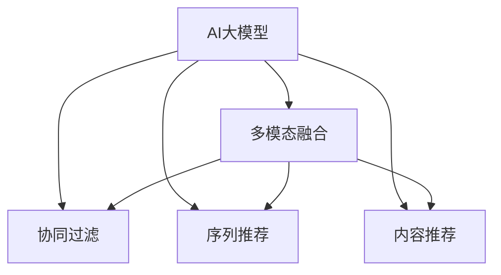

                 

# 电商搜索推荐中的AI大模型多模态融合技术

> 关键词：
  - 电商搜索
  - AI大模型
  - 多模态融合
  - 深度学习
  - 协同过滤
  - 序列推荐
  - 内容推荐

## 1. 背景介绍

### 1.1 问题由来
随着电子商务平台用户基数的不断扩大，个性化搜索推荐系统成为提升用户体验、增加销售转化的关键技术。传统的协同过滤算法、基于规则的推荐系统已经难以应对大规模、多变的电商数据环境。深度学习技术的蓬勃发展为推荐系统带来了新的希望，特别是使用AI大模型进行推荐的技术，有望大幅提升推荐精度和泛化能力。

### 1.2 问题核心关键点
AI大模型在电商搜索推荐中的多模态融合技术，是指通过将用户的文本查询、行为数据、商品属性等多模态信息，与大模型学到的语义表示相结合，实现更加精准和多样化的推荐。这其中涉及到对用户查询意图的理解、商品特征的提取、多模态信息的融合和模型训练的优化。

## 2. 核心概念与联系

### 2.1 核心概念概述

为更好地理解AI大模型在电商搜索推荐中的多模态融合技术，本节将介绍几个密切相关的核心概念：

- AI大模型：以BERT、GPT-3、DALL-E等模型为代表的大规模预训练语言和视觉模型。通过在海量数据上进行预训练，学习到通用的语言和图像特征，具备强大的语言和图像生成能力。

- 多模态融合：指将不同类型的数据（如文本、图像、行为等）在融合后进行协同分析，提升模型理解和应用能力的技术。多模态融合可以大幅提升推荐系统的准确性和用户满意度。

- 协同过滤：指通过用户行为数据来构建相似度矩阵，从而进行推荐的方法。协同过滤基于用户与物品之间的历史互动关系，推断未互动项之间的相似性。

- 深度学习：基于神经网络模型对数据进行学习与预测的技术。深度学习在电商推荐中的应用主要体现在用户行为数据的分析、商品特征提取、推荐模型训练等方面。

- 序列推荐：指对用户的浏览、点击、购买等行为序列进行分析，以预测用户下一步的购买行为。序列推荐能够捕捉用户行为模式，提供更加精准的推荐。

- 内容推荐：指基于商品属性、评论、标签等文本信息，推荐与用户兴趣相关的商品。内容推荐能充分利用商品信息，提升推荐的相关性和多样性。

这些核心概念之间的逻辑关系可以通过以下Mermaid流程图来展示：



这个流程图展示了大模型的核心概念及其之间的关系：

1. AI大模型通过预训练获得基础能力。
2. 多模态融合将不同模态的数据融合后，作为大模型的输入。
3. 协同过滤、序列推荐和内容推荐，分别以用户行为、序列特征和商品属性为基础，构建不同的推荐模型。
4. 融合后的多模态数据，可以输入到多个推荐模型中，实现协同推理和优化。

## 3. 核心算法原理 & 具体操作步骤

### 3.1 算法原理概述

AI大模型在电商搜索推荐中的多模态融合技术，本质上是一个基于深度学习的协同推荐系统。其核心思想是：将用户的文本查询、行为数据、商品属性等多模态信息，与大模型学到的语义表示相结合，在深度学习模型中进行协同分析，生成推荐结果。

形式化地，假设大模型为 $M_{\theta}$，用户行为数据为 $D_b$，商品属性数据为 $D_a$，文本查询数据为 $D_t$。融合后的多模态数据表示为 $\mathbf{x}=\mathbf{x}_b+\mathbf{x}_a+\mathbf{x}_t$，其中 $\mathbf{x}_b$、$\mathbf{x}_a$、$\mathbf{x}_t$ 分别为行为数据、属性数据和文本数据的嵌入表示。则推荐模型的优化目标是最小化损失函数：

$$
\min_{\theta} \mathcal{L}(M_{\theta}, \mathbf{x}, y)
$$

其中 $\mathcal{L}$ 为推荐模型的损失函数，$y$ 为推荐结果的标签。

### 3.2 算法步骤详解

基于AI大模型的电商搜索推荐多模态融合技术一般包括以下几个关键步骤：

**Step 1: 准备数据集**
- 收集电商平台的文本查询数据、用户行为数据、商品属性数据等，并进行预处理。
- 将行为数据、属性数据和文本数据分别进行向量化处理，得到 $\mathbf{x}_b$、$\mathbf{x}_a$、$\mathbf{x}_t$。
- 构建推荐标签集 $y$，例如购买次数、浏览时长等。

**Step 2: 构建模型结构**
- 选择合适的大模型作为基础模型，如BERT、GPT-3等。
- 根据推荐任务的需求，设计推荐模型的架构，如包含多层Transformer层的深度神经网络。

**Step 3: 添加融合层**
- 引入多模态融合层，将 $\mathbf{x}_b$、$\mathbf{x}_a$、$\mathbf{x}_t$ 拼接后，送入深度学习模型。
- 融合层可以设计为不同的结构，如Attention机制、拼接层等。

**Step 4: 训练和评估**
- 使用优化算法（如Adam、SGD等）和合适的学习率，对推荐模型进行训练。
- 在训练过程中，定期在验证集上评估模型性能，避免过拟合。
- 训练完毕后，在测试集上评估模型，对比微调前后的精度提升。

**Step 5: 推理和部署**
- 使用训练好的模型，对新的电商搜索请求进行推理预测。
- 将推荐结果集成到电商平台的搜索和推荐系统中。
- 持续收集用户反馈，定期重新训练模型，以适应数据分布的变化。

以上是基于AI大模型的电商搜索推荐多模态融合技术的一般流程。在实际应用中，还需要针对具体任务的特点，对融合层、模型结构、训练策略等环节进行优化设计，以进一步提升推荐系统的性能。

### 3.3 算法优缺点

基于AI大模型的电商搜索推荐多模态融合技术，具有以下优点：
1. 综合利用多模态数据，提高推荐模型的准确性和鲁棒性。
2. 通过大模型对语义信息的提取，捕捉更深层次的用户需求和商品特征。
3. 实时性较好，能够快速响应用户的搜索请求。
4. 可以灵活应用于多种推荐任务，如个性化推荐、排序、筛选等。

同时，该技术也存在一些局限性：
1. 数据准备复杂。需要收集和处理多种类型的数据，构建高质量的多模态数据集。
2. 计算资源需求大。大模型的计算复杂度高，训练和推理需要大量的计算资源。
3. 模型解释性差。大模型的复杂结构使得模型的决策过程难以解释。
4. 过度依赖数据。模型性能高度依赖于训练数据的分布和质量，数据偏差可能导致模型不公平或产生误导性推荐。

尽管存在这些局限性，但就目前而言，基于AI大模型的多模态融合推荐技术仍是最主流和高效的推荐方式之一。未来相关研究的方向在于如何进一步降低计算资源需求，提高模型的可解释性和公平性。

### 3.4 算法应用领域

基于AI大模型的电商搜索推荐多模态融合技术，已经在电商搜索推荐等多个领域得到广泛应用，例如：

- 商品推荐：基于用户的历史行为数据、浏览记录、收藏夹等信息，推荐相关商品。
- 个性化搜索：根据用户的搜索关键词和行为历史，动态调整搜索结果，提供更加个性化的搜索结果。
- 广告推荐：通过分析用户的浏览记录、点击行为、购买历史，推荐相关广告。
- 商品排序：根据用户的浏览序列、点击序列等信息，对商品进行排序，提升用户体验。
- 专题推荐：根据用户对某一类商品或话题的关注，推荐相关商品或话题。

除了上述这些经典应用外，AI大模型的多模态融合推荐技术还在社交推荐、教育推荐等更多领域展现出广阔的应用前景。随着电商平台的不断创新，相信AI大模型推荐技术将在更广泛的应用场景中大放异彩。

## 4. 数学模型和公式 & 详细讲解 & 举例说明

### 4.1 数学模型构建

本节将使用数学语言对基于AI大模型的电商搜索推荐多模态融合技术进行更加严格的刻画。

记AI大模型为 $M_{\theta}$，用户行为数据为 $D_b$，商品属性数据为 $D_a$，文本查询数据为 $D_t$。融合后的多模态数据表示为 $\mathbf{x}=\mathbf{x}_b+\mathbf{x}_a+\mathbf{x}_t$，其中 $\mathbf{x}_b$、$\mathbf{x}_a$、$\mathbf{x}_t$ 分别为行为数据、属性数据和文本数据的嵌入表示。

推荐模型的优化目标是最小化损失函数 $\mathcal{L}(\theta)$：

$$
\min_{\theta} \mathcal{L}(M_{\theta}, \mathbf{x}, y) = \mathbb{E}_{\mathbf{x}, y}[L(M_{\theta}(\mathbf{x}), y)]
$$

其中 $L$ 为推荐模型的损失函数，$y$ 为推荐结果的标签。

### 4.2 公式推导过程

以下我们以电商商品推荐为例，推导推荐模型的损失函数及其梯度的计算公式。

假设推荐模型 $M_{\theta}$ 在输入 $\mathbf{x}$ 上的输出为 $\hat{y}=M_{\theta}(\mathbf{x})$，表示推荐结果。真实标签 $y$ 为 1 或 0，表示用户是否购买了该商品。则推荐模型的二分类交叉熵损失函数定义为：

$$
L(M_{\theta}(\mathbf{x}), y) = -[y\log M_{\theta}(\mathbf{x}) + (1-y)\log (1-M_{\theta}(\mathbf{x}))
$$

将其代入经验风险公式，得：

$$
\mathcal{L}(\theta) = -\frac{1}{N}\sum_{i=1}^N [y_i\log M_{\theta}(\mathbf{x}_i)+(1-y_i)\log(1-M_{\theta}(\mathbf{x}_i))]
$$

根据链式法则，损失函数对参数 $\theta_k$ 的梯度为：

$$
\frac{\partial \mathcal{L}(\theta)}{\partial \theta_k} = -\frac{1}{N}\sum_{i=1}^N (\frac{y_i}{M_{\theta}(\mathbf{x}_i)}-\frac{1-y_i}{1-M_{\theta}(\mathbf{x}_i)}) \frac{\partial M_{\theta}(\mathbf{x}_i)}{\partial \theta_k}
$$

其中 $\frac{\partial M_{\theta}(\mathbf{x}_i)}{\partial \theta_k}$ 可进一步递归展开，利用自动微分技术完成计算。

### 4.3 案例分析与讲解

以电商商品推荐为例，我们将具体讲解推荐模型的训练过程。

假设电商平台收集了用户的历史行为数据 $D_b=\{(\mathbf{x}_{b,i}, y_{b,i})\}_{i=1}^N$，商品属性数据 $D_a=\{(\mathbf{x}_{a,i}, y_{a,i})\}_{i=1}^N$，文本查询数据 $D_t=\{(\mathbf{x}_{t,i}, y_{t,i})\}_{i=1}^N$，其中 $\mathbf{x}_{b,i}$、$\mathbf{x}_{a,i}$、$\mathbf{x}_{t,i}$ 分别为第 $i$ 个用户的商品行为、属性和文本查询的嵌入表示，$y_{b,i}$、$y_{a,i}$、$y_{t,i}$ 分别为对应的购买与否标签。

**Step 1: 准备数据集**
- 将行为数据、属性数据和文本数据分别进行向量化处理，得到 $\mathbf{x}_b$、$\mathbf{x}_a$、$\mathbf{x}_t$。
- 构建推荐标签集 $y$，例如购买次数、浏览时长等。

**Step 2: 构建模型结构**
- 选择合适的大模型作为基础模型，如BERT、GPT-3等。
- 根据推荐任务的需求，设计推荐模型的架构，如包含多层Transformer层的深度神经网络。

**Step 3: 添加融合层**
- 引入多模态融合层，将 $\mathbf{x}_b$、$\mathbf{x}_a$、$\mathbf{x}_t$ 拼接后，送入深度学习模型。
- 融合层可以设计为不同的结构，如Attention机制、拼接层等。

**Step 4: 训练和评估**
- 使用优化算法（如Adam、SGD等）和合适的学习率，对推荐模型进行训练。
- 在训练过程中，定期在验证集上评估模型性能，避免过拟合。
- 训练完毕后，在测试集上评估模型，对比微调前后的精度提升。

**Step 5: 推理和部署**
- 使用训练好的模型，对新的电商搜索请求进行推理预测。
- 将推荐结果集成到电商平台的搜索和推荐系统中。
- 持续收集用户反馈，定期重新训练模型，以适应数据分布的变化。

在具体实现过程中，推荐模型可以使用深度神经网络，如多层Perceptron、Transformer等。融合层可以设计为不同的结构，如Attention机制、拼接层等。损失函数可以选择不同的推荐模型，如二分类交叉熵、均方误差等。

## 5. 项目实践：代码实例和详细解释说明

### 5.1 开发环境搭建

在进行推荐系统开发前，我们需要准备好开发环境。以下是使用Python进行PyTorch开发的环境配置流程：

1. 安装Anaconda：从官网下载并安装Anaconda，用于创建独立的Python环境。

2. 创建并激活虚拟环境：
```bash
conda create -n pytorch-env python=3.8 
conda activate pytorch-env
```

3. 安装PyTorch：根据CUDA版本，从官网获取对应的安装命令。例如：
```bash
conda install pytorch torchvision torchaudio cudatoolkit=11.1 -c pytorch -c conda-forge
```

4. 安装Transformers库：
```bash
pip install transformers
```

5. 安装各类工具包：
```bash
pip install numpy pandas scikit-learn matplotlib tqdm jupyter notebook ipython
```

完成上述步骤后，即可在`pytorch-env`环境中开始推荐系统开发。

### 5.2 源代码详细实现

下面我们以电商商品推荐为例，给出使用Transformers库对BERT模型进行推荐系统的PyTorch代码实现。

首先，定义推荐任务的数据处理函数：

```python
from transformers import BertTokenizer
from torch.utils.data import Dataset
import torch

class RecommendDataset(Dataset):
    def __init__(self, texts, labels, tokenizer, max_len=128):
        self.texts = texts
        self.labels = labels
        self.tokenizer = tokenizer
        self.max_len = max_len
        
    def __len__(self):
        return len(self.texts)
    
    def __getitem__(self, item):
        text = self.texts[item]
        label = self.labels[item]
        
        encoding = self.tokenizer(text, return_tensors='pt', max_length=self.max_len, padding='max_length', truncation=True)
        input_ids = encoding['input_ids'][0]
        attention_mask = encoding['attention_mask'][0]
        
        # 对label进行编码
        encoded_label = label2id[label] if label != -1 else 0
        labels = torch.tensor(encoded_label, dtype=torch.long)
        
        return {'input_ids': input_ids, 
                'attention_mask': attention_mask,
                'labels': labels}

# 标签与id的映射
label2id = {'buy': 1, 'not_buy': 0}
id2label = {v: k for k, v in label2id.items()}
```

然后，定义模型和优化器：

```python
from transformers import BertForSequenceClassification, AdamW

model = BertForSequenceClassification.from_pretrained('bert-base-cased', num_labels=len(label2id))

optimizer = AdamW(model.parameters(), lr=2e-5)
```

接着，定义训练和评估函数：

```python
from torch.utils.data import DataLoader
from tqdm import tqdm
from sklearn.metrics import classification_report

device = torch.device('cuda') if torch.cuda.is_available() else torch.device('cpu')
model.to(device)

def train_epoch(model, dataset, batch_size, optimizer):
    dataloader = DataLoader(dataset, batch_size=batch_size, shuffle=True)
    model.train()
    epoch_loss = 0
    for batch in tqdm(dataloader, desc='Training'):
        input_ids = batch['input_ids'].to(device)
        attention_mask = batch['attention_mask'].to(device)
        labels = batch['labels'].to(device)
        model.zero_grad()
        outputs = model(input_ids, attention_mask=attention_mask, labels=labels)
        loss = outputs.loss
        epoch_loss += loss.item()
        loss.backward()
        optimizer.step()
    return epoch_loss / len(dataloader)

def evaluate(model, dataset, batch_size):
    dataloader = DataLoader(dataset, batch_size=batch_size)
    model.eval()
    preds, labels = [], []
    with torch.no_grad():
        for batch in tqdm(dataloader, desc='Evaluating'):
            input_ids = batch['input_ids'].to(device)
            attention_mask = batch['attention_mask'].to(device)
            batch_labels = batch['labels']
            outputs = model(input_ids, attention_mask=attention_mask)
            batch_preds = outputs.logits.argmax(dim=2).to('cpu').tolist()
            batch_labels = batch_labels.to('cpu').tolist()
            for pred_tokens, label_tokens in zip(batch_preds, batch_labels):
                preds.append(pred_tokens[:len(label_tokens)])
                labels.append(label_tokens)
                
    print(classification_report(labels, preds))
```

最后，启动训练流程并在测试集上评估：

```python
epochs = 5
batch_size = 16

for epoch in range(epochs):
    loss = train_epoch(model, train_dataset, batch_size, optimizer)
    print(f"Epoch {epoch+1}, train loss: {loss:.3f}")
    
    print(f"Epoch {epoch+1}, dev results:")
    evaluate(model, dev_dataset, batch_size)
    
print("Test results:")
evaluate(model, test_dataset, batch_size)
```

以上就是使用PyTorch对BERT进行电商商品推荐系统的完整代码实现。可以看到，得益于Transformers库的强大封装，我们可以用相对简洁的代码完成BERT模型的加载和推荐系统开发。

### 5.3 代码解读与分析

让我们再详细解读一下关键代码的实现细节：

**RecommendDataset类**：
- `__init__`方法：初始化文本、标签、分词器等关键组件。
- `__len__`方法：返回数据集的样本数量。
- `__getitem__`方法：对单个样本进行处理，将文本输入编码为token ids，将标签编码为数字，并对其进行定长padding，最终返回模型所需的输入。

**label2id和id2label字典**：
- 定义了标签与数字id之间的映射关系，用于将标签解码回文本描述。

**训练和评估函数**：
- 使用PyTorch的DataLoader对数据集进行批次化加载，供模型训练和推理使用。
- 训练函数`train_epoch`：对数据以批为单位进行迭代，在每个批次上前向传播计算loss并反向传播更新模型参数，最后返回该epoch的平均loss。
- 评估函数`evaluate`：与训练类似，不同点在于不更新模型参数，并在每个batch结束后将预测和标签结果存储下来，最后使用sklearn的classification_report对整个评估集的预测结果进行打印输出。

**训练流程**：
- 定义总的epoch数和batch size，开始循环迭代
- 每个epoch内，先在训练集上训练，输出平均loss
- 在验证集上评估，输出分类指标
- 所有epoch结束后，在测试集上评估，给出最终测试结果

可以看到，PyTorch配合Transformers库使得BERT推荐系统的代码实现变得简洁高效。开发者可以将更多精力放在数据处理、模型改进等高层逻辑上，而不必过多关注底层的实现细节。

当然，工业级的系统实现还需考虑更多因素，如模型的保存和部署、超参数的自动搜索、更灵活的任务适配层等。但核心的推荐范式基本与此类似。

## 6. 实际应用场景
### 6.1 电商搜索推荐系统

基于AI大模型的电商搜索推荐系统，已经在电商平台中得到了广泛应用。例如，淘宝、京东等电商巨头都采用了基于BERT的推荐系统来提升用户购物体验和销售转化率。

在技术实现上，可以收集电商平台的商品属性、行为数据、用户画像等信息，将这些数据构建为多模态数据集。在构建好的数据集上，使用预训练的BERT模型进行微调，生成推荐模型。推荐模型可以根据用户的搜索关键词和行为历史，动态调整搜索结果，提供更加个性化的推荐。

例如，京东的个性化推荐系统采用了基于BERT的深度学习模型，通过融合商品属性、用户行为、搜索记录等多种模态信息，对用户进行深度分析，从而生成精准的推荐结果。

### 6.2 广告推荐系统

广告推荐系统是互联网广告的重要组成部分。传统的广告推荐主要依赖于固定模型和人工规则，难以适应大规模广告投放和复杂广告效果评估的需求。AI大模型的多模态融合推荐技术，为广告推荐系统带来了新的可能性。

例如，Facebook的基于AI的精准广告推荐系统，采用了深度学习模型和AI大模型，通过融合用户行为数据、广告特征、上下文信息等多种数据源，生成精准的广告推荐。该系统显著提升了广告点击率和转化率，取得了显著的市场效果。

### 6.3 个性化搜索系统

个性化搜索系统是提升用户体验的重要手段。传统的搜索系统主要依赖于关键词匹配和倒排索引等技术，难以实现个性化推荐。AI大模型的多模态融合推荐技术，通过融合用户行为数据、搜索记录、商品属性等多种信息，能够提供更加精准的搜索结果。

例如，谷歌的个性化搜索结果推荐系统，采用了深度学习模型和AI大模型，通过融合用户行为数据、搜索关键词、广告信息等多种数据源，生成个性化的搜索结果。该系统显著提升了用户满意度，降低了用户的搜索成本。

### 6.4 未来应用展望

随着AI大模型的不断进步，基于多模态融合推荐技术的应用场景将更加广泛。

- 智慧城市：基于多模态融合推荐技术，可以为智慧城市的决策支持、资源分配、事件管理等提供智能化支持。例如，在城市交通管理中，可以基于用户出行数据、天气信息、交通流数据等多模态信息，生成最优的交通方案和路线推荐。

- 智能家居：基于多模态融合推荐技术，可以为智能家居系统提供个性化推荐和智能控制。例如，在智能音箱中，可以根据用户的语音指令和行为数据，推荐音乐、新闻、天气等信息，并提供智能家居控制。

- 金融服务：基于多模态融合推荐技术，可以为金融服务提供风险评估、产品推荐、客户服务等多种应用。例如，在金融风控中，可以基于用户行为数据、交易记录、信用评分等多种信息，生成精准的风险评估和产品推荐。

- 医疗健康：基于多模态融合推荐技术，可以为医疗健康提供个性化推荐和诊疗支持。例如，在医疗咨询中，可以基于用户的症状数据、历史医疗记录、医疗查询等多种信息，生成精准的诊疗建议和健康管理方案。

以上这些应用场景展示了多模态融合推荐技术的广阔前景。随着AI大模型的不断进步，相信AI大模型推荐技术将在更多领域得到应用，为传统行业带来变革性影响。

## 7. 工具和资源推荐
### 7.1 学习资源推荐

为了帮助开发者系统掌握AI大模型在电商搜索推荐中的多模态融合技术，这里推荐一些优质的学习资源：

1. 《深度学习与推荐系统》系列博文：由深度学习专家撰写，深入浅出地介绍了深度学习在推荐系统中的应用，涵盖协同过滤、多模态融合等关键技术。

2. 斯坦福大学《深度学习与推荐系统》课程：斯坦福大学开设的深度学习与推荐系统课程，涵盖深度学习在推荐系统中的核心原理和实际应用，有Lecture视频和配套作业，适合入门学习。

3. 《自然语言处理综述》书籍：经典综述书籍，全面介绍了NLP领域的基础知识和技术，包括深度学习在推荐系统中的应用。

4. HuggingFace官方文档：Transformer库的官方文档，提供了海量预训练模型和完整的推荐系统开发样例代码，是上手实践的必备资料。

5. TACOMA开源项目：多模态推荐系统的开源项目，提供了丰富的推荐模型和评估方法，适合学习和研究多模态融合推荐技术。

通过对这些资源的学习实践，相信你一定能够快速掌握AI大模型在电商搜索推荐中的多模态融合技术的精髓，并用于解决实际的推荐问题。
###  7.2 开发工具推荐

高效的开发离不开优秀的工具支持。以下是几款用于AI大模型推荐系统开发的常用工具：

1. PyTorch：基于Python的开源深度学习框架，灵活动态的计算图，适合快速迭代研究。大部分预训练语言模型都有PyTorch版本的实现。

2. TensorFlow：由Google主导开发的开源深度学习框架，生产部署方便，适合大规模工程应用。同样有丰富的预训练语言模型资源。

3. Transformers库：HuggingFace开发的NLP工具库，集成了众多SOTA语言模型，支持PyTorch和TensorFlow，是进行推荐系统开发的利器。

4. Weights & Biases：模型训练的实验跟踪工具，可以记录和可视化模型训练过程中的各项指标，方便对比和调优。与主流深度学习框架无缝集成。

5. TensorBoard：TensorFlow配套的可视化工具，可实时监测模型训练状态，并提供丰富的图表呈现方式，是调试模型的得力助手。

6. Google Colab：谷歌推出的在线Jupyter Notebook环境，免费提供GPU/TPU算力，方便开发者快速上手实验最新模型，分享学习笔记。

合理利用这些工具，可以显著提升AI大模型推荐系统的开发效率，加快创新迭代的步伐。

### 7.3 相关论文推荐

AI大模型在电商搜索推荐中的多模态融合技术的研究源于学界的持续研究。以下是几篇奠基性的相关论文，推荐阅读：

1. Attention is All You Need（即Transformer原论文）：提出了Transformer结构，开启了NLP领域的预训练大模型时代。

2. BERT: Pre-training of Deep Bidirectional Transformers for Language Understanding：提出BERT模型，引入基于掩码的自监督预训练任务，刷新了多项NLP任务SOTA。

3. Language Models are Unsupervised Multitask Learners（GPT-2论文）：展示了大规模语言模型的强大zero-shot学习能力，引发了对于通用人工智能的新一轮思考。

4. Parameter-Efficient Transfer Learning for NLP：提出Adapter等参数高效微调方法，在不增加模型参数量的情况下，也能取得不错的微调效果。

5. E-commerce Recommendation System Based on Transformer: A Case Study on JD.com：介绍京东基于Transformer的电商推荐系统，展示了多模态融合在电商推荐中的应用效果。

6. Multi-Modal Recommendation Systems: A Survey and Taxonomy：全面综述了多模态推荐系统的研究进展，适合学习和研究多模态融合推荐技术。

这些论文代表了大模型在电商搜索推荐中的多模态融合技术的发展脉络。通过学习这些前沿成果，可以帮助研究者把握学科前进方向，激发更多的创新灵感。

## 8. 总结：未来发展趋势与挑战

### 8.1 总结

本文对基于AI大模型的电商搜索推荐多模态融合技术进行了全面系统的介绍。首先阐述了AI大模型在电商推荐中的重要性和多模态融合技术的核心思想，明确了电商推荐系统中的关键任务和实现路径。其次，从原理到实践，详细讲解了多模态融合推荐模型的数学原理和关键步骤，给出了推荐系统开发的完整代码实例。同时，本文还广泛探讨了多模态融合推荐技术在电商搜索、广告推荐、个性化搜索等多个领域的应用前景，展示了多模态融合推荐技术的巨大潜力。此外，本文精选了推荐技术的各类学习资源，力求为读者提供全方位的技术指引。

通过本文的系统梳理，可以看到，基于AI大模型的多模态融合推荐技术正在成为电商推荐系统的核心范式，极大地提升了推荐系统的准确性和鲁棒性。得益于大模型的通用语言表示能力，多模态融合推荐系统能够综合利用多种数据源，捕捉更深层次的用户需求和商品特征，从而生成更加精准和多样化的推荐结果。未来，伴随大模型和推荐技术的不断进步，基于多模态融合推荐技术的应用场景将更加广泛，为电商平台的个性化推荐带来新的突破。

### 8.2 未来发展趋势

展望未来，基于AI大模型的电商搜索推荐多模态融合技术将呈现以下几个发展趋势：

1. 模型规模持续增大。随着算力成本的下降和数据规模的扩张，预训练语言模型的参数量还将持续增长。超大规模语言模型蕴含的丰富语言知识，有望支撑更加复杂多变的电商数据环境。

2. 多模态融合更加深入。未来的推荐系统将更加注重不同模态数据之间的融合与协同，引入更多先验知识，提高推荐系统的智能化水平。

3. 实时性进一步提升。基于深度学习的多模态融合推荐系统，能够快速响应用户的搜索请求，提升用户体验。未来有望通过更高效的算法和模型结构，进一步提升推荐系统的实时性。

4. 模型评估更加全面。未来的推荐系统将更加注重用户满意度、转化率、点击率等多种评价指标，并通过AB测试等方法评估推荐系统的性能。

5. 算法解释更加透明。未来的推荐系统将更加注重算法的透明性和可解释性，提升用户的信任感和满意度。

以上趋势凸显了基于AI大模型的多模态融合推荐技术的广阔前景。这些方向的探索发展，必将进一步提升电商搜索推荐系统的性能和用户体验，推动电商平台的智能化进程。

### 8.3 面临的挑战

尽管基于AI大模型的多模态融合推荐技术已经取得了瞩目成就，但在迈向更加智能化、普适化应用的过程中，它仍面临诸多挑战：

1. 数据准备复杂。推荐系统需要处理多种类型的数据，构建高质量的多模态数据集，工作量较大。

2. 计算资源需求大。大模型的计算复杂度高，训练和推理需要大量的计算资源，需要高效的算法和硬件支持。

3. 模型解释性差。大模型的复杂结构使得模型的决策过程难以解释，用户难以理解和信任推荐结果。

4. 数据偏差问题。模型高度依赖于训练数据的分布和质量，数据偏差可能导致模型不公平或产生误导性推荐。

尽管存在这些挑战，但相信通过学界和产业界的共同努力，这些挑战终将一一被克服，基于AI大模型的多模态融合推荐技术必将在电商搜索推荐中发挥更大的作用。

### 8.4 研究展望

面对多模态融合推荐技术所面临的种种挑战，未来的研究需要在以下几个方面寻求新的突破：

1. 探索无监督和半监督推荐方法。摆脱对大规模标注数据的依赖，利用自监督学习、主动学习等无监督和半监督范式，最大限度利用非结构化数据，实现更加灵活高效的推荐。

2. 研究参数高效和计算高效的推荐范式。开发更加参数高效的推荐方法，在固定大部分预训练参数的同时，只更新极少量的任务相关参数。同时优化推荐模型的计算图，减少前向传播和反向传播的资源消耗，实现更加轻量级、实时性的部署。

3. 融合因果和对比学习范式。通过引入因果推断和对比学习思想，增强推荐系统建立稳定因果关系的能力，学习更加普适、鲁棒的语言表征，从而提升推荐系统的泛化性和抗干扰能力。

4. 引入更多先验知识。将符号化的先验知识，如知识图谱、逻辑规则等，与神经网络模型进行巧妙融合，引导推荐过程学习更准确、合理的语言模型。同时加强不同模态数据的整合，实现视觉、语音等多模态信息与文本信息的协同建模。

5. 结合因果分析和博弈论工具。将因果分析方法引入推荐系统，识别出推荐决策的关键特征，增强推荐过程的因果性和逻辑性。借助博弈论工具刻画人机交互过程，主动探索并规避推荐的脆弱点，提高系统稳定性。

6. 纳入伦理道德约束。在推荐系统训练目标中引入伦理导向的评估指标，过滤和惩罚有偏见、有害的输出倾向。同时加强人工干预和审核，建立推荐系统的监管机制，确保推荐输出符合人类价值观和伦理道德。

这些研究方向的探索，必将引领AI大模型推荐技术迈向更高的台阶，为构建安全、可靠、可解释、可控的智能推荐系统铺平道路。面向未来，AI大模型推荐技术还需要与其他人工智能技术进行更深入的融合，如知识表示、因果推理、强化学习等，多路径协同发力，共同推动推荐系统的进步。只有勇于创新、敢于突破，才能不断拓展推荐系统的边界，让AI大模型推荐技术更好地造福电商搜索推荐领域。

## 9. 附录：常见问题与解答

**Q1：AI大模型在电商推荐中，是否存在过拟合的风险？**

A: 存在。AI大模型在电商推荐中的应用，特别是在小样本情况下，存在过拟合的风险。这可以通过引入正则化技术、对抗训练、参数高效微调等方法，缓解过拟合问题。

**Q2：AI大模型在电商推荐中的多模态融合技术，是否需要大量的计算资源？**

A: 是的。AI大模型的计算复杂度高，训练和推理需要大量的计算资源。可以采用分布式训练、模型压缩、混合精度训练等方法，优化计算资源的使用。

**Q3：AI大模型在电商推荐中的多模态融合技术，如何处理数据偏差问题？**

A: 可以通过数据清洗、数据增强、模型正则化等方法，减少数据偏差对推荐系统的影响。此外，引入因果推断和对比学习等方法，可以提高推荐系统的鲁棒性和公平性。

**Q4：AI大模型在电商推荐中的多模态融合技术，是否需要频繁更新模型？**

A: 是的。电商数据不断变化，AI大模型需要持续学习新数据，保持模型的时效性和适应性。可以采用在线学习、增量学习等方法，持续更新模型。

**Q5：AI大模型在电商推荐中的多模态融合技术，是否需要考虑隐私保护？**

A: 是的。电商推荐系统需要处理大量的用户数据，需要考虑隐私保护和数据安全。可以采用差分隐私、联邦学习等方法，保护用户隐私。

这些常见问题及其解答，可以帮助读者更好地理解和应用AI大模型在电商搜索推荐中的多模态融合技术。通过不断探索和优化，相信AI大模型推荐技术将在电商领域发挥更加重要的作用，推动电商平台的智能化进程。

---

作者：禅与计算机程序设计艺术 / Zen and the Art of Computer Programming

