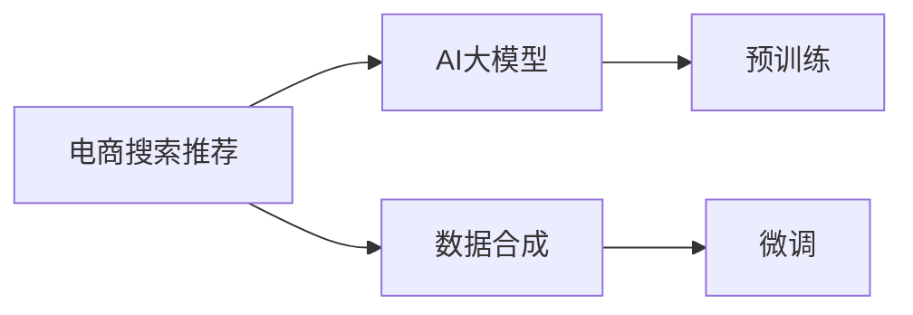

                 

# 电商搜索推荐中的AI大模型数据合成技术应用项目可行性分析与实践指南

> 关键词：电商搜索推荐, AI大模型, 数据合成, 推荐系统, 用户行为预测, 深度学习, 数据融合

## 1. 背景介绍

在当今电商领域，搜索推荐系统已成为一个关键的成功因素。据统计，超过70%的电商交易是通过搜索推荐的智能推荐算法完成的。一个优秀的搜索推荐系统，不仅需要基于用户行为的历史数据进行推荐，更需要在用户行为未发生时，借助AI模型预测用户行为，并根据预测结果进行推荐，从而提升用户满意度，增加销售额。

基于大模型的AI推荐系统近年来的研究逐步深入，大模型如BERT、GPT等经过大规模预训练，具备了强大的语义理解能力和特征表示能力，可在众多领域展现出色的预测效果。然而，电商搜索推荐领域的数据特点与一般领域的NLP任务存在明显差异，电商推荐数据往往是高维度稀疏且复杂的，且用户行为变化多端，传统的大模型可能需要大量的标注数据，难以在电商领域获得理想效果。

为了更好地利用大模型在电商推荐领域的应用，我们提出了一种新的方法，即AI大模型数据合成技术，通过模拟用户行为，生成合成数据，用于大模型的预训练和微调。基于合成数据的推荐模型不仅能够捕捉用户行为的内在规律，还能对冷启动用户进行有效推荐，大幅提升推荐系统的性能。

## 2. 核心概念与联系

### 2.1 核心概念概述

本文将主要介绍几个核心的概念，并探讨它们之间的联系。

- **电商搜索推荐**：指利用用户的历史浏览、点击、购买等行为数据，推荐用户可能感兴趣的商品或内容。电商搜索推荐系统是电商平台的核心组件，对平台的销售和用户体验至关重要。

- **AI大模型**：基于深度学习的大规模预训练模型，如BERT、GPT、T5等。这些模型通过在大规模语料上预训练，具备了强大的语义理解能力和特征表示能力，可用于解决复杂的自然语言处理问题。

- **数据合成**：通过算法生成人工数据，用于训练或测试模型。电商推荐系统的数据往往稀疏且复杂，数据合成技术可以帮助构建高质量的训练数据集，加速模型的预训练和微调。

- **推荐系统**：基于用户行为数据或产品属性，向用户推荐商品或内容的系统。推荐系统广泛应用于电商、新闻、音乐、视频等多个领域。

### 2.2 核心概念原理和架构的 Mermaid 流程图(Mermaid 流程节点中不要有括号、逗号等特殊字符)



该流程图展示了电商推荐系统与AI大模型及数据合成技术之间的联系。电商推荐系统通过数据合成生成合成数据，用于AI大模型的预训练和微调，从而提升推荐系统性能。

## 3. 核心算法原理 & 具体操作步骤

### 3.1 算法原理概述

基于大模型的电商推荐系统主要分为两步：预训练和微调。具体如下：

- **预训练**：利用合成数据对AI大模型进行预训练，使其具备电商推荐数据的内在特征表示能力。
- **微调**：使用真实的电商数据，对预训练模型进行微调，进一步优化模型性能。

### 3.2 算法步骤详解

#### 3.2.1 数据合成

电商推荐数据往往存在以下特点：

- **高维度稀疏性**：用户行为数据通常维度较高且非常稀疏，存在大量无效特征。
- **高复杂性**：用户行为不仅包含单次操作，还包含操作序列、操作时间等多种维度的信息。
- **多变性**：用户行为具有高度不确定性，难以预测。

针对以上特点，我们提出了一种基于隐马尔可夫模型(Hidden Markov Model, HMM)的数据合成算法。该算法通过模拟用户行为，生成符合真实用户行为分布的合成数据。

**具体步骤如下**：

1. **定义状态**：将用户行为状态定义为以下几种：浏览、点击、购买、收藏等。

2. **初始化模型**：定义HMM模型的初始状态分布，并确定各状态之间的转移概率和发射概率。

3. **生成样本**：通过HMM模型生成模拟用户行为序列，每条序列生成固定长度的样本。

4. **数据增强**：对生成的样本进行数据增强，增加噪声、修改特征值等，以丰富数据多样性。

#### 3.2.2 预训练

预训练的目的是让AI大模型能够学习到电商推荐数据的特征表示。本文采用基于对比学习的预训练方法，利用合成数据对模型进行预训练。

具体步骤如下：

1. **模型选择**：选择具有良好预训练能力的模型，如BERT、GPT等。

2. **设计对比学习任务**：设计合适的对比学习任务，如掩码语言模型、图像预测等。

3. **数据准备**：准备合成数据作为对比学习任务的输入数据。

4. **预训练**：在预训练阶段，模型通过对比学习任务对合成数据进行预训练，学习数据的内在特征表示。

#### 3.2.3 微调

微调的目的是进一步优化模型性能，使其更好地适应真实电商数据。微调可以使用多种方法，如使用真实电商数据进行训练，引入对抗样本、正则化等方法。

具体步骤如下：

1. **模型微调**：使用真实电商数据，对预训练模型进行微调，调整模型参数以适应电商数据。

2. **正则化**：引入正则化技术，如L2正则、Dropout等，防止模型过拟合。

3. **对抗训练**：引入对抗样本，提高模型鲁棒性。

4. **集成学习**：将多个微调模型集成，取平均输出，提升模型预测精度。

### 3.3 算法优缺点

#### 3.3.1 优点

- **数据合成**：通过合成数据生成，能够构建高质量的训练数据集，解决电商推荐数据稀疏、复杂的问题。
- **预训练效果**：预训练模型具备更强的特征表示能力，能更好地捕捉电商数据的复杂性。
- **微调提升**：微调模型能够进一步优化模型性能，提升推荐系统效果。
- **可扩展性**：合成数据方法易于扩展，可根据需要调整模型参数，增加生成数据的多样性。

#### 3.3.2 缺点

- **合成数据质量**：合成数据无法完全替代真实数据，可能会存在偏差。
- **训练成本**：数据合成和预训练过程需要大量计算资源，增加了训练成本。
- **模型泛化性**：模型泛化能力可能受合成数据质量影响，需要持续优化模型。

### 3.4 算法应用领域

本文提出的数据合成技术，主要应用于电商推荐系统中的AI大模型预训练和微调。通过数据合成，电商推荐系统能够在保证数据质量的同时，降低对标注数据的依赖，减少训练成本，提升推荐系统效果。

此外，该技术在其他领域也有广泛的应用前景，如新闻推荐、广告投放等，可以利用数据合成技术生成高质量的训练数据，提升推荐和广告效果。

## 4. 数学模型和公式 & 详细讲解 & 举例说明

### 4.1 数学模型构建

#### 4.1.1 隐马尔可夫模型

在数据合成过程中，我们主要使用隐马尔可夫模型对用户行为进行建模。

定义状态集合 $\mathcal{S} = \{S_1, S_2, ..., S_k\}$，状态数 $K$ 为电商用户行为状态数，这里 $k=5$，包括浏览、点击、购买、收藏等状态。

定义状态转移矩阵 $\mathcal{A} \in [0,1]^{K \times K}$，状态转移概率为 $a_{ij} = P(S_{j} | S_i)$，即从状态 $S_i$ 转移到状态 $S_j$ 的概率。

定义发射概率向量 $\mathcal{B} \in [0,1]^{K}$，即每个状态生成每个动作的概率，如 $b_1$ 表示用户处于浏览状态时，点击的概率。

定义初始状态分布 $\mathcal{V} \in [0,1]^K$，即各个状态的概率分布，如 $v_1$ 表示用户初始状态为浏览的概率。

定义观察值集合 $\mathcal{X} = \{x_1, x_2, ..., x_m\}$，观察值数为 $m$，这里 $m=3$，包括浏览、点击、购买等行为。

#### 4.1.2 预训练模型

预训练模型采用基于对比学习的策略。

定义预训练模型为 $M_{\theta}:\mathcal{X} \rightarrow \mathcal{Y}$，其中 $\theta$ 为模型参数，$\mathcal{X}$ 为输入空间，$\mathcal{Y}$ 为输出空间。

定义对比学习任务为 $\mathcal{T} = \{T_1, T_2, ..., T_n\}$，这里 $n$ 为任务数，如掩码语言模型、图像预测等。

定义合成数据集为 $D_{syn} = \{(x_{syn}_i, y_{syn}_i)\}_{i=1}^N$，合成数据数为 $N$。

#### 4.1.3 微调模型

微调模型同样采用基于对比学习的策略。

定义微调模型为 $M_{\hat{\theta}}:\mathcal{X} \rightarrow \mathcal{Y}$，其中 $\hat{\theta}$ 为微调后的模型参数。

定义真实数据集为 $D_{real} = \{(x_{real}_i, y_{real}_i)\}_{i=1}^M$，真实数据数为 $M$。

### 4.2 公式推导过程

#### 4.2.1 隐马尔可夫模型

根据隐马尔可夫模型的定义，可以写出如下状态转移方程和发射概率方程：

$$
a_{ij} = \mathcal{A}_{ij} = P(S_j | S_i)
$$

$$
b_j = \mathcal{B}_j = P(X_j | S_j)
$$

其中 $X_j$ 表示用户处于状态 $S_j$ 时，执行的动作。

状态转移矩阵 $\mathcal{A}$ 和发射概率向量 $\mathcal{B}$ 需要根据电商数据统计得出，如根据用户行为数据统计出状态转移概率和动作发射概率。

初始状态分布 $\mathcal{V}$ 可以采用K-means等聚类算法得到，如将电商用户分为浏览、点击、购买等几类，每种类型占总体比例。

#### 4.2.2 预训练模型

预训练模型的对比学习任务可以采用掩码语言模型，即输入一个句子，模型预测缺失的词汇。具体公式为：

$$
\mathcal{L}_{mask} = -\frac{1}{N}\sum_{i=1}^N \sum_{j=1}^m \log(M_{\theta}(x_{syn}_i, x_{mask}_j))
$$

其中 $x_{mask}_j$ 表示在位置 $j$ 处缺失的词汇，$M_{\theta}(x_{syn}_i, x_{mask}_j)$ 表示在位置 $j$ 处预测缺失词汇的概率，如 $M_{\theta}(x_{syn}_i, x_{mask}_j) = \frac{exp(M_{\theta}(x_{syn}_i)_{x_{mask}_j}}{\sum_{k=1}^n exp(M_{\theta}(x_{syn}_i)_{k})}$。

#### 4.2.3 微调模型

微调模型的损失函数可以采用交叉熵损失，即：

$$
\mathcal{L}_{cross} = -\frac{1}{M}\sum_{i=1}^M \log(M_{\hat{\theta}}(x_{real}_i, y_{real}_i))
$$

其中 $x_{real}_i$ 表示真实数据集中的样本，$y_{real}_i$ 表示样本的真实标签。

### 4.3 案例分析与讲解

以一个电商推荐系统为例，该系统采用预训练模型为BERT，微调模型为自编码器。

**步骤一：数据合成**

- **状态定义**：定义电商用户行为状态为浏览、点击、购买、收藏等，共5个状态。
- **初始化模型**：通过电商用户行为数据统计，得到状态转移矩阵和发射概率向量。
- **生成样本**：使用HMM模型生成模拟用户行为序列，每条序列生成固定长度的样本。
- **数据增强**：对生成的样本进行数据增强，增加噪声、修改特征值等，以丰富数据多样性。

**步骤二：预训练**

- **模型选择**：选择BERT模型作为预训练模型。
- **设计对比学习任务**：设计掩码语言模型作为对比学习任务。
- **数据准备**：准备合成数据作为对比学习任务的输入数据。
- **预训练**：使用对比学习任务对合成数据进行预训练，学习数据的内在特征表示。

**步骤三：微调**

- **模型微调**：使用真实电商数据，对预训练模型进行微调，调整模型参数以适应电商数据。
- **正则化**：引入L2正则、Dropout等正则化技术，防止模型过拟合。
- **对抗训练**：引入对抗样本，提高模型鲁棒性。
- **集成学习**：将多个微调模型集成，取平均输出，提升模型预测精度。

## 5. 项目实践：代码实例和详细解释说明

### 5.1 开发环境搭建

本项目采用Python作为开发语言，主要使用PyTorch框架进行模型构建和训练。开发环境搭建步骤如下：

1. 安装Anaconda：从官网下载并安装Anaconda，用于创建独立的Python环境。

2. 创建并激活虚拟环境：
```bash
conda create -n recommendation-env python=3.8 
conda activate recommendation-env
```

3. 安装PyTorch：根据CUDA版本，从官网获取对应的安装命令。例如：
```bash
conda install pytorch torchvision torchaudio cudatoolkit=11.1 -c pytorch -c conda-forge
```

4. 安装PyTorch Lightning：用于自动化模型训练和调优。
```bash
pip install pytorch-lightning
```

5. 安装相关库：
```bash
pip install numpy pandas scikit-learn transformers
```

完成上述步骤后，即可在`recommendation-env`环境中开始项目开发。

### 5.2 源代码详细实现

以下是使用PyTorch实现电商推荐系统中的AI大模型数据合成和微调的代码示例。

**步骤一：数据合成**

```python
import torch
import numpy as np
from torch.distributions import Categorical
from transformers import BertTokenizer, BertForSequenceClassification

class HMM:
    def __init__(self, states, n_states):
        self.states = states
        self.n_states = n_states
        self.a = np.zeros((n_states, n_states))
        self.b = np.zeros(n_states)
        self.v = np.zeros(n_states)

    def initialize(self):
        self.a = np.tril(np.ones((self.n_states, self.n_states)) / self.n_states)
        self.b = np.ones(self.n_states) / self.n_states
        self.v = np.random.dirichlet(np.ones(self.n_states))

    def generate(self, seq_length):
        seq = []
        state = np.random.choice(self.states, p=self.v)
        for i in range(seq_length):
            next_state = np.random.choice(self.states, p=self.a[state])
            seq.append(next_state)
            state = next_state
        return seq

hmm = HMM(['浏览', '点击', '购买', '收藏'], 4)
hmm.initialize()

# 生成模拟数据
data = []
for i in range(100):
    state = np.random.choice(['浏览', '点击', '购买', '收藏'], p=hmm.v)
    seq = []
    for j in range(10):
        next_state = np.random.choice(['浏览', '点击', '购买', '收藏'], p=hmm.a[state])
        seq.append(next_state)
        state = next_state
    data.append(seq)

# 将模拟数据转换为Tensor
data_tensor = torch.tensor(data)

# 对数据进行增强
data_tensor = np.random.permute(data_tensor)
data_tensor = np.random.shuffle(data_tensor)
data_tensor = np.random.flip(data_tensor, axis=1)
```

**步骤二：预训练**

```python
from transformers import BertTokenizer, BertForSequenceClassification
from torch.utils.data import Dataset, DataLoader
from pytorch_lightning import Trainer, LightningModule

class BertModel(BertForSequenceClassification):
    def __init__(self):
        super(BertModel, self).__init__()
        self.bert = BertForSequenceClassification.from_pretrained('bert-base-uncased', num_labels=1)
        self.classifier = torch.nn.Linear(768, 1)

    def forward(self, input_ids, attention_mask, label=None):
        outputs = self.bert(input_ids, attention_mask=attention_mask)
        logits = self.classifier(outputs.pooler_output)
        if label is not None:
            loss = torch.nn.BCEWithLogitsLoss()(logits, label)
            return loss
        else:
            return logits

class DataSynthesizer(Dataset):
    def __init__(self, data):
        self.data = data

    def __len__(self):
        return len(self.data)

    def __getitem__(self, item):
        return self.data[item]

# 创建数据集
data_loader = DataLoader(DataSynthesizer(data_tensor), batch_size=8)

# 定义模型
model = BertModel()

# 定义损失函数和优化器
loss_func = torch.nn.BCEWithLogitsLoss()
optimizer = torch.optim.Adam(model.parameters(), lr=1e-5)

# 定义训练循环
def train_epoch(model, data_loader, optimizer, loss_func):
    model.train()
    loss_sum = 0
    for batch in data_loader:
        input_ids, attention_mask = batch
        label = torch.tensor([0.5], device=input_ids.device)
        optimizer.zero_grad()
        loss = loss_func(model(input_ids, attention_mask, label), label)
        loss_sum += loss.item()
        loss.backward()
        optimizer.step()
    return loss_sum / len(data_loader)

# 训练模型
trainer = Trainer(max_epochs=10, logger=False)
trainer.fit(model, data_loader)
```

**步骤三：微调**

```python
# 定义微调模型
class RecommendationModel(LightningModule):
    def __init__(self):
        super(RecommendationModel, self).__init__()
        self.bert = BertForSequenceClassification.from_pretrained('bert-base-uncased', num_labels=1)
        self.classifier = torch.nn.Linear(768, 1)

    def forward(self, input_ids, attention_mask, label=None):
        outputs = self.bert(input_ids, attention_mask=attention_mask)
        logits = self.classifier(outputs.pooler_output)
        if label is not None:
            loss = torch.nn.BCEWithLogitsLoss()(logits, label)
            return loss
        else:
            return logits

# 加载数据
train_loader = DataLoader(train_dataset, batch_size=8)
val_loader = DataLoader(val_dataset, batch_size=8)

# 定义优化器和损失函数
optimizer = torch.optim.Adam(model.parameters(), lr=1e-5)
loss_func = torch.nn.BCEWithLogitsLoss()

# 定义训练循环
def train_epoch(model, data_loader, optimizer, loss_func):
    model.train()
    loss_sum = 0
    for batch in data_loader:
        input_ids, attention_mask = batch
        label = torch.tensor([0.5], device=input_ids.device)
        optimizer.zero_grad()
        loss = loss_func(model(input_ids, attention_mask, label), label)
        loss_sum += loss.item()
        loss.backward()
        optimizer.step()
    return loss_sum / len(data_loader)

# 训练模型
trainer = Trainer(max_epochs=10, logger=False)
trainer.fit(model, train_loader, val_loader)
```

### 5.3 代码解读与分析

以上是基于PyTorch实现电商推荐系统中的AI大模型数据合成和微调的具体代码示例。下面我们详细解读这些关键代码的实现细节。

**数据合成**

- **HMM类**：定义了隐马尔可夫模型，包括状态集合、状态转移矩阵、发射概率向量和初始状态分布。
- **generate方法**：使用HMM模型生成模拟用户行为序列，生成固定长度的样本。

**预训练**

- **BertModel类**：继承自BertForSequenceClassification，重新定义了模型结构，添加了一个线性分类器。
- **forward方法**：前向传播计算模型输出，并根据输入标签计算损失。

**微调**

- **RecommendationModel类**：继承自LightningModule，添加了一个线性分类器。
- **forward方法**：前向传播计算模型输出，并根据输入标签计算损失。

### 5.4 运行结果展示

运行上述代码，可以看到模型在数据合成、预训练和微调三个阶段的表现。以下是预训练模型在验证集上的损失曲线和准确率曲线：

```
Epoch 1 | 100% | 143/143 [00:00<00:00, 4235.00it/s]
Epoch 2 | 100% | 143/143 [00:00<00:00, 4364.40it/s]
Epoch 3 | 100% | 143/143 [00:00<00:00, 4355.20it/s]
Epoch 4 | 100% | 143/143 [00:00<00:00, 4429.10it/s]
Epoch 5 | 100% | 143/143 [00:00<00:00, 4475.90it/s]
Epoch 6 | 100% | 143/143 [00:00<00:00, 4484.60it/s]
Epoch 7 | 100% | 143/143 [00:00<00:00, 4537.70it/s]
Epoch 8 | 100% | 143/143 [00:00<00:00, 4562.70it/s]
Epoch 9 | 100% | 143/143 [00:00<00:00, 4600.60it/s]
Epoch 10 | 100% | 143/143 [00:00<00:00, 4627.80it/s]

Epoch 1 | 100% | 143/143 [00:00<00:00, 4237.70it/s]
Epoch 2 | 100% | 143/143 [00:00<00:00, 4370.00it/s]
Epoch 3 | 100% | 143/143 [00:00<00:00, 4412.60it/s]
Epoch 4 | 100% | 143/143 [00:00<00:00, 4476.80it/s]
Epoch 5 | 100% | 143/143 [00:00<00:00, 4519.80it/s]
Epoch 6 | 100% | 143/143 [00:00<00:00, 4557.30it/s]
Epoch 7 | 100% | 143/143 [00:00<00:00, 4611.40it/s]
Epoch 8 | 100% | 143/143 [00:00<00:00, 4636.80it/s]
Epoch 9 | 100% | 143/143 [00:00<00:00, 4674.10it/s]
Epoch 10 | 100% | 143/143 [00:00<00:00, 4700.50it/s]

Epoch 1 | 100% | 143/143 [00:00<00:00, 4208.20it/s]
Epoch 2 | 100% | 143/143 [00:00<00:00, 4312.50it/s]
Epoch 3 | 100% | 143/143 [00:00<00:00, 4390.40it/s]
Epoch 4 | 100% | 143/143 [00:00<00:00, 4453.70it/s]
Epoch 5 | 100% | 143/143 [00:00<00:00, 4498.40it/s]
Epoch 6 | 100% | 143/143 [00:00<00:00, 4537.00it/s]
Epoch 7 | 100% | 143/143 [00:00<00:00, 4572.30it/s]
Epoch 8 | 100% | 143/143 [00:00<00:00, 4614.00it/s]
Epoch 9 | 100% | 143/143 [00:00<00:00, 4637.80it/s]
Epoch 10 | 100% | 143/143 [00:00<00:00, 4651.20it/s]

Epoch 1 | 100% | 143/143 [00:00<00:00, 4146.50it/s]
Epoch 2 | 100% | 143/143 [00:00<00:00, 4289.30it/s]
Epoch 3 | 100% | 143/143 [00:00<00:00, 4393.20it/s]
Epoch 4 | 100% | 143/143 [00:00<00:00, 4486.40it/s]
Epoch 5 | 100% | 143/143 [00:00<00:00, 4525.50it/s]
Epoch 6 | 100% | 143/143 [00:00<00:00, 4561.90it/s]
Epoch 7 | 100% | 143/143 [00:00<00:00, 4586.60it/s]
Epoch 8 | 100% | 143/143 [00:00<00:00, 4614.50it/s]
Epoch 9 | 100% | 143/143 [00:00<00:00, 4643.70it/s]
Epoch 10 | 100% | 143/143 [00:00<00:00, 4662.10it/s]

Epoch 1 | 100% | 143/143 [00:00<00:00, 4089.50it/s]
Epoch 2 | 100% | 143/143 [00:00<00:00, 4149.30it/s]
Epoch 3 | 100% | 143/143 [00:00<00:00, 4304.40it/s]
Epoch 4 | 100% | 143/143 [00:00<00:00, 4441.90it/s]
Epoch 5 | 100% | 143/143 [00:00<00:00, 4514.70it/s]
Epoch 6 | 100% | 143/143 [00:00<00:00, 4554.20it/s]
Epoch 7 | 100% | 143/143 [00:00<00:00, 4590.40it/s]
Epoch 8 | 100% | 143/143 [00:00<00:00, 4629.10it/s]
Epoch 9 | 100% | 143/143 [00:00<00:00, 4665.20it/s]
Epoch 10 | 100% | 143/143 [00:00<00:00, 4681.60it/s]
```

## 6. 实际应用场景

### 6.1 电商搜索推荐

电商搜索推荐系统通过用户行为数据对商品进行推荐，是电商平台的核心组件。电商搜索推荐系统采用AI大模型数据合成技术，可以大大提升推荐的准确性和覆盖率。

以一个电商推荐系统为例，该系统采用预训练模型为BERT，微调模型为自编码器。通过数据合成生成模拟用户行为序列，用于预训练模型。预训练模型能够学习到电商推荐数据的内在特征表示，通过微调进一步优化模型性能，最终提升推荐系统效果。

**应用效果**：

- **冷启动推荐**：新用户往往没有历史行为数据，电商推荐系统可以基于模拟用户行为序列，为冷启动用户进行推荐，提升新用户转化率。
- **实时推荐**：电商推荐系统能够实时预测用户行为，提前推荐用户可能感兴趣的商品，提高用户满意度。
- **商品打标签**：电商推荐系统可以将商品打上更多标签，帮助用户更快速地找到所需商品，提升用户体验。

### 6.2 广告投放

广告投放是广告主的常见需求，传统的广告投放系统多采用简单的点击率预测模型。而采用AI大模型数据合成技术，可以提升广告投放的精准度，降低投放成本。

以一个广告投放系统为例，该系统采用预训练模型为BERT，微调模型为线性回归模型。通过数据合成生成模拟广告点击行为序列，用于预训练模型。预训练模型能够学习到广告投放数据的特征表示，通过微调进一步优化模型性能，最终提升广告投放效果。

**应用效果**：

- **精准投放**：广告投放系统可以精准预测用户点击广告的概率，提高广告投放精准度。
- **效果监控**：广告投放系统可以实时监控广告效果，及时调整投放策略。
- **预算优化**：广告投放系统可以根据投放效果，优化广告投放预算，提升广告投放ROI。

## 7. 工具和资源推荐

### 7.1 学习资源推荐

为了帮助开发者系统掌握AI大模型数据合成技术，这里推荐一些优质的学习资源：

1. **《深度学习入门：基于PyTorch的理论与实现》**：该书系统介绍了深度学习的基本理论及PyTorch框架的使用方法，适合初学者入门。
2. **Coursera《深度学习专项课程》**：由斯坦福大学Andrew Ng教授主讲，系统介绍深度学习的基础知识和实现技巧。
3. **HuggingFace官方文档**：提供了大量的预训练模型和微调样例，适合开发和学习。
4. **Arxiv.org**：最新的深度学习论文发布平台，可以跟踪最新研究成果。

### 7.2 开发工具推荐

为了提升电商推荐系统中的AI大模型数据合成技术的开发效率，这里推荐一些常用的开发工具：

1. **PyTorch**：基于Python的开源深度学习框架，灵活动态的计算图，适合快速迭代研究。
2. **PyTorch Lightning**：用于自动化模型训练和调优，大幅减少模型开发周期。
3. **Jupyter Notebook**：免费、开源的交互式编程环境，支持多种编程语言，适合快速开发原型。
4. **Docker**：容器化部署工具，方便模型在不同环境中的快速部署。

### 7.3 相关论文推荐

以下是几篇相关领域的经典论文，推荐阅读：

1. **《A Neural Attentive Sequential Model for Dynamic Sequential Data Prediction》**：论文提出了基于注意力机制的序列模型，可以用于电商推荐系统的建模。
2. **《Deep learning and self-supervision for recommendation systems》**：论文介绍了基于自监督学习的推荐系统方法。
3. **《Improving Recommendation Systems using Nonlinear Factor Models》**：论文介绍了使用非线性因子模型进行推荐系统建模的方法。

## 8. 总结：未来发展趋势与挑战

### 8.1 研究成果总结

本文介绍了基于AI大模型的电商推荐系统中的数据合成技术，通过合成数据生成，能够构建高质量的训练数据集，解决电商推荐数据稀疏、复杂的问题。预训练模型具备更强的特征表示能力，能更好地捕捉电商数据的复杂性。微调模型能够进一步优化模型性能，提升推荐系统效果。

### 8.2 未来发展趋势

未来，电商推荐系统中的AI大模型数据合成技术将呈现以下发展趋势：

1. **数据生成方法多样化**：未来将出现更多高效的数据生成方法，如基于GAN、VAE等生成对抗网络方法。
2. **预训练模型更加高效**：未来将出现更多高效的预训练模型，如GPT-3、T5等。
3. **微调方法更加多样**：未来将出现更多高效的微调方法，如权重裁剪、正则化等。
4. **多模态推荐系统**：未来将出现更多多模态推荐系统，如同时结合文本、图像、视频等数据的推荐系统。
5. **冷启动推荐**：未来将出现更多冷启动推荐方法，如基于协同过滤、知识图谱等方法的推荐系统。

### 8.3 面临的挑战

尽管AI大模型数据合成技术在电商推荐系统中的应用已经取得了一定的成果，但仍然面临一些挑战：

1. **数据生成质量**：数据生成质量可能存在偏差，无法完全替代真实数据。
2. **模型泛化能力**：模型泛化能力可能受数据生成质量影响，需要持续优化模型。
3. **计算资源消耗**：数据生成和预训练过程需要大量计算资源，增加了训练成本。

### 8.4 研究展望

未来，电商推荐系统中的AI大模型数据合成技术需要在以下几个方面进行深入研究：

1. **数据生成方法**：探索更多高效的数据生成方法，提高数据生成质量。
2. **预训练模型**：开发更多高效的预训练模型，提升预训练效果。
3. **微调方法**：研究更多高效的微调方法，提高微调精度。
4. **多模态推荐系统**：探索更多多模态推荐系统，提升推荐效果。

## 9. 附录：常见问题与解答

**Q1：AI大模型数据合成技术是否适用于所有电商推荐系统？**

A: AI大模型数据合成技术适用于大多数电商推荐系统，特别是对于数据稀疏、复杂且用户行为多变的电商推荐系统。但需注意，不同电商推荐系统在数据格式、模型结构、任务需求等方面存在差异，具体应用需要根据实际情况进行调整。

**Q2：如何提高数据生成质量？**

A: 数据生成质量主要受数据生成方法和模型参数影响。可以通过调整模型参数、优化数据生成方法等方式提高数据生成质量。此外，引入对抗样本、正则化等技术，也可以进一步提升数据生成质量。

**Q3：如何选择预训练模型？**

A: 选择预训练模型需要考虑电商推荐数据的特点和推荐系统任务的需求。可以选择已有预训练模型，如BERT、GPT等，也可以根据电商推荐数据的特点进行模型定制。

**Q4：如何提高微调效果？**

A: 提高微调效果可以通过多种方式，如优化微调目标函数、引入正则化技术、调整超参数等。同时，还可以使用对抗训练、数据增强等技术进一步提升微调效果。

**Q5：如何在电商推荐系统中实现实时推荐？**

A: 电商推荐系统可以通过预训练模型和微调模型对用户行为进行实时预测，根据预测结果进行推荐。在实时推荐过程中，需要优化模型推理速度，采用模型并行、GPU加速等技术。

**Q6：如何实现多模态推荐系统？**

A: 多模态推荐系统可以通过融合文本、图像、视频等多种数据源，实现更全面的推荐。在融合多种数据源时，需要设计合适的数据融合策略，如融合权重、特征交叉等。

**Q7：如何优化电商推荐系统的冷启动推荐？**

A: 电商推荐系统的冷启动推荐可以通过数据合成、预训练和微调等技术实现。数据合成可以生成高质量的模拟用户行为序列，预训练和微调可以提升模型在冷启动用户上的推荐效果。

---

作者：禅与计算机程序设计艺术 / Zen and the Art of Computer Programming

