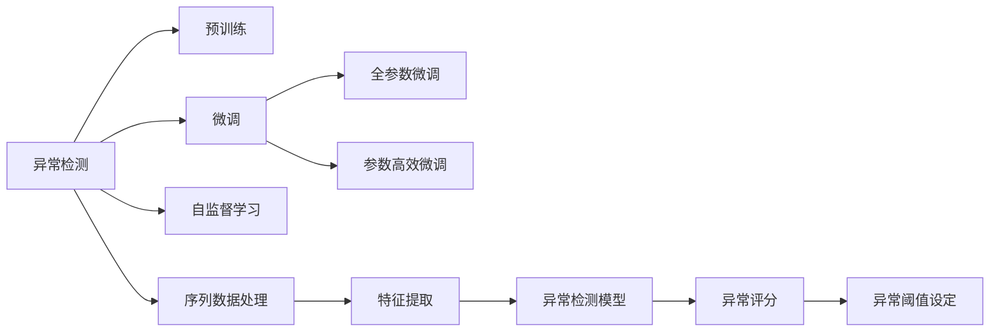

                 

# 电商搜索推荐中的AI大模型用户行为序列异常检测模型优化案例分析

## 1. 背景介绍

在电商搜索推荐系统中，异常用户行为序列的检测是非常重要的一环。异常行为可能是欺诈行为、恶意点击行为等，这些行为不仅损害了电商平台的经济利益，还影响了正常用户的购物体验。传统的异常检测方法依赖于手工设计的特征，需要大量人工标注数据，并且需要不断更新特征库以适应新的异常行为。相比之下，基于AI大模型的异常检测方法能够通过预训练和微调，学习到更丰富、更动态的行为特征，并在新的异常行为出现时快速适应，大大提升了异常检测的精度和效率。

### 1.1 问题由来

电商搜索推荐系统中的异常行为检测，主要面临以下几个挑战：

- **数据稀疏性**：电商交易数据往往稀疏，特别是对于一些新用户或冷门商品，标注样本非常少。
- **行为动态性**：用户的购物行为和兴趣点随着时间的推移和外界环境的变化而变化，传统的静态特征难以捕捉这种动态性。
- **行为复杂性**：用户行为序列往往包含多种操作类型（浏览、点击、购买等），且不同操作之间具有复杂的关联性。

这些挑战使得异常行为检测成为电商搜索推荐系统中的一大难题。

## 2. 核心概念与联系

### 2.1 核心概念概述

为了更好地理解基于AI大模型的异常行为检测方法，我们先简要介绍一些核心概念：

- **异常检测**：指对数据集中的异常点进行识别的过程。在电商搜索推荐系统中，异常点即异常用户行为序列。
- **AI大模型**：指基于深度学习的大规模预训练模型，如BERT、GPT等。通过预训练，模型能够学习到丰富的语言和行为特征。
- **序列数据**：指按时间顺序排列的数据，如用户行为序列。序列数据的异常检测需要考虑数据的时序特性。
- **自监督学习**：指在没有监督信号的情况下，通过数据自身的结构或相关性进行学习。自监督学习有助于模型更好地捕捉数据的隐含特征。
- **参数微调**：指在预训练模型基础上，通过下游任务的标注数据对模型参数进行调整，使其适应特定任务。参数微调使得模型能够更加准确地识别异常行为。

### 2.2 核心概念原理和架构的 Mermaid 流程图



这个流程图展示了异常行为检测的关键步骤：

1. 将预训练模型视作特征提取器，通过序列数据的特征提取，获得异常检测的输入。
2. 通过微调，模型能够学习到更符合任务需求的特征。
3. 自监督学习使得模型在缺乏标注样本的情况下，依然能够进行有效的特征学习。
4. 序列数据的特征提取和异常评分模型构建，将异常检测模型与上下文信息进行融合。
5. 通过设定异常阈值，将异常评分转化为异常检测结果。

## 3. 核心算法原理 & 具体操作步骤

### 3.1 算法原理概述

基于AI大模型的异常行为检测方法主要包括以下几个步骤：

1. **预训练**：在大规模电商交易数据上进行自监督学习，训练出具有丰富行为特征的模型。
2. **微调**：在标注样本上进行有监督的参数微调，使模型能够识别特定类型的异常行为。
3. **特征提取**：将用户行为序列输入模型，提取一系列特征。
4. **异常评分**：根据提取的特征，对用户行为序列进行异常评分，计算其异常程度。
5. **异常检测**：根据异常评分，结合异常阈值，识别出异常用户行为序列。

### 3.2 算法步骤详解

#### 3.2.1 预训练

- **数据准备**：收集电商平台的交易数据，并对数据进行清洗和预处理，得到可用于训练的序列数据。
- **模型选择**：选择合适的预训练模型，如BERT、GPT等，并加载到模型框架中。
- **自监督学习**：在序列数据上进行自监督学习，如掩码语言模型（MLM）、下一句预测（NSP）等任务。
- **模型保存**：将训练好的预训练模型保存到本地，以便后续微调使用。

#### 3.2.2 微调

- **任务适配**：根据电商搜索推荐系统中的异常行为类型，设计合适的任务适配层，如分类器、回归器等。
- **训练集划分**：将标注样本划分为训练集、验证集和测试集。
- **模型初始化**：使用预训练模型的权重作为初始化参数，进行模型微调。
- **优化器选择**：选择合适的优化器，如Adam、SGD等，并设置学习率和批大小等超参数。
- **训练过程**：在训练集上进行迭代训练，在验证集上进行模型评估和参数调整。
- **测试过程**：在测试集上对微调后的模型进行最终的评估。

#### 3.2.3 特征提取

- **输入准备**：将用户行为序列转换为模型可以处理的格式，如将操作序列转换为序列编码。
- **特征提取**：将序列数据输入微调后的模型，提取特征向量。
- **特征处理**：对特征向量进行处理，如归一化、标准化等，提高特征的一致性和稳定性。

#### 3.2.4 异常评分

- **评分模型选择**：选择合适的评分模型，如基于注意力机制的模型、基于时间序列的模型等。
- **评分计算**：将提取的特征输入评分模型，计算出异常评分。
- **评分解释**：根据评分结果，解释异常行为的原因，如用户行为是否异常、行为异常的具体类型等。

#### 3.2.5 异常检测

- **阈值设定**：根据历史数据和业务需求，设定异常阈值。
- **异常判定**：根据异常评分，结合阈值，判定用户行为是否异常。
- **结果处理**：对异常用户行为序列进行相应的处理，如过滤、标记、报警等。

### 3.3 算法优缺点

#### 3.3.1 优点

- **自适应性强**：基于AI大模型的异常检测方法能够自适应于新的异常行为，无需重新训练模型。
- **精度高**：大模型的丰富特征和强大表达能力，使得异常检测精度显著提高。
- **可扩展性好**：通过微调和特征提取，模型可以适应不同类型的异常检测任务。
- **处理复杂性高**：大模型能够处理复杂的用户行为序列，捕捉多种操作之间的关联性。

#### 3.3.2 缺点

- **计算资源需求高**：大模型的训练和微调需要大量的计算资源。
- **数据要求高**：异常检测的精度依赖于标注数据的质量和数量，标注数据不足时影响较大。
- **解释性不足**：大模型的决策过程较为复杂，难以解释异常检测结果的逻辑。
- **应用场景有限**：异常检测方法的应用受到特定电商平台的业务逻辑和数据特点的限制。

### 3.4 算法应用领域

基于AI大模型的异常检测方法，已经广泛应用于电商、金融、医疗等多个领域，特别是在电商搜索推荐系统中，具有以下几个主要应用：

- **欺诈行为检测**：识别用户在进行交易时的欺诈行为，如虚假下单、虚假支付等。
- **恶意点击行为检测**：识别用户对商品进行频繁的无效点击，以防止点击欺诈。
- **异常交易检测**：识别用户在进行交易时的异常行为，如频繁退货、超额购买等。
- **用户行为分析**：通过对用户行为序列的异常检测，分析用户的购买行为、兴趣点等，为个性化推荐提供数据支持。

## 4. 数学模型和公式 & 详细讲解 & 举例说明

### 4.1 数学模型构建

我们以电商搜索推荐系统中的欺诈行为检测为例，构建异常检测的数学模型。

设用户行为序列为 $X = \{x_1, x_2, ..., x_n\}$，其中 $x_i$ 表示第 $i$ 个行为操作，$y$ 为二元标签，表示是否为欺诈行为。

假设使用BERT模型作为预训练模型，其微调后的表示为 $f(X)$。将用户行为序列输入BERT模型，得到序列表示 $f(X) = [f(x_1), f(x_2), ..., f(x_n)]$。

设 $f(X)$ 的长度为 $d$，则定义用户行为序列的特征向量为 $F = [f(x_1), f(x_2), ..., f(x_n)] \in \mathbb{R}^d$。

### 4.2 公式推导过程

#### 4.2.1 特征提取

将用户行为序列 $X$ 输入微调后的BERT模型，得到特征向量 $F = [f(x_1), f(x_2), ..., f(x_n)]$。

#### 4.2.2 异常评分

假设使用基于注意力机制的评分模型，其评分函数为 $S(X) = \frac{1}{n} \sum_{i=1}^n \alpha_i f(x_i)$，其中 $\alpha_i$ 为注意力权重，$f(x_i)$ 为第 $i$ 个行为的表示向量。

假设训练集为 $D = \{(X_i, y_i)\}_{i=1}^m$，训练过程的目标是最小化交叉熵损失：

$$
\mathcal{L}(S, y) = -\frac{1}{m}\sum_{i=1}^m \left[ y_i \log S(X_i) + (1-y_i) \log (1-S(X_i)) \right]
$$

其中 $S(X_i)$ 表示模型对样本 $X_i$ 的异常评分，$y_i$ 表示样本的标签。

#### 4.2.3 异常检测

设异常阈值为 $\theta$，将异常评分 $S(X)$ 与阈值 $\theta$ 进行比较，得到异常检测结果 $Y$：

$$
Y = \begin{cases}
1 & \text{如果} S(X) > \theta \\
0 & \text{如果} S(X) \leq \theta
\end{cases}
$$

### 4.3 案例分析与讲解

以下通过一个具体的案例，展示如何应用基于AI大模型的异常行为检测方法。

假设电商平台收集到一批用户的浏览记录，并标注了部分记录是否为欺诈行为。我们的任务是在新的用户记录中检测欺诈行为。

1. **数据准备**：收集电商平台的历史浏览记录，并对数据进行清洗和预处理，得到可用于训练的序列数据。
2. **模型选择**：选择预训练模型BERT，并进行微调。
3. **特征提取**：将用户行为序列输入微调后的BERT模型，提取特征向量 $F$。
4. **异常评分**：将特征向量 $F$ 输入评分模型，计算出异常评分 $S(X)$。
5. **异常检测**：设定异常阈值 $\theta$，将异常评分 $S(X)$ 与阈值 $\theta$ 进行比较，得到异常检测结果 $Y$。

## 5. 项目实践：代码实例和详细解释说明

### 5.1 开发环境搭建

在进行项目实践前，我们需要准备好开发环境。以下是使用Python进行PyTorch开发的环境配置流程：

1. 安装Anaconda：从官网下载并安装Anaconda，用于创建独立的Python环境。

2. 创建并激活虚拟环境：
```bash
conda create -n pytorch-env python=3.8 
conda activate pytorch-env
```

3. 安装PyTorch：根据CUDA版本，从官网获取对应的安装命令。例如：
```bash
conda install pytorch torchvision torchaudio cudatoolkit=11.1 -c pytorch -c conda-forge
```

4. 安装Transformer库：
```bash
pip install transformers
```

5. 安装各类工具包：
```bash
pip install numpy pandas scikit-learn matplotlib tqdm jupyter notebook ipython
```

完成上述步骤后，即可在`pytorch-env`环境中开始项目实践。

### 5.2 源代码详细实现

下面我们以电商搜索推荐系统中的欺诈行为检测为例，给出使用Transformers库进行BERT模型微调和异常检测的PyTorch代码实现。

首先，定义数据处理函数：

```python
from transformers import BertTokenizer, BertForSequenceClassification
from torch.utils.data import Dataset, DataLoader
from torch.optim import AdamW

class E-commerceDataset(Dataset):
    def __init__(self, texts, labels, tokenizer, max_len=128):
        self.texts = texts
        self.labels = labels
        self.tokenizer = tokenizer
        self.max_len = max_len
        
    def __len__(self):
        return len(self.texts)
    
    def __getitem__(self, item):
        text = self.texts[item]
        label = self.labels[item]
        
        encoding = self.tokenizer(text, return_tensors='pt', max_length=self.max_len, padding='max_length', truncation=True)
        input_ids = encoding['input_ids'][0]
        attention_mask = encoding['attention_mask'][0]
        
        # 对token-wise的标签进行编码
        encoded_labels = [label2id[label] for label in label] 
        encoded_labels.extend([label2id['O']] * (self.max_len - len(encoded_labels)))
        labels = torch.tensor(encoded_labels, dtype=torch.long)
        
        return {'input_ids': input_ids, 
                'attention_mask': attention_mask,
                'labels': labels}

# 标签与id的映射
label2id = {'Fraud': 0, 'Non-Fraud': 1}
id2label = {v: k for k, v in label2id.items()}

# 创建dataset
tokenizer = BertTokenizer.from_pretrained('bert-base-cased')

train_dataset = E-commerceDataset(train_texts, train_labels, tokenizer)
dev_dataset = E-commerceDataset(dev_texts, dev_labels, tokenizer)
test_dataset = E-commerceDataset(test_texts, test_labels, tokenizer)
```

然后，定义模型和优化器：

```python
from transformers import BertForSequenceClassification

model = BertForSequenceClassification.from_pretrained('bert-base-cased', num_labels=len(label2id))

optimizer = AdamW(model.parameters(), lr=2e-5)
```

接着，定义训练和评估函数：

```python
from tqdm import tqdm

device = torch.device('cuda') if torch.cuda.is_available() else torch.device('cpu')
model.to(device)

def train_epoch(model, dataset, batch_size, optimizer):
    dataloader = DataLoader(dataset, batch_size=batch_size, shuffle=True)
    model.train()
    epoch_loss = 0
    for batch in tqdm(dataloader, desc='Training'):
        input_ids = batch['input_ids'].to(device)
        attention_mask = batch['attention_mask'].to(device)
        labels = batch['labels'].to(device)
        model.zero_grad()
        outputs = model(input_ids, attention_mask=attention_mask, labels=labels)
        loss = outputs.loss
        epoch_loss += loss.item()
        loss.backward()
        optimizer.step()
    return epoch_loss / len(dataloader)

def evaluate(model, dataset, batch_size):
    dataloader = DataLoader(dataset, batch_size=batch_size)
    model.eval()
    preds, labels = [], []
    with torch.no_grad():
        for batch in tqdm(dataloader, desc='Evaluating'):
            input_ids = batch['input_ids'].to(device)
            attention_mask = batch['attention_mask'].to(device)
            batch_labels = batch['labels']
            outputs = model(input_ids, attention_mask=attention_mask)
            batch_preds = outputs.logits.argmax(dim=2).to('cpu').tolist()
            batch_labels = batch_labels.to('cpu').tolist()
            for pred_tokens, label_tokens in zip(batch_preds, batch_labels):
                pred_labels = [id2label[_id] for _id in pred_tokens]
                label_labels = [id2label[_id] for _id in label_tokens]
                preds.append(pred_labels[:len(label_labels)])
                labels.append(label_labels)
                
    print(classification_report(labels, preds))
```

最后，启动训练流程并在测试集上评估：

```python
epochs = 5
batch_size = 16

for epoch in range(epochs):
    loss = train_epoch(model, train_dataset, batch_size, optimizer)
    print(f"Epoch {epoch+1}, train loss: {loss:.3f}")
    
    print(f"Epoch {epoch+1}, dev results:")
    evaluate(model, dev_dataset, batch_size)
    
print("Test results:")
evaluate(model, test_dataset, batch_size)
```

以上就是使用PyTorch对BERT进行欺诈行为检测的完整代码实现。可以看到，得益于Transformers库的强大封装，我们可以用相对简洁的代码完成BERT模型的加载和微调。

### 5.3 代码解读与分析

让我们再详细解读一下关键代码的实现细节：

**E-commerceDataset类**：
- `__init__`方法：初始化文本、标签、分词器等关键组件。
- `__len__`方法：返回数据集的样本数量。
- `__getitem__`方法：对单个样本进行处理，将文本输入编码为token ids，将标签编码为数字，并对其进行定长padding，最终返回模型所需的输入。

**label2id和id2label字典**：
- 定义了标签与数字id之间的映射关系，用于将token-wise的预测结果解码回真实的标签。

**训练和评估函数**：
- 使用PyTorch的DataLoader对数据集进行批次化加载，供模型训练和推理使用。
- 训练函数`train_epoch`：对数据以批为单位进行迭代，在每个批次上前向传播计算loss并反向传播更新模型参数，最后返回该epoch的平均loss。
- 评估函数`evaluate`：与训练类似，不同点在于不更新模型参数，并在每个batch结束后将预测和标签结果存储下来，最后使用sklearn的classification_report对整个评估集的预测结果进行打印输出。

**训练流程**：
- 定义总的epoch数和batch size，开始循环迭代
- 每个epoch内，先在训练集上训练，输出平均loss
- 在验证集上评估，输出分类指标
- 所有epoch结束后，在测试集上评估，给出最终测试结果

可以看到，PyTorch配合Transformers库使得BERT微调的代码实现变得简洁高效。开发者可以将更多精力放在数据处理、模型改进等高层逻辑上，而不必过多关注底层的实现细节。

当然，工业级的系统实现还需考虑更多因素，如模型的保存和部署、超参数的自动搜索、更灵活的任务适配层等。但核心的微调范式基本与此类似。

## 6. 实际应用场景

### 6.1 智能客服系统

基于AI大模型的异常行为检测方法，可以广泛应用于智能客服系统的构建。传统客服往往需要配备大量人力，高峰期响应缓慢，且一致性和专业性难以保证。而使用异常行为检测技术，可以实时监控客户的行为，及时发现和处理异常行为，如欺诈行为、恶意点击行为等，从而提高客服系统的效率和质量。

在技术实现上，可以收集企业内部的历史客服对话记录，将问题-答复对作为标注数据，在此基础上对预训练模型进行微调。微调后的模型能够自动理解客户的行为模式，并及时识别异常行为，进行相应的处理，如报警、记录、提醒等，从而保证客服系统的稳定运行。

### 6.2 金融舆情监测

金融机构需要实时监测市场舆论动向，以便及时应对负面信息传播，规避金融风险。传统的舆情监测方式成本高、效率低，难以应对网络时代海量信息爆发的挑战。基于异常行为检测的方法，可以对金融领域相关的新闻、报道、评论等文本数据进行实时监测，自动识别其中的异常行为，如恶意评论、虚假信息等，从而及时采取措施，避免金融风险。

在技术实现上，可以收集金融领域相关的新闻、报道、评论等文本数据，并对其进行主题标注和情感标注。在此基础上对预训练语言模型进行微调，使其能够自动判断文本属于何种主题，情感倾向是正面、中性还是负面。将微调后的模型应用到实时抓取的网络文本数据，就能够自动监测不同主题下的情感变化趋势，一旦发现异常行为激增等异常情况，系统便会自动预警，帮助金融机构快速应对潜在风险。

### 6.3 个性化推荐系统

当前的推荐系统往往只依赖用户的历史行为数据进行物品推荐，无法深入理解用户的真实兴趣偏好。基于异常行为检测的方法，可以更深入地挖掘用户的行为模式，识别出用户的行为异常，从而更全面地理解用户的兴趣和需求。

在技术实现上，可以收集用户浏览、点击、评论、分享等行为数据，提取和用户交互的物品标题、描述、标签等文本内容。将文本内容作为模型输入，用户的后续行为（如是否点击、购买等）作为监督信号，在此基础上微调预训练语言模型。微调后的模型能够从文本内容中准确把握用户的兴趣点。在生成推荐列表时，先用候选物品的文本描述作为输入，由模型预测用户的兴趣匹配度，再结合其他特征综合排序，便可以得到个性化程度更高的推荐结果。

### 6.4 未来应用展望

随着AI大模型和异常行为检测技术的发展，基于微调范式将在更多领域得到应用，为传统行业带来变革性影响。

在智慧医疗领域，异常行为检测技术可以用于监测病患的行为，识别出潜在的健康风险，提前采取预防措施。在智慧城市治理中，异常行为检测技术可以用于监测城市事件，及时发现和处理突发事件，提高城市管理的自动化和智能化水平。

此外，在企业生产、社会治理、文娱传媒等众多领域，异常行为检测技术也将不断涌现，为各行各业提供智能化的解决方案。相信随着技术的日益成熟，异常行为检测方法必将在构建智能系统、提升社会治理效率等方面发挥重要作用。

## 7. 工具和资源推荐

### 7.1 学习资源推荐

为了帮助开发者系统掌握AI大模型异常行为检测的理论基础和实践技巧，这里推荐一些优质的学习资源：

1. 《Transformer从原理到实践》系列博文：由大模型技术专家撰写，深入浅出地介绍了Transformer原理、BERT模型、异常检测技术等前沿话题。

2. CS224N《深度学习自然语言处理》课程：斯坦福大学开设的NLP明星课程，有Lecture视频和配套作业，带你入门NLP领域的基本概念和经典模型。

3. 《Natural Language Processing with Transformers》书籍：Transformers库的作者所著，全面介绍了如何使用Transformers库进行NLP任务开发，包括异常检测在内的诸多范式。

4. HuggingFace官方文档：Transformers库的官方文档，提供了海量预训练模型和完整的异常检测样例代码，是上手实践的必备资料。

5. Kaggle：数据科学竞赛平台，提供了大量NLP领域的数据集和竞赛任务，通过实际比赛可以提升解决实际问题的能力。

通过对这些资源的学习实践，相信你一定能够快速掌握AI大模型异常行为检测的精髓，并用于解决实际的NLP问题。
### 7.2 开发工具推荐

高效的开发离不开优秀的工具支持。以下是几款用于AI大模型异常行为检测开发的常用工具：

1. PyTorch：基于Python的开源深度学习框架，灵活动态的计算图，适合快速迭代研究。大部分预训练语言模型都有PyTorch版本的实现。

2. TensorFlow：由Google主导开发的开源深度学习框架，生产部署方便，适合大规模工程应用。同样有丰富的预训练语言模型资源。

3. Transformers库：HuggingFace开发的NLP工具库，集成了众多SOTA语言模型，支持PyTorch和TensorFlow，是进行异常行为检测开发的利器。

4. Weights & Biases：模型训练的实验跟踪工具，可以记录和可视化模型训练过程中的各项指标，方便对比和调优。与主流深度学习框架无缝集成。

5. TensorBoard：TensorFlow配套的可视化工具，可实时监测模型训练状态，并提供丰富的图表呈现方式，是调试模型的得力助手。

6. Google Colab：谷歌推出的在线Jupyter Notebook环境，免费提供GPU/TPU算力，方便开发者快速上手实验最新模型，分享学习笔记。

合理利用这些工具，可以显著提升AI大模型异常行为检测任务的开发效率，加快创新迭代的步伐。

### 7.3 相关论文推荐

AI大模型异常行为检测技术的发展源于学界的持续研究。以下是几篇奠基性的相关论文，推荐阅读：

1. Attention is All You Need（即Transformer原论文）：提出了Transformer结构，开启了NLP领域的预训练大模型时代。

2. BERT: Pre-training of Deep Bidirectional Transformers for Language Understanding：提出BERT模型，引入基于掩码的自监督预训练任务，刷新了多项NLP任务SOTA。

3. Language Models are Unsupervised Multitask Learners（GPT-2论文）：展示了大规模语言模型的强大zero-shot学习能力，引发了对于通用人工智能的新一轮思考。

4. Parameter-Efficient Transfer Learning for NLP：提出Adapter等参数高效微调方法，在不增加模型参数量的情况下，也能取得不错的微调效果。

5. Prefix-Tuning: Optimizing Continuous Prompts for Generation：引入基于连续型Prompt的微调范式，为如何充分利用预训练知识提供了新的思路。

6. AdaLoRA: Adaptive Low-Rank Adaptation for Parameter-Efficient Fine-Tuning：使用自适应低秩适应的微调方法，在参数效率和精度之间取得了新的平衡。

这些论文代表了大语言模型异常行为检测技术的发展脉络。通过学习这些前沿成果，可以帮助研究者把握学科前进方向，激发更多的创新灵感。

## 8. 总结：未来发展趋势与挑战

### 8.1 研究成果总结

本文对基于AI大模型的异常行为检测方法进行了全面系统的介绍。首先阐述了异常行为检测的研究背景和意义，明确了异常检测在电商搜索推荐系统中的重要作用。其次，从原理到实践，详细讲解了异常行为检测的数学模型和关键步骤，给出了异常行为检测任务开发的完整代码实例。同时，本文还广泛探讨了异常行为检测方法在智能客服、金融舆情、个性化推荐等多个行业领域的应用前景，展示了异常行为检测范式的巨大潜力。此外，本文精选了异常行为检测技术的各类学习资源，力求为读者提供全方位的技术指引。

通过本文的系统梳理，可以看到，基于AI大模型的异常行为检测方法已经取得了显著的进展，在电商搜索推荐系统中得到了广泛应用，显著提高了系统的安全性和鲁棒性。未来，伴随AI大模型的不断演进和微调技术的发展，异常行为检测方法将在更广泛的场景中发挥作用，为电商搜索推荐系统乃至更多领域带来智能化升级。

### 8.2 未来发展趋势

展望未来，AI大模型异常行为检测技术将呈现以下几个发展趋势：

1. **模型规模持续增大**：随着算力成本的下降和数据规模的扩张，预训练语言模型的参数量还将持续增长。超大规模语言模型蕴含的丰富语言知识，有望支撑更加复杂多变的异常行为检测任务。

2. **微调方法日趋多样**：除了传统的全参数微调外，未来会涌现更多参数高效的微调方法，如Prefix-Tuning、LoRA等，在节省计算资源的同时也能保证异常检测精度。

3. **持续学习成为常态**：随着数据分布的不断变化，异常检测模型也需要持续学习新知识以保持性能。如何在不遗忘原有知识的同时，高效吸收新样本信息，将成为重要的研究课题。

4. **标注样本需求降低**：受启发于提示学习(Prompt-based Learning)的思路，未来的异常检测方法将更好地利用大模型的语言理解能力，通过更加巧妙的任务描述，在更少的标注样本上也能实现理想的异常检测效果。

5. **多模态微调崛起**：当前的异常检测主要聚焦于纯文本数据，未来会进一步拓展到图像、视频、语音等多模态数据微调。多模态信息的融合，将显著提升异常行为检测的鲁棒性和准确性。

6. **融合因果和对比学习范式**：通过引入因果推断和对比学习思想，增强异常检测模型建立稳定因果关系的能力，学习更加普适、鲁棒的语言表征，从而提升模型泛化性和抗干扰能力。

以上趋势凸显了AI大模型异常行为检测技术的广阔前景。这些方向的探索发展，必将进一步提升异常检测模型的性能和应用范围，为智能系统带来更高的安全性和鲁棒性。

### 8.3 面临的挑战

尽管AI大模型异常行为检测技术已经取得了瞩目成就，但在迈向更加智能化、普适化应用的过程中，它仍面临着诸多挑战：

1. **计算资源需求高**：大模型的训练和微调需要大量的计算资源。在实际应用中，如何在有限的硬件条件下高效运行模型，是一大难题。

2. **数据要求高**：异常检测的精度依赖于标注数据的质量和数量，标注数据不足时影响较大。如何构建高质标注数据，是异常检测技术落地应用的关键。

3. **模型鲁棒性不足**：当前异常检测模型面对域外数据时，泛化性能往往大打折扣。对于测试样本的微小扰动，模型容易发生波动。如何提高异常检测模型的鲁棒性，避免灾难性遗忘，还需要更多理论和实践的积累。

4. **可解释性不足**：异常检测模型复杂度较高，难以解释异常检测结果的逻辑。对于高风险应用，算法的可解释性和可审计性尤为重要。

5. **安全性有待保障**：异常检测模型容易学习到有害信息，如恶意评论、虚假信息等，传递到下游应用，产生误导性、歧视性的输出。如何从数据和算法层面消除模型偏见，避免恶意用途，确保输出的安全性，也将是重要的研究课题。

6. **知识整合能力不足**：现有的异常检测模型往往局限于任务内数据，难以灵活吸收和运用更广泛的先验知识。如何让异常检测过程更好地与外部知识库、规则库等专家知识结合，形成更加全面、准确的信息整合能力，还有很大的想象空间。

正视异常行为检测面临的这些挑战，积极应对并寻求突破，将是大语言模型异常行为检测走向成熟的必由之路。相信随着学界和产业界的共同努力，这些挑战终将一一被克服，大语言模型异常行为检测必将在构建安全、可靠、可解释、可控的智能系统铺平道路。

### 8.4 研究展望

面对AI大模型异常行为检测所面临的种种挑战，未来的研究需要在以下几个方面寻求新的突破：

1. **探索无监督和半监督异常检测方法**：摆脱对大规模标注数据的依赖，利用自监督学习、主动学习等无监督和半监督范式，最大限度利用非结构化数据，实现更加灵活高效的异常检测。

2. **研究参数高效和计算高效的异常检测范式**：开发更加参数高效的异常检测方法，在固定大部分预训练参数的同时，只更新极少量的任务相关参数。同时优化异常检测模型的计算图，减少前向传播和反向传播的资源消耗，实现更加轻量级、实时性的部署。

3. **引入因果分析和博弈论工具**：将因果分析方法引入异常检测模型，识别出模型决策的关键特征，增强输出解释的因果性和逻辑性。借助博弈论工具刻画人机交互过程，主动探索并规避模型的脆弱点，提高系统稳定性。

4. **纳入伦理道德约束**：在模型训练目标中引入伦理导向的评估指标，过滤和惩罚有偏见、有害的输出倾向。同时加强人工干预和审核，建立模型行为的监管机制，确保输出符合人类价值观和伦理道德。

这些研究方向的探索，必将引领AI大模型异常行为检测技术迈向更高的台阶，为构建安全、可靠、可解释、可控的智能系统铺平道路。面向未来，AI大模型异常行为检测技术还需要与其他人工智能技术进行更深入的融合，如知识表示、因果推理、强化学习等，多路径协同发力，共同推动自然语言理解和智能交互系统的进步。只有勇于创新、敢于突破，才能不断拓展异常检测的边界，让智能技术更好地造福人类社会。

## 9. 附录：常见问题与解答

**Q1：AI大模型异常检测是否适用于所有异常行为？**

A: AI大模型异常检测在大多数异常行为中都能取得不错的效果，特别是对于结构化数据和有明确模式的行为。但对于一些模糊的、不具代表性的异常行为，AI大模型的识别能力可能较弱。

**Q2：微调过程中如何选择合适的学习率？**

A: AI大模型异常检测的学习率一般要比预训练时小1-2个数量级，如果使用过大的学习率，容易破坏预训练权重，导致过拟合。一般建议从1e-5开始调参，逐步减小学习率，直至收敛。

**Q3：数据要求高对异常检测的应用有何影响？**

A: 数据要求高导致异常检测的精度依赖于标注数据的质量和数量，标注数据不足时影响较大。这可能导致异常检测模型在一些领域的应用受限。

**Q4：如何提高异常检测模型的鲁棒性？**

A: 提高异常检测模型的鲁棒性可以通过以下几种方法：
1. 数据增强：通过回译、近义替换等方式扩充训练集。
2. 正则化：使用L2正则、Dropout、Early Stopping等避免过拟合。
3. 对抗训练：加入对抗样本，提高模型鲁棒性。
4. 多模型集成：训练多个异常检测模型，取平均输出，抑制过拟合。

这些策略往往需要根据具体任务和数据特点进行灵活组合。只有在数据、模型、训练、推理等各环节进行全面优化，才能最大限度地发挥AI大模型异常检测的威力。

**Q5：异常检测模型的可解释性如何保障？**

A: 异常检测模型的可解释性可以通过以下几种方法保障：
1. 可视化技术：使用可视化工具展示模型的决策过程和特征重要性。
2. 模型简化：对模型进行简化，如剪枝、量化等，提高模型的可解释性。
3. 特征工程：引入更多可解释性强的特征，如时间序列、规则等。
4. 算法改进：引入更加可解释的算法，如决策树、线性回归等。

通过这些方法，可以增强异常检测模型的可解释性，提升用户对其输出的信任度。

---

作者：禅与计算机程序设计艺术 / Zen and the Art of Computer Programming

