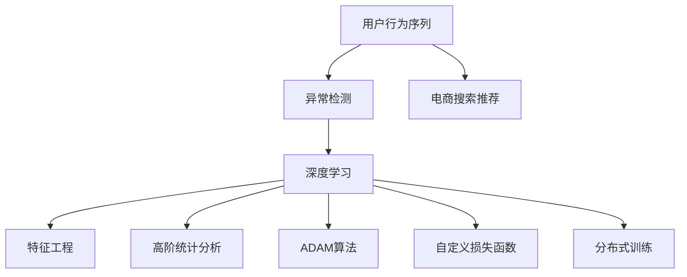

                 

# 电商搜索推荐中的AI大模型用户行为序列异常检测评估体系

> 关键词：大模型,用户行为序列,异常检测,电商搜索推荐,深度学习,特征工程,评估体系,高阶统计分析,ADAM算法,自定义损失函数,分布式训练

## 1. 背景介绍

### 1.1 问题由来
在电商搜索推荐系统中，用户行为序列数据的异常检测是一个至关重要的问题。用户行为序列，包括浏览、点击、购买等行为，能够反映出用户的真实兴趣和需求，是推荐算法的重要依据。但这些数据通常包含大量的噪声和异常值，直接影响推荐模型的准确性和用户满意度。因此，如何准确识别用户行为序列中的异常行为，对于提升推荐系统的精度和用户体验至关重要。

### 1.2 问题核心关键点
异常检测在电商搜索推荐中的核心关键点包括：
1. **数据获取与预处理**：从电商平台收集用户行为序列数据，并对其进行清洗和预处理，去除噪声和异常值。
2. **异常定义与识别**：明确异常的定义，如异常浏览时间、异常购买次数等，通过模型识别出这些异常行为。
3. **模型选择与设计**：选择合适的异常检测模型，如基于深度学习的大模型、基于统计分析的高阶统计模型等，并设计合适的训练和评估流程。
4. **模型优化与部署**：通过调参和优化，提升模型的性能，并将其部署到电商推荐系统中。
5. **效果评估与反馈**：建立评估指标，评估模型效果，并根据用户反馈进行模型迭代和优化。

## 2. 核心概念与联系

### 2.1 核心概念概述

为更好地理解异常检测模型，本节将介绍几个密切相关的核心概念：

- **用户行为序列**：指用户在电商平台上的浏览、点击、购买等行为时间戳序列，可以用于分析用户的兴趣偏好和行为模式。
- **异常检测**：指识别出数据中的异常值，这些异常值通常是不符合数据分布的极端值，可能由于数据采集错误、用户操作失误等原因产生。
- **电商搜索推荐**：指利用用户行为序列等数据，推荐出符合用户兴趣的商品，提升用户的购物体验。
- **深度学习**：指使用深度神经网络对数据进行建模和分析，可以处理复杂的多层次特征。
- **特征工程**：指对原始数据进行特征提取和处理，提高数据质量和模型性能。
- **高阶统计分析**：指使用高阶矩、方差分析等方法，挖掘数据中更深层次的信息。
- **ADAM算法**：一种常用的优化算法，用于训练深度神经网络，具有收敛速度快、稳定性好等特点。
- **自定义损失函数**：在深度学习中，根据特定任务设计合适的损失函数，指导模型训练。
- **分布式训练**：指在多台计算机上并行训练深度神经网络，加快训练速度和提升模型性能。

这些核心概念之间的逻辑关系可以通过以下Mermaid流程图来展示：



这个流程图展示了大模型在电商搜索推荐中的异常检测过程的核心概念及其之间的关系：

1. 用户行为序列通过异常检测模型被识别为异常或正常。
2. 异常检测模型基于深度学习、特征工程、高阶统计分析等技术实现。
3. 异常检测结果用于电商搜索推荐系统，提高推荐精度。
4. 深度学习模型训练中使用ADAM算法优化，自定义损失函数指导训练。
5. 深度学习模型训练采用分布式训练技术，提升训练效率和模型性能。

## 3. 核心算法原理 & 具体操作步骤

### 3.1 算法原理概述

电商搜索推荐中的异常检测，通常使用基于深度学习的大模型进行实现。大模型通过学习用户行为序列的复杂特征，能够准确识别出异常行为。其核心原理如下：

1. **输入层**：接收用户行为序列，将时间戳序列转换为数字形式，供模型处理。
2. **隐藏层**：通过多层神经网络对输入序列进行特征提取和处理，构建用户行为序列的复杂表示。
3. **输出层**：输出异常检测结果，通常为二分类问题，标识每个行为是否异常。
4. **损失函数**：定义合适的损失函数，指导模型训练，如交叉熵损失、均方误差损失等。
5. **优化器**：使用ADAM等优化算法，更新模型参数，最小化损失函数。

### 3.2 算法步骤详解

大模型在电商搜索推荐中的异常检测步骤如下：

**Step 1: 数据获取与预处理**

1. **数据收集**：从电商平台的日志系统中收集用户行为序列数据，通常包括浏览时间、点击次数、购买行为等。
2. **数据清洗**：去除数据中的噪声和异常值，如空值、重复记录等。
3. **数据划分**：将数据划分为训练集、验证集和测试集，通常比例为7:1.5:1.5。

**Step 2: 模型选择与设计**

1. **模型选择**：选择合适的大模型，如BERT、GPT等，作为异常检测的基础。
2. **模型设计**：设计模型的输入、隐藏和输出层结构，并确定损失函数和优化器。
3. **特征提取**：设计特征工程流程，提取有用的特征，如用户行为序列的时间间隔、行为次数等。

**Step 3: 模型训练与评估**

1. **模型训练**：使用训练集数据，通过反向传播算法和优化器，训练模型参数。
2. **模型评估**：使用验证集数据，评估模型性能，调整超参数，如学习率、批大小等。
3. **模型测试**：使用测试集数据，最终评估模型的准确率和召回率等指标。

**Step 4: 模型优化与部署**

1. **模型优化**：通过调整模型结构和超参数，优化模型性能。
2. **模型部署**：将模型部署到电商推荐系统中，集成到实际的应用场景中。
3. **模型更新**：根据用户反馈和新数据，定期更新模型，保持模型性能。

### 3.3 算法优缺点

电商搜索推荐中的异常检测模型具有以下优点：

1. **高准确率**：深度学习模型能够学习复杂特征，准确识别出异常行为。
2. **自适应性**：大模型能够自适应用户行为模式的变化，适应性强。
3. **处理复杂数据**：能够处理多维度、高维度的用户行为序列数据。
4. **可解释性**：通过特征工程和可视化工具，可以解释模型行为。

同时，该模型也存在一些局限性：

1. **高计算成本**：深度学习模型训练和推理计算量大，需要高性能计算资源。
2. **数据依赖性强**：模型性能高度依赖于数据质量和量级。
3. **模型复杂度高**：模型结构和参数较多，调试和维护难度大。
4. **过度拟合风险**：在数据量较少的情况下，模型容易发生过拟合。

### 3.4 算法应用领域

电商搜索推荐中的异常检测模型，已在多个领域得到了广泛应用，例如：

- **商品推荐系统**：用于识别用户行为序列中的异常行为，如异常浏览时间、异常购买次数等，优化推荐算法。
- **库存管理系统**：用于检测异常库存变化，如缺货、多货等，提高库存管理效率。
- **反欺诈系统**：用于识别用户交易行为中的异常行为，如异常交易金额、异常交易地点等，降低欺诈风险。
- **客户服务系统**：用于识别客户行为序列中的异常行为，如频繁投诉、频繁退货等，提高客户服务质量。

除了上述这些领域外，电商搜索推荐中的异常检测模型还可以创新性地应用到更多场景中，如供应链优化、广告投放优化等，为电商平台的业务运营提供新的技术支持。

## 4. 数学模型和公式 & 详细讲解

### 4.1 数学模型构建

电商搜索推荐中的异常检测模型，通常使用大模型，如BERT、GPT等。这些模型在输入层接受用户行为序列，通过隐藏层进行特征提取和处理，最终在输出层输出异常检测结果。

模型的输入层接受用户行为序列 $X=\{x_1, x_2, ..., x_n\}$，其中 $x_i$ 表示第 $i$ 个时间戳。输出层输出异常检测结果 $Y=\{y_1, y_2, ..., y_n\}$，其中 $y_i$ 表示第 $i$ 个行为是否异常。模型的隐藏层由多个神经网络层组成，每层包含多个神经元。

### 4.2 公式推导过程

异常检测模型的训练过程，可以通过反向传播算法实现。假设模型的损失函数为 $\mathcal{L}$，输出层为 $\hat{Y}$，则训练过程如下：

1. **前向传播**：将用户行为序列 $X$ 输入模型，计算模型的输出 $\hat{Y}$。
2. **计算损失**：将 $\hat{Y}$ 与真实标签 $Y$ 进行对比，计算损失 $\mathcal{L}$。
3. **反向传播**：根据损失函数对模型参数进行反向传播，计算梯度。
4. **更新参数**：使用优化器更新模型参数，最小化损失函数。

假设模型的损失函数为交叉熵损失函数，则训练过程的数学公式如下：

$$
\mathcal{L} = -\frac{1}{N} \sum_{i=1}^N [y_i\log \hat{y}_i + (1-y_i)\log(1-\hat{y}_i)]
$$

其中，$N$ 表示样本数量，$y_i$ 表示第 $i$ 个行为的真实标签，$\hat{y}_i$ 表示第 $i$ 个行为的模型预测结果。

### 4.3 案例分析与讲解

以一个简单的异常检测模型为例，说明其训练和推理过程：

假设使用BERT模型进行异常检测，输入层输入用户行为序列 $X=\{x_1, x_2, ..., x_n\}$，输出层输出异常检测结果 $Y=\{y_1, y_2, ..., y_n\}$。模型的隐藏层由多个神经网络层组成，每层包含多个神经元。

1. **训练过程**：假设使用交叉熵损失函数和ADAM优化器进行训练，训练过程如下：
   - 将用户行为序列 $X$ 输入BERT模型，得到隐藏层特征表示 $H$。
   - 通过全连接层将隐藏层特征映射为异常检测结果 $\hat{Y}$。
   - 计算交叉熵损失 $\mathcal{L}$，反向传播计算梯度。
   - 使用ADAM优化器更新BERT模型参数，最小化损失函数。

2. **推理过程**：假设测试集为 $X_t=\{x_1', x_2', ..., x_n'\}$，推理过程如下：
   - 将用户行为序列 $X_t$ 输入BERT模型，得到隐藏层特征表示 $H_t$。
   - 通过全连接层将隐藏层特征映射为异常检测结果 $\hat{Y}_t$。
   - 根据 $\hat{Y}_t$ 判断每个行为是否异常，输出异常检测结果 $Y_t=\{y_1', y_2', ..., y_n'\}$。

## 5. 项目实践：代码实例和详细解释说明

### 5.1 开发环境搭建

在进行异常检测实践前，我们需要准备好开发环境。以下是使用Python进行PyTorch开发的环境配置流程：

1. 安装Anaconda：从官网下载并安装Anaconda，用于创建独立的Python环境。

2. 创建并激活虚拟环境：
```bash
conda create -n pytorch-env python=3.8 
conda activate pytorch-env
```

3. 安装PyTorch：根据CUDA版本，从官网获取对应的安装命令。例如：
```bash
conda install pytorch torchvision torchaudio cudatoolkit=11.1 -c pytorch -c conda-forge
```

4. 安装Transformers库：
```bash
pip install transformers
```

5. 安装各类工具包：
```bash
pip install numpy pandas scikit-learn matplotlib tqdm jupyter notebook ipython
```

完成上述步骤后，即可在`pytorch-env`环境中开始异常检测实践。

### 5.2 源代码详细实现

下面我们以异常检测任务为例，给出使用Transformers库对BERT模型进行异常检测的PyTorch代码实现。

首先，定义异常检测任务的数据处理函数：

```python
from transformers import BertTokenizer
from torch.utils.data import Dataset
import torch

class AnomalyDetectionDataset(Dataset):
    def __init__(self, texts, labels, tokenizer, max_len=128):
        self.texts = texts
        self.labels = labels
        self.tokenizer = tokenizer
        self.max_len = max_len
        
    def __len__(self):
        return len(self.texts)
    
    def __getitem__(self, item):
        text = self.texts[item]
        label = self.labels[item]
        
        encoding = self.tokenizer(text, return_tensors='pt', max_length=self.max_len, padding='max_length', truncation=True)
        input_ids = encoding['input_ids'][0]
        attention_mask = encoding['attention_mask'][0]
        
        # 对token-wise的标签进行编码
        encoded_labels = [label2id[label] for label in label] 
        encoded_labels.extend([label2id['normal']] * (self.max_len - len(encoded_labels)))
        labels = torch.tensor(encoded_labels, dtype=torch.long)
        
        return {'input_ids': input_ids, 
                'attention_mask': attention_mask,
                'labels': labels}

# 标签与id的映射
label2id = {'normal': 0, 'abnormal': 1}
id2label = {v: k for k, v in label2id.items()}

# 创建dataset
tokenizer = BertTokenizer.from_pretrained('bert-base-cased')

train_dataset = AnomalyDetectionDataset(train_texts, train_labels, tokenizer)
dev_dataset = AnomalyDetectionDataset(dev_texts, dev_labels, tokenizer)
test_dataset = AnomalyDetectionDataset(test_texts, test_labels, tokenizer)
```

然后，定义模型和优化器：

```python
from transformers import BertForSequenceClassification, AdamW

model = BertForSequenceClassification.from_pretrained('bert-base-cased', num_labels=len(label2id))

optimizer = AdamW(model.parameters(), lr=2e-5)
```

接着，定义训练和评估函数：

```python
from torch.utils.data import DataLoader
from tqdm import tqdm
from sklearn.metrics import classification_report

device = torch.device('cuda') if torch.cuda.is_available() else torch.device('cpu')
model.to(device)

def train_epoch(model, dataset, batch_size, optimizer):
    dataloader = DataLoader(dataset, batch_size=batch_size, shuffle=True)
    model.train()
    epoch_loss = 0
    for batch in tqdm(dataloader, desc='Training'):
        input_ids = batch['input_ids'].to(device)
        attention_mask = batch['attention_mask'].to(device)
        labels = batch['labels'].to(device)
        model.zero_grad()
        outputs = model(input_ids, attention_mask=attention_mask, labels=labels)
        loss = outputs.loss
        epoch_loss += loss.item()
        loss.backward()
        optimizer.step()
    return epoch_loss / len(dataloader)

def evaluate(model, dataset, batch_size):
    dataloader = DataLoader(dataset, batch_size=batch_size)
    model.eval()
    preds, labels = [], []
    with torch.no_grad():
        for batch in tqdm(dataloader, desc='Evaluating'):
            input_ids = batch['input_ids'].to(device)
            attention_mask = batch['attention_mask'].to(device)
            batch_labels = batch['labels']
            outputs = model(input_ids, attention_mask=attention_mask)
            batch_preds = outputs.logits.argmax(dim=2).to('cpu').tolist()
            batch_labels = batch_labels.to('cpu').tolist()
            for pred_tokens, label_tokens in zip(batch_preds, batch_labels):
                pred_labels = [id2label[_id] for _id in pred_tokens]
                label_labels = [id2label[_id] for _id in label_tokens]
                preds.append(pred_labels[:len(label_labels)])
                labels.append(label_labels)
                
    print(classification_report(labels, preds))
```

最后，启动训练流程并在测试集上评估：

```python
epochs = 5
batch_size = 16

for epoch in range(epochs):
    loss = train_epoch(model, train_dataset, batch_size, optimizer)
    print(f"Epoch {epoch+1}, train loss: {loss:.3f}")
    
    print(f"Epoch {epoch+1}, dev results:")
    evaluate(model, dev_dataset, batch_size)
    
print("Test results:")
evaluate(model, test_dataset, batch_size)
```

以上就是使用PyTorch对BERT进行异常检测任务开发的完整代码实现。可以看到，得益于Transformers库的强大封装，我们可以用相对简洁的代码完成BERT模型的加载和异常检测任务。

### 5.3 代码解读与分析

让我们再详细解读一下关键代码的实现细节：

**AnomalyDetectionDataset类**：
- `__init__`方法：初始化文本、标签、分词器等关键组件。
- `__len__`方法：返回数据集的样本数量。
- `__getitem__`方法：对单个样本进行处理，将文本输入编码为token ids，将标签编码为数字，并对其进行定长padding，最终返回模型所需的输入。

**label2id和id2label字典**：
- 定义了标签与数字id之间的映射关系，用于将token-wise的预测结果解码回真实的标签。

**训练和评估函数**：
- 使用PyTorch的DataLoader对数据集进行批次化加载，供模型训练和推理使用。
- 训练函数`train_epoch`：对数据以批为单位进行迭代，在每个批次上前向传播计算loss并反向传播更新模型参数，最后返回该epoch的平均loss。
- 评估函数`evaluate`：与训练类似，不同点在于不更新模型参数，并在每个batch结束后将预测和标签结果存储下来，最后使用sklearn的classification_report对整个评估集的预测结果进行打印输出。

**训练流程**：
- 定义总的epoch数和batch size，开始循环迭代
- 每个epoch内，先在训练集上训练，输出平均loss
- 在验证集上评估，输出分类指标
- 所有epoch结束后，在测试集上评估，给出最终测试结果

可以看到，PyTorch配合Transformers库使得BERT异常检测任务的代码实现变得简洁高效。开发者可以将更多精力放在数据处理、模型改进等高层逻辑上，而不必过多关注底层的实现细节。

当然，工业级的系统实现还需考虑更多因素，如模型的保存和部署、超参数的自动搜索、更灵活的任务适配层等。但核心的异常检测范式基本与此类似。

## 6. 实际应用场景
### 6.1 智能客服系统

基于大模型异常检测技术，智能客服系统可以更准确地识别用户的异常行为，提升客户服务质量。传统客服往往依赖人工识别和处理，响应速度慢，且容易出错。而使用异常检测模型，可以自动识别出异常行为，如频繁投诉、恶意攻击等，及时采取措施，提升客户满意度。

在技术实现上，可以收集历史客服对话记录，将问题-回复对作为监督数据，在此基础上对预训练模型进行异常检测微调。微调后的模型能够自动理解用户意图，检测异常行为，并及时通知人工客服进行处理。对于正常行为，系统则自动进行回复，提高响应速度和效率。

### 6.2 金融风险管理

金融机构需要实时监测交易数据的异常行为，避免金融欺诈和风险事件。传统的基于规则的方法难以处理复杂和多样化的异常行为，容易遗漏和误判。而基于大模型的异常检测模型，可以处理多维度的交易数据，识别出异常交易行为，如异常交易金额、异常交易地点等，及时预警风险事件，保障金融安全。

具体而言，可以收集金融机构的交易数据，并将其作为训练数据集，对大模型进行异常检测微调。微调后的模型能够实时监测交易行为，识别出异常行为，如大额交易、异地交易等，及时触发风险预警，提高金融机构的防范能力。

### 6.3 在线广告投放

在线广告投放中，需要根据用户的浏览和点击行为进行精准投放，提升广告效果。传统的投放方法往往依赖手动设定规则，难以适应复杂多变的用户行为。而使用大模型的异常检测技术，可以更准确地识别用户的异常行为，如频繁点击、恶意点击等，从而优化广告投放策略，提升广告投放效果。

在技术实现上，可以收集用户的历史行为数据，将其作为监督数据，对大模型进行异常检测微调。微调后的模型能够自动检测出异常行为，优化广告投放策略，提升广告转化率和ROI。

### 6.4 未来应用展望

随着大模型和异常检测技术的发展，未来的电商搜索推荐系统将具备更强的异常检测能力，提升推荐系统的准确性和用户满意度。具体而言，未来的异常检测将具备以下几个趋势：

1. **高阶统计分析**：除了传统的深度学习模型，未来的异常检测将更多地引入高阶统计分析方法，如时间序列分析、方差分析等，提升模型的准确性和鲁棒性。
2. **多模态融合**：除了文本数据，未来的异常检测将更多地融合图像、视频、音频等多模态数据，构建更全面、更丰富的异常检测模型。
3. **分布式训练**：随着数据量和模型规模的增大，未来的异常检测将更多地采用分布式训练技术，提升训练速度和模型性能。
4. **实时处理**：未来的异常检测将具备实时处理能力，能够快速识别和处理异常行为，提升系统的响应速度和稳定性。
5. **模型优化**：未来的异常检测将更多地采用模型压缩、参数优化等技术，降低计算资源消耗，提升模型效率。

这些趋势将使得电商搜索推荐系统具备更强的异常检测能力，提升推荐系统的准确性和用户满意度，构建更加智能、可靠的电商搜索推荐平台。

## 7. 工具和资源推荐
### 7.1 学习资源推荐

为了帮助开发者系统掌握大模型异常检测的理论基础和实践技巧，这里推荐一些优质的学习资源：

1. **《深度学习》课程**：斯坦福大学开设的深度学习课程，涵盖深度学习基础和应用，适合初学者和进阶者学习。
2. **《异常检测：理论、算法与应用》书籍**：介绍异常检测的基本理论、算法和应用，适合系统学习异常检测技术。
3. **Transformers官方文档**：Transformer库的官方文档，提供了丰富的预训练模型和异常检测样例代码，是学习异常检测技术的必备资料。
4. **Kaggle平台**：提供大量的异常检测竞赛数据集和模型，可以实践异常检测技术，积累经验。
5. **GitHub**：搜索和分享异常检测相关的开源项目和代码，可以快速上手异常检测技术。

通过对这些资源的学习实践，相信你一定能够快速掌握大模型异常检测的精髓，并用于解决实际的电商搜索推荐问题。

### 7.2 开发工具推荐

高效的开发离不开优秀的工具支持。以下是几款用于大模型异常检测开发的常用工具：

1. **PyTorch**：基于Python的开源深度学习框架，灵活动态的计算图，适合快速迭代研究。大多数异常检测模型都有PyTorch版本的实现。
2. **TensorFlow**：由Google主导开发的开源深度学习框架，生产部署方便，适合大规模工程应用。同样有丰富的异常检测模型资源。
3. **Transformers库**：HuggingFace开发的NLP工具库，集成了众多SOTA异常检测模型，支持PyTorch和TensorFlow，是进行异常检测任务开发的利器。
4. **Weights & Biases**：模型训练的实验跟踪工具，可以记录和可视化模型训练过程中的各项指标，方便对比和调优。与主流深度学习框架无缝集成。
5. **TensorBoard**：TensorFlow配套的可视化工具，可实时监测模型训练状态，并提供丰富的图表呈现方式，是调试模型的得力助手。
6. **Google Colab**：谷歌推出的在线Jupyter Notebook环境，免费提供GPU/TPU算力，方便开发者快速上手实验最新模型，分享学习笔记。

合理利用这些工具，可以显著提升异常检测任务的开发效率，加快创新迭代的步伐。

### 7.3 相关论文推荐

大模型和异常检测技术的发展源于学界的持续研究。以下是几篇奠基性的相关论文，推荐阅读：

1. **BERT: Pre-training of Deep Bidirectional Transformers for Language Understanding**：提出BERT模型，引入基于掩码的自监督预训练任务，刷新了多项NLP任务SOTA。
2. **Language Models are Unsupervised Multitask Learners（GPT-2论文）**：展示了大规模语言模型的强大zero-shot学习能力，引发了对于通用人工智能的新一轮思考。
3. **Anomaly Detection: A Survey**：对异常检测的基本理论、算法和应用进行综述，适合系统了解异常检测的现状和趋势。
4. **Scalable Deep Learning**：介绍分布式训练和大模型优化技术，适合系统学习异常检测的分布式训练方法。
5. **ADAM: A Method for Stochastic Optimization**：介绍ADAM优化算法，适合学习异常检测模型的优化方法。

这些论文代表了大模型异常检测技术的发展脉络。通过学习这些前沿成果，可以帮助研究者把握学科前进方向，激发更多的创新灵感。

## 8. 总结：未来发展趋势与挑战

### 8.1 研究成果总结

本文对基于大模型的电商搜索推荐系统中的异常检测方法进行了全面系统的介绍。首先阐述了异常检测在大模型电商推荐中的核心关键点，明确了异常检测在提升推荐系统精度和用户体验中的重要价值。其次，从原理到实践，详细讲解了深度学习异常检测模型的核心算法步骤和具体操作步骤，给出了异常检测任务开发的完整代码实例。同时，本文还广泛探讨了异常检测在大模型电商推荐中的实际应用场景，展示了异常检测范式的巨大潜力。

通过本文的系统梳理，可以看到，基于大模型的异常检测方法在电商搜索推荐中具备强大的应用前景，能够显著提升推荐系统的精度和用户满意度。受益于深度学习模型的复杂特征提取能力，异常检测模型能够识别出各种异常行为，构建更加智能、可靠的推荐系统。

### 8.2 未来发展趋势

展望未来，大模型电商搜索推荐系统中的异常检测技术将呈现以下几个发展趋势：

1. **深度学习与高阶统计分析融合**：未来异常检测将更多地融合高阶统计分析方法，如时间序列分析、方差分析等，提升模型的准确性和鲁棒性。
2. **多模态融合**：除了文本数据，未来的异常检测将更多地融合图像、视频、音频等多模态数据，构建更全面、更丰富的异常检测模型。
3. **分布式训练**：随着数据量和模型规模的增大，未来的异常检测将更多地采用分布式训练技术，提升训练速度和模型性能。
4. **实时处理**：未来的异常检测将具备实时处理能力，能够快速识别和处理异常行为，提升系统的响应速度和稳定性。
5. **模型优化**：未来的异常检测将更多地采用模型压缩、参数优化等技术，降低计算资源消耗，提升模型效率。

这些趋势将使得大模型电商搜索推荐系统具备更强的异常检测能力，提升推荐系统的准确性和用户满意度，构建更加智能、可靠的电商搜索推荐平台。

### 8.3 面临的挑战

尽管大模型电商搜索推荐系统中的异常检测技术已经取得了瞩目成就，但在迈向更加智能化、普适化应用的过程中，它仍面临诸多挑战：

1. **标注成本高**：异常检测模型高度依赖标注数据，而标注数据的获取和清洗成本较高，难以快速实现大规模异常检测。
2. **模型复杂度高**：大模型和异常检测模型通常结构复杂，调试和维护难度大，需要丰富的经验和技巧。
3. **过拟合风险**：在数据量较少的情况下，异常检测模型容易发生过拟合，需要更多的数据和更复杂的正则化技术。
4. **实时性要求高**：电商搜索推荐系统需要实时处理用户行为，异常检测模型需要具备高实时性，这对计算资源和算法设计提出了较高要求。
5. **数据分布变化**：电商市场变化快，异常检测模型需要具备自适应能力，能够快速适应数据分布的变化。

这些挑战需要研究者不断探索新的技术手段和方法，才能构建更加智能、可靠的电商搜索推荐系统。唯有不断创新，才能克服困难，实现技术的突破和应用价值的提升。

### 8.4 研究展望

面向未来，异常检测技术需要在以下几个方向上继续探索和优化：

1. **数据增强技术**：通过数据增强技术，扩充训练集，提高模型的泛化能力。
2. **自适应学习**：引入自适应学习技术，使模型能够快速适应数据分布的变化，提高模型的鲁棒性。
3. **分布式训练与优化**：结合分布式训练与优化技术，提升模型的训练速度和性能。
4. **模型压缩与优化**：通过模型压缩和参数优化技术，降低模型的计算资源消耗，提升模型的实时性。
5. **多模态融合与融合**：引入多模态融合技术，构建更加全面、多样化的异常检测模型。

这些方向的研究将进一步推动异常检测技术的进步，使得大模型电商搜索推荐系统具备更强的异常检测能力，提升推荐系统的准确性和用户满意度。通过不断探索和创新，相信异常检测技术将为电商搜索推荐系统带来更大的价值，推动电商市场的健康发展和智能化转型。

## 9. 附录：常见问题与解答

**Q1：异常检测模型如何识别异常行为？**

A: 异常检测模型通过学习用户行为序列的复杂特征，能够自动识别出异常行为。模型在训练阶段，学习正常和异常行为的模式，从而在测试阶段能够自动识别出异常行为。通常使用二分类任务，将行为分为正常和异常两类，通过模型预测结果来判断行为是否异常。

**Q2：异常检测模型如何处理多维数据？**

A: 异常检测模型可以通过多维度数据融合技术，处理多维度的用户行为数据。通常将不同维度的数据进行拼接或拼接，作为模型的输入。例如，将用户浏览时间、点击次数、购买金额等数据进行拼接，作为模型的输入，从而构建更加全面、准确的异常检测模型。

**Q3：异常检测模型如何避免过拟合？**

A: 异常检测模型在训练阶段，需要更多的数据和正则化技术，避免过拟合。通常使用交叉验证、数据增强等技术，提高模型的泛化能力。同时，可以通过调整模型结构和超参数，优化模型的复杂度，避免过度拟合。

**Q4：异常检测模型如何实时处理？**

A: 异常检测模型可以通过分布式训练和优化技术，实现实时处理。例如，使用GPU或TPU等高性能计算资源，加速模型的训练和推理。同时，可以将模型部署到分布式系统中，实现高实时性的异常检测。

**Q5：异常检测模型如何自适应数据分布变化？**

A: 异常检测模型可以通过自适应学习技术，实现对数据分布变化的自适应。例如，使用在线学习技术，不断更新模型参数，适应数据分布的变化。同时，可以通过引入新的数据和任务，扩展模型的应用范围，提升模型的泛化能力。

通过这些常见问题的解答，相信你能够更好地理解异常检测技术在大模型电商搜索推荐中的应用，掌握异常检测模型的核心算法和操作步骤，提升电商搜索推荐系统的精度和用户体验。

---

作者：禅与计算机程序设计艺术 / Zen and the Art of Computer Programming

