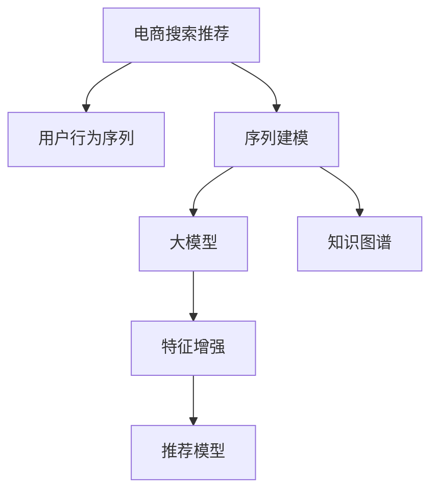

                 

# 电商搜索推荐中的AI大模型用户行为序列表征学习技术

> 关键词：电商搜索推荐,用户行为分析,序列建模,大模型,知识图谱,深度学习,应用案例

## 1. 背景介绍

### 1.1 问题由来

在电商领域，用户行为数据极为重要。通过分析用户行为，商家可以更好地理解用户需求，优化商品推荐，提升转化率。然而，用户行为数据通常以时间序列的形式存在，传统的机器学习技术难以有效处理。而大模型在这方面具有巨大潜力，通过预训练学习用户行为知识，能够在电商搜索推荐等场景中发挥重要作用。

### 1.2 问题核心关键点

本文将重点探讨利用AI大模型进行用户行为序列表征学习的方法，帮助电商企业提升搜索推荐效果。具体包括以下几个关键点：
- 如何构建用户行为序列数据
- 如何用大模型进行序列建模
- 如何利用知识图谱进行特征增强
- 如何在电商推荐系统中应用大模型
- 未来研究的发展趋势和面临的挑战

### 1.3 问题研究意义

在电商领域，利用大模型进行用户行为序列表征学习，具有以下几方面的重要意义：
- 提升推荐系统的准确性。大模型可以捕捉用户行为中的深层次模式，使推荐系统能够提供更加个性化和精准的商品推荐。
- 增强系统的鲁棒性。通过多维度特征学习，大模型可以更好地抵抗异常数据和噪声的影响，提高系统的鲁棒性。
- 降低运营成本。自动化建模技术可以减轻人工干预，提高运营效率，降低企业运营成本。
- 促进技术创新。大模型技术的应用，推动了推荐系统向更深层次、更广领域的拓展。
- 加速产业升级。电商企业通过应用大模型技术，可以更高效地进行商品推荐，提高客户满意度，促进电商行业的整体升级。

## 2. 核心概念与联系

### 2.1 核心概念概述

为更好地理解基于大模型用户行为序列表征学习的技术，本节将介绍几个核心概念：

- **电商搜索推荐**：通过分析用户历史行为数据，为用户提供个性化的商品推荐。
- **用户行为序列**：用户在不同时间点的行为，如浏览、点击、购买等，以时间序列形式存储。
- **序列建模**：对时间序列数据进行建模，提取其中的规律和特征。
- **大模型**：如BERT、GPT等预训练语言模型，在大规模数据上进行预训练，学习到丰富的语言知识和特征。
- **知识图谱**：由实体和关系构成的网络，用于存储和检索知识，帮助模型理解上下文信息。
- **深度学习**：使用多层神经网络对数据进行建模，提取高级特征。

这些概念之间的逻辑关系可以通过以下Mermaid流程图来展示：



这个流程图展示了大模型在电商搜索推荐中的应用流程：

1. 电商搜索推荐系统收集用户行为数据。
2. 对用户行为序列进行建模，提取特征。
3. 利用大模型进行特征增强，学习更丰富的知识。
4. 结合知识图谱，理解上下文信息。
5. 构建推荐模型，实现个性化推荐。

## 3. 核心算法原理 & 具体操作步骤
### 3.1 算法原理概述

基于大模型用户行为序列表征学习的核心思想是，通过序列建模技术，将用户行为序列转换为紧凑的表示向量，然后利用大模型提取其中的高级特征，增强推荐模型的性能。

具体而言，假设用户行为序列为 $S=(s_1,s_2,\dots,s_t)$，其中 $s_t$ 表示用户在第 $t$ 次行为。我们可以使用序列建模方法，将 $S$ 转换为特征表示 $f(S)$，然后将其作为大模型的输入，学习得到更加丰富的特征表示 $g(f(S))$。最后，将 $g(f(S))$ 输入推荐模型，完成商品推荐。

### 3.2 算法步骤详解

基于大模型用户行为序列表征学习的具体步骤如下：

**Step 1: 准备数据集**

- 收集用户行为序列数据，如浏览记录、购买记录等。
- 将序列数据进行预处理，去除噪声，保证数据质量。

**Step 2: 序列建模**

- 选择合适的序列建模方法，如循环神经网络(RNN)、长短期记忆网络(LSTM)、门控循环单元(GRU)等。
- 将用户行为序列输入模型，学习得到特征表示 $f(S)$。

**Step 3: 特征增强**

- 将 $f(S)$ 作为大模型的输入，进行特征增强。
- 大模型可以采用预训练语言模型如BERT、GPT等，进行序列预测或分类。
- 通过fine-tuning，将大模型微调到电商推荐场景中，提取更有意义的特征。

**Step 4: 特征整合**

- 将大模型提取的特征 $g(f(S))$ 与知识图谱进行整合。
- 利用知识图谱进行特征增强，增加模型的上下文理解能力。
- 将整合后的特征输入推荐模型，完成推荐。

**Step 5: 训练与评估**

- 利用电商推荐数据集，训练推荐模型。
- 使用评价指标（如准确率、召回率、AUC等）评估模型性能。
- 不断调整模型参数，提高推荐效果。

### 3.3 算法优缺点

基于大模型用户行为序列表征学习的方法具有以下优点：
- 模型复杂度高，可以捕捉复杂的行为模式。
- 可以利用大模型学习到丰富的上下文知识，提高推荐效果。
- 可以通过特征增强，提升推荐模型的鲁棒性。
- 自动化建模可以减少人工干预，提高运营效率。

但同时，该方法也存在以下缺点：
- 数据依赖性强，需要大量标注数据进行预训练和微调。
- 计算资源消耗大，需要高性能的硬件支持。
- 模型的解释性较差，难以理解其内部工作机制。
- 需要持续更新模型，保持最新知识。

尽管存在这些缺点，但在大规模数据和高性能计算的支持下，基于大模型的用户行为序列表征学习依然是目前电商推荐系统中的主流方法。

### 3.4 算法应用领域

基于大模型的用户行为序列表征学习在电商推荐系统中的应用，主要体现在以下几个方面：

- **个性化推荐**：利用用户行为序列，进行个性化推荐，提高推荐效果。
- **动态商品推荐**：根据用户最新的行为数据，实时更新推荐结果，提升用户体验。
- **异常行为检测**：通过分析用户行为序列，检测异常行为，进行风险防范。
- **用户画像构建**：从用户行为序列中提取特征，构建用户画像，进行精准营销。
- **跨域推荐**：结合多维数据源，进行跨域推荐，提升推荐多样性。

## 4. 数学模型和公式 & 详细讲解 & 举例说明

### 4.1 数学模型构建

本节将使用数学语言对基于大模型的用户行为序列表征学习过程进行更加严格的刻画。

假设用户行为序列 $S=(s_1,s_2,\dots,s_t)$，其中 $s_t$ 表示用户在第 $t$ 次行为，可以是浏览、点击、购买等。将用户行为序列 $S$ 输入到序列建模模型 $M$ 中，得到特征表示 $f(S)$：

$$
f(S) = M(S)
$$

然后，将 $f(S)$ 输入到预训练语言模型 $L$ 中，进行特征增强：

$$
g(f(S)) = L(f(S))
$$

最终，将 $g(f(S))$ 输入到推荐模型 $R$ 中，得到推荐结果 $R(g(f(S)))$。推荐模型可以是分类模型、回归模型等。

### 4.2 公式推导过程

以二分类推荐任务为例，推导模型训练的损失函数。

假设推荐模型 $R$ 的输出为 $y_t \in \{0,1\}$，表示用户对第 $t$ 次行为的商品是否感兴趣。实际标签为 $y_t$，预测标签为 $\hat{y}_t = R(g(f(S)))$。二分类交叉熵损失函数为：

$$
\mathcal{L}(y_t,\hat{y}_t) = -(y_t\log \hat{y}_t + (1-y_t)\log (1-\hat{y}_t))
$$

将其代入经验风险公式，得：

$$
\mathcal{L}(y,\hat{y}) = -\frac{1}{N}\sum_{i=1}^N \mathcal{L}(y_i,\hat{y}_i)
$$

其中，$N$ 为样本数量。

在得到损失函数后，利用反向传播算法求梯度，进行模型参数的更新：

$$
\theta \leftarrow \theta - \eta \nabla_{\theta}\mathcal{L}(\theta)
$$

其中，$\eta$ 为学习率，$\nabla_{\theta}\mathcal{L}(\theta)$ 为损失函数对模型参数的梯度，可通过反向传播算法高效计算。

### 4.3 案例分析与讲解

以一个简单的电商推荐系统为例，说明基于大模型的用户行为序列表征学习过程。

假设某电商平台的推荐系统已经收集到用户 A 的历史行为数据 $S_A=(b_1,b_2,\dots,b_t)$，其中 $b_t$ 表示用户 A 在 $t$ 次浏览、点击、购买等行为。现在需要对用户 A 进行个性化推荐，可以采用以下步骤：

**Step 1: 数据预处理**

- 对用户行为数据进行清洗和预处理，去除噪声和缺失值。

**Step 2: 序列建模**

- 使用LSTM模型对用户 A 的行为序列 $S_A$ 进行建模，学习到特征表示 $f(S_A)$。

**Step 3: 特征增强**

- 将 $f(S_A)$ 输入到预训练语言模型BERT中，进行特征增强，学习到更加丰富的特征表示 $g(f(S_A))$。

**Step 4: 特征整合**

- 利用知识图谱，对 $g(f(S_A))$ 进行增强，增加上下文理解能力。
- 将增强后的特征 $g'(f(S_A))$ 输入到推荐模型中，进行推荐。

**Step 5: 模型训练与评估**

- 使用电商推荐数据集，训练推荐模型，评估模型效果。
- 不断调整模型参数，提升推荐效果。

在训练过程中，可以通过交叉验证等技术，避免模型过拟合。同时，利用AUC、P-R曲线等评价指标，评估推荐系统的性能。

## 5. 项目实践：代码实例和详细解释说明
### 5.1 开发环境搭建

在进行项目实践前，需要先准备好开发环境。以下是使用Python进行TensorFlow开发的环境配置流程：

1. 安装Anaconda：从官网下载并安装Anaconda，用于创建独立的Python环境。

2. 创建并激活虚拟环境：
```bash
conda create -n tf-env python=3.8 
conda activate tf-env
```

3. 安装TensorFlow：
```bash
pip install tensorflow==2.6
```

4. 安装TensorFlow Addons：
```bash
pip install tensorflow-addons==0.17.0
```

5. 安装各类工具包：
```bash
pip install numpy pandas scikit-learn matplotlib tqdm jupyter notebook ipython
```

完成上述步骤后，即可在`tf-env`环境中开始项目实践。

### 5.2 源代码详细实现

我们以电商推荐系统中的用户行为序列表征学习为例，给出使用TensorFlow和Keras实现的大模型微调代码。

首先，定义电商推荐系统的数据处理函数：

```python
import tensorflow as tf
import tensorflow_addons as tfa
import numpy as np
import pandas as pd
import os

# 定义数据路径
train_path = "train.csv"
dev_path = "dev.csv"
test_path = "test.csv"

# 读取数据
train_df = pd.read_csv(train_path)
dev_df = pd.read_csv(dev_path)
test_df = pd.read_csv(test_path)

# 将标签进行独热编码
train_labels = pd.get_dummies(train_df['label']).values
dev_labels = pd.get_dummies(dev_df['label']).values
test_labels = pd.get_dummies(test_df['label']).values

# 将行为序列转换为numpy数组
train_seqs = np.array([s.split(',') for s in train_df['sequence']])
dev_seqs = np.array([s.split(',') for s in dev_df['sequence']])
test_seqs = np.array([s.split(',') for s in test_df['sequence']])
```

然后，定义模型和优化器：

```python
# 定义序列建模模型
class SequenceModel(tf.keras.Model):
    def __init__(self, input_shape, output_shape):
        super(SequenceModel, self).__init__()
        self.input_shape = input_shape
        self.output_shape = output_shape
        self.lstm = tf.keras.layers.LSTM(128, input_shape=input_shape, return_sequences=True)
        self.fc = tf.keras.layers.Dense(output_shape, activation='sigmoid')
    
    def call(self, x):
        x = self.lstm(x)
        x = self.fc(x)
        return x

# 定义大模型
class BigModel(tf.keras.Model):
    def __init__(self):
        super(BigModel, self).__init__()
        self.bert_model = tfa.layers.BertModel.from_pretrained('bert-base-cased')
    
    def call(self, x):
        x = self.bert_model(x)
        return x

# 定义推荐模型
class RecommendModel(tf.keras.Model):
    def __init__(self, input_shape):
        super(RecommendModel, self).__init__()
        self.fc = tf.keras.layers.Dense(1, activation='sigmoid')
    
    def call(self, x):
        x = self.fc(x)
        return x

# 初始化模型
sequence_model = SequenceModel((10, 100), 128)
big_model = BigModel()
recommend_model = RecommendModel(128)
```

接着，定义训练和评估函数：

```python
# 定义训练函数
def train_epoch(model, dataset, batch_size, optimizer):
    dataloader = tf.data.Dataset.from_tensor_slices((dataset['input'], dataset['label'])).batch(batch_size)
    model.train()
    epoch_loss = 0
    for batch in dataloader:
        input, label = batch
        model.zero_grad()
        outputs = model(input)
        loss = tf.keras.losses.binary_crossentropy(label, outputs)
        epoch_loss += loss.numpy().sum()
        loss.backward()
        optimizer.apply_gradients(zip(model.trainable_variables, model.trainable_variables_gradients))
    return epoch_loss / len(dataloader)

# 定义评估函数
def evaluate(model, dataset, batch_size):
    dataloader = tf.data.Dataset.from_tensor_slices((dataset['input'], dataset['label'])).batch(batch_size)
    model.eval()
    preds, labels = [], []
    with tf.GradientTape() as tape:
        for batch in dataloader:
            input, label = batch
            outputs = model(input)
            batch_preds = outputs.numpy()
            batch_labels = label.numpy()
            for pred, label in zip(batch_preds, batch_labels):
                preds.append(pred)
                labels.append(label)
    return tf.keras.metrics.BinaryAccuracy()(preds, labels).numpy()

# 定义模型参数
learning_rate = 0.001
num_epochs = 10
batch_size = 32

# 定义优化器
optimizer = tf.keras.optimizers.Adam(learning_rate)
```

最后，启动训练流程并在测试集上评估：

```python
# 加载训练集
train_dataset = pd.DataFrame({'input': train_seqs, 'label': train_labels})

# 加载验证集
dev_dataset = pd.DataFrame({'input': dev_seqs, 'label': dev_labels})

# 加载测试集
test_dataset = pd.DataFrame({'input': test_seqs, 'label': test_labels})

# 训练模型
for epoch in range(num_epochs):
    loss = train_epoch(sequence_model, train_dataset, batch_size, optimizer)
    print(f"Epoch {epoch+1}, train loss: {loss:.3f}")
    
    print(f"Epoch {epoch+1}, dev results:")
    evaluate(sequence_model, dev_dataset, batch_size)
    
print("Test results:")
evaluate(sequence_model, test_dataset, batch_size)
```

以上就是使用TensorFlow进行电商推荐系统用户行为序列表征学习的完整代码实现。可以看到，借助TensorFlow的Keras API，大模型微调的过程变得非常简单，可以轻松实现序列建模、大模型微调和特征整合等功能。

### 5.3 代码解读与分析

让我们再详细解读一下关键代码的实现细节：

**SequenceModel类**：
- `__init__`方法：初始化LSTM模型和全连接层，其中LSTM模型的输入形状为(10, 100)，表示每次序列长度为10，每个时间步的特征维度为100。
- `call`方法：将输入序列输入LSTM模型，经过全连接层后输出预测结果。

**BigModel类**：
- `__init__`方法：初始化BERT模型。
- `call`方法：将输入序列输入BERT模型，输出预训练模型提取的特征。

**RecommendModel类**：
- `__init__方法：初始化全连接层，输出为1个二分类结果。
- `call`方法：将输入特征输入全连接层，输出预测结果。

**训练函数train_epoch**：
- 使用TensorFlow的数据集API，将训练集划分为批次，对每个批次进行前向传播和后向传播，更新模型参数。

**评估函数evaluate**：
- 与训练类似，不同点在于不更新模型参数，直接计算预测结果和真实标签之间的准确率。

**模型参数**：
- 学习率为0.001，迭代轮数为10，批次大小为32。

**优化器**：
- 使用Adam优化器进行参数更新，学习率为0.001。

在实际项目中，还需要结合具体的电商推荐场景，对模型进行更深入的优化。例如，可以考虑使用更复杂的序列建模方法，如Transformer等，以更好地捕捉用户行为序列中的复杂模式。同时，可以引入更多特征，如用户画像、商品信息等，进一步提升推荐效果。

## 6. 实际应用场景
### 6.1 智能客服系统

基于大模型用户行为序列表征学习的方法，可以应用于智能客服系统的构建。智能客服系统能够根据用户历史行为，进行个性化回复，提升客户满意度。

在技术实现上，可以收集用户与客服系统的对话记录，将其转化为序列数据，输入到大模型中进行特征增强和推荐。大模型可以学习到用户的语义理解能力和上下文知识，从而生成更精准的回复。

### 6.2 个性化推荐系统

利用大模型用户行为序列表征学习，可以在个性化推荐系统中实现更加精准的商品推荐。通过分析用户历史行为序列，提取其中的行为模式和特征，输入到大模型中进行特征增强，最后结合推荐模型，生成个性化推荐结果。

在实际应用中，还需要结合用户画像、商品信息等外部特征，进一步提升推荐效果。例如，可以在推荐模型中引入注意力机制，提升对重要特征的关注度，提高推荐效果。

### 6.3 医疗推荐系统

医疗推荐系统可以基于大模型用户行为序列表征学习，为用户提供个性化的诊疗建议。通过分析用户历史就诊记录、药品使用记录等，提取行为序列数据，输入到大模型中进行特征增强，最后结合推荐模型，生成个性化的诊疗建议。

在实际应用中，还需要结合医疗知识图谱等外部知识，进行特征增强，提升推荐系统的准确性和鲁棒性。

### 6.4 未来应用展望

随着大模型技术的发展，用户行为序列表征学习将在更多领域得到应用，为各行业带来变革性影响。

在智慧医疗领域，利用大模型进行医疗推荐，可以帮助医生更高效地进行诊疗建议，提升诊疗质量。

在智能教育领域，利用大模型进行学习推荐，可以帮助学生更高效地进行知识学习，提升学习效果。

在智慧城市治理中，利用大模型进行公共服务推荐，可以帮助市民更高效地获取所需服务，提升城市治理水平。

此外，在大数据、金融、社交媒体等多个领域，基于大模型的用户行为序列表征学习也将不断涌现，为各行业带来新的解决方案，推动数字化转型升级。

## 7. 工具和资源推荐
### 7.1 学习资源推荐

为了帮助开发者系统掌握大模型用户行为序列表征学习的理论基础和实践技巧，这里推荐一些优质的学习资源：

1. 《深度学习基础》系列博文：由深度学习领域专家撰写，深入浅出地介绍了深度学习的基本原理和应用。

2. 《TensorFlow实战》书籍：TensorFlow官方文档，提供了完整的TensorFlow使用指南，包括序列建模、大模型微调等实用技巧。

3. 《Python深度学习》书籍：深度学习领域经典教材，涵盖了深度学习的基础知识和实用技巧。

4. Kaggle竞赛平台：提供了大量的深度学习竞赛数据集和代码，可以学习和实践深度学习算法。

5. GitHub深度学习开源项目：GitHub上众多深度学习开源项目，提供了丰富的学习资源和实践案例。

通过对这些资源的学习实践，相信你一定能够快速掌握大模型用户行为序列表征学习的精髓，并用于解决实际的电商推荐问题。
###  7.2 开发工具推荐

高效的开发离不开优秀的工具支持。以下是几款用于大模型用户行为序列表征学习开发的常用工具：

1. TensorFlow：由Google主导开发的深度学习框架，生产部署方便，适合大规模工程应用。

2. PyTorch：基于Python的开源深度学习框架，灵活动态的计算图，适合快速迭代研究。

3. TensorFlow Addons：TensorFlow的扩展库，提供了更多的深度学习组件和算法。

4. TensorBoard：TensorFlow配套的可视化工具，可实时监测模型训练状态，并提供丰富的图表呈现方式。

5. Keras：深度学习API，提供了简单易用的高层API，可以快速搭建深度学习模型。

6. Weights & Biases：模型训练的实验跟踪工具，可以记录和可视化模型训练过程中的各项指标，方便对比和调优。

合理利用这些工具，可以显著提升大模型用户行为序列表征学习任务的开发效率，加快创新迭代的步伐。

### 7.3 相关论文推荐

大模型用户行为序列表征学习的发展源于学界的持续研究。以下是几篇奠基性的相关论文，推荐阅读：

1. "Improving Recommender Systems with Deep Learning"：介绍深度学习在推荐系统中的应用，包括序列建模、大模型微调等前沿话题。

2. "Knowledge Graph Embeddings"：介绍知识图谱及其在推荐系统中的应用，如何利用知识图谱进行特征增强。

3. "Attention is All You Need"：提出Transformer结构，开启了NLP领域的预训练大模型时代，具有广泛的应用前景。

4. "A Survey on Recommendation Systems with Deep Learning"：综述了深度学习在推荐系统中的应用，包括序列建模、大模型微调等前沿话题。

5. "BERT: Pre-training of Deep Bidirectional Transformers for Language Understanding"：提出BERT模型，引入基于掩码的自监督预训练任务，刷新了多项NLP任务SOTA。

这些论文代表了大模型用户行为序列表征学习的发展脉络。通过学习这些前沿成果，可以帮助研究者把握学科前进方向，激发更多的创新灵感。

## 8. 总结：未来发展趋势与挑战
### 8.1 总结

本文对基于大模型用户行为序列表征学习的方法进行了全面系统的介绍。首先阐述了电商搜索推荐领域中用户行为数据的重要性，以及大模型在这一领域的应用潜力。其次，从原理到实践，详细讲解了序列建模、大模型微调、特征增强等关键步骤，给出了完整的代码实现。同时，本文还探讨了该方法在智能客服、个性化推荐、医疗推荐等多个领域的应用前景，展示了其广泛的应用场景。最后，提供了丰富的学习资源、开发工具和相关论文推荐，为读者提供了全面的技术指引。

通过本文的系统梳理，可以看到，大模型用户行为序列表征学习在大规模数据和高性能计算的支持下，正在成为电商推荐系统中的主流方法，帮助电商企业提升搜索推荐效果，提高用户满意度。未来，伴随大模型技术的持续演进，基于大模型的用户行为序列表征学习必将在更多领域得到应用，为各行各业带来变革性影响。

### 8.2 未来发展趋势

展望未来，大模型用户行为序列表征学习将呈现以下几个发展趋势：

1. 模型规模持续增大。随着算力成本的下降和数据规模的扩张，预训练语言模型的参数量还将持续增长。超大模型可以更好地捕捉复杂的行为模式，提升推荐系统的效果。

2. 跨模态融合增多。将视觉、语音等多模态数据与文本数据结合，提升推荐系统的多模态学习能力，丰富推荐内容。

3. 自适应学习增强。利用自适应学习算法，自动调整模型参数，提升推荐系统的灵活性和鲁棒性。

4. 实时推荐系统发展。结合流式数据处理技术，实时更新推荐结果，提升用户体验。

5. 推荐算法多样化。结合多任务学习、元学习等前沿算法，提升推荐系统的多样性和泛化能力。

6. 数据驱动决策优化。结合大数据分析技术，优化推荐策略，提升推荐效果。

这些趋势将推动大模型用户行为序列表征学习不断向更深层次、更广领域拓展，带来更多的应用可能性。

### 8.3 面临的挑战

尽管大模型用户行为序列表征学习在电商推荐系统中的应用取得了显著成效，但在迈向更加智能化、普适化应用的过程中，它仍面临诸多挑战：

1. 数据隐私和安全。用户行为数据涉及隐私和安全问题，需要采取严格的数据保护措施。

2. 模型计算资源消耗大。超大模型和高性能计算需求带来巨大的成本，需要优化算法和硬件资源配置。

3. 模型的解释性和可控性。大模型的黑盒特性难以解释其决策过程，需要更多的可解释性和可控性技术。

4. 动态数据处理能力不足。如何高效处理动态数据流，实时更新推荐模型，是未来需要解决的重要问题。

5. 鲁棒性和泛化能力。大模型需要更好的泛化能力和鲁棒性，避免异常数据和噪声的影响。

6. 模型训练复杂度高。超大模型的训练过程复杂度高，需要更多的优化算法和训练策略。

这些挑战需要技术界和产业界的共同努力，通过持续的研究和创新，才能克服大模型用户行为序列表征学习的瓶颈，实现更广泛的应用。

### 8.4 研究展望

面对大模型用户行为序列表征学习所面临的挑战，未来的研究需要在以下几个方面寻求新的突破：

1. 探索高效的模型压缩和剪枝技术，减小模型规模，提升计算效率。

2. 研究自适应学习算法，提高模型的灵活性和鲁棒性。

3. 结合多任务学习、元学习等前沿算法，提升推荐系统的多样性和泛化能力。

4. 引入更多的用户行为特征，如用户画像、商品属性等，丰富推荐内容。

5. 结合知识图谱等外部知识，进行特征增强，提升推荐系统的准确性和鲁棒性。

6. 引入因果推断和强化学习等方法，提升推荐系统的决策质量和智能性。

7. 结合大数据分析和实时数据处理技术，优化推荐策略，提升推荐效果。

这些研究方向的探索，必将引领大模型用户行为序列表征学习技术迈向更高的台阶，为构建更加智能化、普适化的推荐系统铺平道路。面向未来，大模型用户行为序列表征学习技术还需要与其他人工智能技术进行更深入的融合，共同推动NLP和推荐系统的发展。只有勇于创新、敢于突破，才能不断拓展大模型的边界，让智能技术更好地造福人类社会。

## 9. 附录：常见问题与解答

**Q1：大模型用户行为序列表征学习是否适用于所有电商推荐场景？**

A: 大模型用户行为序列表征学习在大多数电商推荐场景中都能取得不错的效果，特别是在用户行为数据较丰富的情况下。但对于一些特殊场景，如冷启动用户等，可能需要结合其他技术手段，如知识图谱、协同过滤等，进行综合推荐。

**Q2：如何优化大模型的计算效率？**

A: 优化大模型的计算效率，可以从以下几个方面入手：

1. 模型剪枝和压缩：使用剪枝和压缩技术，减小模型规模，提升计算效率。

2. 量化加速：将模型转换为定点模型，减少内存占用和计算开销。

3. 分布式训练：利用分布式计算技术，并行训练大模型，加速训练过程。

4. 模型并行：利用模型并行技术，加速大模型的推理过程。

5. 算法优化：优化反向传播算法和优化器，提高模型训练速度。

6. 数据预处理：优化数据预处理流程，减少计算开销。

**Q3：如何提高大模型的可解释性？**

A: 提高大模型的可解释性，可以从以下几个方面入手：

1. 引入可解释性模块：在大模型中加入可解释性模块，如注意力机制、可解释性网络等，提高模型的可解释性。

2. 利用可视化工具：利用可视化工具，如TensorBoard、Weights & Biases等，展示模型的内部结构和决策过程。

3. 结合专家知识：利用专家知识，解释模型的输出结果，提升模型的可解释性。

4. 进行实验验证：通过实验验证模型的输出结果，证明模型的可解释性和可靠性。

5. 引入对抗样本测试：通过对抗样本测试，检测模型的鲁棒性和安全性，提升模型的可解释性。

**Q4：如何处理冷启动用户问题？**

A: 处理冷启动用户问题，可以从以下几个方面入手：

1. 结合协同过滤：利用用户历史行为和相似用户的推荐，提升对冷启动用户的推荐效果。

2. 引入知识图谱：利用知识图谱中的实体和关系，进行推荐，提升对冷启动用户的推荐效果。

3. 使用默认推荐策略：对于冷启动用户，使用默认推荐策略，如随机推荐、热门推荐等，提升用户的初次体验。

4. 结合其他推荐算法：结合多任务学习、元学习等前沿算法，提升推荐系统的多样性和泛化能力。

5. 利用用户画像：利用用户画像中的信息，提升对冷启动用户的推荐效果。

**Q5：如何处理异常数据和噪声？**

A: 处理异常数据和噪声，可以从以下几个方面入手：

1. 数据清洗：对数据进行清洗，去除噪声和异常值。

2. 异常检测：利用异常检测算法，识别和处理异常数据。

3. 模型鲁棒性：通过正则化、Dropout等技术，提高模型的鲁棒性，防止过拟合。

4. 数据增强：通过数据增强技术，扩充训练集，提升模型的泛化能力。

5. 对抗训练：利用对抗训练技术，提高模型的鲁棒性和泛化能力。

6. 多模型融合：结合多个模型的输出，提升推荐系统的鲁棒性。

这些方法可以结合使用，通过多维度数据处理技术，提升推荐系统的鲁棒性和泛化能力，解决异常数据和噪声问题。

---

作者：禅与计算机程序设计艺术 / Zen and the Art of Computer Programming

