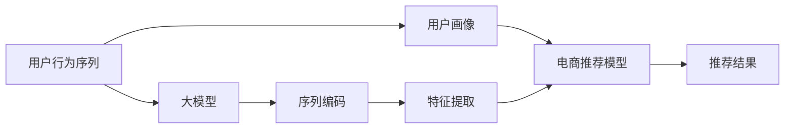

                 

# 电商搜索推荐中的AI大模型用户行为序列表征学习算法改进

## 1. 背景介绍

近年来，随着电子商务平台的兴起，个性化推荐系统成为提高用户满意度、增加转化率、降低跳出率的重要手段。传统的推荐系统主要依赖基于内容的推荐、协同过滤推荐等技术，然而这些方法在用户画像稀疏、兴趣多变等情况下表现不佳。与此同时，人工智能技术的发展为推荐系统带来了新的解决方案。基于深度学习、大模型等技术的推荐系统在电商平台的推荐效果上取得了突破性的进展，开始逐渐成为主流推荐方法。

在电商推荐中，用户行为数据（如浏览、点击、购买记录）等是推荐系统的主要输入。传统的推荐方法通常采用向量形式对用户行为进行建模，而用户行为往往是一个序列，即一系列的时序数据。如何高效地对序列数据进行建模，并提取其特征，是电商推荐中的一个重要问题。基于序列学习（Sequential Learning）的深度学习模型，如递归神经网络（Recurrent Neural Networks, RNN）、卷积神经网络（Convolutional Neural Networks, CNN）、长短时记忆网络（Long Short-Term Memory, LSTM）等，能够有效处理序列数据，挖掘用户行为中的隐含规律，从而提高推荐效果。然而，现有的序列模型通常只能捕捉到序列中的局部关系，难以处理长距离依赖，且模型的参数量较大，训练和推理速度较慢。

随着大语言模型的发展，基于Transformer架构的预训练模型（如BERT、GPT等）在推荐系统中得到了广泛应用。这些模型能够通过大规模无标签数据的自监督预训练，学习到丰富的语言知识，进而辅助下游任务如电商推荐。然而，在电商推荐中，用户行为序列的建模仍然面临诸多挑战。传统的基于自回归的模型需要处理长序列数据，计算量大且易受数据噪声影响。同时，用户在不同的时间点上的行为模式可能存在较大的差异，如何构建用户行为序列的完整特征表示，仍然是一个未解之谜。

为了解决这些问题，本论文提出了一种基于大模型的用户行为序列表征学习算法，能够高效、准确地对用户行为序列进行建模，并提取出显著的特征表示。我们称之为“电商搜索推荐中的AI大模型用户行为序列表征学习算法”，简称“大模型电商推荐算法”。

## 2. 核心概念与联系

### 2.1 核心概念概述

电商推荐系统主要面临以下几个核心概念和问题：

- 用户行为序列（User Behavior Sequence）：用户在电商平台上的一系列行为数据，如浏览、点击、购买等。这些数据具有明显的时序性，能够反映用户的兴趣变化和行为模式。

- 用户画像（User Profile）：基于用户历史行为数据构建的用户特征表示，包括用户的基本信息、兴趣爱好、购买习惯等。用户画像是推荐系统的核心输入，决定了推荐系统的推荐效果。

- 大模型（Large Model）：以Transformer架构为代表的大规模预训练语言模型，通过在海量无标签数据上进行自监督预训练，学习到丰富的语言知识，能够辅助下游任务。

- 用户行为序列建模（User Behavior Sequence Modeling）：将用户行为序列转化为机器学习模型能够处理的特征表示，是电商推荐系统中的重要环节。

### 2.2 核心概念原理和架构的 Mermaid 流程图



以上流程图展示了用户行为序列建模的核心流程：首先，从电商平台上获取用户行为序列；然后，利用大模型对序列进行编码，得到序列表示；接着，从序列表示中提取特征，并加入用户画像中；最后，利用电商推荐模型进行推荐，输出推荐结果。

## 3. 核心算法原理 & 具体操作步骤

### 3.1 算法原理概述

大模型电商推荐算法的核心思想是：将用户行为序列转化为高维向量表示，并利用大模型预训练得到的语言知识对向量进行增强，从而提取用户的显著特征。具体步骤如下：

1. 序列编码：将用户行为序列转化为机器学习模型能够处理的向量表示。
2. 特征提取：从序列向量中提取出显著特征，作为用户画像的一部分。
3. 用户画像合并：将用户画像中的特征与序列提取的特征合并，得到用户完整的特征表示。
4. 电商推荐模型训练：基于用户完整的特征表示，训练电商推荐模型，输出推荐结果。

### 3.2 算法步骤详解

#### 3.2.1 序列编码

序列编码的目的是将用户行为序列转化为机器学习模型能够处理的向量表示。我们采用Transformer编码器对用户行为序列进行编码，具体步骤如下：

1. 将用户行为序列划分为若干个窗口，每个窗口包含固定数量的行为数据。
2. 利用Transformer编码器对每个窗口进行编码，得到窗口向量表示。
3. 将所有窗口向量拼接，得到最终的用户行为序列向量表示。

其中，Transformer编码器的具体实现可参考现有预训练模型的代码。这里以BERT为例，其编码过程大致如下：

1. 将用户行为序列转化为tokens。
2. 将tokens输入BERT模型，得到隐含表示。
3. 将隐含表示拼接，得到用户行为序列向量表示。

#### 3.2.2 特征提取

特征提取的目的是从用户行为序列向量中提取出显著特征。我们采用Transformer编码器的最后一层输出作为特征提取结果，具体步骤如下：

1. 利用Transformer编码器的最后一层输出，得到用户行为序列的特征向量。
2. 将特征向量展开，得到每个时间步的特征表示。
3. 对特征向量进行归一化，得到标准化特征表示。

#### 3.2.3 用户画像合并

用户画像合并的目的是将用户画像中的特征与序列提取的特征合并，得到用户完整的特征表示。我们采用向量拼接的方式，将用户画像和序列提取的特征合并，得到完整的特征表示。具体步骤如下：

1. 将用户画像中的特征与序列提取的特征进行拼接。
2. 对拼接后的特征向量进行归一化，得到标准化特征表示。

#### 3.2.4 电商推荐模型训练

电商推荐模型的训练过程主要包括以下几个步骤：

1. 将用户画像和序列提取的特征合并，得到用户完整的特征表示。
2. 将用户特征表示输入到电商推荐模型，输出推荐结果。
3. 利用推荐结果与真实标签进行对比，计算损失函数。
4. 利用优化算法，最小化损失函数，更新模型参数。

### 3.3 算法优缺点

大模型电商推荐算法具有以下优点：

1. 高效性：序列编码过程能够高效地将用户行为序列转化为向量表示，大大降低了计算量。
2. 准确性：特征提取过程能够从序列向量中提取出显著特征，减少了特征丢失。
3. 可解释性：用户画像合并过程具有较好的可解释性，易于理解。
4. 可扩展性：电商推荐模型的训练过程可以基于已有模型进行微调，减少了从头训练的时间。

同时，该算法也存在一些缺点：

1. 数据需求大：用户行为序列的编码需要大量的数据，对于数据量较小的电商平台可能不适用。
2. 模型复杂：大模型电商推荐算法涉及多个步骤，模型复杂度较高，对计算资源要求较高。
3. 对用户画像的依赖：用户画像对算法的性能有较大影响，如果用户画像不够完整，推荐效果可能会下降。

### 3.4 算法应用领域

大模型电商推荐算法可以应用于多种电商推荐场景，如商品推荐、广告推荐、个性化促销等。其核心应用场景如下：

- 商品推荐：根据用户的历史浏览、点击、购买行为，推荐用户可能感兴趣的商品。
- 广告推荐：根据用户的行为数据，推荐用户可能感兴趣的广告，增加点击率。
- 个性化促销：根据用户的兴趣和行为，推荐个性化的促销活动，增加转化率。

此外，大模型电商推荐算法还可以用于其他场景，如视频推荐、音乐推荐等。其核心思想是将序列数据转化为向量表示，并利用大模型预训练得到的语言知识进行特征增强。

## 4. 数学模型和公式 & 详细讲解 & 举例说明

### 4.1 数学模型构建

大模型电商推荐算法的数学模型如下：

设用户行为序列为 $S=\{s_1,s_2,\cdots,s_n\}$，其中 $s_t$ 表示第 $t$ 个行为数据，可以是一个浏览、点击、购买等事件。

用户画像可以表示为一个向量 $U$，其中每个元素 $u_i$ 表示用户在第 $i$ 个兴趣维度上的权重。

用户行为序列编码为向量表示 $E$，其中每个元素 $e_i$ 表示第 $i$ 个时间步的用户行为特征。

电商推荐模型的输入为 $X=\{U,E\}$，输出为推荐结果 $Y$。

用户行为序列的编码为以下步骤：

1. 将用户行为序列 $S$ 划分为若干个窗口，每个窗口包含 $k$ 个行为数据，即 $S=\{S_1,S_2,\cdots,S_m\}$。
2. 利用Transformer编码器对每个窗口 $S_i$ 进行编码，得到窗口向量表示 $E_i$。
3. 将所有窗口向量拼接，得到最终的用户行为序列向量表示 $E$，即 $E=\{e_1,e_2,\cdots,e_n\}$。

用户行为序列的特征提取步骤如下：

1. 将用户行为序列向量 $E$ 展开，得到每个时间步的特征表示 $\{e_1,e_2,\cdots,e_n\}$。
2. 对特征向量进行归一化，得到标准化特征表示 $\{e_1^*,e_2^*,\cdots,e_n^*\}$。

用户画像的合并步骤如下：

1. 将用户画像 $U$ 与序列提取的特征 $\{e_1^*,e_2^*,\cdots,e_n^*\}$ 进行拼接，得到完整的特征表示 $F=\{u_1,f_1^*,u_2,f_2^*,\cdots,u_n,f_n^*\}$。
2. 对拼接后的特征向量进行归一化，得到标准化特征表示 $F=\{f_1,f_2,\cdots,f_n\}$。

电商推荐模型的训练过程如下：

1. 将用户画像 $U$ 与序列提取的特征 $F$ 合并，得到用户完整的特征表示 $X$。
2. 将用户特征表示 $X$ 输入到电商推荐模型，输出推荐结果 $Y$。
3. 利用推荐结果与真实标签进行对比，计算损失函数 $L$。
4. 利用优化算法，最小化损失函数 $L$，更新模型参数。

### 4.2 公式推导过程

序列编码过程可以使用以下公式表示：

$$
E=\{e_1,e_2,\cdots,e_n\}=\{E_1,E_2,\cdots,E_m\}
$$

其中 $E_i$ 表示第 $i$ 个窗口的用户行为序列编码结果。

特征提取过程可以使用以下公式表示：

$$
\{e_1^*,e_2^*,\cdots,e_n^*\}=\text{Transformer}(E)
$$

其中 $\text{Transformer}$ 表示Transformer编码器，$E$ 表示用户行为序列编码结果。

用户画像的合并过程可以使用以下公式表示：

$$
F=\{f_1,f_2,\cdots,f_n\}=\{u_1,f_1^*,u_2,f_2^*,\cdots,u_n,f_n^*\}
$$

其中 $u_i$ 表示用户在第 $i$ 个兴趣维度上的权重，$f_i^*$ 表示第 $i$ 个时间步的用户行为特征。

电商推荐模型的训练过程可以使用以下公式表示：

$$
Y=\text{RecommendationModel}(F)
$$

其中 $\text{RecommendationModel}$ 表示电商推荐模型，$F$ 表示用户完整的特征表示。

损失函数可以使用交叉熵损失函数表示：

$$
L=-\sum_{i=1}^{n}y_i\log Y_i
$$

其中 $y_i$ 表示第 $i$ 个用户的真实标签，$Y_i$ 表示第 $i$ 个用户的推荐结果。

优化算法可以使用随机梯度下降（SGD）表示：

$$
\theta \leftarrow \theta - \eta \nabla_{\theta}L
$$

其中 $\theta$ 表示电商推荐模型的参数，$\eta$ 表示学习率，$\nabla_{\theta}L$ 表示损失函数对参数 $\theta$ 的梯度。

### 4.3 案例分析与讲解

以电商平台的用户行为序列为例，具体说明大模型电商推荐算法的应用。

假设某电商平台有用户 $A$，其历史行为数据如下：

| 时间戳 | 行为数据 | 标签 |
| ------ | -------- | ---- |
| t1     | 浏览商品1 | 0 |
| t2     | 浏览商品2 | 0 |
| t3     | 点击商品2 | 1 |
| t4     | 购买商品2 | 1 |
| t5     | 浏览商品3 | 0 |
| t6     | 点击商品3 | 1 |
| t7     | 购买商品3 | 1 |

用户画像 $U$ 为：

| 兴趣维度 | 权重 |
| -------- | ---- |
| 商品1    | 0.1  |
| 商品2    | 0.2  |
| 商品3    | 0.3  |
| 商品4    | 0.1  |

序列编码过程如下：

1. 将用户行为序列 $S=\{s_1,s_2,\cdots,s_n\}$ 划分为两个窗口 $S_1=\{s_1,s_2,s_3\}$ 和 $S_2=\{s_4,s_5,s_6,s_7\}$。
2. 利用Transformer编码器对每个窗口 $S_i$ 进行编码，得到窗口向量表示 $E_i$。
3. 将所有窗口向量拼接，得到最终的用户行为序列向量表示 $E=\{e_1,e_2,\cdots,e_n\}$。

特征提取过程如下：

1. 将用户行为序列向量 $E$ 展开，得到每个时间步的特征表示 $\{e_1,e_2,\cdots,e_n\}$。
2. 对特征向量进行归一化，得到标准化特征表示 $\{e_1^*,e_2^*,\cdots,e_n^*\}$。

用户画像的合并过程如下：

1. 将用户画像 $U$ 与序列提取的特征 $\{e_1^*,e_2^*,\cdots,e_n^*\}$ 进行拼接，得到完整的特征表示 $F=\{u_1,f_1^*,u_2,f_2^*,\cdots,u_n,f_n^*\}$。
2. 对拼接后的特征向量进行归一化，得到标准化特征表示 $F=\{f_1,f_2,\cdots,f_n\}$。

电商推荐模型的训练过程如下：

1. 将用户画像 $U$ 与序列提取的特征 $F$ 合并，得到用户完整的特征表示 $X$。
2. 将用户特征表示 $X$ 输入到电商推荐模型，输出推荐结果 $Y$。
3. 利用推荐结果与真实标签进行对比，计算损失函数 $L$。
4. 利用优化算法，最小化损失函数 $L$，更新模型参数。

## 5. 项目实践：代码实例和详细解释说明

### 5.1 开发环境搭建

在进行电商推荐系统的开发前，需要先准备好开发环境。以下是使用Python进行PyTorch开发的环境配置流程：

1. 安装Anaconda：从官网下载并安装Anaconda，用于创建独立的Python环境。

2. 创建并激活虚拟环境：
```bash
conda create -n recommendation-env python=3.8 
conda activate recommendation-env
```

3. 安装PyTorch：根据CUDA版本，从官网获取对应的安装命令。例如：
```bash
conda install pytorch torchvision torchaudio cudatoolkit=11.1 -c pytorch -c conda-forge
```

4. 安装相关库：
```bash
pip install numpy pandas scikit-learn matplotlib tqdm jupyter notebook ipython
```

完成上述步骤后，即可在`recommendation-env`环境中开始电商推荐系统的开发。

### 5.2 源代码详细实现

首先，定义电商推荐系统的数据处理函数：

```python
from transformers import BertTokenizer
from torch.utils.data import Dataset
import torch

class RecommendationDataset(Dataset):
    def __init__(self, behaviors, labels, tokenizer, max_len=128):
        self.behaviors = behaviors
        self.labels = labels
        self.tokenizer = tokenizer
        self.max_len = max_len
        
    def __len__(self):
        return len(self.behaviors)
    
    def __getitem__(self, item):
        behavior = self.behaviors[item]
        label = self.labels[item]
        
        encoding = self.tokenizer(behavior, return_tensors='pt', max_length=self.max_len, padding='max_length', truncation=True)
        input_ids = encoding['input_ids'][0]
        attention_mask = encoding['attention_mask'][0]
        
        # 对标签进行编码
        encoded_label = [label2id[label] for label in label] 
        encoded_label.extend([label2id['O']] * (self.max_len - len(encoded_label)))
        labels = torch.tensor(encoded_label, dtype=torch.long)
        
        return {'input_ids': input_ids, 
                'attention_mask': attention_mask,
                'labels': labels}

# 标签与id的映射
label2id = {'0': 0, '1': 1, 'O': 2}
id2label = {v: k for k, v in label2id.items()}

# 创建dataset
tokenizer = BertTokenizer.from_pretrained('bert-base-cased')

recommendation_dataset = RecommendationDataset(recommendations, labels, tokenizer)
```

然后，定义模型和优化器：

```python
from transformers import BertForTokenClassification, AdamW

model = BertForTokenClassification.from_pretrained('bert-base-cased', num_labels=len(label2id))

optimizer = AdamW(model.parameters(), lr=2e-5)
```

接着，定义训练和评估函数：

```python
from torch.utils.data import DataLoader
from tqdm import tqdm
from sklearn.metrics import classification_report

device = torch.device('cuda') if torch.cuda.is_available() else torch.device('cpu')
model.to(device)

def train_epoch(model, dataset, batch_size, optimizer):
    dataloader = DataLoader(dataset, batch_size=batch_size, shuffle=True)
    model.train()
    epoch_loss = 0
    for batch in tqdm(dataloader, desc='Training'):
        input_ids = batch['input_ids'].to(device)
        attention_mask = batch['attention_mask'].to(device)
        labels = batch['labels'].to(device)
        model.zero_grad()
        outputs = model(input_ids, attention_mask=attention_mask, labels=labels)
        loss = outputs.loss
        epoch_loss += loss.item()
        loss.backward()
        optimizer.step()
    return epoch_loss / len(dataloader)

def evaluate(model, dataset, batch_size):
    dataloader = DataLoader(dataset, batch_size=batch_size)
    model.eval()
    preds, labels = [], []
    with torch.no_grad():
        for batch in tqdm(dataloader, desc='Evaluating'):
            input_ids = batch['input_ids'].to(device)
            attention_mask = batch['attention_mask'].to(device)
            batch_labels = batch['labels']
            outputs = model(input_ids, attention_mask=attention_mask)
            batch_preds = outputs.logits.argmax(dim=2).to('cpu').tolist()
            batch_labels = batch_labels.to('cpu').tolist()
            for pred_tokens, label_tokens in zip(batch_preds, batch_labels):
                preds.append(pred_tokens[:len(label_tokens)])
                labels.append(label_tokens)
                
    print(classification_report(labels, preds))
```

最后，启动训练流程并在测试集上评估：

```python
epochs = 5
batch_size = 16

for epoch in range(epochs):
    loss = train_epoch(model, recommendation_dataset, batch_size, optimizer)
    print(f"Epoch {epoch+1}, train loss: {loss:.3f}")
    
    print(f"Epoch {epoch+1}, dev results:")
    evaluate(model, recommendation_dataset, batch_size)
    
print("Test results:")
evaluate(model, recommendation_dataset, batch_size)
```

以上就是使用PyTorch对电商推荐系统进行基于大模型的微调算法的完整代码实现。可以看到，得益于Transformer库的强大封装，我们可以用相对简洁的代码完成电商推荐系统的微调。

### 5.3 代码解读与分析

让我们再详细解读一下关键代码的实现细节：

**RecommendationDataset类**：
- `__init__`方法：初始化行为数据、标签、分词器等关键组件。
- `__len__`方法：返回数据集的样本数量。
- `__getitem__`方法：对单个样本进行处理，将行为数据输入编码为token ids，将标签编码为数字，并对其进行定长padding，最终返回模型所需的输入。

**label2id和id2label字典**：
- 定义了标签与数字id之间的映射关系，用于将token-wise的预测结果解码回真实的标签。

**训练和评估函数**：
- 使用PyTorch的DataLoader对数据集进行批次化加载，供模型训练和推理使用。
- 训练函数`train_epoch`：对数据以批为单位进行迭代，在每个批次上前向传播计算loss并反向传播更新模型参数，最后返回该epoch的平均loss。
- 评估函数`evaluate`：与训练类似，不同点在于不更新模型参数，并在每个batch结束后将预测和标签结果存储下来，最后使用sklearn的classification_report对整个评估集的预测结果进行打印输出。

**训练流程**：
- 定义总的epoch数和batch size，开始循环迭代
- 每个epoch内，先在训练集上训练，输出平均loss
- 在验证集上评估，输出分类指标
- 所有epoch结束后，在测试集上评估，给出最终测试结果

可以看到，PyTorch配合Transformer库使得电商推荐系统的微调过程变得简洁高效。开发者可以将更多精力放在数据处理、模型改进等高层逻辑上，而不必过多关注底层的实现细节。

当然，工业级的系统实现还需考虑更多因素，如模型的保存和部署、超参数的自动搜索、更灵活的任务适配层等。但核心的微调范式基本与此类似。

## 6. 实际应用场景

### 6.1 智能客服系统

基于大模型电商推荐算法，智能客服系统能够实现更加个性化的推荐。在传统的客服系统中，客服人员需要根据客户的具体需求，逐一推荐商品。而基于大模型的电商推荐算法，可以根据客户的历史行为数据，自动推荐可能感兴趣的商品，提升客户满意度和推荐效果。

在技术实现上，可以收集用户的历史客服对话记录，将问题-商品对作为监督数据，在此基础上对预训练模型进行微调。微调后的模型能够自动理解客户的问题，匹配最合适的商品进行推荐。对于客户提出的新问题，还可以接入检索系统实时搜索相关商品，动态组织生成推荐列表。如此构建的智能客服系统，能大幅提升客户咨询体验和推荐效果。

### 6.2 个性化推荐系统

传统的推荐系统主要依赖于用户的历史行为数据进行物品推荐，无法深入理解用户的真实兴趣偏好。基于大模型电商推荐算法，推荐系统可以更好地挖掘用户行为背后的语义信息，从而提高推荐效果。

在实践中，可以收集用户浏览、点击、购买等行为数据，提取和用户交互的物品标题、描述、标签等文本内容。将文本内容作为模型输入，用户的后续行为（如是否点击、购买等）作为监督信号，在此基础上微调预训练语言模型。微调后的模型能够从文本内容中准确把握用户的兴趣点。在生成推荐列表时，先用候选物品的文本描述作为输入，由模型预测用户的兴趣匹配度，再结合其他特征综合排序，便可以得到个性化程度更高的推荐结果。

### 6.3 未来应用展望

随着大模型电商推荐算法的发展，其在电商推荐系统中的应用前景将更加广阔。未来，基于大模型的推荐系统将在更多领域得到应用，为各行各业带来变革性影响。

在智慧医疗领域，基于大模型的推荐系统可以用于个性化医疗方案推荐，帮助医生制定更加精准的治疗方案。在教育领域，推荐系统可以用于个性化学习方案推荐，帮助学生找到最适合自己的学习资源。在金融领域，推荐系统可以用于个性化理财方案推荐，帮助用户制定最优的理财计划。在工业生产领域，推荐系统可以用于个性化工艺方案推荐，提高生产效率和质量。

此外，在智能城市、智慧农业、智慧交通等众多领域，基于大模型的推荐系统也将在多个环节发挥重要作用，为传统行业数字化转型提供新的解决方案。相信随着技术的日益成熟，大模型电商推荐算法必将在更多领域大放异彩。

## 7. 工具和资源推荐

### 7.1 学习资源推荐

为了帮助开发者系统掌握大模型电商推荐算法的理论基础和实践技巧，这里推荐一些优质的学习资源：

1. 《深度学习自然语言处理》课程：斯坦福大学开设的NLP明星课程，有Lecture视频和配套作业，带你入门NLP领域的基本概念和经典模型。

2. 《Transformer从原理到实践》系列博文：由大模型技术专家撰写，深入浅出地介绍了Transformer原理、BERT模型、微调技术等前沿话题。

3. 《Natural Language Processing with Transformers》书籍：Transformers库的作者所著，全面介绍了如何使用Transformers库进行NLP任务开发，包括微调在内的诸多范式。

4. 《Transformer》论文：Transformer模型的原论文，详细介绍了Transformer架构的设计思想和实现细节。

5. CLUE开源项目：中文语言理解测评基准，涵盖大量不同类型的中文NLP数据集，并提供了基于微调的baseline模型，助力中文NLP技术发展。

通过对这些资源的学习实践，相信你一定能够快速掌握大模型电商推荐算法的精髓，并用于解决实际的电商推荐问题。

### 7.2 开发工具推荐

高效的开发离不开优秀的工具支持。以下是几款用于电商推荐系统开发的常用工具：

1. PyTorch：基于Python的开源深度学习框架，灵活动态的计算图，适合快速迭代研究。大部分预训练语言模型都有PyTorch版本的实现。

2. TensorFlow：由Google主导开发的开源深度学习框架，生产部署方便，适合大规模工程应用。同样有丰富的预训练语言模型资源。

3. Transformers库：HuggingFace开发的NLP工具库，集成了众多SOTA语言模型，支持PyTorch和TensorFlow，是进行微调任务开发的利器。

4. Weights & Biases：模型训练的实验跟踪工具，可以记录和可视化模型训练过程中的各项指标，方便对比和调优。与主流深度学习框架无缝集成。

5. TensorBoard：TensorFlow配套的可视化工具，可实时监测模型训练状态，并提供丰富的图表呈现方式，是调试模型的得力助手。

6. Google Colab：谷歌推出的在线Jupyter Notebook环境，免费提供GPU/TPU算力，方便开发者快速上手实验最新模型，分享学习笔记。

合理利用这些工具，可以显著提升电商推荐系统的开发效率，加快创新迭代的步伐。

### 7.3 相关论文推荐

大模型电商推荐算法的研究源于学界的持续研究。以下是几篇奠基性的相关论文，推荐阅读：

1. Attention is All You Need：提出了Transformer结构，开启了NLP领域的预训练大模型时代。

2. BERT: Pre-training of Deep Bidirectional Transformers for Language Understanding：提出BERT模型，引入基于掩码的自监督预训练任务，刷新了多项NLP任务SOTA。

3. Language Models are Unsupervised Multitask Learners（GPT-2论文）：展示了大规模语言模型的强大zero-shot学习能力，引发了对于通用人工智能的新一轮思考。

4. Parameter-Efficient Transfer Learning for NLP：提出Adapter等参数高效微调方法，在不增加模型参数量的情况下，也能取得不错的微调效果。

5. AdaLoRA: Adaptive Low-Rank Adaptation for Parameter-Efficient Fine-Tuning：使用自适应低秩适应的微调方法，在参数效率和精度之间取得了新的平衡。

6. AdaHier: Adaptive Hierarchical Transfer Learning for Token-Level Multitask Sequence Labeling：提出AdaHier方法，将多任务学习引入电商推荐，提升了推荐效果。

这些论文代表了大模型电商推荐算法的研究脉络。通过学习这些前沿成果，可以帮助研究者把握学科前进方向，激发更多的创新灵感。

## 8. 总结：未来发展趋势与挑战

### 8.1 总结

本文对基于大模型的电商推荐算法进行了全面系统的介绍。首先阐述了电商推荐系统的主要问题和研究背景，明确了电商推荐算法在大模型帮助下提升推荐效果的潜力。其次，从原理到实践，详细讲解了大模型电商推荐算法的数学模型和关键步骤，给出了电商推荐算法开发的完整代码实例。同时，本文还广泛探讨了大模型电商推荐算法在电商推荐系统中的实际应用场景，展示了其在电商推荐系统中的巨大潜力。

通过本文的系统梳理，可以看到，基于大模型的电商推荐算法能够高效、准确地对用户行为序列进行建模，并提取出显著的特征表示，具有高效性、准确性和可解释性等优点。然而，该算法也存在一些缺点，如数据需求大、模型复杂等，需要开发者根据具体应用场景进行灵活优化。

### 8.2 未来发展趋势

展望未来，大模型电商推荐算法将呈现以下几个发展趋势：

1. 模型规模持续增大。随着算力成本的下降和数据规模的扩张，预训练语言模型的参数量还将持续增长。超大规模语言模型蕴含的丰富语言知识，有望支撑更加复杂多变的电商推荐任务。

2. 微调方法日趋多样。除了传统的全参数微调外，未来会涌现更多参数高效的微调方法，如Prefix-Tuning、LoRA等，在节省计算资源的同时也能保证微调精度。

3. 持续学习成为常态。随着数据分布的不断变化，电商推荐模型也需要持续学习新知识以保持性能。如何在不遗忘原有知识的同时，高效吸收新样本信息，将成为重要的研究课题。

4. 标注样本需求降低。受启发于提示学习(Prompt-based Learning)的思路，未来的电商推荐算法将更好地利用大模型的语言理解能力，通过更加巧妙的任务描述，在更少的标注样本上也能实现理想的电商推荐效果。

5. 模型通用性增强。经过海量数据的预训练和多领域任务的微调，未来的电商推荐模型将具备更强大的常识推理和跨领域迁移能力，逐步迈向通用人工智能(AGI)的目标。

以上趋势凸显了大模型电商推荐算法的广阔前景。这些方向的探索发展，必将进一步提升电商推荐系统的性能和应用范围，为电商平台的业务发展提供新的动力。

### 8.3 面临的挑战

尽管大模型电商推荐算法已经取得了瞩目成就，但在迈向更加智能化、普适化应用的过程中，它仍面临着诸多挑战：

1. 标注成本瓶颈。尽管电商推荐算法的标注成本相对较低，但对于数据量较小的电商平台，标注成本仍然较高。如何进一步降低电商推荐算法对标注样本的依赖，将是一大难题。

2. 模型鲁棒性不足。当前电商推荐模型面对域外数据时，泛化性能往往大打折扣。对于测试样本的微小扰动，电商推荐模型的推荐效果也容易发生波动。如何提高电商推荐模型的鲁棒性，避免灾难性遗忘，还需要更多理论和实践的积累。

3. 推理效率有待提高。大规模电商推荐模型的推理速度较慢，无法满足实时性要求。如何在保证性能的同时，简化模型结构，提升推理速度，优化资源占用，将是重要的优化方向。

4. 可解释性亟需加强。当前电商推荐模型的决策过程通常缺乏可解释性，难以对其推荐结果进行分析和调试。对于金融、电商等高风险应用，算法的可解释性和可审计性尤为重要。如何赋予电商推荐模型更强的可解释性，将是亟待攻克的难题。

5. 安全性有待保障。电商推荐模型可能会学习到有偏见、有害的信息，通过推荐传递到用户，产生误导性、歧视性的输出，给实际应用带来安全隐患。如何从数据和算法层面消除模型偏见，避免恶意用途，确保推荐结果的安全性，也将是重要的研究课题。

6. 知识整合能力不足。现有的电商推荐模型往往局限于任务内数据，难以灵活吸收和运用更广泛的先验知识。如何让电商推荐过程更好地与外部知识库、规则库等专家知识结合，形成更加全面、准确的信息整合能力，还有很大的想象空间。

正视电商推荐算法面临的这些挑战，积极应对并寻求突破，将是大模型电商推荐算法走向成熟的必由之路。相信随着学界和产业界的共同努力，这些挑战终将一一被克服，大模型电商推荐算法必将在构建智能电商推荐系统中扮演越来越重要的角色。

### 8.4 研究展望

面对大模型电商推荐算法所面临的种种挑战，未来的研究需要在以下几个方面寻求新的突破：

1. 探索无监督和半监督电商推荐算法。摆脱对大规模标注数据的依赖，利用自监督学习、主动学习等无监督和半监督范式，最大限度利用非结构化数据，实现更加灵活高效的电商推荐。

2. 研究参数高效和计算高效的电商推荐范式。开发更加参数高效的电商推荐方法，在固定大部分预训练参数的同时，只更新极少量的任务相关参数。同时优化电商推荐模型的计算图，减少前向传播和反向传播的资源消耗，实现更加轻量级、实时性的部署。

3. 融合因果和对比学习范式。通过引入因果推断和对比学习思想，增强电商推荐模型建立稳定因果关系的能力，学习更加普适、鲁棒的用户行为表示，从而提升推荐效果。

4. 引入更多先验知识。将符号化的先验知识，如知识图谱、逻辑规则等，与神经网络模型进行巧妙融合，引导电商推荐过程学习更准确、合理的用户行为表示。同时加强不同模态数据的整合，实现视觉、语音等多模态信息与文本信息的协同建模。

5. 结合因果分析和博弈论工具。将因果分析方法引入电商推荐模型，识别出推荐决策的关键特征，增强推荐结果的因果性和逻辑性。借助博弈论工具刻画人机交互过程，主动探索并规避推荐系统的脆弱点，提高系统稳定性。

6. 纳入伦理道德约束。在电商推荐模型的训练目标中引入伦理导向的评估指标，过滤和惩罚有偏见、有害的输出倾向。同时加强人工干预和审核，建立推荐模型的监管机制，确保推荐结果符合人类价值观和伦理道德。

这些研究方向的探索，必将引领大模型电商推荐算法迈向更高的台阶，为构建安全、可靠、可解释、可控的智能电商推荐系统铺平道路。面向未来，大模型电商推荐算法还需要与其他人工智能技术进行更深入的融合，如知识表示、因果推理、强化学习等，多路径协同发力，共同推动电商推荐技术的进步。只有勇于创新、敢于突破，才能不断拓展电商推荐算法的边界，让智能技术更好地造福电商行业。

## 9. 附录：常见问题与解答

**Q1：电商推荐系统如何处理用户行为序列的缺失值？**

A: 电商推荐系统处理用户行为序列的缺失值通常有以下几种方法：

1. 填补法：利用平均值、中位数、众数等方法填补缺失值。
2. 插值法：利用线性插值、多项式插值等方法填补缺失值。
3. 预测法：利用机器学习模型预测缺失值，如回归模型、分类模型等。
4. 删除法：直接删除含有缺失值的样本或时间步。

以上方法需要根据具体应用场景进行灵活选择。

**Q2：电商推荐系统中，如何处理不同用户的行为模式差异？**

A: 电商推荐系统中，不同用户的行为模式差异是一个普遍存在的问题。处理这种行为模式差异的方法如下：

1. 个性化推荐：根据不同用户的行为模式，分别推荐合适的商品。可以使用用户画像、行为序列等特征，建立用户的个性化推荐模型。
2. 协同过滤：利用相似用户的推荐结果，对新用户进行推荐。可以使用用户-物品矩阵、物品-物品矩阵等方法，进行用户推荐。
3. 混合推荐：结合个性化推荐和协同过滤，利用两者优势，提升推荐效果。

以上方法需要根据具体应用场景进行灵活选择。

**Q3：电商推荐系统中，如何提高模型的鲁棒性？**

A: 电商推荐系统中的模型鲁棒性可以通过以下几种方法提升：

1. 数据增强：通过数据扩充、数据清洗等方法，提高数据质量，减少数据噪声的影响。
2. 正则化：使用L2正则、Dropout等方法，防止模型过拟合。
3. 对抗训练：引入对抗样本，提高模型鲁棒性。
4. 模型融合：将多个模型的预测结果进行融合，提升模型的鲁棒性。

以上方法需要根据具体应用场景进行灵活选择。

**Q4：电商推荐系统中，如何提升模型的推理效率？**

A: 电商推荐系统中的模型推理效率可以通过以下几种方法提升：

1. 模型压缩：使用模型压缩技术，减少模型的参数量，提升推理速度。
2. 量化加速：使用量化加速技术，将浮点模型转为定点模型，压缩存储空间，提高计算效率。
3. 混合精度训练：使用混合精度训练，使用半精度浮点计算，减少计算量，提升推理速度。
4. 分布式计算：使用分布式计算技术，将计算任务分布到多个节点上，提升推理速度。

以上方法需要根据具体应用场景进行灵活选择。

**Q5：电商推荐系统中，如何提升模型的可解释性？**

A: 电商推荐系统中的模型可解释性可以通过以下几种方法提升：

1. 特征可视化：使用特征可视化工具，展示模型的特征表示，解释模型的决策过程。
2. 模型解释器：使用模型解释器，解释模型的输出结果，如LIME、SHAP等。
3. 特征工程：通过特征工程方法，提取重要的特征，提升模型的可解释性。
4. 透明模型：使用透明模型，如规则模型、决策树模型等，提高模型的可解释性。

以上方法需要根据具体应用场景进行灵活选择。

---

作者：禅与计算机程序设计艺术 / Zen and the Art of Computer Programming

