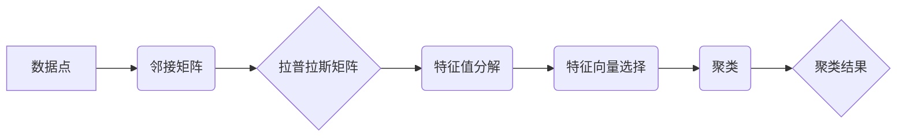

谱聚类, 谱图理论, 邻接矩阵, 拉普拉斯矩阵, 特征值, 特征向量, 聚类算法, 代码实例

## 1. 背景介绍

在机器学习领域，聚类算法是无监督学习的重要组成部分，其目标是将数据点划分为若干个互不相交的簇，使得同一簇中的数据点彼此相似，而不同簇中的数据点彼此差异较大。谱聚类作为一种基于图论的聚类算法，近年来在图像分割、文本挖掘、生物信息学等领域得到了广泛应用。

传统的聚类算法，如k-means，通常基于距离度量来划分数据点。然而，当数据点分布在非凸的形状空间中时，传统的聚类算法往往难以有效地进行聚类。谱聚类算法巧妙地利用了图论的思想，将数据点表示为图的节点，数据点之间的相似度表示为图的边权重，通过对图的拉普拉斯矩阵进行特征值分解，从而获得数据点的低维表示，并基于低维表示进行聚类。

## 2. 核心概念与联系

谱聚类算法的核心概念包括：

* **邻接矩阵**:  邻接矩阵是图的表示形式之一，其中每个元素表示两个节点之间的连接关系。如果两个节点之间存在连接，则对应的矩阵元素为1，否则为0。
* **拉普拉斯矩阵**: 拉普拉斯矩阵是图的度矩阵减去邻接矩阵得到的矩阵，它可以用来描述图的结构信息。
* **特征值和特征向量**: 特征值和特征向量是线性代数中的重要概念，它们可以用来对矩阵进行分解，从而获得矩阵的本质信息。

谱聚类算法的流程可以概括为以下步骤：

1. **构建图**: 将数据点表示为图的节点，数据点之间的相似度表示为图的边权重。
2. **计算拉普拉斯矩阵**: 利用邻接矩阵计算图的拉普拉斯矩阵。
3. **特征值分解**: 对拉普拉斯矩阵进行特征值分解，得到特征值和特征向量。
4. **选择特征向量**: 选择特征值较大的特征向量作为低维表示。
5. **聚类**: 基于低维表示，使用传统的聚类算法，如k-means，进行聚类。



## 3. 核心算法原理 & 具体操作步骤

### 3.1  算法原理概述

谱聚类算法的核心思想是将数据点表示为图的节点，并利用图的拉普拉斯矩阵进行特征值分解，从而获得数据点的低维表示。

拉普拉斯矩阵可以用来描述图的结构信息，其特征值和特征向量可以反映图的局部和全局结构。选择特征值较大的特征向量作为低维表示，可以保留数据点的关键信息，并将其映射到一个低维空间中。

在低维空间中，可以使用传统的聚类算法，如k-means，进行聚类。

### 3.2  算法步骤详解

1. **构建图**: 首先，需要将数据点表示为图的节点，数据点之间的相似度表示为图的边权重。常用的相似度度量方法包括欧氏距离、余弦相似度等。

2. **计算拉普拉斯矩阵**:  拉普拉斯矩阵的计算公式如下：

$$
L = D - W
$$

其中，$D$是度矩阵，$W$是邻接矩阵。度矩阵的元素表示节点的度，即该节点连接的边的数量。

3. **特征值分解**: 对拉普拉斯矩阵进行特征值分解，得到特征值和特征向量。特征值反映了特征向量的重要性，特征值较大的特征向量代表了数据点的关键信息。

4. **选择特征向量**: 选择特征值较大的特征向量作为低维表示。通常选择前k个特征向量，其中k是预先设定的聚类数。

5. **聚类**: 基于低维表示，使用传统的聚类算法，如k-means，进行聚类。

### 3.3  算法优缺点

**优点**:

* 可以有效地处理非凸形状的数据分布。
* 可以利用图论的思想，更好地刻画数据点的结构信息。

**缺点**:

* 计算复杂度较高，尤其是对于大型数据集。
* 需要预先设定聚类数k。

### 3.4  算法应用领域

谱聚类算法在以下领域得到了广泛应用：

* **图像分割**: 将图像分割成若干个互不相交的区域。
* **文本挖掘**: 将文本文档聚类到不同的主题类别。
* **生物信息学**: 将基因表达数据聚类到不同的生物学功能类别。

## 4. 数学模型和公式 & 详细讲解 & 举例说明

### 4.1  数学模型构建

谱聚类算法的核心数学模型是拉普拉斯矩阵。拉普拉斯矩阵可以表示为：

$$
L = D - W
$$

其中：

* $D$ 是度矩阵，是一个对角矩阵，其对角线元素为每个节点的度。
* $W$ 是邻接矩阵，是一个方阵，其元素表示两个节点之间的连接关系。如果两个节点之间存在连接，则对应的矩阵元素为1，否则为0。

### 4.2  公式推导过程

拉普拉斯矩阵的特征值和特征向量可以通过以下公式计算：

$$
L\mathbf{v} = \lambda \mathbf{v}
$$

其中：

* $L$ 是拉普拉斯矩阵。
* $\mathbf{v}$ 是特征向量。
* $\lambda$ 是特征值。

通过求解上述方程组，可以得到拉普拉斯矩阵的特征值和特征向量。

### 4.3  案例分析与讲解

假设我们有一个包含三个节点的图，其邻接矩阵为：

$$
W = \begin{bmatrix}
0 & 1 & 1 \\
1 & 0 & 1 \\
1 & 1 & 0
\end{bmatrix}
$$

其度矩阵为：

$$
D = \begin{bmatrix}
2 & 0 & 0 \\
0 & 2 & 0 \\
0 & 0 & 2
\end{bmatrix}
$$

则拉普拉斯矩阵为：

$$
L = D - W = \begin{bmatrix}
2 & -1 & -1 \\
-1 & 2 & -1 \\
-1 & -1 & 2
\end{bmatrix}
$$

通过对拉普拉斯矩阵进行特征值分解，可以得到其特征值和特征向量。

## 5. 项目实践：代码实例和详细解释说明

### 5.1  开发环境搭建

本项目使用Python语言进行开发，所需的库包括：

* NumPy: 用于数值计算。
* Scikit-learn: 用于机器学习算法的实现。
* Matplotlib: 用于数据可视化。

### 5.2  源代码详细实现

```python
import numpy as np
from sklearn.cluster import SpectralClustering
from sklearn.datasets import make_blobs
import matplotlib.pyplot as plt

# 生成样本数据
X, y_true = make_blobs(n_samples=300, centers=4, random_state=0)

# 计算邻接矩阵
connectivity = np.zeros((X.shape[0], X.shape[0]))
for i in range(X.shape[0]):
    for j in range(i + 1, X.shape[0]):
        if np.linalg.norm(X[i] - X[j]) < 0.5:
            connectivity[i, j] = 1
            connectivity[j, i] = 1

# 计算拉普拉斯矩阵
degree_matrix = np.diag(np.sum(connectivity, axis=1))
laplacian_matrix = degree_matrix - connectivity

# 特征值分解
eigenvalues, eigenvectors = np.linalg.eigh(laplacian_matrix)

# 选择前k个特征向量
k = 2
selected_eigenvectors = eigenvectors[:, :k]

# 进行谱聚类
spectral_clustering = SpectralClustering(n_clusters=4, affinity='nearest_neighbors')
spectral_clustering.fit(selected_eigenvectors)
y_pred = spectral_clustering.labels_

# 可视化结果
plt.scatter(X[:, 0], X[:, 1], c=y_pred, cmap='viridis')
plt.title('Spectral Clustering')
plt.show()
```

### 5.3  代码解读与分析

1. **数据生成**: 使用`make_blobs`函数生成包含4个簇的样本数据。

2. **邻接矩阵计算**: 根据样本数据之间的距离，计算邻接矩阵。

3. **拉普拉斯矩阵计算**: 利用度矩阵和邻接矩阵计算拉普拉斯矩阵。

4. **特征值分解**: 对拉普拉斯矩阵进行特征值分解，得到特征值和特征向量。

5. **特征向量选择**: 选择前k个特征向量作为低维表示。

6. **谱聚类**: 使用`SpectralClustering`类进行谱聚类，并将聚类结果存储在`y_pred`变量中。

7. **可视化结果**: 使用`matplotlib`库可视化聚类结果。

### 5.4  运行结果展示

运行上述代码后，会生成一个包含4个簇的聚类结果图。

## 6. 实际应用场景

谱聚类算法在许多实际应用场景中都取得了很好的效果，例如：

* **图像分割**: 谱聚类可以将图像分割成不同的区域，例如分割前景和背景、分割不同类型的物体等。
* **文本挖掘**: 谱聚类可以将文本文档聚类到不同的主题类别，例如新闻分类、文档聚类等。
* **生物信息学**: 谱聚类可以将基因表达数据聚类到不同的生物学功能类别，例如基因功能预测、疾病诊断等。

### 6.4  未来应用展望

随着机器学习技术的不断发展，谱聚类算法的应用场景将会更加广泛。例如，可以将谱聚类与其他机器学习算法结合，例如深度学习，以提高聚类效果。

## 7. 工具和资源推荐

### 7.1  学习资源推荐

* **书籍**:
    * "Spectral Clustering: A Tutorial" by Ng, Jordan, and Weiss
    * "Pattern Recognition and Machine Learning" by Christopher Bishop
* **在线课程**:
    * Coursera: "Machine Learning" by Andrew Ng
    * edX: "Introduction to Machine Learning" by Columbia University

### 7.2  开发工具推荐

* **Python**: 
    * NumPy
    * Scikit-learn
    * Matplotlib

### 7.3  相关论文推荐

* "Spectral Clustering: Algorithm and Applications" by Ng, Jordan, and Weiss
* "A Tutorial on Spectral Clustering" by Von Luxburg

## 8. 总结：未来发展趋势与挑战

### 8.1  研究成果总结

谱聚类算法是一种有效的聚类算法，它可以有效地处理非凸形状的数据分布，并利用图论的思想更好地刻画数据点的结构信息。

### 8.2  未来发展趋势

未来，谱聚类算法的研究方向将包括：

* **提高算法效率**: 对于大型数据集，谱聚类算法的计算复杂度较高，因此需要研究更高效的算法实现。
* **结合其他机器学习算法**: 将谱聚类与其他机器学习算法结合，例如深度学习，以提高聚类效果。
* **应用于新的领域**: 将谱聚类应用于新的领域，例如自然语言处理、计算机视觉等。

### 8.3  面临的挑战

谱聚类算法也面临一些挑战，例如：

* **聚类数的设定**: 需要预先设定聚类数k，这对于实际应用中往往难以确定。
* **