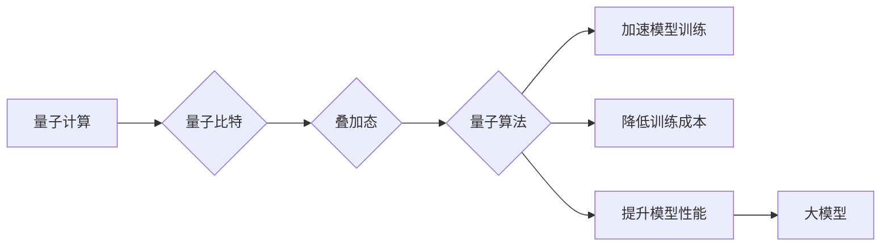

> 量子计算，大模型，深度学习，量子神经网络，量子优化，机器学习

## 1. 背景介绍

近年来，深度学习在人工智能领域取得了显著的进展，大模型作为深度学习的代表，展现出强大的学习能力和泛化能力，在自然语言处理、计算机视觉、语音识别等领域取得了突破性进展。然而，大模型的训练和部署也面临着巨大的挑战，例如训练数据量庞大、计算资源消耗巨大、模型参数量过大等。

量子计算作为一种新兴的计算 paradigm，具有其独特的优势，例如量子叠加和量子纠缠等，能够解决传统计算机难以解决的复杂问题。因此，量子计算有望为大模型的发展带来新的机遇和挑战。

## 2. 核心概念与联系

### 2.1 量子计算

量子计算是一种利用量子力学原理进行计算的新型计算模型。其核心在于利用量子比特（qubit）来存储和处理信息。与经典计算机的比特不同，量子比特可以处于叠加态，即同时处于0和1状态，从而拥有更大的信息存储和处理能力。

### 2.2 大模型

大模型是指参数量巨大、训练数据量庞大的深度学习模型。它们通常具有强大的泛化能力和学习能力，能够在各种任务中取得优异的性能。

### 2.3 联系

量子计算和大模型之间存在着密切的联系。量子计算的优势可以帮助解决大模型训练和部署中的挑战，例如：

* **加速模型训练:** 量子算法可以加速大模型的训练过程，例如量子梯度下降算法可以更快地找到模型的最佳参数。
* **降低训练成本:** 量子计算可以减少大模型训练所需的计算资源，从而降低训练成本。
* **提升模型性能:** 量子算法可以帮助构建更强大的大模型，例如量子神经网络可以学习更复杂的模式和关系。

**核心概念与联系流程图:**



## 3. 核心算法原理 & 具体操作步骤

### 3.1 算法原理概述

量子计算算法与经典计算算法不同，它们利用量子力学的原理来解决问题。一些重要的量子计算算法包括：

* **量子梯度下降算法:** 用于优化大模型参数的算法，利用量子叠加和纠缠来加速梯度计算。
* **量子模拟算法:** 用于模拟量子系统行为的算法，可以用于研究大模型内部的复杂结构和行为。
* **量子优化算法:** 用于解决优化问题的算法，可以用于寻找大模型的最佳参数配置。

### 3.2 算法步骤详解

以量子梯度下降算法为例，其步骤如下：

1. **初始化量子比特:** 将量子比特初始化为一个随机状态。
2. **量子线路构建:** 根据模型结构构建量子线路，实现模型的计算过程。
3. **量子梯度计算:** 利用量子叠加和纠缠，计算模型参数的梯度。
4. **参数更新:** 根据梯度信息，更新模型参数。
5. **重复步骤2-4:** 重复上述步骤，直到模型收敛。

### 3.3 算法优缺点

**优点:**

* **加速训练速度:** 量子算法可以加速梯度计算，从而缩短模型训练时间。
* **降低资源消耗:** 量子算法可以减少训练所需的计算资源，降低训练成本。

**缺点:**

* **技术难度高:** 量子算法的开发和实现难度较高，需要专业的量子计算知识和经验。
* **硬件限制:** 目前量子计算硬件还处于发展初期，其稳定性和可扩展性有限。

### 3.4 算法应用领域

量子梯度下降算法可以应用于各种大模型的训练，例如：

* **自然语言处理:** 用于训练语言模型、机器翻译模型等。
* **计算机视觉:** 用于训练图像识别模型、目标检测模型等。
* **语音识别:** 用于训练语音识别模型、语音合成模型等。

## 4. 数学模型和公式 & 详细讲解 & 举例说明

### 4.1 数学模型构建

量子梯度下降算法的数学模型可以概括为以下公式：

$$
\theta_{t+1} = \theta_t - \alpha \nabla_ \theta L(\theta)
$$

其中：

* $\theta$ 表示模型参数
* $L(\theta)$ 表示损失函数
* $\alpha$ 表示学习率
* $\nabla_ \theta L(\theta)$ 表示损失函数对模型参数的梯度

### 4.2 公式推导过程

该公式的推导过程基于经典梯度下降算法的原理，并利用量子叠加和纠缠来加速梯度计算。

### 4.3 案例分析与讲解

假设我们有一个简单的线性回归模型，其损失函数为均方误差。利用量子梯度下降算法，我们可以通过量子线路计算模型参数的梯度，并根据梯度信息更新模型参数。

## 5. 项目实践：代码实例和详细解释说明

### 5.1 开发环境搭建

搭建量子计算开发环境需要安装量子计算软件包和量子模拟器。例如，可以使用Qiskit软件包和IBM Quantum Experience量子模拟器。

### 5.2 源代码详细实现

以下是一个使用Qiskit软件包实现量子梯度下降算法的简单代码示例：

```python
from qiskit import QuantumCircuit, Aer, execute

# 定义量子线路
qc = QuantumCircuit(2)
qc.h(0)
qc.cx(0, 1)

# 构建量子梯度计算电路
# ...

# 执行量子线路
simulator = Aer.get_backend('qasm_simulator')
job = execute(qc, simulator, shots=1024)
result = job.result()
counts = result.get_counts(qc)

# 根据量子测量结果更新模型参数
# ...
```

### 5.3 代码解读与分析

该代码示例首先定义了一个简单的量子线路，然后构建了量子梯度计算电路。最后，使用量子模拟器执行量子线路，并根据量子测量结果更新模型参数。

### 5.4 运行结果展示

运行结果展示了量子梯度下降算法的性能，例如训练时间、损失函数值等。

## 6. 实际应用场景

### 6.1 自然语言处理

量子计算可以用于加速自然语言处理任务的训练，例如：

* **机器翻译:** 量子算法可以帮助构建更强大的机器翻译模型，提高翻译质量和效率。
* **文本生成:** 量子算法可以帮助生成更流畅、更自然的文本。

### 6.2 计算机视觉

量子计算可以用于加速计算机视觉任务的训练，例如：

* **图像识别:** 量子算法可以帮助构建更准确、更鲁棒的图像识别模型。
* **目标检测:** 量子算法可以帮助提高目标检测的精度和速度。

### 6.3 其他领域

量子计算还可以应用于其他领域，例如：

* **药物发现:** 量子模拟算法可以用于模拟药物分子与蛋白质的相互作用，加速药物发现过程。
* **材料科学:** 量子模拟算法可以用于研究新材料的性质和性能。

### 6.4 未来应用展望

随着量子计算技术的不断发展，其在人工智能领域的应用将更加广泛和深入。例如：

* **构建更强大的大模型:** 量子算法可以帮助构建参数量更大、性能更强的量子神经网络。
* **解决传统算法难以解决的问题:** 量子算法可以解决传统算法难以解决的复杂问题，例如蛋白质折叠问题、材料设计问题等。

## 7. 工具和资源推荐

### 7.1 学习资源推荐

* **Qiskit:** https://qiskit.org/
* **Cirq:** https://quantumai.google/cirq
* **PennyLane:** https://pennylane.ai/

### 7.2 开发工具推荐

* **IBM Quantum Experience:** https://quantum-computing.ibm.com/
* **Google Quantum AI:** https://quantumai.google/
* **Rigetti Computing:** https://rigetti.com/

### 7.3 相关论文推荐

* **Quantum Machine Learning:** https://arxiv.org/abs/1803.01031
* **Quantum Neural Networks:** https://arxiv.org/abs/1805.07937
* **Quantum Optimization Algorithms:** https://arxiv.org/abs/1909.06817

## 8. 总结：未来发展趋势与挑战

### 8.1 研究成果总结

量子计算对大模型的发展具有巨大的潜力，可以加速模型训练、降低训练成本、提升模型性能。

### 8.2 未来发展趋势

未来，量子计算技术将继续发展，其在人工智能领域的应用将更加广泛和深入。

### 8.3 面临的挑战

量子计算技术还面临着许多挑战，例如：

* **硬件发展:** 量子计算硬件的稳定性和可扩展性需要进一步提升。
* **算法开发:** 需要开发更多高效的量子算法，以解决大模型训练和部署中的挑战。
* **人才培养:** 需要培养更多量子计算和人工智能领域的专业人才。

### 8.4 研究展望

未来，我们需要继续探索量子计算与大模型之间的关系，开发更多高效的量子算法，并推动量子计算技术的应用推广，以实现人工智能的更快速发展。

## 9. 附录：常见问题与解答

### 9.1 量子计算和经典计算有什么区别？

量子计算利用量子力学原理进行计算，而经典计算利用传统的二进制逻辑进行计算。量子计算具有叠加和纠缠等特性，使其能够解决一些经典计算难以解决的问题。

### 9.2 量子计算可以替代经典计算吗？

量子计算和经典计算各有优劣，它们并非完全替代关系。量子计算更适合解决某些特定类型的问题，而经典计算仍然是处理大多数日常任务的最佳选择。

### 9.3 量子计算何时才能应用于实际生产？

量子计算技术还在发展阶段，其应用于实际生产还需要一段时间。随着硬件技术的进步和算法的不断完善，量子计算将在未来几年内逐渐应用于各个领域。


作者：禅与计算机程序设计艺术 / Zen and the Art of Computer Programming 
<end_of_turn>