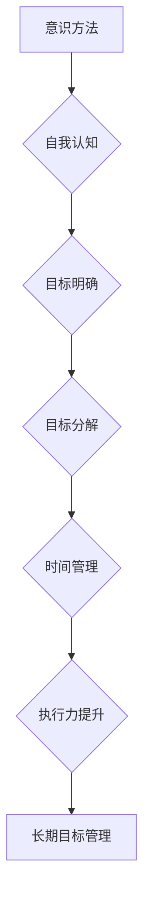

> 长期目标管理，意识方法，目标分解，时间管理，优先级排序，执行力提升，持续改进，自我认知

## 1. 背景介绍

在当今快速变化的科技时代，个人和团队都需要制定清晰的长期目标，并制定有效的策略来实现这些目标。然而，许多人往往在目标设定和执行方面遇到困难，导致目标难以实现，甚至产生挫败感。长期目标管理的意识方法旨在帮助人们克服这些挑战，通过提高自我认知、明确目标、分解任务、优化时间管理和提升执行力，最终实现个人和团队的长期目标。

## 2. 核心概念与联系

### 2.1  意识方法

意识方法的核心在于将注意力集中在当下，并通过清晰的思考和觉察来引导行为。它强调自我认知、目标明确、行动计划和持续改进。

### 2.2  长期目标管理

长期目标管理是指设定远期目标，并制定相应的策略和行动计划，逐步实现这些目标。它需要清晰的愿景、明确的路线图和持续的努力。

### 2.3  目标分解

目标分解是指将一个大型、复杂的长期目标分解成多个小目标，每个小目标都相对独立且易于实现。通过分解目标，可以降低心理压力，提高执行效率。

### 2.4  时间管理

时间管理是指有效地规划和利用时间，以完成既定的目标。它包括优先级排序、时间分配、避免拖延和提高专注力等方面。

### 2.5  执行力提升

执行力是指将计划付诸行动的能力。它需要克服拖延、保持专注、坚持不懈和不断学习改进。

**核心概念联系流程图**



## 3. 核心算法原理 & 具体操作步骤

### 3.1  算法原理概述

长期目标管理的意识方法并非一个严格的算法，而是基于一系列原则和实践，通过不断迭代和改进来实现目标。其核心原理包括：

* **自我认知:** 了解自己的价值观、兴趣、能力和局限性，才能设定真正适合自己的目标。
* **目标设定:** 明确长期目标，并将其分解成可实现的小目标，为行动提供方向。
* **时间管理:** 规划和利用时间，优先完成重要任务，避免拖延和浪费时间。
* **执行力提升:** 克服拖延、保持专注、坚持不懈，将计划付诸行动。
* **持续改进:** 定期回顾目标进展，根据实际情况进行调整，不断优化方法和策略。

### 3.2  算法步骤详解

1. **自我认知:** 花时间反思自己的价值观、兴趣、能力和局限性，确定自己真正想要实现的目标。
2. **设定长期目标:** 明确自己的长期目标，并将其描述成具体的、可衡量的、可实现的、相关的和有时间限制的目标（SMART）。
3. **目标分解:** 将长期目标分解成多个小目标，每个小目标都相对独立且易于实现。
4. **制定行动计划:** 为每个小目标制定具体的行动计划，包括所需资源、时间安排和执行步骤。
5. **时间管理:** 规划和利用时间，优先完成重要任务，避免拖延和浪费时间。可以使用番茄工作法、时间块分配等方法。
6. **执行力提升:** 克服拖延、保持专注、坚持不懈，将计划付诸行动。可以使用任务清单、提醒机制、奖励机制等方法。
7. **持续改进:** 定期回顾目标进展，根据实际情况进行调整，不断优化方法和策略。

### 3.3  算法优缺点

**优点:**

* **灵活性和可定制性:** 意识方法可以根据个人的情况进行调整和定制，使其更适合自己的需求。
* **提高自我认知:** 通过自我反思和目标设定，可以更好地了解自己的价值观、兴趣和能力。
* **增强执行力:** 通过分解目标、制定计划和持续改进，可以提高执行力，将计划付诸行动。
* **持续进步:** 意识方法强调持续改进，可以帮助人们不断提升自我，实现个人成长。

**缺点:**

* **需要自律和毅力:** 意识方法需要个人自律和毅力，才能坚持执行计划和不断改进。
* **缺乏明确的步骤:** 意识方法没有严格的步骤和流程，需要个人根据实际情况进行调整和实践。
* **需要时间和精力:** 自我认知、目标设定和计划制定都需要时间和精力投入。

### 3.4  算法应用领域

长期目标管理的意识方法可以应用于各个领域，包括：

* **个人发展:** 设定个人目标，例如学习新技能、提升健康水平、发展人际关系等。
* **职业发展:** 设定职业目标，例如晋升、创业、改变职业方向等。
* **团队管理:** 帮助团队设定共同目标，并制定相应的行动计划，提高团队协作效率。
* **项目管理:** 帮助项目经理设定项目目标，分解任务，分配资源，并有效地管理项目进度。

## 4. 数学模型和公式 & 详细讲解 & 举例说明

### 4.1  数学模型构建

长期目标管理的意识方法可以抽象为一个数学模型，其中：

* **目标函数:**  表示最终想要达成的目标，例如个人收入、项目完成度、团队满意度等。
* **决策变量:** 表示可以控制的因素，例如时间投入、资源分配、行动策略等。
* **约束条件:** 表示限制目标实现的因素，例如时间限制、预算限制、资源限制等。

### 4.2  公式推导过程

目标函数的优化可以通过以下公式推导：

$$
\text{目标函数} = f(决策变量)
$$

其中，$f$ 是一个函数，它将决策变量映射到目标函数的值。

为了找到最优的决策变量，需要对目标函数进行求导，并找到使目标函数达到最大或最小值的决策变量。

### 4.3  案例分析与讲解

假设一个个人想要提高自己的编程技能，目标函数是编程能力水平，决策变量是每天学习编程的时间，约束条件是每天工作时间和休息时间。

通过分析目标函数和约束条件，可以制定一个学习计划，例如每天学习 2 小时编程，并根据实际情况进行调整。

## 5. 项目实践：代码实例和详细解释说明

### 5.1  开发环境搭建

为了实现长期目标管理的意识方法，可以开发一个简单的应用程序，帮助用户设定目标、分解任务、规划时间和跟踪进度。

开发环境可以根据个人需求选择，例如使用 Python、Java 或 JavaScript 等语言，并选择相应的开发工具和框架。

### 5.2  源代码详细实现

以下是一个使用 Python 实现的简单目标管理应用程序的代码示例：

```python
class Goal:
    def __init__(self, name, description, deadline):
        self.name = name
        self.description = description
        self.deadline = deadline
        self.tasks = []

    def add_task(self, task):
        self.tasks.append(task)

    def display(self):
        print(f"目标名称: {self.name}")
        print(f"目标描述: {self.description}")
        print(f"目标截止日期: {self.deadline}")
        print("任务列表:")
        for task in self.tasks:
            print(f"- {task}")

# 创建一个目标
goal = Goal("学习 Python", "掌握 Python 编程基础", "2024-03-31")

# 添加任务
goal.add_task("学习 Python 语法")
goal.add_task("完成 Python 基础教程")
goal.add_task("开发一个简单的 Python 项目")

# 显示目标信息
goal.display()
```

### 5.3  代码解读与分析

该代码定义了一个 `Goal` 类，用于表示一个目标。每个目标包含名称、描述、截止日期和任务列表。

代码示例演示了如何创建目标对象、添加任务和显示目标信息。

### 5.4  运行结果展示

运行该代码将输出以下信息：

```
目标名称: 学习 Python
目标描述: 掌握 Python 编程基础
目标截止日期: 2024-03-31
任务列表:
- 学习 Python 语法
- 完成 Python 基础教程
- 开发一个简单的 Python 项目
```

## 6. 实际应用场景

### 6.1  个人目标管理

可以使用长期目标管理的意识方法来设定个人目标，例如学习新技能、提升健康水平、发展人际关系等。

### 6.2  职业目标管理

可以使用长期目标管理的意识方法来设定职业目标，例如晋升、创业、改变职业方向等。

### 6.3  团队目标管理

可以使用长期目标管理的意识方法来帮助团队设定共同目标，并制定相应的行动计划，提高团队协作效率。

### 6.4  未来应用展望

随着人工智能和机器学习技术的不断发展，长期目标管理的意识方法将更加智能化和个性化。未来，我们可以期待看到：

* 基于人工智能的个性化目标管理系统，可以根据用户的个人情况和目标设定个性化的计划和建议。
* 机器学习算法可以帮助用户分析目标进展，并提供更精准的反馈和改进建议。
* 虚拟现实和增强现实技术可以为用户提供更沉浸式的目标管理体验。

## 7. 工具和资源推荐

### 7.1  学习资源推荐

* **书籍:**
    * 《Getting Things Done: The Art of Stress-Free Productivity》 by David Allen
    * 《Atomic Habits: An Easy & Proven Way to Build Good Habits & Break Bad Ones》 by James Clear
    * 《The 7 Habits of Highly Effective People》 by Stephen R. Covey
* **在线课程:**
    * Coursera: "Goal Setting and Achievement"
    * Udemy: "Productivity Mastery: How to Get Things Done"
    * Skillshare: "Time Management for Creative Professionals"

### 7.2  开发工具推荐

* **Python:**
    * PyCharm
    * VS Code
* **Java:**
    * IntelliJ IDEA
    * Eclipse
* **JavaScript:**
    * Visual Studio Code
    * WebStorm

### 7.3  相关论文推荐

* **"Goal Setting Theory"** by Edwin A. Locke and Gary P. Latham
* **"The Power of Habit"** by Charles Duhigg
* **"Mindset: The New Psychology of Success"** by Carol S. Dweck

## 8. 总结：未来发展趋势与挑战

### 8.1  研究成果总结

长期目标管理的意识方法已经取得了一定的成果，帮助人们更好地设定目标、规划时间和提升执行力。

### 8.2  未来发展趋势

未来，长期目标管理的意识方法将更加智能化、个性化和自动化。

### 8.3  面临的挑战

长期目标管理的意识方法仍然面临一些挑战，例如：

* **用户粘性:** 帮助用户长期坚持使用目标管理工具和方法。
* **数据隐私:** 保护用户目标和个人信息的隐私安全。
* **算法公平性:** 确保算法公平公正，避免产生偏见。

### 8.4  研究展望

未来研究方向包括：

* 开发更智能、更个性化的目标管理系统。
* 研究不同人群对目标管理方法的偏好和需求。
* 探索人工智能和机器学习在目标管理领域的应用。

## 9. 附录：常见问题与解答

### 9.1  如何设定 SMART 目标？

SMART 目标是指具体 (Specific)、可衡量 (Measurable)、可实现 (Achievable)、相关 (Relevant) 和有时间限制 (Time-bound) 的目标。

* **具体:** 目标应该明确具体是什么，避免模糊或抽象。
* **可衡量:** 目标应该可以量化，以便于跟踪进度和评估结果。
* **可实现:** 目标应该具有可实现性，不要设定过于遥远或不可能达成的目标。
* **相关:** 目标应该与个人价值观、兴趣和长期目标相一致。
*