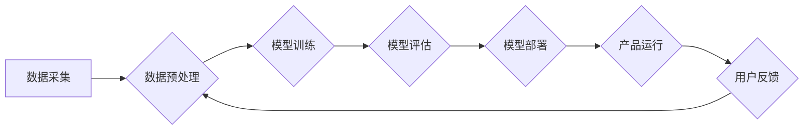

> AI、产品重做、机器学习、深度学习、自然语言处理、计算机视觉、数据驱动

## 1. 背景介绍

当人工智能（AI）技术日新月异，并开始渗透到生活的方方面面时，我们不得不重新审视现有的产品和服务。传统的以人为中心的设计理念逐渐面临挑战，而以数据为驱动，以智能为核心的产品重做势在必行。

过去几十年，软件开发遵循着瀑布式或敏捷开发模式，以人为中心，以功能需求为导向。然而，随着AI技术的崛起，产品重做需要从根本上改变这种思维方式。AI赋予产品全新的感知能力、学习能力和决策能力，使其能够更加智能化、个性化和自适应。

## 2. 核心概念与联系

**2.1 产品重做**

产品重做是指在现有产品基础上，利用新技术和新理念进行全面改造，使其焕然一新，并能够满足新的市场需求和用户期望。

**2.2 AI驱动的产品重做**

AI驱动的产品重做是指利用人工智能技术，例如机器学习、深度学习、自然语言处理和计算机视觉等，对产品进行重构和优化，使其具备更智能、更人性化的体验。

**2.3 数据驱动**

数据驱动是指以数据为基础，通过分析和挖掘数据，来指导产品的设计、开发和运营。AI驱动的产品重做离不开海量数据的支持，数据是AI模型训练和优化不可或缺的燃料。

**2.4 智能化**

智能化是指赋予产品自主学习、决策和执行的能力，使其能够像人类一样思考和行动。AI技术使得产品能够从数据中学习，并根据学习到的知识，自动完成各种任务，例如推荐产品、识别图像、理解自然语言等。

**2.5 个性化**

个性化是指根据用户的需求和偏好，定制化产品体验。AI技术能够分析用户的行为数据和偏好，并根据分析结果，提供个性化的产品推荐、内容定制和服务体验。

**2.6 自适应性**

自适应性是指产品能够根据环境变化和用户反馈，动态调整其行为和功能。AI技术使得产品能够实时监测环境变化和用户反馈，并根据反馈进行调整，从而提供更加流畅和人性化的体验。

**Mermaid 流程图**



## 3. 核心算法原理 & 具体操作步骤

**3.1 算法原理概述**

机器学习算法是AI驱动的产品重做的核心技术之一。机器学习算法能够从数据中学习，并根据学习到的知识，进行预测、分类、聚类等任务。常见的机器学习算法包括：

* **监督学习:** 利用标记数据训练模型，例如分类和回归问题。
* **无监督学习:** 利用未标记数据发现数据中的模式和结构，例如聚类和降维问题。
* **强化学习:** 通过试错学习，让智能体在环境中获得最大奖励。

**3.2 算法步骤详解**

以监督学习为例，其基本步骤如下：

1. **数据收集和预处理:** 收集相关数据，并进行清洗、转换和特征工程等预处理操作。
2. **模型选择:** 根据具体任务选择合适的机器学习算法模型。
3. **模型训练:** 利用标记数据训练模型，调整模型参数，使其能够准确地预测或分类。
4. **模型评估:** 利用测试数据评估模型的性能，例如准确率、召回率、F1-score等。
5. **模型部署:** 将训练好的模型部署到实际应用场景中，用于进行预测或分类。

**3.3 算法优缺点**

**优点:**

* 自动化学习: 机器学习算法能够自动从数据中学习，无需人工编程。
* 适应性强: 机器学习模型能够根据数据变化进行调整，适应不断变化的环境。
* 性能优异: 许多机器学习算法能够达到人类甚至超越人类的性能。

**缺点:**

* 数据依赖: 机器学习算法需要大量的数据进行训练，否则性能会下降。
* 黑盒效应: 一些机器学习算法的内部工作机制难以理解，难以解释其决策结果。
* 计算资源需求: 训练大型机器学习模型需要大量的计算资源。

**3.4 算法应用领域**

机器学习算法广泛应用于各个领域，例如：

* **图像识别:** 人脸识别、物体检测、图像分类等。
* **自然语言处理:** 文本分类、情感分析、机器翻译等。
* **推荐系统:** 产品推荐、内容推荐、个性化广告等。
* **预测分析:** 销售预测、风险评估、故障预测等。

## 4. 数学模型和公式 & 详细讲解 & 举例说明

**4.1 数学模型构建**

机器学习算法通常基于数学模型进行构建。例如，线性回归模型的数学表达式为：

$$y = w_0 + w_1x_1 + w_2x_2 + ... + w_nx_n + \epsilon$$

其中：

* $y$ 是预测值
* $w_0, w_1, w_2, ..., w_n$ 是模型参数
* $x_1, x_2, ..., x_n$ 是输入特征
* $\epsilon$ 是误差项

**4.2 公式推导过程**

机器学习算法的模型参数通常通过优化算法进行调整。例如，梯度下降算法的更新公式为：

$$w_i = w_i - \alpha \frac{\partial Loss}{\partial w_i}$$

其中：

* $w_i$ 是模型参数
* $\alpha$ 是学习率
* $\frac{\partial Loss}{\partial w_i}$ 是损失函数对模型参数的梯度

**4.3 案例分析与讲解**

假设我们想要构建一个预测房价的机器学习模型。我们可以收集房价、面积、位置等数据，并使用线性回归模型进行训练。通过梯度下降算法，我们可以不断调整模型参数，使得模型能够准确地预测房价。

## 5. 项目实践：代码实例和详细解释说明

**5.1 开发环境搭建**

* Python 3.x
* TensorFlow 或 PyTorch
* Jupyter Notebook

**5.2 源代码详细实现**

```python
import tensorflow as tf

# 定义模型
model = tf.keras.Sequential([
    tf.keras.layers.Dense(64, activation='relu', input_shape=(4,)),
    tf.keras.layers.Dense(1)
])

# 编译模型
model.compile(optimizer='adam', loss='mse')

# 训练模型
model.fit(X_train, y_train, epochs=10)

# 评估模型
loss = model.evaluate(X_test, y_test)
print('Loss:', loss)

# 预测房价
new_house = [[100, 2, '市中心', 1]]
predicted_price = model.predict(new_house)
print('Predicted Price:', predicted_price)
```

**5.3 代码解读与分析**

* 我们使用 TensorFlow 库构建了一个简单的线性回归模型。
* 模型包含两个全连接层，第一个层有 64 个神经元，第二个层输出一个值，即预测的房价。
* 我们使用 Adam 优化器和均方误差损失函数进行模型训练。
* 训练完成后，我们使用测试数据评估模型的性能。
* 最后，我们使用训练好的模型预测新房子的价格。

**5.4 运行结果展示**

运行结果将显示模型的训练损失和测试损失，以及对新房子的价格预测。

## 6. 实际应用场景

**6.1 产品推荐**

AI驱动的产品推荐系统能够根据用户的历史购买记录、浏览记录和偏好，推荐更符合用户需求的产品。例如，电商平台的推荐系统、音乐流媒体平台的推荐歌单等。

**6.2 内容个性化**

AI技术能够根据用户的阅读习惯、兴趣爱好和年龄等信息，个性化定制新闻、文章、视频等内容。例如，个性化新闻推送、定制化学习内容等。

**6.3 智能客服**

AI驱动的智能客服能够通过自然语言处理技术，理解用户的咨询需求，并提供自动化的回复和解决方案。例如，在线聊天机器人、语音助手等。

**6.4 自动化决策**

AI技术能够分析大量数据，并根据数据分析结果，进行自动化决策。例如，金融领域的风险评估、医疗领域的疾病诊断等。

**6.5 未来应用展望**

AI驱动的产品重做将继续在各个领域发挥重要作用，例如：

* **更智能的虚拟助手:** 能够理解更复杂的指令，并提供更个性化的服务。
* **更精准的医疗诊断:** 能够辅助医生进行疾病诊断，提高诊断准确率。
* **更安全的交通系统:** 能够实现自动驾驶，提高交通安全。
* **更个性化的教育体验:** 能够根据学生的学习进度和能力，提供个性化的学习内容和辅导。

## 7. 工具和资源推荐

**7.1 学习资源推荐**

* **在线课程:** Coursera、edX、Udacity 等平台提供丰富的AI课程。
* **书籍:** 《深度学习》、《机器学习实战》等书籍。
* **开源项目:** TensorFlow、PyTorch、Scikit-learn 等开源项目。

**7.2 开发工具推荐**

* **Python:** 作为AI开发的主要编程语言。
* **TensorFlow:** 深度学习框架。
* **PyTorch:** 深度学习框架。
* **Jupyter Notebook:** 用于代码编写和可视化分析的工具。

**7.3 相关论文推荐**

* **《ImageNet Classification with Deep Convolutional Neural Networks》**
* **《Attention Is All You Need》**
* **《BERT: Pre-training of Deep Bidirectional Transformers for Language Understanding》**

## 8. 总结：未来发展趋势与挑战

**8.1 研究成果总结**

AI技术在过去几年取得了长足的进步，在图像识别、自然语言处理、语音识别等领域取得了突破性进展。AI驱动的产品重做正在改变着我们生活的方方面面，为我们带来了更加智能、便捷、个性化的体验。

**8.2 未来发展趋势**

* **更强大的AI模型:** 研究人员将继续开发更强大的AI模型，例如通用人工智能（AGI）。
* **更广泛的应用场景:** AI技术将应用于更多领域，例如医疗、教育、金融等。
* **更注重伦理和安全:** 随着AI技术的应用越来越广泛，伦理和安全问题将更加重要。

**8.3 面临的挑战**

* **数据获取和隐私保护:** AI模型需要大量的数据进行训练，如何获取高质量的数据，并保护用户隐私是一个挑战。
* **算法可解释性和公平性:** 一些AI算法的决策过程难以理解，如何保证算法的公平性和透明性是一个挑战。
* **人才短缺:** AI领域人才短缺是一个普遍问题，需要加强人才培养和引进。

**8.4 研究展望**

未来，AI技术将继续发展，并对我们的生活产生更深远的影响。我们需要积极探索AI技术的应用，并解决AI技术带来的挑战，以确保AI技术能够造福人类。

## 9. 附录：常见问题与解答

**9.1 如何选择合适的机器学习算法？**

选择合适的机器学习算法取决于具体的任务和数据特点。例如，对于分类问题，可以考虑使用逻辑回归、支持向量机或决策树等算法；对于回归问题，可以考虑使用线性回归、支持向量回归或神经网络等算法。

**9.2 如何评估机器学习模型的性能？**

常用的机器学习模型性能评估指标包括准确率、召回率、F1-score、AUC等。选择合适的评估指标取决于具体的任务和数据特点。

**9.3 如何解决机器学习模型的过拟合问题？**

过拟合是指机器学习模型在训练数据上表现很好，但在测试数据上表现较差。解决过拟合问题的方法包括：

* 减少模型复杂度
* 增加训练数据量
* 使用正则化技术