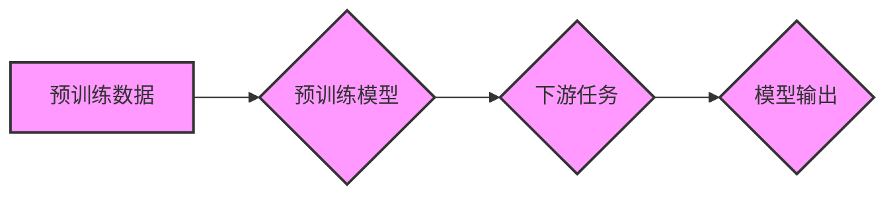

> 预训练模型，幻觉，数据选择，数据质量，模型训练，迁移学习，自然语言处理，计算机视觉

## 1. 背景介绍

近年来，深度学习在人工智能领域取得了突破性的进展，预训练模型作为其重要组成部分，在自然语言处理、计算机视觉等领域展现出强大的能力。预训练模型通过在海量数据上进行预训练，学习到丰富的语义和结构知识，为下游任务提供强大的基础。然而，预训练模型的性能也heavily依赖于训练数据的质量。

数据是深度学习模型的基石，高质量的数据可以帮助模型学习更准确、更可靠的知识，而低质量的数据则可能导致模型出现偏差、错误甚至“幻觉”。

## 2. 核心概念与联系

**2.1 预训练模型**

预训练模型是指在未标记数据上进行训练的深度学习模型。通过预训练，模型学习到通用的语言表示或视觉特征，为后续下游任务提供强大的基础。

**2.2 幻觉**

在深度学习领域，“幻觉”是指模型在处理输入数据时，生成不符合实际情况的输出结果。例如，在图像识别任务中，模型可能将一只猫识别为一只狗，或者在文本生成任务中，模型可能生成毫无逻辑的句子。

**2.3 数据选择与幻觉的关系**

预训练模型的训练数据直接影响模型的性能和泛化能力。如果训练数据存在偏差、错误或噪声，模型很可能会学习到这些错误信息，从而导致“幻觉”。

**2.4 数据质量与模型训练**

数据质量是模型训练的关键因素。高质量的数据应具备以下特点：

* **准确性:** 数据信息准确无误。
* **完整性:** 数据涵盖所有必要的方面。
* **一致性:** 数据格式和结构一致。
* **代表性:** 数据能够代表真实世界。

**2.5 迁移学习**

迁移学习是指利用预训练模型在源任务上的知识，迁移到目标任务上的学习方法。预训练模型的知识迁移能力依赖于预训练数据质量。

**Mermaid 流程图**



## 3. 核心算法原理 & 具体操作步骤

### 3.1  算法原理概述

预训练模型的训练主要基于自监督学习和迁移学习的原理。

* **自监督学习:** 在未标记数据上，通过设计特定的任务，例如语言建模、图像分类等，让模型学习到数据的内在规律和特征表示。
* **迁移学习:** 利用预训练模型在源任务上的知识，迁移到目标任务上进行训练，从而提高目标任务的性能。

### 3.2  算法步骤详解

1. **数据预处理:** 对训练数据进行清洗、格式化、编码等预处理操作，使其符合模型的输入要求。
2. **模型选择:** 选择合适的预训练模型架构，例如BERT、GPT、ResNet等。
3. **预训练:** 在海量未标记数据上进行预训练，学习到通用的语言表示或视觉特征。
4. **微调:** 将预训练模型迁移到目标任务上，对模型参数进行微调，使其适应目标任务的数据分布和需求。
5. **评估:** 使用测试数据评估模型的性能，并根据评估结果进行模型优化和调整。

### 3.3  算法优缺点

**优点:**

* **提高效率:** 利用预训练模型可以显著减少模型训练时间和资源消耗。
* **提升性能:** 预训练模型在许多任务上都表现出优于从头训练模型的性能。
* **降低数据需求:** 预训练模型可以有效利用少量标记数据，降低数据标注成本。

**缺点:**

* **数据偏差:** 预训练模型的性能受训练数据质量影响，如果训练数据存在偏差，模型可能会学习到错误信息。
* **模型复杂度:** 预训练模型通常比较复杂，需要较高的计算资源进行训练和部署。
* **可解释性:** 预训练模型的决策过程比较复杂，难以解释模型的输出结果。

### 3.4  算法应用领域

预训练模型在自然语言处理、计算机视觉、语音识别、机器翻译等多个领域都有广泛的应用。

## 4. 数学模型和公式 & 详细讲解 & 举例说明

### 4.1  数学模型构建

预训练模型的训练通常基于最大似然估计 (Maximum Likelihood Estimation,MLE) 或交叉熵损失函数 (Cross-Entropy Loss Function)。

**最大似然估计:**

MLE的目标是找到模型参数，使得模型在训练数据上的概率最大化。

**交叉熵损失函数:**

交叉熵损失函数用于衡量模型预测结果与真实标签之间的差异。

### 4.2  公式推导过程

**最大似然估计公式:**

$$
\theta = \arg \max_ \theta \prod_{i=1}^{N} p(x_i; \theta)
$$

其中：

* $\theta$ 是模型参数
* $x_i$ 是训练数据中的第 $i$ 个样本
* $p(x_i; \theta)$ 是模型在参数 $\theta$ 下预测样本 $x_i$ 的概率

**交叉熵损失函数公式:**

$$
L = -\frac{1}{N} \sum_{i=1}^{N} \sum_{j=1}^{C} y_{ij} \log p_{ij}
$$

其中：

* $N$ 是训练数据的大小
* $C$ 是类别数
* $y_{ij}$ 是真实标签，如果样本 $i$ 属于类别 $j$，则 $y_{ij} = 1$，否则 $y_{ij} = 0$
* $p_{ij}$ 是模型预测样本 $i$ 属于类别 $j$ 的概率

### 4.3  案例分析与讲解

**案例:**

假设我们有一个图像分类任务，目标是将图像分类为猫或狗。

**分析:**

我们可以使用预训练的图像分类模型，例如ResNet，将其微调到我们的任务上。

**讲解:**

预训练模型ResNet在ImageNet数据集上进行了预训练，学习到丰富的图像特征。

我们只需要使用少量猫狗图像进行微调，就可以让模型在猫狗分类任务上表现良好。

## 5. 项目实践：代码实例和详细解释说明

### 5.1  开发环境搭建

* Python 3.7+
* PyTorch 1.7+
* CUDA 10.2+

### 5.2  源代码详细实现

```python
import torch
import torch.nn as nn
from torchvision import models

# 加载预训练模型
model = models.resnet18(pretrained=True)

# 修改模型输出层
num_ftrs = model.fc.in_features
model.fc = nn.Linear(num_ftrs, 2)

# 定义损失函数和优化器
criterion = nn.CrossEntropyLoss()
optimizer = torch.optim.Adam(model.parameters(), lr=0.001)

# 训练模型
for epoch in range(10):
    # 训练数据迭代
    for images, labels in train_loader:
        # 前向传播
        outputs = model(images)
        loss = criterion(outputs, labels)

        # 反向传播
        optimizer.zero_grad()
        loss.backward()

        # 更新参数
        optimizer.step()

# 保存模型
torch.save(model.state_dict(), 'cat_dog_model.pth')
```

### 5.3  代码解读与分析

* 代码首先加载预训练的ResNet模型，并修改其输出层，使其能够输出猫和狗的分类结果。
* 然后定义损失函数和优化器，并进行模型训练。
* 训练过程中，模型会迭代训练数据，并根据损失函数的值更新模型参数。
* 最后，将训练好的模型保存为文件。

### 5.4  运行结果展示

训练完成后，我们可以使用训练好的模型对新的图像进行分类。

## 6. 实际应用场景

预训练模型在许多实际应用场景中发挥着重要作用，例如：

* **自然语言处理:**

    * 文本分类
    * 情感分析
    * 机器翻译
    * 文本生成

* **计算机视觉:**

    * 图像分类
    * 物体检测
    * 图像分割
    * 人脸识别

* **语音识别:**

    * 语音转文本
    * 语音助手

## 6.4  未来应用展望

预训练模型的发展趋势是朝着更强大、更通用、更安全的方向发展。

* **更大的模型规模:** 预训练模型的规模将会不断扩大，从而学习到更丰富的知识和更复杂的模式。
* **更广泛的数据类型:** 预训练模型将能够处理更多类型的数据，例如文本、图像、音频、视频等。
* **更强的泛化能力:** 预训练模型的泛化能力将会进一步提升，能够更好地适应新的任务和数据分布。
* **更安全的模型训练:** 预训练模型的训练过程将会更加安全可靠，能够避免模型学习到有害信息。

## 7. 工具和资源推荐

### 7.1  学习资源推荐

* **书籍:**

    * Deep Learning by Ian Goodfellow, Yoshua Bengio, and Aaron Courville
    * Natural Language Processing with PyTorch by Yoav Goldberg

* **在线课程:**

    * Stanford CS231n: Convolutional Neural Networks for Visual Recognition
    * Deep Learning Specialization by Andrew Ng

### 7.2  开发工具推荐

* **PyTorch:** 深度学习框架
* **TensorFlow:** 深度学习框架
* **Hugging Face Transformers:** 预训练模型库

### 7.3  相关论文推荐

* BERT: Pre-training of Deep Bidirectional Transformers for Language Understanding
* GPT-3: Language Models are Few-Shot Learners
* ResNet: Deep Residual Learning for Image Recognition

## 8. 总结：未来发展趋势与挑战

### 8.1  研究成果总结

预训练模型在人工智能领域取得了显著的进展，为许多任务带来了性能提升。

### 8.2  未来发展趋势

预训练模型的发展趋势是朝着更强大、更通用、更安全的方向发展。

### 8.3  面临的挑战

* **数据偏差:** 预训练模型的性能受训练数据质量影响，如何解决数据偏差问题是一个重要的挑战。
* **模型复杂度:** 预训练模型的复杂度越来越高，训练和部署成本也越来越高。
* **可解释性:** 预训练模型的决策过程比较复杂，难以解释模型的输出结果。

### 8.4  研究展望

未来研究方向包括：

* 开发更 robust 和更安全的预训练模型
* 探索新的预训练方法和数据类型
* 提高预训练模型的可解释性


## 9. 附录：常见问题与解答

**常见问题:**

* **预训练模型的训练数据是什么？**

预训练模型的训练数据通常是公开可用的大规模数据集，例如ImageNet、Wikipedia、Common Crawl等。

* **如何选择合适的预训练模型？**

选择合适的预训练模型需要根据具体的任务和数据特点进行选择。

* **如何微调预训练模型？**

微调预训练模型需要使用少量标记数据，并调整模型的学习率和训练 epochs 等参数。

**作者：禅与计算机程序设计艺术 / Zen and the Art of Computer Programming**<end_of_turn>