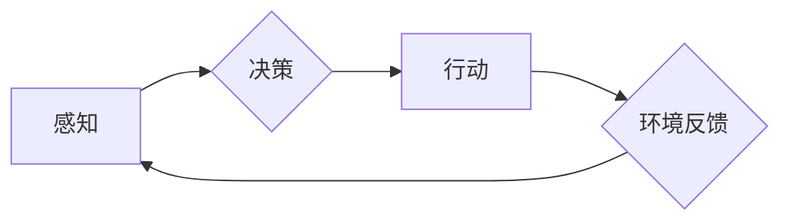

> AI Agent, 智能代理, 强化学习, 自然语言处理, 机器学习, 决策优化, 自动化

## 1. 背景介绍

人工智能（AI）技术近年来发展迅速，从语音识别、图像识别到自然语言处理等领域取得了突破性进展。然而，传统的AI模型大多局限于特定的任务，缺乏灵活性和泛化能力。 

智能代理（AI Agent）作为AI领域的新兴方向，旨在构建能够自主学习、决策和执行任务的智能实体。与传统的AI模型不同，AI Agent具有以下特点：

* **自主性:** AI Agent能够独立感知环境、制定计划并执行行动，无需人工干预。
* **学习能力:** AI Agent能够通过与环境交互学习，不断提升其决策和执行能力。
* **适应性:** AI Agent能够根据环境变化调整其策略，并适应新的挑战。

## 2. 核心概念与联系

AI Agent的核心概念是将智能体抽象为一个代理，该代理与环境交互，并通过感知、决策和行动来实现目标。

**AI Agent的架构**



**AI Agent与其他AI技术的联系**

* **机器学习:** AI Agent通常利用机器学习算法来学习环境和制定策略。
* **深度学习:** 深度学习算法可以帮助AI Agent从复杂的数据中提取特征，提高其决策能力。
* **强化学习:** 强化学习是AI Agent学习的关键技术，它通过奖励机制引导AI Agent学习最优策略。
* **自然语言处理:** 自然语言处理技术可以帮助AI Agent理解和生成人类语言，从而与人类进行更自然的交互。

## 3. 核心算法原理 & 具体操作步骤

### 3.1  算法原理概述

强化学习（Reinforcement Learning，RL）是训练AI Agent的核心算法。RL算法通过奖励机制来引导AI Agent学习最优策略。

在RL算法中，AI Agent是一个决策者，环境是一个状态空间，每个状态都有一个对应的奖励值。AI Agent的目标是找到一个策略，使得在与环境交互的过程中获得最大的总奖励。

### 3.2  算法步骤详解

1. **环境初始化:** 设置初始状态和奖励函数。
2. **状态感知:** AI Agent感知当前环境状态。
3. **策略选择:** 根据当前状态和策略，AI Agent选择一个行动。
4. **环境反馈:** AI Agent执行行动后，环境会反馈新的状态和奖励值。
5. **价值更新:** AI Agent根据奖励值更新其策略，使得未来获得更高的奖励。
6. **重复步骤2-5:** AI Agent不断与环境交互，学习和更新其策略，直到达到目标或终止条件。

### 3.3  算法优缺点

**优点:**

* **能够学习复杂的任务:** RL算法可以学习解决复杂的任务，例如游戏、机器人控制等。
* **适应性强:** RL算法可以根据环境变化调整策略，适应新的挑战。
* **无需明确的规则:** RL算法不需要事先定义明确的规则，可以从经验中学习。

**缺点:**

* **训练时间长:** RL算法的训练时间通常较长，需要大量的样本数据和计算资源。
* **奖励设计困难:** 设计合适的奖励函数是RL算法的关键，奖励函数的设计不当会导致AI Agent学习到不期望的行为。
* **局部最优解:** RL算法可能陷入局部最优解，无法找到全局最优解。

### 3.4  算法应用领域

* **游戏:** AI Agent可以学习玩游戏，例如围棋、Go、Dota 2等。
* **机器人控制:** AI Agent可以控制机器人执行任务，例如导航、抓取、组装等。
* **自动驾驶:** AI Agent可以帮助自动驾驶汽车感知环境、做出决策并控制车辆。
* **医疗保健:** AI Agent可以辅助医生诊断疾病、制定治疗方案等。

## 4. 数学模型和公式 & 详细讲解 & 举例说明

### 4.1  数学模型构建

强化学习的数学模型主要包括状态空间、动作空间、奖励函数和价值函数。

* **状态空间:** 环境可能存在的全部状态集合。
* **动作空间:** AI Agent在每个状态下可以执行的动作集合。
* **奖励函数:** 将状态和动作映射到奖励值，奖励值表示AI Agent在该状态执行该动作后的收益。
* **价值函数:** 估计在特定状态下执行特定策略的长期奖励总和。

### 4.2  公式推导过程

**价值函数的更新公式:**

$$
V(s) = \max_{\pi} \sum_{t=0}^{\infty} \gamma^t r(s_t, a_t)
$$

其中:

* $V(s)$ 是状态 $s$ 的价值函数。
* $\pi$ 是策略。
* $r(s_t, a_t)$ 是在状态 $s_t$ 执行动作 $a_t$ 后获得的奖励。
* $\gamma$ 是折扣因子，控制未来奖励的权重。

**策略梯度算法:**

$$
\theta = \theta + \alpha \nabla_{\theta} J(\theta)
$$

其中:

* $\theta$ 是策略参数。
* $\alpha$ 是学习率。
* $J(\theta)$ 是策略的效用函数。

### 4.3  案例分析与讲解

**案例:** 训练一个AI Agent玩游戏“贪吃蛇”。

* **状态空间:** 游戏地图上的蛇的位置和食物的位置。
* **动作空间:** 蛇可以向四个方向移动。
* **奖励函数:** 当蛇吃掉食物时获得奖励，当蛇撞到墙壁或自身时惩罚。
* **价值函数:** 估计在特定状态下执行特定策略的最终得分。

通过强化学习算法，AI Agent可以学习到最优策略，使得在游戏中获得最高得分。

## 5. 项目实践：代码实例和详细解释说明

### 5.1  开发环境搭建

* Python 3.x
* TensorFlow 或 PyTorch
* OpenAI Gym

### 5.2  源代码详细实现

```python
import gym
import tensorflow as tf

# 定义神经网络模型
model = tf.keras.models.Sequential([
    tf.keras.layers.Dense(128, activation='relu', input_shape=(4,)),
    tf.keras.layers.Dense(64, activation='relu'),
    tf.keras.layers.Dense(4, activation='softmax')
])

# 定义损失函数和优化器
optimizer = tf.keras.optimizers.Adam()
loss_fn = tf.keras.losses.CategoricalCrossentropy()

# 训练循环
for episode in range(1000):
    state = env.reset()
    done = False
    total_reward = 0

    while not done:
        # 选择动作
        action = model.predict(state[None, :])[0]
        # 执行动作
        next_state, reward, done, _ = env.step(np.argmax(action))
        # 更新状态
        state = next_state
        # 更新奖励
        total_reward += reward

    # 更新模型参数
    with tf.GradientTape() as tape:
        # 计算损失
        loss = loss_fn(y_true, y_pred)
    # 计算梯度
    gradients = tape.gradient(loss, model.trainable_variables)
    # 更新参数
    optimizer.apply_gradients(zip(gradients, model.trainable_variables))

    # 打印奖励
    print(f"Episode: {episode}, Total Reward: {total_reward}")
```

### 5.3  代码解读与分析

* 代码首先定义了神经网络模型，该模型用于预测AI Agent在每个状态下执行的动作。
* 然后定义了损失函数和优化器，用于训练神经网络模型。
* 训练循环中，AI Agent与环境交互，根据环境反馈更新模型参数。
* 最后，打印每个episode的总奖励，观察AI Agent的学习进度。

### 5.4  运行结果展示

运行代码后，AI Agent的总奖励会随着训练的进行而逐渐提高，最终能够达到较高的得分。

## 6. 实际应用场景

### 6.1  智能客服

AI Agent可以作为智能客服，通过自然语言处理技术理解用户的需求，并提供相应的帮助。

### 6.2  个性化推荐

AI Agent可以根据用户的行为数据和偏好，推荐个性化的商品、服务或内容。

### 6.3  自动交易

AI Agent可以根据市场数据和交易策略，自动进行股票、期货等金融交易。

### 6.4  未来应用展望

AI Agent的应用场景非常广泛，未来将应用于更多领域，例如：

* **医疗保健:** AI Agent可以辅助医生诊断疾病、制定治疗方案、管理患者健康。
* **教育:** AI Agent可以提供个性化的学习辅导、自动批改作业、评估学生学习进度。
* **交通运输:** AI Agent可以优化交通流量、辅助驾驶、提高交通安全。

## 7. 工具和资源推荐

### 7.1  学习资源推荐

* **书籍:**
    * Reinforcement Learning: An Introduction by Sutton and Barto
    * Deep Reinforcement Learning Hands-On by Maxim Lapan
* **在线课程:**
    * Deep Reinforcement Learning Specialization by DeepLearning.AI
    * Reinforcement Learning by David Silver

### 7.2  开发工具推荐

* **TensorFlow:** 开源深度学习框架
* **PyTorch:** 开源深度学习框架
* **OpenAI Gym:** 强化学习环境库

### 7.3  相关论文推荐

* **Deep Q-Network (DQN):** Mnih et al. (2015)
* **Proximal Policy Optimization (PPO):** Schulman et al. (2017)
* **Trust Region Policy Optimization (TRPO):** Schulman et al. (2015)

## 8. 总结：未来发展趋势与挑战

### 8.1  研究成果总结

近年来，AI Agent领域取得了显著进展，例如：

* **深度强化学习:** 深度学习算法的应用使得AI Agent能够学习解决更复杂的任务。
* **多智能体强化学习:** 研究了多个AI Agent在同一环境中交互学习的策略。
* **迁移学习:** 研究了如何将已学习的知识迁移到新的任务或环境。

### 8.2  未来发展趋势

* **更强大的AI Agent:** 发展更强大的AI Agent，能够学习解决更复杂、更现实世界的问题。
* **更安全可靠的AI Agent:** 研究如何确保AI Agent的安全性和可靠性，避免其产生不可预知的行为。
* **更广泛的应用场景:** 将AI Agent应用于更多领域，例如医疗保健、教育、交通运输等。

### 8.3  面临的挑战

* **数据获取和标注:** 训练AI Agent需要大量的样本数据，获取和标注这些数据成本高昂。
* **算法复杂度:** 强化学习算法的复杂度较高，需要大量的计算资源进行训练。
* **伦理问题:** AI Agent的应用可能引发伦理问题，例如算法偏见、隐私泄露等。

### 8.4  研究展望

未来，AI Agent领域的研究将继续深入，探索更强大的算法、更安全可靠的系统和更广泛的应用场景。


## 9. 附录：常见问题与解答

**Q1: 强化学习和监督学习有什么区别？**

**A1:** 强化学习和监督学习都是机器学习的范式，但它们的区别在于数据类型和学习目标。

* **监督学习:** 使用标记数据进行训练，目标是学习一个能够将输入映射到输出的函数。
* **强化学习:** 使用奖励信号进行训练，目标是学习一个能够使奖励最大化的策略。

**Q2: 如何设计一个合适的奖励函数？**

**A2:** 设计一个合适的奖励函数是强化学习的关键，奖励函数应该能够准确地反映AI Agent的行为目标。

* **明确目标:** 首先明确AI Agent的目标是什么。
* **量化奖励:** 将目标转化为可以量化的奖励信号。
*