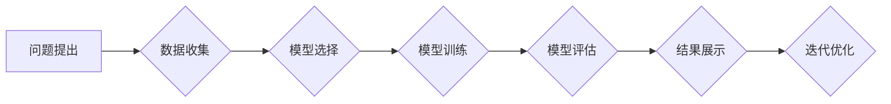

> AI hackathon, 创新, 机器学习, 深度学习, 自然语言处理, 计算机视觉, 算法, 项目实践, 未来趋势

## 1. 背景介绍

在当今科技飞速发展的时代，人工智能（AI）已成为引领未来发展的重要力量。AI hackathon作为一种新型的创新平台，为开发者、研究者和企业提供了展示技术实力、探索新应用场景和推动AI产业发展的绝佳机会。

AI hackathon通常是一个时间有限的竞赛活动，参赛者需要在规定时间内利用AI技术解决特定问题或开发创新应用。这些活动往往围绕着热门的AI领域，例如机器学习、深度学习、自然语言处理和计算机视觉等展开。

近年来，AI hackathon的规模和影响力不断扩大，吸引了来自全球各地的顶尖人才参与其中。这些活动不仅促进了AI技术的快速发展，也为AI产业的创新和应用提供了丰富的案例和经验。

## 2. 核心概念与联系

**2.1 AI Hackathon的本质**

AI hackathon的核心是将AI技术与实际问题相结合，通过团队合作和快速迭代的方式，探索创新解决方案。

**2.2 核心概念**

* **人工智能（AI）：** 指计算机模拟人类智能的行为，例如学习、推理、决策和感知等。
* **机器学习（ML）：** 一种AI技术，通过算法从数据中学习，不断改进预测或分类的准确性。
* **深度学习（DL）：** 一种更高级的机器学习技术，利用多层神经网络模拟人类大脑的学习过程。
* **自然语言处理（NLP）：** 一种AI技术，旨在使计算机能够理解和处理人类语言。
* **计算机视觉（CV）：** 一种AI技术，旨在使计算机能够“看”和理解图像和视频。

**2.3 联系**

AI hackathon将这些核心概念有机地结合在一起，通过挑战性问题和限时竞赛，激发参赛者对AI技术的探索和创新。

**Mermaid 流程图**



## 3. 核心算法原理 & 具体操作步骤

**3.1 算法原理概述**

在AI hackathon中，常用的算法包括机器学习算法、深度学习算法和自然语言处理算法等。这些算法的原理基于统计学、概率论和微积分等数学基础，通过学习数据中的模式和规律，实现对问题的解决。

**3.2 算法步骤详解**

以机器学习算法为例，其基本步骤包括：

1. **数据收集和预处理:** 收集相关数据，并进行清洗、转换和特征工程等预处理操作。
2. **模型选择:** 根据问题的特点和数据的类型，选择合适的机器学习算法模型。
3. **模型训练:** 利用训练数据，训练模型参数，使模型能够学习数据中的模式和规律。
4. **模型评估:** 利用测试数据，评估模型的性能，例如准确率、召回率和F1-score等。
5. **模型优化:** 根据评估结果，调整模型参数或选择其他算法模型，不断优化模型性能。

**3.3 算法优缺点**

不同的算法具有不同的优缺点，需要根据具体问题和数据特点进行选择。例如，线性回归算法简单易用，但对非线性关系的拟合能力较弱；决策树算法能够处理非线性关系，但容易过拟合；支持向量机算法能够处理高维数据，但训练时间较长。

**3.4 算法应用领域**

机器学习算法广泛应用于各个领域，例如：

* **图像识别:** 用于识别物体、场景和人脸等。
* **自然语言处理:** 用于文本分类、情感分析、机器翻译等。
* **推荐系统:** 用于推荐商品、电影、音乐等。
* **预测分析:** 用于预测销售额、股票价格、天气预报等。

## 4. 数学模型和公式 & 详细讲解 & 举例说明

**4.1 数学模型构建**

在AI hackathon中，数学模型是算法的核心，用于描述问题和实现算法的逻辑。例如，线性回归模型可以用以下公式表示：

$$y = mx + c$$

其中，y是预测值，x是输入特征，m是斜率，c是截距。

**4.2 公式推导过程**

线性回归模型的系数m和c可以通过最小二乘法求解，其目标是使预测值与真实值之间的误差最小化。

**4.3 案例分析与讲解**

假设我们有一个数据集，包含房屋面积和房屋价格的信息。我们可以使用线性回归模型来预测房屋价格。

* **输入特征:** 房屋面积
* **输出特征:** 房屋价格

通过训练模型，我们可以得到一个线性方程，例如：

$$y = 2000x + 50000$$

其中，y表示房屋价格，x表示房屋面积。

根据这个方程，我们可以预测不同面积的房屋价格。例如，如果一个房屋面积为100平方米，那么其价格可以预测为：

$$y = 2000 * 100 + 50000 = 250000$$

## 5. 项目实践：代码实例和详细解释说明

**5.1 开发环境搭建**

AI hackathon的项目实践通常需要使用Python编程语言和相关的AI库，例如TensorFlow、PyTorch和Scikit-learn等。

**5.2 源代码详细实现**

以下是一个使用Scikit-learn库实现线性回归模型的代码示例：

```python
from sklearn.linear_model import LinearRegression
from sklearn.model_selection import train_test_split
import numpy as np

# 生成示例数据
X = np.array([[1], [2], [3], [4], [5]])
y = np.array([2, 4, 5, 4, 5])

# 将数据划分为训练集和测试集
X_train, X_test, y_train, y_test = train_test_split(X, y, test_size=0.2, random_state=42)

# 创建线性回归模型
model = LinearRegression()

# 训练模型
model.fit(X_train, y_train)

# 预测测试集数据
y_pred = model.predict(X_test)

# 评估模型性能
print('Coefficients:', model.coef_)
print('Intercept:', model.intercept_)
print('R-squared:', model.score(X_test, y_test))
```

**5.3 代码解读与分析**

这段代码首先生成示例数据，然后将数据划分为训练集和测试集。接着，创建线性回归模型并训练模型。最后，使用训练好的模型预测测试集数据，并评估模型性能。

**5.4 运行结果展示**

运行这段代码后，会输出模型的系数、截距和R-squared值，这些指标可以用来评估模型的性能。

## 6. 实际应用场景

AI hackathon的项目实践成果可以应用于各个领域，例如：

* **医疗保健:** 用于疾病诊断、药物研发和个性化医疗。
* **金融科技:** 用于欺诈检测、风险评估和投资决策。
* **教育科技:** 用于智能辅导、个性化学习和教育资源推荐。
* **智能家居:** 用于语音控制、场景识别和设备自动化。

**6.4 未来应用展望**

随着AI技术的不断发展，AI hackathon将为更多领域带来创新应用，例如：

* **自动驾驶:** 用于车辆感知、决策和控制。
* **机器人技术:** 用于机器人感知、导航和交互。
* **虚拟现实和增强现实:** 用于沉浸式体验和交互式应用。

## 7. 工具和资源推荐

**7.1 学习资源推荐**

* **在线课程:** Coursera、edX、Udacity等平台提供丰富的AI课程。
* **书籍:** 《深度学习》、《机器学习实战》等书籍是AI学习的经典教材。
* **博客和论坛:** Kaggle、Medium、Stack Overflow等平台提供AI相关的博客文章和论坛讨论。

**7.2 开发工具推荐**

* **Python:** 作为AI开发的主要编程语言，Python拥有丰富的AI库和工具。
* **TensorFlow:** Google开发的开源深度学习框架。
* **PyTorch:** Facebook开发的开源深度学习框架。
* **Scikit-learn:** Python机器学习库。

**7.3 相关论文推荐**

* **《ImageNet Classification with Deep Convolutional Neural Networks》**
* **《Attention Is All You Need》**
* **《BERT: Pre-training of Deep Bidirectional Transformers for Language Understanding》**

## 8. 总结：未来发展趋势与挑战

**8.1 研究成果总结**

AI hackathon推动了AI技术的快速发展，涌现出许多创新应用和解决方案。

**8.2 未来发展趋势**

* **边缘计算:** 将AI模型部署到边缘设备，实现更快速的响应和更低的延迟。
* **联邦学习:** 在不共享原始数据的情况下，训练联合模型。
* **可解释AI:** 使AI模型的决策过程更加透明和可理解。

**8.3 面临的挑战**

* **数据获取和隐私保护:** AI模型的训练需要大量数据，如何获取高质量数据并保护用户隐私是一个挑战。
* **算法效率和可扩展性:** 随着模型规模的不断增大，算法效率和可扩展性成为一个瓶颈。
* **伦理和社会影响:** AI技术的应用可能带来伦理和社会问题，需要进行深入的思考和讨论。

**8.4 研究展望**

未来，AI hackathon将继续成为AI技术创新和应用的重要平台，推动AI技术向更智能、更安全、更可持续的方向发展。

## 9. 附录：常见问题与解答

**9.1 如何选择合适的AI算法？**

选择合适的AI算法需要根据具体问题和数据特点进行考虑。例如，对于分类问题，可以考虑使用决策树、支持向量机或神经网络等算法；对于回归问题，可以考虑使用线性回归、逻辑回归或支持向量回归等算法。

**9.2 如何评估AI模型的性能？**

AI模型的性能可以通过多种指标进行评估，例如准确率、召回率、F1-score、AUC等。

**9.3 如何解决AI模型的过拟合问题？**

过拟合是指AI模型对训练数据过拟合，导致在测试数据上的性能下降。解决过拟合问题的方法包括：

* **增加训练数据量**
* **使用正则化技术**
* **使用交叉验证**
* **减少模型复杂度**


作者：禅与计算机程序设计艺术 / Zen and the Art of Computer Programming 
<end_of_turn>