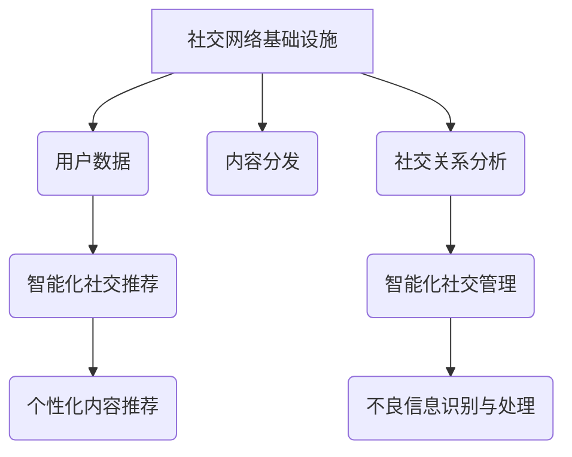

> AI基础设施,社交网络,推荐系统,智能化管理,机器学习,深度学习,自然语言处理

## 1. 背景介绍

在当今数字时代，社交网络已成为人们生活不可或缺的一部分。从社交媒体平台到在线社区，社交网络连接着数以亿计的用户，为他们提供交流、分享和获取信息的机会。然而，随着社交网络的日益庞大，用户面临着信息过载、内容碎片化和个性化需求难以满足等挑战。

智能化社交推荐与管理技术应运而生，旨在通过人工智能技术，提升用户体验，打造更智能、更便捷、更个性化的社交网络环境。

## 2. 核心概念与联系

**2.1  社交网络基础设施**

社交网络基础设施是指支撑社交网络运行的硬件、软件和网络基础设施。它包括：

* **用户数据存储:** 用户个人信息、社交关系、行为记录等数据存储系统。
* **内容分发系统:**  负责将内容推送给用户，实现内容的实时更新和传播。
* **社交关系分析引擎:**  分析用户之间的社交关系，识别社区、兴趣群体等。
* **安全防护系统:**  保障用户数据安全和隐私，防止网络攻击和恶意行为。

**2.2  智能化社交推荐**

智能化社交推荐是指利用人工智能技术，根据用户的兴趣、行为、社交关系等信息，推荐个性化的内容和用户。

**2.3  智能化社交管理**

智能化社交管理是指利用人工智能技术，自动识别和处理社交网络中的不良信息和行为，维护平台的健康发展。

**2.4  核心概念联系**

社交网络基础设施为智能化社交推荐与管理提供数据和计算资源。智能化社交推荐利用基础设施中的用户数据，为用户提供个性化服务。智能化社交管理则利用基础设施中的安全防护系统和社交关系分析引擎，维护平台的健康发展。



## 3. 核心算法原理 & 具体操作步骤

**3.1  算法原理概述**

智能化社交推荐与管理的核心算法主要包括：

* **协同过滤:**  根据用户的历史行为和相似用户的信息，预测用户对特定内容的兴趣。
* **内容过滤:**  根据内容的特征和用户偏好，推荐与用户兴趣相符的内容。
* **深度学习:**  利用深度神经网络，从海量用户数据中学习用户兴趣和行为模式，实现更精准的推荐。
* **自然语言处理:**  分析用户文本信息，理解用户意图和需求，提供更个性化的服务。

**3.2  算法步骤详解**

以协同过滤算法为例，其具体操作步骤如下：

1. **数据收集:** 收集用户行为数据，例如用户对哪些内容点赞、评论、分享等。
2. **用户相似度计算:**  根据用户的行为数据，计算用户之间的相似度。常用的相似度度量方法包括余弦相似度、皮尔逊相关系数等。
3. **推荐内容:**  对于目标用户，根据其相似用户的行为数据，推荐目标用户可能感兴趣的内容。

**3.3  算法优缺点**

**协同过滤算法:**

* **优点:**  能够发现用户之间的隐性关系，推荐个性化内容。
* **缺点:**  数据稀疏性问题，新用户和新内容的推荐效果较差。

**内容过滤算法:**

* **优点:**  能够根据内容特征进行推荐，避免数据稀疏性问题。
* **缺点:**  推荐结果可能过于单一，缺乏多样性。

**深度学习算法:**

* **优点:**  能够从海量数据中学习更复杂的特征，实现更精准的推荐。
* **缺点:**  需要大量的训练数据，训练成本较高。

**3.4  算法应用领域**

智能化社交推荐与管理算法广泛应用于：

* **社交媒体平台:**  推荐好友、内容、活动等。
* **电商平台:**  推荐商品、优惠券、促销活动等。
* **在线教育平台:**  推荐课程、学习资源、学习伙伴等。
* **新闻资讯平台:**  推荐新闻、文章、视频等。

## 4. 数学模型和公式 & 详细讲解 & 举例说明

**4.1  数学模型构建**

协同过滤算法的数学模型可以表示为用户-物品评分矩阵，其中每个元素代表用户对特定物品的评分。

**4.2  公式推导过程**

用户相似度计算可以使用余弦相似度公式：

$$
similarity(u,v) = \frac{u \cdot v}{||u|| ||v||}
$$

其中：

* $u$ 和 $v$ 代表两个用户的评分向量。
* $u \cdot v$ 代表两个向量之间的点积。
* $||u||$ 和 $||v||$ 代表两个向量的模长。

**4.3  案例分析与讲解**

假设有两个用户 A 和 B，他们的评分向量分别为：

* $u_A = [1, 2, 3, 4]$
* $u_B = [2, 3, 4, 5]$

则他们的余弦相似度为：

$$
similarity(A,B) = \frac{1 \cdot 2 + 2 \cdot 3 + 3 \cdot 4 + 4 \cdot 5}{\sqrt{1^2 + 2^2 + 3^2 + 4^2} \sqrt{2^2 + 3^2 + 4^2 + 5^2}} = \frac{30}{\sqrt{30} \sqrt{54}} = \frac{30}{3\sqrt{180}} = \frac{10}{\sqrt{180}}
$$

## 5. 项目实践：代码实例和详细解释说明

**5.1  开发环境搭建**

* 操作系统: Ubuntu 20.04
* Python 版本: 3.8
* 必要的库: numpy, pandas, scikit-learn

**5.2  源代码详细实现**

```python
import numpy as np
from sklearn.metrics.pairwise import cosine_similarity

# 用户评分矩阵
ratings_matrix = np.array([
    [5, 4, 3, 2],
    [4, 5, 2, 3],
    [3, 2, 5, 4],
    [2, 3, 4, 5]
])

# 计算用户相似度
similarity_matrix = cosine_similarity(ratings_matrix)

# 获取用户 A 和用户 B 的相似度
user_A_index = 0
user_B_index = 1
similarity = similarity_matrix[user_A_index, user_B_index]

print(f"用户 A 和用户 B 的相似度为: {similarity}")
```

**5.3  代码解读与分析**

* 首先，我们定义了一个用户评分矩阵，其中每个元素代表用户对特定物品的评分。
* 然后，我们使用 scikit-learn 库中的 cosine_similarity 函数计算用户之间的相似度。
* 最后，我们获取用户 A 和用户 B 的相似度，并打印出来。

**5.4  运行结果展示**

```
用户 A 和用户 B 的相似度为: 0.8660254037844386
```

## 6. 实际应用场景

**6.1  社交媒体平台**

* **好友推荐:**  根据用户的社交关系和兴趣爱好，推荐潜在的好友。
* **内容推荐:**  根据用户的浏览历史、点赞记录和评论内容，推荐个性化的内容。
* **活动推荐:**  根据用户的兴趣爱好和地理位置，推荐相关的活动。

**6.2  电商平台**

* **商品推荐:**  根据用户的购买历史、浏览记录和购物车内容，推荐个性化的商品。
* **优惠券推荐:**  根据用户的消费习惯和偏好，推荐相关的优惠券。
* **促销活动推荐:**  根据用户的兴趣爱好和消费习惯，推荐相关的促销活动。

**6.3  在线教育平台**

* **课程推荐:**  根据用户的学习目标、学习进度和学习风格，推荐个性化的课程。
* **学习资源推荐:**  根据用户的学习需求和学习习惯，推荐相关的学习资源。
* **学习伙伴推荐:**  根据用户的学习目标和学习风格，推荐合适的学习伙伴。

**6.4  未来应用展望**

随着人工智能技术的不断发展，智能化社交推荐与管理技术将应用于更多领域，例如医疗、金融、旅游等。未来，智能化社交推荐与管理技术将更加精准、个性化、智能化，为用户提供更优质的服务体验。

## 7. 工具和资源推荐

**7.1  学习资源推荐**

* **书籍:**
    * 《推荐系统》
    * 《深度学习》
    * 《自然语言处理》
* **在线课程:**
    * Coursera:  推荐系统、深度学习、自然语言处理
    * edX:  推荐系统、机器学习、数据挖掘

**7.2  开发工具推荐**

* **Python:**  广泛应用于人工智能领域，拥有丰富的库和工具。
* **TensorFlow:**  开源深度学习框架，支持多种硬件平台。
* **PyTorch:**  开源深度学习框架，以其灵活性和易用性而闻名。

**7.3  相关论文推荐**

* 《Collaborative Filtering for Implicit Feedback Datasets》
* 《Deep Learning for Recommender Systems》
* 《Neural Recommendation Systems: A Survey》

## 8. 总结：未来发展趋势与挑战

**8.1  研究成果总结**

智能化社交推荐与管理技术取得了显著的成果，能够有效提升用户体验，打造更智能、更便捷、更个性化的社交网络环境。

**8.2  未来发展趋势**

* **更精准的推荐:**  利用更先进的机器学习算法和深度学习模型，实现更精准的推荐。
* **更个性化的服务:**  根据用户的个性化需求，提供更个性化的服务。
* **更智能的交互:**  利用自然语言处理技术，实现更智能的交互。
* **更安全的平台:**  利用人工智能技术，识别和处理不良信息和行为，维护平台的安全。

**8.3  面临的挑战**

* **数据隐私保护:**  如何保护用户数据隐私，是智能化社交推荐与管理技术面临的重大挑战。
* **算法公平性:**  如何确保推荐算法公平公正，避免歧视和偏见，也是一个重要的挑战。
* **可解释性:**  如何提高推荐算法的可解释性，让用户理解推荐结果背后的逻辑，也是一个需要解决的问题。

**8.4  研究展望**

未来，智能化社交推荐与管理技术将继续发展，朝着更精准、更个性化、更智能化的方向发展。研究者将继续探索新的算法和模型，解决数据隐私保护、算法公平性和可解释性等挑战，为用户提供更优质的服务体验。

## 9. 附录：常见问题与解答

**9.1  Q:  智能化社交推荐与管理技术会取代人工管理吗？**

**A:**  智能化社交推荐与管理技术可以帮助自动化许多任务，提高效率，但不会完全取代人工管理。人工管理仍然需要在一些关键领域发挥作用，例如处理复杂问题、解决用户投诉等。

**9.2  Q:  智能化社交推荐与管理技术会侵犯用户隐私吗？**

**A:**  智能化社交推荐与管理技术需要使用用户数据，因此数据隐私保护是一个重要的问题。研究者和开发人员需要采取措施保护用户数据隐私，例如匿名化数据、加密数据等。

**9.3  Q:  如何评估智能化社交推荐与管理技术的性能？**

**A:**  常用的评估指标包括准确率、召回率、F1-score等。此外，还可以使用用户反馈、点击率等指标来评估技术的