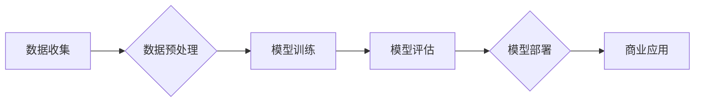

> AI大模型，创业，创新优势，商业应用，技术趋势，发展挑战

## 1. 背景介绍

人工智能（AI）技术近年来取得了飞速发展，特别是大模型的涌现，为各行各业带来了前所未有的机遇。大模型是指参数规模庞大、训练数据海量的人工智能模型，具备强大的泛化能力和学习能力，能够在自然语言处理、计算机视觉、语音识别等领域取得突破性进展。

随着大模型技术的成熟，越来越多的创业者看到了其中的商机，纷纷涌入AI大模型领域。然而，仅仅拥有先进的技术并不能保证创业成功，如何将AI大模型的创新优势转化为商业价值，成为创业者面临的重大挑战。

## 2. 核心概念与联系

**2.1 AI大模型的定义与特点**

AI大模型是指参数规模庞大、训练数据海量的人工智能模型，其核心特点包括：

* **规模化：** 大模型拥有数亿甚至数十亿的参数，远超传统机器学习模型。
* **泛化能力强：** 由于训练数据量大，大模型能够学习到更丰富的知识和模式，从而具备更强的泛化能力，能够应用于多种不同的任务。
* **学习能力强：** 大模型能够通过微调的方式，快速适应新的任务和领域。

**2.2 大模型的架构与训练流程**

大模型的架构通常基于Transformer网络，其特点是能够有效处理序列数据，并具有强大的并行计算能力。训练流程主要包括以下步骤：

1. **数据预处理：** 收集和清洗海量数据，并将其转换为模型可理解的格式。
2. **模型训练：** 利用大量的计算资源，对模型进行训练，使其能够学习到数据的规律和模式。
3. **模型评估：** 使用测试数据评估模型的性能，并根据评估结果进行模型调优。
4. **模型部署：** 将训练好的模型部署到实际应用场景中。

**2.3 大模型的商业应用场景**

大模型在各个领域都有着广泛的应用场景，例如：

* **自然语言处理：** 文本生成、机器翻译、问答系统、聊天机器人等。
* **计算机视觉：** 图像识别、物体检测、图像分割、视频分析等。
* **语音识别：** 语音转文本、语音合成、语音助手等。
* **推荐系统：** 商品推荐、内容推荐、个性化服务等。

**2.4  Mermaid 流程图**



## 3. 核心算法原理 & 具体操作步骤

### 3.1  算法原理概述

大模型的训练主要基于深度学习算法，其中Transformer网络是目前最主流的架构。Transformer网络的核心思想是利用注意力机制来捕捉序列数据中的长距离依赖关系，从而提高模型的理解和生成能力。

### 3.2  算法步骤详解

1. **输入层：** 将输入序列转换为向量表示，每个向量代表一个单词或子词。
2. **编码器：** 利用多层Transformer模块对输入序列进行编码，每个模块包含多头注意力机制和前馈神经网络。
3. **解码器：** 利用多层Transformer模块对编码后的序列进行解码，生成输出序列。
4. **输出层：** 将解码后的输出序列转换为目标格式，例如文本、图像或语音。

### 3.3  算法优缺点

**优点：**

* 能够有效捕捉长距离依赖关系，提高模型的理解能力。
* 具有强大的并行计算能力，能够高效地训练大规模模型。
* 能够通过微调的方式，快速适应新的任务和领域。

**缺点：**

* 训练成本高，需要大量的计算资源和训练数据。
* 模型参数量大，部署成本较高。
* 训练过程复杂，需要专业的技术人员进行操作。

### 3.4  算法应用领域

Transformer网络及其变体在自然语言处理、计算机视觉、语音识别等领域都有着广泛的应用，例如：

* **BERT：** 用于文本分类、问答系统、机器翻译等任务。
* **GPT-3：** 用于文本生成、代码生成、对话系统等任务。
* **DALL-E：** 用于图像生成、图像编辑等任务。

## 4. 数学模型和公式 & 详细讲解 & 举例说明

### 4.1  数学模型构建

大模型的训练过程本质上是一个优化问题，目标是找到模型参数，使得模型在训练数据上的损失函数最小。损失函数通常是模型预测值与真实值的差值，例如均方误差或交叉熵损失。

### 4.2  公式推导过程

**4.2.1  均方误差损失函数**

$$
L = \frac{1}{N} \sum_{i=1}^{N} (y_i - \hat{y}_i)^2
$$

其中：

* $L$ 为损失函数值
* $N$ 为样本数量
* $y_i$ 为真实值
* $\hat{y}_i$ 为模型预测值

**4.2.2  交叉熵损失函数**

$$
L = -\frac{1}{N} \sum_{i=1}^{N} \sum_{j=1}^{C} y_{ij} \log(\hat{y}_{ij})
$$

其中：

* $L$ 为损失函数值
* $N$ 为样本数量
* $C$ 为类别数量
* $y_{ij}$ 为真实标签，如果第 $i$ 个样本属于第 $j$ 个类别，则 $y_{ij} = 1$，否则 $y_{ij} = 0$
* $\hat{y}_{ij}$ 为模型预测第 $i$ 个样本属于第 $j$ 个类别的概率

**4.2.3  梯度下降算法**

梯度下降算法是一种常用的优化算法，其目标是通过迭代更新模型参数，使得损失函数不断减小。

$$
\theta = \theta - \alpha \nabla L(\theta)
$$

其中：

* $\theta$ 为模型参数
* $\alpha$ 为学习率
* $\nabla L(\theta)$ 为损失函数对模型参数的梯度

### 4.3  案例分析与讲解

**4.3.1  文本分类案例**

假设我们有一个文本分类任务，目标是将文本分类为正类或负类。我们可以使用BERT模型进行训练，并使用交叉熵损失函数来评估模型性能。

**4.3.2  图像识别案例**

假设我们有一个图像识别任务，目标是识别图像中的物体类别。我们可以使用DALL-E模型进行训练，并使用均方误差损失函数来评估模型性能。

## 5. 项目实践：代码实例和详细解释说明

### 5.1  开发环境搭建

* **操作系统：** Linux或macOS
* **编程语言：** Python
* **深度学习框架：** TensorFlow或PyTorch
* **硬件环境：** GPU加速

### 5.2  源代码详细实现

```python
# 使用TensorFlow框架实现一个简单的文本分类模型

import tensorflow as tf

# 定义模型结构
model = tf.keras.Sequential([
    tf.keras.layers.Embedding(input_dim=vocab_size, output_dim=embedding_dim),
    tf.keras.layers.LSTM(units=128),
    tf.keras.layers.Dense(units=1, activation='sigmoid')
])

# 编译模型
model.compile(optimizer='adam', loss='binary_crossentropy', metrics=['accuracy'])

# 训练模型
model.fit(x_train, y_train, epochs=10, batch_size=32)

# 评估模型
loss, accuracy = model.evaluate(x_test, y_test)
print('Loss:', loss)
print('Accuracy:', accuracy)
```

### 5.3  代码解读与分析

* **Embedding层：** 将单词转换为向量表示。
* **LSTM层：** 用于处理序列数据，捕捉文本中的长距离依赖关系。
* **Dense层：** 全连接层，用于将LSTM层的输出映射到输出类别。
* **Adam优化器：** 用于更新模型参数。
* **Binary Crossentropy损失函数：** 用于二分类任务。

### 5.4  运行结果展示

训练完成后，我们可以使用测试数据评估模型的性能，并打印出损失值和准确率。

## 6. 实际应用场景

### 6.1  智能客服

大模型可以用于构建智能客服系统，能够自动理解用户问题，并提供准确的回复。

### 6.2  个性化推荐

大模型可以分析用户的行为数据，并推荐个性化的商品、内容或服务。

### 6.3  自动写作

大模型可以用于自动生成各种类型的文本，例如新闻报道、广告文案、诗歌等。

### 6.4  未来应用展望

随着大模型技术的不断发展，其应用场景将更加广泛，例如：

* **医疗诊断：** 大模型可以辅助医生进行疾病诊断，提高诊断准确率。
* **药物研发：** 大模型可以加速药物研发过程，发现新的药物靶点。
* **教育教学：** 大模型可以个性化教学，提高学习效率。

## 7. 工具和资源推荐

### 7.1  学习资源推荐

* **课程：** Coursera、edX、Udacity等平台提供深度学习相关的课程。
* **书籍：** 《深度学习》、《动手学深度学习》等书籍。
* **博客：** TensorFlow博客、PyTorch博客等。

### 7.2  开发工具推荐

* **深度学习框架：** TensorFlow、PyTorch、Keras等。
* **云计算平台：** AWS、Google Cloud、Azure等。
* **GPU加速平台：** NVIDIA CUDA、AMD ROCm等。

### 7.3  相关论文推荐

* **Attention Is All You Need：** Transformer网络的提出论文。
* **BERT：** 预训练语言模型BERT的论文。
* **GPT-3：** 预训练语言模型GPT-3的论文。

## 8. 总结：未来发展趋势与挑战

### 8.1  研究成果总结

近年来，大模型技术取得了显著进展，模型规模不断扩大，性能不断提升。大模型在各个领域都有着广泛的应用，为人工智能的发展带来了新的机遇。

### 8.2  未来发展趋势

* **模型规模化：** 模型参数规模将继续扩大，训练数据量也将进一步增加。
* **模型效率化：** 研究更高效的训练算法和模型架构，降低训练成本和部署成本。
* **模型可解释性：** 研究大模型的决策机制，提高模型的可解释性和可信任性。
* **模型安全性和隐私性：** 研究大模型的安全性和隐私性问题，防止模型被恶意利用。

### 8.3  面临的挑战

* **数据获取和标注：** 大模型训练需要海量数据，数据获取和标注成本较高。
* **计算资源需求：** 大模型训练需要大量的计算资源，成本高昂。
* **模型泛化能力：** 大模型在特定领域表现良好，但在其他领域泛化能力不足。
* **伦理和社会影响：** 大模型的应用可能带来伦理和社会问题，需要引起重视。

### 8.4  研究展望

未来，大模型技术将继续发展，并应用于更多领域。我们需要加强对大模型技术的研究，解决其面临的挑战，并将其应用于造福人类的领域。

## 9. 附录：常见问题与解答

**9.1  大模型训练需要多少数据？**

大模型训练需要海量数据，通常需要百万甚至数十亿条数据。

**9.2  大模型训练需要多少计算资源？**

大模型训练需要大量的计算资源，通常需要数百甚至数千个GPU。

**9.3  大模型的训练时间有多长？**

大模型的训练时间取决于模型规模、数据量和计算资源等因素，通常需要数天甚至数周。

**