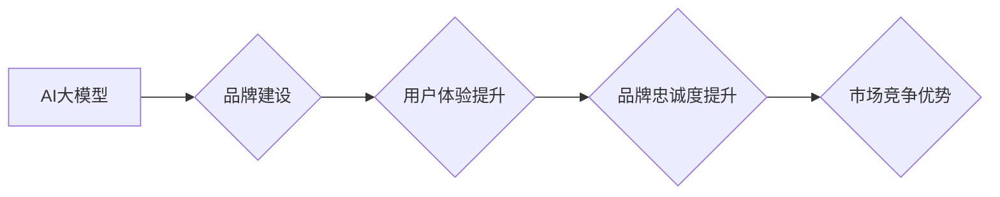

> AI大模型，品牌优势，创业，商业化，市场营销，技术创新，用户体验

## 1. 背景介绍

近年来，人工智能（AI）技术蓬勃发展，特别是大模型的涌现，为各行各业带来了革命性的变革。从自然语言处理到计算机视觉，从药物研发到金融预测，AI大模型的应用场景日益广泛。与此同时，越来越多的创业者看到了AI大模型的巨大商业潜力，纷纷涌入这个领域。然而，仅仅拥有强大的技术能力还不够，如何利用品牌优势，在激烈的市场竞争中脱颖而出，成为创业者需要认真思考的问题。

## 2. 核心概念与联系

**2.1 AI大模型**

AI大模型是指在海量数据上训练，拥有强大泛化能力和学习能力的深度学习模型。它们通常具有以下特点：

* **规模庞大:** 参数数量巨大，往往包含数十亿甚至数千亿个参数。
* **多任务学习:** 可以胜任多种任务，例如文本生成、图像识别、语音合成等。
* **迁移学习:** 可以将已学习到的知识迁移到新的任务和领域。

**2.2 品牌优势**

品牌优势是指企业在市场上建立起来的独特价值和声誉，能够为企业带来持续的竞争优势。它包括以下几个方面：

* **品牌认知度:** 消费者对品牌的熟悉程度和记忆点。
* **品牌忠诚度:** 消费者对品牌的信任度和重复购买意愿。
* **品牌溢价:** 消费者愿意为品牌产品支付更高的价格。

**2.3 联系**

AI大模型创业者可以通过以下方式利用品牌优势：

* **打造差异化品牌:** 突出AI大模型的独特功能和应用场景，建立差异化的品牌形象。
* **提升用户体验:** 利用AI大模型的强大能力，提供更便捷、更智能的用户体验，增强用户粘性。
* **构建品牌社区:** 围绕AI大模型，建立用户社区，促进用户互动和口碑传播。

**2.4  流程图**



## 3. 核心算法原理 & 具体操作步骤

**3.1 算法原理概述**

AI大模型的训练主要基于深度学习算法，例如Transformer、BERT、GPT等。这些算法通过多层神经网络结构，学习数据中的复杂模式和关系，从而实现对数据的理解和生成。

**3.2 算法步骤详解**

1. **数据预处理:** 收集和清洗数据，将其转换为模型可理解的格式。
2. **模型构建:** 根据任务需求，选择合适的深度学习模型架构。
3. **模型训练:** 利用训练数据，通过反向传播算法，调整模型参数，使其能够准确地预测或生成目标输出。
4. **模型评估:** 使用测试数据，评估模型的性能，例如准确率、召回率、F1-score等。
5. **模型部署:** 将训练好的模型部署到实际应用场景中，提供服务。

**3.3 算法优缺点**

* **优点:** 强大的泛化能力、学习能力、可迁移性。
* **缺点:** 训练成本高、数据依赖性强、解释性差。

**3.4 算法应用领域**

* 自然语言处理：文本分类、情感分析、机器翻译、文本生成等。
* 计算机视觉：图像识别、物体检测、图像分割、图像生成等。
* 语音识别：语音转文本、语音合成等。
* 其他领域：药物研发、金融预测、医疗诊断等。

## 4. 数学模型和公式 & 详细讲解 & 举例说明

**4.1 数学模型构建**

AI大模型的训练过程本质上是一个优化问题，目标是找到最优的参数，使得模型的预测或生成结果与真实值之间的误差最小。常用的数学模型包括：

* **损失函数:** 用于衡量模型预测结果与真实值的差异。常见的损失函数包括交叉熵损失、均方误差损失等。
* **优化算法:** 用于更新模型参数，使得损失函数最小化的算法。常见的优化算法包括梯度下降、Adam、RMSprop等。

**4.2 公式推导过程**

例如，对于一个分类任务，假设模型的输出为概率分布，真实标签为类别y，则交叉熵损失函数可以表示为：

$$
L = - \sum_{i=1}^{C} y_i \log(p_i)
$$

其中，C为类别数，$y_i$为真实标签的one-hot编码，$p_i$为模型预测的概率分布。

**4.3 案例分析与讲解**

假设我们训练一个图像分类模型，目标是识别猫和狗的图片。我们可以使用交叉熵损失函数来衡量模型的性能。训练过程中，模型会不断调整参数，使得预测结果与真实标签之间的差异最小化。最终，模型能够准确地识别猫和狗的图片。

## 5. 项目实践：代码实例和详细解释说明

**5.1 开发环境搭建**

* 操作系统：Linux/macOS
* Python版本：3.7+
* 深度学习框架：TensorFlow/PyTorch
* 其他依赖库：NumPy、pandas、matplotlib等

**5.2 源代码详细实现**

```python
import tensorflow as tf

# 定义模型结构
model = tf.keras.models.Sequential([
    tf.keras.layers.Conv2D(32, (3, 3), activation='relu', input_shape=(224, 224, 3)),
    tf.keras.layers.MaxPooling2D((2, 2)),
    tf.keras.layers.Conv2D(64, (3, 3), activation='relu'),
    tf.keras.layers.MaxPooling2D((2, 2)),
    tf.keras.layers.Flatten(),
    tf.keras.layers.Dense(10, activation='softmax')
])

# 定义损失函数和优化器
model.compile(loss='sparse_categorical_crossentropy', optimizer='adam', metrics=['accuracy'])

# 训练模型
model.fit(x_train, y_train, epochs=10, batch_size=32)

# 评估模型
loss, accuracy = model.evaluate(x_test, y_test)
print('Loss:', loss)
print('Accuracy:', accuracy)
```

**5.3 代码解读与分析**

这段代码定义了一个简单的卷积神经网络模型，用于图像分类任务。模型包含卷积层、池化层、全连接层和softmax层。

* 卷积层和池化层用于提取图像特征。
* 全连接层用于将特征映射到类别输出。
* softmax层用于将输出转换为概率分布。

**5.4 运行结果展示**

训练完成后，我们可以使用测试数据评估模型的性能。输出结果会显示模型的损失值和准确率。

## 6. 实际应用场景

**6.1 自然语言处理**

* **聊天机器人:** 利用AI大模型，构建更智能、更自然的聊天机器人，提供更人性化的用户体验。
* **文本摘要:** 自动生成文本摘要，提高信息获取效率。
* **机器翻译:** 实现更准确、更流畅的机器翻译，打破语言障碍。

**6.2 计算机视觉**

* **图像识别:** 自动识别图像中的物体、场景和人物，应用于安防监控、医疗诊断等领域。
* **图像生成:** 生成逼真的图像，应用于艺术创作、游戏开发等领域。
* **视频分析:** 分析视频内容，提取关键信息，应用于监控、广告投放等领域。

**6.3 其他领域**

* **金融预测:** 利用AI大模型分析金融数据，预测股票价格、风险评估等。
* **医疗诊断:** 利用AI大模型分析医学影像，辅助医生诊断疾病。
* **个性化推荐:** 根据用户的行为数据，推荐个性化的商品、服务和内容。

**6.4 未来应用展望**

随着AI技术的不断发展，AI大模型将在更多领域发挥重要作用，例如：

* **自动驾驶:** 构建更智能、更安全的自动驾驶系统。
* **机器人技术:** 开发更智能、更灵活的机器人，应用于工业生产、服务业等领域。
* **科学研究:** 加速科学研究，解决复杂科学问题。

## 7. 工具和资源推荐

**7.1 学习资源推荐**

* **书籍:**
    * 《深度学习》
    * 《动手学深度学习》
    * 《自然语言处理》
* **在线课程:**
    * Coursera
    * edX
    * Udacity

**7.2 开发工具推荐**

* **深度学习框架:** TensorFlow、PyTorch、Keras
* **数据处理工具:** Pandas、NumPy
* **可视化工具:** Matplotlib、Seaborn

**7.3 相关论文推荐**

* **Transformer:** Attention Is All You Need
* **BERT:** BERT: Pre-training of Deep Bidirectional Transformers for Language Understanding
* **GPT:** Generative Pre-trained Transformer

## 8. 总结：未来发展趋势与挑战

**8.1 研究成果总结**

近年来，AI大模型取得了显著的进展，在多个领域展现出强大的应用潜力。

**8.2 未来发展趋势**

* **模型规模进一步扩大:** 随着计算能力的提升，模型规模将继续扩大，带来更强的学习能力和泛化能力。
* **多模态学习:** AI大模型将能够处理多种数据类型，例如文本、图像、音频等，实现更全面的理解和生成。
* **可解释性增强:** 研究者将致力于提高AI大模型的可解释性，使其决策过程更加透明和可理解。

**8.3 面临的挑战**

* **数据获取和隐私保护:** AI大模型训练需要海量数据，如何获取高质量数据并保护用户隐私是一个重要挑战。
* **计算资源需求:** 训练大型AI模型需要大量的计算资源，成本较高。
* **伦理和社会影响:** AI大模型的应用可能带来伦理和社会问题，例如算法偏见、就业影响等，需要引起重视和探讨。

**8.4 研究展望**

未来，AI大模型研究将继续朝着更强大、更智能、更安全的方向发展，为人类社会带来更多福祉。


## 9. 附录：常见问题与解答

**9.1 如何选择合适的AI大模型？**

选择合适的AI大模型需要根据具体的应用场景和需求进行考虑。例如，对于文本分类任务，可以选择BERT或RoBERTa模型；对于图像识别任务，可以选择ResNet或EfficientNet模型。

**9.2 如何训练自己的AI大模型？**

训练自己的AI大模型需要具备一定的深度学习知识和经验，以及充足的计算资源。可以使用开源的深度学习框架，例如TensorFlow或PyTorch，进行模型训练。

**9.3 如何部署AI大模型？**

部署AI大模型可以采用多种方式，例如云端部署、边缘部署等。选择合适的部署方式需要根据应用场景和资源限制进行考虑。


作者：禅与计算机程序设计艺术 / Zen and the Art of Computer Programming 
<end_of_turn>