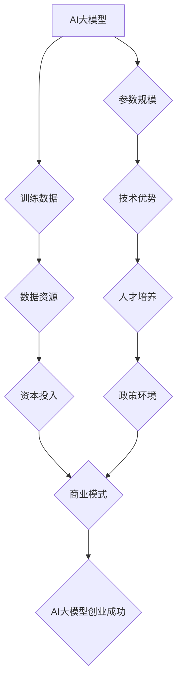

> AI大模型，创业，国际优势，技术开发，商业模式，人才培养，政策环境

## 1. 背景介绍

近年来，人工智能（AI）技术突飞猛进，特别是大模型的出现，为各行各业带来了革命性的变革。大模型，是指参数规模庞大、训练数据海量的人工智能模型，具备强大的泛化能力和学习能力，能够在自然语言处理、计算机视觉、语音识别等领域取得突破性进展。

随着大模型技术的成熟，越来越多的创业者看到了其中的商机，纷纷涌入AI大模型领域。然而，创业之路并非一帆风顺，如何利用国际优势，在激烈的竞争中脱颖而出，成为摆在创业者面前的关键问题。

## 2. 核心概念与联系

**2.1 AI大模型的构成**

AI大模型的核心在于其庞大的参数规模和海量训练数据。这些参数通过训练过程不断调整，最终能够学习到复杂的模式和规律。

* **参数:** AI模型的学习和决策依据，类似于人类大脑中的神经元。
* **训练数据:** 用于训练AI模型的数据集，数据质量和数量直接影响模型的性能。

**2.2 国际优势的构成**

国际优势的构成包括技术、人才、资本、政策等多方面因素。

* **技术:** 不同国家在AI技术领域拥有不同的优势和特色，例如美国在深度学习方面处于领先地位，中国在自然语言处理方面表现突出。
* **人才:** AI人才的供给和质量直接影响AI产业的发展。
* **资本:** 充足的资本投入是AI产业发展的关键驱动力。
* **政策:** 政府的政策支持和引导能够为AI产业的发展营造良好的环境。

**2.3 国际优势与AI大模型创业的联系**

AI大模型创业者可以通过充分利用国际优势，提升自身的竞争力。例如，可以利用海外先进的技术和人才，获得海外资本的投资，并积极争取政府的政策支持。



## 3. 核心算法原理 & 具体操作步骤

**3.1 算法原理概述**

大模型的训练主要基于深度学习算法，其中Transformer模型是目前最流行的架构之一。Transformer模型通过自注意力机制，能够捕捉文本序列中的长距离依赖关系，从而实现更准确的理解和生成。

**3.2 算法步骤详解**

1. **数据预处理:** 将原始文本数据进行清洗、分词、标记等操作，使其能够被模型理解。
2. **模型构建:** 根据Transformer模型的架构，搭建模型结构，并设定模型参数。
3. **模型训练:** 使用训练数据，通过反向传播算法，不断调整模型参数，使其能够准确地预测目标输出。
4. **模型评估:** 使用测试数据，评估模型的性能，例如准确率、召回率等。
5. **模型部署:** 将训练好的模型部署到实际应用场景中，例如聊天机器人、机器翻译等。

**3.3 算法优缺点**

* **优点:** 强大的泛化能力、学习能力、能够处理长距离依赖关系。
* **缺点:** 训练成本高、计算资源需求大、需要大量高质量数据。

**3.4 算法应用领域**

* 自然语言处理：机器翻译、文本摘要、问答系统、聊天机器人等。
* 计算机视觉：图像识别、目标检测、图像生成等。
* 语音识别：语音转文本、语音合成等。

## 4. 数学模型和公式 & 详细讲解 & 举例说明

**4.1 数学模型构建**

Transformer模型的核心是自注意力机制，其数学模型可以表示为：

$$
Attention(Q, K, V) = \frac{exp(Q \cdot K^T / \sqrt{d_k})}{exp(Q \cdot K^T / \sqrt{d_k})} \cdot V
$$

其中：

* $Q$: 查询矩阵
* $K$: 键矩阵
* $V$: 值矩阵
* $d_k$: 键向量的维度

**4.2 公式推导过程**

自注意力机制通过计算查询向量与键向量的点积，来衡量它们之间的相关性。点积结果经过softmax归一化，得到每个键向量的权重，然后将权重与值向量相乘，得到最终的注意力输出。

**4.3 案例分析与讲解**

例如，在机器翻译任务中，查询向量可以表示源语言的词语，键向量和值向量可以表示目标语言的词语。通过自注意力机制，模型可以学习到源语言词语与目标语言词语之间的对应关系，从而实现准确的翻译。

## 5. 项目实践：代码实例和详细解释说明

**5.1 开发环境搭建**

* Python 3.7+
* PyTorch 1.7+
* CUDA 10.2+

**5.2 源代码详细实现**

```python
import torch
import torch.nn as nn

class Transformer(nn.Module):
    def __init__(self, vocab_size, embedding_dim, num_heads, num_layers):
        super(Transformer, self).__init__()
        self.embedding = nn.Embedding(vocab_size, embedding_dim)
        self.transformer_layers = nn.ModuleList([
            nn.TransformerEncoderLayer(embedding_dim, num_heads)
            for _ in range(num_layers)
        ])
        self.linear = nn.Linear(embedding_dim, vocab_size)

    def forward(self, x):
        x = self.embedding(x)
        for layer in self.transformer_layers:
            x = layer(x)
        x = self.linear(x)
        return x
```

**5.3 代码解读与分析**

* `__init__` 方法初始化模型参数，包括词嵌入层、Transformer编码器层和线性输出层。
* `forward` 方法定义模型的正向传播过程，将输入序列经过词嵌入层、Transformer编码器层和线性输出层，最终得到输出序列。

**5.4 运行结果展示**

通过训练和测试，可以评估模型的性能，例如准确率、困惑度等。

## 6. 实际应用场景

**6.1 聊天机器人**

大模型可以用于构建更智能、更自然的聊天机器人，能够理解用户的意图，并提供更精准的回复。

**6.2 机器翻译**

大模型可以实现更高质量的机器翻译，能够更好地捕捉语言的语义和文化差异。

**6.3 文本摘要**

大模型可以自动生成文本摘要，能够提取文本的关键信息，并生成简洁明了的摘要。

**6.4 未来应用展望**

* 个性化教育
* 医疗诊断
* 法律服务
* 科学研究

## 7. 工具和资源推荐

**7.1 学习资源推荐**

* **书籍:**
    * 《深度学习》
    * 《自然语言处理》
* **在线课程:**
    * Coursera: 深度学习
    * Udacity: 自然语言处理
* **博客:**
    * The Gradient
    * Towards Data Science

**7.2 开发工具推荐**

* **框架:**
    * PyTorch
    * TensorFlow
* **库:**
    * Hugging Face Transformers
    * Gensim

**7.3 相关论文推荐**

* 《Attention Is All You Need》
* 《BERT: Pre-training of Deep Bidirectional Transformers for Language Understanding》

## 8. 总结：未来发展趋势与挑战

**8.1 研究成果总结**

近年来，AI大模型取得了显著的进展，在多个领域展现出强大的应用潜力。

**8.2 未来发展趋势**

* 模型规模的进一步扩大
* 算法架构的不断创新
* 多模态大模型的开发
* 联邦学习的应用

**8.3 面临的挑战**

* 计算资源需求大
* 数据安全和隐私问题
* 模型解释性和可信度问题
* 伦理和社会影响问题

**8.4 研究展望**

未来，AI大模型的研究将继续朝着更强大、更智能、更安全的方向发展，并将在更多领域发挥重要作用。

## 9. 附录：常见问题与解答

**9.1 如何选择合适的AI大模型？**

选择合适的AI大模型需要根据具体的应用场景和需求进行考虑，例如模型规模、算法架构、训练数据等。

**9.2 如何训练自己的AI大模型？**

训练自己的AI大模型需要具备一定的技术基础和资源支持，包括数据准备、模型搭建、训练过程和评估指标等。

**9.3 AI大模型的伦理问题有哪些？**

AI大模型的伦理问题包括数据隐私、算法偏见、模型解释性和社会影响等。


作者：禅与计算机程序设计艺术 / Zen and the Art of Computer Programming 
<end_of_turn>