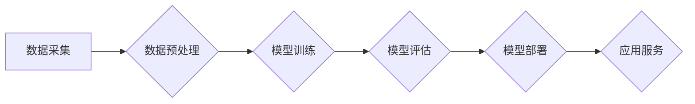

> AI大模型，创业，商业应用，技术趋势，未来优势，伦理问题

## 1. 背景介绍

人工智能（AI）技术近年来取得了飞速发展，特别是大模型的出现，为各行各业带来了前所未有的机遇。大模型是指参数规模庞大、训练数据海量的人工智能模型，具备强大的泛化能力和学习能力，能够在自然语言处理、计算机视觉、语音识别等领域取得突破性进展。

随着大模型技术的成熟，越来越多的创业者看到了其中的商机，纷纷涌入AI大模型领域。然而，创业者需要深刻理解大模型的特性、优势和挑战，才能在激烈的竞争中脱颖而出。

## 2. 核心概念与联系

**2.1 大模型的定义和特点**

大模型是指参数数量超过数十亿甚至千亿级别的深度学习模型。其特点包括：

* **规模庞大:** 参数数量巨大，训练数据量也十分庞大。
* **泛化能力强:** 能够在多种任务上表现出色，并适应新的任务和数据。
* **学习能力强:** 可以从海量数据中学习复杂的模式和知识。
* **可迁移性高:** 可以将预训练模型微调到特定任务，降低训练成本和时间。

**2.2 大模型的架构**

大模型的架构通常基于 Transformer 网络，其核心结构是自注意力机制，能够捕捉文本序列中的长距离依赖关系。常见的 Transformer 架构包括 BERT、GPT、T5 等。

**2.3 大模型的训练方法**

大模型的训练需要大量的计算资源和时间。常用的训练方法包括：

* **自监督学习:** 利用大量的无标签数据进行预训练，学习语言的表示和结构。
* **半监督学习:** 利用少量标注数据和大量无标签数据进行训练，提高模型的性能。
* **迁移学习:** 将预训练模型微调到特定任务，降低训练成本和时间。

**2.4 大模型的应用场景**

大模型在各个领域都有广泛的应用场景，例如：

* **自然语言处理:** 文本生成、机器翻译、问答系统、情感分析等。
* **计算机视觉:** 图像识别、物体检测、图像生成等。
* **语音识别:** 语音转文本、语音合成等。
* **推荐系统:** 商品推荐、内容推荐等。

**Mermaid 流程图**



## 3. 核心算法原理 & 具体操作步骤

### 3.1 算法原理概述

大模型的核心算法是 Transformer 网络，其核心结构是自注意力机制。自注意力机制能够捕捉文本序列中的长距离依赖关系，提高模型的理解能力和表达能力。

### 3.2 算法步骤详解

1. **输入嵌入:** 将输入文本序列转换为向量表示。
2. **多头自注意力:** 对输入序列进行多头自注意力计算，捕捉文本序列中的长距离依赖关系。
3. **前馈神经网络:** 对自注意力输出进行非线性变换，提取更深层的语义信息。
4. **位置编码:** 添加位置信息，使模型能够理解文本序列中的词序关系。
5. **输出层:** 将模型输出转换为目标格式，例如文本、分类标签等。

### 3.3 算法优缺点

**优点:**

* 能够捕捉长距离依赖关系，提高模型的理解能力。
* 训练效率高，能够在大型数据集上进行训练。
* 可迁移性强，可以应用于多种任务。

**缺点:**

* 计算复杂度高，需要大量的计算资源。
* 参数量大，需要大量的存储空间。
* 训练数据量大，需要大量的标注数据。

### 3.4 算法应用领域

Transformer 网络及其变体在自然语言处理、计算机视觉、语音识别等领域都有广泛的应用。

## 4. 数学模型和公式 & 详细讲解 & 举例说明

### 4.1 数学模型构建

大模型的数学模型通常基于深度学习框架，例如 TensorFlow 或 PyTorch。模型的结构由多个层组成，每一层都包含多个神经元。神经元之间通过权重连接，权重决定了神经元之间的信息传递强度。

### 4.2 公式推导过程

Transformer 网络的核心是自注意力机制，其计算公式如下：

$$
Attention(Q, K, V) = softmax(\frac{QK^T}{\sqrt{d_k}})V
$$

其中：

* $Q$：查询矩阵
* $K$：键矩阵
* $V$：值矩阵
* $d_k$：键向量的维度
* $softmax$：softmax 函数

### 4.3 案例分析与讲解

假设我们有一个句子 "The cat sat on the mat"，将其转换为词向量表示，得到四个词向量：

* "The"： [0.1, 0.2, 0.3]
* "cat"： [0.4, 0.5, 0.6]
* "sat"： [0.7, 0.8, 0.9]
* "on"： [0.2, 0.3, 0.4]

我们可以使用自注意力机制计算每个词与其他词之间的相关性，例如 "cat" 与 "sat" 之间的相关性较高，因为它们在语义上紧密相关。

## 5. 项目实践：代码实例和详细解释说明

### 5.1 开发环境搭建

* 安装 Python 3.7 或更高版本
* 安装 TensorFlow 或 PyTorch 深度学习框架
* 安装必要的库，例如 numpy、pandas、matplotlib 等

### 5.2 源代码详细实现

```python
import tensorflow as tf

# 定义 Transformer 模型
class Transformer(tf.keras.Model):
    def __init__(self, vocab_size, embedding_dim, num_heads, num_layers):
        super(Transformer, self).__init__()
        self.embedding = tf.keras.layers.Embedding(vocab_size, embedding_dim)
        self.transformer_layers = tf.keras.layers.StackedRNNCells([
            tf.keras.layers.MultiHeadAttention(num_heads=num_heads, key_dim=embedding_dim)
            for _ in range(num_layers)
        ])

    def call(self, inputs):
        # 将输入转换为词向量表示
        embedded = self.embedding(inputs)
        # 通过 Transformer 层进行编码
        encoded = self.transformer_layers(embedded)
        return encoded

# 实例化 Transformer 模型
model = Transformer(vocab_size=10000, embedding_dim=128, num_heads=8, num_layers=6)

# 训练模型
model.compile(optimizer='adam', loss='mse')
model.fit(x_train, y_train, epochs=10)

# 预测结果
predictions = model.predict(x_test)
```

### 5.3 代码解读与分析

* 代码首先定义了一个 Transformer 模型类，包含嵌入层、Transformer 层等。
* 嵌入层将输入词转换为词向量表示。
* Transformer 层由多个 MultiHeadAttention 层和前馈神经网络层组成，用于捕捉文本序列中的长距离依赖关系。
* 代码实例化了一个 Transformer 模型，并使用 Adam 优化器和均方误差损失函数进行训练。
* 训练完成后，可以使用模型预测新的文本序列。

### 5.4 运行结果展示

训练结果可以根据具体的任务和数据集进行评估，例如使用准确率、F1 值等指标。

## 6. 实际应用场景

### 6.1 自然语言处理

* **文本生成:** 大模型可以用于生成高质量的文本，例如小说、诗歌、新闻报道等。
* **机器翻译:** 大模型可以实现高质量的机器翻译，跨越语言障碍。
* **问答系统:** 大模型可以理解自然语言问题，并给出准确的答案。
* **情感分析:** 大模型可以分析文本的情感倾向，例如正面、负面、中性等。

### 6.2 计算机视觉

* **图像识别:** 大模型可以识别图像中的物体、场景、人物等。
* **物体检测:** 大模型可以定位图像中的物体，并识别物体的类别。
* **图像生成:** 大模型可以生成逼真的图像，例如人脸、风景、物体等。

### 6.3 语音识别

* **语音转文本:** 大模型可以将语音转换为文本，例如语音助手、会议记录等。
* **语音合成:** 大模型可以将文本转换为语音，例如语音播报、虚拟助手等。

### 6.4 其他应用场景

* **推荐系统:** 大模型可以根据用户的历史行为和偏好，推荐相关的商品、内容等。
* **医疗诊断:** 大模型可以辅助医生进行疾病诊断，提高诊断准确率。
* **金融风险评估:** 大模型可以分析金融数据，评估风险，帮助金融机构做出决策。

### 6.4 未来应用展望

随着大模型技术的不断发展，其应用场景将更加广泛，例如：

* **个性化教育:** 根据学生的学习情况，提供个性化的学习内容和辅导。
* **智能客服:** 提供更加智能、人性化的客服服务。
* **自动驾驶:** 帮助自动驾驶汽车更好地感知周围环境，做出更安全的决策。

## 7. 工具和资源推荐

### 7.1 学习资源推荐

* **书籍:**
    * 《深度学习》
    * 《自然语言处理》
    * 《Transformer 详解》
* **在线课程:**
    * Coursera: 深度学习
    * Udacity: 自然语言处理
    * fast.ai: 深度学习
* **博客和论坛:**
    * TensorFlow Blog
    * PyTorch Blog
    * Hugging Face

### 7.2 开发工具推荐

* **深度学习框架:** TensorFlow, PyTorch
* **文本处理库:** NLTK, SpaCy
* **数据可视化库:** Matplotlib, Seaborn

### 7.3 相关论文推荐

* Attention Is All You Need
* BERT: Pre-training of Deep Bidirectional Transformers for Language Understanding
* GPT-3: Language Models are Few-Shot Learners

## 8. 总结：未来发展趋势与挑战

### 8.1 研究成果总结

大模型技术取得了显著的进展，在各个领域都展现出强大的应用潜力。

### 8.2 未来发展趋势

* **模型规模进一步扩大:** 参数规模将继续增长，模型能力将进一步提升。
* **多模态学习:** 大模型将融合文本、图像、音频等多种模态数据，实现更全面的理解和表达。
* **可解释性增强:** 研究如何提高大模型的透明度和可解释性，增强用户对模型决策的信任。

### 8.3 面临的挑战

* **计算资源需求:** 训练大型模型需要大量的计算资源，成本高昂。
* **数据安全和隐私:** 大模型的训练需要大量数据，如何保证数据安全和隐私是一个重要挑战。
* **伦理问题:** 大模型的应用可能带来一些伦理问题，例如算法偏见、信息操纵等，需要引起重视和探讨。

### 8.4 研究展望

未来，大模型技术将继续发展，并应用于更多领域，为人类社会带来更多福祉。

## 9. 附录：常见问题与解答

**Q1: 如何选择合适的深度学习框架？**

**A1:** TensorFlow 和 PyTorch 是两个主流的深度学习框架，各有优缺点。 TensorFlow 更适合于生产环境，PyTorch 更灵活，更容易上手。

**Q2: 如何训练大型模型？**

**A2:** 训练大型模型需要大量的计算资源和时间。可以使用分布式训练技术，将模型训练任务分发到多个机器上进行。

**Q3: 如何评估大模型的性能？**

**A3:** 大模型的性能评估方法取决于具体的应用场景。常用的评估指标包括准确率、F1 值、BLEU 等。

**Q4: 如何解决大模型的伦理问题？**

**A4:** 

解决大模型的伦理问题需要多方共同努力，