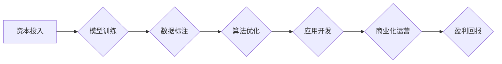

> AI大模型，创业，资本优势，商业模式，技术落地，风险控制，投资策略

## 1. 背景介绍

近年来，人工智能（AI）技术突飞猛进，特别是大模型的出现，为各行各业带来了革命性的变革。从自然语言处理到计算机视觉，从药物研发到金融预测，AI大模型的应用场景日益广泛。 

与此同时，AI大模型创业也成为新的热点。众多创业者看到了AI大模型的巨大潜力，纷纷涌入这个领域，希望通过开发创新应用，抓住机遇，实现财富积累。然而，AI大模型创业并非易事，它需要面对技术门槛高、数据资源稀缺、商业模式不清晰等诸多挑战。

## 2. 核心概念与联系

**2.1 AI大模型**

AI大模型是指在海量数据上训练，拥有强大泛化能力的深度学习模型。其规模庞大，参数数量达到数十亿甚至数千亿，能够处理复杂的任务，并展现出类似人类的智能。

**2.2 资本优势**

资本优势是指创业公司在资金、资源、人才等方面的优势。对于AI大模型创业来说，资本优势尤为重要，因为它需要投入大量的资金用于模型训练、数据标注、硬件设施等。

**2.3 联系**

AI大模型创业的核心在于如何利用资本优势，克服技术和资源的限制，将AI大模型的技术成果转化为商业价值。

**2.4  流程图**



## 3. 核心算法原理 & 具体操作步骤

**3.1 算法原理概述**

AI大模型的训练主要基于深度学习算法，其中Transformer模型是目前最主流的架构之一。Transformer模型通过自注意力机制，能够捕捉文本序列中的长距离依赖关系，从而实现更精准的理解和生成。

**3.2 算法步骤详解**

1. **数据预处理:** 将原始数据进行清洗、格式化、编码等操作，使其能够被模型理解。
2. **模型构建:** 根据预设的架构，搭建Transformer模型，并设定模型参数。
3. **模型训练:** 使用训练数据，通过反向传播算法，不断调整模型参数，使其能够准确预测目标输出。
4. **模型评估:** 使用测试数据，评估模型的性能，并根据评估结果进行模型调优。
5. **模型部署:** 将训练好的模型部署到生产环境中，用于实际应用。

**3.3 算法优缺点**

**优点:**

* 强大的泛化能力，能够处理各种复杂的任务。
* 能够捕捉文本序列中的长距离依赖关系，理解语义更深层次。
* 训练效率高，能够在海量数据上快速学习。

**缺点:**

* 训练成本高，需要大量的计算资源和数据。
* 模型参数量大，部署和推理需要较强的硬件支持。
* 训练数据质量对模型性能影响较大，需要高质量的数据进行训练。

**3.4 算法应用领域**

* 自然语言处理：文本分类、情感分析、机器翻译、对话系统等。
* 计算机视觉：图像识别、目标检测、图像生成等。
* 金融预测：股票预测、风险评估、欺诈检测等。
* 医疗诊断：疾病诊断、药物研发、医疗影像分析等。

## 4. 数学模型和公式 & 详细讲解 & 举例说明

**4.1 数学模型构建**

Transformer模型的核心是自注意力机制，其数学模型可以表示为：

$$
Attention(Q, K, V) = \frac{exp(Q \cdot K^T / \sqrt{d_k})}{exp(Q \cdot K^T / \sqrt{d_k})} \cdot V
$$

其中：

* $Q$：查询矩阵
* $K$：键矩阵
* $V$：值矩阵
* $d_k$：键向量的维度

**4.2 公式推导过程**

自注意力机制通过计算查询向量与键向量的点积，来衡量它们之间的相关性。点积结果经过softmax归一化，得到每个键向量对应的权重，然后将权重与值向量相乘，得到最终的注意力输出。

**4.3 案例分析与讲解**

假设我们有一个句子“我爱学习编程”，其词向量表示为：

* 我：[0.1, 0.2, 0.3]
* 爱：[0.4, 0.5, 0.6]
* 学习：[0.7, 0.8, 0.9]
* 编程：[1.0, 1.1, 1.2]

当我们计算“学习”与其他词向量的注意力权重时，会发现“学习”与“编程”之间的相关性最高，因为它们都是与编程相关的词语。因此，注意力机制能够捕捉到句子中的语义关系。

## 5. 项目实践：代码实例和详细解释说明

**5.1 开发环境搭建**

* 操作系统：Ubuntu 20.04
* Python 版本：3.8
* 深度学习框架：PyTorch 1.8

**5.2 源代码详细实现**

```python
import torch
import torch.nn as nn

class Transformer(nn.Module):
    def __init__(self, vocab_size, embedding_dim, num_heads, num_layers):
        super(Transformer, self).__init__()
        self.embedding = nn.Embedding(vocab_size, embedding_dim)
        self.transformer_layers = nn.ModuleList([
            nn.TransformerEncoderLayer(embedding_dim, num_heads)
            for _ in range(num_layers)
        ])
        self.linear = nn.Linear(embedding_dim, vocab_size)

    def forward(self, x):
        x = self.embedding(x)
        for layer in self.transformer_layers:
            x = layer(x)
        x = self.linear(x)
        return x
```

**5.3 代码解读与分析**

* `__init__` 方法：初始化模型参数，包括词嵌入层、Transformer编码器层和线性输出层。
* `forward` 方法：定义模型的正向传播过程，将输入序列经过词嵌入、Transformer编码器和线性输出层，最终得到输出序列。

**5.4 运行结果展示**

通过训练和测试，可以评估模型的性能，例如准确率、困惑度等。

## 6. 实际应用场景

**6.1 自然语言处理**

* **机器翻译:** 将一种语言翻译成另一种语言，例如将英文翻译成中文。
* **文本摘要:** 从长文本中提取关键信息，生成简洁的摘要。
* **对话系统:** 开发能够与人类进行自然对话的聊天机器人。

**6.2 计算机视觉**

* **图像识别:** 将图像分类到不同的类别，例如识别猫、狗、车等。
* **目标检测:** 在图像中定位和识别特定目标，例如检测人脸、车牌、交通标志等。
* **图像生成:** 根据文本描述生成图像，例如根据“一只可爱的猫”的描述生成猫的图像。

**6.3 其他领域**

* **金融预测:** 预测股票价格、风险评估、欺诈检测等。
* **医疗诊断:** 辅助医生诊断疾病、分析医疗影像等。
* **教育领域:** 个性化学习推荐、自动批改作业等。

**6.4 未来应用展望**

随着AI大模型技术的不断发展，其应用场景将更加广泛，例如：

* **个性化推荐:** 根据用户的兴趣和偏好，提供更精准的商品、服务和内容推荐。
* **自动写作:** 自动生成新闻报道、小说、诗歌等各种类型的文本。
* **虚拟助手:** 开发更加智能、人性化的虚拟助手，能够帮助人们完成各种任务。

## 7. 工具和资源推荐

**7.1 学习资源推荐**

* **书籍:**
    * 《深度学习》
    * 《自然语言处理》
    * 《Transformer模型详解》
* **在线课程:**
    * Coursera: 深度学习
    * Udacity: 自然语言处理
    * fast.ai: 深度学习

**7.2 开发工具推荐**

* **深度学习框架:** PyTorch, TensorFlow
* **编程语言:** Python
* **云计算平台:** AWS, Azure, GCP

**7.3 相关论文推荐**

* 《Attention Is All You Need》
* 《BERT: Pre-training of Deep Bidirectional Transformers for Language Understanding》
* 《GPT-3: Language Models are Few-Shot Learners》

## 8. 总结：未来发展趋势与挑战

**8.1 研究成果总结**

近年来，AI大模型取得了显著的进展，其性能不断提升，应用场景不断拓展。Transformer模型成为深度学习领域的新宠，其强大的泛化能力和语义理解能力，为各种自然语言处理任务带来了革命性的变革。

**8.2 未来发展趋势**

* **模型规模进一步扩大:** 随着计算资源的不断提升，AI大模型的规模将继续扩大，模型能力将进一步增强。
* **多模态学习:** AI大模型将融合文本、图像、音频等多种模态数据，实现更全面的智能感知和理解。
* **可解释性增强:** 研究者将致力于提高AI大模型的可解释性，使其决策过程更加透明和可理解。

**8.3 面临的挑战**

* **数据安全和隐私:** AI大模型的训练需要海量数据，如何保证数据安全和隐私是一个重要的挑战。
* **算法偏见:** AI大模型可能存在算法偏见，导致其输出结果不公平或不准确。
* **伦理问题:** AI大模型的应用可能引发伦理问题，例如自动决策、工作替代等。

**8.4 研究展望**

未来，AI大模型研究将继续朝着更强大、更智能、更安全的方向发展。我们需要加强跨学科合作，解决AI大模型面临的挑战，并将其应用于更多领域，造福人类社会。

## 9. 附录：常见问题与解答

**9.1 如何选择合适的AI大模型？**

选择合适的AI大模型需要根据具体的应用场景和需求进行评估。需要考虑模型的规模、性能、训练数据、部署成本等因素。

**9.2 如何训练自己的AI大模型？**

训练自己的AI大模型需要具备一定的深度学习知识和经验，以及强大的计算资源。可以参考开源的模型代码和训练教程，并根据自己的需求进行调整。

**9.3 如何解决AI大模型的偏见问题？**

解决AI大模型的偏见问题需要从多个方面入手，例如：

* 使用更加公平、更加多样化的训练数据。
* 开发更加公平、更加鲁棒的算法模型。
* 对模型输出结果进行监控和评估，及时发现和纠正偏见。


作者：禅与计算机程序设计艺术 / Zen and the Art of Computer Programming 
<end_of_turn>