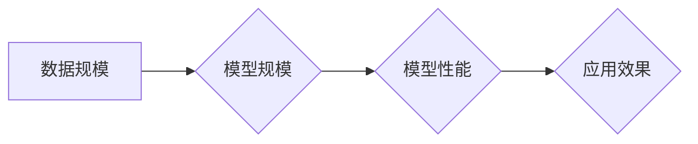

> AI大模型，Scaling Law，Transformer，深度学习，自然语言处理，计算机视觉

## 1. 背景介绍

人工智能（AI）近年来取得了令人瞩目的进展，其中大模型扮演着越来越重要的角色。大模型是指参数量庞大的深度学习模型，通常拥有数十亿甚至数千亿个参数。这些模型通过海量数据训练，能够学习复杂的模式和关系，从而在各种任务中表现出强大的能力，例如自然语言处理、计算机视觉、语音识别等。

大模型的出现，标志着人工智能进入了一个新的时代。它们不仅在性能上超越了传统模型，而且展现出强大的泛化能力和可迁移性，能够应用于更广泛的领域。然而，大模型的训练和部署也面临着巨大的挑战，例如数据获取、计算资源、模型优化等。

## 2. 核心概念与联系

### 2.1 Scaling Law

Scaling Law 是大模型研究领域的核心概念之一。它指随着模型规模（参数量）的增加，模型性能会呈现出指数级或超线性增长。

**Mermaid 流程图:**



### 2.2 Transformer 架构

Transformer 架构是近年来深度学习领域最成功的模型之一，它在自然语言处理任务中取得了突破性的进展。Transformer 的核心特点是利用自注意力机制，能够捕捉句子中单词之间的长距离依赖关系，从而实现更准确的理解和生成文本。

### 2.3 训练方法

大模型的训练通常采用监督学习方法，通过大量的标注数据训练模型。训练过程中，模型会不断调整参数，以最小化预测结果与真实结果之间的误差。

## 3. 核心算法原理 & 具体操作步骤

### 3.1 算法原理概述

Transformer 架构的核心算法是自注意力机制。自注意力机制能够计算每个单词与其他单词之间的相关性，从而捕捉句子中单词之间的语义关系。

### 3.2 算法步骤详解

1. **输入嵌入:** 将输入句子中的每个单词转换为向量表示。
2. **多头自注意力:** 对每个单词进行多头自注意力计算，得到每个单词与其他单词之间的相关性得分。
3. **前馈神经网络:** 对每个单词的注意力得分进行处理，得到新的单词表示。
4. **位置编码:** 将单词的位置信息编码到单词表示中。
5. **输出层:** 将最终的单词表示转换为目标输出，例如预测下一个单词。

### 3.3 算法优缺点

**优点:**

* 能够捕捉长距离依赖关系。
* 并行计算能力强。
* 泛化能力强。

**缺点:**

* 计算复杂度高。
* 需要大量的训练数据。

### 3.4 算法应用领域

* 自然语言理解
* 机器翻译
* 文本生成
* 语音识别
* 图像识别

## 4. 数学模型和公式 & 详细讲解 & 举例说明

### 4.1 数学模型构建

**自注意力机制的数学模型:**

$$
Attention(Q, K, V) = \frac{exp(Q \cdot K^T / \sqrt{d_k})}{exp(Q \cdot K^T / \sqrt{d_k})} \cdot V
$$

其中:

* $Q$：查询矩阵
* $K$：键矩阵
* $V$：值矩阵
* $d_k$：键向量的维度

### 4.2 公式推导过程

自注意力机制的公式通过计算查询向量与键向量的点积，并使用 softmax 函数归一化，得到每个单词与其他单词之间的相关性得分。然后，将这些得分与值向量相乘，得到每个单词的加权平均值，作为最终的注意力输出。

### 4.3 案例分析与讲解

假设我们有一个句子 "The cat sat on the mat"，每个单词的嵌入向量分别为 $q_1, q_2, q_3, q_4, q_5$。

通过自注意力机制，我们可以计算每个单词与其他单词之间的相关性得分，例如 $q_1$ 与 $q_3$ 的相关性得分。

然后，将这些得分与值向量相乘，得到每个单词的加权平均值，例如 $q_1$ 的加权平均值。

最终，每个单词的加权平均值将作为新的单词表示，用于后续的处理。

## 5. 项目实践：代码实例和详细解释说明

### 5.1 开发环境搭建

* Python 3.7+
* PyTorch 1.7+
* CUDA 10.2+

### 5.2 源代码详细实现

```python
import torch
import torch.nn as nn

class Attention(nn.Module):
    def __init__(self, d_model, num_heads):
        super(Attention, self).__init__()
        self.d_model = d_model
        self.num_heads = num_heads
        self.head_dim = d_model // num_heads

        self.query = nn.Linear(d_model, d_model)
        self.key = nn.Linear(d_model, d_model)
        self.value = nn.Linear(d_model, d_model)
        self.fc_out = nn.Linear(d_model, d_model)

    def forward(self, query, key, value, mask=None):
        batch_size = query.size(0)

        # Linear projections
        Q = self.query(query).view(batch_size, -1, self.num_heads, self.head_dim).transpose(1, 2)
        K = self.key(key).view(batch_size, -1, self.num_heads, self.head_dim).transpose(1, 2)
        V = self.value(value).view(batch_size, -1, self.num_heads, self.head_dim).transpose(1, 2)

        # Scaled dot-product attention
        scores = torch.matmul(Q, K.transpose(-2, -1)) / torch.sqrt(torch.tensor(self.head_dim, dtype=torch.float))
        if mask is not None:
            scores = scores.masked_fill(mask == 0, -1e9)
        attention_weights = torch.softmax(scores, dim=-1)

        # Weighted sum of values
        context = torch.matmul(attention_weights, V)

        # Concatenate heads and project
        context = context.transpose(1, 2).contiguous().view(batch_size, -1, self.d_model)
        output = self.fc_out(context)

        return output, attention_weights
```

### 5.3 代码解读与分析

* `Attention` 类定义了自注意力机制的结构。
* `forward` 方法实现自注意力机制的计算过程。
* `query`, `key`, `value` 分别是查询矩阵、键矩阵和值矩阵。
* `mask` 用于屏蔽某些单词之间的关系，例如在机器翻译中屏蔽源语言和目标语言之间的关系。
* `scores` 是每个单词与其他单词之间的相关性得分。
* `attention_weights` 是归一化后的相关性得分。
* `context` 是每个单词的加权平均值。
* `output` 是最终的注意力输出。

### 5.4 运行结果展示

运行上述代码，可以得到每个单词与其他单词之间的相关性得分和最终的注意力输出。

## 6. 实际应用场景

### 6.1 自然语言理解

大模型在自然语言理解任务中表现出色，例如文本分类、情感分析、问答系统等。

### 6.2 机器翻译

大模型能够实现高质量的机器翻译，例如将英文翻译成中文、法语翻译成西班牙语等。

### 6.3 文本生成

大模型能够生成高质量的文本，例如小说、诗歌、新闻报道等。

### 6.4 计算机视觉

大模型也应用于计算机视觉任务，例如图像识别、物体检测、图像生成等。

### 6.5 未来应用展望

大模型的应用场景还在不断扩展，未来将应用于更多领域，例如医疗诊断、法律判决、金融预测等。

## 7. 工具和资源推荐

### 7.1 学习资源推荐

* **书籍:**
    * 《深度学习》
    * 《自然语言处理》
    * 《Transformer 详解》
* **在线课程:**
    * Coursera: 深度学习
    * Udacity: 自然语言处理
    * fast.ai: 深度学习

### 7.2 开发工具推荐

* **框架:**
    * PyTorch
    * TensorFlow
* **库:**
    * HuggingFace Transformers
    * OpenAI GPT-3 API

### 7.3 相关论文推荐

* Attention Is All You Need
* BERT: Pre-training of Deep Bidirectional Transformers for Language Understanding
* GPT-3: Language Models are Few-Shot Learners

## 8. 总结：未来发展趋势与挑战

### 8.1 研究成果总结

大模型研究取得了显著进展，模型规模不断扩大，性能不断提升。Scaling Law 理论为大模型研究提供了重要的指导，Transformer 架构成为自然语言处理领域的主流模型。

### 8.2 未来发展趋势

* 模型规模进一步扩大
* 模型训练效率提升
* 模型泛化能力增强
* 模型安全性和可解释性提升

### 8.3 面临的挑战

* 计算资源需求巨大
* 训练数据获取困难
* 模型优化难度大
* 模型安全性和伦理问题

### 8.4 研究展望

未来大模型研究将继续探索模型规模、训练方法、应用场景等方面，推动人工智能技术的发展。

## 9. 附录：常见问题与解答

### 9.1 什么是 Scaling Law?

Scaling Law 指随着模型规模（参数量）的增加，模型性能会呈现出指数级或超线性增长。

### 9.2 Transformer 架构的优势是什么?

Transformer 架构能够捕捉长距离依赖关系，并行计算能力强，泛化能力强。

### 9.3 如何训练大模型?

大模型的训练通常采用监督学习方法，通过大量的标注数据训练模型。

### 9.4 大模型有哪些应用场景?

大模型应用于自然语言理解、机器翻译、文本生成、计算机视觉等领域。


作者：禅与计算机程序设计艺术 / Zen and the Art of Computer Programming 
<end_of_turn>