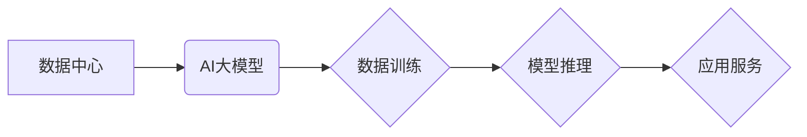

> AI大模型、数据中心、标准规范、架构设计、数据管理、安全保障、可扩展性、性能优化、成本控制

## 1. 背景介绍

近年来，人工智能（AI）技术取得了飞速发展，特别是大规模语言模型（LLM）的出现，为自然语言处理、计算机视觉、语音识别等领域带来了革命性的变革。这些强大的AI模型需要海量数据进行训练和推理，这推动了数据中心建设的快速发展。

传统的IT基础设施难以满足AI大模型的计算和存储需求，因此，需要构建专门针对AI大模型应用的数据中心，并制定相应的标准和规范，以确保数据中心的可靠性、安全性、可扩展性和高效性。

## 2. 核心概念与联系

**2.1 数据中心**

数据中心是集中式存储、处理和传输数据的设施，通常由服务器、存储设备、网络设备、电源系统和冷却系统等组成。

**2.2 AI大模型**

AI大模型是指参数量巨大、训练数据量庞大的深度学习模型，例如GPT-3、BERT、LaMDA等。这些模型具有强大的泛化能力和学习能力，能够在各种自然语言处理任务中取得优异的性能。

**2.3 关系图**



**2.4 核心概念联系**

数据中心为AI大模型提供计算、存储和网络资源，支持模型的训练和推理。AI大模型利用海量数据进行训练，并通过推理生成各种应用服务，例如文本生成、图像识别、语音合成等。

## 3. 核心算法原理 & 具体操作步骤

**3.1 算法原理概述**

AI大模型的训练主要基于深度学习算法，例如反向传播算法、梯度下降算法等。这些算法通过不断调整模型参数，使模型的预测结果与真实数据尽可能接近。

**3.2 算法步骤详解**

1. **数据预处理:** 将原始数据进行清洗、转换和格式化，使其适合模型训练。
2. **模型构建:** 根据任务需求选择合适的模型架构，并初始化模型参数。
3. **模型训练:** 使用训练数据对模型进行训练，通过反向传播算法不断调整模型参数，降低模型的损失函数值。
4. **模型评估:** 使用测试数据评估模型的性能，例如准确率、召回率、F1-score等。
5. **模型部署:** 将训练好的模型部署到生产环境中，用于进行推理和应用服务。

**3.3 算法优缺点**

**优点:**

* 强大的泛化能力和学习能力
* 可以处理复杂的数据模式
* 能够取得优异的性能

**缺点:**

* 训练数据量庞大
* 计算资源需求高
* 训练时间长

**3.4 算法应用领域**

* 自然语言处理：文本生成、机器翻译、问答系统、情感分析等
* 计算机视觉：图像识别、物体检测、图像分割等
* 语音识别：语音转文本、语音合成等
* 其他领域：推荐系统、医疗诊断、金融风险评估等

## 4. 数学模型和公式 & 详细讲解 & 举例说明

**4.1 数学模型构建**

AI大模型的训练过程可以看作是一个优化问题，目标是找到最优的模型参数，使得模型的预测结果与真实数据尽可能接近。

**4.2 公式推导过程**

损失函数是衡量模型预测结果与真实数据的差距的函数。常用的损失函数包括均方误差（MSE）、交叉熵损失（Cross-Entropy Loss）等。

**4.3 案例分析与讲解**

假设我们有一个二分类问题，模型预测结果为概率值，真实标签为0或1。可以使用交叉熵损失函数来衡量模型的预测结果与真实标签的差距。

**公式:**

$$
Loss = - \sum_{i=1}^{N} y_i \log(p_i) + (1-y_i) \log(1-p_i)
$$

其中：

* $N$ 是样本数量
* $y_i$ 是真实标签
* $p_i$ 是模型预测的概率值

**举例说明:**

假设我们有一个样本，真实标签为1，模型预测的概率值为0.8。则损失函数值为：

$$
Loss = - 1 \log(0.8) + (1-1) \log(1-0.8) = - \log(0.8)
$$

## 5. 项目实践：代码实例和详细解释说明

**5.1 开发环境搭建**

* 操作系统：Linux
* 编程语言：Python
* 深度学习框架：TensorFlow、PyTorch
* 硬件环境：GPU

**5.2 源代码详细实现**

```python
import tensorflow as tf

# 定义模型架构
model = tf.keras.models.Sequential([
    tf.keras.layers.Dense(128, activation='relu', input_shape=(784,)),
    tf.keras.layers.Dense(10, activation='softmax')
])

# 编译模型
model.compile(optimizer='adam',
              loss='sparse_categorical_crossentropy',
              metrics=['accuracy'])

# 训练模型
model.fit(x_train, y_train, epochs=10)

# 评估模型
loss, accuracy = model.evaluate(x_test, y_test)
print('Loss:', loss)
print('Accuracy:', accuracy)
```

**5.3 代码解读与分析**

* 代码首先定义了一个简单的多层感知机模型，包含两层全连接层。
* 然后使用Adam优化器、交叉熵损失函数和准确率指标对模型进行编译。
* 接着使用训练数据对模型进行训练，训练10个 epochs。
* 最后使用测试数据评估模型的性能，打印损失值和准确率。

**5.4 运行结果展示**

训练完成后，可以查看模型的损失值和准确率，并根据实际情况调整模型参数和训练策略。

## 6. 实际应用场景

**6.1 自然语言处理**

* 文本生成：使用AI大模型生成小说、诗歌、剧本等创意文本。
* 机器翻译：将文本从一种语言翻译成另一种语言。
* 问答系统：根据用户的问题，从知识库中检索并返回答案。

**6.2 计算机视觉**

* 图像识别：识别图像中的物体、场景和人物。
* 物体检测：在图像中定位和识别多个物体。
* 图像分割：将图像分割成不同的区域，例如前景和背景。

**6.3 语音识别**

* 语音转文本：将语音信号转换为文本。
* 语音合成：将文本转换为语音信号。

**6.4 其他领域**

* 推荐系统：根据用户的历史行为和偏好，推荐相关的商品或服务。
* 医疗诊断：辅助医生诊断疾病，例如分析医学影像和病历。
* 金融风险评估：评估客户的信用风险和投资风险。

**6.5 未来应用展望**

AI大模型的应用场景还在不断扩展，未来将应用于更多领域，例如自动驾驶、机器人、个性化教育等。

## 7. 工具和资源推荐

**7.1 学习资源推荐**

* 深度学习书籍：
    * 《深度学习》
    * 《动手学深度学习》
* 在线课程：
    * Coursera
    * edX
    * fast.ai

**7.2 开发工具推荐**

* 深度学习框架：
    * TensorFlow
    * PyTorch
* 数据处理工具：
    * Pandas
    * NumPy
* 可视化工具：
    * Matplotlib
    * Seaborn

**7.3 相关论文推荐**

* 《Attention Is All You Need》
* 《BERT: Pre-training of Deep Bidirectional Transformers for Language Understanding》
* 《GPT-3: Language Models are Few-Shot Learners》

## 8. 总结：未来发展趋势与挑战

**8.1 研究成果总结**

近年来，AI大模型取得了显著的进展，在各种应用领域取得了优异的性能。

**8.2 未来发展趋势**

* 模型规模和能力的进一步提升
* 模型训练效率的提高
* 模型解释性和可信度的增强
* 模型的安全性、隐私性和伦理性的保障

**8.3 面临的挑战**

* 数据获取和标注的成本
* 计算资源需求高
* 模型训练时间长
* 模型的解释性和可信度

**8.4 研究展望**

未来，AI大模型的研究将继续朝着更强大、更安全、更可解释的方向发展，并应用于更多领域，为人类社会带来更多福祉。

## 9. 附录：常见问题与解答

**9.1 如何选择合适的AI大模型？**

选择合适的AI大模型需要根据具体的应用场景和需求进行考虑，例如模型规模、参数量、训练数据量、性能指标等。

**9.2 如何训练AI大模型？**

训练AI大模型需要准备海量数据、强大的计算资源和专业的技术人员。

**9.3 如何部署AI大模型？**

部署AI大模型需要选择合适的硬件平台、软件环境和部署策略。

**9.4 如何评估AI大模型的性能？**

评估AI大模型的性能需要使用相应的指标，例如准确率、召回率、F1-score等。

**9.5 如何保障AI大模型的安全性？**

保障AI大模型的安全性需要采取相应的措施，例如数据加密、模型攻击防御等。


作者：禅与计算机程序设计艺术 / Zen and the Art of Computer Programming 
<end_of_turn>