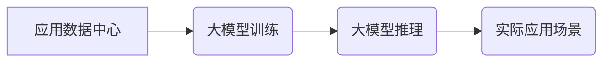

> AI大模型、应用数据中心、培训体系、人才培养、技术发展、行业应用、未来趋势

## 1. 背景介绍

近年来，人工智能（AI）技术取得了飞速发展，特别是大模型的涌现，为各行各业带来了前所未有的机遇。大模型的强大能力能够处理海量数据，学习复杂模式，并生成高质量的输出，在自然语言处理、计算机视觉、语音识别等领域展现出巨大的潜力。

然而，大模型的应用并非一蹴而就，需要专业的技术人才和完善的应用数据中心来支撑其落地和发展。应用数据中心作为大模型应用的基石，需要具备强大的计算能力、海量存储空间、高效的网络传输以及完善的管理和监控系统。同时，大模型的应用也需要大量的专业人才，包括AI算法工程师、数据科学家、软件工程师、系统架构师等，他们需要具备扎实的理论基础、丰富的实践经验以及对大模型应用场景的深刻理解。

## 2. 核心概念与联系

**2.1 应用数据中心**

应用数据中心是指专门为大模型应用而构建的计算平台，其核心功能包括：

* **高性能计算:** 提供强大的计算资源，支持大模型的训练和推理。
* **海量存储:** 存储海量数据，包括训练数据、模型参数以及应用数据。
* **高效网络:** 提供高速、低延迟的网络传输，保证数据传输的效率。
* **管理和监控:** 提供完善的管理和监控系统，实时监控平台运行状态，保障数据安全和应用稳定性。

**2.2 大模型应用**

大模型应用是指利用大模型的强大能力，解决实际问题，创造新的价值。常见的应用场景包括：

* **自然语言处理:** 文本生成、机器翻译、问答系统、情感分析等。
* **计算机视觉:** 图像识别、物体检测、图像分割、视频分析等。
* **语音识别:** 语音转文本、语音合成、语音助手等。
* **推荐系统:** 商品推荐、内容推荐、个性化服务等。

**2.3 核心概念关系图**



## 3. 核心算法原理 & 具体操作步骤

**3.1 算法原理概述**

大模型的训练主要基于深度学习算法，其中Transformer模型是目前最主流的架构。Transformer模型的核心思想是利用注意力机制，捕捉文本序列中不同词之间的依赖关系，从而实现更精准的理解和生成。

**3.2 算法步骤详解**

1. **数据预处理:** 将原始文本数据进行清洗、分词、词向量化等处理，使其能够被模型理解。
2. **模型构建:** 根据Transformer模型架构，搭建模型结构，包括编码器、解码器以及注意力机制等模块。
3. **模型训练:** 使用训练数据，通过反向传播算法，调整模型参数，使其能够准确地预测目标输出。
4. **模型评估:** 使用测试数据，评估模型的性能，例如准确率、召回率、F1-score等。
5. **模型部署:** 将训练好的模型部署到应用数据中心，用于实际应用场景。

**3.3 算法优缺点**

**优点:**

* 能够捕捉长距离依赖关系，提升文本理解能力。
* 训练效率高，能够处理海量数据。
* 应用场景广泛，在自然语言处理等领域取得了突破性进展。

**缺点:**

* 模型参数量大，训练和部署成本高。
* 对训练数据质量要求高，容易受到数据偏差的影响。
* 缺乏可解释性，难以理解模型的决策过程。

**3.4 算法应用领域**

* 自然语言处理: 文本生成、机器翻译、问答系统、情感分析等。
* 计算机视觉: 图像识别、物体检测、图像分割、视频分析等。
* 语音识别: 语音转文本、语音合成、语音助手等。
* 推荐系统: 商品推荐、内容推荐、个性化服务等。

## 4. 数学模型和公式 & 详细讲解 & 举例说明

**4.1 数学模型构建**

Transformer模型的核心是注意力机制，其数学模型可以表示为：

$$
Attention(Q, K, V) = softmax(\frac{QK^T}{\sqrt{d_k}})V
$$

其中：

* $Q$：查询矩阵
* $K$：键矩阵
* $V$：值矩阵
* $d_k$：键向量的维度
* $softmax$：softmax函数

**4.2 公式推导过程**

注意力机制的目的是计算每个词与其他词之间的相关性，并根据相关性加权求和，得到最终的输出。

1. 计算查询矩阵 $Q$ 与键矩阵 $K$ 的点积，得到一个得分矩阵。
2. 对得分矩阵进行归一化，使用softmax函数将得分转换为概率分布。
3. 将概率分布与值矩阵 $V$ 进行加权求和，得到最终的输出。

**4.3 案例分析与讲解**

假设我们有一个句子 "The cat sat on the mat"，我们想要计算 "cat" 与其他词之间的相关性。

1. 将每个词转换为向量表示，得到查询矩阵 $Q$、键矩阵 $K$ 和值矩阵 $V$。
2. 计算 $Q$ 与 $K$ 的点积，得到一个得分矩阵，其中每个元素表示 "cat" 与另一个词的相关性。
3. 对得分矩阵进行归一化，得到一个概率分布，表示 "cat" 与每个词的相关程度。
4. 将概率分布与 $V$ 进行加权求和，得到 "cat" 与整个句子的相关性表示。

## 5. 项目实践：代码实例和详细解释说明

**5.1 开发环境搭建**

* 操作系统: Ubuntu 20.04
* 编程语言: Python 3.8
* 深度学习框架: TensorFlow 2.x
* GPU: NVIDIA GeForce RTX 3090

**5.2 源代码详细实现**

```python
import tensorflow as tf

# 定义Transformer模型
class Transformer(tf.keras.Model):
    def __init__(self, vocab_size, embedding_dim, num_heads, num_layers):
        super(Transformer, self).__init__()
        self.embedding = tf.keras.layers.Embedding(vocab_size, embedding_dim)
        self.transformer_layers = tf.keras.layers.StackedRNNCells([
            tf.keras.layers.Attention(num_heads=num_heads)
            for _ in range(num_layers)
        ])

    def call(self, inputs):
        embeddings = self.embedding(inputs)
        outputs = self.transformer_layers(embeddings)
        return outputs

# 实例化模型
model = Transformer(vocab_size=10000, embedding_dim=128, num_heads=8, num_layers=6)

# 训练模型
model.compile(optimizer='adam', loss='mse')
model.fit(x_train, y_train, epochs=10)

# 推理模型
predictions = model.predict(x_test)
```

**5.3 代码解读与分析**

* 模型定义: 定义了一个Transformer模型，包含嵌入层、多头注意力层和循环神经网络层。
* 模型实例化: 实例化模型，设置模型参数。
* 模型训练: 使用Adam优化器和均方误差损失函数训练模型。
* 模型推理: 使用训练好的模型对测试数据进行预测。

**5.4 运行结果展示**

训练完成后，可以评估模型的性能，例如准确率、召回率、F1-score等。

## 6. 实际应用场景

**6.1 自然语言处理**

* **机器翻译:** 利用大模型翻译不同语言的文本。
* **问答系统:** 构建能够理解用户问题并给出准确答案的系统。
* **文本生成:** 生成高质量的文本内容，例如新闻报道、小说、诗歌等。

**6.2 计算机视觉**

* **图像识别:** 识别图像中的物体、场景和人物。
* **物体检测:** 在图像中定位和识别特定物体的边界框。
* **图像分割:** 将图像分割成不同的区域，例如前景和背景。

**6.3 语音识别**

* **语音转文本:** 将语音信号转换为文本。
* **语音合成:** 将文本转换为语音信号。
* **语音助手:** 构建能够理解用户语音指令并执行相应操作的系统。

**6.4 未来应用展望**

* **个性化教育:** 根据学生的学习情况，提供个性化的学习内容和辅导。
* **医疗诊断:** 利用大模型分析医学影像和病历，辅助医生进行诊断。
* **金融风险管理:** 利用大模型分析金融数据，识别潜在的风险。

## 7. 工具和资源推荐

**7.1 学习资源推荐**

* **书籍:**
    * 深度学习
    * 自然语言处理
    * 计算机视觉
* **在线课程:**
    * Coursera
    * edX
    * Udacity

**7.2 开发工具推荐**

* **深度学习框架:** TensorFlow, PyTorch, Keras
* **编程语言:** Python
* **云计算平台:** AWS, Azure, GCP

**7.3 相关论文推荐**

* Attention Is All You Need
* BERT: Pre-training of Deep Bidirectional Transformers for Language Understanding
* GPT-3: Language Models are Few-Shot Learners

## 8. 总结：未来发展趋势与挑战

**8.1 研究成果总结**

近年来，大模型在各个领域取得了显著的成果，例如自然语言处理、计算机视觉、语音识别等。大模型的强大能力为解决实际问题提供了新的思路和方法。

**8.2 未来发展趋势**

* **模型规模更大:** 随着计算能力的提升，大模型的规模将继续扩大，模型能力将进一步增强。
* **模型更加通用:** 研究更加通用的大模型，能够适应不同的应用场景。
* **模型更加可解释:** 研究更加可解释的大模型，能够更好地理解模型的决策过程。

**8.3 面临的挑战**

* **训练成本高:** 大模型的训练需要大量的计算资源和时间，成本较高。
* **数据安全问题:** 大模型的训练需要海量数据，数据安全问题需要得到重视。
* **伦理问题:** 大模型的应用可能带来一些伦理问题，例如偏见、歧视等，需要进行深入研究和探讨。

**8.4 研究展望**

未来，大模型的研究将继续深入，朝着更加通用、可解释、安全可靠的方向发展。大模型将为人类社会带来更多福祉，但也需要我们谨慎对待，确保其安全、伦理和可持续发展。

## 9. 附录：常见问题与解答

**9.1 如何选择合适的深度学习框架？**

选择深度学习框架需要根据具体项目需求和个人偏好。 TensorFlow 和 PyTorch 是目前最流行的框架，各有优缺点。 TensorFlow 更适合于生产环境，PyTorch 更灵活易用。

**9.2 如何训练大模型？**

训练大模型需要强大的计算资源、海量数据和专业的技术团队。可以使用云计算平台或搭建自己的数据中心。

**9.3 如何评估大模型的性能？**

大模型的性能可以通过多种指标进行评估，例如准确率、召回率、F1-score等。需要根据具体应用场景选择合适的评估指标。


作者：禅与计算机程序设计艺术 / Zen and the Art of Computer Programming 
<end_of_turn>